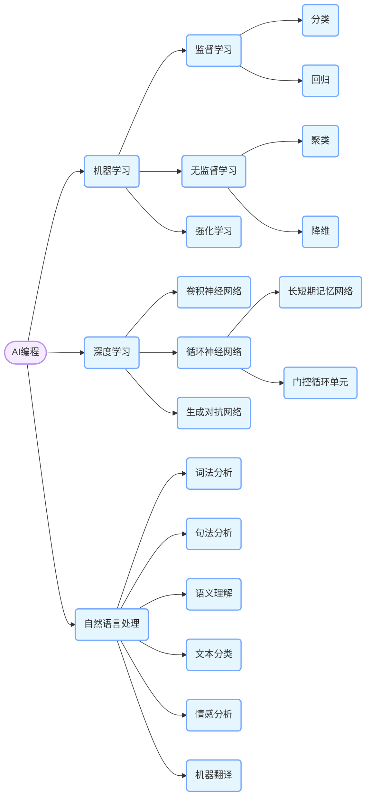

# AI编程的未来趋势：我们该如何抓住机遇？

> 关键词：AI编程、未来趋势、机遇、技术发展、编程策略

> 摘要：本文深入探讨了AI编程的未来发展趋势，旨在帮助开发者和相关从业者了解该领域的动态，并提供抓住机遇的具体策略。首先介绍了文章的背景信息，包括目的、预期读者等。接着阐述了AI编程的核心概念与联系，详细讲解了核心算法原理及操作步骤，并通过数学模型和公式进行深入分析。结合项目实战案例，对代码进行详细解读。然后列举了AI编程的实际应用场景，推荐了相关的工具和资源。最后总结了未来发展趋势与挑战，解答了常见问题，并提供了扩展阅读和参考资料，为读者全面了解AI编程的未来并抓住机遇提供了有价值的参考。

## 1. 背景介绍 
### 1.1 目的和范围
本文的主要目的是全面分析AI编程的未来趋势，并为开发者、技术爱好者、企业管理者等相关人员提供抓住这些趋势所带来机遇的有效方法。范围涵盖了AI编程的多个方面，包括核心概念、算法原理、实际应用场景、工具资源等，旨在帮助读者建立一个完整的知识体系，从而更好地应对未来AI编程领域的发展。

### 1.2 预期读者
本文预期读者包括但不限于以下几类人群：
- **开发者**：想要深入了解AI编程技术发展方向，提升自己在该领域编程能力的程序员。
- **技术爱好者**：对AI编程感兴趣，希望了解其未来趋势和应用前景的非专业人士。
- **企业管理者**：关注技术创新，希望通过引入AI编程技术提升企业竞争力的管理者。
- **科研人员**：从事AI相关研究，需要了解行业动态和前沿技术的科研工作者。

### 1.3 文档结构概述
本文按照以下结构进行组织：
- 核心概念与联系：介绍AI编程的核心概念及其相互关系，通过文本示意图和Mermaid流程图进行直观展示。
- 核心算法原理 & 具体操作步骤：详细讲解AI编程中常用的核心算法原理，并使用Python源代码进行具体实现和解释。
- 数学模型和公式 & 详细讲解 & 举例说明：运用数学模型和公式对AI编程的原理进行深入分析，并通过具体例子进行说明。
- 项目实战：代码实际案例和详细解释说明：通过实际项目案例，展示AI编程的实际应用，包括开发环境搭建、源代码实现和代码解读。
- 实际应用场景：列举AI编程在不同领域的实际应用场景。
- 工具和资源推荐：推荐学习AI编程的相关书籍、在线课程、技术博客和网站，以及开发工具、框架和相关论文著作。
- 总结：未来发展趋势与挑战：总结AI编程的未来发展趋势，并分析可能面临的挑战。
- 附录：常见问题与解答：解答读者在AI编程学习和实践中常见的问题。
- 扩展阅读 & 参考资料：提供进一步学习和研究的扩展阅读材料和参考资料。

### 1.4 术语表
#### 1.4.1 核心术语定义
- **AI编程**：指利用人工智能技术进行软件开发和编程的过程，包括机器学习、深度学习、自然语言处理等技术的应用。
- **机器学习**：是一门多领域交叉学科，涉及概率论、统计学、逼近论、凸分析、算法复杂度理论等多门学科。它专门研究计算机怎样模拟或实现人类的学习行为，以获取新的知识或技能，重新组织已有的知识结构使之不断改善自身的性能。
- **深度学习**：是机器学习的一个分支领域，它是一种基于对数据进行表征学习的方法。深度学习通过构建具有很多层的神经网络模型，自动从大量数据中学习特征和模式。
- **自然语言处理**：是计算机科学与人工智能领域中的一个重要方向。它研究能实现人与计算机之间用自然语言进行有效通信的各种理论和方法，包括文本分类、情感分析、机器翻译等。

#### 1.4.2 相关概念解释
- **神经网络**：是一种模仿人类神经系统的计算模型，由大量的神经元组成。神经网络可以自动从数据中学习特征和模式，广泛应用于图像识别、语音识别等领域。
- **强化学习**：是一种机器学习方法，通过智能体（agent）与环境进行交互，根据环境反馈的奖励信号来学习最优的行为策略。
- **生成对抗网络（GAN）**：由生成器和判别器两个神经网络组成，生成器负责生成数据，判别器负责判断数据的真实性。GAN在图像生成、数据增强等方面有广泛应用。

#### 1.4.3 缩略词列表
- **ML**：Machine Learning，机器学习
- **DL**：Deep Learning，深度学习
- **NLP**：Natural Language Processing，自然语言处理
- **GAN**：Generative Adversarial Networks，生成对抗网络

## 2. 核心概念与联系 
### 核心概念原理
AI编程涉及多个核心概念，其中机器学习、深度学习和自然语言处理是最为重要的几个方面。

#### 机器学习
机器学习的核心思想是让计算机从数据中学习规律和模式，从而对未知数据进行预测和分类。其基本流程包括数据收集、数据预处理、模型选择与训练、模型评估与优化等步骤。例如，在一个简单的垃圾邮件分类任务中，我们首先收集大量的邮件数据，然后对数据进行清洗和特征提取，接着选择合适的分类模型（如决策树、支持向量机等）进行训练，最后评估模型的性能并进行优化。

#### 深度学习
深度学习是机器学习的一个高级分支，它通过构建深层神经网络来学习数据的复杂特征和模式。深度学习模型通常具有多个隐藏层，可以自动从原始数据中提取高级特征。例如，在图像识别任务中，卷积神经网络（CNN）可以自动学习图像的纹理、边缘等特征，从而实现对图像的准确分类。

#### 自然语言处理
自然语言处理旨在让计算机理解和处理人类语言。它涉及到多个任务，如文本分类、情感分析、机器翻译等。自然语言处理的核心技术包括词法分析、句法分析、语义理解等。例如，在情感分析任务中，我们可以使用深度学习模型对文本中的情感倾向进行分类，判断文本是积极的、消极的还是中性的。

### 架构的文本示意图
以下是AI编程核心概念之间的关系示意图：

AI编程
|-- 机器学习
|   |-- 监督学习
|   |   |-- 分类
|   |   |-- 回归
|   |-- 无监督学习
|   |   |-- 聚类
|   |   |-- 降维
|   |-- 强化学习
|
|-- 深度学习
|   |-- 卷积神经网络（CNN）
|   |-- 循环神经网络（RNN）
|   |   |-- 长短期记忆网络（LSTM）
|   |   |-- 门控循环单元（GRU）
|   |-- 生成对抗网络（GAN）
|
|-- 自然语言处理
|   |-- 词法分析
|   |-- 句法分析
|   |-- 语义理解
|   |-- 文本分类
|   |-- 情感分析
|   |-- 机器翻译

### Mermaid流程图


## 3. 核心算法原理 & 具体操作步骤 
### 监督学习算法 - 线性回归
#### 算法原理
线性回归是一种用于预测连续数值的监督学习算法。它的基本思想是通过找到一条最佳的直线（或超平面）来拟合数据，使得数据点到直线的距离之和最小。线性回归的数学模型可以表示为：

$$y = \theta_0 + \theta_1x_1 + \theta_2x_2 + \cdots + \theta_nx_n$$

其中，$y$ 是预测值，$x_1, x_2, \cdots, x_n$ 是输入特征，$\theta_0, \theta_1, \theta_2, \cdots, \theta_n$ 是模型的参数。

#### Python源代码实现
```python
import numpy as np
from sklearn.linear_model import LinearRegression
from sklearn.model_selection import train_test_split
from sklearn.metrics import mean_squared_error

# 生成示例数据
np.random.seed(0)
X = 2 * np.random.rand(100, 1)
y = 4 + 3 * X + np.random.randn(100, 1)

# 划分训练集和测试集
X_train, X_test, y_train, y_test = train_test_split(X, y, test_size=0.2, random_state=42)

# 创建线性回归模型
model = LinearRegression()

# 训练模型
model.fit(X_train, y_train)

# 预测
y_pred = model.predict(X_test)

# 计算均方误差
mse = mean_squared_error(y_test, y_pred)
print(f"均方误差: {mse}")
```

#### 具体操作步骤
1. **数据生成**：使用 `numpy` 生成示例数据。
2. **数据划分**：使用 `train_test_split` 函数将数据划分为训练集和测试集。
3. **模型创建**：创建 `LinearRegression` 模型对象。
4. **模型训练**：使用 `fit` 方法对模型进行训练。
5. **模型预测**：使用 `predict` 方法对测试集进行预测。
6. **模型评估**：使用 `mean_squared_error` 函数计算预测结果的均方误差。

### 无监督学习算法 - K-Means聚类
#### 算法原理
K-Means聚类是一种用于将数据划分为不同簇的无监督学习算法。它的基本思想是通过迭代的方式将数据点分配到不同的簇中，使得每个簇内的数据点之间的距离最小，而不同簇之间的数据点之间的距离最大。K-Means聚类的具体步骤如下：
1. 随机选择 $k$ 个中心点。
2. 将每个数据点分配到距离最近的中心点所在的簇中。
3. 更新每个簇的中心点。
4. 重复步骤2和3，直到中心点不再发生变化或达到最大迭代次数。

#### Python源代码实现
```python
import numpy as np
from sklearn.cluster import KMeans
from sklearn.datasets import make_blobs
import matplotlib.pyplot as plt

# 生成示例数据
X, y = make_blobs(n_samples=300, centers=4, cluster_std=0.60, random_state=0)

# 创建K-Means模型
model = KMeans(n_clusters=4, random_state=42)

# 训练模型
model.fit(X)

# 获取聚类标签
labels = model.labels_

# 获取聚类中心
centroids = model.cluster_centers_

# 可视化结果
plt.scatter(X[:, 0], X[:, 1], c=labels, s=50, cmap='viridis')
plt.scatter(centroids[:, 0], centroids[:, 1], c='red', s=200, alpha=0.5)
plt.show()
```

#### 具体操作步骤
1. **数据生成**：使用 `make_blobs` 函数生成示例数据。
2. **模型创建**：创建 `KMeans` 模型对象，指定簇的数量。
3. **模型训练**：使用 `fit` 方法对模型进行训练。
4. **获取聚类结果**：使用 `labels_` 属性获取每个数据点的聚类标签，使用 `cluster_centers_` 属性获取每个簇的中心点。
5. **可视化结果**：使用 `matplotlib` 库将聚类结果可视化。

## 4. 数学模型和公式 & 详细讲解 & 举例说明 
### 线性回归的数学模型和公式
#### 数学模型
线性回归的数学模型可以表示为：

$$y = \theta_0 + \theta_1x_1 + \theta_2x_2 + \cdots + \theta_nx_n + \epsilon$$

其中，$y$ 是预测值，$x_1, x_2, \cdots, x_n$ 是输入特征，$\theta_0, \theta_1, \theta_2, \cdots, \theta_n$ 是模型的参数，$\epsilon$ 是误差项。

#### 目标函数
线性回归的目标是找到一组参数 $\theta$，使得预测值 $y$ 与真实值 $\hat{y}$ 之间的误差最小。通常使用均方误差（MSE）作为目标函数：

$$MSE = \frac{1}{m} \sum_{i=1}^{m} (y^{(i)} - \hat{y}^{(i)})^2$$

其中，$m$ 是样本数量，$y^{(i)}$ 是第 $i$ 个样本的真实值，$\hat{y}^{(i)}$ 是第 $i$ 个样本的预测值。

#### 求解方法
可以使用最小二乘法来求解线性回归的参数。最小二乘法的目标是最小化均方误差，通过对目标函数求偏导数并令其等于0，可以得到参数的最优解：

$$\theta = (X^T X)^{-1} X^T y$$

其中，$X$ 是输入特征矩阵，$y$ 是真实值向量。

#### 举例说明
假设有一组数据 $(x_1, y_1), (x_2, y_2), \cdots, (x_m, y_m)$，我们希望使用线性回归模型来预测 $y$ 的值。输入特征矩阵 $X$ 可以表示为：

$$X = \begin{bmatrix}
1 & x_1 \\
1 & x_2 \\
\vdots & \vdots \\
1 & x_m
\end{bmatrix}$$

真实值向量 $y$ 可以表示为：

$$y = \begin{bmatrix}
y_1 \\
y_2 \\
\vdots \\
y_m
\end{bmatrix}$$

根据最小二乘法的公式，我们可以计算出参数 $\theta$ 的值，从而得到线性回归模型的表达式。

### 逻辑回归的数学模型和公式
#### 数学模型
逻辑回归是一种用于分类的监督学习算法，它的输出是一个概率值。逻辑回归的数学模型可以表示为：

$$P(y=1|x) = \frac{1}{1 + e^{-(\theta_0 + \theta_1x_1 + \theta_2x_2 + \cdots + \theta_nx_n)}}$$

其中，$P(y=1|x)$ 是给定输入特征 $x$ 时，样本属于正类的概率，$\theta_0, \theta_1, \theta_2, \cdots, \theta_n$ 是模型的参数。

#### 目标函数
逻辑回归的目标是找到一组参数 $\theta$，使得模型的预测结果与真实标签之间的误差最小。通常使用对数损失函数（也称为交叉熵损失函数）作为目标函数：

$$J(\theta) = -\frac{1}{m} \sum_{i=1}^{m} [y^{(i)} \log(P(y^{(i)}=1|x^{(i)})) + (1 - y^{(i)}) \log(1 - P(y^{(i)}=1|x^{(i)}))]$$

其中，$m$ 是样本数量，$y^{(i)}$ 是第 $i$ 个样本的真实标签，$P(y^{(i)}=1|x^{(i)})$ 是第 $i$ 个样本属于正类的概率。

#### 求解方法
可以使用梯度下降法来求解逻辑回归的参数。梯度下降法的基本思想是通过不断迭代更新参数，使得目标函数的值逐渐减小。具体步骤如下：
1. 初始化参数 $\theta$。
2. 计算目标函数的梯度。
3. 更新参数 $\theta$：

$$\theta := \theta - \alpha \nabla J(\theta)$$

其中，$\alpha$ 是学习率，$\nabla J(\theta)$ 是目标函数的梯度。
4. 重复步骤2和3，直到目标函数的值收敛或达到最大迭代次数。

#### 举例说明
假设有一组二分类数据 $(x_1, y_1), (x_2, y_2), \cdots, (x_m, y_m)$，我们希望使用逻辑回归模型来预测样本的类别。输入特征矩阵 $X$ 和真实标签向量 $y$ 的表示方法与线性回归相同。通过梯度下降法不断更新参数 $\theta$，可以得到逻辑回归模型的最优参数，从而实现对样本类别的预测。

## 5. 项目实战：代码实际案例和详细解释说明 
### 5.1  开发环境搭建
#### 安装Python
首先，需要安装Python环境。可以从Python官方网站（https://www.python.org/downloads/） 下载适合自己操作系统的Python版本，并按照安装向导进行安装。

#### 安装必要的库
在AI编程中，常用的库包括 `numpy`、`pandas`、`scikit-learn`、`tensorflow`、`pytorch` 等。可以使用 `pip` 命令来安装这些库：

```bash
pip install numpy pandas scikit-learn tensorflow pytorch
```

#### 选择开发工具
可以选择适合自己的开发工具，如Jupyter Notebook、PyCharm等。Jupyter Notebook是一个交互式的开发环境，适合进行数据探索和模型实验；PyCharm是一个功能强大的Python集成开发环境，适合进行大型项目的开发。

### 5.2  源代码详细实现和代码解读
#### 项目描述
我们将实现一个简单的手写数字识别项目，使用MNIST数据集。MNIST数据集包含了60000个训练样本和10000个测试样本，每个样本是一个28x28的灰度图像，代表了0-9之间的一个数字。

#### 代码实现
```python
import tensorflow as tf
from tensorflow.keras.datasets import mnist
from tensorflow.keras.models import Sequential
from tensorflow.keras.layers import Flatten, Dense
from tensorflow.keras.utils import to_categorical
import matplotlib.pyplot as plt

# 加载MNIST数据集
(x_train, y_train), (x_test, y_test) = mnist.load_data()

# 数据预处理
x_train = x_train / 255.0
x_test = x_test / 255.0

y_train = to_categorical(y_train)
y_test = to_categorical(y_test)

# 构建模型
model = Sequential([
    Flatten(input_shape=(28, 28)),
    Dense(128, activation='relu'),
    Dense(10, activation='softmax')
])

# 编译模型
model.compile(optimizer='adam',
              loss='categorical_crossentropy',
              metrics=['accuracy'])

# 训练模型
history = model.fit(x_train, y_train, epochs=5, validation_data=(x_test, y_test))

# 评估模型
test_loss, test_acc = model.evaluate(x_test, y_test)
print(f"测试集损失: {test_loss}, 测试集准确率: {test_acc}")

# 可视化训练过程
plt.plot(history.history['accuracy'])
plt.plot(history.history['val_accuracy'])
plt.title('Model accuracy')
plt.ylabel('Accuracy')
plt.xlabel('Epoch')
plt.legend(['Train', 'Test'], loc='upper left')
plt.show()

plt.plot(history.history['loss'])
plt.plot(history.history['val_loss'])
plt.title('Model loss')
plt.ylabel('Loss')
plt.xlabel('Epoch')
plt.legend(['Train', 'Test'], loc='upper left')
plt.show()
```

#### 代码解读
1. **数据加载**：使用 `mnist.load_data()` 函数加载MNIST数据集。
2. **数据预处理**：将图像像素值归一化到0-1之间，并将标签进行one-hot编码。
3. **模型构建**：使用 `Sequential` 模型构建一个简单的神经网络，包含一个Flatten层、一个全连接层和一个输出层。
4. **模型编译**：使用 `compile` 方法指定优化器、损失函数和评估指标。
5. **模型训练**：使用 `fit` 方法对模型进行训练，并记录训练过程中的损失和准确率。
6. **模型评估**：使用 `evaluate` 方法对模型在测试集上的性能进行评估。
7. **可视化训练过程**：使用 `matplotlib` 库将训练过程中的损失和准确率进行可视化。

### 5.3  代码解读与分析
#### 模型结构分析
- **Flatten层**：将输入的28x28图像展平为一维向量，方便后续的全连接层处理。
- **Dense层**：全连接层，包含128个神经元，使用ReLU激活函数。ReLU激活函数可以引入非线性，增强模型的表达能力。
- **输出层**：包含10个神经元，使用Softmax激活函数。Softmax函数可以将输出转换为概率分布，用于多分类任务。

#### 损失函数和优化器选择
- **损失函数**：使用 `categorical_crossentropy` 作为损失函数，适用于多分类任务。
- **优化器**：使用 `adam` 优化器，它结合了Adagrad和RMSProp的优点，能够自适应地调整学习率。

#### 训练过程分析
通过观察训练过程中的损失和准确率曲线，可以判断模型是否过拟合或欠拟合。如果训练集准确率远高于测试集准确率，可能存在过拟合问题；如果训练集和测试集准确率都较低，可能存在欠拟合问题。可以通过调整模型结构、增加数据量、使用正则化等方法来解决这些问题。

## 6. 实际应用场景 
### 医疗领域
- **疾病诊断**：AI编程可以帮助医生分析医学影像（如X光、CT、MRI等），辅助诊断疾病。例如，使用深度学习模型可以检测肺部结节、识别肿瘤等。
- **药物研发**：通过对大量的生物数据进行分析，AI编程可以帮助研究人员发现新的药物靶点，加速药物研发过程。
- **健康管理**：利用AI技术可以对患者的健康数据进行监测和分析，提供个性化的健康建议和预警。

### 金融领域
- **风险评估**：AI编程可以分析客户的信用数据、交易记录等，评估客户的信用风险，为金融机构提供决策支持。
- **投资决策**：通过对市场数据的分析和预测，AI模型可以帮助投资者制定投资策略，提高投资回报率。
- **欺诈检测**：利用机器学习算法可以实时监测金融交易，识别欺诈行为，保障金融安全。

### 交通领域
- **自动驾驶**：AI编程是自动驾驶技术的核心，通过传感器获取环境信息，使用深度学习模型进行目标检测、路径规划等，实现车辆的自主行驶。
- **智能交通管理**：利用AI技术可以对交通流量进行实时监测和分析，优化交通信号控制，提高交通效率。
- **物流配送**：通过对物流数据的分析，AI编程可以优化配送路线，提高物流配送效率。

### 教育领域
- **个性化学习**：AI编程可以根据学生的学习数据和行为习惯，为学生提供个性化的学习方案和辅导。
- **智能评估**：利用自然语言处理技术可以对学生的作业、考试等进行自动评估，提高评估效率和准确性。
- **虚拟教学助手**：开发虚拟教学助手，为学生提供实时的答疑解惑服务。

## 7. 工具和资源推荐
### 7.1 学习资源推荐
#### 7.1.1 书籍推荐
- 《Python机器学习》：本书详细介绍了Python在机器学习中的应用，包括机器学习的基本概念、算法原理和实际案例。
- 《深度学习》：由深度学习领域的三位顶尖专家Ian Goodfellow、Yoshua Bengio和Aaron Courville撰写，是深度学习领域的经典教材。
- 《自然语言处理入门》：适合初学者入门自然语言处理领域，介绍了自然语言处理的基本概念、技术和应用。

#### 7.1.2 在线课程
- Coursera上的《机器学习》课程：由Andrew Ng教授讲授，是机器学习领域的经典课程，涵盖了机器学习的基本概念、算法和应用。
- edX上的《深度学习》课程：由MIT的教授讲授，深入介绍了深度学习的原理和应用。
- 阿里云天池的AI实战营：提供了丰富的AI实战项目和教程，帮助学习者快速掌握AI编程技能。

#### 7.1.3 技术博客和网站
- Medium：上面有很多AI领域的优秀博客文章，涵盖了最新的技术动态和研究成果。
- Towards Data Science：专注于数据科学和机器学习领域，提供了大量的技术文章和案例分析。
- AI研习社：国内的AI技术社区，提供了丰富的学习资源和交流平台。

### 7.2 开发工具框架推荐
#### 7.2.1 IDE和编辑器
- PyCharm：功能强大的Python集成开发环境，支持代码调试、自动补全、版本控制等功能。
- Jupyter Notebook：交互式的开发环境，适合进行数据探索和模型实验，支持多种编程语言。
- Visual Studio Code：轻量级的代码编辑器，支持多种编程语言和插件扩展。

#### 7.2.2 调试和性能分析工具
- TensorBoard：TensorFlow提供的可视化工具，可以帮助开发者可视化模型的训练过程、性能指标等。
- PyTorch Profiler：PyTorch提供的性能分析工具，可以帮助开发者分析模型的性能瓶颈。
- cProfile：Python内置的性能分析工具，可以帮助开发者分析代码的运行时间和调用关系。

#### 7.2.3 相关框架和库
- TensorFlow：Google开发的开源深度学习框架，支持多种深度学习模型和算法，具有高效的分布式训练能力。
- PyTorch：Facebook开发的开源深度学习框架，具有动态图机制，适合快速原型开发和研究。
- Scikit-learn：Python的机器学习库，提供了丰富的机器学习算法和工具，如分类、回归、聚类等。

### 7.3 相关论文著作推荐
#### 7.3.1 经典论文
- 《Gradient-Based Learning Applied to Document Recognition》：介绍了卷积神经网络（CNN）在手写数字识别中的应用，是CNN领域的经典论文。
- 《Long Short-Term Memory》：提出了长短期记忆网络（LSTM），解决了传统循环神经网络（RNN）的梯度消失问题。
- 《Generative Adversarial Nets》：提出了生成对抗网络（GAN），开创了生成式模型的新领域。

#### 7.3.2 最新研究成果
- arXiv：一个预印本平台，上面有很多AI领域的最新研究成果和论文。
- NeurIPS、ICML、CVPR等顶级学术会议：每年都会发表大量的AI领域的最新研究成果。

#### 7.3.3 应用案例分析
- 《AI in Healthcare: A Comprehensive Overview》：介绍了AI在医疗领域的应用案例和研究进展。
- 《AI in Finance: Transforming the Financial Industry》：分析了AI在金融领域的应用场景和挑战。

## 8. 总结：未来发展趋势与挑战
### 未来发展趋势
#### 多模态融合
未来的AI编程将更加注重多模态数据的融合，如将图像、语音、文本等多种数据类型结合起来进行分析和处理，以实现更复杂的任务，如智能对话、视频理解等。

#### 强化学习与自主系统
强化学习将在自主系统中发挥越来越重要的作用，如自动驾驶、机器人控制等。通过与环境进行交互和学习，智能体可以不断优化自己的行为策略，实现更加智能的决策和控制。

#### 边缘AI
随着物联网的发展，边缘设备（如智能手机、传感器等）的计算能力不断提高。边缘AI将成为未来的一个重要发展方向，通过在边缘设备上运行AI模型，可以减少数据传输延迟，提高系统的实时性和隐私性。

#### 可解释AI
随着AI技术的广泛应用，可解释AI变得越来越重要。未来的AI编程将更加注重模型的可解释性，使得开发者和用户能够理解模型的决策过程和依据，提高模型的可信度和安全性。

### 挑战
#### 数据隐私和安全
AI编程需要大量的数据来训练模型，而这些数据往往包含用户的个人隐私信息。如何保护数据的隐私和安全是一个亟待解决的问题。

#### 算法偏见
由于训练数据的局限性和模型的复杂性，AI算法可能存在偏见。算法偏见可能导致不公平的决策和结果，对社会造成负面影响。

#### 人才短缺
AI编程是一个新兴的领域，需要具备多学科知识和技能的人才。目前，AI领域的人才短缺问题比较严重，制约了AI技术的发展。

#### 伦理和法律问题
随着AI技术的不断发展，伦理和法律问题也日益凸显。例如，AI系统的责任归属、AI决策的合法性等问题都需要进一步探讨和解决。

## 9. 附录：常见问题与解答
### 问题1：学习AI编程需要具备哪些基础知识？
学习AI编程需要具备一定的数学基础，如线性代数、概率论、统计学等，以及编程基础，如Python语言。此外，还需要了解机器学习、深度学习等相关概念和算法。

### 问题2：如何选择适合自己的AI编程框架？
选择适合自己的AI编程框架需要考虑以下因素：
- 学习成本：不同的框架学习难度不同，初学者可以选择相对简单的框架，如Scikit-learn。
- 应用场景：不同的框架适用于不同的应用场景，如TensorFlow适合大规模分布式训练，PyTorch适合快速原型开发。
- 社区支持：选择社区活跃、文档丰富的框架，便于学习和解决问题。

### 问题3：如何解决AI模型的过拟合问题？
解决AI模型过拟合问题的方法有很多，常见的方法包括：
- 增加数据量：通过收集更多的数据来训练模型，减少模型对训练数据的过拟合。
- 正则化：在模型的损失函数中加入正则化项，限制模型的复杂度。
- 早停法：在模型训练过程中，当验证集的性能不再提升时，提前停止训练。
- 模型融合：将多个不同的模型进行融合，提高模型的泛化能力。

### 问题4：AI编程在实际应用中面临哪些挑战？
AI编程在实际应用中面临的挑战包括数据隐私和安全、算法偏见、人才短缺、伦理和法律问题等。需要开发者和相关人员共同努力，采取有效的措施来解决这些问题。

## 10. 扩展阅读 & 参考资料
### 扩展阅读
- 《AI未来进行式》：李开复和王咏刚所著，探讨了AI技术的发展趋势和应用前景。
- 《生命3.0：人工智能时代人类的进化与重生》：迈克斯·泰格马克所著，思考了AI对人类未来的影响。

### 参考资料
- 《Python机器学习实战》：Sebastian Raschka所著，提供了大量的Python代码示例和实战案例。
- 《深度学习实战：基于Python的理论与实现》：斋藤康毅所著，适合初学者入门深度学习。
- 各大AI技术社区和官方文档，如TensorFlow官方文档、PyTorch官方文档等。