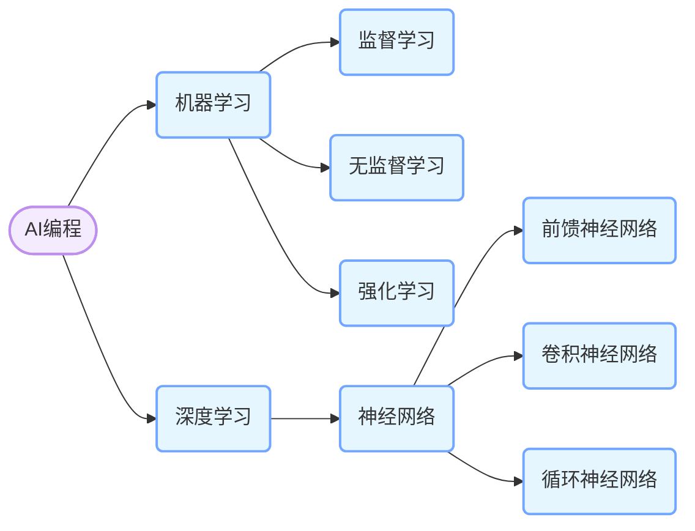

# AI编程：从理论到实践

> 关键词：AI编程、理论基础、实践操作、算法原理、应用场景

> 摘要：本文旨在全面介绍AI编程从理论到实践的过程。首先阐述了AI编程的背景知识，包括目的范围、预期读者等内容。接着详细讲解了AI编程的核心概念、算法原理、数学模型等基础理论。通过项目实战展示了如何将理论应用到实际代码中，并分析了代码的实现和运行。还探讨了AI编程在不同领域的实际应用场景，推荐了相关的学习工具、资源和论文著作。最后总结了AI编程的未来发展趋势与挑战，并提供了常见问题解答和扩展阅读参考资料，帮助读者系统地掌握AI编程从理论到实践的全流程。

## 1. 背景介绍 
### 1.1 目的和范围
AI编程在当今科技领域占据着至关重要的地位，其应用范围广泛，涵盖了图像识别、自然语言处理、自动驾驶等众多领域。本文的目的在于为读者搭建一个从理论到实践的完整学习框架，帮助读者深入理解AI编程的核心概念、算法原理，并通过实际项目案例掌握AI编程的实践技巧。范围包括常见的AI编程算法，如机器学习中的监督学习、无监督学习算法，深度学习中的神经网络等，以及如何使用Python等编程语言实现这些算法，并将其应用到实际问题中。

### 1.2 预期读者
本文预期读者包括对AI编程感兴趣的初学者、计算机科学相关专业的学生、想要提升技能的程序员以及对AI技术有一定了解但希望深入实践的技术爱好者。无论你是刚刚接触AI领域，还是已经有了一些基础，都能从本文中获取有价值的信息。

### 1.3 文档结构概述
本文将按照以下结构展开：首先介绍AI编程的核心概念和它们之间的联系，通过文本示意图和Mermaid流程图进行清晰展示；接着详细讲解核心算法原理，并使用Python源代码进行具体实现；阐述相关的数学模型和公式，并通过举例加深理解；进行项目实战，包括开发环境搭建、源代码实现和解读；探讨AI编程在实际中的应用场景；推荐学习所需的工具和资源；最后总结未来发展趋势与挑战，提供常见问题解答和扩展阅读参考资料。

### 1.4 术语表
#### 1.4.1 核心术语定义
- **AI编程**：指使用计算机编程语言实现人工智能算法和模型，以解决各种实际问题的过程。
- **机器学习**：是一门多领域交叉学科，涉及概率论、统计学、逼近论、凸分析、算法复杂度理论等多门学科。它专门研究计算机怎样模拟或实现人类的学习行为，以获取新的知识或技能，重新组织已有的知识结构使之不断改善自身的性能。
- **深度学习**：是机器学习的一个分支领域，它是一种基于对数据进行表征学习的方法。深度学习通过构建具有很多层的神经网络模型，自动从大量数据中学习特征和模式。
- **神经网络**：是一种模仿人类神经系统的计算模型，由大量的神经元组成，这些神经元通过连接形成网络结构，用于处理和分析数据。

#### 1.4.2 相关概念解释
- **监督学习**：是机器学习中的一种学习方式，在监督学习中，训练数据包含输入数据和对应的输出标签。模型通过学习输入数据和输出标签之间的关系，来对新的输入数据进行预测。
- **无监督学习**：训练数据只包含输入数据，没有对应的输出标签。模型的任务是从输入数据中发现潜在的结构和模式，如聚类分析、降维等。
- **强化学习**：智能体通过与环境进行交互，根据环境反馈的奖励信号来学习最优的行为策略，以最大化长期累积奖励。

#### 1.4.3 缩略词列表
- **AI**：Artificial Intelligence，人工智能
- **ML**：Machine Learning，机器学习
- **DL**：Deep Learning，深度学习
- **ANN**：Artificial Neural Network，人工神经网络
- **CNN**：Convolutional Neural Network，卷积神经网络
- **RNN**：Recurrent Neural Network，循环神经网络

## 2. 核心概念与联系 
在AI编程中，有几个核心概念起着关键作用，它们之间相互关联，共同构成了AI编程的基础。下面我们将详细介绍这些核心概念的原理和架构，并通过文本示意图和Mermaid流程图进行展示。

### 核心概念原理
#### 机器学习
机器学习是AI编程的重要组成部分，它的基本原理是通过对大量数据的学习，让模型自动发现数据中的规律和模式。常见的机器学习算法包括决策树、支持向量机、朴素贝叶斯等。机器学习可以分为监督学习、无监督学习和强化学习。

#### 深度学习
深度学习是机器学习的一个子领域，它通过构建深度神经网络来学习数据的特征表示。深度神经网络通常由多个隐藏层组成，每个隐藏层对输入数据进行不同层次的特征提取和转换。深度学习在图像识别、语音识别、自然语言处理等领域取得了巨大的成功。

#### 神经网络
神经网络是深度学习的核心模型，它由神经元组成。神经元是神经网络的基本计算单元，它接收输入信号，经过加权求和和激活函数处理后，输出一个信号。多个神经元通过连接形成网络结构，信息在网络中逐层传递和处理。

### 架构的文本示意图
AI编程的核心概念架构可以用以下文本示意图表示：

AI编程
|-- 机器学习
|   |-- 监督学习
|   |-- 无监督学习
|   |-- 强化学习
|-- 深度学习
|   |-- 神经网络
|       |-- 前馈神经网络
|       |-- 卷积神经网络
|       |-- 循环神经网络

### Mermaid流程图


## 3. 核心算法原理 & 具体操作步骤 
在AI编程中，有许多核心算法，下面我们将以监督学习中的线性回归算法为例，详细讲解其原理和具体操作步骤，并使用Python源代码进行实现。

### 线性回归算法原理
线性回归是一种用于建立自变量和因变量之间线性关系的统计模型。其基本假设是因变量 $y$ 与自变量 $x$ 之间存在线性关系，可以表示为：

$$y = \theta_0 + \theta_1x_1 + \theta_2x_2 + \cdots + \theta_nx_n + \epsilon$$

其中，$\theta_0, \theta_1, \cdots, \theta_n$ 是模型的参数，$\epsilon$ 是误差项。线性回归的目标是通过训练数据找到最优的参数 $\theta$，使得模型的预测值与真实值之间的误差最小。常用的误差度量方法是均方误差（Mean Squared Error，MSE）：

$$MSE = \frac{1}{m}\sum_{i=1}^{m}(y^{(i)} - \hat{y}^{(i)})^2$$

其中，$m$ 是样本数量，$y^{(i)}$ 是第 $i$ 个样本的真实值，$\hat{y}^{(i)}$ 是第 $i$ 个样本的预测值。

### 具体操作步骤
1. **数据准备**：收集和整理训练数据，将其分为自变量 $X$ 和因变量 $y$。
2. **初始化参数**：随机初始化模型的参数 $\theta$。
3. **计算预测值**：根据当前的参数 $\theta$ 和自变量 $X$，计算模型的预测值 $\hat{y}$。
4. **计算误差**：使用均方误差计算预测值与真实值之间的误差。
5. **更新参数**：使用梯度下降法更新参数 $\theta$，使得误差逐渐减小。
6. **重复步骤3 - 5**：直到误差收敛或达到最大迭代次数。

### Python源代码实现
```python
import numpy as np

class LinearRegression:
    def __init__(self, learning_rate=0.01, num_iterations=1000):
        self.learning_rate = learning_rate
        self.num_iterations = num_iterations
        self.weights = None
        self.bias = None

    def fit(self, X, y):
        num_samples, num_features = X.shape
        self.weights = np.zeros(num_features)
        self.bias = 0

        for _ in range(self.num_iterations):
            y_pred = np.dot(X, self.weights) + self.bias

            dw = (1 / num_samples) * np.dot(X.T, (y_pred - y))
            db = (1 / num_samples) * np.sum(y_pred - y)

            self.weights -= self.learning_rate * dw
            self.bias -= self.learning_rate * db

    def predict(self, X):
        return np.dot(X, self.weights) + self.bias
```

### 代码解释
- `__init__` 方法：初始化模型的学习率和迭代次数，以及权重和偏置。
- `fit` 方法：使用梯度下降法训练模型。在每次迭代中，计算预测值、误差的梯度，并更新权重和偏置。
- `predict` 方法：根据训练好的模型，对新的输入数据进行预测。

## 4. 数学模型和公式 & 详细讲解 & 举例说明 
### 线性回归的数学模型和公式
线性回归的数学模型可以用矩阵形式表示为：

$$\mathbf{y} = \mathbf{X}\boldsymbol{\theta} + \boldsymbol{\epsilon}$$

其中，$\mathbf{y}$ 是 $m \times 1$ 的因变量向量，$\mathbf{X}$ 是 $m \times (n + 1)$ 的自变量矩阵（包含一个全为1的列用于表示偏置项），$\boldsymbol{\theta}$ 是 $(n + 1) \times 1$ 的参数向量，$\boldsymbol{\epsilon}$ 是 $m \times 1$ 的误差向量。

均方误差的矩阵形式为：

$$MSE = \frac{1}{m}(\mathbf{y} - \mathbf{X}\boldsymbol{\theta})^T(\mathbf{y} - \mathbf{X}\boldsymbol{\theta})$$

### 梯度下降法的公式
梯度下降法是一种常用的优化算法，用于寻找函数的最小值。对于线性回归的均方误差函数，其关于参数 $\boldsymbol{\theta}$ 的梯度为：

$$\nabla_{\boldsymbol{\theta}}MSE = \frac{2}{m}\mathbf{X}^T(\mathbf{X}\boldsymbol{\theta} - \mathbf{y})$$

参数更新公式为：

$$\boldsymbol{\theta} := \boldsymbol{\theta} - \alpha\nabla_{\boldsymbol{\theta}}MSE$$

其中，$\alpha$ 是学习率。

### 举例说明
假设我们有以下训练数据：

| $x$ | $y$ |
|-----|-----|
| 1   | 3   |
| 2   | 5   |
| 3   | 7   |

我们可以使用线性回归模型来拟合这些数据。首先，将数据转换为矩阵形式：

$$\mathbf{X} = \begin{bmatrix}
1 & 1 \\
1 & 2 \\
1 & 3
\end{bmatrix}, \quad \mathbf{y} = \begin{bmatrix}
3 \\
5 \\
7
\end{bmatrix}$$

初始化参数 $\boldsymbol{\theta} = \begin{bmatrix}
0 \\
0
\end{bmatrix}$，学习率 $\alpha = 0.01$，迭代次数为1000。使用梯度下降法更新参数，最终得到最优的参数 $\boldsymbol{\theta}$。

以下是使用Python代码实现的示例：

```python
import numpy as np

# 训练数据
X = np.array([[1, 1], [1, 2], [1, 3]])
y = np.array([3, 5, 7])

# 初始化参数
theta = np.zeros(2)
learning_rate = 0.01
num_iterations = 1000

# 梯度下降法
for _ in range(num_iterations):
    y_pred = np.dot(X, theta)
    gradient = (2 / len(X)) * np.dot(X.T, (y_pred - y))
    theta -= learning_rate * gradient

print("最优参数 theta:", theta)
```

运行上述代码，我们可以得到最优的参数 $\boldsymbol{\theta}$，从而得到线性回归模型的方程。

## 5. 项目实战：代码实际案例和详细解释说明 
### 5.1  开发环境搭建
在进行AI编程项目实战之前，我们需要搭建开发环境。以下是具体的步骤：

#### 安装Python
Python是AI编程中最常用的编程语言，我们可以从Python官方网站（https://www.python.org/downloads/）下载并安装Python。建议安装Python 3.7及以上版本。

#### 安装虚拟环境
为了避免不同项目之间的依赖冲突，我们可以使用虚拟环境来管理项目的依赖。常用的虚拟环境管理工具是 `venv` 和 `conda`。以下是使用 `venv` 创建虚拟环境的示例：

```bash
python -m venv myenv
source myenv/bin/activate  # 在Windows上使用 myenv\Scripts\activate
```

#### 安装必要的库
在虚拟环境中，我们需要安装一些必要的库，如 `numpy`、`pandas`、`scikit-learn` 等。可以使用 `pip` 进行安装：

```bash
pip install numpy pandas scikit-learn
```

### 5.2  源代码详细实现和代码解读
我们以鸢尾花分类问题为例，使用支持向量机（SVM）算法进行分类。鸢尾花数据集是一个经典的机器学习数据集，包含了150个样本，分为3个类别。

```python
from sklearn import datasets
from sklearn.model_selection import train_test_split
from sklearn.svm import SVC
from sklearn.metrics import accuracy_score

# 加载鸢尾花数据集
iris = datasets.load_iris()
X = iris.data
y = iris.target

# 划分训练集和测试集
X_train, X_test, y_train, y_test = train_test_split(X, y, test_size=0.2, random_state=42)

# 创建SVM分类器
clf = SVC()

# 训练模型
clf.fit(X_train, y_train)

# 预测
y_pred = clf.predict(X_test)

# 计算准确率
accuracy = accuracy_score(y_test, y_pred)
print("准确率:", accuracy)
```

### 代码解读
1. **加载数据集**：使用 `datasets.load_iris()` 加载鸢尾花数据集，将特征数据存储在 `X` 中，标签数据存储在 `y` 中。
2. **划分训练集和测试集**：使用 `train_test_split` 函数将数据集划分为训练集和测试集，测试集占比为20%。
3. **创建SVM分类器**：使用 `SVC()` 创建一个支持向量机分类器。
4. **训练模型**：使用 `fit` 方法对模型进行训练，传入训练集的特征数据和标签数据。
5. **预测**：使用 `predict` 方法对测试集进行预测，得到预测结果。
6. **计算准确率**：使用 `accuracy_score` 函数计算预测结果的准确率。

### 5.3  代码解读与分析
支持向量机（SVM）是一种强大的分类算法，它的核心思想是找到一个最优的超平面，将不同类别的样本分开。在上述代码中，我们使用了 `scikit-learn` 库中的 `SVC` 类来实现SVM分类器。

在实际应用中，我们可以通过调整SVM的参数，如核函数、惩罚参数等，来提高模型的性能。此外，我们还可以使用交叉验证等方法来评估模型的泛化能力。

## 6. 实际应用场景 
AI编程在各个领域都有广泛的应用，以下是一些常见的应用场景：

### 图像识别
图像识别是AI编程的一个重要应用领域，它可以用于人脸识别、物体检测、图像分类等任务。例如，在安防领域，人脸识别技术可以用于门禁系统、监控系统等；在医疗领域，图像识别技术可以用于医学影像诊断，帮助医生更准确地检测疾病。

### 自然语言处理
自然语言处理是让计算机理解和处理人类语言的技术，它包括文本分类、情感分析、机器翻译、问答系统等任务。例如，智能客服系统可以使用自然语言处理技术来理解用户的问题，并提供相应的答案；机器翻译系统可以将一种语言翻译成另一种语言。

### 自动驾驶
自动驾驶是AI编程在交通领域的重要应用，它结合了传感器技术、计算机视觉技术、机器学习技术等，使车辆能够自动感知周围环境，做出决策并控制车辆行驶。例如，特斯拉的自动驾驶系统可以实现自动泊车、自动巡航等功能。

### 金融风控
在金融领域，AI编程可以用于风险评估、欺诈检测等任务。通过分析大量的金融数据，建立风险评估模型，帮助金融机构识别潜在的风险；通过机器学习算法，检测异常交易行为，防止金融欺诈。

### 推荐系统
推荐系统是电商、社交等平台常用的技术，它可以根据用户的历史行为和偏好，为用户推荐个性化的商品、内容等。例如，淘宝的商品推荐系统、抖音的视频推荐系统等。

## 7. 工具和资源推荐
### 7.1 学习资源推荐
#### 7.1.1 书籍推荐
- 《机器学习》（周志华）：这本书是机器学习领域的经典教材，系统地介绍了机器学习的基本概念、算法和应用。
- 《深度学习》（Ian Goodfellow、Yoshua Bengio、Aaron Courville）：由深度学习领域的三位领军人物撰写，全面介绍了深度学习的理论和实践。
- 《Python机器学习》（Sebastian Raschka、Vahid Mirjalili）：这本书结合Python语言，详细介绍了机器学习的算法和实践，适合初学者。

#### 7.1.2 在线课程
- Coursera上的“机器学习”课程（Andrew Ng）：由机器学习领域的知名专家Andrew Ng教授授课，是学习机器学习的经典课程。
- edX上的“深度学习”课程：由多位深度学习领域的专家授课，内容涵盖深度学习的各个方面。
- 哔哩哔哩上的一些AI编程相关的教程：有很多优质的免费教程，适合初学者入门。

#### 7.1.3 技术博客和网站
- Medium：上面有很多AI编程领域的优秀文章，涵盖了最新的技术和研究成果。
- Towards Data Science：专注于数据科学和机器学习领域的技术博客，有很多实用的教程和案例。
- 机器之心：国内知名的AI技术媒体，提供AI领域的最新资讯和技术文章。

### 7.2 开发工具框架推荐
#### 7.2.1 IDE和编辑器
- PyCharm：是一款专门为Python开发设计的集成开发环境，具有强大的代码编辑、调试和项目管理功能。
- Jupyter Notebook：是一个交互式的开发环境，适合进行数据探索、模型实验和代码演示。
- Visual Studio Code：是一款轻量级的代码编辑器，支持多种编程语言，有丰富的插件扩展。

#### 7.2.2 调试和性能分析工具
- Py-Spy：是一个用于分析Python代码性能的工具，可以帮助我们找出代码中的性能瓶颈。
- TensorBoard：是TensorFlow提供的一个可视化工具，用于监控模型的训练过程和分析模型的性能。
- cProfile：是Python标准库中的一个性能分析工具，可以帮助我们分析代码的运行时间和函数调用次数。

#### 7.2.3 相关框架和库
- TensorFlow：是Google开发的一个开源深度学习框架，具有强大的计算能力和丰富的工具集。
- PyTorch：是Facebook开发的一个开源深度学习框架，具有动态图机制，易于使用和调试。
- Scikit-learn：是一个简单易用的机器学习库，提供了各种机器学习算法和工具，适合初学者。

### 7.3 相关论文著作推荐
#### 7.3.1 经典论文
- 《Gradient-Based Learning Applied to Document Recognition》（Yann LeCun、Léon Bottou、Yoshua Bengio、Patrick Haffner）：这篇论文介绍了卷积神经网络（CNN）在手写数字识别中的应用，是CNN领域的经典论文。
- 《Long Short-Term Memory》（Sepp Hochreiter、Jürgen Schmidhuber）：这篇论文提出了长短期记忆网络（LSTM），解决了循环神经网络（RNN）中的梯度消失问题。
- 《Attention Is All You Need》（Ashish Vaswani、Noam Shazeer、Niki Parmar等）：这篇论文提出了Transformer模型，在自然语言处理领域取得了巨大的成功。

#### 7.3.2 最新研究成果
可以关注arXiv.org网站，上面有很多最新的AI研究论文，涵盖了各个领域的最新进展。

#### 7.3.3 应用案例分析
可以参考一些知名的AI公司的技术博客，如Google AI Blog、Facebook AI Research等，上面有很多实际应用案例和技术分享。

## 8. 总结：未来发展趋势与挑战
### 未来发展趋势
- **多模态融合**：未来的AI系统将不仅仅局限于处理单一模态的数据，如文本、图像、语音等，而是会将多种模态的数据进行融合，以实现更强大的智能。例如，在智能机器人领域，机器人可以同时感知视觉、听觉、触觉等多种信息，从而更好地与环境进行交互。
- **强化学习与现实应用结合**：强化学习在游戏、自动驾驶等领域已经取得了一定的成果，未来将更多地应用于实际生产和生活中，如工业自动化、物流配送等领域，以优化决策和提高效率。
- **AI与其他技术的融合**：AI将与物联网、区块链、量子计算等技术深度融合，创造出更多的创新应用。例如，AI与物联网结合可以实现智能城市、智能家居等应用；AI与区块链结合可以提高数据的安全性和可信度。

### 挑战
- **数据隐私和安全**：随着AI技术的发展，大量的数据被收集和使用，数据隐私和安全问题变得越来越突出。如何保护用户的数据隐私，防止数据泄露和滥用，是AI发展面临的重要挑战。
- **算法可解释性**：很多AI算法，特别是深度学习算法，是基于黑盒模型的，其决策过程难以解释。在一些关键领域，如医疗、金融等，算法的可解释性至关重要，否则可能会导致严重的后果。
- **人才短缺**：AI领域的快速发展导致对专业人才的需求急剧增加，而目前相关人才的供应相对不足。培养更多的AI专业人才，提高人才的质量和数量，是推动AI技术发展的关键。

## 9. 附录：常见问题与解答
### 问题1：AI编程需要具备哪些基础知识？
答：AI编程需要具备一定的数学基础，如线性代数、概率论、统计学等，以及编程语言基础，如Python。此外，还需要了解机器学习、深度学习等相关的概念和算法。

### 问题2：如何选择合适的AI算法？
答：选择合适的AI算法需要考虑问题的类型（如分类、回归、聚类等）、数据的特点（如数据量、特征维度等）以及算法的复杂度和性能。可以通过实验和比较不同算法的效果来选择最合适的算法。

### 问题3：AI编程中的过拟合和欠拟合是什么意思？
答：过拟合是指模型在训练数据上表现很好，但在测试数据上表现很差的现象，通常是由于模型过于复杂，学习了训练数据中的噪声和细节。欠拟合是指模型在训练数据和测试数据上的表现都很差的现象，通常是由于模型过于简单，无法学习到数据中的复杂模式。

### 问题4：如何提高AI模型的性能？
答：可以通过以下方法提高AI模型的性能：增加训练数据、调整模型的参数、选择合适的算法、进行特征工程等。

### 问题5：AI编程的发展前景如何？
答：AI编程的发展前景非常广阔，随着技术的不断进步，AI将在各个领域得到更广泛的应用。同时，AI编程也将创造出更多的就业机会和商业价值。

## 10. 扩展阅读 & 参考资料
### 扩展阅读
- 《人工智能时代》（李开复、王咏刚）：这本书介绍了人工智能的发展历程、应用场景和未来趋势，适合对AI感兴趣的读者阅读。
- 《智能时代》（吴军）：作者从人类发展的大历史角度出发，阐述了数据和智能的重要性，以及它们对未来社会的影响。

### 参考资料
- 《机器学习实战》（Peter Harrington）
- 《深度学习实战》（Antoine Géron）
- 官方文档：TensorFlow官方文档、PyTorch官方文档、Scikit-learn官方文档等。