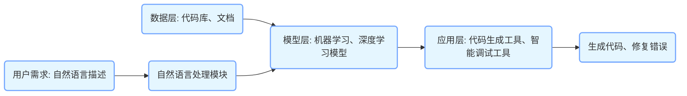

# AI编程：未来的技术趋势

> 关键词：AI编程、技术趋势、机器学习、深度学习、自动化编程、自然语言处理、智能开发工具

> 摘要：本文围绕AI编程的未来技术趋势展开深入探讨。首先介绍了AI编程的背景信息，包括目的范围、预期读者等内容。接着阐述了AI编程的核心概念与联系，详细讲解了其核心算法原理和具体操作步骤，并通过数学模型和公式进行了理论支撑。在项目实战部分，给出了代码实际案例和详细解释。还探讨了AI编程的实际应用场景，推荐了相关的工具和资源。最后对AI编程的未来发展趋势与挑战进行总结，并提供了常见问题解答和扩展阅读参考资料，旨在为读者全面呈现AI编程领域的发展态势和技术要点。

## 1. 背景介绍 
### 1.1 目的和范围
本文章的目的在于深入剖析AI编程在未来的技术发展趋势，为从事编程开发、人工智能研究以及相关领域的人员提供全面且深入的参考。范围涵盖了AI编程的核心概念、算法原理、数学模型、实际应用场景等多个方面，旨在帮助读者了解AI编程的现状和未来走向，掌握相关技术要点和开发方法。

### 1.2 预期读者
预期读者包括但不限于程序员、软件架构师、AI研究人员、计算机科学专业的学生以及对AI编程感兴趣的技术爱好者。这些读者希望通过本文了解AI编程的最新技术趋势，学习相关的编程技巧和开发方法，为自己的职业发展和技术研究提供指导。

### 1.3 文档结构概述
本文将按照以下结构进行阐述：首先介绍AI编程的背景信息，包括目的、预期读者和文档结构等；接着讲解AI编程的核心概念与联系，通过文本示意图和Mermaid流程图进行直观展示；然后详细阐述核心算法原理和具体操作步骤，并结合Python源代码进行说明；再通过数学模型和公式对相关原理进行深入讲解，并举例说明；在项目实战部分，给出代码实际案例和详细解释；之后探讨AI编程的实际应用场景；推荐相关的工具和资源；最后对AI编程的未来发展趋势与挑战进行总结，并提供常见问题解答和扩展阅读参考资料。

### 1.4 术语表
#### 1.4.1 核心术语定义
- **AI编程**：指利用人工智能技术辅助或自动完成编程任务的过程，包括代码生成、代码优化、错误检测等。
- **机器学习**：是一门多领域交叉学科，涉及概率论、统计学、逼近论、凸分析、算法复杂度理论等多门学科。它专门研究计算机怎样模拟或实现人类的学习行为，以获取新的知识或技能，重新组织已有的知识结构使之不断改善自身的性能。
- **深度学习**：是机器学习的一个分支领域，它是一种基于对数据进行表征学习的方法。深度学习通过构建具有很多层的神经网络模型，自动从大量数据中学习特征和模式。
- **自动化编程**：利用软件工具和算法自动生成代码的过程，减少人工编写代码的工作量。
- **自然语言处理**：是计算机科学与语言学的交叉领域，旨在让计算机理解、处理和生成人类语言，实现人机之间的自然语言交互。

#### 1.4.2 相关概念解释
- **AI编程助手**：一种能够根据用户需求生成代码、提供代码建议和帮助解决编程问题的智能工具。
- **代码生成模型**：基于机器学习或深度学习技术训练的模型，能够根据输入的自然语言描述或代码片段生成相应的代码。
- **智能调试**：利用人工智能技术自动检测和修复代码中的错误，提高调试效率。

#### 1.4.3 缩略词列表
- **ML**：Machine Learning（机器学习）
- **DL**：Deep Learning（深度学习）
- **NLP**：Natural Language Processing（自然语言处理）

## 2. 核心概念与联系 
AI编程涉及多个核心概念，这些概念相互关联，共同推动着AI编程的发展。以下是对这些核心概念的详细介绍和它们之间的联系。

### 核心概念原理
#### 机器学习在AI编程中的应用
机器学习是AI编程的重要基础之一。通过机器学习算法，计算机可以从大量的数据中学习模式和规律，从而实现对代码的自动生成、优化和错误检测。例如，基于监督学习的方法可以训练模型根据输入的代码特征预测代码的类型或功能；基于无监督学习的方法可以对代码进行聚类分析，发现代码中的潜在模式。

#### 深度学习与神经网络
深度学习是机器学习的一个重要分支，它通过构建深度神经网络模型来学习数据的复杂特征和模式。在AI编程中，深度学习可以用于代码生成、代码理解和代码推荐等任务。例如，使用循环神经网络（RNN）或长短期记忆网络（LSTM）可以处理序列数据，如代码片段，从而生成符合语法和语义规则的代码。

#### 自然语言处理与代码交互
自然语言处理技术使得用户可以用自然语言与编程系统进行交互。通过将自然语言描述转换为代码，用户可以更方便地表达自己的编程需求。例如，用户可以输入“创建一个Python列表并添加元素”，系统可以自动生成相应的Python代码。

### 架构的文本示意图
AI编程的架构可以分为以下几个层次：
- **数据层**：包含各种编程数据，如代码库、代码示例、文档等，为机器学习和深度学习模型提供训练数据。
- **模型层**：包括机器学习和深度学习模型，如决策树、支持向量机、神经网络等，用于学习数据的模式和规律。
- **应用层**：基于训练好的模型开发各种AI编程应用，如代码生成工具、智能调试工具、代码推荐系统等。

### Mermaid流程图


## 3. 核心算法原理 & 具体操作步骤 
### 核心算法原理
#### 基于机器学习的代码分类算法
在AI编程中，代码分类是一个重要的任务。可以使用机器学习中的分类算法，如决策树、支持向量机等，对代码进行分类。以下是一个基于决策树的代码分类算法的Python实现：

```python
from sklearn import tree
from sklearn.model_selection import train_test_split
from sklearn.feature_extraction.text import TfidfVectorizer
import pandas as pd

# 加载代码数据
data = pd.read_csv('code_data.csv')
X = data['code']
y = data['label']

# 特征提取
vectorizer = TfidfVectorizer()
X = vectorizer.fit_transform(X)

# 划分训练集和测试集
X_train, X_test, y_train, y_test = train_test_split(X, y, test_size=0.2, random_state=42)

# 创建决策树模型
clf = tree.DecisionTreeClassifier()

# 训练模型
clf.fit(X_train, y_train)

# 预测
y_pred = clf.predict(X_test)

# 评估模型
from sklearn.metrics import accuracy_score
accuracy = accuracy_score(y_test, y_pred)
print(f"Accuracy: {accuracy}")
```

#### 基于深度学习的代码生成算法
深度学习中的循环神经网络（RNN）和长短期记忆网络（LSTM）可以用于代码生成。以下是一个基于LSTM的简单代码生成示例：

```python
import numpy as np
from tensorflow.keras.models import Sequential
from tensorflow.keras.layers import LSTM, Dense
from tensorflow.keras.preprocessing.text import Tokenizer
from tensorflow.keras.preprocessing.sequence import pad_sequences

# 代码数据
code_data = ["print('Hello, World!')", "x = 5", "y = x + 2"]

# 分词
tokenizer = Tokenizer()
tokenizer.fit_on_texts(code_data)
total_words = len(tokenizer.word_index) + 1

# 生成输入序列
input_sequences = []
for line in code_data:
    token_list = tokenizer.texts_to_sequences([line])[0]
    for i in range(1, len(token_list)):
        n_gram_sequence = token_list[:i+1]
        input_sequences.append(n_gram_sequence)

# 填充序列
max_sequence_len = max([len(x) for x in input_sequences])
input_sequences = np.array(pad_sequences(input_sequences, maxlen=max_sequence_len, padding='pre'))

# 划分输入和标签
X, y = input_sequences[:,:-1], input_sequences[:,-1]

# 构建LSTM模型
model = Sequential()
model.add(LSTM(100, input_shape=(max_sequence_len-1, 1)))
model.add(Dense(total_words, activation='softmax'))
model.compile(loss='sparse_categorical_crossentropy', optimizer='adam', metrics=['accuracy'])

# 训练模型
model.fit(X, y, epochs=100, verbose=1)

# 代码生成
seed_text = "print"
next_words = 2
for _ in range(next_words):
    token_list = tokenizer.texts_to_sequences([seed_text])[0]
    token_list = pad_sequences([token_list], maxlen=max_sequence_len-1, padding='pre')
    predicted = model.predict_classes(token_list, verbose=0)
    output_word = ""
    for word, index in tokenizer.word_index.items():
        if index == predicted:
            output_word = word
            break
    seed_text += " " + output_word

print(seed_text)
```

### 具体操作步骤
#### 数据准备
- 收集和整理代码数据，可以从开源代码库、代码示例网站等获取。
- 对数据进行清洗和预处理，如去除噪声、统一代码风格等。
- 划分训练集和测试集，用于模型的训练和评估。

#### 模型选择和训练
- 根据任务需求选择合适的机器学习或深度学习模型，如决策树、支持向量机、LSTM等。
- 使用训练集对模型进行训练，调整模型的参数以提高性能。

#### 模型评估和优化
- 使用测试集对训练好的模型进行评估，计算评估指标，如准确率、召回率等。
- 根据评估结果对模型进行优化，如调整模型结构、增加训练数据等。

#### 应用部署
- 将训练好的模型部署到实际应用中，如代码生成工具、智能调试工具等。
- 监控模型的运行情况，及时进行调整和优化。

## 4. 数学模型和公式 & 详细讲解 & 举例说明 
### 机器学习中的数学模型和公式
#### 线性回归
线性回归是一种简单的机器学习模型，用于预测连续变量的值。其数学模型可以表示为：

$$y = \theta_0 + \theta_1x_1 + \theta_2x_2 + \cdots + \theta_nx_n + \epsilon$$

其中，$y$ 是预测值，$x_1, x_2, \cdots, x_n$ 是输入特征，$\theta_0, \theta_1, \cdots, \theta_n$ 是模型的参数，$\epsilon$ 是误差项。

线性回归的目标是找到一组参数 $\theta$ ，使得预测值 $y$ 与真实值之间的误差最小。常用的误差度量方法是均方误差（MSE）：

$$MSE = \frac{1}{m}\sum_{i=1}^{m}(y^{(i)} - \hat{y}^{(i)})^2$$

其中，$m$ 是样本数量，$y^{(i)}$ 是第 $i$ 个样本的真实值，$\hat{y}^{(i)}$ 是第 $i$ 个样本的预测值。

为了最小化均方误差，可以使用梯度下降算法来更新参数 $\theta$ ：

$$\theta_j := \theta_j - \alpha\frac{\partial}{\partial\theta_j}MSE(\theta)$$

其中，$\alpha$ 是学习率，控制参数更新的步长。

#### 逻辑回归
逻辑回归是一种用于分类的机器学习模型，其数学模型可以表示为：

$$h_{\theta}(x) = \frac{1}{1 + e^{-\theta^Tx}}$$

其中，$h_{\theta}(x)$ 是预测概率，$\theta$ 是模型的参数，$x$ 是输入特征。

逻辑回归的目标是找到一组参数 $\theta$ ，使得预测概率尽可能接近真实标签。常用的损失函数是对数损失函数：

$$J(\theta) = -\frac{1}{m}\sum_{i=1}^{m}[y^{(i)}\log(h_{\theta}(x^{(i)})) + (1 - y^{(i)})\log(1 - h_{\theta}(x^{(i)}))]$$

同样，可以使用梯度下降算法来最小化损失函数。

### 深度学习中的数学模型和公式
#### 神经网络的前向传播
神经网络由输入层、隐藏层和输出层组成。在前向传播过程中，输入数据通过网络的各层进行计算，最终得到输出结果。

假设神经网络有 $L$ 层，第 $l$ 层的输入为 $a^{(l-1)}$ ，权重矩阵为 $W^{(l)}$ ，偏置向量为 $b^{(l)}$ ，则第 $l$ 层的输出为：

$$z^{(l)} = W^{(l)}a^{(l-1)} + b^{(l)}$$
$$a^{(l)} = f(z^{(l)})$$

其中，$f$ 是激活函数，常用的激活函数有 sigmoid 函数、ReLU 函数等。

#### 神经网络的反向传播
反向传播是用于训练神经网络的一种算法，通过计算损失函数对各层参数的梯度，然后使用梯度下降算法更新参数。

假设损失函数为 $J(\theta)$ ，则第 $l$ 层的误差项 $\delta^{(l)}$ 可以通过以下公式计算：

$$\delta^{(L)} = \nabla_{z^{(L)}}J(\theta)$$
$$\delta^{(l)} = ((W^{(l+1)})^T\delta^{(l+1)}) \odot f'(z^{(l)})$$

其中，$\odot$ 表示逐元素相乘，$f'(z^{(l)})$ 是激活函数的导数。

然后，参数的梯度可以通过以下公式计算：

$$\nabla_{W^{(l)}}J(\theta) = \delta^{(l)}(a^{(l-1)})^T$$
$$\nabla_{b^{(l)}}J(\theta) = \delta^{(l)}$$

最后，使用梯度下降算法更新参数：

$$W^{(l)} := W^{(l)} - \alpha\nabla_{W^{(l)}}J(\theta)$$
$$b^{(l)} := b^{(l)} - \alpha\nabla_{b^{(l)}}J(\theta)$$

### 举例说明
#### 线性回归示例
假设我们有一组房屋面积和价格的数据，我们可以使用线性回归模型来预测房屋价格。以下是一个简单的Python示例：

```python
import numpy as np
import matplotlib.pyplot as plt

# 生成数据
X = np.array([1, 2, 3, 4, 5])
y = np.array([2, 4, 6, 8, 10])

# 添加偏置项
X_b = np.c_[np.ones((X.shape[0], 1)), X]

# 计算参数
theta_best = np.linalg.inv(X_b.T.dot(X_b)).dot(X_b.T).dot(y)

# 预测
X_new = np.array([[0], [6]])
X_new_b = np.c_[np.ones((2, 1)), X_new]
y_predict = X_new_b.dot(theta_best)

# 绘制结果
plt.plot(X_new, y_predict, "r-")
plt.plot(X, y, "b.")
plt.axis([0, 6, 0, 12])
plt.show()
```

#### 神经网络示例
以下是一个使用Python和Keras库实现的简单神经网络示例，用于手写数字识别：

```python
from tensorflow.keras.datasets import mnist
from tensorflow.keras.models import Sequential
from tensorflow.keras.layers import Dense, Flatten
from tensorflow.keras.utils import to_categorical

# 加载数据
(train_images, train_labels), (test_images, test_labels) = mnist.load_data()

# 数据预处理
train_images = train_images.reshape((60000, 28 * 28))
train_images = train_images.astype('float32') / 255
test_images = test_images.reshape((10000, 28 * 28))
test_images = test_images.astype('float32') / 255

train_labels = to_categorical(train_labels)
test_labels = to_categorical(test_labels)

# 构建模型
model = Sequential()
model.add(Dense(512, activation='relu', input_shape=(28 * 28,)))
model.add(Dense(10, activation='softmax'))

# 编译模型
model.compile(optimizer='rmsprop',
              loss='categorical_crossentropy',
              metrics=['accuracy'])

# 训练模型
model.fit(train_images, train_labels, epochs=5, batch_size=128)

# 评估模型
test_loss, test_acc = model.evaluate(test_images, test_labels)
print(f"Test accuracy: {test_acc}")
```

## 5. 项目实战：代码实际案例和详细解释说明 
### 5.1  开发环境搭建
#### 安装Python
首先，需要安装Python编程语言。可以从Python官方网站（https://www.python.org/downloads/）下载适合自己操作系统的Python版本，并按照安装向导进行安装。

#### 安装必要的库
在AI编程中，常用的库有TensorFlow、PyTorch、Scikit-learn等。可以使用pip命令来安装这些库：

```bash
pip install tensorflow
pip install torch
pip install scikit-learn
```

#### 选择开发工具
可以选择使用集成开发环境（IDE），如PyCharm、Jupyter Notebook等。PyCharm是一个功能强大的Python IDE，提供了代码编辑、调试、版本控制等功能；Jupyter Notebook则适合进行交互式编程和数据分析。

### 5.2  源代码详细实现和代码解读
#### 基于TensorFlow的图像分类项目
以下是一个使用TensorFlow实现的简单图像分类项目：

```python
import tensorflow as tf
from tensorflow.keras.datasets import cifar10
from tensorflow.keras.models import Sequential
from tensorflow.keras.layers import Conv2D, MaxPooling2D, Flatten, Dense
from tensorflow.keras.utils import to_categorical

# 加载数据集
(train_images, train_labels), (test_images, test_labels) = cifar10.load_data()

# 数据预处理
train_images = train_images.astype('float32') / 255
test_images = test_images.astype('float32') / 255

train_labels = to_categorical(train_labels)
test_labels = to_categorical(test_labels)

# 构建模型
model = Sequential()
model.add(Conv2D(32, (3, 3), activation='relu', input_shape=(32, 32, 3)))
model.add(MaxPooling2D((2, 2)))
model.add(Conv2D(64, (3, 3), activation='relu'))
model.add(MaxPooling2D((2, 2)))
model.add(Conv2D(64, (3, 3), activation='relu'))
model.add(Flatten())
model.add(Dense(64, activation='relu'))
model.add(Dense(10, activation='softmax'))

# 编译模型
model.compile(optimizer='adam',
              loss='categorical_crossentropy',
              metrics=['accuracy'])

# 训练模型
model.fit(train_images, train_labels, epochs=10, batch_size=64)

# 评估模型
test_loss, test_acc = model.evaluate(test_images, test_labels)
print(f"Test accuracy: {test_acc}")
```

#### 代码解读
- **数据加载**：使用`cifar10.load_data()`函数加载CIFAR-10数据集，该数据集包含10个不同类别的60000张彩色图像。
- **数据预处理**：将图像数据归一化到0到1之间，并将标签进行one-hot编码。
- **模型构建**：使用`Sequential`模型构建一个卷积神经网络，包含卷积层、池化层、全连接层等。
- **模型编译**：使用`adam`优化器和`categorical_crossentropy`损失函数进行模型编译。
- **模型训练**：使用`fit`方法对模型进行训练，指定训练的轮数和批次大小。
- **模型评估**：使用`evaluate`方法对模型进行评估，计算测试集上的损失和准确率。

### 5.3  代码解读与分析
#### 模型结构分析
该卷积神经网络模型包含三个卷积层和两个池化层，用于提取图像的特征。卷积层通过卷积核在图像上滑动，提取图像的局部特征；池化层则用于降低特征图的维度，减少计算量。最后，通过全连接层将提取的特征映射到10个类别上。

#### 训练过程分析
在训练过程中，模型会根据损失函数的值不断调整参数，使得预测结果尽可能接近真实标签。通过多次迭代训练，模型的准确率会逐渐提高。

#### 评估结果分析
测试集上的准确率可以反映模型的泛化能力。如果准确率较高，说明模型在未知数据上的表现较好；如果准确率较低，可能需要调整模型结构、增加训练数据或调整超参数。

## 6. 实际应用场景 
### 代码生成
AI编程可以根据用户的自然语言描述自动生成代码。例如，用户可以输入“创建一个Python函数，用于计算两个数的和”，系统可以自动生成相应的Python代码：

```python
def add_numbers(a, b):
    return a + b
```

### 代码优化
AI编程可以分析代码的性能瓶颈，并提供优化建议。例如，对于一个运行速度较慢的算法，AI可以建议使用更高效的算法或数据结构进行替换。

### 错误检测和修复
AI编程可以自动检测代码中的语法错误和逻辑错误，并提供修复建议。例如，当代码中出现拼写错误或语法错误时，AI可以提示用户进行修改。

### 智能调试
AI编程可以帮助开发人员进行调试。例如，通过分析代码的执行过程和日志信息，AI可以定位错误的位置，并提供可能的解决方案。

### 代码推荐
AI编程可以根据用户的编程习惯和历史代码，推荐相关的代码片段和库。例如，当用户在编写Python代码时，AI可以推荐一些常用的Python库和函数。

## 7. 工具和资源推荐
### 7.1 学习资源推荐
#### 7.1.1 书籍推荐
- 《Python机器学习》：介绍了Python在机器学习领域的应用，包括各种机器学习算法的原理和实现。
- 《深度学习》：由深度学习领域的三位顶尖专家Ian Goodfellow、Yoshua Bengio和Aaron Courville撰写，全面介绍了深度学习的理论和实践。
- 《人工智能：一种现代的方法》：是人工智能领域的经典教材，涵盖了人工智能的各个方面，包括搜索、知识表示、推理、学习等。

#### 7.1.2 在线课程
- Coursera上的“机器学习”课程：由斯坦福大学教授Andrew Ng讲授，是机器学习领域的经典课程。
- edX上的“深度学习”课程：由麻省理工学院等知名高校提供，深入介绍了深度学习的理论和实践。
- 中国大学MOOC上的“人工智能基础”课程：适合初学者学习人工智能的基础知识。

#### 7.1.3 技术博客和网站
- Medium：是一个技术博客平台，有很多关于AI编程的优质文章。
- Towards Data Science：专注于数据科学和机器学习领域的技术博客，提供了很多实用的教程和案例。
- AI Stack Exchange：是一个问答社区，用户可以在这里提问和交流AI编程相关的问题。

### 7.2 开发工具框架推荐
#### 7.2.1 IDE和编辑器
- PyCharm：是一个功能强大的Python IDE，提供了代码编辑、调试、版本控制等功能。
- Jupyter Notebook：适合进行交互式编程和数据分析，支持多种编程语言。
- Visual Studio Code：是一个轻量级的代码编辑器，支持多种编程语言和插件扩展。

#### 7.2.2 调试和性能分析工具
- PDB：是Python自带的调试器，可以帮助开发人员定位和解决代码中的问题。
- TensorBoard：是TensorFlow提供的可视化工具，可以用于监控模型的训练过程和性能。
- Py-Spy：是一个性能分析工具，可以帮助开发人员找出代码中的性能瓶颈。

#### 7.2.3 相关框架和库
- TensorFlow：是一个开源的机器学习框架，广泛应用于深度学习领域。
- PyTorch：是另一个流行的深度学习框架，具有动态图和易于使用的特点。
- Scikit-learn：是一个简单而有效的机器学习库，提供了各种机器学习算法和工具。

### 7.3 相关论文著作推荐
#### 7.3.1 经典论文
- “Gradient-Based Learning Applied to Document Recognition”：由Yann LeCun等人撰写，介绍了卷积神经网络在手写数字识别中的应用。
- “ImageNet Classification with Deep Convolutional Neural Networks”：由Alex Krizhevsky等人撰写，提出了AlexNet模型，开创了深度学习在图像分类领域的先河。
- “Attention Is All You Need”：由Vaswani等人撰写，提出了Transformer模型，在自然语言处理领域取得了巨大的成功。

#### 7.3.2 最新研究成果
- 关注顶级学术会议，如NeurIPS、ICML、CVPR等，这些会议上会发表很多最新的AI编程研究成果。
- 阅读相关的学术期刊，如Journal of Artificial Intelligence Research、Artificial Intelligence等。

#### 7.3.3 应用案例分析
- Kaggle是一个数据科学竞赛平台，上面有很多AI编程的应用案例和解决方案。
- GitHub上有很多开源的AI编程项目，可以学习和参考他人的代码实现。

## 8. 总结：未来发展趋势与挑战
### 未来发展趋势
#### 自动化编程程度提高
未来，AI编程将实现更高程度的自动化。代码生成工具将更加智能，能够根据用户的需求生成高质量的代码。同时，自动化测试和部署工具也将得到进一步发展，提高软件开发的效率。

#### 与自然语言处理的深度融合
AI编程将与自然语言处理技术更加紧密地结合。用户可以用自然语言与编程系统进行交互，更加方便地表达自己的编程需求。同时，AI也可以理解和分析代码中的自然语言注释，提供更准确的代码建议。

#### 跨领域应用拓展
AI编程将在更多的领域得到应用，如医疗、金融、交通等。通过结合不同领域的知识和数据，AI编程可以开发出更具针对性的解决方案，推动各行业的数字化转型。

#### 智能开发工具的普及
智能开发工具将成为未来编程的主流。这些工具将集成多种AI技术，如代码生成、错误检测、智能调试等，为开发人员提供全方位的支持。

### 挑战
#### 数据隐私和安全问题
AI编程需要大量的数据进行训练，这些数据可能包含用户的隐私信息。因此，如何保护数据的隐私和安全是一个重要的挑战。

#### 模型可解释性问题
深度学习模型通常是黑盒模型，难以解释其决策过程。在一些关键领域，如医疗和金融，模型的可解释性至关重要。因此，如何提高模型的可解释性是一个亟待解决的问题。

#### 人才短缺问题
AI编程是一个新兴领域，需要具备机器学习、深度学习、编程等多方面知识的人才。目前，相关人才短缺，这将制约AI编程的发展。

#### 伦理和法律问题
随着AI编程的发展，伦理和法律问题也日益凸显。例如，AI生成的代码可能存在版权问题，AI决策的责任归属也需要明确。

## 9. 附录：常见问题与解答
### 问题1：AI编程会取代程序员吗？
解答：AI编程不会取代程序员，而是会辅助程序员提高工作效率。虽然AI编程可以自动生成代码和进行错误检测，但在软件开发过程中，还需要程序员进行需求分析、系统设计、架构规划等工作。此外，程序员的创造力和判断力也是AI无法替代的。

### 问题2：学习AI编程需要具备哪些基础知识？
解答：学习AI编程需要具备一定的编程基础，如Python语言。此外，还需要了解机器学习、深度学习的基本概念和算法，以及数学基础知识，如线性代数、概率论等。

### 问题3：如何选择适合的AI编程框架？
解答：选择适合的AI编程框架需要考虑多个因素，如项目需求、个人偏好、社区支持等。TensorFlow和PyTorch是两个比较流行的深度学习框架，TensorFlow适合大规模工业应用，PyTorch则更适合科研和快速原型开发。Scikit-learn是一个简单而有效的机器学习库，适合初学者入门。

### 问题4：AI编程在实际应用中面临哪些挑战？
解答：AI编程在实际应用中面临数据隐私和安全问题、模型可解释性问题、人才短缺问题、伦理和法律问题等挑战。解决这些问题需要政府、企业和学术界的共同努力。

## 10. 扩展阅读 & 参考资料
### 扩展阅读
- 《AI未来进行式》：由李开复和王咏刚撰写，探讨了AI在未来的发展趋势和应用场景。
- 《智能时代》：由吴军撰写，介绍了人工智能在各个领域的应用和影响。

### 参考资料
- Goodfellow, I., Bengio, Y., & Courville, A. (2016). Deep Learning. MIT Press.
- Ng, A. (2012). Machine Learning. Stanford University.
- LeCun, Y., Bottou, L., Bengio, Y., & Haffner, P. (1998). Gradient-Based Learning Applied to Document Recognition. Proceedings of the IEEE, 86(11), 2278-2324.