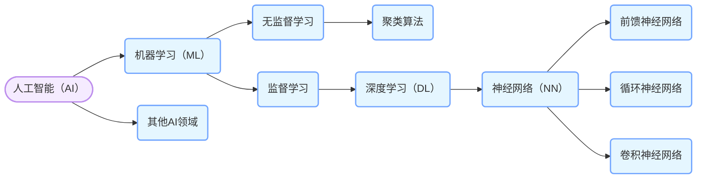

# AI编程：程序员的职业新方向

> 关键词：AI编程、程序员、职业新方向、人工智能、机器学习、深度学习、算法

> 摘要：本文围绕AI编程作为程序员职业新方向展开探讨。首先介绍了文章的背景，包括目的、预期读者、文档结构和相关术语。接着阐述了AI编程的核心概念与联系，通过文本示意图和Mermaid流程图展示其原理和架构。详细讲解了核心算法原理及具体操作步骤，并结合Python源代码进行说明。同时给出了数学模型和公式，通过举例加深理解。在项目实战部分，展示了开发环境搭建、源代码实现与解读。还分析了AI编程的实际应用场景，推荐了学习资源、开发工具框架以及相关论文著作。最后总结了未来发展趋势与挑战，提供常见问题解答和扩展阅读参考资料，旨在帮助程序员全面了解AI编程这一职业新方向。

## 1. 背景介绍 
### 1.1 目的和范围
随着科技的飞速发展，人工智能（AI）已经成为当今最热门的技术领域之一。AI编程作为实现人工智能的关键手段，正在深刻地改变着软件开发的方式和程序员的职业发展路径。本文的目的在于深入探讨AI编程作为程序员职业新方向的相关内容，涵盖AI编程的核心概念、算法原理、实际应用场景等方面，帮助程序员了解AI编程的全貌，为他们的职业转型和发展提供参考。

### 1.2 预期读者
本文主要面向广大程序员群体，尤其是那些对人工智能技术感兴趣，希望在职业发展中开拓新方向的程序员。同时，也适合对AI编程有一定了解，但希望进一步深入学习和掌握相关知识的技术爱好者。

### 1.3 文档结构概述
本文将按照以下结构进行阐述：首先介绍AI编程的背景信息，包括目的、预期读者和文档结构。接着详细讲解AI编程的核心概念与联系，通过文本示意图和Mermaid流程图展示其原理和架构。然后深入探讨核心算法原理及具体操作步骤，并结合Python源代码进行说明。随后给出数学模型和公式，通过举例加深理解。在项目实战部分，展示开发环境搭建、源代码实现与解读。分析AI编程的实际应用场景，推荐学习资源、开发工具框架以及相关论文著作。最后总结未来发展趋势与挑战，提供常见问题解答和扩展阅读参考资料。

### 1.4 术语表
#### 1.4.1 核心术语定义
- **人工智能（AI）**：指让计算机系统能够执行通常需要人类智能才能完成的任务，如学习、推理、感知和决策等。
- **机器学习（ML）**：是人工智能的一个分支，通过让计算机从数据中学习模式和规律，从而实现预测和决策。
- **深度学习（DL）**：是机器学习的一个子领域，使用深度神经网络模型来处理复杂的数据，如图像、语音和自然语言。
- **神经网络（NN）**：是一种模仿人类神经系统的计算模型，由多个神经元组成，用于处理和分析数据。
- **算法**：是解决特定问题的一系列步骤和规则。

#### 1.4.2 相关概念解释
- **监督学习**：是机器学习的一种方法，通过给定输入数据和对应的标签，让模型学习输入和输出之间的映射关系。
- **无监督学习**：在没有标签的情况下，让模型从数据中发现内在的结构和模式。
- **强化学习**：通过智能体与环境进行交互，根据环境反馈的奖励信号来学习最优的行为策略。

#### 1.4.3 缩略词列表
- **AI**：Artificial Intelligence
- **ML**：Machine Learning
- **DL**：Deep Learning
- **NN**：Neural Network

## 2. 核心概念与联系 
AI编程涉及多个核心概念，这些概念相互关联，共同构成了AI编程的基础。下面我们将详细介绍这些核心概念及其联系，并通过文本示意图和Mermaid流程图进行展示。

### 核心概念原理
#### 人工智能（AI）
人工智能是一个广泛的领域，旨在让计算机系统具备人类智能的某些能力。它包括机器学习、自然语言处理、计算机视觉等多个子领域。AI的核心目标是通过算法和模型，让计算机能够理解、学习和处理复杂的信息。

#### 机器学习（ML）
机器学习是AI的一个重要分支，它通过让计算机从数据中学习模式和规律，从而实现预测和决策。机器学习算法可以分为监督学习、无监督学习和强化学习等类型。

#### 深度学习（DL）
深度学习是机器学习的一个子领域，它使用深度神经网络模型来处理复杂的数据。深度神经网络由多个神经元组成，通过多层的非线性变换来学习数据的特征和表示。深度学习在图像识别、语音识别和自然语言处理等领域取得了巨大的成功。

#### 神经网络（NN）
神经网络是一种模仿人类神经系统的计算模型，由多个神经元组成。神经元之间通过连接权重进行信息传递，通过调整连接权重来学习数据的模式和规律。神经网络可以分为前馈神经网络、循环神经网络和卷积神经网络等类型。

### 架构的文本示意图
```plaintext
             人工智能（AI）
                |
       +------------------+
       |                  |
  机器学习（ML）      其他AI领域
       |
  +-------------+
  |             |
监督学习     无监督学习
  |             |
  |         聚类算法
  |
深度学习（DL）
  |
神经网络（NN）
  |
前馈神经网络  循环神经网络  卷积神经网络
```

### Mermaid流程图


从流程图和文本示意图中可以看出，人工智能是一个大的范畴，机器学习是人工智能的一个重要分支，深度学习又是机器学习的一个子领域，而神经网络是深度学习的核心模型。这些概念相互关联，形成了一个层次分明的体系。

## 3. 核心算法原理 & 具体操作步骤 
### 核心算法原理
在AI编程中，有许多核心算法，下面我们将以监督学习中的线性回归算法为例，详细讲解其原理。

线性回归是一种用于预测连续数值的监督学习算法。它的基本思想是通过找到一条直线（在二维空间中）或超平面（在多维空间中），使得数据点到该直线或超平面的距离之和最小。假设我们有一组输入特征 $X = [x_1, x_2, \cdots, x_n]$ 和对应的输出值 $y$，线性回归模型可以表示为：

$$y = \theta_0 + \theta_1x_1 + \theta_2x_2 + \cdots + \theta_nx_n + \epsilon$$

其中，$\theta_0, \theta_1, \cdots, \theta_n$ 是模型的参数，$\epsilon$ 是误差项。我们的目标是找到一组最优的参数 $\theta$，使得预测值 $\hat{y}$ 与真实值 $y$ 之间的误差最小。通常使用均方误差（Mean Squared Error，MSE）作为损失函数：

$$MSE = \frac{1}{m} \sum_{i=1}^{m} (y^{(i)} - \hat{y}^{(i)})^2$$

其中，$m$ 是样本数量，$y^{(i)}$ 是第 $i$ 个样本的真实值，$\hat{y}^{(i)}$ 是第 $i$ 个样本的预测值。

### 具体操作步骤
#### 步骤1：数据准备
首先，我们需要准备好训练数据，包括输入特征 $X$ 和对应的输出值 $y$。

#### 步骤2：初始化参数
随机初始化模型的参数 $\theta$。

#### 步骤3：计算预测值
根据当前的参数 $\theta$，计算预测值 $\hat{y}$。

#### 步骤4：计算损失函数
根据预测值 $\hat{y}$ 和真实值 $y$，计算损失函数 $MSE$。

#### 步骤5：更新参数
使用梯度下降算法更新参数 $\theta$，使得损失函数 $MSE$ 最小化。梯度下降算法的更新公式为：

$$\theta_j := \theta_j - \alpha \frac{\partial MSE}{\partial \theta_j}$$

其中，$\alpha$ 是学习率，控制参数更新的步长。

#### 步骤6：重复步骤3 - 5
重复步骤3 - 5，直到损失函数收敛或达到最大迭代次数。

### Python源代码实现
```python
import numpy as np

class LinearRegression:
    def __init__(self, learning_rate=0.01, num_iterations=1000):
        self.learning_rate = learning_rate
        self.num_iterations = num_iterations
        self.weights = None
        self.bias = None

    def fit(self, X, y):
        num_samples, num_features = X.shape
        self.weights = np.zeros(num_features)
        self.bias = 0

        for _ in range(self.num_iterations):
            y_pred = np.dot(X, self.weights) + self.bias

            dw = (1 / num_samples) * np.dot(X.T, (y_pred - y))
            db = (1 / num_samples) * np.sum(y_pred - y)

            self.weights -= self.learning_rate * dw
            self.bias -= self.learning_rate * db

    def predict(self, X):
        return np.dot(X, self.weights) + self.bias

# 示例数据
X = np.array([[1], [2], [3], [4], [5]])
y = np.array([2, 4, 6, 8, 10])

# 创建线性回归模型
model = LinearRegression()

# 训练模型
model.fit(X, y)

# 预测新数据
new_X = np.array([[6]])
prediction = model.predict(new_X)
print("预测值:", prediction)
```

在上述代码中，我们定义了一个 `LinearRegression` 类，实现了线性回归算法的训练和预测功能。在 `fit` 方法中，我们使用梯度下降算法更新模型的参数，在 `predict` 方法中，我们根据训练好的参数进行预测。最后，我们使用示例数据进行训练和预测，并输出预测结果。

## 4. 数学模型和公式 & 详细讲解 & 举例说明 
### 线性回归的数学模型和公式
线性回归的数学模型可以表示为：

$$y = \theta_0 + \theta_1x_1 + \theta_2x_2 + \cdots + \theta_nx_n + \epsilon$$

其中，$y$ 是输出值，$x_1, x_2, \cdots, x_n$ 是输入特征，$\theta_0, \theta_1, \cdots, \theta_n$ 是模型的参数，$\epsilon$ 是误差项。

均方误差（MSE）损失函数的公式为：

$$MSE = \frac{1}{m} \sum_{i=1}^{m} (y^{(i)} - \hat{y}^{(i)})^2$$

其中，$m$ 是样本数量，$y^{(i)}$ 是第 $i$ 个样本的真实值，$\hat{y}^{(i)}$ 是第 $i$ 个样本的预测值。

梯度下降算法的更新公式为：

$$\theta_j := \theta_j - \alpha \frac{\partial MSE}{\partial \theta_j}$$

其中，$\alpha$ 是学习率，$\frac{\partial MSE}{\partial \theta_j}$ 是损失函数关于参数 $\theta_j$ 的偏导数。

### 详细讲解
#### 线性回归模型
线性回归模型假设输出值 $y$ 与输入特征 $x$ 之间存在线性关系。通过调整模型的参数 $\theta$，我们可以找到一条直线或超平面，使得数据点到该直线或超平面的距离之和最小。

#### 均方误差损失函数
均方误差损失函数衡量了预测值 $\hat{y}$ 与真实值 $y$ 之间的误差。我们的目标是最小化这个损失函数，从而得到最优的模型参数。

#### 梯度下降算法
梯度下降算法是一种常用的优化算法，用于最小化损失函数。它通过不断地更新模型的参数，使得损失函数沿着梯度的反方向下降，直到收敛到局部最小值。

### 举例说明
假设我们有一组简单的数据：

| 输入特征 $x$ | 输出值 $y$ |
| --- | --- |
| 1 | 2 |
| 2 | 4 |
| 3 | 6 |
| 4 | 8 |
| 5 | 10 |

我们可以使用线性回归模型来拟合这些数据。假设线性回归模型为 $y = \theta_0 + \theta_1x$，我们的目标是找到最优的 $\theta_0$ 和 $\theta_1$，使得均方误差最小。

首先，我们初始化参数 $\theta_0 = 0$ 和 $\theta_1 = 0$。然后，根据当前的参数计算预测值 $\hat{y}$，并计算均方误差。接着，使用梯度下降算法更新参数 $\theta_0$ 和 $\theta_1$。重复这个过程，直到均方误差收敛。

在这个例子中，经过多次迭代，我们可以得到最优的参数 $\theta_0 = 0$ 和 $\theta_1 = 2$，此时线性回归模型为 $y = 2x$，能够很好地拟合这些数据。

## 5. 项目实战：代码实际案例和详细解释说明 
### 5.1  开发环境搭建
#### 安装Python
首先，我们需要安装Python。可以从Python官方网站（https://www.python.org/downloads/）下载适合自己操作系统的Python版本，并按照安装向导进行安装。

#### 安装依赖库
在AI编程中，我们通常会使用一些常用的库，如NumPy、Pandas、Scikit-learn等。可以使用以下命令来安装这些库：

```sh
pip install numpy pandas scikit-learn
```

#### 安装开发工具
推荐使用PyCharm或Jupyter Notebook作为开发工具。PyCharm是一款功能强大的Python集成开发环境（IDE），提供了代码编辑、调试、版本控制等功能。Jupyter Notebook是一个交互式的开发环境，适合进行数据探索和模型实验。

### 5.2  源代码详细实现和代码解读
#### 项目背景
我们将使用鸢尾花数据集进行分类任务。鸢尾花数据集是一个经典的机器学习数据集，包含了150个样本，分为3个类别，每个样本有4个特征。

#### 源代码实现
```python
from sklearn.datasets import load_iris
from sklearn.model_selection import train_test_split
from sklearn.neighbors import KNeighborsClassifier
from sklearn.metrics import accuracy_score

# 加载鸢尾花数据集
iris = load_iris()
X = iris.data
y = iris.target

# 划分训练集和测试集
X_train, X_test, y_train, y_test = train_test_split(X, y, test_size=0.2, random_state=42)

# 创建K近邻分类器
knn = KNeighborsClassifier(n_neighbors=3)

# 训练模型
knn.fit(X_train, y_train)

# 预测测试集
y_pred = knn.predict(X_test)

# 计算准确率
accuracy = accuracy_score(y_test, y_pred)
print("准确率:", accuracy)
```

#### 代码解读
1. **加载数据集**：使用 `load_iris` 函数从Scikit-learn库中加载鸢尾花数据集。数据集包含输入特征 `X` 和对应的标签 `y`。
2. **划分训练集和测试集**：使用 `train_test_split` 函数将数据集划分为训练集和测试集，其中测试集占比为20%。
3. **创建K近邻分类器**：使用 `KNeighborsClassifier` 类创建一个K近邻分类器，设置 `n_neighbors` 参数为3。
4. **训练模型**：使用 `fit` 方法对模型进行训练，传入训练集的输入特征和标签。
5. **预测测试集**：使用 `predict` 方法对测试集进行预测，得到预测结果 `y_pred`。
6. **计算准确率**：使用 `accuracy_score` 函数计算预测结果的准确率。

### 5.3  代码解读与分析
#### 数据处理
在这个项目中，我们使用 `train_test_split` 函数将数据集划分为训练集和测试集。这样做的目的是为了评估模型的泛化能力，避免过拟合。

#### 模型选择
我们选择了K近邻分类器作为模型。K近邻算法是一种简单而有效的分类算法，它的基本思想是根据样本之间的距离来进行分类。在这个项目中，我们设置 `n_neighbors` 参数为3，表示选择最近的3个邻居进行投票。

#### 模型评估
使用准确率作为评估指标，它表示预测正确的样本数占总样本数的比例。准确率越高，说明模型的性能越好。

## 6. 实际应用场景 
### 自然语言处理
#### 机器翻译
AI编程在机器翻译领域有着广泛的应用。通过深度学习模型，如Transformer模型，可以实现高质量的自动翻译。例如，谷歌翻译就是使用了先进的AI技术，能够将一种语言翻译成多种语言。

#### 文本分类
在文本分类任务中，AI编程可以帮助我们将文本分为不同的类别，如新闻分类、情感分析等。通过训练分类模型，可以自动识别文本的主题和情感倾向。

### 计算机视觉
#### 图像识别
AI编程在图像识别领域取得了巨大的成功。通过卷积神经网络（CNN），可以实现对图像的分类、目标检测和图像生成等任务。例如，人脸识别技术可以用于安防监控、门禁系统等。

#### 视频分析
在视频分析方面，AI编程可以实现视频内容的理解和分析，如动作识别、视频分类等。这在智能安防、视频监控等领域有着重要的应用。

### 医疗保健
#### 疾病诊断
AI编程可以帮助医生进行疾病诊断。通过分析医学影像（如X光、CT等）和病历数据，训练深度学习模型，可以辅助医生更准确地诊断疾病。

#### 药物研发
在药物研发过程中，AI编程可以用于筛选化合物、预测药物疗效和副作用等。通过机器学习算法，可以加速药物研发的进程。

### 金融服务
#### 风险评估
AI编程可以用于金融风险评估。通过分析客户的信用记录、财务数据等，训练风险评估模型，可以帮助银行和金融机构更准确地评估客户的信用风险。

#### 股票预测
在股票市场中，AI编程可以用于股票价格预测。通过分析历史数据和市场信息，训练预测模型，可以帮助投资者做出更明智的投资决策。

## 7. 工具和资源推荐
### 7.1 学习资源推荐
#### 7.1.1 书籍推荐
- 《Python机器学习》：这本书详细介绍了Python在机器学习中的应用，包括各种机器学习算法的原理和实现。
- 《深度学习》：由深度学习领域的三位巨头Ian Goodfellow、Yoshua Bengio和Aaron Courville撰写，是深度学习领域的经典教材。
- 《人工智能：一种现代的方法》：全面介绍了人工智能的各个方面，包括搜索算法、知识表示、机器学习等。

#### 7.1.2 在线课程
- Coursera上的《机器学习》课程：由Andrew Ng教授讲授，是机器学习领域的经典课程。
- edX上的《深度学习》课程：由Facebook AI Research的Yoshua Bengio教授讲授，深入介绍了深度学习的原理和应用。
- 吴恩达的《深度学习专项课程》：包括多个子课程，全面介绍了深度学习的各个方面。

#### 7.1.3 技术博客和网站
- Medium：是一个技术博客平台，有很多关于AI编程的优秀文章。
- Towards Data Science：专注于数据科学和机器学习领域，提供了大量的技术文章和案例分析。
- AI Stack Exchange：是一个问答社区，用户可以在这里提问和交流AI编程相关的问题。

### 7.2 开发工具框架推荐
#### 7.2.1 IDE和编辑器
- PyCharm：是一款功能强大的Python集成开发环境，提供了代码编辑、调试、版本控制等功能。
- Jupyter Notebook：是一个交互式的开发环境，适合进行数据探索和模型实验。
- Visual Studio Code：是一款轻量级的代码编辑器，支持多种编程语言，有丰富的插件扩展。

#### 7.2.2 调试和性能分析工具
- TensorBoard：是TensorFlow提供的可视化工具，可以用于可视化模型的训练过程和性能指标。
- PyTorch Profiler：是PyTorch提供的性能分析工具，可以帮助我们分析模型的性能瓶颈。
- cProfile：是Python内置的性能分析工具，可以用于分析Python代码的运行时间和内存使用情况。

#### 7.2.3 相关框架和库
- TensorFlow：是一个开源的机器学习框架，由Google开发，广泛应用于深度学习领域。
- PyTorch：是一个开源的深度学习框架，由Facebook开发，具有动态图的特点，易于使用和调试。
- Scikit-learn：是一个简单而有效的机器学习库，提供了各种机器学习算法的实现。

### 7.3 相关论文著作推荐
#### 7.3.1 经典论文
- 《Gradient-Based Learning Applied to Document Recognition》：由Yann LeCun等人撰写，介绍了卷积神经网络（CNN）在手写数字识别中的应用，是CNN领域的经典论文。
- 《Long Short-Term Memory》：由Sepp Hochreiter和Jürgen Schmidhuber撰写，介绍了长短期记忆网络（LSTM）的原理和应用，是循环神经网络领域的经典论文。
- 《Attention Is All You Need》：由Google Brain团队撰写，介绍了Transformer模型的原理和应用，是自然语言处理领域的重要突破。

#### 7.3.2 最新研究成果
- 关注顶级学术会议，如NeurIPS、ICML、CVPR等，这些会议会发布AI编程领域的最新研究成果。
- 关注知名学术期刊，如Journal of Artificial Intelligence Research（JAIR）、Artificial Intelligence等，这些期刊会发表高质量的AI编程研究论文。

#### 7.3.3 应用案例分析
- 可以参考各大科技公司的技术博客，如Google AI Blog、Facebook AI Research等，这些博客会分享AI编程在实际应用中的案例和经验。
- 关注开源项目，如Keras、TensorFlow Hub等，这些项目提供了很多实际应用的代码示例和模型。

## 8. 总结：未来发展趋势与挑战
### 未来发展趋势
#### 融合发展
AI编程将与其他技术，如物联网、区块链、云计算等深度融合，创造出更多的应用场景和商业价值。例如，物联网设备产生的大量数据可以通过AI编程进行分析和处理，实现智能决策和自动化控制。

#### 自动化和智能化
随着AI技术的不断发展，编程过程将越来越自动化和智能化。例如，自动代码生成、自动调参等技术将大大提高编程效率，降低编程门槛。

#### 跨领域应用
AI编程将在更多的领域得到应用，如教育、农业、交通等。通过将AI技术应用于这些领域，可以提高生产效率，改善生活质量。

### 挑战
#### 数据隐私和安全
AI编程需要大量的数据来训练模型，而这些数据往往包含用户的个人隐私信息。如何保护数据的隐私和安全，是AI编程面临的一个重要挑战。

#### 算法可解释性
深度学习模型通常是黑盒模型，很难解释其决策过程。在一些关键领域，如医疗、金融等，算法的可解释性至关重要。如何提高算法的可解释性，是当前研究的热点问题。

#### 人才短缺
AI编程是一个新兴领域，需要具备跨学科知识的专业人才。目前，市场上对AI编程人才的需求远远大于供给，人才短缺是制约AI编程发展的一个重要因素。

## 9. 附录：常见问题与解答
### 问题1：AI编程需要具备哪些基础知识？
解答：AI编程需要具备一定的数学基础，如线性代数、概率论、微积分等。同时，还需要掌握一门编程语言，如Python。此外，了解机器学习和深度学习的基本概念和算法也是必要的。

### 问题2：如何选择适合自己的AI编程框架？
解答：选择适合自己的AI编程框架需要考虑多个因素，如项目需求、个人经验、框架的性能和易用性等。如果是初学者，建议选择简单易用的框架，如Scikit-learn；如果是进行深度学习项目，建议选择TensorFlow或PyTorch。

### 问题3：AI编程会取代传统编程吗？
解答：AI编程不会完全取代传统编程。虽然AI编程可以自动化一些编程任务，但在很多领域，传统编程仍然是不可或缺的。例如，系统开发、游戏开发等领域，仍然需要大量的传统编程技术。

### 问题4：如何提高自己的AI编程能力？
解答：提高自己的AI编程能力需要不断学习和实践。可以通过阅读相关的书籍和论文、参加在线课程、参与开源项目等方式来学习AI编程知识。同时，多进行实践项目，积累经验，也是提高编程能力的关键。

## 10. 扩展阅读 & 参考资料
### 扩展阅读
- 《AI未来进行式》：李开复和王咏刚所著，探讨了AI在未来社会的发展和影响。
- 《生命3.0：人工智能时代的人类进化》：迈克斯·泰格马克所著，从科学和哲学的角度探讨了人工智能的未来发展。

### 参考资料
- 各技术框架的官方文档，如TensorFlow官方文档、PyTorch官方文档等。
- 学术数据库，如IEEE Xplore、ACM Digital Library等，可获取相关的学术论文。