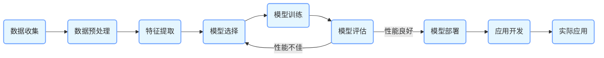

# AI编程：程序员的职业新机遇

> 关键词：AI编程、程序员、职业机遇、人工智能、编程技术、算法应用、职业发展

> 摘要：本文深入探讨了AI编程为程序员带来的职业新机遇。首先介绍了文章的背景，包括目的、预期读者、文档结构和相关术语。接着阐述了AI编程的核心概念与联系，通过文本示意图和Mermaid流程图展示其原理和架构。详细讲解了核心算法原理和具体操作步骤，使用Python源代码进行说明，并给出了相关的数学模型和公式。通过项目实战案例，展示了开发环境搭建、源代码实现和代码解读。分析了AI编程在实际中的应用场景，推荐了学习资源、开发工具框架和相关论文著作。最后总结了未来发展趋势与挑战，提供了常见问题解答和扩展阅读参考资料，旨在帮助程序员全面了解AI编程带来的机遇和应对挑战的方法。

## 1. 背景介绍 
### 1.1 目的和范围
在当今科技飞速发展的时代，人工智能（AI）已经成为推动各个行业变革的关键力量。AI编程作为实现人工智能的重要手段，为程序员带来了前所未有的职业发展机遇。本文的目的在于全面剖析AI编程为程序员创造的新机遇，涵盖从基础概念到实际应用的各个方面。通过深入探讨AI编程的核心算法、数学模型、项目实战等内容，帮助程序员了解如何抓住这些机遇，提升自身的职业竞争力。范围包括AI编程的主要技术领域、常见应用场景、相关的工具和资源，以及未来的发展趋势和面临的挑战。

### 1.2 预期读者
本文主要面向广大程序员群体，无论是初入职场的新手程序员，还是有一定经验的资深开发者，都能从本文中获得有价值的信息。对于对AI编程感兴趣，希望了解这一领域并寻求职业发展突破的程序员来说，本文将提供系统的知识和实践指导。同时，对于相关技术领域的研究人员、科技爱好者以及关注行业发展动态的人士，也具有一定的参考价值。

### 1.3 文档结构概述
本文将按照以下结构进行阐述：首先介绍AI编程的核心概念与联系，通过文本示意图和Mermaid流程图帮助读者建立整体的认知框架。接着详细讲解核心算法原理和具体操作步骤，结合Python源代码进行深入分析。阐述AI编程中涉及的数学模型和公式，并通过举例说明其应用。通过项目实战案例，展示开发环境搭建、源代码实现和代码解读的全过程。分析AI编程在不同领域的实际应用场景。推荐学习资源、开发工具框架和相关论文著作，为读者提供进一步学习和研究的方向。最后总结AI编程的未来发展趋势与挑战，解答常见问题，并提供扩展阅读和参考资料。

### 1.4 术语表
#### 1.4.1 核心术语定义
- **AI编程（AI Programming）**：指使用编程语言和相关工具来实现人工智能系统的过程，包括机器学习、深度学习、自然语言处理等技术的编程实现。
- **机器学习（Machine Learning）**：是一门多领域交叉学科，涉及概率论、统计学、逼近论、凸分析、算法复杂度理论等多门学科。它专门研究计算机怎样模拟或实现人类的学习行为，以获取新的知识或技能，重新组织已有的知识结构使之不断改善自身的性能。
- **深度学习（Deep Learning）**：是机器学习的一个分支领域，它是一种基于对数据进行表征学习的方法。深度学习通过构建具有很多层的神经网络模型，自动从大量数据中学习特征和模式，从而实现对数据的分类、预测等任务。
- **自然语言处理（Natural Language Processing，NLP）**：是计算机科学与语言学的交叉领域，研究计算机如何处理、理解和生成人类语言。它包括文本分类、情感分析、机器翻译、问答系统等多个应用方向。
- **神经网络（Neural Network）**：是一种模仿人类神经系统的计算模型，由大量的神经元组成。神经网络通过对输入数据进行处理和转换，学习数据中的特征和模式，从而实现各种任务，如图像识别、语音识别等。

#### 1.4.2 相关概念解释
- **数据集（Dataset）**：是用于训练和测试机器学习模型的数据集合。数据集通常包含输入数据和对应的标签，模型通过学习数据集中的输入和标签之间的关系，来实现对未知数据的预测和分类。
- **模型训练（Model Training）**：是指使用数据集对机器学习模型进行优化的过程。在训练过程中，模型根据输入数据和标签之间的差异，调整自身的参数，使得模型的预测结果尽可能接近真实标签。
- **过拟合（Overfitting）**：是指模型在训练数据上表现良好，但在测试数据上表现不佳的现象。过拟合通常是由于模型过于复杂，学习了训练数据中的噪声和异常值，导致模型对新数据的泛化能力较差。
- **欠拟合（Underfitting）**：是指模型在训练数据和测试数据上的表现都不佳的现象。欠拟合通常是由于模型过于简单，无法学习到数据中的复杂特征和模式。

#### 1.4.3 缩略词列表
- **AI**：Artificial Intelligence，人工智能
- **ML**：Machine Learning，机器学习
- **DL**：Deep Learning，深度学习
- **NLP**：Natural Language Processing，自然语言处理
- **CNN**：Convolutional Neural Network，卷积神经网络
- **RNN**：Recurrent Neural Network，循环神经网络
- **LSTM**：Long Short-Term Memory，长短期记忆网络

## 2. 核心概念与联系 
### 核心概念原理
AI编程的核心概念主要围绕机器学习、深度学习和自然语言处理等技术展开。机器学习是AI编程的基础，它通过让计算机从数据中学习规律和模式，从而实现对未知数据的预测和分类。深度学习是机器学习的一个高级分支，它通过构建深度神经网络，自动从大量数据中学习特征和模式，具有更强的学习能力和表现力。自然语言处理则是AI编程在语言领域的应用，旨在让计算机理解和处理人类语言。

机器学习的基本原理是通过选择合适的模型和算法，对数据集进行训练和优化。常见的机器学习模型包括决策树、支持向量机、朴素贝叶斯等。这些模型通过对输入数据进行特征提取和转换，学习数据中的规律和模式，从而实现对未知数据的预测和分类。

深度学习的核心是神经网络，神经网络由多个神经元组成，每个神经元接收输入信号，经过加权求和和非线性变换后，输出一个结果。通过多层神经元的组合和连接，神经网络可以学习到数据中的复杂特征和模式。常见的深度学习模型包括卷积神经网络（CNN）、循环神经网络（RNN）、长短期记忆网络（LSTM）等。

自然语言处理的主要任务包括文本分类、情感分析、机器翻译、问答系统等。这些任务通常需要对文本数据进行预处理，如分词、词性标注、命名实体识别等，然后使用机器学习或深度学习模型进行训练和预测。

### 架构的文本示意图
AI编程的架构可以分为数据层、模型层和应用层。数据层负责收集、存储和预处理数据，为模型训练提供高质量的数据集。模型层包括各种机器学习和深度学习模型，通过对数据集进行训练和优化，得到具有良好性能的模型。应用层则将训练好的模型应用到实际场景中，实现各种人工智能应用。

以下是一个简单的文本示意图：
```plaintext
+-------------------+
|     应用层         |
|  （AI应用系统）    |
+-------------------+
|     模型层         |
|  （机器学习/深度学习模型） |
+-------------------+
|     数据层         |
|  （数据集、数据预处理） |
+-------------------+
```

### Mermaid流程图


该流程图展示了AI编程的基本流程，从数据收集开始，经过数据预处理、特征提取、模型选择、模型训练和评估，直到模型部署和应用开发，最终应用到实际场景中。如果模型评估结果不佳，则需要重新选择模型进行训练。

## 3. 核心算法原理 & 具体操作步骤 
### 核心算法原理
在AI编程中，有许多核心算法，这里以线性回归和神经网络为例进行讲解。

#### 线性回归
线性回归是一种简单而常用的机器学习算法，用于预测连续数值的输出。其基本原理是通过找到一条直线（在二维空间中）或超平面（在多维空间中），使得数据点到该直线或超平面的距离之和最小。

线性回归的数学模型可以表示为：
$$y = \theta_0 + \theta_1x_1 + \theta_2x_2 + \cdots + \theta_nx_n$$
其中，$y$ 是预测值，$x_1, x_2, \cdots, x_n$ 是输入特征，$\theta_0, \theta_1, \cdots, \theta_n$ 是模型的参数。

为了找到最优的参数 $\theta$，通常使用最小二乘法，即最小化预测值与真实值之间的平方误差之和：
$$J(\theta) = \frac{1}{2m}\sum_{i=1}^{m}(h_{\theta}(x^{(i)}) - y^{(i)})^2$$
其中，$m$ 是样本数量，$h_{\theta}(x^{(i)})$ 是第 $i$ 个样本的预测值，$y^{(i)}$ 是第 $i$ 个样本的真实值。

#### 神经网络
神经网络是一种模仿人类神经系统的计算模型，由多个神经元组成。每个神经元接收输入信号，经过加权求和和非线性变换后，输出一个结果。通过多层神经元的组合和连接，神经网络可以学习到数据中的复杂特征和模式。

一个简单的神经网络由输入层、隐藏层和输出层组成。输入层接收输入数据，隐藏层对输入数据进行特征提取和转换，输出层输出最终的预测结果。

神经网络的训练过程通常使用反向传播算法，通过计算预测值与真实值之间的误差，然后将误差反向传播到神经网络的各个层，调整神经元的权重和偏置，使得误差不断减小。

### 具体操作步骤及Python源代码
#### 线性回归
以下是使用Python和NumPy库实现简单线性回归的代码：
```python
import numpy as np

# 生成一些示例数据
X = np.array([1, 2, 3, 4, 5])
y = np.array([2, 4, 6, 8, 10])

# 添加偏置项
X_b = np.c_[np.ones((X.shape[0], 1)), X]

# 使用最小二乘法计算参数
theta_best = np.linalg.inv(X_b.T.dot(X_b)).dot(X_b.T).dot(y)

# 输出参数
print("参数 theta:", theta_best)

# 进行预测
X_new = np.array([[6]])
X_new_b = np.c_[np.ones((X_new.shape[0], 1)), X_new]
y_predict = X_new_b.dot(theta_best)
print("预测值:", y_predict)
```
代码解释：
1. 首先，我们生成了一些示例数据 $X$ 和 $y$。
2. 然后，我们在 $X$ 中添加了偏置项，得到 $X_b$。
3. 接着，使用最小二乘法计算参数 $\theta$。
4. 最后，使用计算得到的参数对新数据进行预测。

#### 神经网络
以下是使用Python和PyTorch库实现一个简单的神经网络的代码：
```python
import torch
import torch.nn as nn
import torch.optim as optim

# 定义神经网络模型
class SimpleNet(nn.Module):
    def __init__(self):
        super(SimpleNet, self).__init__()
        self.fc1 = nn.Linear(1, 10)  # 输入层到隐藏层
        self.relu = nn.ReLU()
        self.fc2 = nn.Linear(10, 1)  # 隐藏层到输出层

    def forward(self, x):
        out = self.fc1(x)
        out = self.relu(out)
        out = self.fc2(out)
        return out

# 生成一些示例数据
X = torch.tensor([[1.0], [2.0], [3.0], [4.0], [5.0]], dtype=torch.float32)
y = torch.tensor([[2.0], [4.0], [6.0], [8.0], [10.0]], dtype=torch.float32)

# 初始化模型、损失函数和优化器
model = SimpleNet()
criterion = nn.MSELoss()
optimizer = optim.SGD(model.parameters(), lr=0.01)

# 训练模型
num_epochs = 1000
for epoch in range(num_epochs):
    # 前向传播
    outputs = model(X)
    loss = criterion(outputs, y)

    # 反向传播和优化
    optimizer.zero_grad()
    loss.backward()
    optimizer.step()

    if (epoch+1) % 100 == 0:
        print(f'Epoch [{epoch+1}/{num_epochs}], Loss: {loss.item():.4f}')

# 进行预测
X_new = torch.tensor([[6.0]], dtype=torch.float32)
y_predict = model(X_new)
print("预测值:", y_predict.item())
```
代码解释：
1. 首先，我们定义了一个简单的神经网络模型 `SimpleNet`，包含一个输入层、一个隐藏层和一个输出层。
2. 然后，我们生成了一些示例数据 $X$ 和 $y$。
3. 接着，我们初始化了模型、损失函数和优化器。
4. 在训练过程中，我们进行前向传播计算预测值，计算损失函数，然后进行反向传播和优化，更新模型的参数。
5. 最后，使用训练好的模型对新数据进行预测。

## 4. 数学模型和公式 & 详细讲解 & 举例说明 
### 线性回归的数学模型和公式
线性回归的数学模型为：
$$y = \theta_0 + \theta_1x_1 + \theta_2x_2 + \cdots + \theta_nx_n$$
其中，$y$ 是预测值，$x_1, x_2, \cdots, x_n$ 是输入特征，$\theta_0, \theta_1, \cdots, \theta_n$ 是模型的参数。

为了找到最优的参数 $\theta$，我们使用最小二乘法，最小化预测值与真实值之间的平方误差之和：
$$J(\theta) = \frac{1}{2m}\sum_{i=1}^{m}(h_{\theta}(x^{(i)}) - y^{(i)})^2$$
其中，$m$ 是样本数量，$h_{\theta}(x^{(i)})$ 是第 $i$ 个样本的预测值，$y^{(i)}$ 是第 $i$ 个样本的真实值。

为了求解最优的 $\theta$，我们对 $J(\theta)$ 求偏导数，并令其等于 0：
$$\frac{\partial J(\theta)}{\partial \theta_j} = \frac{1}{m}\sum_{i=1}^{m}(h_{\theta}(x^{(i)}) - y^{(i)})x_j^{(i)} = 0$$
通过求解上述方程组，可以得到最优的参数 $\theta$。

### 举例说明
假设我们有以下数据集：
| $x$ | $y$ |
| --- | --- |
| 1 | 2 |
| 2 | 4 |
| 3 | 6 |
| 4 | 8 |
| 5 | 10 |

我们使用线性回归模型 $y = \theta_0 + \theta_1x$ 来拟合这些数据。

首先，我们将数据集表示为矩阵形式：
$$X = \begin{bmatrix}
1 & 1 \\
1 & 2 \\
1 & 3 \\
1 & 4 \\
1 & 5
\end{bmatrix},
y = \begin{bmatrix}
2 \\
4 \\
6 \\
8 \\
10
\end{bmatrix}$$

然后，根据最小二乘法的公式 $\theta = (X^TX)^{-1}X^Ty$，计算参数 $\theta$：
```python
import numpy as np

X = np.array([[1, 1], [1, 2], [1, 3], [1, 4], [1, 5]])
y = np.array([[2], [4], [6], [8], [10]])

theta = np.linalg.inv(X.T.dot(X)).dot(X.T).dot(y)
print("参数 theta:", theta)
```
运行上述代码，我们可以得到参数 $\theta_0 = 0$，$\theta_1 = 2$，即线性回归模型为 $y = 2x$。

### 神经网络的数学模型和公式
神经网络的基本单元是神经元，神经元的输出可以表示为：
$$z = \sum_{i=1}^{n}w_ix_i + b$$
$$a = f(z)$$
其中，$w_i$ 是输入 $x_i$ 的权重，$b$ 是偏置，$f$ 是激活函数，$a$ 是神经元的输出。

在神经网络中，通常使用多层神经元进行组合和连接，形成多层神经网络。

神经网络的训练过程通常使用反向传播算法，通过计算预测值与真实值之间的误差，然后将误差反向传播到神经网络的各个层，调整神经元的权重和偏置。

假设我们使用均方误差损失函数：
$$L = \frac{1}{2}\sum_{i=1}^{m}(y_i - \hat{y}_i)^2$$
其中，$y_i$ 是真实值，$\hat{y}_i$ 是预测值。

在反向传播过程中，我们需要计算损失函数对每个权重和偏置的偏导数，然后使用梯度下降法更新权重和偏置：
$$w_{ij} = w_{ij} - \alpha\frac{\partial L}{\partial w_{ij}}$$
$$b_j = b_j - \alpha\frac{\partial L}{\partial b_j}$$
其中，$\alpha$ 是学习率。

### 举例说明
假设我们有一个简单的两层神经网络，输入层有 2 个神经元，隐藏层有 3 个神经元，输出层有 1 个神经元。输入数据为 $x = [x_1, x_2]$，隐藏层的权重矩阵为 $W_1$，偏置向量为 $b_1$，输出层的权重矩阵为 $W_2$，偏置向量为 $b_2$。

隐藏层的输出为：
$$z_1 = W_1x + b_1$$
$$a_1 = f(z_1)$$
其中，$f$ 是激活函数，如 sigmoid 函数。

输出层的输出为：
$$z_2 = W_2a_1 + b_2$$
$$\hat{y} = f(z_2)$$

假设真实值为 $y$，则损失函数为：
$$L = \frac{1}{2}(y - \hat{y})^2$$

通过反向传播算法，我们可以计算损失函数对 $W_1$、$b_1$、$W_2$ 和 $b_2$ 的偏导数，然后使用梯度下降法更新这些参数。

以下是一个简单的 Python 代码示例：
```python
import numpy as np

# 定义激活函数
def sigmoid(x):
    return 1 / (1 + np.exp(-x))

# 定义输入数据
x = np.array([[0.1, 0.2]])
y = np.array([[0.3]])

# 初始化权重和偏置
W1 = np.random.rand(2, 3)
b1 = np.random.rand(1, 3)
W2 = np.random.rand(3, 1)
b2 = np.random.rand(1, 1)

# 前向传播
z1 = np.dot(x, W1) + b1
a1 = sigmoid(z1)
z2 = np.dot(a1, W2) + b2
y_hat = sigmoid(z2)

# 计算损失函数
L = 0.5 * (y - y_hat)**2

# 反向传播
dL_dy_hat = -(y - y_hat)
dy_hat_dz2 = y_hat * (1 - y_hat)
dL_dz2 = dL_dy_hat * dy_hat_dz2
dL_dW2 = np.dot(a1.T, dL_dz2)
dL_db2 = np.sum(dL_dz2, axis=0, keepdims=True)

dL_da1 = np.dot(dL_dz2, W2.T)
da1_dz1 = a1 * (1 - a1)
dL_dz1 = dL_da1 * da1_dz1
dL_dW1 = np.dot(x.T, dL_dz1)
dL_db1 = np.sum(dL_dz1, axis=0, keepdims=True)

# 更新权重和偏置
learning_rate = 0.1
W1 = W1 - learning_rate * dL_dW1
b1 = b1 - learning_rate * dL_db1
W2 = W2 - learning_rate * dL_dW2
b2 = b2 - learning_rate * dL_db2

print("更新后的 W1:", W1)
print("更新后的 b1:", b1)
print("更新后的 W2:", W2)
print("更新后的 b2:", b2)
```
这个代码示例展示了一个简单的两层神经网络的前向传播和反向传播过程，以及如何使用梯度下降法更新权重和偏置。

## 5. 项目实战：代码实际案例和详细解释说明 
### 5.1  开发环境搭建
#### 安装Python
首先，我们需要安装 Python 环境。可以从 Python 官方网站（https://www.python.org/downloads/）下载适合自己操作系统的 Python 版本，并按照安装向导进行安装。

#### 安装深度学习框架
在 AI 编程中，常用的深度学习框架有 TensorFlow、PyTorch 等。这里以 PyTorch 为例，介绍如何安装。

可以使用以下命令安装 PyTorch：
```sh
pip install torch torchvision
```

#### 安装其他必要的库
除了深度学习框架，还需要安装一些其他必要的库，如 NumPy、Pandas、Matplotlib 等。可以使用以下命令进行安装：
```sh
pip install numpy pandas matplotlib
```

### 5.2  源代码详细实现和代码解读
#### 项目描述
我们将实现一个简单的手写数字识别项目，使用 PyTorch 框架构建一个卷积神经网络（CNN）模型，对 MNIST 数据集进行训练和测试。

#### 源代码实现
```python
import torch
import torch.nn as nn
import torch.optim as optim
import torchvision
import torchvision.transforms as transforms
import matplotlib.pyplot as plt
import numpy as np

# 定义超参数
batch_size = 64
learning_rate = 0.001
num_epochs = 5

# 数据预处理
transform = transforms.Compose([
    transforms.ToTensor(),  # 将图像转换为张量
    transforms.Normalize((0.5,), (0.5,))  # 归一化处理
])

# 加载 MNIST 数据集
trainset = torchvision.datasets.MNIST(root='./data', train=True,
                                      download=True, transform=transform)
trainloader = torch.utils.data.DataLoader(trainset, batch_size=batch_size,
                                          shuffle=True)

testset = torchvision.datasets.MNIST(root='./data', train=False,
                                     download=True, transform=transform)
testloader = torch.utils.data.DataLoader(testset, batch_size=batch_size,
                                         shuffle=False)

# 定义卷积神经网络模型
class Net(nn.Module):
    def __init__(self):
        super(Net, self).__init__()
        self.conv1 = nn.Conv2d(1, 6, 5)  # 输入通道数为 1，输出通道数为 6，卷积核大小为 5x5
        self.pool = nn.MaxPool2d(2, 2)  # 最大池化层，池化窗口大小为 2x2，步长为 2
        self.conv2 = nn.Conv2d(6, 16, 5)  # 输入通道数为 6，输出通道数为 16，卷积核大小为 5x5
        self.fc1 = nn.Linear(16 * 4 * 4, 120)  # 全连接层
        self.fc2 = nn.Linear(120, 84)
        self.fc3 = nn.Linear(84, 10)  # 输出层，10 个类别

    def forward(self, x):
        x = self.pool(torch.relu(self.conv1(x)))
        x = self.pool(torch.relu(self.conv2(x)))
        x = x.view(-1, 16 * 4 * 4)
        x = torch.relu(self.fc1(x))
        x = torch.relu(self.fc2(x))
        x = self.fc3(x)
        return x

net = Net()

# 定义损失函数和优化器
criterion = nn.CrossEntropyLoss()
optimizer = optim.SGD(net.parameters(), lr=learning_rate, momentum=0.9)

# 训练模型
train_losses = []
for epoch in range(num_epochs):
    running_loss = 0.0
    for i, data in enumerate(trainloader, 0):
        inputs, labels = data
        optimizer.zero_grad()
        outputs = net(inputs)
        loss = criterion(outputs, labels)
        loss.backward()
        optimizer.step()
        running_loss += loss.item()
        if i % 200 == 199:
            print(f'[{epoch + 1}, {i + 1:5d}] loss: {running_loss / 200:.3f}')
            train_losses.append(running_loss / 200)
            running_loss = 0.0

print('Finished Training')

# 绘制训练损失曲线
plt.plot(train_losses)
plt.xlabel('Iterations (x200)')
plt.ylabel('Loss')
plt.title('Training Loss')
plt.show()

# 测试模型
correct = 0
total = 0
with torch.no_grad():
    for data in testloader:
        images, labels = data
        outputs = net(images)
        _, predicted = torch.max(outputs.data, 1)
        total += labels.size(0)
        correct += (predicted == labels).sum().item()

print(f'Accuracy of the network on the 10000 test images: {100 * correct / total}%')
```

#### 代码解读
1. **数据预处理**：使用 `transforms.Compose` 定义了数据预处理的步骤，包括将图像转换为张量和归一化处理。
2. **加载数据集**：使用 `torchvision.datasets.MNIST` 加载 MNIST 数据集，并使用 `torch.utils.data.DataLoader` 创建数据加载器。
3. **定义模型**：定义了一个卷积神经网络模型 `Net`，包含两个卷积层、两个最大池化层和三个全连接层。
4. **定义损失函数和优化器**：使用交叉熵损失函数 `nn.CrossEntropyLoss` 和随机梯度下降优化器 `optim.SGD`。
5. **训练模型**：在训练过程中，通过迭代数据加载器，计算损失函数，进行反向传播和参数更新。
6. **绘制训练损失曲线**：使用 `matplotlib` 库绘制训练损失曲线，直观地观察模型的训练过程。
7. **测试模型**：在测试过程中，使用测试数据集对模型进行评估，计算模型的准确率。

### 5.3  代码解读与分析
#### 模型架构分析
卷积神经网络（CNN）是一种专门用于处理具有网格结构数据（如图像）的神经网络。在这个项目中，我们使用了两个卷积层和两个最大池化层来提取图像的特征，然后使用三个全连接层进行分类。

卷积层通过卷积核在图像上滑动，提取图像的局部特征。最大池化层通过对卷积层的输出进行下采样，减少数据的维度，同时保留重要的特征。全连接层将卷积层和池化层提取的特征进行组合，输出最终的分类结果。

#### 训练过程分析
在训练过程中，我们使用了随机梯度下降（SGD）优化器，通过不断调整模型的参数，使得损失函数不断减小。每次迭代中，我们从数据加载器中获取一个批次的数据，计算损失函数，然后进行反向传播和参数更新。

通过观察训练损失曲线，我们可以判断模型的训练效果。如果损失曲线逐渐下降并趋于稳定，说明模型在不断学习和优化；如果损失曲线波动较大或不下降，可能需要调整超参数或检查模型架构。

#### 测试结果分析
在测试过程中，我们使用测试数据集对模型进行评估，计算模型的准确率。准确率是衡量模型性能的一个重要指标，它表示模型正确分类的样本数占总样本数的比例。

如果模型的准确率较高，说明模型在测试数据集上表现良好；如果准确率较低，可能需要进一步优化模型，如调整超参数、增加训练数据、改进模型架构等。

## 6. 实际应用场景 
### 图像识别领域
AI编程在图像识别领域有着广泛的应用，如人脸识别、物体检测、图像分类等。

#### 人脸识别
人脸识别技术通过对人脸图像进行特征提取和分析，实现对人脸的识别和验证。在安防领域，人脸识别可以用于门禁系统、监控系统等，提高安全性和便利性。在金融领域，人脸识别可以用于身份验证，防止欺诈行为。

#### 物体检测
物体检测技术用于在图像或视频中检测出特定的物体，并确定其位置和类别。在自动驾驶领域，物体检测可以帮助车辆识别道路上的行人、车辆、交通标志等，提高驾驶安全性。在智能监控领域，物体检测可以用于检测异常行为和事件，及时发出警报。

#### 图像分类
图像分类技术用于将图像分为不同的类别，如动物、植物、风景等。在电商领域，图像分类可以用于商品图片的分类和搜索，提高用户的购物体验。在医学领域，图像分类可以用于医学影像的诊断和分析，辅助医生进行疾病的诊断。

### 自然语言处理领域
AI编程在自然语言处理领域也有着重要的应用，如机器翻译、情感分析、问答系统等。

#### 机器翻译
机器翻译技术通过对源语言文本进行分析和理解，将其翻译成目标语言。随着深度学习技术的发展，机器翻译的质量得到了显著提高。目前，谷歌翻译、百度翻译等机器翻译系统已经广泛应用于各个领域，方便人们进行跨语言交流。

#### 情感分析
情感分析技术用于分析文本中表达的情感倾向，如积极、消极、中性等。在社交媒体领域，情感分析可以用于分析用户对产品、事件的评价和态度，帮助企业了解用户需求和市场动态。在客户服务领域，情感分析可以用于分析客户的反馈和投诉，及时解决客户问题，提高客户满意度。

#### 问答系统
问答系统技术用于回答用户提出的问题，如智能客服、智能助手等。通过对大量的文本数据进行学习和训练，问答系统可以理解用户的问题，并给出准确的答案。目前，Siri、小爱同学等智能助手已经成为人们日常生活中的重要工具。

### 医疗保健领域
AI编程在医疗保健领域的应用越来越广泛，如疾病诊断、医学影像分析、药物研发等。

#### 疾病诊断
AI编程可以通过对患者的病历、症状、检查结果等数据进行分析和学习，辅助医生进行疾病的诊断。例如，IBM Watson for Oncology 可以通过分析大量的医学文献和病例数据，为医生提供癌症治疗方案的建议。

#### 医学影像分析
AI编程可以对医学影像（如X光、CT、MRI等）进行分析和诊断，帮助医生发现病变和疾病。例如，一些深度学习模型可以通过对胸部X光图像的分析，检测出肺部疾病，如肺炎、肺癌等。

#### 药物研发
AI编程可以通过对大量的生物数据和化学数据进行分析和挖掘，加速药物研发的过程。例如，一些AI技术可以通过对蛋白质结构的分析，预测药物的作用靶点和效果，为药物研发提供参考。

### 金融领域
AI编程在金融领域的应用主要包括风险评估、投资决策、欺诈检测等。

#### 风险评估
AI编程可以通过对客户的信用数据、财务数据、交易数据等进行分析和学习，评估客户的信用风险和违约概率。例如，一些银行和金融机构使用机器学习模型来评估贷款申请人的信用风险，降低贷款违约率。

#### 投资决策
AI编程可以通过对市场数据、公司财务数据、新闻资讯等进行分析和预测，为投资者提供投资建议和决策支持。例如，一些量化投资机构使用深度学习模型来分析股票市场的走势和规律，制定投资策略。

#### 欺诈检测
AI编程可以通过对交易数据、用户行为数据等进行分析和监测，及时发现和防范金融欺诈行为。例如，一些支付机构使用机器学习模型来检测信用卡欺诈、网络诈骗等行为，保障用户的资金安全。

## 7. 工具和资源推荐
### 7.1 学习资源推荐
#### 7.1.1 书籍推荐
- 《Python机器学习》（Sebastian Raschka著）：本书详细介绍了Python在机器学习领域的应用，包括各种机器学习算法的原理和实现，以及如何使用Python库进行数据处理、模型训练和评估。
- 《深度学习》（Ian Goodfellow、Yoshua Bengio和Aaron Courville著）：这是一本深度学习领域的经典教材，全面介绍了深度学习的基本概念、算法和应用，适合有一定机器学习基础的读者深入学习。
- 《动手学深度学习》（李沐、Aston Zhang等著）：本书以MXNet为基础，通过大量的代码示例和实践项目，介绍了深度学习的原理和应用，适合初学者快速上手。

#### 7.1.2 在线课程
- Coursera上的“机器学习”课程（Andrew Ng教授）：这是一门非常经典的机器学习课程，系统地介绍了机器学习的基本概念、算法和应用，适合初学者入门。
- edX上的“深度学习微硕士项目”：该项目包括多门深度学习课程，涵盖了深度学习的各个方面，如卷积神经网络、循环神经网络、生成对抗网络等，适合有一定基础的学习者深入学习。
- 哔哩哔哩（B站）上的“深度学习入门教程”：这些教程通常由国内的技术博主制作，讲解生动形象，适合初学者快速了解深度学习的基本概念和实现方法。

#### 7.1.3 技术博客和网站
- Medium：这是一个技术博客平台，有许多AI领域的专家和爱好者在上面分享他们的经验和见解，包括最新的研究成果、技术应用案例等。
- Towards Data Science：这是一个专注于数据科学和机器学习的博客网站，提供了大量的技术文章和教程，适合学习者深入学习和了解相关领域的知识。
- AI科技大本营：这是一个国内的AI技术媒体平台，提供了丰富的AI技术资讯、行业动态和技术文章，有助于学习者了解AI行业的最新发展趋势。

### 7.2 开发工具框架推荐
#### 7.2.1 IDE和编辑器
- PyCharm：这是一款专门为Python开发设计的集成开发环境（IDE），具有代码编辑、调试、自动补全、代码分析等功能，非常适合AI编程开发。
- Jupyter Notebook：这是一个交互式的开发环境，支持Python、R等多种编程语言。它以网页的形式展示代码和运行结果，方便用户进行数据探索、模型实验和结果展示。
- Visual Studio Code：这是一款轻量级的代码编辑器，支持多种编程语言和插件扩展。它具有丰富的代码编辑功能和调试功能，适合快速开发和调试AI程序。

#### 7.2.2 调试和性能分析工具
- TensorBoard：这是TensorFlow提供的一个可视化工具，用于监控和分析模型的训练过程。它可以展示损失函数、准确率、梯度等指标的变化曲线，帮助用户了解模型的训练情况。
- PyTorch Profiler：这是PyTorch提供的一个性能分析工具，用于分析模型的运行时间和内存使用情况。它可以帮助用户找出模型中的性能瓶颈，优化代码性能。
- cProfile：这是Python标准库中的一个性能分析工具，用于分析Python程序的运行时间和函数调用情况。它可以帮助用户找出程序中的性能瓶颈，优化代码性能。

#### 7.2.3 相关框架和库
- TensorFlow：这是一个开源的深度学习框架，由Google开发。它提供了丰富的深度学习模型和工具，支持多种编程语言和硬件平台，广泛应用于图像识别、自然语言处理等领域。
- PyTorch：这是一个开源的深度学习框架，由Facebook开发。它具有简洁易用的API和动态图机制，适合快速开发和实验深度学习模型。
- Scikit-learn：这是一个开源的机器学习库，提供了各种机器学习算法和工具，如分类、回归、聚类等。它具有简单易用的API和丰富的文档，适合初学者入门。

### 7.3 相关论文著作推荐
#### 7.3.1 经典论文
- 《Gradient-Based Learning Applied to Document Recognition》（Yann LeCun等著）：这篇论文介绍了卷积神经网络（CNN）的基本原理和应用，是深度学习领域的经典之作。
- 《ImageNet Classification with Deep Convolutional Neural Networks》（Alex Krizhevsky等著）：这篇论文介绍了AlexNet模型，它在2012年的ImageNet图像分类竞赛中取得了显著的成绩，开启了深度学习在图像识别领域的热潮。
- 《Long Short-Term Memory》（Sepp Hochreiter和Jürgen Schmidhuber著）：这篇论文介绍了长短期记忆网络（LSTM）的基本原理和应用，解决了传统循环神经网络（RNN）在处理长序列数据时的梯度消失问题。

#### 7.3.2 最新研究成果
- arXiv：这是一个预印本平台，提供了大量的学术论文和研究成果，涵盖了AI领域的各个方面。用户可以在上面查找最新的研究动态和技术进展。
- NeurIPS、ICML、CVPR等学术会议：这些会议是AI领域的顶级学术会议，每年都会发表大量的高质量研究论文，展示最新的研究成果和技术趋势。

#### 7.3.3 应用案例分析
- 《AI Superpowers: China, Silicon Valley, and the New World Order》（李开复著）：这本书通过分析中美两国在AI领域的发展现状和竞争态势，介绍了AI在各个领域的应用案例和发展趋势。
- 《Artificial Intelligence: A Modern Approach》（Stuart Russell和Peter Norvig著）：这是一本AI领域的经典教材，全面介绍了AI的基本概念、算法和应用，包括许多实际应用案例和分析。

## 8. 总结：未来发展趋势与挑战
### 未来发展趋势
#### 自动化编程
随着AI技术的不断发展，自动化编程将成为未来的一个重要趋势。AI编程工具可以根据用户的需求自动生成代码，提高编程效率和质量。例如，一些AI编程助手可以根据用户输入的自然语言描述，自动生成相应的代码。

#### 跨领域融合
AI编程将与其他领域进行更深入的融合，如生物医学、金融、交通等。通过将AI技术应用于这些领域，可以解决许多复杂的问题，推动这些领域的发展。例如，在生物医学领域，AI编程可以用于疾病诊断、药物研发等；在金融领域，AI编程可以用于风险评估、投资决策等。

#### 边缘计算
边缘计算是指在靠近数据源的地方进行数据处理和分析，减少数据传输和延迟。随着物联网设备的不断增加，边缘计算将成为AI编程的一个重要应用场景。通过在边缘设备上运行AI模型，可以实现实时数据处理和决策，提高系统的响应速度和可靠性。

#### 强化学习
强化学习是一种通过智能体与环境进行交互，不断学习和优化行为策略的机器学习方法。随着强化学习技术的不断发展，它将在自动驾驶、机器人控制、游戏等领域得到更广泛的应用。例如，在自动驾驶领域，强化学习可以用于训练自动驾驶车辆的决策策略，提高驾驶安全性和效率。

### 挑战
#### 数据隐私和安全
在AI编程中，需要大量的数据进行模型训练。然而，这些数据可能包含用户的隐私信息，如个人身份、健康数据等。因此，如何保护数据的隐私和安全是一个重要的挑战。需要采取有效的技术手段和管理措施，确保数据的合法使用和安全存储。

#### 算法可解释性
许多AI模型，如深度学习模型，是一种黑盒模型，其决策过程和结果难以解释。在一些关键领域，如医疗、金融等，算法的可解释性非常重要。因此，如何提高AI算法的可解释性是一个亟待解决的问题。需要研究和开发一些可解释的AI算法和技术，让用户能够理解模型的决策过程和结果。

#### 人才短缺
AI编程是一个新兴的领域，需要具备深厚的数学基础、编程技能和领域知识的专业人才。目前，AI领域的人才短缺问题比较严重，这制约了AI技术的发展和应用。需要加强AI教育和培训，培养更多的专业人才，满足市场的需求。

#### 伦理和法律问题
随着AI技术的广泛应用，一些伦理和法律问题也逐渐凸显出来。例如，AI系统的决策可能会对人类的生活和社会产生重大影响，如何确保AI系统的决策符合人类的价值观和法律规定是一个重要的问题。需要建立健全相关的伦理和法律规范，引导AI技术的健康发展。

## 9. 附录：常见问题与解答
### 问题1：AI编程需要具备哪些基础知识？
解答：AI编程需要具备一定的数学基础，如线性代数、概率论、统计学等，这些知识对于理解机器学习和深度学习的算法原理非常重要。同时，还需要掌握一门编程语言，如Python，以及相关的编程库和框架，如NumPy、Pandas、TensorFlow、PyTorch等。此外，了解一些数据处理和数据分析的方法也是必要的。

### 问题2：如何选择适合自己的深度学习框架？
解答：选择适合自己的深度学习框架需要考虑以下几个因素：
- **易用性**：不同的深度学习框架具有不同的API和使用方式，需要选择一个易于学习和使用的框架。
- **性能**：不同的深度学习框架在不同的硬件平台和任务上具有不同的性能表现，需要选择一个性能较好的框架。
- **社区支持**：选择一个有活跃社区支持的深度学习框架，可以获得更多的学习资源和技术支持。
- **应用场景**：不同的深度学习框架适用于不同的应用场景，需要根据自己的应用场景选择合适的框架。

### 问题3：如何解决模型过拟合和欠拟合的问题？
解答：
- **过拟合**：可以通过以下方法解决过拟合问题：
    - **增加训练数据**：增加训练数据的数量可以减少模型对训练数据的依赖，提高模型的泛化能力。
    - **正则化**：在损失函数中添加正则化项，如L1正则化和L2正则化，可以限制模型的复杂度，减少过拟合的风险。
    - **早停法**：在模型训练过程中，监控模型在验证集上的性能，当验证集上的性能不再提升时，停止训练，避免模型过拟合。
    - **Dropout**：在神经网络中使用Dropout技术，随机丢弃一些神经元，减少神经元之间的依赖，提高模型的泛化能力。
- **欠拟合**：可以通过以下方法解决欠拟合问题：
    - **增加模型复杂度**：选择更复杂的模型，如增加神经网络的层数和神经元数量，提高模型的学习能力。
    - **特征工程**：对输入数据进行特征工程，提取更多有用的特征，提高模型的性能。
    - **调整超参数**：调整模型的超