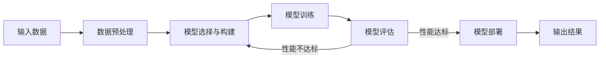

# AI编程：程序员的职业新选择

> 关键词：AI编程、程序员职业、人工智能、编程技术、职业发展

> 摘要：本文围绕AI编程作为程序员职业新选择展开探讨。首先介绍了AI编程兴起的背景，包括其目的、适用读者、文档结构和相关术语。接着阐述了AI编程的核心概念、联系、算法原理、数学模型等基础理论知识，通过Python代码进行详细说明。然后给出项目实战案例，涵盖开发环境搭建、代码实现与解读。之后分析了AI编程的实际应用场景，并推荐了学习资源、开发工具框架和相关论文著作。最后总结了AI编程的未来发展趋势与挑战，解答常见问题并提供扩展阅读与参考资料，旨在帮助程序员全面了解AI编程这一新兴职业选择。

## 1. 背景介绍 

### 1.1 目的和范围
随着人工智能技术的飞速发展，AI编程逐渐成为编程领域的热门方向。本文的目的在于为程序员详细介绍AI编程这一职业新选择，涵盖AI编程的基本概念、算法原理、实际应用等方面。范围包括从理论知识到项目实战，从基础概念到未来发展趋势，帮助程序员全面了解AI编程，为他们在职业规划中提供有价值的参考。

### 1.2 预期读者
本文的预期读者主要是广大程序员群体，包括有一定编程基础但对AI编程领域还不太熟悉的初级程序员，以及希望拓展职业领域、涉足AI编程的中级和高级程序员。同时，对人工智能技术感兴趣的相关专业学生和技术爱好者也可以从本文中获取有价值的信息。

### 1.3 文档结构概述
本文将按照以下结构进行阐述：首先介绍AI编程的背景知识，包括目的、读者和术语等；接着讲解核心概念与联系，用示意图和流程图辅助说明；然后详细阐述核心算法原理和操作步骤，并结合Python代码；再介绍数学模型和公式，通过举例加深理解；之后进行项目实战，包括环境搭建、代码实现和解读；随后分析实际应用场景；推荐相关的工具和资源；总结未来发展趋势与挑战；解答常见问题；最后提供扩展阅读和参考资料。

### 1.4 术语表

#### 1.4.1 核心术语定义
- **AI编程（Artificial Intelligence Programming）**：指利用计算机编程语言来实现人工智能相关算法和模型，以解决各种复杂问题，如图像识别、自然语言处理等。
- **机器学习（Machine Learning）**：是AI编程的一个重要分支，让计算机通过数据学习模式和规律，从而进行预测和决策，而无需明确的编程指令。
- **深度学习（Deep Learning）**：一种基于人工神经网络的机器学习技术，通过构建多层神经网络来自动学习数据的复杂特征。
- **神经网络（Neural Network）**：模仿人类神经系统的计算模型，由大量的神经元组成，用于处理和分析数据。

#### 1.4.2 相关概念解释
- **数据集（Dataset）**：用于训练和测试机器学习模型的数据集合，通常包含输入数据和对应的标签。
- **训练（Training）**：使用数据集对机器学习模型进行参数调整，使其能够学习到数据中的模式和规律。
- **模型评估（Model Evaluation）**：使用测试数据集评估训练好的模型的性能，常用的评估指标包括准确率、召回率等。
- **过拟合（Overfitting）**：模型在训练数据集上表现良好，但在测试数据集上表现不佳的现象，通常是由于模型过于复杂。

#### 1.4.3 缩略词列表
- **AI**：Artificial Intelligence（人工智能）
- **ML**：Machine Learning（机器学习）
- **DL**：Deep Learning（深度学习）
- **CNN**：Convolutional Neural Network（卷积神经网络）
- **RNN**：Recurrent Neural Network（循环神经网络）

## 2. 核心概念与联系 

### 2.1 核心概念原理
AI编程的核心概念主要围绕机器学习和深度学习展开。机器学习是让计算机通过数据学习，从而实现对未知数据的预测和决策。其基本原理是将数据分为训练集和测试集，使用训练集对模型进行训练，调整模型的参数，使其能够尽可能准确地拟合训练数据。然后使用测试集评估模型的性能，验证模型的泛化能力。

深度学习是机器学习的一个子集，它通过构建多层神经网络来自动学习数据的复杂特征。神经网络由输入层、隐藏层和输出层组成，每个神经元接收前一层神经元的输出作为输入，并通过激活函数进行非线性变换，将结果传递给下一层神经元。通过不断调整神经元之间的连接权重，神经网络可以学习到数据中的复杂模式。

### 2.2 架构的文本示意图
以下是一个简单的AI编程架构示意图：

输入数据 -> 数据预处理 -> 模型选择与构建 -> 模型训练 -> 模型评估 -> 模型部署 -> 输出结果

输入数据是AI编程的起点，通常来自各种数据源，如传感器、数据库等。数据预处理包括数据清洗、特征提取、归一化等操作，目的是将原始数据转换为适合模型处理的格式。模型选择与构建根据具体问题选择合适的机器学习或深度学习模型，并定义模型的结构和参数。模型训练使用训练数据集对模型进行迭代优化，调整模型的参数。模型评估使用测试数据集评估模型的性能，判断模型是否满足要求。模型部署将训练好的模型应用到实际场景中，处理新的数据。输出结果是模型对新数据的预测或决策结果。

### 2.3 Mermaid流程图


## 3. 核心算法原理 & 具体操作步骤 

### 3.1 线性回归算法原理
线性回归是一种简单而常用的机器学习算法，用于预测连续数值。其基本原理是通过找到一条最佳的直线（在二维空间中）或超平面（在多维空间中）来拟合数据，使得数据点到该直线或超平面的距离之和最小。

线性回归的数学模型可以表示为：

$$y = \theta_0 + \theta_1x_1 + \theta_2x_2 + \cdots + \theta_nx_n$$

其中，$y$ 是预测值，$x_1, x_2, \cdots, x_n$ 是输入特征，$\theta_0, \theta_1, \theta_2, \cdots, \theta_n$ 是模型的参数。

### 3.2 具体操作步骤
1. **数据准备**：收集和整理包含输入特征和对应目标值的数据集。
2. **数据预处理**：对数据进行清洗、归一化等操作，确保数据的质量和一致性。
3. **模型构建**：定义线性回归模型的结构，初始化模型的参数。
4. **模型训练**：使用训练数据集对模型进行训练，通过最小化损失函数来调整模型的参数。
5. **模型评估**：使用测试数据集评估模型的性能，常用的评估指标包括均方误差（MSE）、均方根误差（RMSE）等。
6. **模型预测**：使用训练好的模型对新的数据进行预测。

### 3.3 Python代码实现
```python
import numpy as np
from sklearn.model_selection import train_test_split
from sklearn.linear_model import LinearRegression
from sklearn.metrics import mean_squared_error

# 生成示例数据
X = np.array([[1], [2], [3], [4], [5]])
y = np.array([2, 4, 6, 8, 10])

# 划分训练集和测试集
X_train, X_test, y_train, y_test = train_test_split(X, y, test_size=0.2, random_state=42)

# 构建线性回归模型
model = LinearRegression()

# 模型训练
model.fit(X_train, y_train)

# 模型预测
y_pred = model.predict(X_test)

# 模型评估
mse = mean_squared_error(y_test, y_pred)
print(f"均方误差: {mse}")
```

### 3.4 代码解释
- 首先，我们使用 `numpy` 生成了一个简单的示例数据集，包含输入特征 `X` 和目标值 `y`。
- 然后，使用 `train_test_split` 函数将数据集划分为训练集和测试集，其中测试集占比为 20%。
- 接着，使用 `LinearRegression` 类构建线性回归模型。
- 调用 `fit` 方法对模型进行训练，传入训练集的输入特征和目标值。
- 使用 `predict` 方法对测试集进行预测，得到预测值 `y_pred`。
- 最后，使用 `mean_squared_error` 函数计算均方误差，评估模型的性能。

## 4. 数学模型和公式 & 详细讲解 & 举例说明 

### 4.1 线性回归的损失函数
线性回归的损失函数通常使用均方误差（MSE），其公式为：

$$MSE = \frac{1}{m} \sum_{i=1}^{m} (y^{(i)} - \hat{y}^{(i)})^2$$

其中，$m$ 是样本数量，$y^{(i)}$ 是第 $i$ 个样本的真实值，$\hat{y}^{(i)}$ 是第 $i$ 个样本的预测值。

均方误差的作用是衡量模型预测值与真实值之间的平均误差，我们的目标是通过调整模型的参数，使得均方误差最小。

### 4.2 梯度下降法
梯度下降法是一种常用的优化算法，用于最小化损失函数。其基本思想是通过不断地更新模型的参数，沿着损失函数的负梯度方向前进，直到找到损失函数的最小值。

梯度下降法的参数更新公式为：

$$\theta_j := \theta_j - \alpha \frac{\partial}{\partial \theta_j} J(\theta)$$

其中，$\theta_j$ 是模型的第 $j$ 个参数，$\alpha$ 是学习率，$J(\theta)$ 是损失函数。

### 4.3 举例说明
假设我们有一个简单的线性回归问题，数据集包含两个样本：$(x_1, y_1) = (1, 2)$ 和 $(x_2, y_2) = (2, 4)$。我们的模型为 $y = \theta_0 + \theta_1x$。

首先，计算预测值：

$\hat{y}_1 = \theta_0 + \theta_1x_1 = \theta_0 + \theta_1$

$\hat{y}_2 = \theta_0 + \theta_1x_2 = \theta_0 + 2\theta_1$

然后，计算均方误差：

$$MSE = \frac{1}{2} [(2 - (\theta_0 + \theta_1))^2 + (4 - (\theta_0 + 2\theta_1))^2]$$

接下来，使用梯度下降法更新参数。假设学习率 $\alpha = 0.1$，初始参数 $\theta_0 = 0$，$\theta_1 = 0$。

计算损失函数对 $\theta_0$ 和 $\theta_1$ 的偏导数：

$$\frac{\partial MSE}{\partial \theta_0} = \frac{1}{2} [2(2 - (\theta_0 + \theta_1))(-1) + 2(4 - (\theta_0 + 2\theta_1))(-1)]$$

$$\frac{\partial MSE}{\partial \theta_1} = \frac{1}{2} [2(2 - (\theta_0 + \theta_1))(-x_1) + 2(4 - (\theta_0 + 2\theta_1))(-x_2)]$$

将初始参数代入偏导数公式，计算得到：

$$\frac{\partial MSE}{\partial \theta_0} = -6$$

$$\frac{\partial MSE}{\partial \theta_1} = -10$$

更新参数：

$$\theta_0 := \theta_0 - \alpha \frac{\partial MSE}{\partial \theta_0} = 0 - 0.1 \times (-6) = 0.6$$

$$\theta_1 := \theta_1 - \alpha \frac{\partial MSE}{\partial \theta_1} = 0 - 0.1 \times (-10) = 1$$

重复上述步骤，不断更新参数，直到损失函数收敛。

## 5. 项目实战：代码实际案例和详细解释说明 

### 5.1 开发环境搭建
#### 5.1.1 安装Python
首先，从Python官方网站（https://www.python.org/downloads/）下载并安装Python 3.x版本。安装过程中选择“Add Python to PATH”选项，以便在命令行中可以直接使用Python。

#### 5.1.2 安装必要的库
使用 `pip` 命令安装必要的库，包括 `numpy`、`pandas`、`scikit-learn`、`tensorflow` 等。

```sh
pip install numpy pandas scikit-learn tensorflow
```

#### 5.1.3 选择开发工具
可以选择使用集成开发环境（IDE）如PyCharm，或者文本编辑器如VS Code。

### 5.2 源代码详细实现和代码解读
#### 5.2.1 项目背景
我们将实现一个简单的手写数字识别项目，使用MNIST数据集。MNIST数据集包含60,000个训练样本和10,000个测试样本，每个样本是一个28x28像素的手写数字图像。

#### 5.2.2 代码实现
```python
import tensorflow as tf
from tensorflow.keras.datasets import mnist
from tensorflow.keras.models import Sequential
from tensorflow.keras.layers import Flatten, Dense
from tensorflow.keras.utils import to_categorical

# 加载MNIST数据集
(train_images, train_labels), (test_images, test_labels) = mnist.load_data()

# 数据预处理
train_images = train_images / 255.0
test_images = test_images / 255.0

train_labels = to_categorical(train_labels)
test_labels = to_categorical(test_labels)

# 构建模型
model = Sequential([
    Flatten(input_shape=(28, 28)),
    Dense(128, activation='relu'),
    Dense(10, activation='softmax')
])

# 编译模型
model.compile(optimizer='adam',
              loss='categorical_crossentropy',
              metrics=['accuracy'])

# 训练模型
model.fit(train_images, train_labels, epochs=5, batch_size=64)

# 评估模型
test_loss, test_acc = model.evaluate(test_images, test_labels)
print(f"测试准确率: {test_acc}")
```

#### 5.2.3 代码解读
- **数据加载**：使用 `mnist.load_data()` 函数加载MNIST数据集，将其分为训练集和测试集。
- **数据预处理**：将图像像素值归一化到0-1之间，提高模型的训练效果。使用 `to_categorical` 函数将标签进行one-hot编码。
- **模型构建**：使用 `Sequential` 模型构建一个简单的神经网络，包含一个Flatten层、一个全连接层和一个输出层。
- **模型编译**：选择 `adam` 优化器，`categorical_crossentropy` 损失函数和 `accuracy` 评估指标。
- **模型训练**：使用 `fit` 方法对模型进行训练，指定训练轮数和批次大小。
- **模型评估**：使用 `evaluate` 方法对模型进行评估，输出测试准确率。

### 5.3 代码解读与分析
#### 5.3.1 数据预处理的重要性
数据预处理是机器学习项目中非常重要的一步。在本项目中，将图像像素值归一化到0-1之间可以加快模型的收敛速度，提高训练效果。同时，使用one-hot编码将标签转换为适合模型处理的格式。

#### 5.3.2 模型结构分析
本项目使用的神经网络包含一个Flatten层，将28x28的图像数据转换为一维向量；一个全连接层，使用ReLU激活函数增加模型的非线性能力；一个输出层，使用softmax激活函数输出每个类别的概率。

#### 5.3.3 优化器和损失函数的选择
`adam` 优化器是一种自适应学习率的优化算法，能够在训练过程中自动调整学习率，提高训练效率。`categorical_crossentropy` 损失函数适用于多分类问题，能够衡量模型预测值与真实标签之间的差异。

## 6. 实际应用场景 
### 6.1 图像识别
AI编程在图像识别领域有广泛的应用，如人脸识别、物体检测、医学图像分析等。例如，在安防领域，人脸识别技术可以用于门禁系统、监控系统等，提高安全性。在医学领域，AI编程可以帮助医生分析X光、CT等医学图像，辅助诊断疾病。

### 6.2 自然语言处理
自然语言处理是AI编程的另一个重要应用领域，包括机器翻译、语音识别、文本分类等。例如，谷歌翻译使用AI编程技术实现了多种语言之间的自动翻译。语音助手如Siri、小爱同学等也是基于自然语言处理技术，能够理解用户的语音指令并做出相应的回应。

### 6.3 推荐系统
推荐系统是电商、社交等平台常用的技术，通过分析用户的历史行为和偏好，为用户推荐相关的商品、文章等。例如，淘宝的商品推荐、抖音的视频推荐都是基于AI编程实现的。

### 6.4 自动驾驶
自动驾驶是AI编程的一个前沿应用领域，通过传感器获取车辆周围的环境信息，使用AI算法进行决策和控制。例如，特斯拉的自动驾驶技术使用了大量的AI编程技术，实现了自动泊车、自适应巡航等功能。

## 7. 工具和资源推荐
### 7.1 学习资源推荐
#### 7.1.1 书籍推荐
- 《Python机器学习》：介绍了Python在机器学习领域的应用，包括各种机器学习算法的原理和实现。
- 《深度学习》：由深度学习领域的三位巨头Ian Goodfellow、Yoshua Bengio和Aaron Courville撰写，是深度学习领域的经典教材。
- 《人工智能：一种现代的方法》：全面介绍了人工智能的各个方面，包括搜索算法、知识表示、机器学习等。

#### 7.1.2 在线课程
- Coursera上的“机器学习”课程：由Andrew Ng教授授课，是机器学习领域的经典课程，涵盖了机器学习的基本概念、算法和应用。
- edX上的“深度学习”课程：由百度首席科学家吴恩达和其他专家授课，深入介绍了深度学习的原理和应用。
- 中国大学MOOC上的“人工智能基础”课程：由国内知名高校的教授授课，适合初学者了解人工智能的基本概念和技术。

#### 7.1.3 技术博客和网站
- Medium：有很多关于AI编程的技术博客文章，涵盖了最新的研究成果和实践经验。
- Towards Data Science：专注于数据科学和机器学习领域，提供了大量的优质文章和教程。
- AI研习社：国内专注于人工智能技术的社区，有很多技术文章、案例分享和竞赛活动。

### 7.2 开发工具框架推荐
#### 7.2.1 IDE和编辑器
- PyCharm：功能强大的Python集成开发环境，提供了代码编辑、调试、版本控制等功能。
- VS Code：轻量级的文本编辑器，支持多种编程语言，有丰富的插件扩展。
- Jupyter Notebook：交互式的开发环境，适合数据探索和模型实验。

#### 7.2.2 调试和性能分析工具
- TensorBoard：TensorFlow提供的可视化工具，用于监控模型的训练过程和性能指标。
- PyTorch Profiler：PyTorch提供的性能分析工具，用于分析模型的运行时间和内存使用情况。
- VS Code Debugger：VS Code自带的调试工具，支持Python代码的调试。

#### 7.2.3 相关框架和库
- TensorFlow：谷歌开发的开源机器学习框架，支持多种深度学习模型的构建和训练。
- PyTorch：Facebook开发的开源深度学习框架，具有动态图的特点，适合快速迭代和研究。
- Scikit-learn：简单易用的机器学习库，提供了各种机器学习算法和工具。

### 7.3 相关论文著作推荐
#### 7.3.1 经典论文
- 《Gradient-Based Learning Applied to Document Recognition》：介绍了卷积神经网络（CNN）在手写数字识别中的应用，是CNN领域的经典论文。
- 《Long Short-Term Memory》：提出了长短期记忆网络（LSTM），解决了循环神经网络（RNN）中的梯度消失问题。
- 《Attention Is All You Need》：提出了Transformer架构，在自然语言处理领域取得了巨大的成功。

#### 7.3.2 最新研究成果
- arXiv.org：一个预印本平台，提供了大量的最新研究成果，包括AI编程领域的论文。
- NeurIPS、ICML、CVPR等顶级学术会议的论文：这些会议是人工智能领域的重要学术交流平台，展示了最新的研究成果和技术趋势。

#### 7.3.3 应用案例分析
- Kaggle：一个数据科学竞赛平台，有很多关于AI编程的实际应用案例和解决方案。
- GitHub：一个开源代码托管平台，有很多优秀的AI编程项目和代码示例。

## 8. 总结：未来发展趋势与挑战
### 8.1 未来发展趋势
#### 8.1.1 融合发展
AI编程将与其他技术如物联网、区块链、大数据等深度融合，创造出更多的应用场景和商业价值。例如，物联网设备产生的大量数据可以为AI模型提供更丰富的训练数据，而AI技术可以帮助物联网设备实现智能化决策和控制。

#### 8.1.2 自动化和智能化
随着技术的发展，AI编程将越来越自动化和智能化。例如，自动机器学习（AutoML）技术可以自动选择模型、调优参数，降低AI编程的门槛。同时，智能编程助手可以根据程序员的需求自动生成代码，提高开发效率。

#### 8.1.3 跨领域应用
AI编程将在更多的领域得到应用，如金融、医疗、教育等。在金融领域，AI技术可以用于风险评估、投资决策等；在医疗领域，AI技术可以用于疾病诊断、药物研发等；在教育领域，AI技术可以用于个性化学习、智能辅导等。

### 8.2 挑战
#### 8.2.1 数据隐私和安全
AI编程需要大量的数据进行训练，而这些数据往往包含用户的隐私信息。如何保护数据的隐私和安全是一个重要的挑战。例如，在人脸识别系统中，如何防止用户的面部信息被泄露和滥用是一个亟待解决的问题。

#### 8.2.2 算法可解释性
深度学习模型通常是一个黑盒模型，其决策过程难以解释。在一些关键领域，如医疗、金融等，算法的可解释性非常重要。如何提高AI算法的可解释性是一个挑战。

#### 8.2.3 人才短缺
AI编程是一个新兴领域，需要具备多学科知识的人才。目前，市场上AI编程人才短缺，如何培养和吸引更多的人才是一个挑战。

## 9. 附录：常见问题与解答
### 9.1 问题1：AI编程需要具备哪些基础知识？
解答：AI编程需要具备一定的数学基础，如线性代数、概率论、统计学等；编程基础，如Python、Java等；以及机器学习和深度学习的基本概念和算法。

### 9.2 问题2：如何选择合适的AI编程框架？
解答：选择合适的AI编程框架需要考虑多个因素，如项目需求、个人喜好、社区支持等。TensorFlow适合大规模生产环境，PyTorch适合快速迭代和研究，Scikit-learn适合简单的机器学习任务。

### 9.3 问题3：AI编程的就业前景如何？
解答：AI编程的就业前景非常广阔。随着人工智能技术的广泛应用，市场对AI编程人才的需求越来越大。AI编程人才可以在互联网、金融、医疗等多个领域找到合适的工作岗位。

### 9.4 问题4：如何提高AI编程能力？
解答：提高AI编程能力需要不断学习和实践。可以通过阅读相关书籍和论文、参加在线课程、参与开源项目等方式来学习理论知识；通过实际项目来提高实践能力。

## 10. 扩展阅读 & 参考资料
### 10.1 扩展阅读
- 《人工智能时代的算法伦理》：探讨了AI编程中涉及的伦理问题，如算法偏见、隐私保护等。
- 《智能时代》：介绍了人工智能技术对社会和经济的影响，以及未来的发展趋势。
- 《机器学习实战》：通过实际案例介绍了机器学习算法的应用，适合初学者实践学习。

### 10.2 参考资料
- 相关的学术论文和研究报告。
- 各大AI编程框架的官方文档和教程。
- 技术博客和论坛上的优秀文章和讨论。