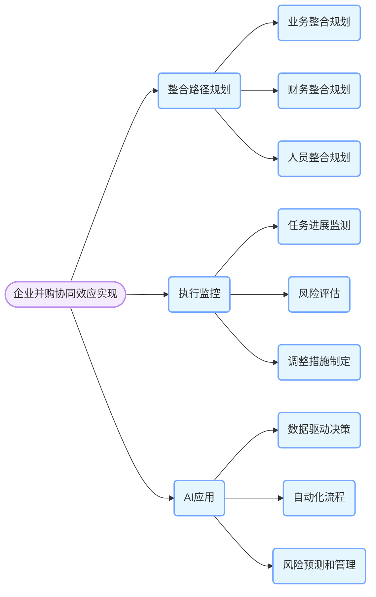

# AI辅助企业并购协同效应实现：整合路径规划与执行监控

> 关键词：AI、企业并购、协同效应、整合路径规划、执行监控

> 摘要：本文聚焦于AI在企业并购协同效应实现过程中的应用，详细探讨了整合路径规划与执行监控的相关内容。首先介绍了文章的背景信息，包括目的、预期读者、文档结构和术语表。接着阐述了核心概念及其联系，通过文本示意图和Mermaid流程图进行直观展示。然后深入分析了核心算法原理，并给出Python代码示例。进一步探讨了数学模型和公式，结合具体例子进行说明。通过项目实战，详细介绍了开发环境搭建、源代码实现及解读。还分析了实际应用场景，推荐了相关工具和资源。最后总结了未来发展趋势与挑战，提供了常见问题解答和扩展阅读参考资料，旨在为企业利用AI实现并购协同效应提供全面的技术指导。

## 1. 背景介绍 
### 1.1 目的和范围
企业并购作为一种重要的资本运作方式，旨在通过整合资源实现协同效应，提升企业的竞争力和价值。然而，并购过程中的整合工作复杂且充满挑战，涉及到业务、财务、人员等多个方面。传统的整合方式往往效率低下，难以充分发挥协同效应。本文的目的是探讨如何利用AI技术辅助企业实现并购协同效应，重点关注整合路径规划和执行监控两个关键环节。

本文的范围涵盖了AI在企业并购中的应用原理、算法实现、实际案例分析以及相关工具和资源的推荐。通过对这些内容的详细阐述，为企业提供一套完整的利用AI实现并购协同效应的解决方案。

### 1.2 预期读者
本文的预期读者主要包括企业管理人员、投资银行家、并购顾问、AI技术开发者以及对企业并购和AI应用感兴趣的研究人员。对于企业管理人员和并购从业者，本文将提供实用的指导和建议，帮助他们更好地规划和执行并购整合工作；对于AI技术开发者，本文将分享相关的算法原理和代码实现，为他们在该领域的研究和应用提供参考。

### 1.3 文档结构概述
本文共分为十个部分，具体结构如下：
1. **背景介绍**：介绍文章的目的、预期读者、文档结构和术语表。
2. **核心概念与联系**：阐述企业并购协同效应、整合路径规划和执行监控的核心概念，并通过文本示意图和Mermaid流程图展示它们之间的联系。
3. **核心算法原理 & 具体操作步骤**：详细介绍用于整合路径规划和执行监控的核心算法原理，并给出Python代码示例。
4. **数学模型和公式 & 详细讲解 & 举例说明**：建立相关的数学模型，给出公式并进行详细讲解，结合具体例子说明其应用。
5. **项目实战：代码实际案例和详细解释说明**：通过实际项目案例，介绍开发环境搭建、源代码实现及解读。
6. **实际应用场景**：分析AI在企业并购协同效应实现中的实际应用场景。
7. **工具和资源推荐**：推荐相关的学习资源、开发工具框架和论文著作。
8. **总结：未来发展趋势与挑战**：总结AI在企业并购协同效应实现中的未来发展趋势和面临的挑战。
9. **附录：常见问题与解答**：提供常见问题的解答。
10. **扩展阅读 & 参考资料**：列出扩展阅读的内容和参考资料。

### 1.4 术语表
#### 1.4.1 核心术语定义
- **企业并购**：指企业之间的合并和收购行为，通过取得其他企业的控制权来实现资源整合和业务拓展。
- **协同效应**：指企业并购后，通过资源共享、优势互补等方式，实现整体价值大于各部分价值之和的效应。
- **整合路径规划**：指在企业并购后，制定一系列的计划和步骤，以实现协同效应的过程。
- **执行监控**：指在整合路径执行过程中，对各项任务的进展情况进行实时监测和评估，及时发现问题并采取措施进行调整。
- **AI（人工智能）**：指计算机系统能够执行通常需要人类智能才能完成的任务，如学习、推理、决策等。

#### 1.4.2 相关概念解释
- **数据挖掘**：从大量的数据中提取有价值的信息和知识的过程，常用于分析企业并购中的数据。
- **机器学习**：AI的一个重要分支，通过让计算机从数据中学习模式和规律，从而实现预测和决策。
- **自然语言处理**：AI的另一个重要分支，用于处理和理解人类语言，如文本分析、情感分析等。

#### 1.4.3 缩略词列表
- **AI**：Artificial Intelligence（人工智能）
- **ML**：Machine Learning（机器学习）
- **NLP**：Natural Language Processing（自然语言处理）

## 2. 核心概念与联系 
### 核心概念原理
企业并购协同效应的实现是一个复杂的过程，涉及到多个方面的整合。整合路径规划是指在并购完成后，根据企业的战略目标和实际情况，制定一系列的计划和步骤，以实现协同效应。这些计划和步骤包括业务整合、财务整合、人员整合等。执行监控则是在整合路径执行过程中，对各项任务的进展情况进行实时监测和评估，及时发现问题并采取措施进行调整。

AI在企业并购协同效应实现中的应用主要体现在以下几个方面：
- **数据驱动的决策**：通过收集和分析大量的企业数据，AI可以帮助企业做出更明智的决策，如选择合适的并购对象、制定合理的整合路径等。
- **自动化流程**：AI可以自动化处理一些繁琐的任务，如数据录入、报告生成等，提高工作效率。
- **风险预测和管理**：AI可以通过分析历史数据和实时数据，预测并购过程中可能出现的风险，并提供相应的应对措施。

### 架构的文本示意图
```plaintext
企业并购协同效应实现
|-- 整合路径规划
|   |-- 业务整合规划
|   |-- 财务整合规划
|   |-- 人员整合规划
|-- 执行监控
|   |-- 任务进展监测
|   |-- 风险评估
|   |-- 调整措施制定
|-- AI应用
|   |-- 数据驱动决策
|   |-- 自动化流程
|   |-- 风险预测和管理
```

### Mermaid流程图


## 3. 核心算法原理 & 具体操作步骤 
### 核心算法原理
在企业并购协同效应实现的整合路径规划和执行监控中，常用的AI算法包括机器学习算法和自然语言处理算法。

#### 机器学习算法
- **决策树算法**：决策树是一种基于树结构进行决策的算法，它可以根据输入的特征数据，生成一棵决策树，用于预测和分类。在企业并购中，决策树可以用于选择合适的并购对象、评估并购风险等。
- **神经网络算法**：神经网络是一种模仿人类神经系统的算法，它由多个神经元组成，可以通过学习数据中的模式和规律，实现预测和分类。在企业并购中，神经网络可以用于预测协同效应的大小、评估整合效果等。

#### 自然语言处理算法
- **文本分类算法**：文本分类是指将文本数据分类到不同的类别中，它可以用于分析企业的新闻报道、公告等文本信息，了解企业的经营状况和市场反应。
- **情感分析算法**：情感分析是指分析文本数据中的情感倾向，它可以用于了解投资者对企业并购的态度和看法。

### 具体操作步骤
#### 数据收集和预处理
- 收集企业的财务数据、业务数据、人员数据等。
- 对收集到的数据进行清洗、转换和归一化处理，以提高数据的质量和可用性。

#### 模型训练
- 选择合适的机器学习算法和自然语言处理算法。
- 使用预处理后的数据对模型进行训练，调整模型的参数，以提高模型的准确性和性能。

#### 模型评估
- 使用测试数据对训练好的模型进行评估，计算模型的准确率、召回率、F1值等指标。
- 根据评估结果，对模型进行优化和调整。

#### 应用和监控
- 将训练好的模型应用到企业并购的整合路径规划和执行监控中。
- 实时监测模型的运行情况，根据实际情况对模型进行调整和优化。

### Python源代码示例
```python
import pandas as pd
from sklearn.model_selection import train_test_split
from sklearn.tree import DecisionTreeClassifier
from sklearn.metrics import accuracy_score

# 数据收集和预处理
data = pd.read_csv('enterprise_data.csv')
X = data.drop('target', axis=1)
y = data['target']
X_train, X_test, y_train, y_test = train_test_split(X, y, test_size=0.2, random_state=42)

# 模型训练
model = DecisionTreeClassifier()
model.fit(X_train, y_train)

# 模型评估
y_pred = model.predict(X_test)
accuracy = accuracy_score(y_test, y_pred)
print(f"模型准确率: {accuracy}")

# 应用和监控
# 这里可以将模型应用到实际的整合路径规划和执行监控中
# 并实时监测模型的运行情况
```

## 4. 数学模型和公式 & 详细讲解 & 举例说明 
### 数学模型
在企业并购协同效应实现的整合路径规划和执行监控中，可以建立以下数学模型。

#### 协同效应评估模型
设企业 $A$ 和企业 $B$ 并购后的协同效应为 $S$，企业 $A$ 的价值为 $V_A$，企业 $B$ 的价值为 $V_B$，并购后的整合成本为 $C$，则协同效应可以表示为：
$$S = V_{AB} - (V_A + V_B) - C$$
其中，$V_{AB}$ 为企业 $A$ 和企业 $B$ 并购后的总价值。

#### 风险评估模型
设并购过程中的风险因素有 $n$ 个，分别为 $x_1, x_2, \cdots, x_n$，每个风险因素的权重为 $w_1, w_2, \cdots, w_n$，风险评估函数为 $f(x_1, x_2, \cdots, x_n)$，则并购风险可以表示为：
$$R = \sum_{i=1}^{n} w_i f(x_i)$$

### 详细讲解
#### 协同效应评估模型
协同效应评估模型的核心思想是通过比较并购前后企业的总价值和整合成本，来评估并购的协同效应。如果协同效应 $S$ 大于 0，则说明并购是有利可图的；如果协同效应 $S$ 小于 0，则说明并购可能会带来损失。

#### 风险评估模型
风险评估模型的核心思想是通过对并购过程中的各种风险因素进行量化和加权，来评估并购的风险。风险因素的权重可以根据其重要性和发生的可能性来确定，风险评估函数可以根据具体的风险因素来选择。

### 举例说明
#### 协同效应评估模型举例
假设企业 $A$ 的价值为 $100$ 万元，企业 $B$ 的价值为 $50$ 万元，并购后的整合成本为 $20$ 万元，并购后的总价值为 $180$ 万元。则协同效应为：
$$S = 180 - (100 + 50) - 20 = 10 \text{（万元）}$$
这说明并购后产生了 $10$ 万元的协同效应，并购是有利可图的。

#### 风险评估模型举例
假设并购过程中的风险因素有三个，分别为市场风险、财务风险和管理风险，它们的权重分别为 $0.3$、$0.4$ 和 $0.3$，风险评估函数分别为 $f_1(x_1)$、$f_2(x_2)$ 和 $f_3(x_3)$。如果市场风险的评估值为 $0.8$，财务风险的评估值为 $0.6$，管理风险的评估值为 $0.7$，则并购风险为：
$$R = 0.3 \times 0.8 + 0.4 \times 0.6 + 0.3 \times 0.7 = 0.69$$

## 5. 项目实战：代码实际案例和详细解释说明 
### 5.1  开发环境搭建
#### 操作系统
建议使用 Linux 或 macOS 操作系统，因为它们对 Python 开发的支持较好。

#### Python 环境
安装 Python 3.7 及以上版本，可以使用 Anaconda 来管理 Python 环境。

#### 相关库的安装
使用以下命令安装所需的库：
```bash
pip install pandas scikit-learn matplotlib
```

### 5.2  源代码详细实现和代码解读
```python
import pandas as pd
from sklearn.model_selection import train_test_split
from sklearn.ensemble import RandomForestClassifier
from sklearn.metrics import accuracy_score
import matplotlib.pyplot as plt

# 数据加载
data = pd.read_csv('enterprise_data.csv')

# 数据预处理
X = data.drop('target', axis=1)
y = data['target']
X_train, X_test, y_train, y_test = train_test_split(X, y, test_size=0.2, random_state=42)

# 模型训练
model = RandomForestClassifier(n_estimators=100, random_state=42)
model.fit(X_train, y_train)

# 模型评估
y_pred = model.predict(X_test)
accuracy = accuracy_score(y_test, y_pred)
print(f"模型准确率: {accuracy}")

# 特征重要性分析
feature_importances = pd.Series(model.feature_importances_, index=X.columns)
feature_importances.nlargest(10).plot(kind='barh')
plt.show()
```

### 代码解读与分析
- **数据加载**：使用 `pandas` 库的 `read_csv` 函数加载企业数据。
- **数据预处理**：将数据分为特征变量 $X$ 和目标变量 $y$，并使用 `train_test_split` 函数将数据分为训练集和测试集。
- **模型训练**：使用 `RandomForestClassifier` 算法进行模型训练，设置 `n_estimators` 为 100，表示使用 100 棵决策树。
- **模型评估**：使用 `accuracy_score` 函数计算模型的准确率，并打印结果。
- **特征重要性分析**：使用 `feature_importances_` 属性获取特征的重要性，并使用 `matplotlib` 库绘制特征重要性的柱状图。

## 6. 实际应用场景 
### 并购对象筛选
AI 可以通过分析大量的企业数据，如财务数据、市场数据、行业数据等，帮助企业筛选出合适的并购对象。例如，通过对企业的盈利能力、成长潜力、市场竞争力等指标进行评估，找出与自身战略目标相符的企业。

### 协同效应预测
在并购前，AI 可以通过建立协同效应评估模型，预测并购后的协同效应大小。例如，通过分析企业的业务互补性、资源共享程度等因素，预测并购后的成本节约、收入增加等协同效应。

### 整合路径规划
在并购后，AI 可以根据企业的实际情况和战略目标，制定合理的整合路径。例如，通过分析企业的业务流程、组织架构、人员结构等因素，制定业务整合、财务整合、人员整合等计划。

### 执行监控
在整合路径执行过程中，AI 可以实时监测各项任务的进展情况，及时发现问题并采取措施进行调整。例如，通过分析企业的财务数据、运营数据等，监测整合效果，评估风险，并提供相应的建议。

## 7. 工具和资源推荐
### 7.1 学习资源推荐
#### 7.1.1 书籍推荐
- 《人工智能：一种现代的方法》：全面介绍了人工智能的基本概念、算法和应用。
- 《机器学习》：详细讲解了机器学习的各种算法和模型。
- 《Python 数据分析实战》：介绍了如何使用 Python 进行数据分析和处理。

#### 7.1.2 在线课程
- Coursera 上的“人工智能基础”课程：由知名高校教授授课，系统介绍人工智能的基础知识。
- edX 上的“机器学习”课程：提供了丰富的案例和实践项目，帮助学习者掌握机器学习的应用。
- 阿里云天池的“AI 实战营”：提供了大量的企业级实战项目，让学习者在实践中提高 AI 应用能力。

#### 7.1.3 技术博客和网站
- Medium：有很多人工智能领域的专家和开发者分享他们的经验和见解。
- 机器之心：专注于人工智能领域的资讯和技术分享。
- 开源中国：提供了丰富的开源项目和技术文章。

### 7.2 开发工具框架推荐
#### 7.2.1 IDE和编辑器
- PyCharm：一款专业的 Python 集成开发环境，提供了丰富的功能和插件。
- Jupyter Notebook：一种交互式的开发环境，适合进行数据分析和模型训练。
- Visual Studio Code：一款轻量级的代码编辑器，支持多种编程语言和插件。

#### 7.2.2 调试和性能分析工具
- PDB：Python 自带的调试工具，可以帮助开发者定位和解决代码中的问题。
- TensorBoard：用于可视化深度学习模型的训练过程和性能指标。
- cProfile：Python 自带的性能分析工具，可以帮助开发者找出代码中的性能瓶颈。

#### 7.2.3 相关框架和库
- Scikit-learn：一个简单易用的机器学习库，提供了多种机器学习算法和工具。
- TensorFlow：一个开源的深度学习框架，广泛应用于图像识别、自然语言处理等领域。
- PyTorch：另一个流行的深度学习框架，具有简洁易用的特点。

### 7.3 相关论文著作推荐
#### 7.3.1 经典论文
- “A Machine Learning Approach to Corporate Merger Prediction”：提出了一种使用机器学习算法预测企业并购的方法。
- “Synergy Evaluation in Mergers and Acquisitions: A Data Envelopment Analysis Approach”：介绍了一种使用数据包络分析方法评估企业并购协同效应的方法。

#### 7.3.2 最新研究成果
- 可以关注顶级学术会议如 KDD（Knowledge Discovery and Data Mining）、ICML（International Conference on Machine Learning）等的最新研究成果。

#### 7.3.3 应用案例分析
- 可以参考一些知名企业的并购案例分析，了解 AI 在企业并购中的实际应用效果。

## 8. 总结：未来发展趋势与挑战
### 未来发展趋势
- **智能化程度不断提高**：随着 AI 技术的不断发展，其在企业并购协同效应实现中的应用将更加智能化。例如，AI 可以自动学习和适应企业的变化，实时调整整合路径和执行监控策略。
- **与其他技术融合发展**：AI 将与大数据、云计算、物联网等技术深度融合，为企业并购提供更全面、更深入的支持。例如，通过物联网技术收集企业的实时数据，为 AI 模型提供更准确的输入。
- **应用范围不断扩大**：AI 在企业并购中的应用将不仅仅局限于整合路径规划和执行监控，还将扩展到并购前的尽职调查、并购后的文化整合等领域。

### 挑战
- **数据质量和安全问题**：AI 模型的训练和应用需要大量高质量的数据，但企业数据往往存在质量参差不齐、安全风险等问题。因此，如何保证数据的质量和安全是一个重要的挑战。
- **算法可解释性问题**：一些复杂的 AI 算法，如深度学习算法，往往具有较高的黑箱性，难以解释其决策过程和结果。在企业并购中，这可能会影响决策者对 AI 模型的信任和应用。
- **人才短缺问题**：AI 技术的应用需要具备专业知识和技能的人才，但目前市场上这类人才相对短缺。因此，如何培养和吸引 AI 人才是企业面临的一个挑战。

## 9. 附录：常见问题与解答
### 问题 1：AI 在企业并购中的应用是否会替代人类决策？
解答：AI 在企业并购中的应用主要是辅助人类决策，而不是替代人类决策。AI 可以通过分析大量的数据和信息，提供更准确、更全面的决策支持，但最终的决策仍然需要人类根据自己的经验和判断来做出。

### 问题 2：如何选择合适的 AI 算法？
解答：选择合适的 AI 算法需要考虑多个因素，如数据类型、问题类型、模型复杂度等。一般来说，可以先尝试一些简单的算法，如决策树、逻辑回归等，然后根据模型的性能和效果选择更复杂的算法，如神经网络、支持向量机等。

### 问题 3：AI 模型的训练需要多长时间？
解答：AI 模型的训练时间取决于多个因素，如数据量、模型复杂度、计算资源等。一般来说，简单的模型训练时间可能只需要几分钟或几小时，而复杂的模型训练时间可能需要几天甚至几周。

## 10. 扩展阅读 & 参考资料
### 扩展阅读
- 《企业并购与重组》：深入介绍企业并购的理论和实践。
- 《人工智能时代的企业管理》：探讨 AI 对企业管理的影响和应用。

### 参考资料
- 相关学术期刊文章，如《管理科学学报》《计算机学报》等。
- 企业并购案例报告和研究报告。

作者：AI天才研究院/AI Genius Institute & 禅与计算机程序设计艺术 /Zen And The Art of Computer Programming