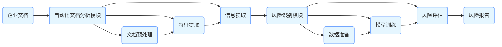

# AI辅助企业并购尽职调查：自动化文档分析与风险识别

> 关键词：AI、企业并购、尽职调查、自动化文档分析、风险识别

> 摘要：本文聚焦于AI在企业并购尽职调查中的应用，详细阐述了自动化文档分析与风险识别的相关技术和方法。首先介绍了企业并购尽职调查的背景，包括目的、范围、预期读者等内容。接着深入讲解了核心概念、算法原理、数学模型等基础知识。通过实际案例展示了如何运用AI技术进行文档分析和风险识别，包括开发环境搭建、代码实现与解读。还探讨了AI在该领域的实际应用场景，推荐了相关的学习资源、开发工具和研究论文。最后总结了未来发展趋势与挑战，并对常见问题进行了解答。

## 1. 背景介绍 
### 1.1 目的和范围
企业并购是企业发展过程中的重要战略决策，尽职调查则是确保并购成功的关键环节。尽职调查的目的在于全面了解目标企业的财务状况、法律合规、业务运营等方面的情况，识别潜在的风险和价值。传统的尽职调查主要依赖人工进行文档审查和分析，不仅效率低下，而且容易出现遗漏和错误。

本文的范围主要集中在探讨如何利用AI技术实现企业并购尽职调查中的自动化文档分析与风险识别。通过AI算法对大量的文档进行快速处理和分析，提取关键信息，识别潜在风险，提高尽职调查的效率和准确性。

### 1.2 预期读者
本文的预期读者包括企业并购领域的专业人士，如投资银行家、并购顾问、律师等；AI技术开发者，希望了解如何将AI应用于企业尽职调查场景；企业管理者，关注如何利用新技术提升并购决策的质量和效率。

### 1.3 文档结构概述
本文将按照以下结构进行组织：首先介绍相关背景知识，包括术语定义和概念解释；接着阐述核心概念和联系，通过示意图和流程图展示其原理和架构；然后详细讲解核心算法原理和具体操作步骤，并给出Python源代码示例；之后介绍数学模型和公式，并进行举例说明；通过实际项目案例展示代码实现和分析；探讨AI在企业并购尽职调查中的实际应用场景；推荐相关的学习资源、开发工具和研究论文；最后总结未来发展趋势与挑战，解答常见问题，并提供扩展阅读和参考资料。

### 1.4 术语表
#### 1.4.1 核心术语定义
- **企业并购（Corporate Merger and Acquisition）**：指企业之间通过合并、收购等方式实现资源整合和业务扩张的行为。
- **尽职调查（Due Diligence）**：在企业并购过程中，对目标企业进行全面调查和评估的过程，以了解其真实状况和潜在风险。
- **自动化文档分析（Automated Document Analysis）**：利用AI技术对文档进行自动处理、分类、提取信息等操作。
- **风险识别（Risk Identification）**：通过对各种信息的分析，识别出可能影响企业并购成功的潜在风险因素。

#### 1.4.2 相关概念解释
- **自然语言处理（Natural Language Processing，NLP）**：是AI的一个重要分支，主要研究如何让计算机理解和处理人类语言。在自动化文档分析中，NLP技术用于文本分类、命名实体识别、情感分析等任务。
- **机器学习（Machine Learning）**：是AI的一种实现方式，通过让计算机从数据中学习模式和规律，从而进行预测和决策。在风险识别中，机器学习算法可以对大量的历史数据进行训练，以识别潜在的风险模式。
- **深度学习（Deep Learning）**：是机器学习的一个子集，基于神经网络模型，能够自动学习数据的特征表示。在文档分析中，深度学习模型可以处理复杂的文本数据，提高信息提取的准确性。

#### 1.4.3 缩略词列表
- **NLP**：Natural Language Processing（自然语言处理）
- **ML**：Machine Learning（机器学习）
- **DL**：Deep Learning（深度学习）
- **AI**：Artificial Intelligence（人工智能）

## 2. 核心概念与联系 
### 核心概念原理
在AI辅助企业并购尽职调查中，核心概念主要包括自动化文档分析和风险识别。自动化文档分析的原理是利用NLP技术对大量的文档进行处理，将非结构化的文本数据转化为结构化的数据，以便后续的分析和处理。具体步骤包括文档预处理（如去除噪声、分词等）、特征提取（如关键词提取、文本向量表示等）和信息提取（如实体识别、关系抽取等）。

风险识别则是基于机器学习和深度学习算法，对自动化文档分析提取的信息进行建模和分析，识别出潜在的风险因素。常见的风险类型包括财务风险、法律风险、业务风险等。通过对历史数据的学习和分析，建立风险预测模型，对目标企业的风险状况进行评估。

### 架构的文本示意图
以下是AI辅助企业并购尽职调查的架构示意图：

```plaintext
输入：企业文档（财务报表、合同、法律文件等）
|
|-- 自动化文档分析模块
|   |-- 文档预处理（去除噪声、分词、词性标注等）
|   |-- 特征提取（关键词提取、文本向量表示）
|   |-- 信息提取（实体识别、关系抽取）
|
|-- 风险识别模块
|   |-- 数据准备（将提取的信息转化为适合机器学习的格式）
|   |-- 模型训练（使用机器学习或深度学习算法进行训练）
|   |-- 风险评估（对目标企业的风险状况进行预测和评估）
|
输出：风险报告（包含识别出的风险因素和评估结果）
```

### Mermaid流程图


## 3. 核心算法原理 & 具体操作步骤 
### 核心算法原理
在自动化文档分析中，常用的算法包括词袋模型（Bag of Words）、TF-IDF（Term Frequency-Inverse Document Frequency）和深度学习模型（如BERT）。

- **词袋模型**：将文本看作是一个词的集合，不考虑词的顺序，只关注词的出现频率。每个文档可以表示为一个向量，向量的每个维度对应一个词，值表示该词在文档中出现的频率。
- **TF-IDF**：是一种用于评估一个词在文档中重要性的统计方法。TF表示词在文档中出现的频率，IDF表示词在整个文档集合中的稀有程度。TF-IDF值越高，说明该词在文档中越重要。
- **BERT**：是一种预训练的深度学习模型，基于Transformer架构。BERT可以学习到文本的上下文信息，在各种NLP任务中取得了很好的效果。

在风险识别中，常用的机器学习算法包括逻辑回归、决策树、随机森林和支持向量机等。深度学习模型如多层感知机（MLP）、卷积神经网络（CNN）和循环神经网络（RNN）也可以用于风险识别。

### 具体操作步骤
以下是一个使用Python实现自动化文档分析和风险识别的具体操作步骤：

#### 步骤1：安装必要的库
```python
pip install pandas numpy scikit-learn transformers
```

#### 步骤2：文档预处理
```python
import re
import nltk
from nltk.corpus import stopwords
from nltk.tokenize import word_tokenize
nltk.download('stopwords')
nltk.download('punkt')

def preprocess_text(text):
    # 去除特殊字符和数字
    text = re.sub(r'[^a-zA-Z]', ' ', text)
    # 转换为小写
    text = text.lower()
    # 分词
    tokens = word_tokenize(text)
    # 去除停用词
    stop_words = set(stopwords.words('english'))
    tokens = [token for token in tokens if token not in stop_words]
    # 合并分词结果
    preprocessed_text = ' '.join(tokens)
    return preprocessed_text

# 示例文档
document = "This is an example document for preprocessing."
preprocessed_document = preprocess_text(document)
print(preprocessed_document)
```

#### 步骤3：特征提取
```python
from sklearn.feature_extraction.text import TfidfVectorizer

# 示例文档列表
documents = [
    "This is the first document.",
    "This document is the second document.",
    "And this is the third one.",
    "Is this the first document?"
]

# 预处理文档
preprocessed_documents = [preprocess_text(doc) for doc in documents]

# 创建TF-IDF向量器
vectorizer = TfidfVectorizer()
# 提取特征
tfidf_matrix = vectorizer.fit_transform(preprocessed_documents)
print(tfidf_matrix.toarray())
```

#### 步骤4：信息提取（以命名实体识别为例）
```python
from transformers import AutoTokenizer, AutoModelForTokenClassification
import torch

# 加载预训练的命名实体识别模型
tokenizer = AutoTokenizer.from_pretrained("dslim/bert-base-NER")
model = AutoModelForTokenClassification.from_pretrained("dslim/bert-base-NER")

# 示例文本
text = "Apple is looking at buying U.K. startup for $1 billion"
inputs = tokenizer(text, return_tensors="pt")
outputs = model(**inputs)
predictions = torch.argmax(outputs.logits, dim=2)
tokens = tokenizer.convert_ids_to_tokens(inputs["input_ids"][0])
for token, prediction in zip(tokens, predictions[0].tolist()):
    print(token, model.config.id2label[prediction])
```

#### 步骤5：风险识别（以逻辑回归为例）
```python
from sklearn.linear_model import LogisticRegression
from sklearn.model_selection import train_test_split
from sklearn.metrics import accuracy_score

# 示例特征矩阵和标签
X = tfidf_matrix.toarray()
y = [0, 1, 0, 1]  # 示例标签

# 划分训练集和测试集
X_train, X_test, y_train, y_test = train_test_split(X, y, test_size=0.2, random_state=42)

# 创建逻辑回归模型
model = LogisticRegression()
# 训练模型
model.fit(X_train, y_train)
# 预测
y_pred = model.predict(X_test)
# 计算准确率
accuracy = accuracy_score(y_test, y_pred)
print("Accuracy:", accuracy)
```

## 4. 数学模型和公式 & 详细讲解 & 举例说明 
### 词袋模型
词袋模型将文本表示为一个向量，向量的每个维度对应一个词。假设我们有一个包含 $V$ 个词的词汇表，对于一个文档 $d$，其词袋表示为 $\mathbf{x} = [x_1, x_2, \cdots, x_V]$，其中 $x_i$ 表示词 $i$ 在文档 $d$ 中出现的频率。

例如，对于文档 "This is an example document"，词汇表为 ["this", "is", "an", "example", "document"]，则该文档的词袋表示为 $\mathbf{x} = [1, 1, 1, 1, 1]$。

### TF-IDF
TF-IDF是一种用于评估一个词在文档中重要性的统计方法。TF表示词在文档中出现的频率，IDF表示词在整个文档集合中的稀有程度。

- **词频（TF）**：$TF(t, d) = \frac{count(t, d)}{|d|}$，其中 $count(t, d)$ 表示词 $t$ 在文档 $d$ 中出现的次数，$|d|$ 表示文档 $d$ 的总词数。
- **逆文档频率（IDF）**：$IDF(t, D) = \log\frac{|D|}{|d \in D : t \in d|}$，其中 $|D|$ 表示文档集合的总文档数，$|d \in D : t \in d|$ 表示包含词 $t$ 的文档数。
- **TF-IDF**：$TF - IDF(t, d, D) = TF(t, d) \times IDF(t, D)$

例如，假设我们有一个文档集合 $D$ 包含 100 个文档，词 "example" 在文档 $d$ 中出现了 5 次，文档 $d$ 的总词数为 100，包含词 "example" 的文档数为 20，则：

$TF("example", d) = \frac{5}{100} = 0.05$

$IDF("example", D) = \log\frac{100}{20} \approx 1.61$

$TF - IDF("example", d, D) = 0.05 \times 1.61 = 0.0805$

### 逻辑回归
逻辑回归是一种常用的二分类算法，用于预测一个样本属于某个类别的概率。逻辑回归的模型可以表示为：

$P(y = 1 | \mathbf{x}) = \frac{1}{1 + e^{-(\mathbf{w}^T\mathbf{x} + b)}}$

其中 $\mathbf{x}$ 是输入特征向量，$\mathbf{w}$ 是权重向量，$b$ 是偏置项。

逻辑回归的目标是通过最大化似然函数来估计模型参数 $\mathbf{w}$ 和 $b$。似然函数可以表示为：

$L(\mathbf{w}, b) = \prod_{i=1}^{N} P(y_i | \mathbf{x}_i; \mathbf{w}, b)$

通常使用对数似然函数来简化计算：

$\log L(\mathbf{w}, b) = \sum_{i=1}^{N} [y_i \log P(y_i = 1 | \mathbf{x}_i; \mathbf{w}, b) + (1 - y_i) \log (1 - P(y_i = 1 | \mathbf{x}_i; \mathbf{w}, b))]$

通过梯度下降等优化算法来最大化对数似然函数，从而得到最优的模型参数。

例如，假设我们有一个二分类问题，输入特征向量 $\mathbf{x} = [x_1, x_2]$，权重向量 $\mathbf{w} = [w_1, w_2]$，偏置项 $b$。则预测样本属于类别 1 的概率为：

$P(y = 1 | \mathbf{x}) = \frac{1}{1 + e^{-(w_1x_1 + w_2x_2 + b)}}$

## 5. 项目实战：代码实际案例和详细解释说明 
### 5.1  开发环境搭建
#### 安装Python
首先需要安装Python，建议使用Python 3.7及以上版本。可以从Python官方网站（https://www.python.org/downloads/）下载并安装。

#### 创建虚拟环境
为了避免不同项目之间的依赖冲突，建议使用虚拟环境。可以使用`venv`模块创建虚拟环境：
```bash
python -m venv myenv
```
激活虚拟环境：
- 在Windows上：
```bash
myenv\Scripts\activate
```
- 在Linux和Mac上：
```bash
source myenv/bin/activate
```

#### 安装必要的库
在虚拟环境中安装必要的库：
```bash
pip install pandas numpy scikit-learn transformers
```

### 5.2  源代码详细实现和代码解读
以下是一个完整的项目实战代码示例，用于实现自动化文档分析和风险识别：

```python
import re
import nltk
from nltk.corpus import stopwords
from nltk.tokenize import word_tokenize
from sklearn.feature_extraction.text import TfidfVectorizer
from sklearn.linear_model import LogisticRegression
from sklearn.model_selection import train_test_split
from sklearn.metrics import accuracy_score
from transformers import AutoTokenizer, AutoModelForTokenClassification
import torch

# 下载必要的nltk数据
nltk.download('stopwords')
nltk.download('punkt')

# 文档预处理函数
def preprocess_text(text):
    # 去除特殊字符和数字
    text = re.sub(r'[^a-zA-Z]', ' ', text)
    # 转换为小写
    text = text.lower()
    # 分词
    tokens = word_tokenize(text)
    # 去除停用词
    stop_words = set(stopwords.words('english'))
    tokens = [token for token in tokens if token not in stop_words]
    # 合并分词结果
    preprocessed_text = ' '.join(tokens)
    return preprocessed_text

# 示例文档列表
documents = [
    "This is the first document related to finance.",
    "This document is about legal issues in a company.",
    "And this is a document about business operations.",
    "Is this the first document regarding financial risks?"
]

# 示例标签
labels = [0, 1, 2, 0]  # 0: 财务风险，1: 法律风险，2: 业务风险

# 预处理文档
preprocessed_documents = [preprocess_text(doc) for doc in documents]

# 创建TF-IDF向量器
vectorizer = TfidfVectorizer()
# 提取特征
tfidf_matrix = vectorizer.fit_transform(preprocessed_documents)

# 划分训练集和测试集
X_train, X_test, y_train, y_test = train_test_split(tfidf_matrix, labels, test_size=0.2, random_state=42)

# 创建逻辑回归模型
model = LogisticRegression()
# 训练模型
model.fit(X_train, y_train)
# 预测
y_pred = model.predict(X_test)
# 计算准确率
accuracy = accuracy_score(y_test, y_pred)
print("Accuracy:", accuracy)

# 信息提取（以命名实体识别为例）
tokenizer = AutoTokenizer.from_pretrained("dslim/bert-base-NER")
model_ner = AutoModelForTokenClassification.from_pretrained("dslim/bert-base-NER")

# 示例文本
text = "Apple is looking at buying U.K. startup for $1 billion"
inputs = tokenizer(text, return_tensors="pt")
outputs = model_ner(**inputs)
predictions = torch.argmax(outputs.logits, dim=2)
tokens = tokenizer.convert_ids_to_tokens(inputs["input_ids"][0])
for token, prediction in zip(tokens, predictions[0].tolist()):
    print(token, model_ner.config.id2label[prediction])
```

### 5.3  代码解读与分析
#### 文档预处理
`preprocess_text`函数用于对文档进行预处理，包括去除特殊字符和数字、转换为小写、分词和去除停用词。这一步骤可以提高后续特征提取的效果。

#### 特征提取
使用`TfidfVectorizer`将预处理后的文档转换为TF-IDF特征矩阵。TF-IDF可以衡量一个词在文档中的重要性，从而更好地表示文档的特征。

#### 风险识别
使用逻辑回归模型进行风险识别。将特征矩阵划分为训练集和测试集，训练模型并进行预测，最后计算准确率。逻辑回归是一种简单而有效的二分类算法，适用于风险识别任务。

#### 信息提取
使用预训练的命名实体识别模型`dslim/bert-base-NER`进行信息提取。该模型可以识别文本中的实体，如公司名称、地点、金额等。

## 6. 实际应用场景 
### 财务尽职调查
在财务尽职调查中，AI可以自动分析目标企业的财务报表、审计报告等文档，提取关键财务指标，如收入、利润、资产负债等。通过对历史财务数据的分析，识别潜在的财务风险，如财务造假、资金链断裂等。同时，AI还可以对比同行业企业的财务数据，评估目标企业的财务竞争力。

### 法律尽职调查
在法律尽职调查中，AI可以对合同、法律文件等进行自动化分析，识别潜在的法律风险，如合同违约、知识产权纠纷等。通过对法律条款的理解和分析，提供法律风险预警和建议。此外，AI还可以跟踪法律法规的变化，及时更新风险评估结果。

### 业务尽职调查
在业务尽职调查中，AI可以分析目标企业的市场调研报告、客户反馈、业务流程文档等，了解其业务模式、市场竞争力和发展前景。通过对市场趋势的分析，识别潜在的业务风险，如市场份额下降、新产品开发失败等。同时，AI还可以帮助评估目标企业与并购方的业务协同效应。

## 7. 工具和资源推荐
### 7.1 学习资源推荐
#### 7.1.1 书籍推荐
- 《自然语言处理入门》：介绍了自然语言处理的基本概念、算法和应用，适合初学者入门。
- 《机器学习》：全面介绍了机器学习的理论和方法，包括监督学习、无监督学习、深度学习等。
- 《Python自然语言处理实战》：通过实际案例介绍了如何使用Python进行自然语言处理任务，如文本分类、命名实体识别等。

#### 7.1.2 在线课程
- Coursera上的“Natural Language Processing Specialization”：由知名教授授课，系统介绍了自然语言处理的各个方面。
- edX上的“Artificial Intelligence for Trading”：介绍了AI在金融领域的应用，包括企业并购尽职调查中的风险识别。
- 网易云课堂上的“Python机器学习实战”：通过实际项目介绍了Python在机器学习中的应用。

#### 7.1.3 技术博客和网站
- Medium：有很多关于AI和自然语言处理的技术博客文章，作者来自世界各地的技术专家。
- Towards Data Science：专注于数据科学和机器学习领域的技术文章，提供了很多实用的案例和教程。
- arXiv：是一个预印本平台，提供了大量的学术论文，包括AI和自然语言处理领域的最新研究成果。

### 7.2 开发工具框架推荐
#### 7.2.1 IDE和编辑器
- PyCharm：是一款专业的Python集成开发环境，提供了丰富的代码编辑、调试和项目管理功能。
- Jupyter Notebook：是一个交互式的开发环境，适合进行数据分析和模型实验。
- Visual Studio Code：是一款轻量级的代码编辑器，支持多种编程语言，有丰富的插件可以扩展功能。

#### 7.2.2 调试和性能分析工具
- pdb：是Python自带的调试工具，可以帮助开发者定位代码中的错误。
- cProfile：是Python的性能分析工具，可以分析代码的运行时间和函数调用情况。
- TensorBoard：是TensorFlow的可视化工具，可以帮助开发者可视化模型的训练过程和性能指标。

#### 7.2.3 相关框架和库
- scikit-learn：是一个常用的机器学习库，提供了各种机器学习算法和工具，如分类、回归、聚类等。
- Transformers：是Hugging Face开发的一个自然语言处理库，提供了大量的预训练模型，如BERT、GPT等。
- PyTorch：是一个深度学习框架，广泛应用于自然语言处理、计算机视觉等领域。

### 7.3 相关论文著作推荐
#### 7.3.1 经典论文
- "Attention Is All You Need"：介绍了Transformer架构，是自然语言处理领域的经典论文。
- "BERT: Pre-training of Deep Bidirectional Transformers for Language Understanding"：提出了BERT模型，在各种NLP任务中取得了很好的效果。
- "Machine Learning in Automated Document Analysis: A Survey"：对机器学习在自动化文档分析中的应用进行了综述。

#### 7.3.2 最新研究成果
- 在arXiv上搜索“AI in corporate due diligence”可以找到很多关于AI在企业并购尽职调查中的最新研究成果。
- 参加相关的学术会议，如ACL（Association for Computational Linguistics）、NeurIPS（Conference on Neural Information Processing Systems）等，可以了解到最新的研究动态。

#### 7.3.3 应用案例分析
- 一些咨询公司和金融机构会发布关于AI在企业并购尽职调查中的应用案例分析报告，可以通过他们的官方网站获取相关信息。

## 8. 总结：未来发展趋势与挑战
### 未来发展趋势
- **多模态数据融合**：未来的AI辅助尽职调查将不仅仅局限于文本数据，还将融合图像、音频、视频等多模态数据，提供更全面的信息。
- **实时监测与预警**：通过实时监测目标企业的各种数据，及时发现潜在的风险，并提供预警信息，帮助企业做出更及时的决策。
- **知识图谱应用**：利用知识图谱技术，将企业的各种信息进行关联和整合，形成更加全面和深入的企业画像，提高风险识别的准确性。
- **智能决策支持**：AI将不仅仅是提供风险识别和分析结果，还将提供智能决策支持，帮助企业制定更加科学合理的并购策略。

### 挑战
- **数据质量问题**：尽职调查中涉及的数据来源广泛，数据质量参差不齐，如何处理噪声数据和缺失数据是一个挑战。
- **模型可解释性**：深度学习模型通常具有较高的预测准确率，但缺乏可解释性，如何让模型的决策过程更加透明和可解释是一个重要问题。
- **隐私和安全问题**：尽职调查中涉及大量的敏感信息，如何保障数据的隐私和安全是一个必须解决的问题。
- **技术应用成本**：AI技术的应用需要一定的技术和人力成本，如何降低成本，提高技术的性价比是一个挑战。

## 9. 附录：常见问题与解答
### 问题1：AI在企业并购尽职调查中的准确率如何？
AI在企业并购尽职调查中的准确率取决于多种因素，如数据质量、模型选择和训练等。一般来说，通过合理的数据预处理、特征提取和模型训练，AI可以在一定程度上提高尽职调查的准确率。但由于企业情况复杂多变，AI不能完全替代人工判断，需要与人工分析相结合。

### 问题2：如何选择适合的AI模型进行风险识别？
选择适合的AI模型需要考虑多个因素，如数据类型、数据规模、问题复杂度等。对于小规模数据和简单问题，可以选择逻辑回归、决策树等传统机器学习模型；对于大规模数据和复杂问题，可以选择深度学习模型，如BERT、CNN等。同时，还可以通过模型评估和比较，选择性能最优的模型。

### 问题3：AI辅助尽职调查是否会取代人工？
AI辅助尽职调查不会完全取代人工。虽然AI可以提高尽职调查的效率和准确性，但在一些需要人类经验和判断力的方面，如对企业文化的理解、对复杂法律问题的判断等，人工仍然具有不可替代的作用。AI应该作为人工的辅助工具，帮助提高尽职调查的质量和效率。

### 问题4：如何保障尽职调查中数据的隐私和安全？
保障尽职调查中数据的隐私和安全可以采取以下措施：采用加密技术对数据进行加密存储和传输；建立严格的访问控制机制，限制数据的访问权限；定期进行数据备份，防止数据丢失；遵守相关的法律法规和行业标准，确保数据的合法使用。

## 10. 扩展阅读 & 参考资料
### 扩展阅读
- 《企业并购：理论、实务与案例》：深入介绍了企业并购的理论和实务，包括尽职调查的详细流程和方法。
- 《人工智能：现代方法》：全面介绍了人工智能的各个方面，包括自然语言处理、机器学习等技术。
- 《数据挖掘：概念与技术》：介绍了数据挖掘的基本概念、算法和应用，对于理解自动化文档分析和风险识别有很大帮助。

### 参考资料
- 相关学术论文和研究报告
- 咨询公司和金融机构发布的行业研究报告
- 开源代码库和技术文档，如scikit-learn、Transformers等的官方文档

作者：AI天才研究院/AI Genius Institute & 禅与计算机程序设计艺术 /Zen And The Art of Computer Programming