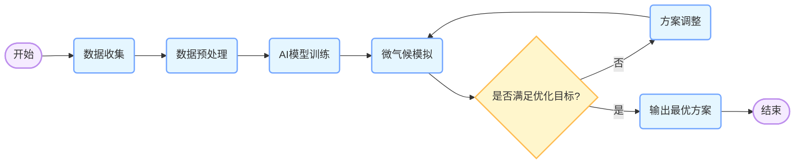

# AI辅助城市微气候优化：从建筑布局到绿化规划

> 关键词：AI、城市微气候优化、建筑布局、绿化规划、计算机模拟

> 摘要：本文聚焦于AI在城市微气候优化中的应用，从建筑布局和绿化规划两个关键方面展开深入探讨。首先介绍了相关背景知识，包括目的、预期读者、文档结构和术语表。接着阐述了核心概念及其联系，给出了原理和架构的文本示意图与Mermaid流程图。详细讲解了核心算法原理和具体操作步骤，通过Python源代码进行说明。运用数学模型和公式进一步阐释相关理论，并举例说明。通过项目实战，展示了代码实际案例及详细解释。分析了实际应用场景，推荐了学习资源、开发工具框架和相关论文著作。最后总结了未来发展趋势与挑战，并给出常见问题解答和扩展阅读参考资料，旨在为城市规划者和研究者提供全面的AI辅助城市微气候优化的技术指导。

## 1. 背景介绍 
### 1.1 目的和范围
城市微气候与居民的生活质量、能源消耗以及生态环境密切相关。不合理的建筑布局和绿化规划可能导致城市热岛效应加剧、通风不畅等问题。本文章的目的在于探讨如何利用AI技术优化城市微气候，从建筑布局的合理设计到绿化规划的科学安排，提供一套系统的解决方案。范围涵盖了从理论研究到实际应用的多个层面，包括核心概念的解释、算法原理的分析、项目实战案例以及实际应用场景的探讨。

### 1.2 预期读者
本文预期读者包括城市规划师、建筑师、环境科学研究者、AI技术开发者以及对城市可持续发展感兴趣的相关人员。对于城市规划和建筑领域的专业人士，可从中获取利用AI改善城市微气候的新思路和方法；对于AI开发者，能了解到AI在城市环境领域的具体应用场景和技术需求；而对于普通读者，有助于增强对城市微气候问题的认识和理解。

### 1.3 文档结构概述
本文共分为十个部分。第一部分为背景介绍，阐述了文章的目的、预期读者、文档结构和术语表。第二部分介绍核心概念与联系，给出原理和架构的文本示意图与Mermaid流程图。第三部分详细讲解核心算法原理和具体操作步骤，通过Python源代码进行说明。第四部分运用数学模型和公式进一步阐释相关理论，并举例说明。第五部分通过项目实战，展示代码实际案例及详细解释。第六部分分析实际应用场景。第七部分推荐学习资源、开发工具框架和相关论文著作。第八部分总结未来发展趋势与挑战。第九部分为附录，解答常见问题。第十部分提供扩展阅读和参考资料。

### 1.4 术语表
#### 1.4.1 核心术语定义
- **城市微气候**：指城市中局部地区因建筑物、绿化、交通等因素影响而形成的独特气候条件，包括温度、湿度、风速、风向等气象要素的变化。
- **建筑布局**：指城市中各类建筑物的分布、朝向、间距等空间布置方式，对城市微气候有着重要影响。
- **绿化规划**：是指对城市中绿地、树木、花卉等植被的合理安排和设计，旨在改善城市生态环境和微气候。
- **AI（人工智能）**：是一门研究如何使计算机系统能够模拟人类智能的学科，通过机器学习、深度学习等技术实现对数据的分析和决策。

#### 1.4.2 相关概念解释
- **城市热岛效应**：由于城市下垫面性质改变、人工热源释放等原因，导致城市中心区域气温明显高于周边郊区的现象。
- **通风廊道**：是指在城市中规划建设的具有一定宽度和长度的通道，能够引导自然风进入城市，改善城市通风状况，降低热岛效应。
- **机器学习**：是AI的一个重要分支，通过让计算机从数据中学习模式和规律，从而实现对未知数据的预测和分类。

#### 1.4.3 缩略词列表
- **AI**：Artificial Intelligence（人工智能）
- **ML**：Machine Learning（机器学习）
- **DL**：Deep Learning（深度学习）

## 2. 核心概念与联系 

### 核心概念原理
城市微气候优化的核心在于通过合理的建筑布局和绿化规划，调节城市中的能量流动和物质交换，从而改善城市的热环境、通风状况和空气质量。建筑布局会影响城市的太阳辐射吸收、热量散发和气流运动。例如，合理的建筑间距可以增加通风，减少热量积聚；建筑物的朝向可以优化太阳辐射的接收，降低夏季制冷需求。绿化规划则通过植被的蒸腾作用、遮阳效果和对污染物的吸附作用，改善城市微气候。植被可以吸收太阳辐射，降低周围环境温度，增加空气湿度，同时还能净化空气。

AI在城市微气候优化中的应用原理是通过收集城市的地理信息、气象数据、建筑信息等多源数据，利用机器学习和深度学习算法建立城市微气候模型。这些模型可以模拟不同建筑布局和绿化规划方案下的城市微气候状况，预测温度、风速、湿度等气象要素的变化。通过对大量模拟结果的分析和比较，AI可以为城市规划者提供最优的建筑布局和绿化规划方案。

### 架构的文本示意图
```plaintext
城市微气候优化系统
|-- 数据收集模块
|   |-- 地理信息数据
|   |-- 气象数据
|   |-- 建筑信息数据
|   |-- 绿化信息数据
|-- 数据预处理模块
|   |-- 数据清洗
|   |-- 数据归一化
|   |-- 特征提取
|-- AI模型训练模块
|   |-- 机器学习算法
|   |   |-- 决策树
|   |   |-- 支持向量机
|   |-- 深度学习算法
|   |   |-- 神经网络
|   |   |-- 卷积神经网络
|-- 微气候模拟模块
|   |-- 基于AI模型的模拟
|   |-- 物理模型辅助模拟
|-- 方案优化模块
|   |-- 目标函数定义
|   |-- 优化算法应用
|   |   |-- 遗传算法
|   |   |-- 粒子群算法
|-- 结果输出模块
|   |-- 最优建筑布局方案
|   |-- 最优绿化规划方案
```

### Mermaid流程图


## 3. 核心算法原理 & 具体操作步骤 

### 核心算法原理
在城市微气候优化中，常用的机器学习算法有决策树和支持向量机，深度学习算法有神经网络和卷积神经网络。下面以神经网络为例，介绍其原理。

神经网络是一种模仿人类神经系统的计算模型，由输入层、隐藏层和输出层组成。输入层接收城市的地理信息、气象数据、建筑信息和绿化信息等多源数据，隐藏层对输入数据进行非线性变换和特征提取，输出层输出城市微气候的预测结果，如温度、风速、湿度等。

神经网络的训练过程是通过反向传播算法不断调整网络的权重和偏置，使得网络的输出结果与实际观测值之间的误差最小化。具体来说，首先将训练数据输入到神经网络中，计算网络的输出结果；然后根据输出结果与实际观测值之间的误差，计算误差的梯度；最后根据梯度下降法更新网络的权重和偏置。重复这个过程，直到误差达到一个可接受的范围。

### 具体操作步骤及Python源代码
以下是一个简单的神经网络实现城市微气候预测的Python代码示例：

```python
import numpy as np
import tensorflow as tf
from tensorflow.keras.models import Sequential
from tensorflow.keras.layers import Dense

# 生成示例数据
# 假设输入数据有10个特征，输出数据为温度、风速、湿度3个指标
# 这里简单生成一些随机数据作为示例
np.random.seed(42)
X_train = np.random.rand(1000, 10)
y_train = np.random.rand(1000, 3)

# 构建神经网络模型
model = Sequential()
model.add(Dense(64, activation='relu', input_shape=(10,)))
model.add(Dense(32, activation='relu'))
model.add(Dense(3))

# 编译模型
model.compile(optimizer='adam', loss='mse')

# 训练模型
model.fit(X_train, y_train, epochs=50, batch_size=32)

# 生成测试数据
X_test = np.random.rand(100, 10)

# 进行预测
predictions = model.predict(X_test)
print(predictions)
```

### 代码解释
1. **数据生成**：使用`numpy`生成随机的训练数据`X_train`和`y_train`，其中`X_train`有1000个样本，每个样本有10个特征；`y_train`有1000个样本，每个样本有3个输出指标。
2. **模型构建**：使用`Sequential`模型构建一个简单的神经网络，包含一个输入层、两个隐藏层和一个输出层。输入层的神经元数量为10，对应输入数据的特征数量；第一个隐藏层有64个神经元，激活函数为`relu`；第二个隐藏层有32个神经元，激活函数为`relu`；输出层有3个神经元，对应输出的温度、风速、湿度3个指标。
3. **模型编译**：使用`adam`优化器和均方误差损失函数`mse`编译模型。
4. **模型训练**：使用`fit`方法对模型进行训练，训练50个周期，每个批次包含32个样本。
5. **模型预测**：生成随机的测试数据`X_test`，使用训练好的模型进行预测，并打印预测结果。

## 4. 数学模型和公式 & 详细讲解 & 举例说明 

### 神经网络的数学模型
神经网络的基本单元是神经元，其数学模型可以表示为：

$$
z = \sum_{i=1}^{n} w_i x_i + b
$$

$$
a = f(z)
$$

其中，$x_i$ 是输入信号，$w_i$ 是连接权重，$b$ 是偏置，$z$ 是加权和，$f$ 是激活函数，$a$ 是神经元的输出。

对于一个多层神经网络，第 $l$ 层的第 $j$ 个神经元的输出可以表示为：

$$
z_j^{(l)} = \sum_{i=1}^{n_{l-1}} w_{ji}^{(l)} a_i^{(l-1)} + b_j^{(l)}
$$

$$
a_j^{(l)} = f(z_j^{(l)})
$$

其中，$n_{l-1}$ 是第 $l-1$ 层的神经元数量，$w_{ji}^{(l)}$ 是第 $l$ 层的第 $j$ 个神经元与第 $l-1$ 层的第 $i$ 个神经元之间的连接权重，$b_j^{(l)}$ 是第 $l$ 层的第 $j$ 个神经元的偏置，$a_i^{(l-1)}$ 是第 $l-1$ 层的第 $i$ 个神经元的输出。

### 反向传播算法的数学公式
反向传播算法的核心是计算误差的梯度，以更新网络的权重和偏置。假设损失函数为 $L(y, \hat{y})$，其中 $y$ 是实际观测值，$\hat{y}$ 是网络的输出结果。对于第 $l$ 层的第 $j$ 个神经元的误差 $\delta_j^{(l)}$，可以表示为：

$$
\delta_j^{(L)} = \frac{\partial L}{\partial z_j^{(L)}}
$$

$$
\delta_j^{(l)} = \left(\sum_{k=1}^{n_{l+1}} \delta_k^{(l+1)} w_{kj}^{(l+1)}\right) f'(z_j^{(l)})
$$

其中，$L$ 是网络的最后一层，$n_{l+1}$ 是第 $l+1$ 层的神经元数量，$f'$ 是激活函数的导数。

权重和偏置的更新公式为：

$$
\Delta w_{ji}^{(l)} = -\alpha \delta_j^{(l)} a_i^{(l-1)}
$$

$$
\Delta b_j^{(l)} = -\alpha \delta_j^{(l)}
$$

其中，$\alpha$ 是学习率。

### 举例说明
假设我们有一个简单的两层神经网络，输入层有2个神经元，隐藏层有3个神经元，输出层有1个神经元。输入数据为 $x = [x_1, x_2]$，隐藏层的权重矩阵为 $W^{(1)}$，偏置向量为 $b^{(1)}$，输出层的权重向量为 $W^{(2)}$，偏置为 $b^{(2)}$。

首先计算隐藏层的输入 $z^{(1)}$：

$$
z^{(1)} = W^{(1)} x + b^{(1)}
$$

然后计算隐藏层的输出 $a^{(1)}$：

$$
a^{(1)} = f(z^{(1)})
$$

接着计算输出层的输入 $z^{(2)}$：

$$
z^{(2)} = W^{(2)} a^{(1)} + b^{(2)}
$$

最后计算输出层的输出 $\hat{y}$：

$$
\hat{y} = f(z^{(2)})
$$

假设损失函数为均方误差 $L(y, \hat{y}) = \frac{1}{2}(y - \hat{y})^2$，则输出层的误差 $\delta^{(2)}$ 为：

$$
\delta^{(2)} = \frac{\partial L}{\partial z^{(2)}} = (\hat{y} - y) f'(z^{(2)})
$$

隐藏层的误差 $\delta^{(1)}$ 为：

$$
\delta^{(1)} = \left(W^{(2)T} \delta^{(2)}\right) f'(z^{(1)})
$$

根据误差更新权重和偏置：

$$
\Delta W^{(2)} = -\alpha \delta^{(2)} a^{(1)T}
$$

$$
\Delta b^{(2)} = -\alpha \delta^{(2)}
$$

$$
\Delta W^{(1)} = -\alpha \delta^{(1)} x^T
$$

$$
\Delta b^{(1)} = -\alpha \delta^{(1)}
$$

## 5. 项目实战：代码实际案例和详细解释说明 

### 5.1  开发环境搭建
#### 操作系统
可以选择Windows、Linux或macOS等主流操作系统。这里以Ubuntu 20.04为例进行说明。

#### Python环境
安装Python 3.7及以上版本。可以使用以下命令安装Python：

```bash
sudo apt update
sudo apt install python3 python3-pip
```

#### 依赖库安装
安装TensorFlow、NumPy等必要的Python库。可以使用以下命令安装：

```bash
pip3 install tensorflow numpy
```

### 5.2  源代码详细实现和代码解读
以下是一个更完整的城市微气候预测项目的Python代码示例：

```python
import numpy as np
import tensorflow as tf
from tensorflow.keras.models import Sequential
from tensorflow.keras.layers import Dense
from sklearn.model_selection import train_test_split
from sklearn.preprocessing import StandardScaler

# 生成示例数据
np.random.seed(42)
n_samples = 1000
n_features = 10
X = np.random.rand(n_samples, n_features)
y = np.random.rand(n_samples, 3)

# 数据预处理
scaler_X = StandardScaler()
X_scaled = scaler_X.fit_transform(X)

# 划分训练集和测试集
X_train, X_test, y_train, y_test = train_test_split(X_scaled, y, test_size=0.2, random_state=42)

# 构建神经网络模型
model = Sequential()
model.add(Dense(64, activation='relu', input_shape=(n_features,)))
model.add(Dense(32, activation='relu'))
model.add(Dense(3))

# 编译模型
model.compile(optimizer='adam', loss='mse')

# 训练模型
history = model.fit(X_train, y_train, epochs=100, batch_size=32, validation_data=(X_test, y_test))

# 评估模型
test_loss = model.evaluate(X_test, y_test)
print(f"Test loss: {test_loss}")

# 进行预测
predictions = model.predict(X_test)
print(predictions)
```

### 5.3  代码解读与分析
1. **数据生成**：使用`numpy`生成随机的输入数据`X`和输出数据`y`，其中`X`有1000个样本，每个样本有10个特征；`y`有1000个样本，每个样本有3个输出指标。
2. **数据预处理**：使用`StandardScaler`对输入数据进行标准化处理，使得数据的均值为0，标准差为1。这有助于提高神经网络的训练效果。
3. **数据划分**：使用`train_test_split`将数据划分为训练集和测试集，其中测试集占总数据的20%。
4. **模型构建**：使用`Sequential`模型构建一个简单的神经网络，包含一个输入层、两个隐藏层和一个输出层。输入层的神经元数量为10，对应输入数据的特征数量；第一个隐藏层有64个神经元，激活函数为`relu`；第二个隐藏层有32个神经元，激活函数为`relu`；输出层有3个神经元，对应输出的温度、风速、湿度3个指标。
5. **模型编译**：使用`adam`优化器和均方误差损失函数`mse`编译模型。
6. **模型训练**：使用`fit`方法对模型进行训练，训练100个周期，每个批次包含32个样本。同时，使用验证集`(X_test, y_test)`进行验证，记录训练过程中的损失值。
7. **模型评估**：使用`evaluate`方法对模型在测试集上的性能进行评估，计算测试集上的损失值。
8. **模型预测**：使用训练好的模型对测试集进行预测，并打印预测结果。

## 6. 实际应用场景 
### 城市新区规划
在城市新区的规划中，AI可以辅助城市规划师进行建筑布局和绿化规划的设计。通过收集新区的地理信息、气象数据等多源数据，利用AI模型模拟不同规划方案下的城市微气候状况，预测温度、风速、湿度等气象要素的变化。根据模拟结果，选择最优的建筑布局和绿化规划方案，以改善新区的微气候环境，提高居民的生活质量。

### 旧城改造
对于旧城改造项目，AI可以帮助评估现有建筑布局和绿化状况对城市微气候的影响。通过对旧城的地理信息、建筑信息和气象数据进行分析，利用AI模型找出存在的问题，如通风不畅、热岛效应明显等。然后，提出针对性的改造方案，如调整建筑布局、增加绿化面积等，以改善旧城的微气候环境。

### 大型建筑项目
在大型建筑项目的设计阶段，AI可以辅助建筑师进行建筑朝向、外形和布局的优化。通过模拟不同设计方案下的建筑周围的微气候状况，预测建筑物对周围环境的影响，如阴影分布、通风效果等。根据模拟结果，选择最优的设计方案，以减少建筑物对周围微气候的负面影响，提高建筑物的能源效率。

### 城市公园和绿地规划
AI可以为城市公园和绿地的规划提供科学依据。通过分析城市的气象数据、地形地貌和人口分布等信息，利用AI模型确定公园和绿地的最佳位置、面积和形状。同时，根据不同植物的生态特性和对微气候的影响，选择合适的植物种类进行种植，以达到改善城市微气候、净化空气和提供休闲娱乐场所的目的。

## 7. 工具和资源推荐
### 7.1 学习资源推荐
#### 7.1.1 书籍推荐
- 《人工智能：一种现代的方法》：这是一本经典的人工智能教材，全面介绍了人工智能的各个领域，包括机器学习、自然语言处理、计算机视觉等。
- 《Python机器学习》：详细介绍了Python在机器学习中的应用，包括各种机器学习算法的原理和实现，以及使用Python进行数据处理和模型训练的方法。
- 《深度学习》：由深度学习领域的三位先驱Ian Goodfellow、Yoshua Bengio和Aaron Courville合著，系统地介绍了深度学习的理论和实践。

#### 7.1.2 在线课程
- Coursera上的“机器学习”课程：由斯坦福大学教授Andrew Ng主讲，是一门非常经典的机器学习入门课程，涵盖了机器学习的基本概念、算法和应用。
- edX上的“深度学习微硕士项目”：提供了深度学习的全面学习路径，包括神经网络、卷积神经网络、循环神经网络等内容。
- 中国大学MOOC上的“人工智能基础”课程：由国内知名高校的教授授课，适合初学者了解人工智能的基本概念和技术。

#### 7.1.3 技术博客和网站
- Medium：是一个汇聚了众多技术专家和开发者的博客平台，上面有很多关于AI、机器学习和深度学习的优质文章。
- Towards Data Science：专注于数据科学和机器学习领域，提供了大量的技术文章、案例分析和教程。
- AI开源社区：国内的一个AI技术交流平台，有很多关于AI应用和实践的经验分享。

### 7.2 开发工具框架推荐
#### 7.2.1 IDE和编辑器
- PyCharm：是一款专门为Python开发设计的集成开发环境，具有代码编辑、调试、版本控制等功能，非常适合Python开发者使用。
- Jupyter Notebook：是一个基于网页的交互式开发环境，支持Python、R等多种编程语言。可以方便地进行代码编写、数据可视化和模型训练。
- Visual Studio Code：是一款轻量级的代码编辑器，支持多种编程语言和插件扩展。可以通过安装Python相关的插件，实现Python代码的开发和调试。

#### 7.2.2 调试和性能分析工具
- TensorBoard：是TensorFlow提供的一个可视化工具，可以用于查看模型的训练过程、损失曲线、参数分布等信息，帮助开发者调试和优化模型。
- PyTorch Profiler：是PyTorch提供的一个性能分析工具，可以用于分析模型的运行时间、内存使用情况等，帮助开发者找出性能瓶颈。
- cProfile：是Python标准库中的一个性能分析工具，可以用于分析Python代码的运行时间和函数调用情况。

#### 7.2.3 相关框架和库
- TensorFlow：是一个开源的机器学习框架，由Google开发和维护。提供了丰富的工具和接口，支持各种机器学习和深度学习算法的实现。
- PyTorch：是另一个流行的开源机器学习框架，由Facebook开发和维护。具有动态图机制，易于使用和调试，适合研究和开发。
- Scikit-learn：是一个简单易用的机器学习库，提供了各种机器学习算法的实现，如分类、回归、聚类等。可以用于数据预处理、模型选择和评估等任务。

### 7.3 相关论文著作推荐
#### 7.3.1 经典论文
- “Gradient-based learning applied to document recognition”：由Yann LeCun等人发表的论文，介绍了卷积神经网络（CNN）在手写数字识别中的应用，是CNN领域的经典之作。
- “ImageNet Classification with Deep Convolutional Neural Networks”：由Alex Krizhevsky等人发表的论文，介绍了AlexNet模型，在2012年的ImageNet图像分类竞赛中取得了巨大成功，开启了深度学习在计算机视觉领域的热潮。
- “Long Short-Term Memory”：由Sepp Hochreiter和Jürgen Schmidhuber发表的论文，介绍了长短期记忆网络（LSTM），是处理序列数据的经典模型。

#### 7.3.2 最新研究成果
- 可以关注顶级学术会议如NeurIPS（神经信息处理系统大会）、ICML（国际机器学习会议）、CVPR（计算机视觉与模式识别会议）等的最新研究成果，了解AI在城市微气候优化等领域的最新进展。
- 一些知名学术期刊如《Artificial Intelligence》、《Journal of Machine Learning Research》等也会发表相关的高质量研究论文。

#### 7.3.3 应用案例分析
- 可以参考一些实际应用案例的研究报告和论文，了解AI在城市规划、建筑设计等领域的具体应用方法和效果。例如，一些城市使用AI优化交通流量、改善空气质量的案例分析。

## 8. 总结：未来发展趋势与挑战
### 未来发展趋势
- **多学科融合**：AI辅助城市微气候优化将与城市规划、建筑学、环境科学等多个学科进行更深入的融合。通过跨学科的合作，能够综合考虑城市的社会、经济和环境因素，制定更加科学合理的城市规划和设计方案。
- **实时监测与动态优化**：随着传感器技术和物联网的发展，城市可以实现对微气候数据的实时监测。结合AI技术，可以根据实时监测数据动态调整建筑布局和绿化规划，实现城市微气候的实时优化。
- **智能化城市管理**：AI将在城市管理中发挥越来越重要的作用。通过建立智能化的城市管理系统，利用AI对城市微气候、交通、能源等多个方面进行综合管理和调控，提高城市的运行效率和可持续发展能力。
- **个性化城市设计**：根据不同地区、不同人群的需求和特点，利用AI实现个性化的城市设计。例如，为老年人和儿童设计更舒适的微气候环境，为商业区和住宅区提供不同的建筑布局和绿化规划方案。

### 挑战
- **数据质量和共享问题**：AI模型的训练需要大量高质量的数据，但目前城市微气候相关的数据存在质量不高、标准不统一、共享困难等问题。如何获取准确、全面、实时的数据，并实现数据的有效共享，是当前面临的一个重要挑战。
- **模型的可解释性**：深度学习模型通常是黑箱模型，其决策过程难以解释。在城市微气候优化中，需要对模型的决策结果进行解释，以便城市规划者和决策者能够理解和接受。如何提高模型的可解释性，是一个亟待解决的问题。
- **技术的复杂性和成本**：AI技术的应用需要具备一定的技术能力和专业知识，同时也需要投入大量的计算资源和成本。如何降低技术的复杂性和成本，提高技术的普及性和可操作性，是推广AI辅助城市微气候优化的关键。
- **社会和政策因素**：城市规划和设计涉及到社会、经济、政治等多个方面的因素，AI辅助城市微气候优化的实施需要得到社会各界的支持和政策的保障。如何协调各方利益，制定相应的政策和法规，是推动该领域发展的重要保障。

## 9. 附录：常见问题与解答
### 问题1：AI在城市微气候优化中的准确性如何保证？
解答：要保证AI在城市微气候优化中的准确性，需要从多个方面入手。首先，要确保数据的质量，收集准确、全面、实时的城市地理信息、气象数据、建筑信息和绿化信息等多源数据。其次，选择合适的AI模型和算法，根据具体问题进行模型的训练和优化。此外，还可以采用物理模型辅助模拟的方法，对AI模型的预测结果进行验证和修正。最后，通过不断的实验和实践，对模型进行评估和改进，提高模型的准确性和可靠性。

### 问题2：AI优化城市微气候的成本高吗？
解答：AI优化城市微气候的成本主要包括数据收集成本、计算资源成本和技术研发成本等。数据收集成本取决于数据的来源和质量，计算资源成本取决于模型的复杂度和训练规模，技术研发成本取决于所需的技术能力和专业知识。在实际应用中，可以根据具体情况选择合适的技术和方法，降低成本。例如，利用开源的AI框架和工具，共享数据资源等。同时，随着技术的不断发展和普及，AI优化城市微气候的成本也会逐渐降低。

### 问题3：AI优化城市微气候会对城市规划和设计带来哪些改变？
解答：AI优化城市微气候会对城市规划和设计带来多方面的改变。在建筑布局方面，AI可以根据微气候模拟结果，优化建筑物的分布、朝向和间距，提高城市的通风和采光效果，减少热岛效应。在绿化规划方面，AI可以根据不同植物的生态特性和对微气候的影响，选择合适的植物种类进行种植，合理安排绿地的位置和面积。此外，AI还可以帮助城市规划者进行多目标优化，综合考虑城市的经济、社会和环境效益，制定更加科学合理的城市规划和设计方案。

### 问题4：普通人如何参与到AI辅助城市微气候优化中来？
解答：普通人可以通过多种方式参与到AI辅助城市微气候优化中来。一方面，可以关注城市规划和建设项目，通过参与公众听证会、提出意见和建议等方式，表达自己对城市微气候优化的需求和期望。另一方面，可以积极参与环保活动，如植树造林、节能减排等，为改善城市微气候环境做出自己的贡献。此外，还可以学习一些AI和城市微气候的相关知识，提高自己的环保意识和科学素养。

## 10. 扩展阅读 & 参考资料
### 扩展阅读
- 《城市气候学》：深入介绍了城市气候的形成机制、特点和影响因素，以及城市气候的研究方法和应用。
- 《绿色建筑设计与技术》：介绍了绿色建筑的设计理念、技术和实践，包括建筑节能、通风采光、绿化设计等方面的内容。
- 《智能城市：技术、应用与未来发展》：探讨了智能城市的概念、技术和应用，以及智能城市在城市管理、交通、能源等领域的发展趋势。

### 参考资料
- 相关学术期刊文章，如《Journal of Applied Meteorology and Climatology》、《Urban Climate》等。
- 政府部门发布的城市规划和建设相关政策文件和报告。
- 国际组织和机构发布的关于城市可持续发展和气候变化的研究报告和指南。

作者：AI天才研究院/AI Genius Institute & 禅与计算机程序设计艺术 /Zen And The Art of Computer Programming