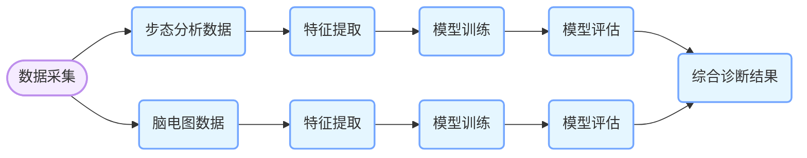

# AI辅助帕金森病早期诊断：从步态分析到脑电图解读

> 关键词：AI、帕金森病、早期诊断、步态分析、脑电图解读

> 摘要：本文聚焦于AI在帕金森病早期诊断中的应用，涵盖从步态分析到脑电图解读等多个方面。详细介绍了相关核心概念、算法原理、数学模型，通过实际案例展示了AI辅助诊断的具体实现过程。探讨了其在实际应用场景中的价值，推荐了学习资源、开发工具和相关论文。最后对未来发展趋势与挑战进行了总结，并提供了常见问题解答和扩展阅读参考资料，旨在为该领域的研究和实践提供全面的指导。

## 1. 背景介绍 
### 1.1 目的和范围
帕金森病是一种常见的神经系统退行性疾病，早期诊断对于患者的治疗和预后至关重要。然而，目前帕金森病的早期诊断存在一定的困难，传统的诊断方法往往依赖于医生的临床经验和主观判断，缺乏客观、准确的指标。本文章的目的在于探讨如何利用人工智能技术，特别是从步态分析和脑电图解读两个方面，辅助帕金森病的早期诊断，提高诊断的准确性和效率。文章的范围涵盖了相关的核心概念、算法原理、数学模型、实际案例以及未来发展趋势等方面。

### 1.2 预期读者
本文预期读者包括医学领域的研究人员、医生、护士，计算机科学领域的研究人员、程序员、软件工程师，以及对人工智能在医疗领域应用感兴趣的爱好者。对于医学专业人士，本文可以提供新的诊断思路和方法；对于计算机专业人士，本文可以展示如何将人工智能技术应用于实际的医疗问题；对于爱好者，本文可以帮助他们了解人工智能在医疗领域的前沿应用。

### 1.3 文档结构概述
本文将按照以下结构进行组织：首先介绍相关的核心概念和联系，包括帕金森病的基本信息、步态分析和脑电图解读的原理以及它们与人工智能的结合方式；接着详细阐述核心算法原理和具体操作步骤，并使用Python源代码进行说明；然后介绍相关的数学模型和公式，并通过具体例子进行讲解；再通过项目实战展示代码的实际应用和详细解释；之后探讨实际应用场景；推荐相关的工具和资源；最后对未来发展趋势与挑战进行总结，并提供常见问题解答和扩展阅读参考资料。

### 1.4 术语表
#### 1.4.1 核心术语定义
- **帕金森病（Parkinson's disease）**：一种常见的神经系统退行性疾病，主要影响中老年人，其主要症状包括震颤、僵硬、运动迟缓等。
- **步态分析（Gait analysis）**：对人体行走时的各种参数进行测量和分析的技术，包括步长、步速、步态周期等，可用于评估神经系统和运动系统的功能。
- **脑电图（Electroencephalogram, EEG）**：通过在头皮上放置电极记录大脑电活动的技术，可反映大脑的功能状态。
- **人工智能（Artificial Intelligence, AI）**：研究如何使计算机模拟人类的智能行为，包括学习、推理、决策等能力。
- **机器学习（Machine Learning, ML）**：人工智能的一个分支，通过让计算机从数据中学习模式和规律，从而实现预测和决策。
- **深度学习（Deep Learning, DL）**：机器学习的一个子领域，使用深度神经网络模型来学习数据的高级特征表示。

#### 1.4.2 相关概念解释
- **特征提取**：从原始数据中提取出能够反映数据本质特征的信息，例如在步态分析中提取步长、步速等特征，在脑电图解读中提取脑电波的频率、幅度等特征。
- **模型训练**：使用训练数据对机器学习或深度学习模型进行训练，调整模型的参数，使其能够准确地对数据进行分类或预测。
- **模型评估**：使用测试数据对训练好的模型进行评估，衡量模型的性能，常用的评估指标包括准确率、召回率、F1值等。

#### 1.4.3 缩略词列表
- **PD**：帕金森病（Parkinson's disease）
- **GBA**：步态分析（Gait analysis）
- **EEG**：脑电图（Electroencephalogram）
- **AI**：人工智能（Artificial Intelligence）
- **ML**：机器学习（Machine Learning）
- **DL**：深度学习（Deep Learning）

## 2. 核心概念与联系 
### 2.1 帕金森病概述
帕金森病是一种慢性进行性神经系统疾病，主要病理特征是中脑黑质多巴胺能神经元的变性死亡，导致多巴胺分泌减少，从而引起一系列运动和非运动症状。运动症状主要包括静止性震颤、肌强直、运动迟缓、姿势平衡障碍等；非运动症状包括睡眠障碍、便秘、嗅觉减退、抑郁等。帕金森病的早期诊断困难，因为早期症状往往不典型，容易被忽视。目前，帕金森病的诊断主要依靠医生的临床经验和体格检查，缺乏客观、准确的诊断指标。

### 2.2 步态分析原理
步态是人体行走时的运动模式，它受到神经系统、肌肉骨骼系统等多个因素的影响。帕金森病患者由于神经系统受损，往往会出现步态异常，如步长缩短、步速减慢、步态周期延长等。步态分析通过使用各种传感器（如加速度计、陀螺仪、压力传感器等）来测量人体行走时的运动参数，然后对这些参数进行分析和处理，以评估步态的特征和异常情况。步态分析可以分为客观分析和主观分析两种方法。客观分析是通过传感器获取数据，然后使用数学模型和算法进行分析；主观分析是通过医生或专家的观察和评估来判断步态的异常情况。

### 2.3 脑电图解读原理
脑电图是通过在头皮上放置电极记录大脑电活动的技术。大脑神经元的电活动产生的微弱电流可以通过头皮传导到电极上，经过放大和处理后形成脑电图信号。脑电图信号包含了丰富的信息，可以反映大脑的功能状态。帕金森病患者的脑电图往往会出现一些异常变化，如脑电波的频率、幅度、节律等方面的改变。脑电图解读就是通过对脑电图信号进行分析和处理，提取出这些异常特征，以辅助帕金森病的诊断。脑电图解读可以分为时域分析、频域分析和时频分析等方法。时域分析主要关注脑电图信号的时间特征，如波峰、波谷、持续时间等；频域分析主要关注脑电图信号的频率特征，如不同频率成分的功率谱等；时频分析则结合了时域和频域的信息，能够更全面地分析脑电图信号的特征。

### 2.4 AI与步态分析、脑电图解读的结合
人工智能技术可以为步态分析和脑电图解读提供强大的工具和方法。通过机器学习和深度学习算法，可以从大量的步态数据和脑电图数据中学习到帕金森病患者的特征模式，从而实现对帕金森病的早期诊断。例如，使用卷积神经网络（Convolutional Neural Network, CNN）可以对脑电图信号进行特征提取和分类，使用循环神经网络（Recurrent Neural Network, RNN）可以对步态数据进行序列分析和预测。AI技术还可以通过自动化的方式对数据进行处理和分析，提高诊断的效率和准确性。

### 2.5 核心概念原理和架构的文本示意图
```plaintext
                            AI辅助帕金森病早期诊断
                                ┌───────────────────┐
                                │                   │
                                │      数据采集     │
                                │                   │
                                └───────────────────┘
                                          │
                                          │
                                          ▼
 ┌───────────────────┐          ┌───────────────────┐
 │                   │          │                   │
 │    步态分析数据   │          │    脑电图数据     │
 │                   │          │                   │
 └───────────────────┘          └───────────────────┘
          │                            │
          │                            │
          ▼                            ▼
 ┌───────────────────┐          ┌───────────────────┐
 │                   │          │                   │
 │    特征提取       │          │    特征提取       │
 │                   │          │                   │
 └───────────────────┘          └───────────────────┘
          │                            │
          │                            │
          ▼                            ▼
 ┌───────────────────┐          ┌───────────────────┐
 │                   │          │                   │
 │    模型训练       │          │    模型训练       │
 │                   │          │                   │
 └───────────────────┘          └───────────────────┘
          │                            │
          │                            │
          ▼                            ▼
 ┌───────────────────┐          ┌───────────────────┐
 │                   │          │                   │
 │    模型评估       │          │    模型评估       │
 │                   │          │                   │
 └───────────────────┘          └───────────────────┘
          │                            │
          │                            │
          └─────────────┬──────────────┘
                        │
                        ▼
              ┌───────────────────┐
              │                   │
              │    综合诊断结果   │
              │                   │
              └───────────────────┘
```

### 2.6 Mermaid流程图


## 3. 核心算法原理 & 具体操作步骤 

### 3.1 特征提取算法
#### 3.1.1 步态数据特征提取
对于步态数据，我们可以使用加速度计和陀螺仪采集到的三轴加速度和角速度数据。常见的特征包括步长、步速、步态周期等。以下是一个简单的Python代码示例，用于计算步长：
```python
import numpy as np

def calculate_step_length(acceleration_data):
    """
    计算步长
    :param acceleration_data: 加速度数据，形状为 (n, 3)，n 为采样点数
    :return: 步长
    """
    # 计算加速度的模
    acceleration_magnitude = np.linalg.norm(acceleration_data, axis=1)
    # 找到加速度的峰值
    peaks, _ = find_peaks(acceleration_magnitude)
    # 计算相邻峰值之间的平均距离
    step_length = np.mean(np.diff(peaks))
    return step_length
```
#### 3.1.2 脑电图数据特征提取
对于脑电图数据，我们可以使用频域分析方法提取不同频率成分的功率谱。以下是一个使用Python的`scipy`库进行功率谱估计的代码示例：
```python
import numpy as np
from scipy import signal

def calculate_power_spectrum(eeg_data, fs):
    """
    计算脑电图数据的功率谱
    :param eeg_data: 脑电图数据，形状为 (n,)，n 为采样点数
    :param fs: 采样频率
    :return: 频率和对应的功率谱
    """
    f, Pxx = signal.welch(eeg_data, fs, nperseg=1024)
    return f, Pxx
```

### 3.2 模型训练算法
#### 3.2.1 机器学习模型
我们可以使用支持向量机（Support Vector Machine, SVM）作为机器学习模型进行帕金森病的分类。以下是一个使用Python的`sklearn`库实现SVM模型训练的代码示例：
```python
from sklearn import svm
from sklearn.model_selection import train_test_split
from sklearn.metrics import accuracy_score

def train_svm_model(X, y):
    """
    训练SVM模型
    :param X: 特征矩阵，形状为 (n_samples, n_features)
    :param y: 标签向量，形状为 (n_samples,)
    :return: 训练好的SVM模型
    """
    # 划分训练集和测试集
    X_train, X_test, y_train, y_test = train_test_split(X, y, test_size=0.2, random_state=42)
    # 创建SVM模型
    clf = svm.SVC(kernel='linear')
    # 训练模型
    clf.fit(X_train, y_train)
    # 预测测试集
    y_pred = clf.predict(X_test)
    # 计算准确率
    accuracy = accuracy_score(y_test, y_pred)
    print(f"Accuracy: {accuracy}")
    return clf
```
#### 3.2.2 深度学习模型
我们可以使用卷积神经网络（CNN）对脑电图数据进行分类。以下是一个使用Python的`Keras`库实现简单CNN模型的代码示例：
```python
from tensorflow.keras.models import Sequential
from tensorflow.keras.layers import Conv1D, MaxPooling1D, Flatten, Dense

def build_cnn_model(input_shape):
    """
    构建CNN模型
    :param input_shape: 输入数据的形状
    :return: 构建好的CNN模型
    """
    model = Sequential()
    model.add(Conv1D(filters=32, kernel_size=3, activation='relu', input_shape=input_shape))
    model.add(MaxPooling1D(pool_size=2))
    model.add(Flatten())
    model.add(Dense(64, activation='relu'))
    model.add(Dense(1, activation='sigmoid'))
    model.compile(optimizer='adam', loss='binary_crossentropy', metrics=['accuracy'])
    return model
```

### 3.3 具体操作步骤
#### 3.3.1 数据采集
使用合适的传感器（如加速度计、陀螺仪、脑电图仪等）采集帕金森病患者和健康人的步态数据和脑电图数据。确保数据的质量和准确性，记录好相关的元数据（如采样频率、采集时间等）。

#### 3.3.2 数据预处理
对采集到的数据进行预处理，包括去除噪声、归一化、插值等操作。例如，对于脑电图数据，可以使用滤波器去除工频干扰和肌电干扰。

#### 3.3.3 特征提取
使用上述的特征提取算法从预处理后的数据中提取特征。将提取到的特征保存为特征矩阵，用于后续的模型训练。

#### 3.3.4 模型训练
选择合适的模型（如SVM、CNN等），使用训练数据对模型进行训练。调整模型的参数，以提高模型的性能。

#### 3.3.5 模型评估
使用测试数据对训练好的模型进行评估，计算模型的准确率、召回率、F1值等评估指标。根据评估结果对模型进行优化和改进。

#### 3.3.6 综合诊断
将步态分析和脑电图解读的结果进行综合，得出最终的诊断结果。可以使用投票法、加权平均法等方法进行综合。

## 4. 数学模型和公式 & 详细讲解 & 举例说明 

### 4.1 步态分析数学模型
#### 4.1.1 步长计算模型
步长可以通过加速度数据计算得到。假设加速度数据为 $a(t)$，其模为 $|a(t)|$。我们可以通过找到加速度模的峰值来确定步态周期，相邻峰值之间的距离可以近似表示步长。具体公式如下：
设 $t_1, t_2, \cdots, t_n$ 为加速度模 $|a(t)|$ 的峰值对应的时间点，则步长 $L$ 可以表示为：
$$L = \frac{1}{n - 1} \sum_{i = 1}^{n - 1} (t_{i + 1} - t_i)$$

**举例说明**：假设我们采集到的加速度数据的采样频率为 $fs = 100 Hz$，加速度模的峰值对应的时间点为 $t_1 = 1 s, t_2 = 2 s, t_3 = 3 s$，则步长为：
$$L = \frac{(2 - 1) + (3 - 2)}{2} = 1 s$$
由于采样频率为 $100 Hz$，所以实际的步长对应的采样点数为 $1 \times 100 = 100$ 个采样点。

#### 4.1.2 步速计算模型
步速 $v$ 可以通过步长 $L$ 和步态周期 $T$ 计算得到，公式如下：
$$v = \frac{L}{T}$$
其中，步态周期 $T$ 为相邻两个步态的时间间隔。

**举例说明**：假设步长 $L = 1 m$，步态周期 $T = 1 s$，则步速为：
$$v = \frac{1}{1} = 1 m/s$$

### 4.2 脑电图解读数学模型
#### 4.2.1 功率谱估计模型
功率谱估计是脑电图解读中常用的方法之一。常用的功率谱估计方法有周期图法和Welch法。这里我们介绍Welch法。

设脑电图信号为 $x(n)$，采样频率为 $fs$，Welch法的功率谱估计公式如下：
将信号 $x(n)$ 分成 $K$ 段，每段长度为 $N$，段与段之间可以有重叠。对于第 $k$ 段信号 $x_k(n)$，其周期图为：
$$P_{xx}^{(k)}(f) = \frac{1}{N} \left| \sum_{n = 0}^{N - 1} x_k(n) e^{-j 2 \pi f n / fs} \right|^2$$
然后对 $K$ 段的周期图求平均，得到Welch法的功率谱估计：
$$P_{xx}(f) = \frac{1}{K} \sum_{k = 1}^{K} P_{xx}^{(k)}(f)$$

**举例说明**：假设我们有一个长度为 $N = 1024$ 的脑电图信号 $x(n)$，采样频率为 $fs = 256 Hz$。我们将信号分成 $K = 10$ 段，每段长度为 $N = 1024$，段与段之间无重叠。对于每段信号，计算其周期图，然后对 $K$ 段的周期图求平均，得到功率谱估计。

#### 4.2.2 频率特征提取模型
在脑电图解读中，我们通常关注不同频率成分的功率谱。常见的频率波段包括delta波（$0 - 4 Hz$）、theta波（$4 - 8 Hz$）、alpha波（$8 - 13 Hz$）、beta波（$13 - 30 Hz$）和gamma波（$30 - 100 Hz$）。我们可以通过对功率谱在不同频率波段内进行积分，得到各频率波段的功率。

设功率谱为 $P_{xx}(f)$，频率波段为 $[f_1, f_2]$，则该频率波段的功率 $P$ 可以表示为：
$$P = \int_{f_1}^{f_2} P_{xx}(f) df$$
在实际计算中，我们可以使用数值积分的方法来近似计算积分值。

**举例说明**：假设我们已经得到了脑电图信号的功率谱 $P_{xx}(f)$，我们要计算alpha波（$8 - 13 Hz$）的功率。我们可以使用梯形积分法来近似计算积分值：
```python
import numpy as np

def trapezoidal_integration(f, Pxx, f1, f2):
    """
    梯形积分法计算功率
    :param f: 频率数组
    :param Pxx: 功率谱数组
    :param f1: 起始频率
    :param f2: 结束频率
    :return: 功率
    """
    indices = np.where((f >= f1) & (f <= f2))[0]
    f_sub = f[indices]
    Pxx_sub = Pxx[indices]
    power = np.trapz(Pxx_sub, f_sub)
    return power
```

### 4.3 机器学习模型数学模型
#### 4.3.1 支持向量机模型
支持向量机（SVM）是一种二分类模型，其目标是找到一个最优的超平面，将不同类别的数据分开。对于线性可分的情况，设训练数据为 $(x_i, y_i)$，其中 $x_i \in \mathbb{R}^n$ 为特征向量，$y_i \in \{-1, 1\}$ 为标签。SVM的优化问题可以表示为：
$$\min_{w, b} \frac{1}{2} \|w\|^2$$
$$\text{s.t. } y_i (w^T x_i + b) \geq 1, i = 1, 2, \cdots, m$$
其中，$w$ 为超平面的法向量，$b$ 为偏置。

对于线性不可分的情况，我们可以引入松弛变量 $\xi_i \geq 0$，优化问题变为：
$$\min_{w, b, \xi} \frac{1}{2} \|w\|^2 + C \sum_{i = 1}^{m} \xi_i$$
$$\text{s.t. } y_i (w^T x_i + b) \geq 1 - \xi_i, \xi_i \geq 0, i = 1, 2, \cdots, m$$
其中，$C$ 为惩罚参数，用于控制分类误差和模型复杂度之间的平衡。

#### 4.3.2 卷积神经网络模型
卷积神经网络（CNN）是一种深度学习模型，主要由卷积层、池化层和全连接层组成。

卷积层的输出可以表示为：
$$y_{ij}^l = \sum_{k = 1}^{C^{l - 1}} \sum_{m = 0}^{M - 1} \sum_{n = 0}^{N - 1} x_{i + m, j + n}^{l - 1} w_{mnk}^l + b^l$$
其中，$y_{ij}^l$ 为第 $l$ 层卷积层的第 $(i, j)$ 个输出，$x_{i + m, j + n}^{l - 1}$ 为第 $l - 1$ 层的输入，$w_{mnk}^l$ 为卷积核的权重，$b^l$ 为偏置，$C^{l - 1}$ 为第 $l - 1$ 层的通道数，$M$ 和 $N$ 为卷积核的大小。

池化层的作用是对卷积层的输出进行下采样，常用的池化方法有最大池化和平均池化。最大池化的输出可以表示为：
$$y_{ij}^l = \max_{(m, n) \in R_{ij}} x_{mn}^{l - 1}$$
其中，$R_{ij}$ 为池化窗口的区域。

全连接层的输出可以表示为：
$$y_j^l = \sum_{i = 1}^{N^{l - 1}} w_{ij}^l x_i^{l - 1} + b_j^l$$
其中，$y_j^l$ 为第 $l$ 层全连接层的第 $j$ 个输出，$x_i^{l - 1}$ 为第 $l - 1$ 层的输入，$w_{ij}^l$ 为权重，$b_j^l$ 为偏置，$N^{l - 1}$ 为第 $l - 1$ 层的神经元个数。

## 5. 项目实战：代码实际案例和详细解释说明 

### 5.1 开发环境搭建
#### 5.1.1 安装Python
首先，需要安装Python环境。建议使用Python 3.7及以上版本。可以从Python官方网站（https://www.python.org/downloads/）下载并安装Python。

#### 5.1.2 安装必要的库
使用以下命令安装必要的Python库：
```bash
pip install numpy scipy scikit-learn tensorflow keras matplotlib
```
其中，`numpy` 用于数值计算，`scipy` 用于科学计算，`scikit-learn` 用于机器学习，`tensorflow` 和 `keras` 用于深度学习，`matplotlib` 用于数据可视化。

### 5.2 源代码详细实现和代码解读
#### 5.2.1 步态分析代码实现
```python
import numpy as np
from scipy.signal import find_peaks

def calculate_step_length(acceleration_data):
    """
    计算步长
    :param acceleration_data: 加速度数据，形状为 (n, 3)，n 为采样点数
    :return: 步长
    """
    # 计算加速度的模
    acceleration_magnitude = np.linalg.norm(acceleration_data, axis=1)
    # 找到加速度的峰值
    peaks, _ = find_peaks(acceleration_magnitude)
    # 计算相邻峰值之间的平均距离
    step_length = np.mean(np.diff(peaks))
    return step_length

# 示例数据
acceleration_data = np.random.randn(1000, 3)
step_length = calculate_step_length(acceleration_data)
print(f"Step length: {step_length}")
```
**代码解读**：
- 首先，使用 `np.linalg.norm` 函数计算加速度数据的模。
- 然后，使用 `find_peaks` 函数找到加速度模的峰值。
- 最后，计算相邻峰值之间的平均距离，作为步长。

#### 5.2.2 脑电图分析代码实现
```python
import numpy as np
from scipy import signal
import matplotlib.pyplot as plt

def calculate_power_spectrum(eeg_data, fs):
    """
    计算脑电图数据的功率谱
    :param eeg_data: 脑电图数据，形状为 (n,)，n 为采样点数
    :param fs: 采样频率
    :return: 频率和对应的功率谱
    """
    f, Pxx = signal.welch(eeg_data, fs, nperseg=1024)
    return f, Pxx

# 示例数据
fs = 256
t = np.linspace(0, 10, 10 * fs)
eeg_data = np.sin(2 * np.pi * 10 * t) + np.random.randn(len(t)) * 0.1

# 计算功率谱
f, Pxx = calculate_power_spectrum(eeg_data, fs)

# 绘制功率谱图
plt.plot(f, Pxx)
plt.xlabel('Frequency (Hz)')
plt.ylabel('Power Spectrum')
plt.title('EEG Power Spectrum')
plt.show()
```
**代码解读**：
- 首先，使用 `signal.welch` 函数计算脑电图数据的功率谱。
- 然后，使用 `matplotlib` 库绘制功率谱图。

#### 5.2.3 机器学习模型训练代码实现
```python
from sklearn import svm
from sklearn.model_selection import train_test_split
from sklearn.metrics import accuracy_score
import numpy as np

# 示例数据
X = np.random.randn(100, 10)
y = np.random.randint(0, 2, 100)

def train_svm_model(X, y):
    """
    训练SVM模型
    :param X: 特征矩阵，形状为 (n_samples, n_features)
    :param y: 标签向量，形状为 (n_samples,)
    :return: 训练好的SVM模型
    """
    # 划分训练集和测试集
    X_train, X_test, y_train, y_test = train_test_split(X, y, test_size=0.2, random_state=42)
    # 创建SVM模型
    clf = svm.SVC(kernel='linear')
    # 训练模型
    clf.fit(X_train, y_train)
    # 预测测试集
    y_pred = clf.predict(X_test)
    # 计算准确率
    accuracy = accuracy_score(y_test, y_pred)
    print(f"Accuracy: {accuracy}")
    return clf

model = train_svm_model(X, y)
```
**代码解读**：
- 首先，使用 `train_test_split` 函数将数据划分为训练集和测试集。
- 然后，创建一个线性核的SVM模型。
- 接着，使用训练集数据对模型进行训练。
- 最后，使用测试集数据对模型进行预测，并计算准确率。

#### 5.2.4 深度学习模型训练代码实现
```python
from tensorflow.keras.models import Sequential
from tensorflow.keras.layers import Conv1D, MaxPooling1D, Flatten, Dense
import numpy as np

# 示例数据
X = np.random.randn(100, 100, 1)
y = np.random.randint(0, 2, 100)

def build_cnn_model(input_shape):
    """
    构建CNN模型
    :param input_shape: 输入数据的形状
    :return: 构建好的CNN模型
    """
    model = Sequential()
    model.add(Conv1D(filters=32, kernel_size=3, activation='relu', input_shape=input_shape))
    model.add(MaxPooling1D(pool_size=2))
    model.add(Flatten())
    model.add(Dense(64, activation='relu'))
    model.add(Dense(1, activation='sigmoid'))
    model.compile(optimizer='adam', loss='binary_crossentropy', metrics=['accuracy'])
    return model

input_shape = X.shape[1:]
model = build_cnn_model(input_shape)
model.fit(X, y, epochs=10, batch_size=32)
```
**代码解读**：
- 首先，构建一个简单的CNN模型，包括卷积层、池化层、全连接层。
- 然后，使用 `compile` 方法编译模型，指定优化器、损失函数和评估指标。
- 最后，使用 `fit` 方法对模型进行训练。

### 5.3 代码解读与分析
#### 5.3.1 步态分析代码分析
步态分析代码主要通过计算加速度的模和找到峰值来计算步长。这种方法简单直观，但可能存在一些局限性，例如对于不规则的步态可能不准确。可以考虑使用更复杂的方法，如基于机器学习的方法来提高步长计算的准确性。

#### 5.3.2 脑电图分析代码分析
脑电图分析代码使用Welch法计算功率谱，并绘制功率谱图。Welch法是一种常用的功率谱估计方法，具有较好的性能。通过绘制功率谱图，可以直观地观察脑电图信号的频率特征。

#### 5.3.3 机器学习模型代码分析
机器学习模型代码使用SVM进行分类。SVM是一种强大的分类模型，具有较好的泛化能力。在实际应用中，可以尝试不同的核函数和参数，以提高模型的性能。

#### 5.3.4 深度学习模型代码分析
深度学习模型代码使用CNN进行分类。CNN在处理序列数据和图像数据方面具有优势。在实际应用中，可以增加模型的复杂度，如增加卷积层和全连接层的数量，以提高模型的性能。

## 6. 实际应用场景 
### 6.1 临床诊断辅助
在临床诊断中，AI辅助帕金森病早期诊断可以为医生提供客观、准确的诊断依据。医生可以结合AI的诊断结果和自己的临床经验，做出更准确的诊断。例如，对于一些早期症状不典型的患者，AI可以通过分析步态和脑电图数据，发现潜在的异常特征，帮助医生早期发现疾病。

### 6.2 疾病监测和跟踪
对于已经确诊的帕金森病患者，AI可以用于疾病的监测和跟踪。通过定期采集患者的步态和脑电图数据，AI可以分析患者的病情变化，评估治疗效果。医生可以根据AI的分析结果，及时调整治疗方案，提高治疗效果。

### 6.3 健康管理和预防
对于健康人群，AI可以用于帕金森病的健康管理和预防。通过采集健康人群的步态和脑电图数据，建立健康数据库。AI可以分析个体的健康状况，预测患帕金森病的风险。对于高风险人群，可以采取相应的预防措施，如改善生活方式、进行早期干预等，降低患病风险。

### 6.4 药物研发
在药物研发过程中，AI可以用于评估药物的疗效和安全性。通过采集患者在用药前后的步态和脑电图数据，AI可以分析药物对患者神经系统的影响，评估药物的疗效。同时，AI还可以监测药物的不良反应，提高药物研发的效率和安全性。

## 7. 工具和资源推荐
### 7.1 学习资源推荐
#### 7.1.1 书籍推荐
- 《Python机器学习》：本书详细介绍了Python在机器学习中的应用，包括数据预处理、模型选择、评估等方面的内容，适合初学者入门。
- 《深度学习》：由Ian Goodfellow、Yoshua Bengio和Aaron Courville所著，是深度学习领域的经典教材，涵盖了深度学习的基本原理、模型架构、训练方法等方面的内容。
- 《医学人工智能》：本书介绍了人工智能在医学领域的应用，包括疾病诊断、治疗方案推荐、医学影像分析等方面的内容，适合医学和计算机专业的读者阅读。

#### 7.1.2 在线课程
- Coursera上的“机器学习”课程：由Andrew Ng教授授课，是机器学习领域的经典课程，涵盖了机器学习的基本概念、算法和应用。
- edX上的“深度学习”课程：由深度学习领域的知名学者授课，包括卷积神经网络、循环神经网络、生成对抗网络等方面的内容。
- 中国大学MOOC上的“医学人工智能”课程：由国内知名高校的教授授课，介绍了人工智能在医学领域的应用和发展趋势。

#### 7.1.3 技术博客和网站
- Towards Data Science：是一个专注于数据科学和机器学习的博客平台，上面有很多优秀的技术文章和案例分享。
- Medium：是一个综合性的博客平台，上面有很多关于人工智能、医学等领域的文章。
- arXiv：是一个预印本服务器，上面可以找到很多最新的研究论文，包括人工智能在医学领域的应用研究。

### 7.2 开发工具框架推荐
#### 7.2.1 IDE和编辑器
- PyCharm：是一款专门为Python开发设计的集成开发环境，具有代码编辑、调试、版本控制等功能，适合专业的Python开发者使用。
- Jupyter Notebook：是一个交互式的开发环境，可以实时运行代码、展示结果和可视化数据，适合数据科学和机器学习的实验和研究。
- Visual Studio Code：是一款轻量级的代码编辑器，支持多种编程语言和插件扩展，适合快速开发和调试代码。

#### 7.2.2 调试和性能分析工具
- TensorBoard：是TensorFlow提供的一个可视化工具，可以用于可视化模型的训练过程、损失函数、评估指标等，帮助开发者调试和优化模型。
- Py-Spy：是一个Python性能分析工具，可以实时监测Python程序的CPU使用情况、函数调用时间等，帮助开发者找出性能瓶颈。
- Numba：是一个用于加速Python代码的编译器，可以将Python代码编译成机器码，提高代码的执行速度。

#### 7.2.3 相关框架和库
- TensorFlow：是一个开源的深度学习框架，由Google开发，具有高效、灵活、可扩展等特点，广泛应用于图像识别、自然语言处理等领域。
- PyTorch：是一个开源的深度学习框架，由Facebook开发，具有动态图、易于调试等特点，受到很多研究者的喜爱。
- Scikit-learn：是一个开源的机器学习库，提供了丰富的机器学习算法和工具，如分类、回归、聚类等，适合初学者和专业开发者使用。

### 7.3 相关论文著作推荐
#### 7.3.1 经典论文
- "Support-Vector Networks"：介绍了支持向量机的基本原理和算法，是机器学习领域的经典论文。
- "Gradient-Based Learning Applied to Document Recognition"：介绍了卷积神经网络在手写字符识别中的应用，是深度学习领域的经典论文。
- "Long Short-Term Memory"：介绍了长短期记忆网络（LSTM）的基本原理和算法，是循环神经网络领域的经典论文。

#### 7.3.2 最新研究成果
- 在IEEE Transactions on Biomedical Engineering、Medical Image Analysis等期刊上可以找到很多关于AI辅助帕金森病早期诊断的最新研究成果。
- 在NeurIPS、ICML、CVPR等顶级学术会议上也有很多相关的研究论文。

#### 7.3.3 应用案例分析
- 可以参考一些实际的应用案例，如某医院使用AI技术辅助帕金森病诊断的案例，了解AI在实际应用中的效果和挑战。

## 8. 总结：未来发展趋势与挑战
### 8.1 未来发展趋势
#### 8.1.1 多模态数据融合
未来，AI辅助帕金森病早期诊断将不仅仅依赖于步态分析和脑电图解读，还会融合更多的模态数据，如影像学数据（如MRI、PET等）、生物标志物数据等。通过多模态数据融合，可以更全面地了解患者的病情，提高诊断的准确性和可靠性。

#### 8.1.2 个性化诊断和治疗
随着人工智能技术的发展，未来可以实现个性化的帕金森病诊断和治疗。AI可以根据患者的个体特征，如基因信息、生活方式等，为患者制定个性化的诊断方案和治疗方案，提高治疗效果。

#### 8.1.3 可解释性AI
目前，很多AI模型是黑盒模型，难以解释其决策过程和结果。未来，可解释性AI将成为研究的热点。通过开发可解释性AI模型，可以让医生更好地理解AI的诊断结果，提高医生对AI的信任度。

#### 8.1.4 智能医疗设备的发展
随着物联网和传感器技术的发展，未来会出现更多的智能医疗设备，如智能手表、智能鞋垫等。这些设备可以实时采集患者的健康数据，并通过AI技术进行分析和诊断。患者可以通过手机等终端设备随时了解自己的健康状况，实现远程医疗和健康管理。

### 8.2 挑战
#### 8.2.1 数据质量和数量
AI模型的性能很大程度上依赖于数据的质量和数量。目前，帕金森病相关的数据相对较少，且数据质量参差不齐。如何收集大量高质量的帕金森病数据，是AI辅助诊断面临的一个挑战。

#### 8.2.2 模型的泛化能力
不同地区、不同种族的帕金森病患者可能具有不同的特征。如何提高AI模型的泛化能力，使其在不同的人群中都能取得较好的诊断效果，是一个需要解决的问题。

#### 8.2.3 伦理和法律问题
AI辅助诊断涉及到患者的隐私和权益问题。如何保护患者的隐私，确保AI模型的公正和公平，以及如何解决AI诊断结果的法律责任问题，是需要深入探讨的伦理和法律问题。

#### 8.2.4 医生和患者的接受度
AI辅助诊断是一种新的诊断方式，医生和患者对其接受度可能存在差异。如何提高医生和患者对AI辅助诊断的信任度和接受度，是推广AI辅助诊断的关键。

## 9. 附录：常见问题与解答
### 9.1 问题1：AI辅助诊断的准确性如何保证？
答：AI辅助诊断的准确性可以通过以下几个方面来保证：
- 数据质量：收集大量高质量的帕金森病数据，包括步态数据、脑电图数据等，并进行严格的数据预处理和标注。
- 模型选择和优化：选择合适的机器学习和深度学习模型，并对模型进行优化和调参，以提高模型的性能。
- 模型评估：使用独立的测试数据集对模型进行评估，计算模型的准确率、召回率、F1值等评估指标，确保模型的泛化能力。
- 多模型融合：可以使用多个不同的模型进行诊断，并将它们的结果进行融合，以提高诊断的准确性。

### 9.2 问题2：AI辅助诊断是否可以替代医生的诊断？
答：AI辅助诊断不能替代医生的诊断。虽然AI可以通过分析大量的数据和学习复杂的模式，提供客观、准确的诊断建议，但医生的临床经验和专业知识仍然是不可替代的。AI辅助诊断可以为医生提供参考，帮助医生做出更准确的诊断，但最终的诊断决策还是需要医生根据患者的具体情况进行综合判断。

### 9.3 问题3：如何保护患者的隐私数据？
答：保护患者的隐私数据可以采取以下措施：
- 数据加密：对采集到的患者数据进行加密处理，确保数据在传输和存储过程中的安全性。
- 匿名化处理：在使用患者数据进行模型训练时，对数据进行匿名化处理，去除患者的个人身份信息。
- 访问控制：建立严格的访问控制机制，只有授权人员才能访问患者的数据。
- 合规性：遵守相关的法律法规和伦理准则，如《网络安全法》、《医疗数据保护条例》等。

### 9.4 问题4：AI辅助诊断的成本如何？
答：AI辅助诊断的成本包括硬件成本、软件成本、数据采集成本和人力成本等。硬件成本主要包括传感器设备、服务器等；软件成本主要包括AI模型的开发和维护成本；数据采集成本主要包括患者数据的采集和标注成本；人力成本主要包括数据分析师、算法工程师等的工资成本。随着技术的发展和规模的扩大，AI辅助诊断的成本有望逐渐降低。

## 10. 扩展阅读 & 参考资料
### 10.1 扩展阅读
- 《人工智能医学影像分析》：本书介绍了人工智能在医学影像分析中的应用，包括医学影像的预处理、特征提取、分类和分割等方面的内容。
- 《医学大数据挖掘与分析》：本书介绍了医学大数据的特点和挖掘方法，包括数据清洗、特征选择、模型构建等方面的内容。
- 《智能医疗系统设计与实现》：本书介绍了智能医疗系统的设计和实现方法，包括医疗数据采集、传输、存储和分析等方面的内容。

### 10.2 参考资料
- [Parkinson's Disease Foundation](https://www.pdf.org/)
- [Alzheimer's Association](https://www.alz.org/)
- [IEEE Transactions on Biomedical Engineering](https://ieeexplore.ieee.org/xpl/RecentIssue.jsp?punumber=10)
- [Medical Image Analysis](https://www.journals.elsevier.com/medical-image-analysis)

作者：AI天才研究院/AI Genius Institute & 禅与计算机程序设计艺术 /Zen And The Art of Computer Programming