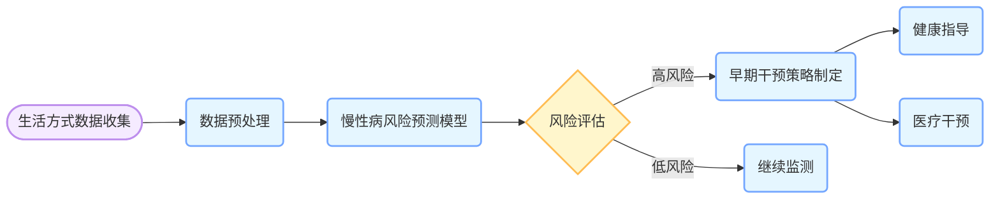

# AI辅助慢性病风险预测：从生活方式分析到早期干预

> 关键词：AI、慢性病风险预测、生活方式分析、早期干预、机器学习

> 摘要：本文围绕AI辅助慢性病风险预测展开，从生活方式分析逐步过渡到早期干预。详细介绍了相关核心概念、算法原理、数学模型，通过项目实战展示代码实现与解读。探讨了实际应用场景，推荐了学习资源、开发工具和相关论文著作。最后总结了未来发展趋势与挑战，并对常见问题进行解答。旨在为利用AI技术进行慢性病风险预测和早期干预提供全面且深入的技术指导。

## 1. 背景介绍 
### 1.1 目的和范围
随着全球人口老龄化的加剧和生活方式的改变，慢性病的发病率呈逐年上升趋势。慢性病如心血管疾病、糖尿病、癌症等不仅严重影响患者的生活质量，还给社会和家庭带来了沉重的经济负担。因此，如何有效地预测慢性病的发生风险，并进行早期干预成为了医学领域的研究热点。

本文章的目的是介绍如何利用人工智能（AI）技术，通过对个体生活方式的分析，实现慢性病风险的准确预测，并为早期干预提供科学依据。文章将涵盖从数据收集、特征提取、模型构建到风险评估和干预策略制定的全过程，旨在为相关领域的研究人员、医疗从业者和技术开发者提供全面的技术指导。

### 1.2 预期读者
本文的预期读者包括但不限于以下几类人群：
- **医学研究人员**：希望了解AI技术在慢性病研究中的应用，为开展相关研究提供新思路和方法。
- **医疗从业者**：包括医生、护士等，希望借助AI工具提高慢性病的早期诊断和干预水平，改善患者的健康状况。
- **技术开发者**：对AI技术在医疗领域的应用感兴趣，希望学习如何开发相关的预测模型和应用系统。
- **健康管理专家**：关注个体健康管理，希望通过分析生活方式因素，制定个性化的健康干预方案，预防慢性病的发生。

### 1.3 文档结构概述
本文将按照以下结构进行组织：
- **核心概念与联系**：介绍慢性病风险预测、生活方式分析和早期干预的核心概念，以及它们之间的联系。
- **核心算法原理 & 具体操作步骤**：详细阐述用于慢性病风险预测的AI算法原理，并给出具体的操作步骤。
- **数学模型和公式 & 详细讲解 & 举例说明**：介绍相关的数学模型和公式，并通过具体的例子进行详细讲解。
- **项目实战：代码实际案例和详细解释说明**：通过一个实际的项目案例，展示如何使用Python实现慢性病风险预测模型，并对代码进行详细解释。
- **实际应用场景**：探讨AI辅助慢性病风险预测在实际医疗和健康管理中的应用场景。
- **工具和资源推荐**：推荐相关的学习资源、开发工具和论文著作，帮助读者进一步深入学习和研究。
- **总结：未来发展趋势与挑战**：总结AI辅助慢性病风险预测的未来发展趋势，并分析面临的挑战。
- **附录：常见问题与解答**：对读者可能关心的常见问题进行解答。
- **扩展阅读 & 参考资料**：提供相关的扩展阅读材料和参考资料，方便读者进一步探索。

### 1.4 术语表
#### 1.4.1 核心术语定义
- **慢性病**：是指不构成传染、具有长期积累形成疾病形态损害的疾病的总称，如心血管疾病、糖尿病、癌症等。
- **风险预测**：根据个体的特征和相关因素，预测其未来发生某种疾病的可能性。
- **生活方式分析**：对个体的生活习惯、行为方式等进行分析，包括饮食、运动、吸烟、饮酒等方面。
- **早期干预**：在疾病发生的早期阶段，采取相应的措施进行干预，以延缓或阻止疾病的发展。
- **人工智能（AI）**：是一门研究如何使计算机能够模拟人类智能的学科，包括机器学习、深度学习等技术。
- **机器学习**：是AI的一个重要分支，通过让计算机从数据中学习模式和规律，实现对未知数据的预测和分类。
- **深度学习**：是一种基于神经网络的机器学习技术，具有强大的特征提取和模式识别能力。

#### 1.4.2 相关概念解释
- **特征提取**：从原始数据中提取出对预测结果有重要影响的特征，以减少数据维度和提高模型的性能。
- **模型评估**：使用一定的评估指标对训练好的模型进行评估，以衡量模型的性能和准确性。
- **交叉验证**：是一种常用的模型评估方法，将数据集分成多个子集，轮流使用不同的子集进行训练和测试，以提高模型的泛化能力。
- **过拟合**：模型在训练数据上表现良好，但在测试数据上表现不佳的现象，通常是由于模型过于复杂导致的。
- **欠拟合**：模型在训练数据和测试数据上的表现都不佳的现象，通常是由于模型过于简单导致的。

#### 1.4.3 缩略词列表
- **AI**：Artificial Intelligence（人工智能）
- **ML**：Machine Learning（机器学习）
- **DL**：Deep Learning（深度学习）
- **CV**：Cross Validation（交叉验证）
- **ROC**：Receiver Operating Characteristic（受试者工作特征曲线）
- **AUC**：Area Under the Curve（曲线下面积）

## 2. 核心概念与联系 

### 2.1 核心概念原理
#### 2.1.1 慢性病风险预测
慢性病风险预测是基于个体的多种特征信息，如基本生理指标（年龄、性别、血压、血糖等）、生活方式因素（饮食、运动、吸烟、饮酒等）、家族病史等，运用统计学或机器学习方法建立预测模型，评估个体未来发生某种慢性病的可能性。其原理是通过分析大量的历史数据，找出与慢性病发生相关的危险因素，并构建模型来预测个体的发病风险。

#### 2.1.2 生活方式分析
生活方式分析是对个体日常的生活习惯和行为方式进行全面、系统的评估。不同的生活方式因素与慢性病的发生密切相关。例如，不健康的饮食习惯（高盐、高脂、高糖饮食）、缺乏运动、长期吸烟和过量饮酒等都可能增加患慢性病的风险。通过收集个体的生活方式数据，如饮食记录、运动步数、吸烟频率等，并进行分析，可以了解个体的生活方式健康状况，为慢性病风险预测提供重要的输入信息。

#### 2.1.3 早期干预
早期干预是在慢性病发生的早期阶段，通过采取一系列针对性的措施，如健康指导、生活方式调整、药物治疗等，来延缓或阻止疾病的发展。早期干预的原理是基于慢性病的发生发展是一个渐进的过程，在疾病早期进行干预可以有效地控制危险因素，降低疾病的发病率和死亡率。通过AI辅助的慢性病风险预测，可以提前识别高风险个体，为早期干预提供精准的目标人群。

### 2.2 架构的文本示意图
```plaintext
生活方式数据收集（饮食、运动、吸烟、饮酒等）
|
|__ 数据预处理（清洗、归一化、特征提取）
|
|__ 慢性病风险预测模型（机器学习/深度学习）
|       |
|       |__ 风险评估（预测个体发病概率）
|
|__ 早期干预策略制定（根据风险等级）
|       |
|       |__ 健康指导（饮食建议、运动计划等）
|       |__ 医疗干预（定期体检、药物治疗等）
```

### 2.3 Mermaid流程图


## 3. 核心算法原理 & 具体操作步骤 

### 3.1 核心算法原理
在慢性病风险预测中，常用的机器学习算法包括逻辑回归、决策树、随机森林和神经网络等。下面以逻辑回归算法为例，详细介绍其原理。

逻辑回归是一种用于二分类问题的广义线性模型，它通过逻辑函数（sigmoid函数）将线性回归的输出映射到0到1之间的概率值。假设我们有一个包含 $n$ 个特征的输入向量 $\mathbf{x} = [x_1, x_2, \cdots, x_n]^T$，逻辑回归模型的输出是个体发生慢性病的概率 $P(y = 1|\mathbf{x})$，其计算公式如下：

$$P(y = 1|\mathbf{x}) = \frac{1}{1 + e^{-(\beta_0 + \beta_1x_1 + \beta_2x_2 + \cdots + \beta_nx_n)}}$$

其中，$\beta_0, \beta_1, \cdots, \beta_n$ 是模型的参数，需要通过训练数据进行估计。逻辑回归模型的目标是找到一组最优的参数 $\beta$，使得模型对训练数据的预测概率与实际标签之间的损失最小。常用的损失函数是对数损失函数，其计算公式如下：

$$L(\beta) = -\frac{1}{m}\sum_{i = 1}^{m}[y^{(i)}\log(P(y^{(i)} = 1|\mathbf{x}^{(i)})) + (1 - y^{(i)})\log(1 - P(y^{(i)} = 1|\mathbf{x}^{(i)}))]$$

其中，$m$ 是训练数据的样本数量，$y^{(i)}$ 是第 $i$ 个样本的实际标签（0或1）。

### 3.2 具体操作步骤
#### 3.2.1 数据收集
收集与慢性病风险相关的数据，包括个体的基本生理指标、生活方式因素、家族病史等。数据可以来自医院的电子病历系统、健康监测设备、问卷调查等。

#### 3.2.2 数据预处理
- **数据清洗**：去除数据中的缺失值、异常值和重复值。
- **数据归一化**：将不同特征的取值范围进行归一化处理，使得所有特征具有相同的尺度，常用的归一化方法包括最小 - 最大归一化和Z - 分数归一化。
- **特征提取**：从原始数据中提取出对预测结果有重要影响的特征，可以使用相关性分析、主成分分析等方法进行特征选择。

#### 3.2.3 模型训练
- **划分数据集**：将预处理后的数据划分为训练集和测试集，通常按照80:20的比例进行划分。
- **模型选择**：选择合适的机器学习算法，如逻辑回归、决策树、随机森林等。
- **模型训练**：使用训练集对模型进行训练，通过优化损失函数来估计模型的参数。

#### 3.2.4 模型评估
使用测试集对训练好的模型进行评估，常用的评估指标包括准确率、召回率、F1值、ROC曲线和AUC值等。

#### 3.2.5 风险预测
使用训练好的模型对新的个体数据进行风险预测，输出个体发生慢性病的概率。

### 3.3 Python源代码实现
```python
import numpy as np
import pandas as pd
from sklearn.model_selection import train_test_split
from sklearn.linear_model import LogisticRegression
from sklearn.preprocessing import StandardScaler
from sklearn.metrics import accuracy_score, roc_auc_score

# 1. 数据收集（假设数据已经存储在CSV文件中）
data = pd.read_csv('chronic_disease_data.csv')

# 2. 数据预处理
# 分离特征和标签
X = data.drop('disease_label', axis=1)
y = data['disease_label']

# 数据归一化
scaler = StandardScaler()
X_scaled = scaler.fit_transform(X)

# 划分数据集
X_train, X_test, y_train, y_test = train_test_split(X_scaled, y, test_size=0.2, random_state=42)

# 3. 模型训练
model = LogisticRegression()
model.fit(X_train, y_train)

# 4. 模型评估
y_pred = model.predict(X_test)
y_pred_proba = model.predict_proba(X_test)[:, 1]

accuracy = accuracy_score(y_test, y_pred)
auc = roc_auc_score(y_test, y_pred_proba)

print(f"Accuracy: {accuracy}")
print(f"AUC: {auc}")

# 5. 风险预测（假设新的个体数据）
new_data = np.array([[1, 2, 3, 4, 5]])  # 示例数据
new_data_scaled = scaler.transform(new_data)
risk_proba = model.predict_proba(new_data_scaled)[:, 1]
print(f"Risk probability: {risk_proba[0]}")
```

## 4. 数学模型和公式 & 详细讲解 & 举例说明 

### 4.1 逻辑回归模型的数学推导
逻辑回归模型的核心是逻辑函数（sigmoid函数），其定义如下：

$$\sigma(z) = \frac{1}{1 + e^{-z}}$$

其中，$z$ 是线性组合 $\beta_0 + \beta_1x_1 + \beta_2x_2 + \cdots + \beta_nx_n$。sigmoid函数的图像是一个S形曲线，其取值范围在0到1之间，因此可以将其输出解释为概率值。

逻辑回归模型的目标是最大化似然函数，即找到一组最优的参数 $\beta$，使得模型对训练数据的预测概率与实际标签之间的似然性最大。似然函数的定义如下：

$$L(\beta) = \prod_{i = 1}^{m}[P(y^{(i)} = 1|\mathbf{x}^{(i)})]^{y^{(i)}}[1 - P(y^{(i)} = 1|\mathbf{x}^{(i)})]^{1 - y^{(i)}}$$

为了方便计算，通常对似然函数取对数，得到对数似然函数：

$$\log L(\beta) = \sum_{i = 1}^{m}[y^{(i)}\log(P(y^{(i)} = 1|\mathbf{x}^{(i)})) + (1 - y^{(i)})\log(1 - P(y^{(i)} = 1|\mathbf{x}^{(i)}))]$$

逻辑回归模型的训练过程就是通过最大化对数似然函数来估计模型的参数 $\beta$。常用的优化算法是梯度下降法，其基本思想是通过不断迭代更新参数 $\beta$，使得对数似然函数的值逐渐增大。

### 4.2 梯度下降法的原理和公式
梯度下降法是一种常用的优化算法，用于求解函数的最小值或最大值。在逻辑回归中，我们的目标是最大化对数似然函数，因此可以通过最小化负对数似然函数来实现。负对数似然函数的定义如下：

$$J(\beta) = -\log L(\beta) = -\frac{1}{m}\sum_{i = 1}^{m}[y^{(i)}\log(P(y^{(i)} = 1|\mathbf{x}^{(i)})) + (1 - y^{(i)})\log(1 - P(y^{(i)} = 1|\mathbf{x}^{(i)}))]$$

梯度下降法的更新公式如下：

$$\beta_j := \beta_j - \alpha\frac{\partial J(\beta)}{\partial \beta_j}$$

其中，$\alpha$ 是学习率，控制每次迭代的步长；$\frac{\partial J(\beta)}{\partial \beta_j}$ 是负对数似然函数关于参数 $\beta_j$ 的偏导数。

### 4.3 举例说明
假设我们有一个简单的二分类问题，数据集包含两个特征 $x_1$ 和 $x_2$，以及一个标签 $y$。数据集如下：

| $x_1$ | $x_2$ | $y$ |
| --- | --- | --- |
| 1 | 2 | 0 |
| 2 | 3 | 0 |
| 3 | 4 | 1 |
| 4 | 5 | 1 |

我们的目标是使用逻辑回归模型预测个体发生某种疾病的概率。

#### 4.3.1 数据预处理
首先，我们需要对数据进行归一化处理，使得所有特征具有相同的尺度。假设我们使用最小 - 最大归一化方法，将特征 $x_1$ 和 $x_2$ 归一化到0到1的范围内。

#### 4.3.2 模型训练
使用梯度下降法训练逻辑回归模型，假设学习率 $\alpha = 0.1$，迭代次数为100次。在每次迭代中，根据梯度下降法的更新公式更新模型的参数 $\beta_0, \beta_1, \beta_2$。

#### 4.3.3 风险预测
训练好模型后，我们可以使用模型对新的个体数据进行风险预测。例如，对于新的个体数据 $(x_1 = 2.5, x_2 = 3.5)$，我们可以计算其发生疾病的概率：

$$P(y = 1|x_1 = 2.5, x_2 = 3.5) = \frac{1}{1 + e^{-(\beta_0 + \beta_1\times2.5 + \beta_2\times3.5)}}$$

## 5. 项目实战：代码实际案例和详细解释说明 

### 5.1  开发环境搭建
#### 5.1.1 安装Python
首先，需要安装Python编程语言。建议使用Python 3.7及以上版本，可以从Python官方网站（https://www.python.org/downloads/）下载并安装。

#### 5.1.2 安装必要的库
在项目中，我们需要使用一些Python库来完成数据处理、模型训练和评估等任务。可以使用以下命令来安装这些库：
```sh
pip install numpy pandas scikit-learn matplotlib
```

#### 5.1.3 数据准备
假设我们有一个包含慢性病相关数据的CSV文件 `chronic_disease_data.csv`，文件中包含多个特征列和一个标签列。确保数据文件的路径正确，并且数据格式符合要求。

### 5.2  源代码详细实现和代码解读
```python
import numpy as np
import pandas as pd
from sklearn.model_selection import train_test_split
from sklearn.linear_model import LogisticRegression
from sklearn.preprocessing import StandardScaler
from sklearn.metrics import accuracy_score, roc_auc_score
import matplotlib.pyplot as plt

# 1. 数据收集
data = pd.read_csv('chronic_disease_data.csv')

# 代码解读：使用pandas库的read_csv函数读取CSV文件，并将数据存储在DataFrame对象中。

# 2. 数据预处理
# 分离特征和标签
X = data.drop('disease_label', axis=1)
y = data['disease_label']

# 代码解读：使用DataFrame的drop方法去除标签列，得到特征矩阵X；使用索引操作获取标签列y。

# 数据归一化
scaler = StandardScaler()
X_scaled = scaler.fit_transform(X)

# 代码解读：使用StandardScaler类对特征矩阵X进行标准化处理，使得每个特征的均值为0，标准差为1。

# 划分数据集
X_train, X_test, y_train, y_test = train_test_split(X_scaled, y, test_size=0.2, random_state=42)

# 代码解读：使用train_test_split函数将数据集划分为训练集和测试集，测试集占比为20%，并设置随机种子为42，以保证结果的可重复性。

# 3. 模型训练
model = LogisticRegression()
model.fit(X_train, y_train)

# 代码解读：创建一个LogisticRegression对象，并使用训练集数据对模型进行训练。

# 4. 模型评估
y_pred = model.predict(X_test)
y_pred_proba = model.predict_proba(X_test)[:, 1]

accuracy = accuracy_score(y_test, y_pred)
auc = roc_auc_score(y_test, y_pred_proba)

print(f"Accuracy: {accuracy}")
print(f"AUC: {auc}")

# 代码解读：使用训练好的模型对测试集数据进行预测，得到预测标签y_pred和预测概率y_pred_proba。使用accuracy_score和roc_auc_score函数分别计算模型的准确率和AUC值，并将结果打印输出。

# 5. 绘制ROC曲线
from sklearn.metrics import roc_curve
fpr, tpr, thresholds = roc_curve(y_test, y_pred_proba)
plt.plot(fpr, tpr, label='ROC curve (area = %0.2f)' % auc)
plt.plot([0, 1], [0, 1], 'k--')
plt.xlim([0.0, 1.0])
plt.ylim([0.0, 1.05])
plt.xlabel('False Positive Rate')
plt.ylabel('True Positive Rate')
plt.title('Receiver operating characteristic example')
plt.legend(loc="lower right")
plt.show()

# 代码解读：使用roc_curve函数计算ROC曲线的假阳性率（FPR）、真阳性率（TPR）和阈值。使用matplotlib库绘制ROC曲线，并标注AUC值。
```

### 5.3  代码解读与分析
#### 5.3.1 数据处理部分
数据处理是机器学习项目的重要环节，它直接影响到模型的性能。在本项目中，我们使用了pandas库来读取和处理数据，使用StandardScaler类对特征进行标准化处理。标准化处理可以使得不同特征具有相同的尺度，避免某些特征对模型的影响过大。

#### 5.3.2 模型训练部分
我们选择了逻辑回归模型进行慢性病风险预测。逻辑回归是一种简单而有效的二分类模型，它具有易于解释和计算效率高的优点。在训练过程中，模型通过学习训练数据的特征和标签之间的关系，估计模型的参数。

#### 5.3.3 模型评估部分
我们使用了准确率和AUC值作为模型的评估指标。准确率是指模型预测正确的样本数占总样本数的比例，它可以直观地反映模型的分类性能。AUC值是ROC曲线下的面积，它可以衡量模型在不同阈值下的分类性能，AUC值越接近1，说明模型的性能越好。

#### 5.3.4 可视化部分
我们使用matplotlib库绘制了ROC曲线，通过ROC曲线可以直观地观察模型的分类性能。ROC曲线展示了模型在不同阈值下的真阳性率和假阳性率之间的权衡关系。

## 6. 实际应用场景 
### 6.1 医疗机构
- **疾病筛查**：在医疗机构中，医生可以使用AI辅助慢性病风险预测系统对患者进行疾病筛查。通过收集患者的基本信息、生活方式数据和临床检查结果，系统可以快速评估患者患慢性病的风险。对于高风险患者，医生可以进一步进行详细的检查和诊断，以便早期发现疾病并采取相应的治疗措施。
- **个性化治疗方案制定**：根据患者的慢性病风险预测结果，医生可以为患者制定个性化的治疗方案。例如，对于患有高血压且心血管疾病风险较高的患者，医生可以在治疗高血压的同时，采取更积极的措施来控制心血管疾病的危险因素，如调整饮食、增加运动、使用药物等。
- **疾病管理和随访**：AI辅助系统可以帮助医疗机构对慢性病患者进行长期的疾病管理和随访。系统可以定期提醒患者进行体检、服药和生活方式调整，并根据患者的病情变化及时调整治疗方案。通过持续的监测和干预，可以有效地控制慢性病的发展，提高患者的生活质量。

### 6.2 健康管理机构
- **健康评估**：健康管理机构可以使用AI技术对客户进行全面的健康评估，包括慢性病风险预测。通过收集客户的生活方式数据、家族病史和健康体检结果，系统可以生成详细的健康报告，为客户提供个性化的健康建议和干预方案。
- **健康干预和促进**：基于慢性病风险预测结果，健康管理机构可以为客户制定个性化的健康干预计划，如饮食指导、运动计划、心理调节等。通过定期的健康监测和反馈，帮助客户改善生活方式，降低患慢性病的风险。
- **健康保险**：健康保险公司可以利用AI辅助慢性病风险预测技术，对投保人的健康状况进行评估，确定保险费率和保险条款。对于低风险人群，可以给予一定的优惠政策；对于高风险人群，可以提供针对性的健康管理服务，以降低保险赔付风险。

### 6.3 智能穿戴设备和移动医疗应用
- **实时监测和预警**：智能穿戴设备（如智能手环、智能手表等）可以实时收集用户的生理数据和运动数据，如心率、血压、步数等。结合AI辅助慢性病风险预测技术，设备可以对用户的健康状况进行实时监测和分析，当发现用户的慢性病风险升高时，及时发出预警信号，提醒用户采取相应的措施。
- **健康管理和指导**：移动医疗应用可以集成AI辅助慢性病风险预测功能，为用户提供个性化的健康管理和指导服务。用户可以通过应用记录自己的生活方式数据、饮食情况和运动情况，应用可以根据用户的数据和风险预测结果，为用户提供健康建议和干预方案。

## 7. 工具和资源推荐
### 7.1 学习资源推荐
#### 7.1.1 书籍推荐
- 《机器学习》（周志华）：这本书是机器学习领域的经典教材，系统地介绍了机器学习的基本概念、算法和应用。书中涵盖了逻辑回归、决策树、神经网络等常用的机器学习算法，适合初学者和有一定基础的读者阅读。
- 《深度学习》（Ian Goodfellow、Yoshua Bengio和Aaron Courville）：这本书是深度学习领域的权威著作，详细介绍了深度学习的基本原理、模型结构和训练方法。书中包含了大量的数学推导和代码示例，适合对深度学习有深入研究需求的读者阅读。
- 《Python机器学习实战》（Sebastian Raschka）：这本书以Python为工具，介绍了机器学习的基本概念和算法，并通过实际案例展示了如何使用Python实现机器学习模型。书中包含了丰富的代码示例和数据集，适合希望通过实践学习机器学习的读者阅读。

#### 7.1.2 在线课程
- Coursera上的“机器学习”课程（Andrew Ng教授）：这是一门非常经典的机器学习在线课程，由斯坦福大学的Andrew Ng教授授课。课程内容涵盖了机器学习的基本概念、算法和应用，通过视频讲解、编程作业和考试等方式，帮助学员系统地学习机器学习知识。
- edX上的“深度学习专项课程”（Andrew Ng教授）：这是一套深度学习的专项课程，由Andrew Ng教授和其他知名学者授课。课程内容包括深度学习的基础、卷积神经网络、循环神经网络等，通过实际案例和编程作业，帮助学员掌握深度学习的核心技术。
- 中国大学MOOC上的“人工智能基础”课程：这是一门面向初学者的人工智能在线课程，介绍了人工智能的基本概念、技术和应用。课程内容包括机器学习、深度学习、自然语言处理等，通过视频讲解、案例分析和实验操作，帮助学员了解人工智能的发展趋势和应用场景。

#### 7.1.3 技术博客和网站
- 博客园（https://www.cnblogs.com/）：这是一个技术博客平台，上面有很多机器学习和人工智能领域的博主分享自己的学习心得、技术文章和项目经验。可以通过搜索相关关键词，找到自己感兴趣的文章进行学习。
- 知乎（https://www.zhihu.com/）：这是一个知识问答社区，上面有很多关于机器学习和人工智能的问题和回答。可以通过关注相关话题和领域的专家，获取最新的技术动态和研究成果。
- arXiv（https://arxiv.org/）：这是一个预印本论文平台，上面有很多机器学习和人工智能领域的最新研究论文。可以通过搜索相关关键词，找到自己感兴趣的论文进行阅读和学习。

### 7.2 开发工具框架推荐
#### 7.2.1 IDE和编辑器
- PyCharm：这是一款专门为Python开发设计的集成开发环境（IDE），具有代码编辑、调试、版本控制等功能。PyCharm提供了丰富的插件和工具，可以提高开发效率。
- Jupyter Notebook：这是一个交互式的开发环境，适合进行数据探索、模型实验和代码演示。Jupyter Notebook支持多种编程语言，如Python、R等，可以将代码、文本、图像和可视化结果整合在一个文档中。
- Visual Studio Code：这是一款轻量级的代码编辑器，支持多种编程语言和插件。Visual Studio Code具有强大的代码编辑功能和调试功能，并且可以与Git等版本控制系统集成。

#### 7.2.2 调试和性能分析工具
- PDB：这是Python自带的调试器，可以在代码中设置断点，逐步执行代码，查看变量的值和程序的执行流程。
- cProfile：这是Python的性能分析工具，可以统计代码中各个函数的执行时间和调用次数，帮助开发者找出代码中的性能瓶颈。
- TensorBoard：这是TensorFlow提供的可视化工具，可以用于可视化模型的训练过程、损失函数的变化、模型的结构等。通过TensorBoard，可以直观地观察模型的训练情况，及时调整模型的参数。

#### 7.2.3 相关框架和库
- Scikit-learn：这是一个常用的机器学习库，提供了丰富的机器学习算法和工具，如分类、回归、聚类、降维等。Scikit-learn具有简单易用、文档丰富的特点，适合初学者和快速开发。
- TensorFlow：这是一个开源的深度学习框架，由Google开发。TensorFlow提供了强大的计算能力和灵活的模型构建方式，支持多种深度学习模型，如卷积神经网络、循环神经网络等。
- PyTorch：这是另一个流行的深度学习框架，由Facebook开发。PyTorch具有动态图机制，易于调试和开发，适合研究人员和开发者使用。

### 7.3 相关论文著作推荐
#### 7.3.1 经典论文
- 《A Logical Calculus of the Ideas Immanent in Nervous Activity》（Warren S. McCulloch和Walter Pitts）：这篇论文提出了人工神经网络的基本概念，为后来的神经网络研究奠定了基础。
- 《Pattern Recognition and Machine Learning》（Christopher M. Bishop）：这本书是机器学习领域的经典著作，系统地介绍了机器学习的基本概念、算法和应用。书中包含了大量的数学推导和代码示例，适合对机器学习有深入研究需求的读者阅读。
- 《Deep Residual Learning for Image Recognition》（Kaiming He等）：这篇论文提出了残差网络（ResNet）的概念，解决了深度学习中梯度消失和梯度爆炸的问题，推动了深度学习在图像识别领域的发展。

#### 7.3.2 最新研究成果
- 可以通过arXiv、IEEE Xplore、ACM Digital Library等学术数据库，搜索关于AI辅助慢性病风险预测的最新研究论文。这些论文通常会介绍最新的算法、模型和应用案例，可以帮助读者了解该领域的最新发展动态。

#### 7.3.3 应用案例分析
- 《AI in Healthcare: Transforming the Future of Medicine》（多个作者）：这本书介绍了AI技术在医疗领域的应用案例，包括疾病诊断、治疗方案制定、健康管理等方面。通过阅读这些案例，可以了解AI技术在实际医疗场景中的应用效果和挑战。

## 8. 总结：未来发展趋势与挑战
### 8.1 未来发展趋势
#### 8.1.1 多模态数据融合
未来，AI辅助慢性病风险预测将不仅仅依赖于传统的生理指标和生活方式数据，还将融合更多的多模态数据，如影像数据（X光、CT、MRI等）、基因数据、生物标志物数据等。通过多模态数据的融合，可以更全面、准确地评估个体的慢性病风险。

#### 8.1.2 个性化医疗
随着精准医学的发展，AI辅助慢性病风险预测将更加注重个性化医疗。系统将根据个体的基因信息、生活方式、环境因素等，为每个患者制定个性化的风险评估模型和干预方案，提高疾病的预防和治疗效果。

#### 8.1.3 可解释性AI
目前，许多AI模型（如深度学习模型）是黑盒模型，其决策过程难以解释。未来，可解释性AI将成为研究的热点。通过开发可解释性的AI模型和方法，可以让医生和患者更好地理解模型的决策依据，提高模型的可信度和实用性。

#### 8.1.4 边缘计算和物联网
随着物联网技术的发展，越来越多的健康监测设备（如智能手环、智能手表、智能床垫等）将被广泛应用。边缘计算技术可以将数据处理和分析任务放在设备端进行，减少数据传输延迟和隐私泄露风险。未来，AI辅助慢性病风险预测将与边缘计算和物联网技术相结合，实现实时、高效的健康监测和风险预测。

### 8.2 挑战
#### 8.2.1 数据质量和隐私问题
AI辅助慢性病风险预测需要大量的高质量数据，但目前医疗数据存在数据质量参差不齐、数据标注不准确等问题。此外，医疗数据涉及患者的隐私和敏感信息，如何在保证数据安全和隐私的前提下，实现数据的共享和利用是一个亟待解决的问题。

#### 8.2.2 模型的泛化能力
由于不同地区、不同人群的慢性病发病率和危险因素存在差异，如何提高AI模型的泛化能力，使其在不同的数据集和应用场景中都能保持良好的性能是一个挑战。

#### 8.2.3 跨学科合作
AI辅助慢性病风险预测涉及到医学、计算机科学、统计学等多个学科的知识和技术，需要跨学科的合作和交流。如何打破学科壁垒，促进不同学科之间的合作和融合是一个挑战。

#### 8.2.4 伦理和法律问题
AI技术在医疗领域的应用涉及到许多伦理和法律问题，如模型的公正性、责任归属、医疗纠纷等。如何制定相应的伦理和法律规范，保障患者的权益和安全是一个需要重视的问题。

## 9. 附录：常见问题与解答
### 9.1 问题1：AI辅助慢性病风险预测的准确性如何保证？
答：保证AI辅助慢性病风险预测的准确性需要从多个方面入手。首先，要确保数据的质量，包括数据的准确性、完整性和一致性。可以通过数据清洗、数据标注等方法来提高数据质量。其次，选择合适的算法和模型，并进行充分的模型评估和优化。可以使用交叉验证、网格搜索等方法来选择最优的模型参数。此外，还可以结合多模态数据和专家知识，提高模型的准确性和可靠性。

### 9.2 问题2：如何处理数据中的缺失值和异常值？
答：处理数据中的缺失值和异常值可以采用以下方法：
- **缺失值处理**：可以使用均值、中位数、众数等统计量来填充缺失值，也可以使用机器学习算法（如决策树、随机森林等）来预测缺失值。
- **异常值处理**：可以使用统计方法（如Z - 分数法、箱线图法等）来识别异常值，并根据具体情况进行处理。对于一些明显的错误数据，可以直接删除；对于一些可能存在的真实异常值，可以进行数据变换（如对数变换、平方根变换等）或使用鲁棒性算法来处理。

### 9.3 问题3：AI模型在实际应用中如何进行更新和维护？
答：AI模型在实际应用中需要定期进行更新和维护，以保证模型的性能和准确性。可以采用以下方法：
- **定期收集新数据**：随着时间的推移，患者的健康状况和疾病特征可能会发生变化，因此需要定期收集新的数据，以更新模型的训练集。
- **模型再训练**：使用新的数据对模型进行再训练，以调整模型的参数，提高模型的性能。
- **模型评估和监控**：定期对模型进行评估和监控，检查模型的性能指标是否发生变化。如果发现模型的性能下降，需要及时进行调整和优化。

### 9.4 问题4：AI辅助慢性病风险预测是否可以替代医生的诊断？
答：AI辅助慢性病风险预测不能替代医生的诊断。虽然AI技术可以通过分析大量的数据，提供客观的风险评估结果，但医生的诊断不仅仅依赖于数据，还需要结合患者的临床症状、体征和经验判断等因素。此外，AI模型的决策过程可能存在一定的局限性和不确定性，需要医生进行综合判断和决策。因此，AI辅助慢性病风险预测可以作为医生诊断的辅助工具，帮助医生提高诊断的准确性和效率。

## 10. 扩展阅读 & 参考资料
### 10.1 扩展阅读
- 《人工智能时代的医疗革命》：这本书介绍了AI技术在医疗领域的应用现状和发展趋势，探讨了AI技术对医疗行业的影响和挑战。
- 《大数据与精准医疗》：这本书介绍了大数据技术在精准医疗中的应用，包括数据收集、存储、分析和应用等方面。
- 《医学人工智能》：这本书系统地介绍了医学人工智能的基本概念、技术和应用，包括疾病诊断、治疗方案制定、健康管理等方面。

### 10.2 参考资料
- 相关的学术论文和研究报告，可以通过学术数据库（如IEEE Xplore、ACM Digital Library、PubMed等）进行搜索和获取。
- 医疗行业的标准和规范，如《医疗数据安全管理办法》、《人工智能医疗器械分类界定指导原则》等。
- 开源的机器学习和深度学习框架的官方文档，如Scikit - learn、TensorFlow、PyTorch等。

作者：AI天才研究院/AI Genius Institute & 禅与计算机程序设计艺术 /Zen And The Art of Computer Programming