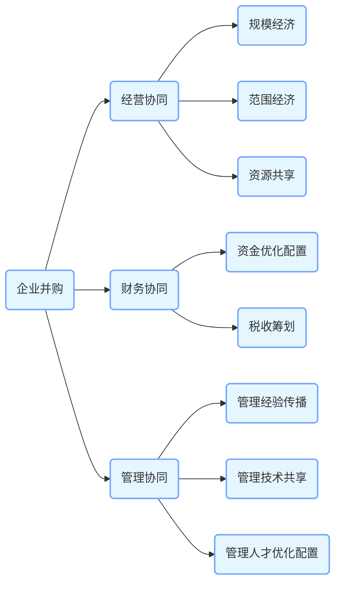

# AI辅助的企业并购协同效应预测

> 关键词：AI、企业并购、协同效应预测、机器学习、数据分析

> 摘要：本文聚焦于AI辅助的企业并购协同效应预测这一前沿话题。在企业并购活动日益频繁的背景下，准确预测协同效应对于并购决策至关重要。文章首先介绍了该研究的背景、目的、预期读者和文档结构，阐述了相关术语。接着深入探讨了核心概念与联系，包括协同效应的原理和架构，并给出了对应的示意图和流程图。详细讲解了用于协同效应预测的核心算法原理，通过Python代码进行了具体操作步骤的展示。同时，给出了相关的数学模型和公式，并举例说明。通过项目实战，展示了如何搭建开发环境、实现源代码并进行解读分析。还探讨了该技术在实际中的应用场景，推荐了学习资源、开发工具框架以及相关论文著作。最后总结了未来发展趋势与挑战，提供了常见问题解答和扩展阅读参考资料，旨在为企业和研究人员在利用AI进行企业并购协同效应预测方面提供全面且深入的指导。

## 1. 背景介绍 
### 1.1 目的和范围
企业并购是企业实现扩张和战略转型的重要手段，但并购的成功与否很大程度上取决于能否实现协同效应。协同效应是指并购后企业整体价值大于并购前各企业价值之和的效应，包括经营协同、财务协同和管理协同等方面。然而，准确预测协同效应是一个具有挑战性的问题，因为它受到众多复杂因素的影响。

本文的目的是探讨如何利用人工智能技术来辅助企业进行并购协同效应的预测。具体范围包括介绍相关的核心概念、算法原理、数学模型，通过项目实战展示具体的实现过程，分析实际应用场景，并推荐相关的学习资源、开发工具和研究论文。

### 1.2 预期读者
本文预期读者包括企业管理人员、投资银行家、财务分析师、并购顾问、人工智能研究人员以及对企业并购和人工智能应用感兴趣的专业人士。对于企业管理人员和并购顾问，本文可以为他们的并购决策提供科学的依据和方法；对于人工智能研究人员，本文可以为他们在该领域的研究提供思路和参考。

### 1.3 文档结构概述
本文将按照以下结构进行组织：
- 核心概念与联系：介绍协同效应的核心概念、原理和架构，以及人工智能在协同效应预测中的作用。
- 核心算法原理 & 具体操作步骤：详细讲解用于协同效应预测的核心算法，如机器学习算法，并通过Python代码展示具体的操作步骤。
- 数学模型和公式 & 详细讲解 & 举例说明：给出协同效应预测的数学模型和公式，并通过具体例子进行详细讲解。
- 项目实战：代码实际案例和详细解释说明：通过一个实际的项目案例，展示如何搭建开发环境、实现源代码并进行解读分析。
- 实际应用场景：探讨AI辅助的企业并购协同效应预测在实际中的应用场景。
- 工具和资源推荐：推荐相关的学习资源、开发工具框架和研究论文。
- 总结：未来发展趋势与挑战：总结AI辅助的企业并购协同效应预测的未来发展趋势和面临的挑战。
- 附录：常见问题与解答：提供常见问题的解答。
- 扩展阅读 & 参考资料：提供扩展阅读的建议和参考资料。

### 1.4 术语表
#### 1.4.1 核心术语定义
- **企业并购**：指一家企业通过购买另一家企业的股权或资产，从而获得对该企业的控制权的行为。
- **协同效应**：指并购后企业整体价值大于并购前各企业价值之和的效应，包括经营协同、财务协同和管理协同等方面。
- **经营协同**：指通过并购实现企业在生产、销售、研发等方面的协同，从而降低成本、提高效率、增加收入。
- **财务协同**：指通过并购实现企业在资金筹集、资金运用、税收筹划等方面的协同，从而降低财务成本、提高资金使用效率。
- **管理协同**：指通过并购实现企业在管理经验、管理技术、管理人才等方面的协同，从而提高企业的管理水平和运营效率。
- **人工智能（AI）**：指计算机系统能够执行通常需要人类智能才能完成的任务，如学习、推理、解决问题等。
- **机器学习**：指让计算机系统通过数据学习模式和规律，从而能够对新数据进行预测和决策的技术。

#### 1.4.2 相关概念解释
- **特征工程**：指从原始数据中提取和选择有用的特征，以便于机器学习算法进行学习和预测的过程。
- **模型评估**：指使用评估指标来衡量机器学习模型的性能和效果的过程。
- **过拟合**：指机器学习模型在训练数据上表现很好，但在测试数据上表现很差的现象。
- **欠拟合**：指机器学习模型在训练数据和测试数据上都表现很差的现象。

#### 1.4.3 缩略词列表
- **AI**：Artificial Intelligence，人工智能
- **ML**：Machine Learning，机器学习
- **PCA**：Principal Component Analysis，主成分分析
- **RMSE**：Root Mean Squared Error，均方根误差
- **MAE**：Mean Absolute Error，平均绝对误差

## 2. 核心概念与联系 
### 2.1 协同效应的原理和架构
协同效应的产生源于企业并购后在资源整合、业务互补、管理优化等方面的协同作用。从原理上来说，经营协同主要通过规模经济、范围经济和资源共享来实现。例如，两家生产同类产品的企业并购后，可以通过扩大生产规模降低单位生产成本；一家生产不同产品线的企业并购另一家企业后，可以实现生产设施、销售渠道等资源的共享，从而降低成本、提高效率。

财务协同主要通过资金的优化配置和税收筹划来实现。例如，一家现金充裕但投资机会有限的企业并购一家有良好投资项目但资金短缺的企业后，可以实现资金的有效利用；同时，通过合理的税收筹划，可以降低企业的整体税负。

管理协同主要通过管理经验的传播、管理技术的共享和管理人才的优化配置来实现。例如，一家管理水平较高的企业并购一家管理水平较低的企业后，可以将先进的管理经验和技术传授给被并购企业，提高其管理水平和运营效率。

下面是协同效应原理和架构的文本示意图：

```plaintext
企业并购
|
|--经营协同
|   |--规模经济
|   |--范围经济
|   |--资源共享
|
|--财务协同
|   |--资金优化配置
|   |--税收筹划
|
|--管理协同
|   |--管理经验传播
|   |--管理技术共享
|   |--管理人才优化配置
```

### 2.2 Mermaid流程图


### 2.3 AI在协同效应预测中的作用
人工智能技术，特别是机器学习算法，可以通过对大量历史并购数据的学习，挖掘出影响协同效应的关键因素和模式，从而建立预测模型。这些模型可以根据新的并购案例的相关数据，预测其可能产生的协同效应大小和类型。例如，通过分析历史数据中企业的财务指标、市场份额、行业竞争情况等因素与协同效应的关系，建立回归模型或分类模型，对新的并购案例进行预测。

## 3. 核心算法原理 & 具体操作步骤 
### 3.1 核心算法原理
在AI辅助的企业并购协同效应预测中，常用的机器学习算法包括线性回归、决策树、随机森林和支持向量机等。下面以线性回归为例，介绍其原理。

线性回归是一种用于建立自变量和因变量之间线性关系的统计模型。假设我们有 $n$ 个样本，每个样本有 $p$ 个特征 $x_{i1}, x_{i2}, \cdots, x_{ip}$ 和一个对应的目标值 $y_i$，线性回归模型可以表示为：

$$y_i = \beta_0 + \beta_1x_{i1} + \beta_2x_{i2} + \cdots + \beta_px_{ip} + \epsilon_i$$

其中，$\beta_0, \beta_1, \cdots, \beta_p$ 是模型的参数，$\epsilon_i$ 是误差项。线性回归的目标是找到一组最优的参数 $\beta_0, \beta_1, \cdots, \beta_p$，使得模型的预测值 $\hat{y}_i$ 与真实值 $y_i$ 之间的误差最小。常用的误差度量指标是均方误差（MSE）：

$$MSE = \frac{1}{n}\sum_{i=1}^{n}(y_i - \hat{y}_i)^2$$

通过最小化均方误差，可以得到最优的参数估计值。

### 3.2 具体操作步骤
下面是使用Python实现线性回归进行企业并购协同效应预测的具体操作步骤：

```python
import numpy as np
import pandas as pd
from sklearn.model_selection import train_test_split
from sklearn.linear_model import LinearRegression
from sklearn.metrics import mean_squared_error

# 步骤1：数据加载
# 假设我们有一个包含并购案例数据的CSV文件，文件名为'mergers_data.csv'
data = pd.read_csv('mergers_data.csv')

# 步骤2：数据预处理
# 提取特征和目标变量
X = data.drop('synergy', axis=1)  # 假设协同效应列名为'synergy'
y = data['synergy']

# 划分训练集和测试集
X_train, X_test, y_train, y_test = train_test_split(X, y, test_size=0.2, random_state=42)

# 步骤3：模型训练
# 创建线性回归模型
model = LinearRegression()

# 训练模型
model.fit(X_train, y_train)

# 步骤4：模型预测
# 在测试集上进行预测
y_pred = model.predict(X_test)

# 步骤5：模型评估
# 计算均方误差
mse = mean_squared_error(y_test, y_pred)
rmse = np.sqrt(mse)
print(f'均方根误差 (RMSE): {rmse}')
```

### 3.3 代码解释
- **数据加载**：使用 `pandas` 库的 `read_csv` 函数加载包含并购案例数据的CSV文件。
- **数据预处理**：提取特征和目标变量，使用 `train_test_split` 函数将数据划分为训练集和测试集，测试集占比为20%。
- **模型训练**：创建 `LinearRegression` 模型对象，并使用训练集数据进行训练。
- **模型预测**：使用训练好的模型对测试集数据进行预测。
- **模型评估**：使用 `mean_squared_error` 函数计算预测值和真实值之间的均方误差，并计算均方根误差（RMSE）。

## 4. 数学模型和公式 & 详细讲解 & 举例说明 
### 4.1 线性回归的数学模型和公式
线性回归的数学模型可以表示为：

$$y = \beta_0 + \beta_1x_1 + \beta_2x_2 + \cdots + \beta_px_p + \epsilon$$

其中，$y$ 是因变量（协同效应），$x_1, x_2, \cdots, x_p$ 是自变量（影响协同效应的因素，如企业的财务指标、市场份额等），$\beta_0, \beta_1, \cdots, \beta_p$ 是模型的参数，$\epsilon$ 是误差项。

最小化均方误差（MSE）的目标函数为：

$$\min_{\beta_0, \beta_1, \cdots, \beta_p} \frac{1}{n}\sum_{i=1}^{n}(y_i - (\beta_0 + \beta_1x_{i1} + \beta_2x_{i2} + \cdots + \beta_px_{ip}))^2$$

通过对目标函数求偏导数并令其等于0，可以得到正规方程：

$$(X^TX)\beta = X^Ty$$

其中，$X$ 是设计矩阵，每一行对应一个样本，每一列对应一个特征；$y$ 是目标向量；$\beta$ 是参数向量。

求解正规方程可以得到参数的最优估计值：

$$\hat{\beta} = (X^TX)^{-1}X^Ty$$

### 4.2 详细讲解
线性回归的核心思想是通过找到一条直线（或超平面），使得所有样本点到该直线（或超平面）的距离的平方和最小。这个距离的平方和就是均方误差。通过最小化均方误差，可以得到最优的参数估计值，从而得到最优的线性回归模型。

在实际应用中，由于数据可能存在噪声和多重共线性等问题，直接求解正规方程可能会导致数值不稳定。因此，通常会使用迭代算法，如梯度下降法来求解参数。

### 4.3 举例说明
假设我们有以下简单的数据集，包含两个特征 $x_1$ 和 $x_2$ 以及一个目标变量 $y$：

| $x_1$ | $x_2$ | $y$ |
|-------|-------|-----|
| 1     | 2     | 3   |
| 2     | 3     | 5   |
| 3     | 4     | 7   |

我们可以使用线性回归模型来预测 $y$ 的值。首先，我们需要将数据转换为矩阵形式：

$$X = \begin{bmatrix}
1 & 1 & 2 \\
1 & 2 & 3 \\
1 & 3 & 4
\end{bmatrix}, y = \begin{bmatrix}
3 \\
5 \\
7
\end{bmatrix}$$

然后，计算 $X^TX$ 和 $X^Ty$：

$$X^TX = \begin{bmatrix}
3 & 6 & 9 \\
6 & 14 & 20 \\
9 & 20 & 29
\end{bmatrix}, X^Ty = \begin{bmatrix}
15 \\
32 \\
47
\end{bmatrix}$$

接着，求解正规方程 $(X^TX)\beta = X^Ty$：

$$\beta = (X^TX)^{-1}X^Ty = \begin{bmatrix}
1 \\
2 \\
0
\end{bmatrix}$$

因此，线性回归模型为 $y = 1 + 2x_1 + 0x_2$。

## 5. 项目实战：代码实际案例和详细解释说明 
### 5.1  开发环境搭建
#### 5.1.1 安装Python
首先，需要安装Python编程语言。可以从Python官方网站（https://www.python.org/downloads/）下载适合自己操作系统的Python版本。建议安装Python 3.7及以上版本。

#### 5.1.2 安装必要的库
在项目中，我们需要使用一些Python库，如 `pandas`、`numpy`、`scikit-learn` 等。可以使用 `pip` 包管理工具来安装这些库：

```sh
pip install pandas numpy scikit-learn
```

### 5.2  源代码详细实现和代码解读
```python
import pandas as pd
import numpy as np
from sklearn.model_selection import train_test_split
from sklearn.ensemble import RandomForestRegressor
from sklearn.metrics import mean_squared_error, mean_absolute_error

# 步骤1：数据加载
data = pd.read_csv('mergers_data.csv')

# 步骤2：数据预处理
# 检查数据是否有缺失值
print(data.isnull().sum())

# 处理缺失值，这里简单地使用均值填充
data = data.fillna(data.mean())

# 提取特征和目标变量
X = data.drop('synergy', axis=1)
y = data['synergy']

# 划分训练集和测试集
X_train, X_test, y_train, y_test = train_test_split(X, y, test_size=0.2, random_state=42)

# 步骤3：模型训练
# 创建随机森林回归模型
model = RandomForestRegressor(n_estimators=100, random_state=42)

# 训练模型
model.fit(X_train, y_train)

# 步骤4：模型预测
# 在测试集上进行预测
y_pred = model.predict(X_test)

# 步骤5：模型评估
# 计算均方误差和平均绝对误差
mse = mean_squared_error(y_test, y_pred)
mae = mean_absolute_error(y_test, y_pred)
rmse = np.sqrt(mse)

print(f'均方根误差 (RMSE): {rmse}')
print(f'平均绝对误差 (MAE): {mae}')
```

### 5.3  代码解读与分析
- **数据加载**：使用 `pandas` 的 `read_csv` 函数加载包含并购案例数据的CSV文件。
- **数据预处理**：检查数据是否有缺失值，并使用均值填充缺失值。提取特征和目标变量，并将数据划分为训练集和测试集。
- **模型训练**：创建 `RandomForestRegressor` 模型对象，设置树的数量为100，并使用训练集数据进行训练。
- **模型预测**：使用训练好的模型对测试集数据进行预测。
- **模型评估**：使用 `mean_squared_error` 和 `mean_absolute_error` 函数计算预测值和真实值之间的均方误差和平均绝对误差，并计算均方根误差（RMSE）。

随机森林是一种集成学习算法，它通过组合多个决策树来提高模型的性能和稳定性。在企业并购协同效应预测中，随机森林可以处理高维数据和非线性关系，具有较好的预测效果。

## 6. 实际应用场景 
### 6.1 并购决策支持
在企业进行并购决策时，AI辅助的协同效应预测可以为决策者提供科学的依据。通过预测并购可能产生的协同效应大小和类型，决策者可以评估并购的潜在价值和风险，从而决定是否进行并购以及如何进行并购整合。

### 6.2 投资银行和财务顾问服务
投资银行和财务顾问可以利用AI辅助的协同效应预测技术，为客户提供更专业的并购咨询服务。他们可以帮助客户筛选潜在的并购目标，评估并购的协同效应，制定并购策略和整合方案。

### 6.3 企业战略规划
企业可以将AI辅助的协同效应预测纳入企业战略规划中。通过分析不同并购方案的协同效应，企业可以制定更加合理的扩张战略和资源配置方案，提高企业的竞争力和价值创造能力。

### 6.4 监管机构审查
监管机构在审查企业并购申请时，可以利用AI辅助的协同效应预测技术，评估并购对市场竞争和社会福利的影响。如果并购可能产生显著的协同效应，且不会对市场竞争造成不利影响，监管机构可以批准并购申请；反之，则可以采取相应的监管措施。

## 7. 工具和资源推荐
### 7.1 学习资源推荐
#### 7.1.1 书籍推荐
- 《机器学习》（周志华著）：这是一本经典的机器学习教材，系统地介绍了机器学习的基本概念、算法和应用。
- 《Python机器学习》（Sebastian Raschka著）：这本书以Python为工具，详细介绍了机器学习的各种算法和实践技巧。
- 《企业并购：理论、实务与案例》（王化成等著）：这本书全面介绍了企业并购的理论、实务和案例，对于理解企业并购的协同效应有很大的帮助。

#### 7.1.2 在线课程
- Coursera上的“机器学习”课程（Andrew Ng教授主讲）：这是一门非常受欢迎的机器学习课程，内容涵盖了机器学习的基本概念、算法和应用。
- edX上的“数据科学与机器学习微硕士项目”：这个项目提供了系统的数据分析和机器学习课程，适合想要深入学习数据科学和机器学习的人士。

#### 7.1.3 技术博客和网站
- Kaggle（https://www.kaggle.com/）：这是一个数据科学和机器学习的竞赛平台，上面有很多优秀的数据集和开源代码，可以学习到很多实际应用的经验。
- Towards Data Science（https://towardsdatascience.com/）：这是一个专注于数据科学和机器学习的技术博客，上面有很多高质量的技术文章和教程。

### 7.2 开发工具框架推荐
#### 7.2.1 IDE和编辑器
- PyCharm：这是一款专业的Python集成开发环境，提供了丰富的功能和工具，适合开发大型的Python项目。
- Jupyter Notebook：这是一个交互式的编程环境，适合进行数据探索、模型开发和实验。

#### 7.2.2 调试和性能分析工具
- Py-Spy：这是一个用于Python代码性能分析的工具，可以帮助开发者找出代码中的性能瓶颈。
- pdb：这是Python自带的调试工具，可以帮助开发者调试代码中的错误。

#### 7.2.3 相关框架和库
- scikit-learn：这是一个用于机器学习的Python库，提供了丰富的机器学习算法和工具，如分类、回归、聚类等。
- TensorFlow：这是一个开源的深度学习框架，适合开发复杂的深度学习模型。
- PyTorch：这是另一个开源的深度学习框架，具有动态图的特点，适合快速开发和实验。

### 7.3 相关论文著作推荐
#### 7.3.1 经典论文
- Jensen, M. C., & Ruback, R. S. (1983). The market for corporate control: The scientific evidence. Journal of Financial Economics, 11(1-4), 5-50. 这篇论文对企业并购的市场效率和协同效应进行了深入的研究。
- Bradley, M., Desai, A., & Kim, E. H. (1988). Synergistic gains from corporate acquisitions and their division between the stockholders of target and acquiring firms. Journal of Financial Economics, 21(1), 3-40. 这篇论文研究了企业并购的协同效应及其在收购方和目标方股东之间的分配。

#### 7.3.2 最新研究成果
可以关注顶级金融和管理学期刊，如《Journal of Finance》、《Journal of Financial Economics》、《Management Science》等，上面经常发表关于企业并购协同效应的最新研究成果。

#### 7.3.3 应用案例分析
一些商业咨询公司和研究机构会发布企业并购的应用案例分析报告，可以通过他们的官方网站或相关数据库获取这些报告，了解实际案例中的协同效应预测和并购整合策略。

## 8. 总结：未来发展趋势与挑战
### 8.1 未来发展趋势
- **多模态数据融合**：未来，AI辅助的企业并购协同效应预测将不仅仅依赖于财务数据，还会融合文本数据、图像数据、社交媒体数据等多模态数据，以更全面地了解企业的经营状况和市场环境，提高预测的准确性。
- **深度学习的应用**：深度学习模型在处理复杂数据和非线性关系方面具有强大的能力。未来，深度学习模型如卷积神经网络（CNN）、循环神经网络（RNN）等将在企业并购协同效应预测中得到更广泛的应用。
- **实时预测和动态调整**：随着信息技术的发展，企业可以实时获取市场数据和企业运营数据。未来，AI辅助的协同效应预测系统将能够实现实时预测，并根据实时数据动态调整预测结果和并购策略。
- **跨行业和跨国并购预测**：随着经济全球化的发展，跨行业和跨国并购越来越频繁。未来，AI辅助的协同效应预测将能够考虑不同行业和不同国家的特点和差异，为跨行业和跨国并购提供更准确的预测和决策支持。

### 8.2 挑战
- **数据质量和可用性**：准确的协同效应预测需要大量高质量的数据。然而，企业并购数据往往存在数据缺失、数据错误、数据不一致等问题，同时，一些敏感数据可能难以获取。如何提高数据质量和可用性是一个挑战。
- **模型解释性**：深度学习等复杂模型在提高预测准确性的同时，也降低了模型的解释性。在企业并购决策中，决策者需要了解模型的预测依据和结果的可靠性。如何提高模型的解释性是一个重要的问题。
- **法律法规和伦理问题**：AI辅助的企业并购协同效应预测涉及到大量的企业数据和个人信息，需要遵守相关的法律法规和伦理准则。如何确保数据的安全和隐私，避免算法歧视和不公平竞争是一个挑战。

## 9. 附录：常见问题与解答
### 9.1 问题1：AI辅助的协同效应预测的准确性如何？
答：AI辅助的协同效应预测的准确性受到多种因素的影响，如数据质量、模型选择、特征工程等。一般来说，通过合理的数据预处理、模型选择和调优，可以提高预测的准确性。但由于企业并购的复杂性和不确定性，预测结果仍然存在一定的误差。

### 9.2 问题2：如何选择合适的机器学习算法进行协同效应预测？
答：选择合适的机器学习算法需要考虑数据的特点、问题的类型和预测的目标。对于线性关系的数据，可以选择线性回归算法；对于非线性关系的数据，可以选择决策树、随机森林、支持向量机等算法；对于复杂的高维数据，可以考虑使用深度学习算法。同时，还可以通过交叉验证等方法比较不同算法的性能，选择最优的算法。

### 9.3 问题3：协同效应预测模型是否可以直接应用于不同行业的企业并购？
答：协同效应预测模型在不同行业的企业并购中可能需要进行适当的调整和优化。不同行业的企业具有不同的经营特点、市场环境和竞争格局，影响协同效应的因素也可能不同。因此，在应用模型时，需要考虑行业的特殊性，对模型的特征和参数进行调整。

### 9.4 问题4：如何评估协同效应预测模型的性能？
答：常用的评估指标包括均方误差（MSE）、均方根误差（RMSE）、平均绝对误差（MAE）、决定系数（$R^2$）等。均方误差和均方根误差衡量了预测值和真实值之间的平均误差；平均绝对误差衡量了预测值和真实值之间的平均绝对误差；决定系数衡量了模型对数据的拟合程度。可以根据具体的问题和需求选择合适的评估指标。

## 10. 扩展阅读 & 参考资料
### 10.1 扩展阅读
- 《大数据时代：生活、工作与思维的大变革》（维克托·迈尔 - 舍恩伯格等著）：这本书介绍了大数据时代的特点和影响，对于理解数据在企业并购协同效应预测中的作用有很大的帮助。
- 《人工智能时代：人类将何去何从》（李开复等著）：这本书探讨了人工智能对人类社会的影响和挑战，对于思考AI辅助的企业并购协同效应预测的未来发展有一定的启示。

### 10.2 参考资料
- 相关学术期刊文章和会议论文
- 企业并购相关的报告和研究资料
- 机器学习和数据科学相关的开源代码和文档

作者：AI天才研究院/AI Genius Institute & 禅与计算机程序设计艺术 /Zen And The Art of Computer Programming