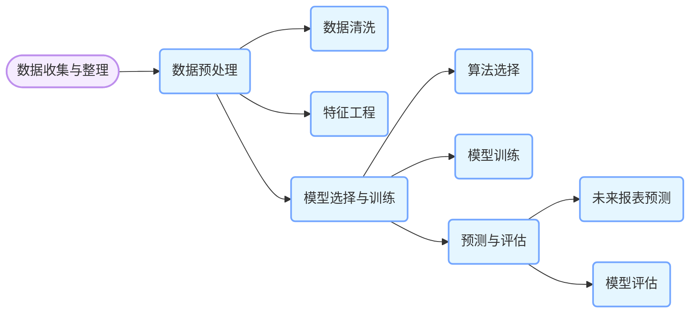

# AI辅助的公司财务报表预测

> 关键词：AI、公司财务报表预测、机器学习、数据分析、预测算法

> 摘要：本文围绕AI辅助的公司财务报表预测展开深入探讨。首先介绍了该主题的背景，包括目的、预期读者、文档结构和相关术语。接着阐述了核心概念与联系，展示了原理和架构的文本示意图及Mermaid流程图。详细讲解了核心算法原理，并用Python代码进行具体操作步骤的说明。给出了相关数学模型和公式，并举例说明。通过项目实战，包括开发环境搭建、源代码实现和解读，展示了如何运用AI进行财务报表预测。探讨了实际应用场景，推荐了学习资源、开发工具框架和相关论文著作。最后总结了未来发展趋势与挑战，还提供了常见问题解答和扩展阅读参考资料，旨在为读者全面呈现AI在公司财务报表预测领域的应用。

## 1. 背景介绍 
### 1.1 目的和范围
在当今复杂多变的商业环境中，准确预测公司财务报表对于企业决策、投资者评估以及金融机构风险管理都具有至关重要的意义。传统的财务报表预测方法往往依赖于历史数据和经验判断，存在预测精度有限、难以应对复杂市场变化等问题。本文章的目的在于深入探讨如何利用人工智能（AI）技术辅助进行公司财务报表预测，提高预测的准确性和可靠性。

本文的范围涵盖了AI在财务报表预测中的核心概念、算法原理、实际操作步骤、数学模型以及项目实战等方面。将详细介绍各种常用的AI算法，如机器学习中的线性回归、决策树、神经网络等，以及如何运用这些算法对公司的资产负债表、利润表和现金流量表进行预测。

### 1.2 预期读者
本文的预期读者包括金融从业者，如财务分析师、投资经理、风险管理专家等，他们可以通过学习AI辅助的财务报表预测方法，提升自身的专业能力和决策水平。同时，也适合对人工智能在金融领域应用感兴趣的计算机科学专业人士，以及正在学习财务和金融相关课程的学生，帮助他们了解跨学科的知识和应用。

### 1.3 文档结构概述
本文将按照以下结构进行组织：
- 核心概念与联系：介绍AI辅助财务报表预测的基本概念、原理和架构，并通过文本示意图和Mermaid流程图进行展示。
- 核心算法原理 & 具体操作步骤：详细讲解常用的AI算法原理，并给出Python源代码实现具体操作步骤。
- 数学模型和公式 & 详细讲解 & 举例说明：介绍相关的数学模型和公式，并通过具体例子进行说明。
- 项目实战：通过一个实际的项目案例，展示如何搭建开发环境、实现源代码以及对代码进行解读和分析。
- 实际应用场景：探讨AI辅助财务报表预测在不同场景下的应用。
- 工具和资源推荐：推荐学习资源、开发工具框架和相关论文著作。
- 总结：总结未来发展趋势与挑战。
- 附录：提供常见问题与解答。
- 扩展阅读 & 参考资料：列出相关的扩展阅读材料和参考资料。

### 1.4 术语表
#### 1.4.1 核心术语定义
- **人工智能（AI）**：是指计算机系统能够执行通常需要人类智能才能完成的任务，如学习、推理、解决问题等。
- **机器学习**：是AI的一个分支，它使计算机能够通过数据学习模式和规律，而无需明确的编程指令。
- **财务报表预测**：是指根据历史财务数据和其他相关信息，对公司未来的财务报表进行估计和预测。
- **特征工程**：是指从原始数据中提取和选择有用的特征，以提高机器学习模型的性能。
- **模型评估**：是指使用各种指标来评估机器学习模型的性能和准确性。

#### 1.4.2 相关概念解释
- **监督学习**：是机器学习的一种类型，其中模型通过学习输入数据和对应的标签之间的关系来进行预测。
- **无监督学习**：是机器学习的一种类型，其中模型在没有标签的情况下学习数据中的模式和结构。
- **深度学习**：是机器学习的一个子领域，它使用多层神经网络来学习数据的复杂表示。
- **时间序列分析**：是一种用于分析随时间变化的数据的统计方法，常用于财务报表预测。

#### 1.4.3 缩略词列表
- **AI**：Artificial Intelligence（人工智能）
- **ML**：Machine Learning（机器学习）
- **DL**：Deep Learning（深度学习）
- **RMSE**：Root Mean Squared Error（均方根误差）
- **MAE**：Mean Absolute Error（平均绝对误差）

## 2. 核心概念与联系 

### 核心概念原理
AI辅助的公司财务报表预测主要基于机器学习和数据分析的原理。其基本思想是通过收集和整理公司的历史财务数据以及相关的外部数据，如宏观经济指标、行业数据等，构建一个预测模型。这个模型可以学习数据中的模式和规律，并根据这些规律对未来的财务报表进行预测。

具体来说，首先需要进行数据预处理，包括数据清洗、特征工程等步骤，以提高数据的质量和可用性。然后选择合适的机器学习算法，如线性回归、决策树、神经网络等，对处理后的数据进行训练。训练过程中，模型会不断调整自身的参数，以最小化预测结果与实际值之间的误差。最后，使用训练好的模型对未来的财务报表进行预测，并对预测结果进行评估和验证。

### 架构的文本示意图
```plaintext
|-------------------|
|  数据收集与整理   |
|-------------------|
        |
        v
|-------------------|
|  数据预处理       |
|  - 数据清洗       |
|  - 特征工程       |
|-------------------|
        |
        v
|-------------------|
|  模型选择与训练   |
|  - 算法选择       |
|  - 模型训练       |
|-------------------|
        |
        v
|-------------------|
|  预测与评估       |
|  - 未来报表预测   |
|  - 模型评估       |
|-------------------|
```

### Mermaid流程图


## 3. 核心算法原理 & 具体操作步骤 

### 线性回归算法原理
线性回归是一种简单而常用的机器学习算法，用于建立自变量和因变量之间的线性关系。在财务报表预测中，我们可以将历史财务数据作为自变量，未来的财务指标作为因变量，通过线性回归模型来预测未来的财务报表。

线性回归的基本模型可以表示为：

$$y = \beta_0 + \beta_1x_1 + \beta_2x_2 + \cdots + \beta_nx_n + \epsilon$$

其中，$y$ 是因变量，$x_1, x_2, \cdots, x_n$ 是自变量，$\beta_0, \beta_1, \cdots, \beta_n$ 是模型的参数，$\epsilon$ 是误差项。

线性回归的目标是找到一组最优的参数 $\beta_0, \beta_1, \cdots, \beta_n$，使得预测值与实际值之间的误差最小。通常使用最小二乘法来求解这个问题，即最小化误差平方和：

$$\min_{\beta_0, \beta_1, \cdots, \beta_n} \sum_{i=1}^{m} (y_i - (\beta_0 + \beta_1x_{i1} + \beta_2x_{i2} + \cdots + \beta_nx_{in}))^2$$

其中，$m$ 是样本数量，$y_i$ 是第 $i$ 个样本的实际值，$x_{i1}, x_{i2}, \cdots, x_{in}$ 是第 $i$ 个样本的自变量值。

### Python源代码实现线性回归
```python
import numpy as np
from sklearn.linear_model import LinearRegression
from sklearn.model_selection import train_test_split
from sklearn.metrics import mean_squared_error

# 生成示例数据
X = np.array([[1], [2], [3], [4], [5]])
y = np.array([2, 4, 6, 8, 10])

# 划分训练集和测试集
X_train, X_test, y_train, y_test = train_test_split(X, y, test_size=0.2, random_state=42)

# 创建线性回归模型
model = LinearRegression()

# 训练模型
model.fit(X_train, y_train)

# 进行预测
y_pred = model.predict(X_test)

# 计算均方误差
mse = mean_squared_error(y_test, y_pred)
print(f"均方误差: {mse}")
```

### 决策树算法原理
决策树是一种基于树结构进行决策的机器学习算法。它通过对数据进行递归划分，构建一个树形结构，每个内部节点表示一个特征上的测试，每个分支表示一个测试输出，每个叶节点表示一个类别或值。

在财务报表预测中，决策树可以根据不同的财务指标和外部因素，对公司的财务状况进行分类和预测。决策树的构建过程通常基于信息增益、基尼不纯度等准则，选择最优的特征进行划分，以使得划分后的子集尽可能纯净。

### Python源代码实现决策树
```python
from sklearn.tree import DecisionTreeRegressor
from sklearn.model_selection import train_test_split
from sklearn.metrics import mean_squared_error
import numpy as np

# 生成示例数据
X = np.array([[1], [2], [3], [4], [5]])
y = np.array([2, 4, 6, 8, 10])

# 划分训练集和测试集
X_train, X_test, y_train, y_test = train_test_split(X, y, test_size=0.2, random_state=42)

# 创建决策树回归模型
model = DecisionTreeRegressor()

# 训练模型
model.fit(X_train, y_train)

# 进行预测
y_pred = model.predict(X_test)

# 计算均方误差
mse = mean_squared_error(y_test, y_pred)
print(f"均方误差: {mse}")
```

### 神经网络算法原理
神经网络是一种模仿人类神经系统的机器学习算法，由多个神经元组成的层次结构。每个神经元接收输入信号，经过激活函数处理后输出结果。神经网络可以学习数据中的复杂模式和非线性关系，适用于处理复杂的财务报表预测问题。

常见的神经网络结构包括多层感知机（MLP）、循环神经网络（RNN）等。在训练过程中，神经网络使用反向传播算法来调整神经元之间的权重，以最小化预测误差。

### Python源代码实现神经网络（使用Keras）
```python
from keras.models import Sequential
from keras.layers import Dense
import numpy as np
from sklearn.model_selection import train_test_split
from sklearn.metrics import mean_squared_error

# 生成示例数据
X = np.array([[1], [2], [3], [4], [5]])
y = np.array([2, 4, 6, 8, 10])

# 划分训练集和测试集
X_train, X_test, y_train, y_test = train_test_split(X, y, test_size=0.2, random_state=42)

# 创建神经网络模型
model = Sequential()
model.add(Dense(10, input_dim=1, activation='relu'))
model.add(Dense(1))

# 编译模型
model.compile(loss='mean_squared_error', optimizer='adam')

# 训练模型
model.fit(X_train, y_train, epochs=100, batch_size=1, verbose=0)

# 进行预测
y_pred = model.predict(X_test)

# 计算均方误差
mse = mean_squared_error(y_test, y_pred)
print(f"均方误差: {mse}")
```

## 4. 数学模型和公式 & 详细讲解 & 举例说明 

### 线性回归的数学模型和公式
线性回归的数学模型为：

$$y = \beta_0 + \beta_1x_1 + \beta_2x_2 + \cdots + \beta_nx_n + \epsilon$$

其中，$y$ 是因变量，$x_1, x_2, \cdots, x_n$ 是自变量，$\beta_0, \beta_1, \cdots, \beta_n$ 是模型的参数，$\epsilon$ 是误差项。

最小二乘法的目标是最小化误差平方和：

$$S(\beta_0, \beta_1, \cdots, \beta_n) = \sum_{i=1}^{m} (y_i - (\beta_0 + \beta_1x_{i1} + \beta_2x_{i2} + \cdots + \beta_nx_{in}))^2$$

为了找到最优的参数 $\beta_0, \beta_1, \cdots, \beta_n$，我们对 $S$ 分别求关于 $\beta_0, \beta_1, \cdots, \beta_n$ 的偏导数，并令其等于 0：

$$\frac{\partial S}{\partial \beta_0} = -2\sum_{i=1}^{m} (y_i - (\beta_0 + \beta_1x_{i1} + \beta_2x_{i2} + \cdots + \beta_nx_{in})) = 0$$

$$\frac{\partial S}{\partial \beta_j} = -2\sum_{i=1}^{m} (y_i - (\beta_0 + \beta_1x_{i1} + \beta_2x_{i2} + \cdots + \beta_nx_{in}))x_{ij} = 0, \quad j = 1, 2, \cdots, n$$

通过求解上述方程组，可以得到最优的参数 $\beta_0, \beta_1, \cdots, \beta_n$。

### 举例说明
假设我们有以下数据：

| $x$ | $y$ |
| --- | --- |
| 1 | 2 |
| 2 | 4 |
| 3 | 6 |
| 4 | 8 |
| 5 | 10 |

我们要使用线性回归模型预测 $y$ 与 $x$ 的关系。

首先，我们可以将数据表示为矩阵形式：

$$X = \begin{bmatrix}
1 & 1 \\
1 & 2 \\
1 & 3 \\
1 & 4 \\
1 & 5
\end{bmatrix}, \quad y = \begin{bmatrix}
2 \\
4 \\
6 \\
8 \\
10
\end{bmatrix}$$

根据最小二乘法的公式，最优参数 $\beta$ 可以通过以下公式计算：

$$\beta = (X^TX)^{-1}X^Ty$$

```python
import numpy as np

X = np.array([[1, 1], [1, 2], [1, 3], [1, 4], [1, 5]])
y = np.array([2, 4, 6, 8, 10]).reshape(-1, 1)

# 计算 (X^T X)^-1 X^T y
beta = np.linalg.inv(X.T.dot(X)).dot(X.T).dot(y)

print(f"参数 beta_0: {beta[0][0]}")
print(f"参数 beta_1: {beta[1][0]}")
```

运行上述代码，我们可以得到 $\beta_0 = 0$，$\beta_1 = 2$，即线性回归模型为 $y = 2x$。

### 决策树的数学原理
决策树的构建过程基于信息增益、基尼不纯度等准则。这里以信息增益为例进行说明。

信息增益是指在划分数据集前后信息熵的减少量。信息熵是用来衡量数据的不确定性的指标，其计算公式为：

$$H(D) = -\sum_{k=1}^{K} p_k \log_2 p_k$$

其中，$D$ 是数据集，$K$ 是类别数，$p_k$ 是第 $k$ 类样本在数据集中所占的比例。

对于一个特征 $A$，其信息增益的计算公式为：

$$Gain(D, A) = H(D) - \sum_{v=1}^{V} \frac{|D^v|}{|D|} H(D^v)$$

其中，$V$ 是特征 $A$ 的取值个数，$D^v$ 是根据特征 $A$ 的第 $v$ 个取值划分得到的子集。

决策树的构建过程就是不断选择信息增益最大的特征进行划分，直到满足停止条件。

### 神经网络的数学原理
神经网络的核心是神经元的激活函数和反向传播算法。常见的激活函数有 sigmoid 函数、ReLU 函数等。

sigmoid 函数的计算公式为：

$$\sigma(x) = \frac{1}{1 + e^{-x}}$$

ReLU 函数的计算公式为：

$$ReLU(x) = \max(0, x)$$

反向传播算法是一种用于训练神经网络的优化算法，它通过计算误差的梯度，反向传播到神经网络的每一层，调整神经元之间的权重，以最小化预测误差。

## 5. 项目实战：代码实际案例和详细解释说明 

### 5.1  开发环境搭建
#### 安装Python
首先，需要安装Python环境。可以从Python官方网站（https://www.python.org/downloads/）下载适合自己操作系统的Python版本，并按照安装向导进行安装。

#### 安装必要的库
在安装好Python后，需要安装一些必要的库，如NumPy、Pandas、Scikit-learn、Keras等。可以使用以下命令进行安装：

```sh
pip install numpy pandas scikit-learn keras
```

### 5.2  源代码详细实现和代码解读
以下是一个使用线性回归模型进行公司财务报表预测的实际案例。假设我们有一家公司的历史财务数据，包括营业收入、营业成本、净利润等，我们要使用这些数据预测未来的净利润。

```python
import numpy as np
import pandas as pd
from sklearn.linear_model import LinearRegression
from sklearn.model_selection import train_test_split
from sklearn.metrics import mean_squared_error

# 读取数据
data = pd.read_csv('financial_data.csv')

# 提取特征和目标变量
X = data[['Revenue', 'Cost']]
y = data['NetIncome']

# 划分训练集和测试集
X_train, X_test, y_train, y_test = train_test_split(X, y, test_size=0.2, random_state=42)

# 创建线性回归模型
model = LinearRegression()

# 训练模型
model.fit(X_train, y_train)

# 进行预测
y_pred = model.predict(X_test)

# 计算均方误差
mse = mean_squared_error(y_test, y_pred)
print(f"均方误差: {mse}")

# 预测未来的净利润
future_revenue = np.array([[1000, 800]])
future_net_income = model.predict(future_revenue)
print(f"未来净利润预测值: {future_net_income[0]}")
```

### 代码解读与分析
1. **数据读取**：使用 Pandas 库的 `read_csv` 函数读取存储在 `financial_data.csv` 文件中的历史财务数据。
2. **特征提取**：从数据中提取营业收入（`Revenue`）和营业成本（`Cost`）作为特征，净利润（`NetIncome`）作为目标变量。
3. **数据集划分**：使用 `train_test_split` 函数将数据集划分为训练集和测试集，其中测试集占比为 20%。
4. **模型创建与训练**：创建一个线性回归模型，并使用训练集数据对模型进行训练。
5. **模型预测与评估**：使用训练好的模型对测试集数据进行预测，并计算预测结果的均方误差。
6. **未来预测**：使用训练好的模型对未来的营业收入和营业成本进行预测，得到未来的净利润预测值。

## 6. 实际应用场景 
### 企业内部决策
企业管理层可以利用AI辅助的财务报表预测结果，制定合理的战略规划和经营决策。例如，根据预测的营业收入和利润情况，决定是否扩大生产规模、推出新产品或进入新市场。同时，预测结果也可以帮助企业进行预算编制和成本控制，提高企业的经济效益。

### 投资者评估
投资者可以通过分析AI预测的公司财务报表，评估公司的投资价值和风险。预测的财务指标，如净利润、每股收益等，可以作为投资者判断公司盈利能力和成长潜力的重要依据。此外，预测结果还可以帮助投资者比较不同公司的财务状况，做出更明智的投资决策。

### 金融机构风险管理
金融机构，如银行、保险公司等，在进行信贷审批、风险评估等业务时，可以参考AI辅助的财务报表预测结果。通过预测公司未来的偿债能力和现金流状况，金融机构可以更准确地评估贷款风险，制定合理的贷款利率和担保要求，降低金融风险。

### 行业分析与研究
研究机构和分析师可以利用AI技术对整个行业的财务报表进行预测和分析，了解行业的发展趋势和竞争格局。通过比较不同公司的预测结果，可以发现行业中的领先企业和潜在的投资机会，为行业研究和投资建议提供有力支持。

## 7. 工具和资源推荐
### 7.1 学习资源推荐
#### 7.1.1 书籍推荐
- 《Python数据分析实战》：本书介绍了如何使用Python进行数据分析和处理，包括数据清洗、可视化、机器学习等方面的内容，对于学习AI辅助的财务报表预测非常有帮助。
- 《机器学习实战》：通过实际案例介绍了各种机器学习算法的原理和应用，适合初学者入门学习。
- 《深度学习》：由深度学习领域的三位顶尖专家撰写，系统地介绍了深度学习的理论和实践，对于深入学习神经网络算法很有价值。

#### 7.1.2 在线课程
- Coursera上的“机器学习”课程：由斯坦福大学教授Andrew Ng主讲，是机器学习领域的经典课程，涵盖了线性回归、逻辑回归、神经网络等多种算法。
- edX上的“数据科学与机器学习微硕士学位课程”：提供了全面的数据科学和机器学习知识体系，包括数据预处理、模型选择、评估等方面的内容。
- 阿里云天池的“AI实战营”：提供了丰富的AI实战项目和教程，适合有一定基础的学习者进行实践和提高。

#### 7.1.3 技术博客和网站
- 博客园：是一个技术交流平台，有很多关于AI和数据分析的优秀博客文章，可以从中学习到最新的技术和经验。
- 机器之心：专注于AI领域的资讯和技术分享，提供了大量的行业动态、技术文章和开源项目。
- Kaggle：是一个数据科学竞赛平台，上面有很多关于财务数据分析和预测的竞赛项目和解决方案，可以学习到其他选手的优秀经验和方法。

### 7.2 开发工具框架推荐
#### 7.2.1 IDE和编辑器
- PyCharm：是一款专门为Python开发设计的集成开发环境，具有代码编辑、调试、版本控制等功能，非常适合Python项目的开发。
- Jupyter Notebook：是一个交互式的开发环境，可以将代码、文本、图表等内容集成在一个文档中，方便进行数据分析和模型开发。
- Visual Studio Code：是一款轻量级的代码编辑器，支持多种编程语言和插件扩展，适合快速开发和调试。

#### 7.2.2 调试和性能分析工具
- PDB：是Python自带的调试工具，可以在代码中设置断点，逐行调试程序，帮助查找代码中的错误。
- TensorBoard：是TensorFlow提供的可视化工具，可以用于可视化神经网络的训练过程、模型结构和性能指标等。
- Scikit-learn的模型评估工具：Scikit-learn库提供了丰富的模型评估指标和工具，如均方误差、准确率、召回率等，可以帮助评估模型的性能。

#### 7.2.3 相关框架和库
- NumPy：是Python的一个基础科学计算库，提供了高效的多维数组对象和数学函数，是数据分析和机器学习的基础库。
- Pandas：是一个数据处理和分析库，提供了数据结构和数据操作工具，方便进行数据清洗、转换和分析。
- Scikit-learn：是一个强大的机器学习库，提供了各种机器学习算法和工具，如分类、回归、聚类等。
- Keras：是一个高级神经网络库，基于TensorFlow、Theano等后端，提供了简单易用的API，适合快速搭建和训练神经网络模型。

### 7.3 相关论文著作推荐
#### 7.3.1 经典论文
- “A Logical Calculus of the Ideas Immanent in Nervous Activity”：由Warren McCulloch和Walter Pitts于1943年发表，提出了第一个人工神经元模型，开创了神经网络的研究领域。
- “Learning Representations by Back-propagating Errors”：由David Rumelhart、Geoffrey Hinton和Ronald Williams于1986年发表，介绍了反向传播算法，为神经网络的训练提供了有效的方法。
- “Gradient-Based Learning Applied to Document Recognition”：由Yann LeCun等人于1998年发表，提出了LeNet卷积神经网络结构，推动了卷积神经网络在图像识别领域的应用。

#### 7.3.2 最新研究成果
- 关注顶级学术会议，如NeurIPS（神经信息处理系统大会）、ICML（国际机器学习会议）、KDD（知识发现与数据挖掘会议）等，这些会议上会发布最新的AI研究成果和技术进展。
- 查阅相关的学术期刊，如Journal of Machine Learning Research、Artificial Intelligence等，这些期刊上发表了很多高质量的AI研究论文。

#### 7.3.3 应用案例分析
- 《AI金融：智能时代金融科技的新实践》：介绍了AI在金融领域的各种应用案例，包括财务报表预测、风险评估、投资决策等方面，对于了解AI在金融行业的实际应用有很大帮助。
- 各大金融机构和科技公司的官方博客和报告，如摩根大通、谷歌、阿里巴巴等，会分享他们在AI应用方面的实践经验和案例分析。

## 8. 总结：未来发展趋势与挑战
### 未来发展趋势
#### 更复杂的模型应用
随着AI技术的不断发展，未来可能会有更多复杂的模型应用于公司财务报表预测。例如，深度学习中的循环神经网络（RNN）、长短期记忆网络（LSTM）等可以更好地处理时间序列数据，能够捕捉到财务数据中的长期依赖关系，提高预测的准确性。

#### 多源数据融合
除了公司的历史财务数据，未来的财务报表预测将更多地融合多源数据，如社交媒体数据、新闻资讯、宏观经济指标等。这些多源数据可以提供更全面的信息，帮助模型更好地理解公司的经营环境和市场趋势，从而提高预测的可靠性。

#### 实时预测与动态调整
随着信息技术的发展，数据的获取和处理速度将越来越快，未来的财务报表预测将实现实时预测和动态调整。模型可以根据实时数据不断更新预测结果，及时反映公司财务状况的变化，为企业决策提供更及时的支持。

#### 可解释性增强
目前，一些复杂的AI模型，如深度学习模型，往往被视为“黑盒”，难以解释其预测结果。未来，研究人员将更加关注模型的可解释性，开发出能够解释预测结果的方法和技术，使决策者能够更好地理解模型的决策过程，提高决策的可信度。

### 挑战
#### 数据质量和隐私问题
AI辅助的财务报表预测依赖于大量的高质量数据。然而，实际应用中数据可能存在缺失、错误、不一致等问题，影响模型的训练和预测效果。此外，财务数据往往涉及企业的敏感信息，数据隐私和安全问题也是需要解决的重要挑战。

#### 模型泛化能力
不同公司的财务数据具有不同的特点和规律，一个在某家公司表现良好的模型可能在另一家公司效果不佳。因此，如何提高模型的泛化能力，使其能够适应不同公司和不同行业的财务报表预测，是一个亟待解决的问题。

#### 技术人才短缺
AI技术在财务报表预测领域的应用需要既懂财务又懂AI技术的复合型人才。目前，这类人才相对短缺，限制了AI技术在该领域的推广和应用。

#### 法规和监管问题
随着AI技术在金融领域的广泛应用，相关的法规和监管问题也日益凸显。如何确保AI模型的预测结果符合法律法规的要求，如何对AI技术在财务报表预测中的应用进行有效的监管，是需要解决的重要问题。

## 9. 附录：常见问题与解答
### 问题1：AI辅助的财务报表预测一定比传统方法准确吗？
不一定。虽然AI技术可以处理复杂的数据和模式，具有更高的预测潜力，但预测的准确性还受到数据质量、模型选择、特征工程等多种因素的影响。在某些情况下，传统的财务分析方法可能仍然具有一定的优势。因此，在实际应用中，需要根据具体情况选择合适的方法。

### 问题2：如何选择合适的AI算法进行财务报表预测？
选择合适的AI算法需要考虑多个因素，如数据的特点、预测的目标、模型的复杂度等。如果数据具有线性关系，线性回归可能是一个不错的选择；如果数据具有复杂的非线性关系，神经网络可能更适合。此外，还可以通过交叉验证等方法比较不同算法的性能，选择最优的算法。

### 问题3：AI模型的预测结果可以直接作为决策依据吗？
不可以。AI模型的预测结果只是一种参考，不能直接作为决策依据。在做出决策时，还需要考虑其他因素，如市场环境、行业趋势、企业战略等。同时，需要对模型的预测结果进行评估和验证，确保其可靠性和有效性。

### 问题4：如何解决AI模型的可解释性问题？
目前，有一些方法可以提高AI模型的可解释性，如特征重要性分析、局部解释方法等。特征重要性分析可以帮助我们了解模型在预测过程中各个特征的重要程度；局部解释方法可以解释模型对某个具体样本的预测结果。此外，还可以使用一些可解释的模型，如决策树、线性回归等。

## 10. 扩展阅读 & 参考资料
### 扩展阅读
- 《智能时代》：吴军著，介绍了AI技术在各个领域的应用和影响，帮助读者了解AI时代的发展趋势。
- 《数据驱动的金融：智能时代的金融变革与创新》：介绍了数据驱动的金融创新模式和应用案例，对于理解AI在金融领域的应用有很大帮助。

### 参考资料
- 《Python数据分析实战》，作者：[美] Wes McKinney，人民邮电出版社。
- 《机器学习实战》，作者：[美] Peter Harrington，人民邮电出版社。
- 《深度学习》，作者：[美] Ian Goodfellow、Yoshua Bengio、Aaron Courville，人民邮电出版社。

作者：AI天才研究院/AI Genius Institute & 禅与计算机程序设计艺术 /Zen And The Art of Computer Programming