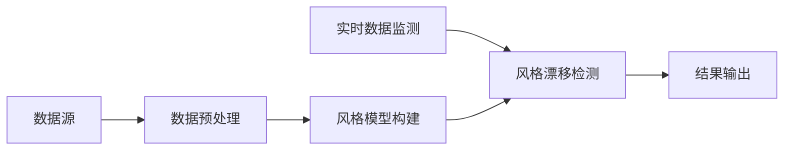

# AI辅助的对冲基金风格漂移检测

> 关键词：AI技术、对冲基金、风格漂移检测、机器学习、量化分析

> 摘要：本文聚焦于AI辅助的对冲基金风格漂移检测这一重要议题。首先介绍了该研究的背景、目的、预期读者以及文档结构等内容。详细阐述了核心概念，包括对冲基金风格漂移的原理和架构，并通过文本示意图和Mermaid流程图进行直观展示。深入探讨了核心算法原理，使用Python源代码进行详细说明，同时给出了相关的数学模型和公式，并举例解释。通过项目实战，展示了开发环境搭建、源代码实现与解读。分析了该技术在实际中的应用场景，推荐了学习资源、开发工具框架以及相关论文著作。最后总结了未来发展趋势与挑战，提供了常见问题解答和扩展阅读参考资料，旨在为从业者和研究者提供全面而深入的技术指导。

## 1. 背景介绍 
### 1.1 目的和范围
随着金融市场的不断发展，对冲基金作为一种重要的投资工具，其投资风格的稳定性对于投资者来说至关重要。风格漂移是指对冲基金在实际投资过程中偏离了其宣称的投资风格，这可能会给投资者带来额外的风险。本研究的目的在于利用AI技术，开发一套有效的对冲基金风格漂移检测方法，帮助投资者及时发现基金风格的变化，做出更明智的投资决策。研究范围涵盖了常见的对冲基金投资风格，如价值投资、成长投资、动量投资等，以及多种AI技术在风格漂移检测中的应用。

### 1.2 预期读者
本文的预期读者包括金融行业从业者，如基金经理、投资分析师、风险管理人员等，他们可以借助本文的方法和技术，更好地管理对冲基金的投资风格和风险。同时，也适合对金融科技和AI技术应用感兴趣的研究者和学生，为他们提供一个实际应用的案例和研究思路。

### 1.3 文档结构概述
本文将按照以下结构展开：首先介绍核心概念与联系，包括对冲基金风格漂移的定义、原理和架构；接着阐述核心算法原理和具体操作步骤，使用Python代码进行详细说明；然后给出相关的数学模型和公式，并举例解释；通过项目实战展示如何实现风格漂移检测；分析实际应用场景；推荐学习资源、开发工具框架和相关论文著作；最后总结未来发展趋势与挑战，提供常见问题解答和扩展阅读参考资料。

### 1.4 术语表
#### 1.4.1 核心术语定义
- **对冲基金**：一种通过多种投资策略，如卖空、杠杆操作等，来追求绝对收益的投资基金。
- **风格漂移**：对冲基金在实际投资过程中，其投资组合的特征与宣称的投资风格出现偏离的现象。
- **AI（人工智能）**：计算机系统能够执行通常需要人类智能才能完成的任务，如学习、推理、决策等。
- **机器学习**：AI的一个分支，通过让计算机从数据中学习模式和规律，而不是通过明确的编程指令来完成任务。

#### 1.4.2 相关概念解释
- **投资风格**：对冲基金根据其投资目标、策略和偏好所形成的特定投资方式，常见的有价值投资、成长投资、动量投资等。
- **因子分析**：一种统计方法，用于分析多个变量之间的相关性，找出影响这些变量的潜在因子。在对冲基金风格分析中，因子可以是市场指数、行业指标等。

#### 1.4.3 缩略词列表
- **AI**：Artificial Intelligence（人工智能）
- **ML**：Machine Learning（机器学习）
- **PCA**：Principal Component Analysis（主成分分析）
- **LSTM**：Long Short-Term Memory（长短期记忆网络）

## 2. 核心概念与联系 
### 核心概念原理
对冲基金的投资风格通常是基于其投资策略和目标来确定的，例如价值投资风格注重寻找被低估的股票，成长投资风格关注具有高成长潜力的公司。然而，在实际投资过程中，由于市场环境的变化、基金经理的决策调整等因素，基金的投资组合可能会偏离其宣称的风格，即发生风格漂移。

风格漂移可能会对投资者产生不利影响。一方面，投资者可能根据基金宣称的风格来构建自己的投资组合，如果基金发生风格漂移，可能会导致投资组合的风险和收益特征发生变化，与投资者的预期不符。另一方面，风格漂移也可能反映出基金经理的投资决策出现问题，增加了投资的不确定性。

AI技术在对冲基金风格漂移检测中具有重要作用。通过机器学习算法，可以对基金的历史投资数据进行分析，提取出能够反映基金风格的特征，建立风格模型。然后，实时监测基金的投资组合变化，与风格模型进行对比，判断是否发生风格漂移。

### 架构示意图
以下是一个简单的AI辅助的对冲基金风格漂移检测系统的架构示意图：

```plaintext
数据源（基金历史数据、市场数据等）
|
V
数据预处理（清洗、特征提取等）
|
V
风格模型构建（机器学习算法）
|
V
实时数据监测（基金当前投资组合数据）
|
V
风格漂移检测（与风格模型对比）
|
V
结果输出（是否发生风格漂移、漂移程度等）
```

### Mermaid流程图


## 3. 核心算法原理 & 具体操作步骤 
### 核心算法原理
在AI辅助的对冲基金风格漂移检测中，常用的机器学习算法包括主成分分析（PCA）、支持向量机（SVM）、长短期记忆网络（LSTM）等。

#### 主成分分析（PCA）
PCA是一种无监督学习算法，用于数据降维和特征提取。在对冲基金风格分析中，可以使用PCA将多个相关的投资特征转换为少数几个不相关的主成分，从而简化数据结构，提取出最重要的信息。

#### 支持向量机（SVM）
SVM是一种有监督学习算法，用于分类和回归分析。在风格漂移检测中，可以使用SVM构建分类模型，将基金的投资组合分为不同的风格类别，然后通过比较不同时期的分类结果，判断是否发生风格漂移。

#### 长短期记忆网络（LSTM）
LSTM是一种循环神经网络（RNN）的变体，能够处理序列数据中的长期依赖关系。在风格漂移检测中，可以使用LSTM对基金的历史投资数据进行建模，预测未来的投资风格，然后与实际的投资组合进行对比，判断是否发生风格漂移。

### 具体操作步骤
#### 步骤1：数据收集
收集对冲基金的历史投资数据，包括股票持仓、行业分布、市值等信息，以及相关的市场数据，如市场指数、行业指数等。

#### 步骤2：数据预处理
对收集到的数据进行清洗、缺失值处理、异常值处理等操作，然后进行特征提取，将原始数据转换为适合机器学习算法处理的特征向量。

#### 步骤3：风格模型构建
使用机器学习算法，如PCA、SVM、LSTM等，对预处理后的数据进行建模，构建基金的风格模型。

#### 步骤4：实时数据监测
实时收集基金的当前投资组合数据，进行预处理后，与风格模型进行对比。

#### 步骤5：风格漂移检测
根据对比结果，判断基金是否发生风格漂移，以及漂移的程度。

### Python源代码实现
以下是一个使用PCA进行特征提取和SVM进行风格分类的Python示例代码：

```python
import numpy as np
import pandas as pd
from sklearn.decomposition import PCA
from sklearn.svm import SVC
from sklearn.model_selection import train_test_split
from sklearn.metrics import accuracy_score

# 步骤1：数据收集
# 假设已经收集到了基金的历史投资数据和风格标签
data = pd.read_csv('fund_data.csv')
X = data.drop('style_label', axis=1)
y = data['style_label']

# 步骤2：数据预处理
# 使用PCA进行特征提取
pca = PCA(n_components=0.95)  # 保留95%的方差
X_pca = pca.fit_transform(X)

# 步骤3：风格模型构建
# 划分训练集和测试集
X_train, X_test, y_train, y_test = train_test_split(X_pca, y, test_size=0.2, random_state=42)

# 使用SVM构建分类模型
svm = SVC()
svm.fit(X_train, y_train)

# 步骤4：模型评估
y_pred = svm.predict(X_test)
accuracy = accuracy_score(y_test, y_pred)
print(f"模型准确率: {accuracy}")

# 步骤5：实时数据监测和风格漂移检测
# 假设已经获取到了实时数据
new_data = pd.read_csv('new_fund_data.csv')
new_X = new_data.drop('style_label', axis=1)
new_X_pca = pca.transform(new_X)
new_y_pred = svm.predict(new_X_pca)
print(f"实时数据预测结果: {new_y_pred}")
```

## 4. 数学模型和公式 & 详细讲解 & 举例说明 
### 主成分分析（PCA）的数学模型和公式
#### 数学模型
PCA的目标是找到一组正交的主成分，使得数据在这些主成分上的投影方差最大。设原始数据矩阵为 $X \in \mathbb{R}^{n \times p}$，其中 $n$ 是样本数量，$p$ 是特征数量。PCA的数学模型可以表示为：

$$
\max_{w_1} \frac{w_1^T X^T X w_1}{w_1^T w_1}
$$

其中 $w_1$ 是第一个主成分的方向向量。

#### 公式推导
为了求解上述优化问题，可以使用拉格朗日乘数法。引入拉格朗日乘子 $\lambda_1$，构建拉格朗日函数：

$$
L(w_1, \lambda_1) = w_1^T X^T X w_1 - \lambda_1 (w_1^T w_1 - 1)
$$

对 $w_1$ 求偏导数并令其为零：

$$
\frac{\partial L}{\partial w_1} = 2X^T X w_1 - 2\lambda_1 w_1 = 0
$$

即：

$$
X^T X w_1 = \lambda_1 w_1
$$

这表明 $w_1$ 是矩阵 $X^T X$ 的特征向量，$\lambda_1$ 是对应的特征值。因此，PCA的求解过程就是求解矩阵 $X^T X$ 的特征值和特征向量。

#### 举例说明
假设有一个二维数据集 $X = \begin{bmatrix} 1 & 2 \\ 2 & 4 \\ 3 & 6 \end{bmatrix}$，首先计算 $X^T X$：

$$
X^T X = \begin{bmatrix} 1 & 2 & 3 \\ 2 & 4 & 6 \end{bmatrix} \begin{bmatrix} 1 & 2 \\ 2 & 4 \\ 3 & 6 \end{bmatrix} = \begin{bmatrix} 14 & 28 \\ 28 & 56 \end{bmatrix}
$$

然后求解 $X^T X$ 的特征值和特征向量。特征值为 $\lambda_1 = 70$，$\lambda_2 = 0$，对应的特征向量分别为 $w_1 = \begin{bmatrix} 0.447 \\ 0.894 \end{bmatrix}$，$w_2 = \begin{bmatrix} -0.894 \\ 0.447 \end{bmatrix}$。由于 $\lambda_2 = 0$，说明第二个主成分没有提供额外的信息，因此可以只保留第一个主成分。

### 支持向量机（SVM）的数学模型和公式
#### 数学模型
对于线性可分的二分类问题，SVM的目标是找到一个最优的超平面 $w^T x + b = 0$，使得不同类别的样本到超平面的间隔最大。设训练数据集为 $\{(x_1, y_1), (x_2, y_2), \cdots, (x_n, y_n)\}$，其中 $x_i \in \mathbb{R}^p$，$y_i \in \{-1, 1\}$。SVM的数学模型可以表示为：

$$
\min_{w, b} \frac{1}{2} \|w\|^2
$$

约束条件为：

$$
y_i (w^T x_i + b) \geq 1, \quad i = 1, 2, \cdots, n
$$

#### 公式推导
为了求解上述优化问题，可以使用拉格朗日乘数法。引入拉格朗日乘子 $\alpha_i \geq 0$，构建拉格朗日函数：

$$
L(w, b, \alpha) = \frac{1}{2} \|w\|^2 - \sum_{i=1}^{n} \alpha_i (y_i (w^T x_i + b) - 1)
$$

对 $w$ 和 $b$ 求偏导数并令其为零：

$$
\frac{\partial L}{\partial w} = w - \sum_{i=1}^{n} \alpha_i y_i x_i = 0
$$

$$
\frac{\partial L}{\partial b} = -\sum_{i=1}^{n} \alpha_i y_i = 0
$$

将上述结果代入拉格朗日函数，得到对偶问题：

$$
\max_{\alpha} \sum_{i=1}^{n} \alpha_i - \frac{1}{2} \sum_{i=1}^{n} \sum_{j=1}^{n} \alpha_i \alpha_j y_i y_j x_i^T x_j
$$

约束条件为：

$$
\sum_{i=1}^{n} \alpha_i y_i = 0, \quad \alpha_i \geq 0, \quad i = 1, 2, \cdots, n
$$

求解对偶问题得到最优的拉格朗日乘子 $\alpha^*$，然后可以计算出最优的 $w^*$ 和 $b^*$：

$$
w^* = \sum_{i=1}^{n} \alpha_i^* y_i x_i
$$

$$
b^* = y_j - w^{*T} x_j, \quad \text{其中 } \alpha_j^* > 0
$$

#### 举例说明
假设有一个二维数据集 $\{(x_1, y_1), (x_2, y_2), (x_3, y_3)\}$，其中 $x_1 = \begin{bmatrix} 1 \\ 1 \end{bmatrix}$，$y_1 = -1$；$x_2 = \begin{bmatrix} 2 \\ 2 \end{bmatrix}$，$y_2 = -1$；$x_3 = \begin{bmatrix} 3 \\ 3 \end{bmatrix}$，$y_3 = 1$。可以使用SVM求解最优的超平面。通过求解对偶问题，得到最优的拉格朗日乘子 $\alpha_1^* = 0$，$\alpha_2^* = 0$，$\alpha_3^* = 1$，然后计算出 $w^* = \begin{bmatrix} 3 \\ 3 \end{bmatrix}$，$b^* = -6$，最优的超平面为 $3x_1 + 3x_2 - 6 = 0$。

## 5. 项目实战：代码实际案例和详细解释说明 
### 5.1  开发环境搭建
#### 安装Python
首先需要安装Python，可以从Python官方网站（https://www.python.org/downloads/）下载适合自己操作系统的Python版本进行安装。建议安装Python 3.7及以上版本。

#### 安装必要的库
使用pip命令安装必要的Python库，包括numpy、pandas、scikit-learn等：

```sh
pip install numpy pandas scikit-learn
```

### 5.2  源代码详细实现和代码解读
以下是一个完整的AI辅助的对冲基金风格漂移检测项目的源代码：

```python
import numpy as np
import pandas as pd
from sklearn.decomposition import PCA
from sklearn.svm import SVC
from sklearn.model_selection import train_test_split
from sklearn.metrics import accuracy_score

# 步骤1：数据收集
# 假设已经收集到了基金的历史投资数据和风格标签
data = pd.read_csv('fund_data.csv')
X = data.drop('style_label', axis=1)
y = data['style_label']

# 步骤2：数据预处理
# 使用PCA进行特征提取
pca = PCA(n_components=0.95)  # 保留95%的方差
X_pca = pca.fit_transform(X)

# 步骤3：风格模型构建
# 划分训练集和测试集
X_train, X_test, y_train, y_test = train_test_split(X_pca, y, test_size=0.2, random_state=42)

# 使用SVM构建分类模型
svm = SVC()
svm.fit(X_train, y_train)

# 步骤4：模型评估
y_pred = svm.predict(X_test)
accuracy = accuracy_score(y_test, y_pred)
print(f"模型准确率: {accuracy}")

# 步骤5：实时数据监测和风格漂移检测
# 假设已经获取到了实时数据
new_data = pd.read_csv('new_fund_data.csv')
new_X = new_data.drop('style_label', axis=1)
new_X_pca = pca.transform(new_X)
new_y_pred = svm.predict(new_X_pca)
print(f"实时数据预测结果: {new_y_pred}")
```

### 代码解读与分析
#### 数据收集部分
```python
data = pd.read_csv('fund_data.csv')
X = data.drop('style_label', axis=1)
y = data['style_label']
```
这部分代码使用pandas库读取基金的历史投资数据文件 `fund_data.csv`，并将特征数据和风格标签分别存储在 `X` 和 `y` 中。

#### 数据预处理部分
```python
pca = PCA(n_components=0.95)  # 保留95%的方差
X_pca = pca.fit_transform(X)
```
这部分代码使用PCA进行特征提取，将原始特征数据转换为少数几个主成分，保留95%的方差。

#### 风格模型构建部分
```python
X_train, X_test, y_train, y_test = train_test_split(X_pca, y, test_size=0.2, random_state=42)
svm = SVC()
svm.fit(X_train, y_train)
```
这部分代码使用 `train_test_split` 函数将数据划分为训练集和测试集，然后使用SVM构建分类模型，并在训练集上进行训练。

#### 模型评估部分
```python
y_pred = svm.predict(X_test)
accuracy = accuracy_score(y_test, y_pred)
print(f"模型准确率: {accuracy}")
```
这部分代码使用训练好的SVM模型对测试集进行预测，并计算模型的准确率。

#### 实时数据监测和风格漂移检测部分
```python
new_data = pd.read_csv('new_fund_data.csv')
new_X = new_data.drop('style_label', axis=1)
new_X_pca = pca.transform(new_X)
new_y_pred = svm.predict(new_X_pca)
print(f"实时数据预测结果: {new_y_pred}")
```
这部分代码读取实时数据文件 `new_fund_data.csv`，对数据进行预处理后，使用训练好的SVM模型进行预测，得到实时数据的风格预测结果。

## 6. 实际应用场景 
### 投资者决策支持
对于个人投资者和机构投资者来说，AI辅助的对冲基金风格漂移检测可以帮助他们及时发现基金的风格变化，避免因风格漂移而带来的额外风险。投资者可以根据检测结果，调整自己的投资组合，选择更符合自己投资目标和风险偏好的基金。

### 基金公司风险管理
基金公司可以利用该技术对旗下基金的投资风格进行实时监测，及时发现风格漂移问题，并采取相应的措施进行调整。这有助于基金公司保持基金的投资风格稳定性，提高客户满意度。

### 监管机构监督
监管机构可以使用AI辅助的风格漂移检测技术，对市场上的对冲基金进行监管，确保基金公司遵守相关的投资规定和披露要求。这有助于维护金融市场的稳定和公平。

## 7. 工具和资源推荐
### 7.1 学习资源推荐
#### 7.1.1 书籍推荐
- 《机器学习》（周志华著）：全面介绍了机器学习的基本概念、算法和应用，是学习机器学习的经典教材。
- 《Python机器学习》（Sebastian Raschka著）：结合Python代码，详细讲解了机器学习的各种算法和应用，适合初学者。
- 《金融机器学习》（Marcos Lopez de Prado著）：介绍了机器学习在金融领域的应用，包括风险评估、投资策略等方面。

#### 7.1.2 在线课程
- Coursera上的“机器学习”课程（Andrew Ng教授授课）：全球知名的机器学习课程，内容全面，讲解详细。
- edX上的“Python for Data Science”课程：介绍了Python在数据分析中的应用，包括数据处理、可视化等方面。
- Udemy上的“Financial Machine Learning A-Z”课程：专门介绍了机器学习在金融领域的应用，包括对冲基金风格分析等内容。

#### 7.1.3 技术博客和网站
- Towards Data Science：一个专注于数据科学和机器学习的博客平台，有很多高质量的技术文章。
- Kaggle：一个数据科学竞赛平台，提供了大量的数据集和代码示例，可以学习到很多实际应用的技巧。
- QuantNet：一个金融量化分析的社区，有很多关于金融科技和量化投资的讨论和资源。

### 7.2 开发工具框架推荐
#### 7.2.1 IDE和编辑器
- PyCharm：一款专业的Python集成开发环境，提供了丰富的代码编辑、调试和项目管理功能。
- Jupyter Notebook：一个交互式的编程环境，适合进行数据分析和模型实验。
- Visual Studio Code：一款轻量级的代码编辑器，支持多种编程语言和插件扩展。

#### 7.2.2 调试和性能分析工具
- PDB：Python自带的调试器，可以帮助开发者定位和解决代码中的问题。
- cProfile：Python的性能分析工具，可以分析代码的运行时间和函数调用情况。
- TensorBoard：一个可视化工具，用于可视化深度学习模型的训练过程和性能指标。

#### 7.2.3 相关框架和库
- Scikit-learn：一个常用的机器学习库，提供了丰富的机器学习算法和工具，如分类、回归、聚类等。
- TensorFlow：一个开源的深度学习框架，广泛应用于图像识别、自然语言处理等领域。
- PyTorch：另一个流行的深度学习框架，具有简洁易用的特点，适合快速开发和实验。

### 7.3 相关论文著作推荐
#### 7.3.1 经典论文
- Fama, E. F., & French, K. R. (1992). The cross-section of expected stock returns. The Journal of Finance, 47(2), 427-465. 该论文提出了著名的Fama-French三因子模型，对金融市场的资产定价和风格分析产生了深远影响。
- Sharpe, W. F. (1992). Asset allocation: Management style and performance measurement. The Journal of Portfolio Management, 18(2), 7-19. 该论文介绍了如何使用因子分析方法进行资产配置和风格分析。

#### 7.3.2 最新研究成果
- Gu, S., Kelly, B., & Xiu, D. (2020). Empirical asset pricing via machine learning. Review of Financial Studies, 33(5), 2223-2273. 该论文探讨了机器学习在实证资产定价中的应用，提出了一些新的方法和模型。
- Lopez de Prado, M. (2018). Advances in financial machine learning. Wiley. 该书是金融机器学习领域的最新著作，介绍了很多前沿的技术和方法。

#### 7.3.3 应用案例分析
- Jagannathan, R., Malakhov, A. D., & Novikov, D. (2010). Do hedge funds deliver alpha? A Bayesian and bootstrap analysis. The Journal of Financial Economics, 97(2), 261-282. 该论文通过实证分析，研究了对冲基金的风格和业绩表现。
- Kosowski, R., Naik, N. Y., & Teo, M. (2007). Do hedge fund managers outperform their peers? Journal of Financial Economics, 84(1), 229-264. 该论文探讨了对冲基金经理的业绩表现和风格差异。

## 8. 总结：未来发展趋势与挑战
### 未来发展趋势
- **多模态数据融合**：未来的风格漂移检测将不仅仅依赖于基金的历史投资数据，还会融合更多的多模态数据，如新闻文本、社交媒体数据等，以更全面地了解基金的投资风格和市场环境。
- **深度学习的广泛应用**：随着深度学习技术的不断发展，其在风格漂移检测中的应用将越来越广泛。例如，使用卷积神经网络（CNN）和循环神经网络（RNN）对基金的投资数据进行建模，提高检测的准确性和效率。
- **实时监测和预警系统的完善**：为了更好地应对风格漂移带来的风险，未来的检测系统将更加注重实时监测和预警功能。通过实时收集和分析基金的投资数据，及时发现风格漂移的迹象，并向投资者和监管机构发出预警。

### 挑战
- **数据质量和隐私问题**：AI辅助的风格漂移检测需要大量的高质量数据，但在实际应用中，数据可能存在缺失、错误和不一致等问题，影响检测的准确性。同时，数据隐私问题也是一个重要的挑战，如何在保护数据隐私的前提下，充分利用数据进行分析是需要解决的问题。
- **模型的可解释性**：深度学习模型通常具有较高的复杂性和黑盒性，难以解释其决策过程和结果。在金融领域，模型的可解释性尤为重要，投资者和监管机构需要了解模型是如何做出决策的，以便做出合理的投资决策和监管措施。
- **市场环境的变化**：金融市场是复杂多变的，市场环境的变化可能会导致基金的投资风格发生变化，从而影响风格漂移检测的准确性。如何适应市场环境的变化，提高检测系统的鲁棒性是一个挑战。

## 9. 附录：常见问题与解答
### 问题1：AI辅助的风格漂移检测方法是否适用于所有类型的对冲基金？
解答：AI辅助的风格漂移检测方法适用于大多数类型的对冲基金，但不同类型的基金可能需要采用不同的特征和算法。例如，对于量化对冲基金，可以更多地使用量化指标和机器学习算法；对于主观投资型基金，可能需要结合基金经理的投资观点和定性分析。

### 问题2：如何评估风格漂移检测模型的性能？
解答：可以使用多种指标来评估风格漂移检测模型的性能，如准确率、召回率、F1值等。此外，还可以进行交叉验证和回测，评估模型在不同数据集和时间段上的稳定性和可靠性。

### 问题3：风格漂移检测的结果是否可以作为投资决策的唯一依据？
解答：风格漂移检测的结果可以作为投资决策的重要参考，但不能作为唯一依据。投资决策还需要考虑其他因素，如基金的业绩表现、风险水平、市场环境等。投资者应该综合考虑各种因素，做出合理的投资决策。

## 10. 扩展阅读 & 参考资料
### 扩展阅读
- 《金融科技前沿：人工智能在金融领域的应用》
- 《量化投资：策略与技术》
- 《智能金融：从基础到实战》

### 参考资料
- Fama, E. F., & French, K. R. (1992). The cross-section of expected stock returns. The Journal of Finance, 47(2), 427-465.
- Sharpe, W. F. (1992). Asset allocation: Management style and performance measurement. The Journal of Portfolio Management, 18(2), 7-19.
- Gu, S., Kelly, B., & Xiu, D. (2020). Empirical asset pricing via machine learning. Review of Financial Studies, 33(5), 2223-2273.
- Lopez de Prado, M. (2018). Advances in financial machine learning. Wiley.

作者：AI天才研究院/AI Genius Institute & 禅与计算机程序设计艺术 /Zen And The Art of Computer Programming