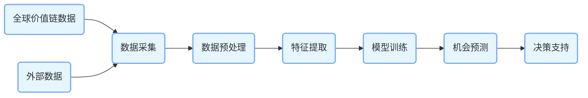

# AI辅助识别全球价值链机会

> 关键词：AI、全球价值链、机会识别、数据分析、机器学习

> 摘要：本文聚焦于AI辅助识别全球价值链机会这一前沿话题。首先介绍了研究的背景、目的、预期读者、文档结构和相关术语。接着阐述了核心概念及联系，包括全球价值链和AI的原理与架构，并给出示意图和流程图。详细讲解了核心算法原理及具体操作步骤，结合Python源代码进行说明。深入探讨了数学模型和公式，并举例解释。通过项目实战展示代码实现及解读。分析了实际应用场景，推荐了相关学习资源、开发工具框架和论文著作。最后总结了未来发展趋势与挑战，提供常见问题解答和扩展阅读参考资料，旨在为读者全面呈现AI在全球价值链机会识别中的应用与价值。

## 1. 背景介绍 
### 1.1 目的和范围
随着全球经济一体化的深入发展，全球价值链（Global Value Chain, GVC）已成为国际经济合作与竞争的重要模式。在复杂多变的全球经济环境中，企业和政府都面临着如何准确识别全球价值链中的机会，以实现自身的发展和利益最大化的挑战。人工智能（Artificial Intelligence, AI）技术的快速发展为解决这一问题提供了新的途径和方法。

本文的目的在于探讨如何利用AI技术辅助识别全球价值链中的机会，具体范围包括AI技术在全球价值链数据分析、机会预测、风险评估等方面的应用，以及相关算法、模型和工具的介绍与分析。

### 1.2 预期读者
本文的预期读者主要包括以下几类人群：
- **企业管理人员**：希望借助AI技术提升企业在全球价值链中的竞争力，识别潜在的市场机会和合作伙伴。
- **政府经济政策制定者**：需要利用AI技术了解全球价值链的动态变化，制定更有效的产业政策和贸易政策。
- **研究人员**：对AI技术在全球经济领域的应用感兴趣，希望深入研究相关理论和方法。
- **学生**：学习经济学、管理学、计算机科学等相关专业，希望了解跨学科领域的前沿知识。

### 1.3 文档结构概述
本文将按照以下结构进行组织：
- **核心概念与联系**：介绍全球价值链和AI的核心概念，分析它们之间的联系，并给出原理和架构的示意图与流程图。
- **核心算法原理 & 具体操作步骤**：详细讲解用于识别全球价值链机会的核心算法原理，结合Python源代码说明具体操作步骤。
- **数学模型和公式 & 详细讲解 & 举例说明**：阐述相关的数学模型和公式，通过具体例子进行详细解释。
- **项目实战：代码实际案例和详细解释说明**：通过一个实际项目案例，展示如何使用AI技术辅助识别全球价值链机会，包括开发环境搭建、源代码实现和代码解读。
- **实际应用场景**：分析AI技术在全球价值链中的实际应用场景，如市场机会发现、供应链优化等。
- **工具和资源推荐**：推荐相关的学习资源、开发工具框架和论文著作，帮助读者进一步深入学习和研究。
- **总结：未来发展趋势与挑战**：总结AI辅助识别全球价值链机会的发展趋势，分析面临的挑战和问题。
- **附录：常见问题与解答**：提供常见问题的解答，帮助读者解决在学习和实践过程中遇到的问题。
- **扩展阅读 & 参考资料**：列出相关的扩展阅读材料和参考资料，供读者进一步查阅。

### 1.4 术语表
#### 1.4.1 核心术语定义
- **全球价值链（Global Value Chain, GVC）**：指在全球范围内，为实现商品或服务的价值而连接生产、销售、回收处理等过程的全球性跨企业网络组织，涉及从原料采购和运输、半成品和成品的生产和分销，直至最终消费和回收处理的整个过程。
- **人工智能（Artificial Intelligence, AI）**：是研究、开发用于模拟、延伸和扩展人的智能的理论、方法、技术及应用系统的一门新的技术科学。
- **机器学习（Machine Learning, ML）**：是一门多领域交叉学科，涉及概率论、统计学、逼近论、凸分析、算法复杂度理论等多门学科。它专门研究计算机怎样模拟或实现人类的学习行为，以获取新的知识或技能，重新组织已有的知识结构使之不断改善自身的性能。
- **数据挖掘（Data Mining, DM）**：是指从大量的数据中通过算法搜索隐藏于其中信息的过程。数据挖掘通常与计算机科学有关，并通过统计、在线分析处理、情报检索、机器学习、专家系统（依靠过去的经验法则）和模式识别等诸多方法来实现上述目标。

#### 1.4.2 相关概念解释
- **价值链分析**：是一种确定企业竞争优势，寻找关键战略环节的分析方法。通过对企业内部和外部价值活动的分析，识别出哪些活动是创造价值的关键环节，哪些活动是可以优化或外包的非关键环节。
- **大数据**：指无法在一定时间范围内用常规软件工具进行捕捉、管理和处理的数据集合，是需要新处理模式才能具有更强的决策力、洞察发现力和流程优化能力的海量、高增长率和多样化的信息资产。

#### 1.4.3 缩略词列表
- GVC：Global Value Chain（全球价值链）
- AI：Artificial Intelligence（人工智能）
- ML：Machine Learning（机器学习）
- DM：Data Mining（数据挖掘）

## 2. 核心概念与联系 

### 2.1 全球价值链概念
全球价值链是一种全球性的生产和贸易组织形式，它将不同国家和地区的企业、供应商、客户等连接在一起，形成一个复杂的网络。在全球价值链中，每个环节都创造一定的价值，并且不同环节的价值创造能力和附加值水平存在差异。

全球价值链的形成和发展主要受到以下因素的影响：
- **技术进步**：信息技术、交通技术等的发展降低了跨国生产和贸易的成本，使得企业能够在全球范围内配置资源。
- **贸易自由化**：各国之间的贸易壁垒不断降低，促进了商品和服务的跨国流动。
- **企业战略**：企业为了降低成本、提高效率、增强竞争力，纷纷采用全球采购、全球生产和全球销售的战略。

### 2.2 人工智能概念
人工智能是一门研究如何使计算机能够模拟人类智能的学科，它涵盖了多个领域，如机器学习、自然语言处理、计算机视觉等。人工智能的发展经历了多个阶段，近年来，随着大数据、云计算等技术的发展，人工智能取得了显著的进展，在图像识别、语音识别、智能推荐等领域得到了广泛的应用。

人工智能的核心技术包括：
- **机器学习**：通过让计算机从数据中学习模式和规律，从而实现对未知数据的预测和分类。
- **深度学习**：是一种基于人工神经网络的机器学习方法，它能够自动从大量数据中提取特征，具有很强的学习能力和泛化能力。
- **自然语言处理**：研究如何让计算机理解和处理人类语言，包括文本分类、情感分析、机器翻译等。

### 2.3 两者联系
AI技术在全球价值链机会识别中具有重要的作用，主要体现在以下几个方面：
- **数据分析**：AI技术可以对全球价值链中的大量数据进行分析，挖掘出潜在的市场机会和风险。例如，通过对市场需求数据、供应链数据等的分析，预测市场趋势和产品需求。
- **机会预测**：利用机器学习和深度学习算法，对全球价值链中的各种因素进行建模和预测，帮助企业提前发现潜在的机会。例如，通过对行业发展趋势、政策变化等因素的分析，预测未来的市场需求和竞争态势。
- **风险评估**：AI技术可以对全球价值链中的风险进行评估和预警，帮助企业制定相应的风险管理策略。例如，通过对政治风险、经济风险、自然风险等的分析，评估企业在全球价值链中的风险暴露程度。

### 2.4 原理和架构示意图
下面是一个简单的AI辅助识别全球价值链机会的原理和架构示意图：



该示意图展示了AI辅助识别全球价值链机会的主要流程：
1. **数据采集**：从全球价值链相关的数据源（如企业内部数据库、行业报告、政府统计数据等）和外部数据源（如社交媒体、新闻网站等）采集数据。
2. **数据预处理**：对采集到的数据进行清洗、转换、归一化等处理，以提高数据的质量和可用性。
3. **特征提取**：从预处理后的数据中提取与全球价值链机会相关的特征，如市场需求、产品价格、供应链效率等。
4. **模型训练**：使用机器学习或深度学习算法对提取的特征进行训练，建立机会预测模型。
5. **机会预测**：使用训练好的模型对未来的全球价值链机会进行预测。
6. **决策支持**：将预测结果提供给企业管理人员或政府政策制定者，为他们的决策提供支持。

## 3. 核心算法原理 & 具体操作步骤 

### 3.1 核心算法原理
在AI辅助识别全球价值链机会中，常用的核心算法包括机器学习算法和深度学习算法。下面以支持向量机（Support Vector Machine, SVM）和卷积神经网络（Convolutional Neural Network, CNN）为例，介绍其原理。

#### 3.1.1 支持向量机（SVM）原理
支持向量机是一种二分类模型，它的基本思想是在特征空间中找到一个最优的超平面，使得不同类别的样本能够被最大程度地分开。具体来说，对于一个给定的训练数据集 $\{(x_1, y_1), (x_2, y_2), \cdots, (x_n, y_n)\}$，其中 $x_i \in \mathbb{R}^d$ 是第 $i$ 个样本的特征向量，$y_i \in \{-1, +1\}$ 是第 $i$ 个样本的类别标签，SVM的目标是找到一个超平面 $w^T x + b = 0$，使得对于所有的正类样本 $y_i = +1$，有 $w^T x_i + b \geq 1$，对于所有的负类样本 $y_i = -1$，有 $w^T x_i + b \leq -1$，并且使得两类样本之间的间隔（即超平面到最近样本点的距离）最大。

SVM的优化问题可以表示为：

$$
\begin{aligned}
\min_{w, b, \xi} &\quad \frac{1}{2} \|w\|^2 + C \sum_{i=1}^n \xi_i \\
\text{s.t.} &\quad y_i (w^T x_i + b) \geq 1 - \xi_i, \quad i = 1, 2, \cdots, n \\
&\quad \xi_i \geq 0, \quad i = 1, 2, \cdots, n
\end{aligned}
$$

其中，$C$ 是一个惩罚参数，用于控制分类误差和间隔大小之间的平衡；$\xi_i$ 是松弛变量，用于处理线性不可分的情况。

#### 3.1.2 卷积神经网络（CNN）原理
卷积神经网络是一种专门用于处理具有网格结构数据（如图像、音频等）的深度学习模型。它的主要特点是通过卷积层、池化层和全连接层等组件，自动提取数据的特征。

- **卷积层**：卷积层通过卷积核在输入数据上进行滑动卷积操作，提取数据的局部特征。卷积操作可以表示为：

$$
y_{i, j} = \sum_{m=0}^{M-1} \sum_{n=0}^{N-1} x_{i+m, j+n} \cdot k_{m, n} + b
$$

其中，$x$ 是输入数据，$k$ 是卷积核，$b$ 是偏置项，$y$ 是卷积输出。

- **池化层**：池化层用于对卷积层的输出进行下采样，减少数据的维度，同时保留重要的特征信息。常用的池化方法包括最大池化和平均池化。

- **全连接层**：全连接层将池化层的输出展平为一维向量，然后通过一系列的全连接神经元进行分类或回归。

### 3.2 具体操作步骤
下面以Python为例，介绍使用SVM和CNN进行全球价值链机会识别的具体操作步骤。

#### 3.2.1 使用SVM进行机会识别
```python
import numpy as np
from sklearn import svm
from sklearn.model_selection import train_test_split
from sklearn.metrics import accuracy_score

# 生成示例数据
X = np.random.rand(100, 10)  # 100个样本，每个样本有10个特征
y = np.random.randint(0, 2, 100)  # 随机生成类别标签

# 划分训练集和测试集
X_train, X_test, y_train, y_test = train_test_split(X, y, test_size=0.2, random_state=42)

# 创建SVM分类器
clf = svm.SVC(kernel='linear')

# 训练模型
clf.fit(X_train, y_train)

# 预测测试集
y_pred = clf.predict(X_test)

# 计算准确率
accuracy = accuracy_score(y_test, y_pred)
print(f"Accuracy: {accuracy}")
```

#### 3.2.2 使用CNN进行机会识别
```python
import numpy as np
import tensorflow as tf
from tensorflow.keras import layers, models

# 生成示例数据
X = np.random.rand(100, 28, 28, 1)  # 100个样本，每个样本是28x28的灰度图像
y = np.random.randint(0, 2, 100)  # 随机生成类别标签

# 划分训练集和测试集
X_train, X_test, y_train, y_test = train_test_split(X, y, test_size=0.2, random_state=42)

# 构建CNN模型
model = models.Sequential()
model.add(layers.Conv2D(32, (3, 3), activation='relu', input_shape=(28, 28, 1)))
model.add(layers.MaxPooling2D((2, 2)))
model.add(layers.Conv2D(64, (3, 3), activation='relu'))
model.add(layers.MaxPooling2D((2, 2)))
model.add(layers.Flatten())
model.add(layers.Dense(64, activation='relu'))
model.add(layers.Dense(1, activation='sigmoid'))

# 编译模型
model.compile(optimizer='adam',
              loss='binary_crossentropy',
              metrics=['accuracy'])

# 训练模型
model.fit(X_train, y_train, epochs=5, validation_data=(X_test, y_test))

# 评估模型
test_loss, test_acc = model.evaluate(X_test, y_test)
print(f"Test accuracy: {test_acc}")
```

## 4. 数学模型和公式 & 详细讲解 & 举例说明 

### 4.1 支持向量机数学模型和公式
如前面所述，支持向量机的优化问题可以表示为：

$$
\begin{aligned}
\min_{w, b, \xi} &\quad \frac{1}{2} \|w\|^2 + C \sum_{i=1}^n \xi_i \\
\text{s.t.} &\quad y_i (w^T x_i + b) \geq 1 - \xi_i, \quad i = 1, 2, \cdots, n \\
&\quad \xi_i \geq 0, \quad i = 1, 2, \cdots, n
\end{aligned}
$$

为了求解这个优化问题，我们可以使用拉格朗日乘子法。引入拉格朗日乘子 $\alpha_i \geq 0$ 和 $\mu_i \geq 0$，构造拉格朗日函数：

$$
L(w, b, \xi, \alpha, \mu) = \frac{1}{2} \|w\|^2 + C \sum_{i=1}^n \xi_i - \sum_{i=1}^n \alpha_i (y_i (w^T x_i + b) - 1 + \xi_i) - \sum_{i=1}^n \mu_i \xi_i
$$

对 $w$、$b$ 和 $\xi_i$ 求偏导数并令其为0，得到：

$$
\begin{aligned}
\frac{\partial L}{\partial w} &= w - \sum_{i=1}^n \alpha_i y_i x_i = 0 \\
\frac{\partial L}{\partial b} &= -\sum_{i=1}^n \alpha_i y_i = 0 \\
\frac{\partial L}{\partial \xi_i} &= C - \alpha_i - \mu_i = 0
\end{aligned}
$$

将上述结果代入拉格朗日函数，得到对偶问题：

$$
\begin{aligned}
\max_{\alpha} &\quad \sum_{i=1}^n \alpha_i - \frac{1}{2} \sum_{i=1}^n \sum_{j=1}^n \alpha_i \alpha_j y_i y_j x_i^T x_j \\
\text{s.t.} &\quad \sum_{i=1}^n \alpha_i y_i = 0 \\
&\quad 0 \leq \alpha_i \leq C, \quad i = 1, 2, \cdots, n
\end{aligned}
$$

求解对偶问题得到最优的拉格朗日乘子 $\alpha^*$，然后可以计算出最优的 $w^*$ 和 $b^*$：

$$
w^* = \sum_{i=1}^n \alpha_i^* y_i x_i
$$

$$
b^* = y_j - w^{*T} x_j
$$

其中，$j$ 是满足 $0 < \alpha_j^* < C$ 的任意一个样本的索引。

### 4.2 卷积神经网络数学模型和公式
#### 4.2.1 卷积层
卷积层的卷积操作可以表示为：

$$
y_{i, j} = \sum_{m=0}^{M-1} \sum_{n=0}^{N-1} x_{i+m, j+n} \cdot k_{m, n} + b
$$

其中，$x$ 是输入数据，$k$ 是卷积核，$b$ 是偏置项，$y$ 是卷积输出。$M$ 和 $N$ 分别是卷积核的高度和宽度。

#### 4.2.2 池化层
最大池化操作可以表示为：

$$
y_{i, j} = \max_{m, n \in \mathcal{R}_{i, j}} x_{m, n}
$$

其中，$\mathcal{R}_{i, j}$ 是池化区域，$y$ 是池化输出。

平均池化操作可以表示为：

$$
y_{i, j} = \frac{1}{|\mathcal{R}_{i, j}|} \sum_{m, n \in \mathcal{R}_{i, j}} x_{m, n}
$$

其中，$|\mathcal{R}_{i, j}|$ 是池化区域的大小。

#### 4.2.3 全连接层
全连接层的输出可以表示为：

$$
y = f(Wx + b)
$$

其中，$x$ 是输入向量，$W$ 是权重矩阵，$b$ 是偏置向量，$f$ 是激活函数。

### 4.3 举例说明
#### 4.3.1 支持向量机举例
假设我们有一个二维的数据集，包含两个类别：正类和负类。我们可以使用SVM来找到一个最优的超平面将这两个类别分开。

```python
import numpy as np
import matplotlib.pyplot as plt
from sklearn import svm

# 生成示例数据
X = np.array([[3, 4], [1, 2], [2, 3], [5, 6], [7, 8], [8, 9]])
y = np.array([1, 1, 1, -1, -1, -1])

# 创建SVM分类器
clf = svm.SVC(kernel='linear')

# 训练模型
clf.fit(X, y)

# 绘制数据点
plt.scatter(X[:, 0], X[:, 1], c=y, cmap=plt.cm.Paired)

# 绘制决策边界
ax = plt.gca()
xlim = ax.get_xlim()
ylim = ax.get_ylim()

# 创建网格点
xx = np.linspace(xlim[0], xlim[1], 30)
yy = np.linspace(ylim[0], ylim[1], 30)
YY, XX = np.meshgrid(yy, xx)
xy = np.vstack([XX.ravel(), YY.ravel()]).T
Z = clf.decision_function(xy).reshape(XX.shape)

# 绘制决策边界和间隔边界
ax.contour(XX, YY, Z, colors='k', levels=[-1, 0, 1], alpha=0.5, linestyles=['--', '-', '--'])

# 绘制支持向量
ax.scatter(clf.support_vectors_[:, 0], clf.support_vectors_[:, 1], s=100, facecolors='none', edgecolors='k')

plt.show()
```

#### 4.3.2 卷积神经网络举例
假设我们要对手写数字进行分类，使用MNIST数据集。

```python
import tensorflow as tf
from tensorflow.keras import layers, models
from tensorflow.keras.datasets import mnist
from tensorflow.keras.utils import to_categorical

# 加载MNIST数据集
(train_images, train_labels), (test_images, test_labels) = mnist.load_data()

# 数据预处理
train_images = train_images.reshape((60000, 28, 28, 1)).astype('float32') / 255
test_images = test_images.reshape((10000, 28, 28, 1)).astype('float32') / 255

train_labels = to_categorical(train_labels)
test_labels = to_categorical(test_labels)

# 构建CNN模型
model = models.Sequential()
model.add(layers.Conv2D(32, (3, 3), activation='relu', input_shape=(28, 28, 1)))
model.add(layers.MaxPooling2D((2, 2)))
model.add(layers.Conv2D(64, (3, 3), activation='relu'))
model.add(layers.MaxPooling2D((2, 2)))
model.add(layers.Flatten())
model.add(layers.Dense(64, activation='relu'))
model.add(layers.Dense(10, activation='softmax'))

# 编译模型
model.compile(optimizer='adam',
              loss='categorical_crossentropy',
              metrics=['accuracy'])

# 训练模型
model.fit(train_images, train_labels, epochs=5, batch_size=64)

# 评估模型
test_loss, test_acc = model.evaluate(test_images, test_labels)
print(f"Test accuracy: {test_acc}")
```

## 5. 项目实战：代码实际案例和详细解释说明 

### 5.1  开发环境搭建
在进行AI辅助识别全球价值链机会的项目实战之前，需要搭建相应的开发环境。以下是具体的搭建步骤：

#### 5.1.1 安装Python
Python是一种广泛使用的编程语言，许多AI库和工具都是基于Python开发的。可以从Python官方网站（https://www.python.org/downloads/）下载并安装Python 3.x版本。

#### 5.1.2 安装必要的库
使用pip（Python包管理工具）安装以下必要的库：
- **NumPy**：用于进行数值计算和数组操作。
```bash
pip install numpy
```
- **Pandas**：用于数据处理和分析。
```bash
pip install pandas
```
- **Scikit-learn**：提供了丰富的机器学习算法和工具。
```bash
pip install scikit-learn
```
- **TensorFlow**：一个开源的机器学习框架，用于构建和训练深度学习模型。
```bash
pip install tensorflow
```
- **Matplotlib**：用于数据可视化。
```bash
pip install matplotlib
```

#### 5.1.3 选择开发工具
可以选择使用以下开发工具：
- **Jupyter Notebook**：一个交互式的开发环境，适合进行数据探索和模型实验。
```bash
pip install jupyter
```
- **PyCharm**：一个专业的Python集成开发环境（IDE），提供了丰富的功能和工具。

### 5.2  源代码详细实现和代码解读
下面以一个简单的全球价值链机会识别项目为例，介绍源代码的详细实现和代码解读。

#### 5.2.1 数据准备
假设我们有一个包含全球价值链相关数据的CSV文件 `gvc_data.csv`，其中包含了多个特征和一个目标变量（表示是否存在机会）。

```python
import pandas as pd
from sklearn.model_selection import train_test_split

# 读取数据
data = pd.read_csv('gvc_data.csv')

# 分离特征和目标变量
X = data.drop('target', axis=1)
y = data['target']

# 划分训练集和测试集
X_train, X_test, y_train, y_test = train_test_split(X, y, test_size=0.2, random_state=42)
```

#### 5.2.2 模型选择和训练
我们选择使用逻辑回归模型进行机会识别。

```python
from sklearn.linear_model import LogisticRegression

# 创建逻辑回归模型
model = LogisticRegression()

# 训练模型
model.fit(X_train, y_train)
```

#### 5.2.3 模型评估
使用测试集对训练好的模型进行评估。

```python
from sklearn.metrics import accuracy_score, precision_score, recall_score, f1_score

# 预测测试集
y_pred = model.predict(X_test)

# 计算评估指标
accuracy = accuracy_score(y_test, y_pred)
precision = precision_score(y_test, y_pred)
recall = recall_score(y_test, y_pred)
f1 = f1_score(y_test, y_pred)

print(f"Accuracy: {accuracy}")
print(f"Precision: {precision}")
print(f"Recall: {recall}")
print(f"F1-score: {f1}")
```

### 5.3  代码解读与分析
#### 5.3.1 数据准备部分
- `pd.read_csv('gvc_data.csv')`：使用Pandas库的 `read_csv` 函数读取CSV文件，将数据存储在DataFrame对象中。
- `data.drop('target', axis=1)`：从DataFrame中删除目标变量列，得到特征矩阵 `X`。
- `data['target']`：提取目标变量列，得到目标向量 `y`。
- `train_test_split(X, y, test_size=0.2, random_state=42)`：使用Scikit-learn库的 `train_test_split` 函数将数据集划分为训练集和测试集，测试集占总数据集的20%。

#### 5.3.2 模型选择和训练部分
- `LogisticRegression()`：创建一个逻辑回归模型对象。
- `model.fit(X_train, y_train)`：使用训练集对逻辑回归模型进行训练。

#### 5.3.3 模型评估部分
- `model.predict(X_test)`：使用训练好的模型对测试集进行预测，得到预测结果 `y_pred`。
- `accuracy_score(y_test, y_pred)`：计算模型的准确率。
- `precision_score(y_test, y_pred)`：计算模型的精确率。
- `recall_score(y_test, y_pred)`：计算模型的召回率。
- `f1_score(y_test, y_pred)`：计算模型的F1分数。

## 6. 实际应用场景 
AI辅助识别全球价值链机会在多个实际应用场景中具有重要的价值，以下是一些常见的应用场景：

### 6.1 市场机会发现
通过对全球市场数据、行业报告、社交媒体等多源数据的分析，AI可以帮助企业发现潜在的市场机会。例如，通过分析消费者的需求趋势、竞争对手的产品动态等信息，预测新兴市场的需求和增长潜力，为企业的市场拓展和产品研发提供决策支持。

### 6.2 供应链优化
AI可以对全球供应链数据进行实时监测和分析，帮助企业优化供应链管理。例如，通过预测原材料价格波动、物流运输时间等因素，优化采购计划和库存管理，降低供应链成本和风险。同时，AI还可以帮助企业发现潜在的供应商和合作伙伴，提高供应链的灵活性和竞争力。

### 6.3 风险评估与预警
在全球价值链中，企业面临着各种风险，如政治风险、经济风险、自然风险等。AI可以通过对大量的风险数据进行分析和建模，评估企业在全球价值链中的风险暴露程度，并及时发出预警。例如，通过分析政治局势、汇率波动、自然灾害等因素，预测可能对企业造成的影响，帮助企业制定相应的风险管理策略。

### 6.4 产业政策制定
政府可以利用AI技术辅助制定产业政策，促进本国产业在全球价值链中的升级和发展。例如，通过分析全球产业发展趋势、本国产业的竞争力等信息，确定重点扶持的产业和领域，制定针对性的政策措施，引导资源向高附加值环节和新兴产业流动。

### 6.5 投资决策支持
对于投资者来说，AI可以帮助他们识别全球价值链中的投资机会。通过对行业数据、企业财务报表、市场趋势等信息的分析，评估不同企业和项目的投资价值和风险，为投资决策提供科学依据。

## 7. 工具和资源推荐
### 7.1 学习资源推荐
#### 7.1.1 书籍推荐
- 《机器学习》（周志华著）：这本书是机器学习领域的经典教材，系统地介绍了机器学习的基本概念、算法和应用。
- 《深度学习》（Ian Goodfellow、Yoshua Bengio和Aaron Courville著）：深度学习领域的权威著作，全面介绍了深度学习的理论和实践。
- 《Python数据分析实战》（韦斯·麦金尼著）：介绍了使用Python进行数据分析的方法和技巧，包括数据处理、可视化、机器学习等方面。

#### 7.1.2 在线课程
- Coursera上的“机器学习”课程（由Andrew Ng教授授课）：这是一门非常经典的机器学习入门课程，涵盖了机器学习的基本概念、算法和应用。
- edX上的“深度学习专业课程”：由多个深度学习领域的专家授课，系统地介绍了深度学习的理论和实践。
- 中国大学MOOC上的“人工智能基础”课程：适合初学者了解人工智能的基本概念、技术和应用。

#### 7.1.3 技术博客和网站
- Medium：一个技术博客平台，上面有许多关于AI、机器学习、数据分析等领域的优秀文章。
- Towards Data Science：专注于数据科学和机器学习领域的博客，提供了大量的技术文章和案例分析。
- Kaggle：一个数据科学竞赛平台，上面有许多数据集和优秀的解决方案，可以学习到其他人的经验和技巧。

### 7.2 开发工具框架推荐
#### 7.2.1 IDE和编辑器
- PyCharm：一个专业的Python集成开发环境，提供了丰富的功能和工具，如代码编辑、调试、版本控制等。
- Jupyter Notebook：一个交互式的开发环境，适合进行数据探索和模型实验，支持多种编程语言。
- Visual Studio Code：一个轻量级的代码编辑器，支持多种编程语言和插件，具有丰富的扩展功能。

#### 7.2.2 调试和性能分析工具
- TensorBoard：TensorFlow提供的可视化工具，可以用于监控模型训练过程、分析模型性能等。
- Py-Spy：一个用于分析Python代码性能的工具，可以帮助找出代码中的性能瓶颈。
- Scalene：一个高性能的Python代码分析器，可以实时监测代码的CPU和内存使用情况。

#### 7.2.3 相关框架和库
- TensorFlow：一个开源的机器学习框架，用于构建和训练深度学习模型，支持多种硬件平台和编程语言。
- PyTorch：另一个流行的深度学习框架，具有动态图和易于使用的特点，广泛应用于学术界和工业界。
- Scikit-learn：提供了丰富的机器学习算法和工具，包括分类、回归、聚类、降维等方面。

### 7.3 相关论文著作推荐
#### 7.3.1 经典论文
- “Support-Vector Networks”（Cortes和Vapnik著）：支持向量机领域的经典论文，介绍了支持向量机的基本原理和算法。
- “Gradient-Based Learning Applied to Document Recognition”（LeCun等人著）：卷积神经网络领域的经典论文，提出了LeNet-5模型，开启了深度学习在图像识别领域的应用。
- “Attention Is All You Need”（Vaswani等人著）：Transformer模型的提出论文，在自然语言处理领域取得了巨大的成功。

#### 7.3.2 最新研究成果
- 《Nature》、《Science》、《NeurIPS》、《ICML》等顶级学术期刊和会议上发表的关于AI和全球价值链的最新研究成果。
- 各大高校和研究机构的研究报告和论文，关注最新的技术进展和应用案例。

#### 7.3.3 应用案例分析
- 一些知名企业（如谷歌、亚马逊、微软等）发布的关于AI在全球价值链中应用的案例分析报告，了解实际应用中的经验和挑战。
- 行业咨询机构（如麦肯锡、波士顿咨询等）发布的相关研究报告，提供了行业趋势和应用案例的分析。

## 8. 总结：未来发展趋势与挑战
### 8.1 未来发展趋势
- **多模态数据融合**：未来，AI将更加注重多模态数据的融合，包括文本、图像、音频、视频等多种类型的数据。通过融合不同模态的数据，可以更全面地了解全球价值链的动态变化，提高机会识别的准确性和可靠性。
- **强化学习的应用**：强化学习是一种通过智能体与环境进行交互来学习最优策略的机器学习方法。在全球价值链机会识别中，强化学习可以用于优化决策过程，例如制定最优的采购计划、生产计划等。
- **AI与区块链的结合**：区块链技术具有去中心化、不可篡改、可追溯等特点，可以为全球价值链提供更加安全、透明的交易环境。AI与区块链的结合可以实现数据的可信共享和智能合约的自动执行，提高全球价值链的效率和信任度。
- **边缘计算与AI的融合**：边缘计算可以将计算和数据存储靠近数据源，减少数据传输延迟，提高系统的响应速度。AI与边缘计算的融合可以在本地设备上进行实时的机会识别和决策，适用于对实时性要求较高的应用场景。

### 8.2 挑战
- **数据质量和安全问题**：AI的性能很大程度上依赖于数据的质量和数量。在全球价值链中，数据来源广泛、格式多样，数据质量参差不齐，同时数据安全和隐私问题也需要得到重视。如何获取高质量、安全可靠的数据是一个挑战。
- **算法可解释性问题**：许多AI算法（如深度学习）是黑盒模型，其决策过程难以解释。在全球价值链机会识别中，决策者需要了解模型的决策依据，以便做出合理的决策。因此，提高算法的可解释性是一个重要的挑战。
- **人才短缺问题**：AI是一个跨学科领域，需要具备计算机科学、数学、统计学、经济学等多方面知识的专业人才。目前，全球范围内AI人才短缺，如何培养和吸引更多的AI人才是一个亟待解决的问题。
- **伦理和法律问题**：AI的应用可能会带来一些伦理和法律问题，如算法偏见、隐私侵犯、责任界定等。在全球价值链机会识别中，需要建立相应的伦理和法律框架，规范AI的应用。

## 9. 附录：常见问题与解答
### 9.1 什么是全球价值链？
全球价值链是指在全球范围内，为实现商品或服务的价值而连接生产、销售、回收处理等过程的全球性跨企业网络组织，涉及从原料采购和运输、半成品和成品的生产和分销，直至最终消费和回收处理的整个过程。

### 9.2 AI如何辅助识别全球价值链机会？
AI可以通过对全球价值链中的大量数据进行分析，挖掘出潜在的市场机会和风险。具体来说，AI可以用于数据分析、机会预测、风险评估等方面，帮助企业和政府做出更明智的决策。

### 9.3 常用的AI算法有哪些？
常用的AI算法包括机器学习算法（如支持向量机、决策树、随机森林等）和深度学习算法（如卷积神经网络、循环神经网络、Transformer等）。

### 9.4 如何评估AI模型的性能？
可以使用多种指标来评估AI模型的性能，如准确率、精确率、召回率、F1分数、均方误差等。具体选择哪种指标取决于具体的应用场景和问题。

### 9.5 如何解决AI算法的可解释性问题？
可以采用一些方法来提高AI算法的可解释性，如特征重要性分析、局部可解释模型、可视化等。同时，也可以选择一些可解释性较好的算法，如决策树、线性回归等。

## 10. 扩展阅读 & 参考资料
### 10.1 扩展阅读
- 《全球价值链与中国产业升级》：深入探讨了全球价值链的理论和实践，以及中国产业在全球价值链中的地位和升级路径。
- 《人工智能时代的产业变革》：分析了人工智能对各个产业的影响和变革，以及企业和政府应如何应对。
- 《数据科学实战》：通过实际案例介绍了数据科学的方法和技巧，包括数据采集、清洗、分析、建模等方面。

### 10.2 参考资料
- 世界贸易组织（WTO）发布的相关报告和数据，提供了全球贸易和价值链的统计信息。
- 国际货币基金组织（IMF）发布的经济数据和研究报告，对全球经济形势和趋势进行分析。
- 各大高校和研究机构的学术论文和研究报告，提供了AI和全球价值链领域的最新研究成果。

作者：AI天才研究院/AI Genius Institute & 禅与计算机程序设计艺术 /Zen And The Art of Computer Programming