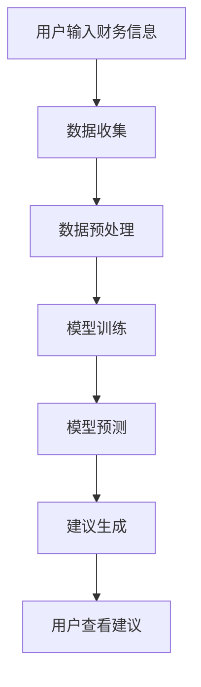

# AI驱动的个人财务规划工具开发指南

> 关键词：AI、个人财务规划、工具开发、机器学习、数据处理

> 摘要：本文旨在为开发者提供一份全面的AI驱动的个人财务规划工具开发指南。首先介绍了开发该工具的背景，包括目的、预期读者、文档结构和相关术语。接着阐述了核心概念与联系，通过文本示意图和Mermaid流程图展示其架构。详细讲解了核心算法原理和具体操作步骤，并用Python代码进行说明。同时给出了数学模型和公式，并举例说明。通过项目实战部分，展示了开发环境搭建、源代码实现和代码解读。还探讨了该工具的实际应用场景，推荐了学习资源、开发工具框架和相关论文著作。最后总结了未来发展趋势与挑战，提供了常见问题解答和扩展阅读参考资料。

## 1. 背景介绍 
### 1.1 目的和范围
在当今社会，个人理财变得越来越重要。然而，许多人缺乏专业的财务知识和时间来进行有效的财务规划。AI驱动的个人财务规划工具可以利用人工智能技术，根据用户的财务状况、收入、支出、目标等信息，为用户提供个性化的财务规划建议。本指南的目的是指导开发者如何开发这样一款工具，涵盖从核心概念理解到实际项目开发的各个方面。其范围包括工具的基本架构、算法原理、数学模型、实际应用场景以及相关资源推荐等。

### 1.2 预期读者
本指南预期读者主要包括软件开发者、人工智能工程师、金融科技爱好者以及对个人财务规划工具开发感兴趣的技术人员。对于有一定编程基础，尤其是熟悉Python语言的开发者来说，本指南将提供详细的技术指导；而对于金融科技爱好者，也可以通过本指南了解AI在个人财务规划领域的应用和开发流程。

### 1.3 文档结构概述
本指南分为多个章节，首先介绍背景信息，让读者了解开发的目的和适用人群。接着阐述核心概念与联系，帮助读者建立对工具的整体认知。核心算法原理和具体操作步骤部分，将详细讲解实现工具功能的算法，并给出Python代码示例。数学模型和公式部分，用数学语言描述工具的工作原理，并举例说明。项目实战部分，从开发环境搭建到源代码实现和解读，带领读者完成一个实际的项目。实际应用场景部分，介绍工具在现实生活中的具体应用。工具和资源推荐部分，为读者提供学习和开发所需的各种资源。最后总结未来发展趋势与挑战，提供常见问题解答和扩展阅读参考资料。

### 1.4 术语表
#### 1.4.1 核心术语定义
- **AI（Artificial Intelligence）**：人工智能，是研究、开发用于模拟、延伸和扩展人的智能的理论、方法、技术及应用系统的一门新的技术科学。
- **个人财务规划**：是指根据个人（家庭）的财务状况和生活目标，制定合理的财务计划，以实现财务目标和保障生活质量。
- **机器学习（Machine Learning）**：是一门多领域交叉学科，涉及概率论、统计学、逼近论、凸分析、算法复杂度理论等多门学科。它专门研究计算机怎样模拟或实现人类的学习行为，以获取新的知识或技能，重新组织已有的知识结构使之不断改善自身的性能。
- **数据处理**：对数据进行采集、存储、检索、加工、变换和传输的过程。

#### 1.4.2 相关概念解释
- **个性化财务规划**：根据用户的独特财务状况、收入、支出、资产、负债、理财目标等因素，为用户量身定制的财务规划方案。
- **风险评估**：对个人财务面临的各种风险进行评估，如市场风险、信用风险、流动性风险等，以确定用户的风险承受能力。
- **投资组合优化**：通过合理配置不同的投资资产，如股票、债券、基金等，在风险和收益之间寻求平衡，以实现投资目标。

#### 1.4.3 缩略词列表
- **AI**：Artificial Intelligence
- **ML**：Machine Learning
- **API**：Application Programming Interface

## 2. 核心概念与联系 
### 核心概念原理
AI驱动的个人财务规划工具的核心原理是利用人工智能技术，特别是机器学习算法，对用户的财务数据进行分析和处理，以提供个性化的财务规划建议。其主要步骤包括数据收集、数据预处理、模型训练、模型预测和建议生成。

数据收集是指收集用户的各种财务数据，如收入、支出、资产、负债等。这些数据可以通过用户手动输入、与银行或金融机构的API接口获取等方式得到。

数据预处理是对收集到的数据进行清洗、转换和特征提取等操作，以提高数据的质量和可用性。例如，去除重复数据、处理缺失值、将数据进行归一化处理等。

模型训练是使用预处理后的数据来训练机器学习模型。常用的模型包括线性回归模型、决策树模型、神经网络模型等。这些模型可以学习数据中的模式和规律，以预测用户的财务状况和需求。

模型预测是使用训练好的模型对用户的未来财务状况进行预测，如预测未来的收入、支出、资产增长等。

建议生成是根据模型预测的结果，结合用户的理财目标和风险承受能力，生成个性化的财务规划建议，如投资建议、储蓄建议、债务管理建议等。

### 架构的文本示意图
```plaintext
+---------------------+
|      用户界面       |
| （输入财务信息、查看建议） |
+---------------------+
|      数据收集层     |
| （手动输入、API接口） |
+---------------------+
|      数据预处理层   |
| （清洗、转换、特征提取） |
+---------------------+
|      模型训练层     |
| （机器学习模型）     |
+---------------------+
|      模型预测层     |
| （预测未来财务状况） |
+---------------------+
|      建议生成层     |
| （个性化财务建议）   |
+---------------------+
```

### Mermaid流程图


## 3. 核心算法原理 & 具体操作步骤 
### 核心算法原理
在AI驱动的个人财务规划工具中，常用的核心算法包括线性回归、决策树和神经网络等。下面以线性回归为例进行详细讲解。

线性回归是一种用于建立自变量和因变量之间线性关系的统计方法。在个人财务规划中，我们可以使用线性回归来预测用户的未来收入或支出。假设我们有一组历史收入数据 $x_1, x_2, \cdots, x_n$ 和对应的时间点 $t_1, t_2, \cdots, t_n$，我们可以建立一个线性回归模型：

$y = \beta_0 + \beta_1t$

其中，$y$ 是预测的收入，$t$ 是时间，$\beta_0$ 和 $\beta_1$ 是模型的参数。我们的目标是通过最小化预测值和实际值之间的误差来估计这些参数。常用的误差度量方法是均方误差（Mean Squared Error，MSE）：

$MSE = \frac{1}{n}\sum_{i=1}^{n}(y_i - (\beta_0 + \beta_1t_i))^2$

通过最小化 $MSE$，我们可以得到最优的 $\beta_0$ 和 $\beta_1$ 值。

### 具体操作步骤
#### 步骤1：数据收集
假设我们已经从用户那里收集到了过去12个月的收入数据，存储在一个列表中。
```python
# 过去12个月的收入数据
income_data = [5000, 5200, 5500, 5300, 5600, 5800, 6000, 6200, 6500, 6300, 6600, 6800]
# 对应的时间点（月份）
time_points = list(range(1, 13))
```

#### 步骤2：数据预处理
在这个例子中，我们不需要进行复杂的预处理，只需要将数据转换为适合线性回归模型的格式。
```python
import numpy as np

# 将数据转换为numpy数组
X = np.array(time_points).reshape(-1, 1)
y = np.array(income_data)
```

#### 步骤3：模型训练
使用 `scikit-learn` 库中的 `LinearRegression` 类来训练线性回归模型。
```python
from sklearn.linear_model import LinearRegression

# 创建线性回归模型
model = LinearRegression()
# 训练模型
model.fit(X, y)
```

#### 步骤4：模型预测
使用训练好的模型来预测未来的收入。假设我们要预测第13个月的收入。
```python
# 预测第13个月的收入
future_time = np.array([13]).reshape(-1, 1)
predicted_income = model.predict(future_time)
print("预测第13个月的收入为：", predicted_income[0])
```

## 4. 数学模型和公式 & 详细讲解 & 举例说明 
### 线性回归模型
线性回归模型的一般形式为：

$y = \beta_0 + \beta_1x_1 + \beta_2x_2 + \cdots + \beta_nx_n + \epsilon$

其中，$y$ 是因变量，$x_1, x_2, \cdots, x_n$ 是自变量，$\beta_0, \beta_1, \cdots, \beta_n$ 是模型的参数，$\epsilon$ 是误差项。

在简单线性回归中，只有一个自变量，即 $n = 1$，模型可以简化为：

$y = \beta_0 + \beta_1x + \epsilon$

我们的目标是找到最优的 $\beta_0$ 和 $\beta_1$ 值，使得预测值和实际值之间的误差最小。常用的方法是最小二乘法，即最小化均方误差（MSE）：

$MSE = \frac{1}{m}\sum_{i=1}^{m}(y^{(i)} - (\beta_0 + \beta_1x^{(i)}))^2$

其中，$m$ 是样本数量，$y^{(i)}$ 是第 $i$ 个样本的实际值，$x^{(i)}$ 是第 $i$ 个样本的自变量值。

通过对 $MSE$ 分别求关于 $\beta_0$ 和 $\beta_1$ 的偏导数，并令其等于0，可以得到最优的 $\beta_0$ 和 $\beta_1$ 值：

$\beta_1 = \frac{\sum_{i=1}^{m}(x^{(i)} - \bar{x})(y^{(i)} - \bar{y})}{\sum_{i=1}^{m}(x^{(i)} - \bar{x})^2}$

$\beta_0 = \bar{y} - \beta_1\bar{x}$

其中，$\bar{x}$ 和 $\bar{y}$ 分别是 $x$ 和 $y$ 的平均值。

### 举例说明
假设我们有以下数据：

| $x$ | $y$ |
| --- | --- |
| 1 | 2 |
| 2 | 4 |
| 3 | 6 |
| 4 | 8 |
| 5 | 10 |

首先，计算 $x$ 和 $y$ 的平均值：

$\bar{x} = \frac{1 + 2 + 3 + 4 + 5}{5} = 3$

$\bar{y} = \frac{2 + 4 + 6 + 8 + 10}{5} = 6$

然后，计算 $\beta_1$：

$\sum_{i=1}^{5}(x^{(i)} - \bar{x})(y^{(i)} - \bar{y}) = (1 - 3)(2 - 6) + (2 - 3)(4 - 6) + (3 - 3)(6 - 6) + (4 - 3)(8 - 6) + (5 - 3)(10 - 6) = 20$

$\sum_{i=1}^{5}(x^{(i)} - \bar{x})^2 = (1 - 3)^2 + (2 - 3)^2 + (3 - 3)^2 + (4 - 3)^2 + (5 - 3)^2 = 10$

$\beta_1 = \frac{20}{10} = 2$

最后，计算 $\beta_0$：

$\beta_0 = \bar{y} - \beta_1\bar{x} = 6 - 2 \times 3 = 0$

所以，线性回归模型为 $y = 2x$。

## 5. 项目实战：代码实际案例和详细解释说明 
### 5.1  开发环境搭建
#### 操作系统
可以选择Windows、Linux或macOS等常见的操作系统。

#### Python环境
安装Python 3.x版本，可以从Python官方网站（https://www.python.org/downloads/）下载并安装。

#### 安装必要的库
使用 `pip` 命令安装以下必要的库：
```sh
pip install numpy pandas scikit-learn matplotlib
```

### 5.2  源代码详细实现和代码解读
```python
import numpy as np
import pandas as pd
from sklearn.linear_model import LinearRegression
import matplotlib.pyplot as plt

# 步骤1：数据收集
# 假设我们有以下收入和支出数据
data = {
    'month': [1, 2, 3, 4, 5, 6, 7, 8, 9, 10, 11, 12],
    'income': [5000, 5200, 5500, 5300, 5600, 5800, 6000, 6200, 6500, 6300, 6600, 6800],
    'expense': [3000, 3100, 3200, 3150, 3300, 3400, 3500, 3600, 3700, 3650, 3800, 3900]
}
df = pd.DataFrame(data)

# 步骤2：数据预处理
X_income = df[['month']]
y_income = df['income']
X_expense = df[['month']]
y_expense = df['expense']

# 步骤3：模型训练
# 训练收入预测模型
income_model = LinearRegression()
income_model.fit(X_income, y_income)

# 训练支出预测模型
expense_model = LinearRegression()
expense_model.fit(X_expense, y_expense)

# 步骤4：模型预测
# 预测未来6个月的收入和支出
future_months = np.array([13, 14, 15, 16, 17, 18]).reshape(-1, 1)
predicted_income = income_model.predict(future_months)
predicted_expense = expense_model.predict(future_months)

# 步骤5：建议生成
# 计算每个月的预计储蓄
predicted_savings = predicted_income - predicted_expense

# 输出结果
print("未来6个月的预计收入：", predicted_income)
print("未来6个月的预计支出：", predicted_expense)
print("未来6个月的预计储蓄：", predicted_savings)

# 可视化结果
plt.figure(figsize=(10, 6))
plt.plot(df['month'], df['income'], label='历史收入')
plt.plot(df['month'], df['expense'], label='历史支出')
plt.plot(future_months, predicted_income, 'r--', label='预计收入')
plt.plot(future_months, predicted_expense, 'g--', label='预计支出')
plt.xlabel('月份')
plt.ylabel('金额')
plt.title('个人财务预测')
plt.legend()
plt.show()
```

### 5.3  代码解读与分析
#### 数据收集
我们使用一个字典 `data` 来模拟收集到的收入和支出数据，并将其转换为 `pandas` 的 `DataFrame` 对象。

#### 数据预处理
将 `DataFrame` 中的 `month` 列作为自变量，`income` 和 `expense` 列分别作为因变量，用于训练线性回归模型。

#### 模型训练
使用 `LinearRegression` 类分别训练收入预测模型和支出预测模型。

#### 模型预测
使用训练好的模型对未来6个月的收入和支出进行预测。

#### 建议生成
通过计算预计收入和预计支出的差值，得到每个月的预计储蓄。

#### 可视化结果
使用 `matplotlib` 库将历史数据和预测数据进行可视化，方便用户直观地查看。

## 6. 实际应用场景 
### 个人理财规划
用户可以使用该工具来制定个人的理财计划，如储蓄计划、投资计划等。通过输入自己的收入、支出、资产等信息，工具可以预测未来的财务状况，并给出相应的理财建议。例如，根据预测的储蓄情况，建议用户每月将一定比例的储蓄用于投资，以实现资产的增值。

### 债务管理
对于有债务的用户，工具可以帮助他们管理债务。通过分析用户的收入和支出情况，预测未来的还款能力，并给出合理的还款计划。例如，建议用户优先偿还高利息的债务，以减少利息支出。

### 退休规划
用户可以使用该工具来规划自己的退休生活。通过输入当前的资产、收入、支出以及预期的退休年龄和生活水平，工具可以计算出为了实现退休目标需要每月储蓄的金额。同时，还可以根据市场情况和投资风险，给出合理的投资建议，以确保退休后的财务安全。

### 教育规划
对于有子女教育需求的用户，工具可以帮助他们制定教育规划。通过预测未来的教育费用和家庭的财务状况，给出合理的储蓄和投资计划，以确保子女能够顺利完成学业。

## 7. 工具和资源推荐
### 7.1 学习资源推荐
#### 7.1.1 书籍推荐
- 《Python数据分析实战》：本书详细介绍了如何使用Python进行数据分析，包括数据收集、清洗、处理和可视化等方面的内容，对于开发个人财务规划工具非常有帮助。
- 《机器学习》（周志华著）：这是一本经典的机器学习教材，系统地介绍了机器学习的基本概念、算法和应用，适合有一定编程基础的读者深入学习。
- 《财务分析与决策》：本书从财务的角度出发，介绍了财务分析的方法和决策技巧，对于理解个人财务规划的原理和方法有很大的帮助。

#### 7.1.2 在线课程
- Coursera上的“机器学习”课程：由斯坦福大学的Andrew Ng教授授课，是一门非常经典的机器学习在线课程，内容涵盖了机器学习的各个方面。
- edX上的“Python for Data Science”课程：该课程主要介绍了如何使用Python进行数据分析，包括数据处理、可视化和机器学习等内容。
- 网易云课堂上的“个人理财规划实战课程”：该课程结合实际案例，介绍了个人理财规划的方法和技巧，适合初学者学习。

#### 7.1.3 技术博客和网站
- 博客园：是一个技术博客平台，上面有很多关于Python、机器学习和数据分析的技术文章，可以帮助开发者学习和交流。
- 掘金：是一个面向开发者的技术社区，提供了丰富的技术文章和资源，对于开发个人财务规划工具非常有帮助。
- Kaggle：是一个数据科学竞赛平台，上面有很多关于数据分析和机器学习的数据集和代码示例，可以供开发者参考和学习。

### 7.2 开发工具框架推荐
#### 7.2.1 IDE和编辑器
- PyCharm：是一款专门为Python开发设计的集成开发环境（IDE），具有强大的代码编辑、调试和项目管理功能，适合专业开发者使用。
- Jupyter Notebook：是一个交互式的开发环境，可以方便地进行数据分析和可视化，适合数据科学家和初学者使用。
- Visual Studio Code：是一款轻量级的代码编辑器，支持多种编程语言，具有丰富的插件和扩展功能，适合快速开发和调试。

#### 7.2.2 调试和性能分析工具
- pdb：是Python自带的调试工具，可以帮助开发者在代码中设置断点、单步执行等，方便调试代码。
- cProfile：是Python的性能分析工具，可以帮助开发者分析代码的执行时间和性能瓶颈，以便进行优化。
- TensorBoard：是TensorFlow的可视化工具，可以帮助开发者可视化模型的训练过程和性能指标，方便调试和优化模型。

#### 7.2.3 相关框架和库
- NumPy：是Python的一个科学计算库，提供了高效的多维数组对象和各种数学函数，是数据分析和机器学习的基础库。
- Pandas：是Python的一个数据处理库，提供了高效的数据结构和数据处理方法，方便进行数据清洗、转换和分析。
- Scikit-learn：是Python的一个机器学习库，提供了各种机器学习算法和工具，如分类、回归、聚类等，方便开发者进行模型训练和预测。
- Matplotlib：是Python的一个数据可视化库，提供了各种绘图函数和工具，方便开发者将数据可视化，以便更好地理解和分析数据。

### 7.3 相关论文著作推荐
#### 7.3.1 经典论文
- 《A Mathematical Theory of Communication》（Claude E. Shannon著）：这是信息论的经典论文，介绍了信息熵的概念和通信系统的基本原理，对于理解数据处理和机器学习中的信息论方法有很大的帮助。
- 《Pattern Recognition and Machine Learning》（Christopher M. Bishop著）：这是一本经典的机器学习教材，系统地介绍了模式识别和机器学习的基本概念、算法和应用，是机器学习领域的重要参考文献。
- 《The Efficient Market Hypothesis and Its Critics》（Eugene F. Fama著）：这篇论文介绍了有效市场假说的基本概念和理论，以及对其的批评和挑战，对于理解金融市场的效率和投资策略有很大的帮助。

#### 7.3.2 最新研究成果
- 可以关注顶级学术会议如NeurIPS（神经信息处理系统大会）、ICML（国际机器学习会议）、KDD（知识发现与数据挖掘会议）等的最新研究成果，了解AI在个人财务规划领域的最新应用和发展趋势。
- 还可以关注金融科技领域的学术期刊，如《Journal of Financial Economics》、《Review of Financial Studies》等，获取最新的研究论文和案例。

#### 7.3.3 应用案例分析
- 可以参考一些金融科技公司的案例分析，了解他们如何使用AI技术开发个人财务规划工具。例如，Betterment是一家知名的智能投顾公司，他们使用机器学习算法为用户提供个性化的投资建议和资产配置方案。
- 还可以关注一些银行和金融机构的数字化转型案例，了解他们如何利用AI技术提升个人理财服务的质量和效率。

## 8. 总结：未来发展趋势与挑战
### 未来发展趋势
- **更智能化的推荐**：随着人工智能技术的不断发展，个人财务规划工具将能够提供更加智能化、个性化的推荐。例如，工具可以根据用户的实时财务状况和市场变化，动态调整理财建议，以实现最优的财务规划。
- **与区块链技术的结合**：区块链技术具有去中心化、不可篡改、安全可靠等特点，可以为个人财务规划工具提供更加安全、透明的服务。例如，通过区块链技术可以实现用户财务数据的安全存储和共享，提高数据的可信度和安全性。
- **多渠道融合**：未来的个人财务规划工具将不仅仅局限于网页和手机应用，还将与智能手表、智能家居等设备进行融合，实现多渠道的服务。用户可以通过不同的设备随时随地获取财务规划建议和服务。
- **社交化理财**：社交化理财将成为未来的一个发展趋势。个人财务规划工具可以引入社交元素，让用户可以与朋友、家人或理财专家进行交流和分享，互相学习和借鉴理财经验。

### 挑战
- **数据安全和隐私保护**：个人财务数据涉及用户的隐私和财产安全，如何保障数据的安全和隐私是开发个人财务规划工具面临的一个重要挑战。开发者需要采用先进的加密技术和安全措施，确保用户数据不被泄露和滥用。
- **模型的准确性和可靠性**：个人财务规划工具的核心是机器学习模型，模型的准确性和可靠性直接影响到工具的服务质量。开发者需要不断优化模型，提高模型的预测精度和稳定性，以应对复杂多变的市场环境。
- **法规和监管**：金融行业受到严格的法规和监管，开发个人财务规划工具需要遵守相关的法律法规。开发者需要了解和掌握金融法规和监管要求，确保工具的合规性。
- **用户教育和接受度**：很多用户对人工智能技术和个人财务规划工具还不够了解和信任，需要进行用户教育和推广。开发者需要通过宣传和培训，提高用户对工具的认知和接受度。

## 9. 附录：常见问题与解答
### 问题1：开发个人财务规划工具需要具备哪些技术能力？
答：开发个人财务规划工具需要具备以下技术能力：
- 编程语言：熟练掌握Python，因为Python在数据分析、机器学习和Web开发等方面有很多优秀的库和框架。
- 数据分析：了解数据收集、清洗、处理和可视化的方法和技术，能够使用NumPy、Pandas和Matplotlib等库进行数据分析。
- 机器学习：掌握常见的机器学习算法，如线性回归、决策树、神经网络等，能够使用Scikit-learn等库进行模型训练和预测。
- Web开发：如果要开发Web应用程序，需要了解HTML、CSS、JavaScript等前端技术和Flask、Django等后端框架。

### 问题2：如何获取用户的财务数据？
答：获取用户财务数据的方式有多种：
- 用户手动输入：让用户在工具中手动输入自己的收入、支出、资产等信息。
- 与银行或金融机构合作：通过API接口与银行或金融机构进行数据对接，获取用户的交易记录、账户余额等信息。但这种方式需要获得用户的授权，并且要遵守相关的法规和安全要求。
- 第三方数据提供商：可以使用一些第三方数据提供商提供的财务数据，如信用报告、市场数据等。

### 问题3：如何评估模型的性能？
答：评估模型性能的方法有多种，常见的有：
- 均方误差（MSE）：用于衡量模型预测值和实际值之间的平均误差，MSE越小，模型的性能越好。
- 决定系数（$R^2$）：表示模型对数据的拟合程度，$R^2$越接近1，模型的拟合效果越好。
- 交叉验证：将数据集分为训练集和测试集，多次重复训练和测试过程，取平均性能指标作为模型的评估结果，以减少过拟合的影响。

### 问题4：如何确保工具的安全性？
答：确保工具的安全性可以从以下几个方面入手：
- 数据加密：对用户的财务数据进行加密存储和传输，使用SSL/TLS协议确保数据在传输过程中的安全性。
- 访问控制：设置严格的访问权限，只有授权的用户和系统才能访问用户的财务数据。
- 安全审计：对系统的操作和访问进行审计，及时发现和处理安全漏洞和异常行为。
- 合规性：遵守相关的法规和标准，如GDPR、PCI DSS等，确保工具的合规性。

## 10. 扩展阅读 & 参考资料
### 扩展阅读
- 《人工智能时代的金融科技》：本书介绍了人工智能技术在金融领域的应用和发展趋势，对于了解AI驱动的个人财务规划工具的背景和前景有很大的帮助。
- 《数据挖掘：概念与技术》：本书系统地介绍了数据挖掘的基本概念、算法和应用，对于深入理解数据分析和机器学习在个人财务规划工具中的应用有很大的帮助。
- 《金融科技：重构未来金融生态》：本书探讨了金融科技对金融行业的影响和变革，对于了解个人财务规划工具的发展趋势和挑战有很大的帮助。

### 参考资料
- Python官方文档（https://docs.python.org/3/）
- NumPy官方文档（https://numpy.org/doc/）
- Pandas官方文档（https://pandas.pydata.org/docs/）
- Scikit-learn官方文档（https://scikit-learn.org/stable/documentation.html）
- Matplotlib官方文档（https://matplotlib.org/stable/contents.html）

作者：AI天才研究院/AI Genius Institute & 禅与计算机程序设计艺术 /Zen And The Art of Computer Programming