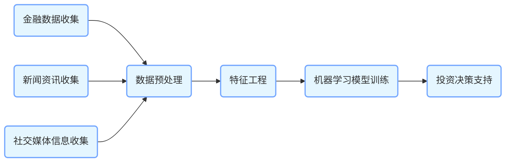

# AI驱动的价值投资者行为模式分析

> 关键词：AI、价值投资、投资者行为模式、数据分析、机器学习

> 摘要：本文聚焦于AI驱动下价值投资者的行为模式分析。通过对背景的介绍，让读者了解研究的目的、范围、预期读者等信息。详细阐述了核心概念及联系，给出了相关原理和架构的示意图与流程图。深入讲解核心算法原理并辅以Python代码说明，同时介绍了数学模型和公式。通过项目实战展示代码实现与解读，探讨了实际应用场景。还推荐了学习、开发工具等资源，最后总结未来发展趋势与挑战，并提供常见问题解答和参考资料，旨在为深入理解AI在价值投资领域的应用及投资者行为模式提供全面且专业的分析。

## 1. 背景介绍 
### 1.1 目的和范围
随着人工智能技术的飞速发展，其在金融投资领域的应用日益广泛。价值投资作为一种经典的投资策略，旨在寻找被低估的资产并长期持有。本研究的目的在于分析AI驱动下价值投资者的行为模式，探究AI技术如何影响投资者的决策过程、投资策略以及风险控制等方面。研究范围涵盖了价值投资的基本理论、AI技术在投资中的应用场景、投资者行为数据的收集与分析等多个方面。

### 1.2 预期读者
本文预期读者包括金融投资领域的从业者，如基金经理、投资顾问等，他们可以从文中了解AI技术在价值投资中的应用，优化自身的投资策略；计算机科学领域的研究人员和开发者，能够从中获取将AI技术应用于金融领域的思路和方法；对价值投资和AI技术感兴趣的普通投资者，可通过本文加深对两者结合的理解，提升自身的投资水平。

### 1.3 文档结构概述
本文将按照以下结构展开：首先介绍核心概念与联系，明确相关术语和原理；接着阐述核心算法原理和具体操作步骤，并给出Python代码示例；然后介绍数学模型和公式，通过举例说明其应用；之后进行项目实战，展示代码的实际实现和详细解读；探讨实际应用场景；推荐相关的工具和资源；最后总结未来发展趋势与挑战，提供常见问题解答和参考资料。

### 1.4 术语表
#### 1.4.1 核心术语定义
- **价值投资**：一种投资策略，基于对资产内在价值的评估，寻找价格低于内在价值的资产进行投资，强调长期持有。
- **AI（人工智能）**：使计算机系统能够模拟人类智能的技术，包括机器学习、深度学习、自然语言处理等。
- **投资者行为模式**：投资者在投资决策过程中表现出的行为特征和规律，包括信息收集、分析、决策等环节。

#### 1.4.2 相关概念解释
- **机器学习**：AI的一个重要分支，通过让计算机从数据中学习模式和规律，从而实现预测和决策。常见的机器学习算法包括决策树、支持向量机、神经网络等。
- **深度学习**：一种基于神经网络的机器学习技术，具有强大的特征提取和模式识别能力，在图像识别、语音识别等领域取得了显著成果。
- **内在价值**：资产的真实价值，通常通过对资产的基本面进行分析，如财务报表、行业前景等，来评估其内在价值。

#### 1.4.3 缩略词列表
- **AI**：Artificial Intelligence（人工智能）
- **ML**：Machine Learning（机器学习）
- **DL**：Deep Learning（深度学习）

## 2. 核心概念与联系 
### 核心概念原理
价值投资的核心原理是寻找被市场低估的资产，通过分析资产的内在价值和市场价格之间的差异，做出投资决策。AI技术在价值投资中的应用主要基于数据驱动的方法，通过收集和分析大量的金融数据、新闻资讯、社交媒体信息等，挖掘其中的规律和模式，为投资者提供决策支持。

例如，机器学习算法可以对历史股价数据进行分析，预测未来股价的走势；自然语言处理技术可以对新闻报道和分析师评级进行情感分析，了解市场情绪对股价的影响。

### 架构示意图

该示意图展示了AI驱动的价值投资分析系统的基本架构。首先，从多个数据源收集金融数据、新闻资讯和社交媒体信息；然后对这些数据进行预处理，包括清洗、归一化等操作；接着进行特征工程，提取有价值的特征；使用这些特征训练机器学习模型；最后，根据模型的输出为投资者提供投资决策支持。

## 3. 核心算法原理 & 具体操作步骤 
### 核心算法原理
在AI驱动的价值投资分析中，常用的算法包括线性回归、逻辑回归、决策树、随机森林和神经网络等。下面以线性回归为例，介绍其原理和应用。

线性回归是一种用于建立自变量和因变量之间线性关系的统计模型。假设我们有一组自变量 $X = [x_1, x_2,..., x_n]$ 和对应的因变量 $y$，线性回归模型可以表示为：

$$y = \beta_0 + \beta_1x_1 + \beta_2x_2 +... + \beta_nx_n + \epsilon$$

其中，$\beta_0$ 是截距项，$\beta_1, \beta_2,..., \beta_n$ 是回归系数，$\epsilon$ 是误差项。线性回归的目标是通过最小化误差项的平方和，找到最优的回归系数 $\beta$。

### 具体操作步骤
1. **数据收集**：收集与价值投资相关的数据，如股价、财务指标、宏观经济数据等。
2. **数据预处理**：对收集到的数据进行清洗、缺失值处理、归一化等操作，确保数据的质量和一致性。
3. **特征选择**：从预处理后的数据中选择与因变量相关性较高的特征，减少模型的复杂度。
4. **模型训练**：使用训练数据对线性回归模型进行训练，估计回归系数。
5. **模型评估**：使用测试数据对训练好的模型进行评估，计算模型的性能指标，如均方误差（MSE）、决定系数（$R^2$）等。
6. **投资决策**：根据模型的预测结果，做出投资决策。

### Python代码示例
```python
import numpy as np
import pandas as pd
from sklearn.linear_model import LinearRegression
from sklearn.model_selection import train_test_split
from sklearn.metrics import mean_squared_error, r2_score

# 生成示例数据
np.random.seed(0)
n_samples = 100
X = np.random.randn(n_samples, 2)
y = 2 * X[:, 0] + 3 * X[:, 1] + np.random.randn(n_samples)

# 划分训练集和测试集
X_train, X_test, y_train, y_test = train_test_split(X, y, test_size=0.2, random_state=42)

# 创建线性回归模型
model = LinearRegression()

# 训练模型
model.fit(X_train, y_train)

# 预测
y_pred = model.predict(X_test)

# 评估模型
mse = mean_squared_error(y_test, y_pred)
r2 = r2_score(y_test, y_pred)

print(f"均方误差 (MSE): {mse}")
print(f"决定系数 (R^2): {r2}")
```
在上述代码中，我们首先生成了一组示例数据，然后将数据划分为训练集和测试集。接着创建了一个线性回归模型，并使用训练数据对其进行训练。最后，使用测试数据进行预测，并计算了模型的均方误差和决定系数。

## 4. 数学模型和公式 & 详细讲解 & 举例说明 
### 线性回归模型的数学推导
线性回归模型的目标是最小化误差项的平方和，即：

$$\min_{\beta} \sum_{i=1}^{m} (y_i - \hat{y}_i)^2$$

其中，$m$ 是样本数量，$y_i$ 是第 $i$ 个样本的真实值，$\hat{y}_i$ 是第 $i$ 个样本的预测值。

将线性回归模型 $y = \beta_0 + \beta_1x_1 + \beta_2x_2 +... + \beta_nx_n + \epsilon$ 代入上式，得到：

$$\min_{\beta} \sum_{i=1}^{m} (y_i - (\beta_0 + \beta_1x_{i1} + \beta_2x_{i2} +... + \beta_nx_{in}))^2$$

为了求解上述优化问题，我们可以使用最小二乘法。最小二乘法的原理是通过求偏导数并令其为零，得到回归系数的最优解。

对 $\beta_0, \beta_1,..., \beta_n$ 分别求偏导数，并令其为零，得到以下方程组：

$$\begin{cases}
\frac{\partial}{\partial \beta_0} \sum_{i=1}^{m} (y_i - (\beta_0 + \beta_1x_{i1} + \beta_2x_{i2} +... + \beta_nx_{in}))^2 = 0 \\
\frac{\partial}{\partial \beta_1} \sum_{i=1}^{m} (y_i - (\beta_0 + \beta_1x_{i1} + \beta_2x_{i2} +... + \beta_nx_{in}))^2 = 0 \\
\vdots \\
\frac{\partial}{\partial \beta_n} \sum_{i=1}^{m} (y_i - (\beta_0 + \beta_1x_{i1} + \beta_2x_{i2} +... + \beta_nx_{in}))^2 = 0
\end{cases}$$

解上述方程组，即可得到回归系数的最优解。

### 举例说明
假设我们有以下一组数据：

| $x_1$ | $x_2$ | $y$ |
| --- | --- | --- |
| 1 | 2 | 7 |
| 2 | 3 | 10 |
| 3 | 4 | 13 |
| 4 | 5 | 16 |

我们可以使用线性回归模型来预测 $y$ 的值。首先，将数据表示为矩阵形式：

$$X = \begin{bmatrix}
1 & 1 & 2 \\
1 & 2 & 3 \\
1 & 3 & 4 \\
1 & 4 & 5
\end{bmatrix}, \quad y = \begin{bmatrix}
7 \\
10 \\
13 \\
16
\end{bmatrix}$$

根据最小二乘法的公式，回归系数 $\beta$ 的解为：

$$\beta = (X^T X)^{-1} X^T y$$

使用Python代码实现上述计算：

```python
import numpy as np

X = np.array([[1, 1, 2], [1, 2, 3], [1, 3, 4], [1, 4, 5]])
y = np.array([7, 10, 13, 16])

# 计算回归系数
beta = np.linalg.inv(X.T @ X) @ X.T @ y

print(f"回归系数: {beta}")
```
运行上述代码，得到回归系数 $\beta = [1, 2, 3]$。这意味着线性回归模型为 $y = 1 + 2x_1 + 3x_2$。

## 5. 项目实战：代码实际案例和详细解释说明 
### 5.1  开发环境搭建
在进行项目实战之前，需要搭建相应的开发环境。以下是搭建开发环境的步骤：
1. **安装Python**：从Python官方网站（https://www.python.org/downloads/）下载并安装Python 3.x版本。
2. **安装必要的库**：使用pip命令安装以下必要的库：
```sh
pip install pandas numpy scikit-learn matplotlib
```
3. **选择开发工具**：可以选择使用Jupyter Notebook、PyCharm等开发工具进行代码编写和调试。

### 5.2  源代码详细实现和代码解读
以下是一个使用线性回归模型进行股票价格预测的实际案例：

```python
import pandas as pd
import numpy as np
from sklearn.linear_model import LinearRegression
from sklearn.model_selection import train_test_split
from sklearn.metrics import mean_squared_error, r2_score
import matplotlib.pyplot as plt

# 读取股票数据
data = pd.read_csv('stock_data.csv')

# 提取特征和目标变量
X = data[['Open', 'High', 'Low', 'Volume']]
y = data['Close']

# 划分训练集和测试集
X_train, X_test, y_train, y_test = train_test_split(X, y, test_size=0.2, random_state=42)

# 创建线性回归模型
model = LinearRegression()

# 训练模型
model.fit(X_train, y_train)

# 预测
y_pred = model.predict(X_test)

# 评估模型
mse = mean_squared_error(y_test, y_pred)
r2 = r2_score(y_test, y_pred)

print(f"均方误差 (MSE): {mse}")
print(f"决定系数 (R^2): {r2}")

# 可视化预测结果
plt.figure(figsize=(10, 6))
plt.plot(y_test.values, label='真实值')
plt.plot(y_pred, label='预测值')
plt.xlabel('样本序号')
plt.ylabel('股票收盘价')
plt.title('股票价格预测结果')
plt.legend()
plt.show()
```

### 代码解读与分析
1. **数据读取**：使用`pandas`库的`read_csv`函数读取股票数据文件`stock_data.csv`。
2. **特征提取**：从数据中提取`Open`、`High`、`Low`和`Volume`作为特征，`Close`作为目标变量。
3. **数据划分**：使用`train_test_split`函数将数据划分为训练集和测试集，测试集占比为20%。
4. **模型创建与训练**：创建一个线性回归模型，并使用训练数据对其进行训练。
5. **预测与评估**：使用训练好的模型对测试数据进行预测，并计算均方误差和决定系数。
6. **可视化**：使用`matplotlib`库绘制真实值和预测值的折线图，直观展示预测结果。

## 6. 实际应用场景 
### 投资决策支持
AI技术可以帮助价值投资者更准确地评估资产的内在价值，提供投资决策支持。通过分析大量的金融数据和市场信息，AI模型可以预测资产价格的走势，识别潜在的投资机会和风险。投资者可以根据模型的预测结果，调整投资组合，优化投资策略。

### 风险评估与控制
在价值投资中，风险评估和控制是非常重要的环节。AI技术可以通过对历史数据的分析和建模，评估投资组合的风险水平，预测潜在的风险事件。投资者可以根据风险评估结果，采取相应的风险控制措施，如调整仓位、分散投资等。

### 市场情绪分析
市场情绪对资产价格的走势有着重要的影响。AI技术可以通过对新闻资讯、社交媒体信息等进行情感分析，了解市场参与者的情绪状态。投资者可以根据市场情绪分析结果，判断市场的热度和趋势，做出更明智的投资决策。

## 7. 工具和资源推荐
### 7.1 学习资源推荐
#### 7.1.1 书籍推荐
- 《Python数据分析实战》：介绍了Python在数据分析领域的应用，包括数据处理、可视化、机器学习等方面的知识。
- 《机器学习实战》：通过实际案例介绍了机器学习的基本算法和应用，适合初学者入门。
- 《深度学习》：由深度学习领域的三位巨头Ian Goodfellow、Yoshua Bengio和Aaron Courville合著，是深度学习领域的经典教材。

#### 7.1.2 在线课程
- Coursera上的“机器学习”课程：由斯坦福大学教授Andrew Ng主讲，是机器学习领域的经典课程。
- edX上的“深度学习基础”课程：介绍了深度学习的基本概念、算法和应用。
- 网易云课堂上的“Python数据分析与机器学习实战”课程：结合实际案例，介绍了Python在数据分析和机器学习领域的应用。

#### 7.1.3 技术博客和网站
- Medium：一个技术博客平台，上面有很多关于AI、机器学习、金融投资等领域的优质文章。
- Towards Data Science：专注于数据科学和机器学习领域的技术博客，提供了很多实用的教程和案例。
- 金融界：提供了丰富的金融资讯和数据，是投资者获取市场信息的重要渠道。

### 7.2 开发工具框架推荐
#### 7.2.1 IDE和编辑器
- Jupyter Notebook：一个交互式的开发环境，适合进行数据分析和模型实验。
- PyCharm：一款专业的Python集成开发环境，提供了丰富的功能和插件。
- Visual Studio Code：一款轻量级的代码编辑器，支持多种编程语言，具有丰富的扩展插件。

#### 7.2.2 调试和性能分析工具
- PDB：Python自带的调试工具，可以帮助开发者定位和解决代码中的问题。
- cProfile：Python的性能分析工具，可以分析代码的运行时间和资源消耗情况。
- TensorBoard：TensorFlow的可视化工具，可以帮助开发者可视化模型的训练过程和性能指标。

#### 7.2.3 相关框架和库
- Pandas：用于数据处理和分析的Python库，提供了丰富的数据结构和函数。
- NumPy：用于科学计算的Python库，提供了高效的数组操作和数学函数。
- Scikit-learn：用于机器学习的Python库，提供了多种机器学习算法和工具。
- TensorFlow和PyTorch：深度学习领域的两大主流框架，提供了强大的深度学习模型构建和训练功能。

### 7.3 相关论文著作推荐
#### 7.3.1 经典论文
- Fama, E. F., & French, K. R. (1992). The cross-section of expected stock returns. The Journal of Finance, 47(2), 427-465.
- Sharpe, W. F. (1964). Capital asset prices: A theory of market equilibrium under conditions of risk. The Journal of Finance, 19(3), 425-442.

#### 7.3.2 最新研究成果
- Gu, S., Kelly, B., & Xiu, D. (2020). Empirical asset pricing via machine learning. Review of Financial Studies, 33(5), 2223-2273.
- Feng, Y., Giglio, S., & Xiu, D. (2021). Measuring tail risk in financial markets with machine learning. Journal of Financial Economics, 140(1), 21-44.

#### 7.3.3 应用案例分析
- 一些知名金融机构和研究机构发布的关于AI在投资领域应用的研究报告和案例分析，如高盛、摩根大通等。

## 8. 总结：未来发展趋势与挑战
### 未来发展趋势
- **多技术融合**：AI技术将与区块链、物联网等技术深度融合，为价值投资提供更全面、更准确的数据和分析工具。
- **个性化投资服务**：根据投资者的风险偏好、投资目标等个性化信息，提供定制化的投资策略和服务。
- **智能投顾普及**：智能投顾将逐渐普及，为普通投资者提供低成本、高效率的投资顾问服务。

### 挑战
- **数据质量和隐私问题**：AI技术依赖大量的数据进行训练和分析，数据的质量和隐私保护是一个重要的挑战。
- **模型解释性**：一些复杂的AI模型，如深度学习模型，缺乏良好的解释性，投资者难以理解模型的决策过程和依据。
- **监管和合规问题**：AI在金融投资领域的应用需要遵守相关的监管和合规要求，如何确保技术的合法合规应用是一个挑战。

## 9. 附录：常见问题与解答
### 1. AI技术在价值投资中的应用是否可靠？
AI技术在价值投资中的应用具有一定的可靠性，但也存在一定的局限性。AI模型是基于历史数据进行训练的，未来市场情况可能与历史情况不同，因此模型的预测结果可能存在误差。此外，AI模型的性能还受到数据质量、特征选择、模型参数等因素的影响。因此，在使用AI技术进行价值投资时，需要结合投资者的经验和判断，进行综合分析。

### 2. 如何选择适合的AI算法进行价值投资分析？
选择适合的AI算法需要考虑多个因素，如数据类型、问题类型、模型复杂度等。对于简单的线性回归问题，可以选择线性回归算法；对于非线性问题，可以选择决策树、随机森林、神经网络等算法。此外，还可以通过交叉验证等方法，比较不同算法的性能，选择最优的算法。

### 3. AI技术是否会取代价值投资者？
AI技术不会取代价值投资者，而是作为一种工具，帮助投资者更好地进行投资决策。价值投资不仅仅是基于数据和模型的分析，还需要投资者具备对市场的洞察力、对行业的理解和对企业的判断力。AI技术可以提供更准确的数据分析和预测，但最终的投资决策还需要投资者根据自己的经验和判断来做出。

## 10. 扩展阅读 & 参考资料
### 扩展阅读
- 《智能金融：AI时代金融行业的创新与转型》
- 《金融科技：框架与实践》

### 参考资料
- Fama, E. F., & French, K. R. (1992). The cross-section of expected stock returns. The Journal of Finance, 47(2), 427-465.
- Sharpe, W. F. (1964). Capital asset prices: A theory of market equilibrium under conditions of risk. The Journal of Finance, 19(3), 425-442.
- Gu, S., Kelly, B., & Xiu, D. (2020). Empirical asset pricing via machine learning. Review of Financial Studies, 33(5), 2223-2273.
- Feng, Y., Giglio, S., & Xiu, D. (2021). Measuring tail risk in financial markets with machine learning. Journal of Financial Economics, 140(1), 21-44.

作者：AI天才研究院/AI Genius Institute & 禅与计算机程序设计艺术 /Zen And The Art of Computer Programming