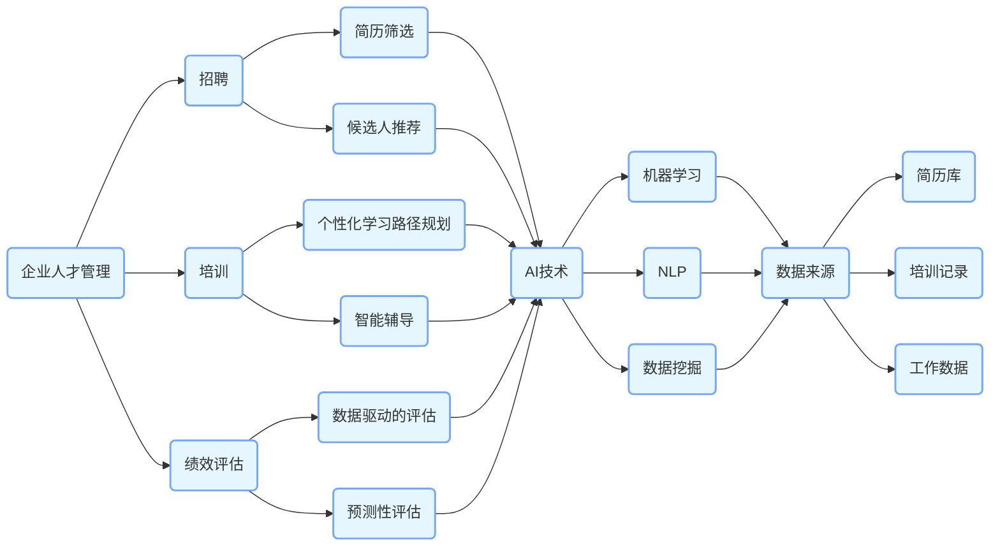

# AI驱动的企业人才管理：招聘、培训到绩效评估

> 关键词：AI、企业人才管理、招聘、培训、绩效评估

> 摘要：本文深入探讨了AI在企业人才管理领域从招聘、培训到绩效评估的全面应用。首先介绍了相关背景，包括目的范围、预期读者等内容。接着阐述了AI与企业人才管理的核心概念及联系，给出了原理和架构示意图与流程图。详细讲解了核心算法原理并结合Python代码进行说明，还分析了相关数学模型和公式。通过项目实战展示了具体代码实现和解读，探讨了实际应用场景。推荐了学习资源、开发工具框架以及相关论文著作。最后总结了未来发展趋势与挑战，并对常见问题进行解答，提供了扩展阅读和参考资料，旨在帮助企业更好地利用AI提升人才管理水平。

## 1. 背景介绍 
### 1.1 目的和范围
在当今数字化时代，企业面临着日益激烈的市场竞争，人才成为企业核心竞争力的关键因素。传统的人才管理方式在效率、精准度和个性化方面存在诸多局限，难以满足企业快速发展的需求。本文章的目的在于探讨如何利用人工智能（AI）技术来优化企业人才管理的各个环节，包括招聘、培训和绩效评估，提高人才管理的质量和效率，为企业带来更大的价值。

文章的范围涵盖了AI在企业人才管理各环节的应用原理、算法、实际案例以及相关工具和资源推荐等方面，旨在为企业管理者、人力资源从业者和技术人员提供全面的参考和指导。

### 1.2 预期读者
- **企业管理者**：希望了解AI技术如何助力企业人才管理，提升企业整体竞争力的高层管理人员。
- **人力资源从业者**：负责企业人才招聘、培训和绩效评估等工作，希望借助AI技术改进工作流程和方法的专业人士。
- **技术人员**：对AI技术在企业人才管理领域的应用感兴趣，希望深入了解相关算法和技术实现的开发者和研究人员。

### 1.3 文档结构概述
本文将按照以下结构进行阐述：
- **核心概念与联系**：介绍AI与企业人才管理各环节的核心概念，以及它们之间的内在联系，并通过示意图和流程图进行直观展示。
- **核心算法原理 & 具体操作步骤**：详细讲解在招聘、培训和绩效评估中常用的AI算法原理，并给出Python代码示例。
- **数学模型和公式 & 详细讲解 & 举例说明**：分析相关的数学模型和公式，通过具体例子帮助读者理解其应用。
- **项目实战：代码实际案例和详细解释说明**：通过实际项目案例，展示如何使用AI技术实现企业人才管理的具体功能，并对代码进行详细解读。
- **实际应用场景**：探讨AI在企业人才管理各环节的实际应用场景和效果。
- **工具和资源推荐**：推荐学习AI在企业人才管理应用的相关书籍、在线课程、技术博客和网站，以及开发工具、框架和相关论文著作。
- **总结：未来发展趋势与挑战**：总结AI在企业人才管理领域的未来发展趋势，并分析可能面临的挑战。
- **附录：常见问题与解答**：对读者可能关心的常见问题进行解答。
- **扩展阅读 & 参考资料**：提供相关的扩展阅读材料和参考资料，方便读者进一步深入学习。

### 1.4 术语表
#### 1.4.1 核心术语定义
- **人工智能（AI）**：指计算机系统能够执行通常需要人类智能才能完成的任务，如学习、推理、解决问题等。
- **机器学习（ML）**：是AI的一个分支，通过让计算机从数据中学习模式和规律，从而实现预测和决策。
- **自然语言处理（NLP）**：研究如何让计算机理解和处理人类语言的技术。
- **人才管理**：指企业对人才的招聘、培训、绩效评估、激励等一系列活动的管理过程。
- **招聘**：企业为满足自身发展需求，吸引和选拔合适人才的过程。
- **培训**：企业为提升员工能力和素质，对员工进行知识和技能传授的活动。
- **绩效评估**：企业对员工工作表现和成果进行评价和衡量的过程。

#### 1.4.2 相关概念解释
- **深度学习**：是机器学习的一种，通过构建多层神经网络来学习数据的深层特征，在图像识别、语音识别等领域取得了显著成果。
- **数据挖掘**：从大量数据中发现有价值信息和知识的过程，常用于人才管理中的数据分析和预测。
- **推荐系统**：根据用户的历史行为和偏好，为用户推荐相关的物品或信息，在人才招聘和培训中可用于推荐合适的候选人或培训课程。

#### 1.4.3 缩略词列表
- **AI**：Artificial Intelligence
- **ML**：Machine Learning
- **NLP**：Natural Language Processing
- **HR**：Human Resources

## 2. 核心概念与联系 

### 核心概念原理
在企业人才管理中，AI主要通过以下几个核心概念发挥作用：

#### 招聘环节
- **简历筛选**：利用NLP技术对候选人的简历进行解析和分析，提取关键信息，如工作经验、技能、教育背景等，并与岗位要求进行匹配，快速筛选出合适的候选人。
- **候选人推荐**：基于机器学习算法，根据企业的历史招聘数据和岗位要求，为企业推荐潜在的合适候选人。

#### 培训环节
- **个性化学习路径规划**：通过分析员工的技能水平、学习历史和职业发展目标，利用机器学习算法为员工制定个性化的学习路径和培训计划。
- **智能辅导**：利用AI技术为员工提供实时的学习辅导和反馈，帮助员工更好地掌握知识和技能。

#### 绩效评估环节
- **数据驱动的评估**：收集员工的工作数据，如工作成果、工作效率、团队协作等，利用机器学习算法对员工的绩效进行客观、准确的评估。
- **预测性评估**：通过分析员工的历史绩效数据和其他相关因素，利用机器学习算法预测员工未来的绩效表现，为企业的人力资源决策提供参考。

### 架构的文本示意图
```plaintext
+----------------------+
|      企业人才管理     |
+----------------------+
| 招聘   |  培训  | 绩效评估 |
+----------------------+
|        AI技术         |
| 机器学习 | NLP | 数据挖掘 |
+----------------------+
|        数据来源       |
| 简历库 | 培训记录 | 工作数据 |
+----------------------+
```

### Mermaid流程图


## 3. 核心算法原理 & 具体操作步骤 

### 招聘环节 - 简历筛选算法原理及Python代码示例
#### 算法原理
简历筛选的核心是计算简历与岗位要求之间的相似度。常用的方法是使用词向量表示简历和岗位要求，然后计算它们之间的余弦相似度。具体步骤如下：
1. **文本预处理**：对简历和岗位要求进行清洗，去除停用词、标点符号等。
2. **词向量表示**：使用预训练的词向量模型（如Word2Vec）将文本转换为向量表示。
3. **相似度计算**：计算简历向量和岗位要求向量之间的余弦相似度。

#### Python代码示例
```python
import numpy as np
from sklearn.feature_extraction.text import TfidfVectorizer
from sklearn.metrics.pairwise import cosine_similarity
import nltk
from nltk.corpus import stopwords
from nltk.tokenize import word_tokenize
import string

# 下载停用词
nltk.download('stopwords')
nltk.download('punkt')

def preprocess_text(text):
    # 转换为小写
    text = text.lower()
    # 去除标点符号
    text = text.translate(str.maketrans('', '', string.punctuation))
    # 分词
    tokens = word_tokenize(text)
    # 去除停用词
    stop_words = set(stopwords.words('english'))
    filtered_tokens = [token for token in tokens if token not in stop_words]
    # 重新组合成文本
    preprocessed_text = ' '.join(filtered_tokens)
    return preprocessed_text

def calculate_similarity(resume, job_requirement):
    # 文本预处理
    resume = preprocess_text(resume)
    job_requirement = preprocess_text(job_requirement)
    
    # 使用TF-IDF向量表示
    vectorizer = TfidfVectorizer()
    vectors = vectorizer.fit_transform([resume, job_requirement])
    
    # 计算余弦相似度
    similarity = cosine_similarity(vectors[0], vectors[1])[0][0]
    return similarity

# 示例简历和岗位要求
resume = "I have 5 years of experience in software development, proficient in Python and Java."
job_requirement = "We are looking for a software developer with 3+ years of experience in Python."

# 计算相似度
similarity = calculate_similarity(resume, job_requirement)
print(f"简历与岗位要求的相似度: {similarity}")
```

### 培训环节 - 个性化学习路径规划算法原理及Python代码示例
#### 算法原理
个性化学习路径规划的核心是根据员工的技能水平、学习历史和职业发展目标，为员工推荐合适的培训课程。常用的方法是使用协同过滤算法，具体步骤如下：
1. **构建用户-课程矩阵**：根据员工的学习历史，构建一个矩阵，其中行表示员工，列表示课程，矩阵元素表示员工是否学习过该课程。
2. **计算用户相似度**：使用余弦相似度计算员工之间的相似度。
3. **推荐课程**：根据员工的相似度，为目标员工推荐其他相似员工学习过的课程。

#### Python代码示例
```python
import numpy as np
from sklearn.metrics.pairwise import cosine_similarity

# 示例用户-课程矩阵
user_course_matrix = np.array([
    [1, 0, 1, 0],
    [0, 1, 0, 1],
    [1, 1, 0, 0],
    [0, 0, 1, 1]
])

def recommend_courses(target_user_index, user_course_matrix):
    # 计算用户相似度
    similarity_matrix = cosine_similarity(user_course_matrix)
    
    # 获取目标用户的相似度向量
    target_user_similarity = similarity_matrix[target_user_index]
    
    # 找到与目标用户最相似的用户
    similar_user_index = np.argsort(target_user_similarity)[::-1][1]
    
    # 找到目标用户未学习过的课程
    target_user_courses = user_course_matrix[target_user_index]
    similar_user_courses = user_course_matrix[similar_user_index]
    recommended_courses = [i for i in range(len(target_user_courses)) if target_user_courses[i] == 0 and similar_user_courses[i] == 1]
    
    return recommended_courses

# 示例目标用户索引
target_user_index = 0

# 推荐课程
recommended_courses = recommend_courses(target_user_index, user_course_matrix)
print(f"为用户 {target_user_index} 推荐的课程索引: {recommended_courses}")
```

### 绩效评估环节 - 数据驱动的评估算法原理及Python代码示例
#### 算法原理
数据驱动的绩效评估使用机器学习算法对员工的工作数据进行建模，预测员工的绩效得分。常用的算法是线性回归，具体步骤如下：
1. **数据预处理**：对员工的工作数据进行清洗、归一化等处理。
2. **特征选择**：选择与绩效得分相关的特征。
3. **模型训练**：使用线性回归模型对训练数据进行训练。
4. **绩效预测**：使用训练好的模型对员工的绩效得分进行预测。

#### Python代码示例
```python
import numpy as np
from sklearn.linear_model import LinearRegression
from sklearn.model_selection import train_test_split
from sklearn.preprocessing import StandardScaler

# 示例工作数据和绩效得分
X = np.array([
    [10, 20, 30],
    [20, 30, 40],
    [30, 40, 50],
    [40, 50, 60]
])
y = np.array([80, 85, 90, 95])

# 数据预处理
scaler = StandardScaler()
X = scaler.fit_transform(X)

# 划分训练集和测试集
X_train, X_test, y_train, y_test = train_test_split(X, y, test_size=0.2, random_state=42)

# 模型训练
model = LinearRegression()
model.fit(X_train, y_train)

# 绩效预测
y_pred = model.predict(X_test)
print(f"绩效预测得分: {y_pred}")
```

## 4. 数学模型和公式 & 详细讲解 & 举例说明 

### 招聘环节 - 余弦相似度公式
#### 公式
余弦相似度是计算两个向量之间夹角余弦值的方法，用于衡量它们之间的相似度。公式如下：
$$
\text{cosine similarity}(A, B) = \frac{A \cdot B}{\|A\| \|B\|}
$$
其中，$A$ 和 $B$ 是两个向量，$A \cdot B$ 是它们的点积，$\|A\|$ 和 $\|B\|$ 分别是它们的模。

#### 详细讲解
余弦相似度的取值范围是 $[-1, 1]$，值越接近 1 表示两个向量越相似，值越接近 -1 表示两个向量越不相似。在简历筛选中，我们将简历和岗位要求表示为向量，然后计算它们之间的余弦相似度，相似度越高说明简历与岗位要求越匹配。

#### 举例说明
假设有两个向量 $A = [1, 2, 3]$ 和 $B = [2, 4, 6]$，计算它们之间的余弦相似度：
1. 计算点积：$A \cdot B = 1 \times 2 + 2 \times 4 + 3 \times 6 = 2 + 8 + 18 = 28$
2. 计算模：$\|A\| = \sqrt{1^2 + 2^2 + 3^2} = \sqrt{1 + 4 + 9} = \sqrt{14}$，$\|B\| = \sqrt{2^2 + 4^2 + 6^2} = \sqrt{4 + 16 + 36} = \sqrt{56}$
3. 计算余弦相似度：$\text{cosine similarity}(A, B) = \frac{28}{\sqrt{14} \sqrt{56}} = \frac{28}{\sqrt{784}} = \frac{28}{28} = 1$

由于余弦相似度为 1，说明向量 $A$ 和 $B$ 完全相似。

### 培训环节 - 协同过滤算法中的余弦相似度公式
#### 公式
协同过滤算法中使用的余弦相似度公式与招聘环节中的相同，用于计算员工之间的相似度。公式如下：
$$
\text{cosine similarity}(u, v) = \frac{\sum_{i=1}^{n} r_{u,i} r_{v,i}}{\sqrt{\sum_{i=1}^{n} r_{u,i}^2} \sqrt{\sum_{i=1}^{n} r_{v,i}^2}}
$$
其中，$u$ 和 $v$ 是两个员工，$r_{u,i}$ 和 $r_{v,i}$ 分别是员工 $u$ 和 $v$ 对课程 $i$ 的评分（学习情况），$n$ 是课程的总数。

#### 详细讲解
在协同过滤算法中，我们根据员工的学习历史构建用户-课程矩阵，然后使用余弦相似度计算员工之间的相似度。相似度越高的员工，他们的学习偏好越相似，我们可以根据相似员工的学习情况为目标员工推荐课程。

#### 举例说明
假设有两个员工 $u$ 和 $v$，他们对三门课程的学习情况如下：
$u = [1, 0, 1]$，$v = [0, 1, 1]$
计算他们之间的余弦相似度：
1. 计算点积：$\sum_{i=1}^{3} r_{u,i} r_{v,i} = 1 \times 0 + 0 \times 1 + 1 \times 1 = 1$
2. 计算模：$\sqrt{\sum_{i=1}^{3} r_{u,i}^2} = \sqrt{1^2 + 0^2 + 1^2} = \sqrt{2}$，$\sqrt{\sum_{i=1}^{3} r_{v,i}^2} = \sqrt{0^2 + 1^2 + 1^2} = \sqrt{2}$
3. 计算余弦相似度：$\text{cosine similarity}(u, v) = \frac{1}{\sqrt{2} \sqrt{2}} = \frac{1}{2}$

### 绩效评估环节 - 线性回归公式
#### 公式
线性回归是一种用于预测连续值的机器学习算法，其模型可以表示为：
$$
y = \beta_0 + \beta_1 x_1 + \beta_2 x_2 + \cdots + \beta_n x_n + \epsilon
$$
其中，$y$ 是目标变量（绩效得分），$x_1, x_2, \cdots, x_n$ 是特征变量（工作数据），$\beta_0, \beta_1, \cdots, \beta_n$ 是模型的参数，$\epsilon$ 是误差项。

#### 详细讲解
线性回归的目标是找到一组最优的参数 $\beta_0, \beta_1, \cdots, \beta_n$，使得预测值与实际值之间的误差最小。常用的方法是最小二乘法，即最小化误差平方和：
$$
\min_{\beta_0, \beta_1, \cdots, \beta_n} \sum_{i=1}^{m} (y_i - (\beta_0 + \beta_1 x_{i,1} + \beta_2 x_{i,2} + \cdots + \beta_n x_{i,n}))^2
$$
其中，$m$ 是样本数量。

#### 举例说明
假设有一个简单的线性回归模型 $y = \beta_0 + \beta_1 x$，我们有以下数据：
$x = [1, 2, 3, 4]$，$y = [2, 4, 6, 8]$
使用最小二乘法求解参数 $\beta_0$ 和 $\beta_1$：
1. 计算 $\bar{x}$ 和 $\bar{y}$：$\bar{x} = \frac{1 + 2 + 3 + 4}{4} = 2.5$，$\bar{y} = \frac{2 + 4 + 6 + 8}{4} = 5$
2. 计算 $\beta_1$：$\beta_1 = \frac{\sum_{i=1}^{4} (x_i - \bar{x})(y_i - \bar{y})}{\sum_{i=1}^{4} (x_i - \bar{x})^2} = \frac{(1 - 2.5)(2 - 5) + (2 - 2.5)(4 - 5) + (3 - 2.5)(6 - 5) + (4 - 2.5)(8 - 5)}{(1 - 2.5)^2 + (2 - 2.5)^2 + (3 - 2.5)^2 + (4 - 2.5)^2} = 2$
3. 计算 $\beta_0$：$\beta_0 = \bar{y} - \beta_1 \bar{x} = 5 - 2 \times 2.5 = 0$

所以，线性回归模型为 $y = 2x$。

## 5. 项目实战：代码实际案例和详细解释说明 

### 5.1  开发环境搭建
#### 安装Python
首先，确保你已经安装了Python 3.x版本。可以从Python官方网站（https://www.python.org/downloads/）下载并安装适合你操作系统的Python版本。

#### 安装必要的库
使用以下命令安装项目所需的库：
```bash
pip install numpy scikit-learn nltk
```
- `numpy`：用于数值计算。
- `scikit-learn`：提供了机器学习算法和工具。
- `nltk`：用于自然语言处理。

### 5.2  源代码详细实现和代码解读
#### 招聘环节 - 简历筛选系统
```python
import numpy as np
from sklearn.feature_extraction.text import TfidfVectorizer
from sklearn.metrics.pairwise import cosine_similarity
import nltk
from nltk.corpus import stopwords
from nltk.tokenize import word_tokenize
import string

# 下载停用词
nltk.download('stopwords')
nltk.download('punkt')

def preprocess_text(text):
    # 转换为小写
    text = text.lower()
    # 去除标点符号
    text = text.translate(str.maketrans('', '', string.punctuation))
    # 分词
    tokens = word_tokenize(text)
    # 去除停用词
    stop_words = set(stopwords.words('english'))
    filtered_tokens = [token for token in tokens if token not in stop_words]
    # 重新组合成文本
    preprocessed_text = ' '.join(filtered_tokens)
    return preprocessed_text

def calculate_similarity(resume, job_requirement):
    # 文本预处理
    resume = preprocess_text(resume)
    job_requirement = preprocess_text(job_requirement)
    
    # 使用TF-IDF向量表示
    vectorizer = TfidfVectorizer()
    vectors = vectorizer.fit_transform([resume, job_requirement])
    
    # 计算余弦相似度
    similarity = cosine_similarity(vectors[0], vectors[1])[0][0]
    return similarity

# 示例简历和岗位要求
resumes = [
    "I have 5 years of experience in software development, proficient in Python and Java.",
    "I am a marketing specialist with 3 years of experience in digital marketing.",
    "I have 2 years of experience in data analysis, skilled in SQL and Python."
]
job_requirement = "We are looking for a software developer with 3+ years of experience in Python."

# 筛选简历
for i, resume in enumerate(resumes):
    similarity = calculate_similarity(resume, job_requirement)
    print(f"简历 {i+1} 与岗位要求的相似度: {similarity}")
    if similarity > 0.5:
        print(f"简历 {i+1} 通过筛选")
    else:
        print(f"简历 {i+1} 未通过筛选")
```
**代码解读**：
- `preprocess_text` 函数：对文本进行预处理，包括转换为小写、去除标点符号、分词和去除停用词。
- `calculate_similarity` 函数：使用TF-IDF向量表示简历和岗位要求，然后计算它们之间的余弦相似度。
- 主程序：遍历所有简历，计算每份简历与岗位要求的相似度，并根据相似度判断是否通过筛选。

#### 培训环节 - 个性化学习路径规划系统
```python
import numpy as np
from sklearn.metrics.pairwise import cosine_similarity

# 示例用户-课程矩阵
user_course_matrix = np.array([
    [1, 0, 1, 0],
    [0, 1, 0, 1],
    [1, 1, 0, 0],
    [0, 0, 1, 1]
])

def recommend_courses(target_user_index, user_course_matrix):
    # 计算用户相似度
    similarity_matrix = cosine_similarity(user_course_matrix)
    
    # 获取目标用户的相似度向量
    target_user_similarity = similarity_matrix[target_user_index]
    
    # 找到与目标用户最相似的用户
    similar_user_index = np.argsort(target_user_similarity)[::-1][1]
    
    # 找到目标用户未学习过的课程
    target_user_courses = user_course_matrix[target_user_index]
    similar_user_courses = user_course_matrix[similar_user_index]
    recommended_courses = [i for i in range(len(target_user_courses)) if target_user_courses[i] == 0 and similar_user_courses[i] == 1]
    
    return recommended_courses

# 示例目标用户索引
target_user_index = 0

# 推荐课程
recommended_courses = recommend_courses(target_user_index, user_course_matrix)
print(f"为用户 {target_user_index} 推荐的课程索引: {recommended_courses}")
```
**代码解读**：
- `recommend_courses` 函数：计算用户之间的相似度，找到与目标用户最相似的用户，然后推荐该用户学习过但目标用户未学习过的课程。
- 主程序：指定目标用户索引，调用 `recommend_courses` 函数进行课程推荐。

#### 绩效评估环节 - 数据驱动的评估系统
```python
import numpy as np
from sklearn.linear_model import LinearRegression
from sklearn.model_selection import train_test_split
from sklearn.preprocessing import StandardScaler

# 示例工作数据和绩效得分
X = np.array([
    [10, 20, 30],
    [20, 30, 40],
    [30, 40, 50],
    [40, 50, 60]
])
y = np.array([80, 85, 90, 95])

# 数据预处理
scaler = StandardScaler()
X = scaler.fit_transform(X)

# 划分训练集和测试集
X_train, X_test, y_train, y_test = train_test_split(X, y, test_size=0.2, random_state=42)

# 模型训练
model = LinearRegression()
model.fit(X_train, y_train)

# 绩效预测
y_pred = model.predict(X_test)
print(f"绩效预测得分: {y_pred}")
```
**代码解读**：
- 数据预处理：使用 `StandardScaler` 对工作数据进行归一化处理。
- 划分训练集和测试集：使用 `train_test_split` 函数将数据划分为训练集和测试集。
- 模型训练：使用 `LinearRegression` 模型对训练数据进行训练。
- 绩效预测：使用训练好的模型对测试数据进行绩效预测。

### 5.3  代码解读与分析
#### 招聘环节
- **优点**：通过自动化的简历筛选，可以大大提高招聘效率，减少人工筛选的工作量。同时，使用余弦相似度可以更客观地评估简历与岗位要求的匹配度。
- **缺点**：该方法仅考虑了文本信息，可能会忽略一些非文本因素，如候选人的个人素质、团队协作能力等。此外，词向量表示和相似度计算可能存在一定的误差。

#### 培训环节
- **优点**：个性化学习路径规划可以根据员工的学习历史和偏好为其推荐合适的课程，提高培训效果和员工的学习积极性。
- **缺点**：协同过滤算法依赖于大量的用户行为数据，如果数据量不足，推荐效果可能会受到影响。此外，该算法无法考虑课程的内容和质量。

#### 绩效评估环节
- **优点**：数据驱动的绩效评估可以更客观、准确地评估员工的绩效，减少主观因素的影响。同时，线性回归模型具有简单易懂、计算效率高的优点。
- **缺点**：线性回归模型假设特征与目标变量之间存在线性关系，可能无法捕捉到复杂的非线性关系。此外，模型的预测精度可能会受到数据质量和特征选择的影响。

## 6. 实际应用场景 
### 招聘环节
- **大型企业招聘**：大型企业通常会收到大量的简历，使用AI技术进行简历筛选可以快速筛选出合适的候选人，提高招聘效率。例如，一家跨国公司每年收到上万份简历，通过AI简历筛选系统，能够在短时间内筛选出符合岗位要求的候选人，节省了大量的人力和时间成本。
- **高端人才招聘**：对于高端人才的招聘，企业需要更精准地匹配候选人的技能和经验。AI技术可以通过分析候选人的社交媒体资料、专业文章等多源数据，更全面地了解候选人的能力和潜力，为企业找到更合适的高端人才。

### 培训环节
- **新员工入职培训**：新员工入职时，需要快速了解公司的业务和文化。AI可以根据新员工的岗位需求和个人情况，为其制定个性化的入职培训计划，帮助新员工更快地适应工作环境。例如，一家互联网公司为新入职的程序员提供个性化的编程技能培训课程，通过智能辅导系统帮助他们解决学习过程中遇到的问题。
- **员工技能提升培训**：随着行业的发展和技术的更新，员工需要不断提升自己的技能。AI可以根据员工的工作表现和职业发展目标，为其推荐相关的培训课程，帮助员工提升技能水平。例如，一家金融公司为员工提供数据分析、风险管理等方面的培训课程，通过AI推荐系统，员工可以更有针对性地选择适合自己的课程。

### 绩效评估环节
- **项目团队绩效评估**：在项目团队中，AI可以收集团队成员的工作数据，如任务完成时间、代码质量、沟通频率等，对团队成员的绩效进行客观评估。例如，一家软件公司通过AI绩效评估系统，对项目团队成员的工作表现进行实时监控和评估，及时发现问题并进行调整，提高了项目的成功率。
- **员工长期绩效评估**：AI可以分析员工的历史绩效数据和其他相关因素，预测员工未来的绩效表现，为企业的人力资源决策提供参考。例如，一家制造企业通过AI绩效评估系统，预测员工的离职风险和晋升潜力，提前采取措施进行人才保留和培养。

## 7. 工具和资源推荐
### 7.1 学习资源推荐
#### 7.1.1 书籍推荐
- 《人工智能：现代方法》（Artificial Intelligence: A Modern Approach）：这是一本经典的人工智能教材，全面介绍了人工智能的基本概念、算法和应用。
- 《机器学习》（Machine Learning）：由周志华教授编写，系统地介绍了机器学习的基本原理、算法和应用，是机器学习领域的经典教材。
- 《自然语言处理入门》（Natural Language Processing with Python）：本书介绍了使用Python进行自然语言处理的基本方法和技术，适合初学者入门。

#### 7.1.2 在线课程
- Coursera上的“机器学习”课程：由斯坦福大学的Andrew Ng教授授课，是全球最受欢迎的机器学习课程之一。
- edX上的“人工智能导论”课程：由麻省理工学院的Patrick Winston教授授课，介绍了人工智能的基本概念、算法和应用。
- 阿里云大学的“人工智能实战”课程：提供了丰富的人工智能实战案例和项目，帮助学员掌握人工智能的实际应用。

#### 7.1.3 技术博客和网站
- Medium：一个技术博客平台，有很多人工智能领域的专家和从业者分享他们的经验和见解。
- Towards Data Science：专注于数据科学和机器学习领域的技术博客，提供了很多高质量的文章和教程。
- Kaggle：一个数据科学竞赛平台，有很多人工智能和机器学习的数据集和竞赛项目，可以帮助你提高实践能力。

### 7.2 开发工具框架推荐
#### 7.2.1 IDE和编辑器
- PyCharm：一款专门为Python开发设计的集成开发环境，提供了丰富的功能和插件，方便开发和调试。
- Jupyter Notebook：一个交互式的编程环境，适合进行数据分析和机器学习实验。
- Visual Studio Code：一款轻量级的代码编辑器，支持多种编程语言和插件，是很多开发者的首选。

#### 7.2.2 调试和性能分析工具
- TensorBoard：TensorFlow的可视化工具，可以帮助你监控模型的训练过程和性能。
- Py-Spy：一个Python性能分析工具，可以帮助你找出代码中的性能瓶颈。
- Debugpy：一个Python调试器，可以帮助你快速定位和解决代码中的问题。

#### 7.2.3 相关框架和库
- TensorFlow：一个开源的机器学习框架，由Google开发，提供了丰富的工具和接口，方便开发和训练机器学习模型。
- PyTorch：一个开源的深度学习框架，由Facebook开发，具有动态图和易于使用的特点，受到很多研究者和开发者的喜爱。
- Scikit-learn：一个简单易用的机器学习库，提供了各种机器学习算法和工具，适合初学者入门。

### 7.3 相关论文著作推荐
#### 7.3.1 经典论文
- “A Logical Calculus of the Ideas Immanent in Nervous Activity”：由Warren McCulloch和Walter Pitts于1943年发表，提出了人工神经网络的基本模型。
- “Learning Representations by Back-propagating Errors”：由David Rumelhart、Geoffrey Hinton和Ronald Williams于1986年发表，介绍了反向传播算法，是神经网络发展的重要里程碑。
- “ImageNet Classification with Deep Convolutional Neural Networks”：由Alex Krizhevsky、Ilya Sutskever和Geoffrey Hinton于2012年发表，提出了AlexNet模型，开启了深度学习在计算机视觉领域的热潮。

#### 7.3.2 最新研究成果
- OpenAI的相关研究：OpenAI是一家专注于人工智能研究的机构，其发布的很多研究成果都代表了当前人工智能领域的最新水平，如GPT系列模型。
- Google Brain的相关研究：Google Brain是Google的人工智能研究团队，其在自然语言处理、计算机视觉等领域取得了很多重要的研究成果。

#### 7.3.3 应用案例分析
- 《AI Superpowers: China, Silicon Valley, and the New World Order》：本书分析了中国和美国在人工智能领域的发展现状和竞争态势，并介绍了很多人工智能在各个行业的应用案例。
- 《Artificial Intelligence in Practice: How 50 Successful Companies Used AI to Solve Problems》：本书介绍了50家成功应用人工智能解决实际问题的公司案例，包括招聘、培训、绩效评估等方面的应用。

## 8. 总结：未来发展趋势与挑战
### 未来发展趋势
- **更加智能化和个性化**：未来，AI在企业人才管理中的应用将更加智能化和个性化。例如，在招聘环节，AI可以根据候选人的语音、视频等多模态信息进行综合评估，更全面地了解候选人的能力和素质；在培训环节，AI可以根据员工的实时学习情况和反馈，动态调整学习路径和培训内容。
- **与其他技术的融合**：AI将与大数据、物联网、区块链等技术深度融合，为企业人才管理带来更多的创新应用。例如，通过物联网技术收集员工的工作数据，为绩效评估提供更全面、准确的依据；利用区块链技术确保人才数据的安全性和可信度。
- **跨行业应用**：AI在企业人才管理中的应用将不再局限于某个行业，而是逐渐扩展到各个行业。不同行业可以根据自身的特点和需求，定制适合自己的AI人才管理解决方案。

### 挑战
- **数据隐私和安全问题**：AI在企业人才管理中的应用需要大量的人才数据，如何保护这些数据的隐私和安全是一个重要的挑战。企业需要建立完善的数据安全管理制度，采用先进的技术手段对数据进行加密和保护。
- **算法偏见问题**：AI算法可能存在偏见，导致在人才管理中出现不公平的现象。例如，简历筛选算法可能会对某些群体存在偏见，影响他们的求职机会。企业需要对AI算法进行评估和监测，及时发现和纠正算法中的偏见。
- **人才短缺问题**：AI技术的发展需要大量的专业人才，而目前市场上AI人才短缺的问题比较严重。企业需要加强对内部员工的培训和培养，吸引和留住优秀的AI人才。

## 9. 附录：常见问题与解答
### 问题1：AI在企业人才管理中的应用是否会取代人力资源从业者？
答：不会。AI在企业人才管理中的应用主要是辅助人力资源从业者完成一些繁琐、重复的工作，如简历筛选、数据统计等，提高工作效率和准确性。而人力资源从业者在与员工沟通、团队建设、企业文化营造等方面具有不可替代的作用。AI和人力资源从业者可以相互协作，共同提升企业人才管理的水平。

### 问题2：如何确保AI算法在人才管理中的公平性？
答：可以从以下几个方面确保AI算法的公平性：
- **数据收集和处理**：确保数据的多样性和代表性，避免数据中存在偏见。在数据预处理过程中，对可能存在偏见的特征进行处理。
- **算法设计和评估**：选择合适的算法，并对算法进行评估和监测，及时发现和纠正算法中的偏见。可以使用公平性指标来评估算法的公平性。
- **人工干预**：在AI算法的结果基础上，引入人工干预，对结果进行审核和调整，确保决策的公平性。

### 问题3：企业在实施AI人才管理解决方案时需要注意哪些问题？
答：企业在实施AI人才管理解决方案时需要注意以下问题：
- **明确需求和目标**：在实施之前，企业需要明确自己的需求和目标，确定AI技术在人才管理中的应用场景和预期效果。
- **数据质量和安全**：确保企业拥有高质量的人才数据，并采取有效的措施保护数据的安全和隐私。
- **员工培训和沟通**：对员工进行相关的培训，让他们了解AI技术在人才管理中的应用和作用，消除他们的顾虑。同时，加强与员工的沟通，听取他们的意见和建议。
- **合作伙伴选择**：选择合适的AI技术供应商和合作伙伴，确保他们具有丰富的经验和技术实力，能够提供可靠的解决方案和服务。

## 10. 扩展阅读 & 参考资料
### 扩展阅读
- 《智能时代》：吴军著，介绍了人工智能在各个领域的应用和发展趋势，对理解AI在企业人才管理中的应用有很大的帮助。
- 《未来简史：从智人到神人》：尤瓦尔·赫拉利著，探讨了人工智能对人类社会和未来发展的影响，引发读者对AI应用的深入思考。

### 参考资料
- 相关行业报告和研究机构发布的数据，如Gartner、IDC等。
- 企业内部的人才管理数据和实践经验。
- 学术期刊和会议上发表的关于AI在企业人才管理领域的研究论文。

作者：AI天才研究院/AI Genius Institute & 禅与计算机程序设计艺术 /Zen And The Art of Computer Programming