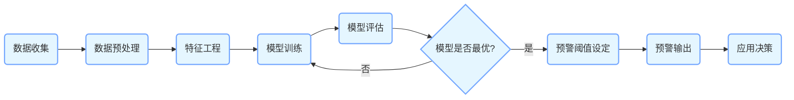

# AI驱动的企业信用风险早期预警系统

> 关键词：AI、企业信用风险、早期预警系统、机器学习、数据挖掘

> 摘要：本文聚焦于AI驱动的企业信用风险早期预警系统，全面阐述了该系统的背景、核心概念、算法原理、数学模型等内容。详细介绍了系统的具体操作步骤和项目实战案例，分析了其实际应用场景。同时推荐了相关的学习资源、开发工具和论文著作，最后总结了系统未来的发展趋势与挑战，并对常见问题进行了解答。旨在为企业和相关研究人员提供关于企业信用风险早期预警的全面技术参考。

## 1. 背景介绍 
### 1.1 目的和范围
企业信用风险是金融机构、供应链合作伙伴等面临的重要问题。传统的企业信用风险评估方法往往依赖于有限的财务指标和主观判断，难以对企业的信用状况进行全面、及时和准确的评估。AI驱动的企业信用风险早期预警系统旨在利用先进的人工智能技术，整合多源数据，实现对企业信用风险的早期识别和预警，为相关利益主体提供决策支持。

本系统的范围涵盖了从数据收集、预处理、特征工程、模型训练到预警输出的整个流程。涉及的数据包括企业财务数据、经营数据、市场数据、社交媒体数据等多维度信息，旨在构建一个全面、动态的企业信用风险评估体系。

### 1.2 预期读者
本文的预期读者包括金融机构的风险管理专业人员、企业的财务管理人员、供应链管理人员、从事人工智能和数据挖掘研究的科研人员以及对企业信用风险预警系统感兴趣的技术爱好者。

### 1.3 文档结构概述
本文首先介绍了AI驱动的企业信用风险早期预警系统的背景信息，包括目的、范围、预期读者和文档结构。接着阐述了系统的核心概念与联系，包括相关的原理和架构。然后详细讲解了核心算法原理和具体操作步骤，并给出了Python源代码示例。之后介绍了系统的数学模型和公式，并进行了详细讲解和举例说明。通过项目实战部分，展示了系统的实际开发过程和代码实现。分析了系统的实际应用场景，并推荐了相关的学习资源、开发工具和论文著作。最后总结了系统未来的发展趋势与挑战，解答了常见问题，并提供了扩展阅读和参考资料。

### 1.4 术语表
#### 1.4.1 核心术语定义
- **企业信用风险**：指企业在经营过程中，由于各种原因导致无法按时履行债务或合同义务，从而给债权人或合作伙伴带来损失的可能性。
- **早期预警系统**：通过对企业相关数据的监测和分析，在企业信用风险尚未完全暴露之前，及时发出警示信号的系统。
- **人工智能（AI）**：研究如何使计算机能够模拟人类的智能行为，包括学习、推理、决策等能力的技术领域。
- **机器学习**：人工智能的一个分支，通过让计算机从数据中自动学习模式和规律，从而实现预测和决策的技术。
- **数据挖掘**：从大量的数据中发现有价值的信息和知识的过程。

#### 1.4.2 相关概念解释
- **特征工程**：指从原始数据中提取和选择有意义的特征，以提高模型的性能和准确性的过程。
- **模型训练**：使用训练数据对机器学习模型进行参数调整，使其能够学习到数据中的模式和规律的过程。
- **模型评估**：使用测试数据对训练好的模型进行评估，以衡量模型的性能和准确性的过程。
- **预警阈值**：在预警系统中，用于判断是否发出预警信号的临界值。

#### 1.4.3 缩略词列表
- **AI**：Artificial Intelligence（人工智能）
- **ML**：Machine Learning（机器学习）
- **DM**：Data Mining（数据挖掘）
- **ROC**：Receiver Operating Characteristic（受试者工作特征曲线）
- **AUC**：Area Under the Curve（曲线下面积）

## 2. 核心概念与联系 

### 核心概念原理
AI驱动的企业信用风险早期预警系统的核心原理是利用人工智能技术对企业的多源数据进行分析和挖掘，提取与企业信用风险相关的特征，构建预测模型，通过对模型输出的评估和判断，实现对企业信用风险的早期预警。

系统主要涉及以下几个核心概念：
- **数据收集**：收集企业的多源数据，包括财务报表、经营数据、市场数据、社交媒体数据等。
- **数据预处理**：对收集到的数据进行清洗、转换和归一化等处理，以提高数据的质量和可用性。
- **特征工程**：从预处理后的数据中提取和选择有意义的特征，如财务比率、经营指标、市场情绪等。
- **模型训练**：使用机器学习算法，如逻辑回归、决策树、随机森林、神经网络等，对特征数据进行训练，构建预测模型。
- **模型评估**：使用测试数据对训练好的模型进行评估，选择性能最优的模型。
- **预警阈值设定**：根据模型的评估结果和业务需求，设定合理的预警阈值。
- **预警输出**：当模型预测的企业信用风险超过预警阈值时，系统发出预警信号。

### 架构的文本示意图
AI驱动的企业信用风险早期预警系统的架构可以分为以下几个层次：
- **数据层**：负责收集和存储企业的多源数据，包括结构化数据和非结构化数据。
- **处理层**：对数据层收集到的数据进行预处理和特征工程，提取和选择有意义的特征。
- **模型层**：使用机器学习算法对处理层提取的特征数据进行训练，构建预测模型。
- **评估层**：使用测试数据对模型层训练好的模型进行评估，选择性能最优的模型。
- **预警层**：根据评估层选择的模型和设定的预警阈值，对企业的信用风险进行实时监测和预警。
- **应用层**：将预警层的预警结果提供给相关的业务系统和用户，为决策提供支持。

### Mermaid流程图


## 3. 核心算法原理 & 具体操作步骤 

### 核心算法原理
在AI驱动的企业信用风险早期预警系统中，常用的机器学习算法包括逻辑回归、决策树、随机森林和神经网络等。下面分别介绍这些算法的原理：

#### 逻辑回归
逻辑回归是一种广义线性模型，用于解决二分类问题。它通过对输入特征进行线性组合，然后使用逻辑函数将线性组合的结果映射到[0, 1]区间，得到样本属于正类的概率。逻辑函数的表达式为：
$$
\sigma(z) = \frac{1}{1 + e^{-z}}
$$
其中，$z$ 是输入特征的线性组合，即 $z = \theta_0 + \theta_1x_1 + \theta_2x_2 + \cdots + \theta_nx_n$，$\theta_i$ 是模型的参数，$x_i$ 是输入特征。

逻辑回归的目标是通过最大化似然函数来估计模型的参数 $\theta$。似然函数的表达式为：
$$
L(\theta) = \prod_{i=1}^{m} [\sigma(z^{(i)})]^{y^{(i)}} [1 - \sigma(z^{(i)})]^{1 - y^{(i)}}
$$
其中，$m$ 是样本数量，$y^{(i)}$ 是第 $i$ 个样本的真实标签。

#### 决策树
决策树是一种基于树结构进行决策的模型。它通过对输入特征进行递归划分，将数据集划分为不同的子集，每个子集对应一个叶节点，叶节点上的类别标签即为该子集的预测结果。决策树的构建过程主要包括特征选择、树的生成和树的剪枝三个步骤。

特征选择的目的是选择最优的特征进行划分，常用的特征选择指标包括信息增益、信息增益比和基尼指数等。树的生成过程是递归地选择最优特征进行划分，直到满足停止条件为止。树的剪枝是为了防止过拟合，提高模型的泛化能力。

#### 随机森林
随机森林是一种集成学习方法，它通过组合多个决策树来提高模型的性能。随机森林的构建过程包括以下几个步骤：
1. 从原始数据集中有放回地随机抽取 $n$ 个样本，构成一个新的训练数据集。
2. 从所有特征中随机选择 $k$ 个特征，使用这 $k$ 个特征构建一个决策树。
3. 重复步骤1和步骤2，构建 $m$ 个决策树。
4. 对于新的样本，将 $m$ 个决策树的预测结果进行投票，选择票数最多的类别作为最终的预测结果。

#### 神经网络
神经网络是一种模仿人类神经系统的计算模型，它由多个神经元组成，通过神经元之间的连接和权重传递信息。神经网络的基本结构包括输入层、隐藏层和输出层。输入层接收输入特征，隐藏层对输入特征进行非线性变换，输出层输出预测结果。

神经网络的训练过程是通过反向传播算法来调整神经元之间的权重，使得模型的预测结果与真实标签之间的误差最小化。反向传播算法的基本思想是通过计算误差的梯度，将梯度从输出层反向传播到输入层，从而更新神经元之间的权重。

### 具体操作步骤
下面以Python为例，介绍使用逻辑回归算法构建企业信用风险早期预警模型的具体操作步骤：

```python
import pandas as pd
from sklearn.model_selection import train_test_split
from sklearn.linear_model import LogisticRegression
from sklearn.metrics import accuracy_score

# 步骤1：数据收集和预处理
# 假设已经将企业数据存储在CSV文件中
data = pd.read_csv('enterprise_data.csv')

# 分离特征和标签
X = data.drop('credit_risk', axis=1)
y = data['credit_risk']

# 划分训练集和测试集
X_train, X_test, y_train, y_test = train_test_split(X, y, test_size=0.2, random_state=42)

# 步骤2：模型训练
# 创建逻辑回归模型
model = LogisticRegression()

# 训练模型
model.fit(X_train, y_train)

# 步骤3：模型预测
# 在测试集上进行预测
y_pred = model.predict(X_test)

# 步骤4：模型评估
# 计算模型的准确率
accuracy = accuracy_score(y_test, y_pred)
print(f"模型的准确率: {accuracy}")
```

在上述代码中，首先使用 `pandas` 库读取企业数据，并将特征和标签分离。然后使用 `train_test_split` 函数将数据集划分为训练集和测试集。接着创建逻辑回归模型，并使用训练集对模型进行训练。最后在测试集上进行预测，并计算模型的准确率。

## 4. 数学模型和公式 & 详细讲解 & 举例说明 

### 逻辑回归的数学模型和公式
逻辑回归的数学模型可以表示为：
$$
P(y = 1 | x) = \sigma(\theta^T x) = \frac{1}{1 + e^{-\theta^T x}}
$$
其中，$P(y = 1 | x)$ 表示在输入特征 $x$ 的条件下，样本属于正类的概率，$\theta$ 是模型的参数，$\theta^T x$ 是输入特征的线性组合。

逻辑回归的损失函数通常使用对数损失函数，其表达式为：
$$
J(\theta) = -\frac{1}{m} \sum_{i=1}^{m} [y^{(i)} \log(\sigma(\theta^T x^{(i)})) + (1 - y^{(i)}) \log(1 - \sigma(\theta^T x^{(i)}))]
$$
其中，$m$ 是样本数量，$y^{(i)}$ 是第 $i$ 个样本的真实标签。

逻辑回归的目标是通过最小化损失函数 $J(\theta)$ 来估计模型的参数 $\theta$。常用的优化算法包括梯度下降法和牛顿法等。

### 详细讲解
逻辑回归的核心思想是通过对输入特征进行线性组合，然后使用逻辑函数将线性组合的结果映射到[0, 1]区间，得到样本属于正类的概率。逻辑函数具有良好的性质，它可以将任意实数映射到[0, 1]区间，并且在 $z = 0$ 处具有对称性。

对数损失函数是一种常用的损失函数，它可以衡量模型预测的概率与真实标签之间的差异。当样本属于正类时，对数损失函数的值随着模型预测的概率的增加而减小；当样本属于负类时，对数损失函数的值随着模型预测的概率的减小而减小。

梯度下降法是一种常用的优化算法，它通过不断地更新模型的参数 $\theta$，使得损失函数 $J(\theta)$ 逐渐减小。梯度下降法的更新公式为：
$$
\theta_j := \theta_j - \alpha \frac{\partial J(\theta)}{\partial \theta_j}
$$
其中，$\alpha$ 是学习率，控制每次更新的步长。

### 举例说明
假设我们有一个简单的二分类问题，输入特征为 $x_1$ 和 $x_2$，真实标签为 $y$。我们可以使用逻辑回归模型来预测样本属于正类的概率。

首先，我们需要收集训练数据，并将其划分为训练集和测试集。然后，使用训练集对逻辑回归模型进行训练，得到模型的参数 $\theta$。最后，在测试集上进行预测，并计算模型的准确率。

```python
import numpy as np
from sklearn.linear_model import LogisticRegression
from sklearn.metrics import accuracy_score

# 生成训练数据
X_train = np.array([[1, 2], [2, 3], [3, 4], [4, 5]])
y_train = np.array([0, 0, 1, 1])

# 生成测试数据
X_test = np.array([[5, 6], [6, 7]])
y_test = np.array([1, 1])

# 创建逻辑回归模型
model = LogisticRegression()

# 训练模型
model.fit(X_train, y_train)

# 在测试集上进行预测
y_pred = model.predict(X_test)

# 计算模型的准确率
accuracy = accuracy_score(y_test, y_pred)
print(f"模型的准确率: {accuracy}")
```

在上述代码中，我们首先生成了训练数据和测试数据。然后创建了逻辑回归模型，并使用训练集对模型进行训练。最后在测试集上进行预测，并计算模型的准确率。

## 5. 项目实战：代码实际案例和详细解释说明 

### 5.1  开发环境搭建
在进行项目实战之前，我们需要搭建开发环境。以下是具体的步骤：

#### 安装Python
首先，需要安装Python解释器。建议使用Python 3.7及以上版本。可以从Python官方网站（https://www.python.org/downloads/）下载适合自己操作系统的Python安装包，并按照安装向导进行安装。

#### 安装必要的库
在Python环境中，我们需要安装一些必要的库，如 `pandas`、`numpy`、`scikit-learn` 等。可以使用 `pip` 命令进行安装：
```sh
pip install pandas numpy scikit-learn
```

#### 准备数据
假设我们已经收集到了企业的信用风险数据，并将其存储在CSV文件中。我们可以使用 `pandas` 库来读取和处理数据。

### 5.2  源代码详细实现和代码解读
以下是一个完整的项目实战代码示例，使用随机森林算法构建企业信用风险早期预警模型：

```python
import pandas as pd
from sklearn.model_selection import train_test_split
from sklearn.ensemble import RandomForestClassifier
from sklearn.metrics import accuracy_score, confusion_matrix, classification_report

# 步骤1：数据读取和预处理
# 读取CSV文件
data = pd.read_csv('enterprise_credit_risk.csv')

# 分离特征和标签
X = data.drop('credit_risk', axis=1)
y = data['credit_risk']

# 划分训练集和测试集
X_train, X_test, y_train, y_test = train_test_split(X, y, test_size=0.2, random_state=42)

# 步骤2：模型训练
# 创建随机森林分类器
model = RandomForestClassifier(n_estimators=100, random_state=42)

# 训练模型
model.fit(X_train, y_train)

# 步骤3：模型预测
# 在测试集上进行预测
y_pred = model.predict(X_test)

# 步骤4：模型评估
# 计算准确率
accuracy = accuracy_score(y_test, y_pred)
print(f"模型的准确率: {accuracy}")

# 计算混淆矩阵
conf_matrix = confusion_matrix(y_test, y_pred)
print(f"混淆矩阵:\n{conf_matrix}")

# 生成分类报告
class_report = classification_report(y_test, y_pred)
print(f"分类报告:\n{class_report}")
```

### 代码解读与分析
#### 数据读取和预处理
- `pd.read_csv('enterprise_credit_risk.csv')`：使用 `pandas` 库的 `read_csv` 函数读取存储企业信用风险数据的CSV文件。
- `data.drop('credit_risk', axis=1)`：从数据集中删除 `credit_risk` 列，将其作为特征数据。
- `data['credit_risk']`：提取 `credit_risk` 列作为标签数据。
- `train_test_split(X, y, test_size=0.2, random_state=42)`：使用 `train_test_split` 函数将数据集划分为训练集和测试集，测试集占比为20%。

#### 模型训练
- `RandomForestClassifier(n_estimators=100, random_state=42)`：创建一个随机森林分类器，`n_estimators` 参数指定决策树的数量为100。
- `model.fit(X_train, y_train)`：使用训练集对随机森林分类器进行训练。

#### 模型预测
- `model.predict(X_test)`：在测试集上进行预测，得到预测结果。

#### 模型评估
- `accuracy_score(y_test, y_pred)`：计算模型的准确率，即预测正确的样本数占总样本数的比例。
- `confusion_matrix(y_test, y_pred)`：计算混淆矩阵，用于评估模型在不同类别上的预测性能。
- `classification_report(y_test, y_pred)`：生成分类报告，包含精确率、召回率、F1值等评估指标。

通过以上步骤，我们可以构建一个简单的企业信用风险早期预警模型，并对其性能进行评估。

## 6. 实际应用场景 
AI驱动的企业信用风险早期预警系统在多个领域具有广泛的应用场景，以下是一些常见的应用场景：

### 金融机构风险管理
金融机构如银行、证券、保险等在进行信贷审批、投资决策等业务时，需要对企业的信用风险进行评估。AI驱动的企业信用风险早期预警系统可以帮助金融机构整合多源数据，包括企业财务数据、经营数据、市场数据等，构建更加准确和全面的信用风险评估模型。通过对企业信用风险的早期预警，金融机构可以及时采取措施，如调整信贷额度、提高贷款利率、加强贷后管理等，降低信用风险损失。

### 供应链风险管理
在供应链中，企业之间存在着密切的业务往来和信用关系。一个企业的信用风险可能会波及到整个供应链，导致供应链中断、成本增加等问题。AI驱动的企业信用风险早期预警系统可以帮助供应链核心企业对其上下游企业的信用风险进行实时监测和预警。当发现某个供应商或客户的信用风险上升时，核心企业可以及时调整采购计划、寻找替代供应商或客户，降低供应链风险。

### 投资决策支持
投资者在进行股票、债券、基金等投资时，需要对企业的信用状况进行评估。AI驱动的企业信用风险早期预警系统可以为投资者提供企业信用风险的实时信息和预警信号。投资者可以根据系统的预警结果，调整投资组合，降低投资风险。同时，系统还可以帮助投资者发现潜在的投资机会，提高投资收益。

### 政府监管
政府部门在进行企业监管、产业政策制定等工作时，需要了解企业的信用状况。AI驱动的企业信用风险早期预警系统可以为政府部门提供企业信用风险的全面数据和分析报告。政府部门可以根据系统的预警结果，加强对高风险企业的监管，制定相应的产业政策，促进企业健康发展。

## 7. 工具和资源推荐
### 7.1 学习资源推荐
#### 7.1.1 书籍推荐
- 《机器学习》（周志华）：这本书是机器学习领域的经典教材，系统地介绍了机器学习的基本概念、算法和应用。
- 《深度学习》（Ian Goodfellow、Yoshua Bengio、Aaron Courville）：这本书是深度学习领域的权威著作，全面介绍了深度学习的理论和实践。
- 《Python数据分析实战》（Sebastian Raschka）：这本书通过实际案例介绍了使用Python进行数据分析的方法和技巧。

#### 7.1.2 在线课程
- Coursera上的“机器学习”课程（Andrew Ng）：这是一门非常经典的机器学习在线课程，由斯坦福大学的Andrew Ng教授授课。
- edX上的“深度学习”课程（DeepLearning.AI）：这是一门由DeepLearning.AI推出的深度学习在线课程，涵盖了深度学习的各个方面。
- 中国大学MOOC上的“Python语言程序设计”课程（嵩天）：这是一门适合初学者的Python编程在线课程，介绍了Python的基本语法和应用。

#### 7.1.3 技术博客和网站
- Medium：这是一个技术博客平台，上面有很多关于人工智能、机器学习、数据挖掘等领域的优秀文章。
- Towards Data Science：这是一个专注于数据科学和机器学习的技术博客，提供了很多实用的技术文章和案例。
- Kaggle：这是一个数据科学竞赛平台，上面有很多公开的数据集和优秀的解决方案，可以学习到很多实际应用中的技巧和方法。

### 7.2 开发工具框架推荐
#### 7.2.1 IDE和编辑器
- PyCharm：这是一款专业的Python集成开发环境，提供了丰富的功能和插件，适合开发大型的Python项目。
- Jupyter Notebook：这是一个交互式的开发环境，适合进行数据分析和模型实验。
- Visual Studio Code：这是一款轻量级的代码编辑器，支持多种编程语言，安装相关插件后可以进行Python开发。

#### 7.2.2 调试和性能分析工具
- Py-Spy：这是一个用于Python程序性能分析的工具，可以帮助开发者找出程序中的性能瓶颈。
- PDB：这是Python自带的调试器，可以帮助开发者调试程序中的错误。
- TensorBoard：这是TensorFlow提供的一个可视化工具，可以帮助开发者可视化模型的训练过程和性能指标。

#### 7.2.3 相关框架和库
- Scikit-learn：这是一个常用的机器学习库，提供了丰富的机器学习算法和工具，适合初学者和快速开发。
- TensorFlow：这是一个开源的深度学习框架，由Google开发，提供了强大的深度学习模型构建和训练功能。
- PyTorch：这是一个另一个流行的深度学习框架，由Facebook开发，具有动态图的特点，适合研究和开发。

### 7.3 相关论文著作推荐
#### 7.3.1 经典论文
- 《A Decision-Theoretic Generalization of On-Line Learning and an Application to Boosting》（Yoav Freund、Robert E. Schapire）：这篇论文提出了AdaBoost算法，是集成学习领域的经典论文。
- 《Gradient-Based Learning Applied to Document Recognition》（Yann LeCun、Léon Bottou、Yoshua Bengio、Patrick Haffner）：这篇论文介绍了卷积神经网络（CNN）在手写数字识别中的应用，是深度学习领域的经典论文。
- 《Long Short-Term Memory》（Sepp Hochreiter、Jürgen Schmidhuber）：这篇论文提出了长短期记忆网络（LSTM），解决了循环神经网络（RNN）中的梯度消失问题。

#### 7.3.2 最新研究成果
- 可以关注顶级学术会议如NeurIPS、ICML、CVPR等的论文，了解人工智能和机器学习领域的最新研究成果。
- 也可以关注顶级学术期刊如Journal of Machine Learning Research（JMLR）、Artificial Intelligence等的论文。

#### 7.3.3 应用案例分析
- 《应用机器学习：企业级数据科学实战》（Ben Lorica、Aurélien Géron）：这本书通过实际案例介绍了机器学习在企业中的应用。
- Kaggle上的优秀解决方案也可以作为应用案例进行学习和分析。

## 8. 总结：未来发展趋势与挑战
### 未来发展趋势
#### 多模态数据融合
未来的企业信用风险早期预警系统将不仅仅依赖于传统的财务数据，还会融合更多的多模态数据，如企业的社交媒体数据、物联网数据、卫星图像数据等。通过多模态数据的融合，可以更全面地了解企业的经营状况和信用风险。

#### 深度学习技术的广泛应用
深度学习技术在图像识别、自然语言处理等领域取得了巨大的成功。未来，深度学习技术将在企业信用风险早期预警系统中得到更广泛的应用。例如，使用卷积神经网络（CNN）对企业的财务报表图像进行分析，使用循环神经网络（RNN）对企业的时间序列数据进行建模。

#### 实时监测和动态预警
随着信息技术的发展，企业的经营状况和信用风险变化越来越快。未来的企业信用风险早期预警系统将实现实时监测和动态预警，能够及时发现企业信用风险的变化，并发出预警信号。

#### 可解释性和透明度
随着人工智能技术在金融领域的广泛应用，模型的可解释性和透明度变得越来越重要。未来的企业信用风险早期预警系统将更加注重模型的可解释性，能够向用户解释模型的决策过程和依据。

### 挑战
#### 数据质量和数据安全
企业信用风险早期预警系统需要大量的高质量数据作为支撑。然而，现实中数据的质量往往参差不齐，存在数据缺失、数据错误、数据不一致等问题。同时，企业的数据往往涉及到商业机密和个人隐私，数据安全也是一个重要的挑战。

#### 模型的泛化能力
由于企业的经营环境和信用风险具有复杂性和多样性，模型的泛化能力是一个重要的挑战。如何构建具有良好泛化能力的模型，能够在不同的数据集和场景下都具有较好的性能，是需要解决的问题。

#### 法律法规和监管要求
人工智能技术在金融领域的应用受到法律法规和监管要求的严格限制。如何确保企业信用风险早期预警系统的开发和应用符合相关的法律法规和监管要求，是需要面对的挑战。

#### 人才短缺
人工智能和数据科学领域的人才短缺是一个全球性的问题。企业信用风险早期预警系统的开发和维护需要具备人工智能、机器学习、数据挖掘等多方面知识的专业人才。如何培养和吸引这些专业人才，是企业面临的挑战之一。

## 9. 附录：常见问题与解答
### 问题1：如何选择合适的机器学习算法？
解答：选择合适的机器学习算法需要考虑多个因素，如数据的类型和规模、问题的复杂度、模型的可解释性等。一般来说，如果数据量较小，可以选择逻辑回归、决策树等简单的算法；如果数据量较大，可以选择随机森林、神经网络等复杂的算法。同时，如果需要模型具有较好的可解释性，可以选择逻辑回归、决策树等算法；如果对模型的性能要求较高，可以选择随机森林、神经网络等算法。

### 问题2：如何处理数据中的缺失值和异常值？
解答：处理数据中的缺失值和异常值是数据预处理的重要步骤。对于缺失值，可以采用删除缺失值、填充缺失值等方法。填充缺失值的方法包括均值填充、中位数填充、众数填充等。对于异常值，可以采用删除异常值、替换异常值等方法。替换异常值的方法包括使用均值、中位数、众数等统计量进行替换。

### 问题3：如何评估模型的性能？
解答：评估模型的性能可以使用多种指标，如准确率、精确率、召回率、F1值、ROC曲线、AUC值等。不同的指标适用于不同的问题和场景。例如，在二分类问题中，如果正负样本的比例较为均衡，可以使用准确率来评估模型的性能；如果正负样本的比例不均衡，可以使用精确率、召回率、F1值等指标来评估模型的性能。

### 问题4：如何提高模型的性能？
解答：提高模型的性能可以从多个方面入手，如数据预处理、特征工程、模型选择和调优、集成学习等。在数据预处理阶段，可以处理数据中的缺失值和异常值，进行数据归一化和标准化等操作。在特征工程阶段，可以提取和选择有意义的特征，进行特征组合和变换等操作。在模型选择和调优阶段，可以选择合适的机器学习算法，并对模型的参数进行调优。在集成学习阶段，可以将多个模型进行组合，提高模型的性能。

## 10. 扩展阅读 & 参考资料
### 扩展阅读
- 《人工智能：现代方法》（Stuart Russell、Peter Norvig）：这本书是人工智能领域的经典教材，全面介绍了人工智能的理论和方法。
- 《数据挖掘：概念与技术》（Jiawei Han、Jian Pei、Jianwen Yin）：这本书是数据挖掘领域的经典教材，系统地介绍了数据挖掘的基本概念、算法和应用。
- 《Python机器学习实战》（Sebastian Raschka）：这本书通过实际案例介绍了使用Python进行机器学习的方法和技巧。

### 参考资料
- Scikit-learn官方文档（https://scikit-learn.org/stable/documentation.html）
- TensorFlow官方文档（https://www.tensorflow.org/api_docs）
- PyTorch官方文档（https://pytorch.org/docs/stable/index.html）

作者：AI天才研究院/AI Genius Institute & 禅与计算机程序设计艺术 /Zen And The Art of Computer Programming