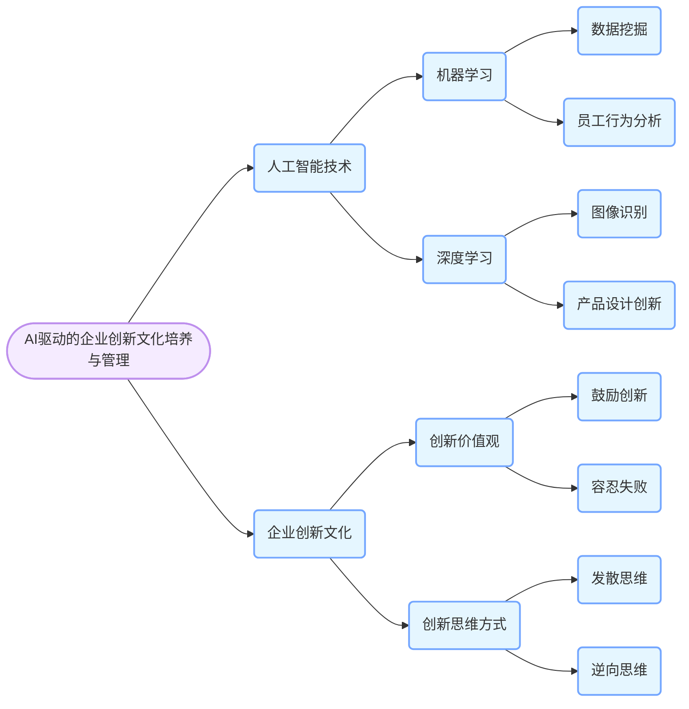

# AI驱动的企业创新文化培养与管理

> 关键词：AI、企业创新文化、培养、管理、人工智能应用

> 摘要：本文聚焦于AI驱动下企业创新文化的培养与管理。随着人工智能技术的飞速发展，其对企业的各个层面产生了深远影响，尤其在创新文化建设方面。文章深入分析了AI在企业创新文化中的核心概念、算法原理、数学模型等理论基础，通过项目实战案例展示了如何具体实施。同时探讨了AI驱动的企业创新文化的实际应用场景，推荐了相关学习资源、开发工具和论文著作。最后总结了未来发展趋势与挑战，并提供常见问题解答及扩展阅读参考资料，旨在为企业在AI时代构建和管理创新文化提供全面而深入的指导。

## 1. 背景介绍 
### 1.1 目的和范围
在当今数字化时代，人工智能（AI）技术正以前所未有的速度改变着企业的运营模式和市场竞争格局。企业要想在激烈的市场竞争中脱颖而出，就必须不断创新。而创新文化作为企业创新的内在驱动力，对于企业的可持续发展至关重要。本文的目的在于探讨如何利用AI技术来培养和管理企业的创新文化，涵盖了从理论基础到实际应用的多个方面，包括核心概念的阐述、算法原理的分析、项目实战案例的讲解以及未来发展趋势的展望等。

### 1.2 预期读者
本文的预期读者主要包括企业管理者、创业者、技术研发人员以及对企业创新文化和人工智能应用感兴趣的研究人员。企业管理者可以从中获取关于如何利用AI推动企业创新文化建设的策略和方法；创业者可以借鉴相关经验，在创业初期就注重创新文化的培养；技术研发人员可以了解AI在企业创新文化中的具体应用场景和技术实现方式；研究人员则可以将本文作为进一步深入研究的参考资料。

### 1.3 文档结构概述
本文首先介绍了与AI驱动的企业创新文化培养与管理相关的背景信息，包括目的、预期读者和文档结构。接着阐述了核心概念与联系，通过文本示意图和Mermaid流程图展示其原理和架构。然后详细讲解了核心算法原理和具体操作步骤，并给出Python源代码示例。之后介绍了相关的数学模型和公式，并举例说明。再通过项目实战案例，展示了开发环境搭建、源代码实现和代码解读。随后探讨了实际应用场景，推荐了相关的工具和资源。最后总结了未来发展趋势与挑战，提供了常见问题解答和扩展阅读参考资料。

### 1.4 术语表
#### 1.4.1 核心术语定义
- **人工智能（AI）**：是指计算机系统能够执行通常需要人类智能才能完成的任务，如学习、推理、解决问题、感知和语言理解等。
- **企业创新文化**：是指企业在长期的发展过程中形成的，鼓励创新、支持冒险、容忍失败的文化氛围和价值观念，它能够激发员工的创新意识和创造力，促进企业的创新活动。
- **创新文化培养**：是指通过一系列的措施和方法，在企业内部营造有利于创新的文化环境，提高员工的创新能力和创新积极性。
- **创新文化管理**：是指对企业创新文化的建设、维护和发展进行有效的规划、组织、协调和控制，以确保创新文化能够持续发挥作用，推动企业的创新发展。

#### 1.4.2 相关概念解释
- **机器学习**：是人工智能的一个重要分支，它让计算机通过数据学习模式和规律，从而做出预测和决策。在企业创新文化中，机器学习可以用于分析员工的行为数据，发现潜在的创新机会。
- **深度学习**：是一种基于人工神经网络的机器学习技术，它能够自动从大量数据中提取特征和模式，具有很强的学习能力和泛化能力。在企业创新文化中，深度学习可以用于图像识别、自然语言处理等领域，为创新提供支持。
- **大数据**：是指海量的数据集合，其特点是数据量大、类型多样、产生速度快。在企业创新文化中，大数据可以用于收集和分析员工的创新行为数据、市场需求数据等，为创新决策提供依据。

#### 1.4.3 缩略词列表
- **AI**：Artificial Intelligence（人工智能）
- **ML**：Machine Learning（机器学习）
- **DL**：Deep Learning（深度学习）
- **NLP**：Natural Language Processing（自然语言处理）

## 2. 核心概念与联系 
### 核心概念原理
AI驱动的企业创新文化培养与管理涉及到多个核心概念，它们相互关联、相互影响，共同构成了一个复杂的系统。

人工智能是这个系统的核心驱动力，它通过各种技术手段，如机器学习、深度学习、自然语言处理等，为企业创新文化的培养和管理提供支持。例如，机器学习可以用于分析员工的创新行为数据，发现潜在的创新机会；深度学习可以用于图像识别、自然语言处理等领域，为创新提供支持；自然语言处理可以用于智能客服、知识管理等方面，提高企业的创新效率。

企业创新文化是企业创新的内在驱动力，它包括创新价值观、创新思维方式、创新行为习惯等方面。创新价值观是企业创新文化的核心，它决定了企业对创新的态度和重视程度；创新思维方式是企业创新的关键，它影响着员工的创新能力和创新效率；创新行为习惯是企业创新的保障，它能够促进员工的创新行为的持续发生。

创新文化培养和管理是实现企业创新文化建设目标的重要手段。创新文化培养是指通过一系列的措施和方法，在企业内部营造有利于创新的文化环境，提高员工的创新能力和创新积极性；创新文化管理是指对企业创新文化的建设、维护和发展进行有效的规划、组织、协调和控制，以确保创新文化能够持续发挥作用，推动企业的创新发展。

### 架构的文本示意图
```plaintext
                            AI驱动的企业创新文化培养与管理
                                       |
               ---------------------------------------------
               |                                           |
            人工智能技术                             企业创新文化
               |                                           |
  -----------------------                     -----------------------
  |                     |                     |                     |
机器学习              深度学习              创新价值观              创新思维方式
  |                     |                     |                     |
数据挖掘              图像识别              鼓励创新              发散思维
  |                     |                     |                     |
员工行为分析          产品设计创新          容忍失败              逆向思维
```

### Mermaid流程图


## 3. 核心算法原理 & 具体操作步骤 
### 核心算法原理
在AI驱动的企业创新文化培养与管理中，常用的核心算法包括聚类算法、关联规则挖掘算法和预测算法等。

#### 聚类算法
聚类算法是一种无监督学习算法，它将数据集中的数据对象划分为不同的簇，使得同一簇内的数据对象具有较高的相似度，而不同簇内的数据对象具有较高的差异性。在企业创新文化中，聚类算法可以用于对员工的创新行为数据进行分析，将员工分为不同的创新群体，以便企业针对不同群体采取不同的创新激励措施。

以下是一个使用Python实现的K-Means聚类算法示例：
```python
import numpy as np
from sklearn.cluster import KMeans
import matplotlib.pyplot as plt

# 生成示例数据
X = np.array([[1, 2], [1, 4], [1, 0],
              [4, 2], [4, 4], [4, 0]])

# 创建K-Means聚类模型
kmeans = KMeans(n_clusters=2, random_state=0).fit(X)

# 获取聚类标签
labels = kmeans.labels_

# 获取聚类中心
centroids = kmeans.cluster_centers_

# 绘制聚类结果
plt.scatter(X[:, 0], X[:, 1], c=labels, cmap='viridis')
plt.scatter(centroids[:, 0], centroids[:, 1], marker='X', s=200, c='red')
plt.show()
```
#### 关联规则挖掘算法
关联规则挖掘算法是一种数据挖掘算法，它用于发现数据集中不同数据项之间的关联关系。在企业创新文化中，关联规则挖掘算法可以用于分析员工的创新行为数据，发现员工的创新行为之间的关联关系，以便企业更好地了解员工的创新模式和需求。

以下是一个使用Python实现的Apriori关联规则挖掘算法示例：
```python
from mlxtend.preprocessing import TransactionEncoder
from mlxtend.frequent_patterns import apriori, association_rules
import pandas as pd

# 示例交易数据
dataset = [['牛奶', '面包', '尿布'],
           ['可乐', '面包', '尿布', '啤酒'],
           ['牛奶', '尿布', '啤酒', '鸡蛋'],
           ['面包', '牛奶', '尿布', '啤酒'],
           ['面包', '牛奶', '尿布', '可乐']]

# 数据编码
te = TransactionEncoder()
te_ary = te.fit(dataset).transform(dataset)
df = pd.DataFrame(te_ary, columns=te.columns_)

# 挖掘频繁项集
frequent_itemsets = apriori(df, min_support=0.4, use_colnames=True)

# 生成关联规则
rules = association_rules(frequent_itemsets, metric="confidence", min_threshold=0.7)

print(rules)
```
#### 预测算法
预测算法是一种有监督学习算法，它用于根据历史数据预测未来的趋势和结果。在企业创新文化中，预测算法可以用于预测员工的创新绩效、市场需求等，以便企业提前做好创新规划和决策。

以下是一个使用Python实现的线性回归预测算法示例：
```python
import numpy as np
from sklearn.linear_model import LinearRegression
import matplotlib.pyplot as plt

# 生成示例数据
X = np.array([1, 2, 3, 4, 5]).reshape(-1, 1)
y = np.array([2, 4, 6, 8, 10])

# 创建线性回归模型
model = LinearRegression()
model.fit(X, y)

# 预测新数据
new_X = np.array([6]).reshape(-1, 1)
predicted_y = model.predict(new_X)

# 绘制数据和预测结果
plt.scatter(X, y)
plt.plot(X, model.predict(X), color='red')
plt.scatter(new_X, predicted_y, color='green')
plt.show()
```

### 具体操作步骤
#### 数据收集
首先，企业需要收集与创新文化相关的数据，包括员工的创新行为数据、创新成果数据、市场需求数据等。数据收集的方式可以包括问卷调查、日志记录、系统监测等。

#### 数据预处理
收集到的数据可能存在噪声、缺失值等问题，需要进行数据预处理。数据预处理的步骤包括数据清洗、数据集成、数据变换和数据归约等。

#### 算法选择和模型训练
根据数据的特点和分析的目的，选择合适的算法进行模型训练。例如，如果要对员工进行聚类分析，可以选择K-Means聚类算法；如果要挖掘员工创新行为之间的关联关系，可以选择Apriori关联规则挖掘算法；如果要预测员工的创新绩效，可以选择线性回归预测算法。

#### 模型评估和优化
使用评估指标对训练好的模型进行评估，如准确率、召回率、F1值等。如果模型的性能不理想，需要对模型进行优化，如调整算法参数、增加训练数据等。

#### 结果应用
将训练好的模型应用到实际的企业创新文化培养和管理中，如根据聚类结果对员工进行分类管理、根据关联规则发现创新机会、根据预测结果制定创新策略等。

## 4. 数学模型和公式 & 详细讲解 & 举例说明 
### 聚类算法的数学模型和公式
#### K-Means聚类算法
K-Means聚类算法的目标是将数据集 $X = \{x_1, x_2,..., x_n\}$ 划分为 $k$ 个簇 $C = \{C_1, C_2,..., C_k\}$，使得簇内误差平方和（SSE）最小。SSE的计算公式为：
$$SSE = \sum_{i=1}^{k} \sum_{x_j \in C_i} ||x_j - \mu_i||^2$$
其中，$\mu_i$ 是簇 $C_i$ 的质心，$||x_j - \mu_i||$ 是样本 $x_j$ 到质心 $\mu_i$ 的欧几里得距离。

K-Means聚类算法的具体步骤如下：
1. 随机选择 $k$ 个样本作为初始质心。
2. 将每个样本分配到距离最近的质心所在的簇。
3. 重新计算每个簇的质心。
4. 重复步骤2和3，直到质心不再发生变化或达到最大迭代次数。

### 关联规则挖掘算法的数学模型和公式
#### Apriori关联规则挖掘算法
Apriori关联规则挖掘算法的核心是频繁项集的挖掘。频繁项集是指支持度大于等于最小支持度阈值的项集。支持度的计算公式为：
$$Support(X) = \frac{count(X)}{N}$$
其中，$count(X)$ 是项集 $X$ 在数据集中出现的次数，$N$ 是数据集的总记录数。

关联规则是指形如 $X \rightarrow Y$ 的规则，其中 $X$ 和 $Y$ 是项集，且 $X \cap Y = \varnothing$。关联规则的置信度计算公式为：
$$Confidence(X \rightarrow Y) = \frac{Support(X \cup Y)}{Support(X)}$$
置信度表示在包含项集 $X$ 的记录中，同时包含项集 $Y$ 的比例。

Apriori关联规则挖掘算法的具体步骤如下：
1. 生成所有的1-项集，并计算它们的支持度。
2. 筛选出支持度大于等于最小支持度阈值的1-项集，作为频繁1-项集。
3. 由频繁 $k$-项集生成候选 $(k+1)$-项集。
4. 计算候选 $(k+1)$-项集的支持度，筛选出支持度大于等于最小支持度阈值的 $(k+1)$-项集，作为频繁 $(k+1)$-项集。
5. 重复步骤3和4，直到无法生成更大的频繁项集。
6. 由频繁项集生成关联规则，并计算它们的置信度。
7. 筛选出置信度大于等于最小置信度阈值的关联规则，作为最终的关联规则。

### 预测算法的数学模型和公式
#### 线性回归预测算法
线性回归预测算法的目标是找到一个线性函数 $y = \theta_0 + \theta_1x_1 + \theta_2x_2 +... + \theta_nx_n$，使得预测值 $\hat{y}$ 与真实值 $y$ 之间的误差平方和最小。误差平方和的计算公式为：
$$J(\theta) = \frac{1}{2m} \sum_{i=1}^{m} (h_{\theta}(x^{(i)}) - y^{(i)})^2$$
其中，$m$ 是样本数量，$h_{\theta}(x^{(i)})$ 是第 $i$ 个样本的预测值，$y^{(i)}$ 是第 $i$ 个样本的真实值。

为了最小化误差平方和 $J(\theta)$，可以使用梯度下降算法来更新参数 $\theta$。梯度下降算法的更新公式为：
$$\theta_j := \theta_j - \alpha \frac{\partial J(\theta)}{\partial \theta_j}$$
其中，$\alpha$ 是学习率，$\frac{\partial J(\theta)}{\partial \theta_j}$ 是 $J(\theta)$ 关于 $\theta_j$ 的偏导数。

### 举例说明
#### 聚类算法举例
假设企业收集了员工的创新行为数据，包括员工的创新提案数量、创新成果数量和创新参与度等指标。使用K-Means聚类算法将员工分为3个簇，结果如下：
| 簇编号 | 创新提案数量 | 创新成果数量 | 创新参与度 |
| ---- | ---- | ---- | ---- |
| 1 | 高 | 高 | 高 |
| 2 | 中 | 中 | 中 |
| 3 | 低 | 低 | 低 |

企业可以根据聚类结果，对不同簇的员工采取不同的创新激励措施，如对簇1的员工给予更多的资源支持和奖励，对簇3的员工进行培训和辅导，提高他们的创新能力和积极性。

#### 关联规则挖掘算法举例
假设企业分析了员工的创新行为数据，发现了以下关联规则：
| 关联规则 | 支持度 | 置信度 |
| ---- | ---- | ---- |
| 创新提案数量高 -> 创新成果数量高 | 0.6 | 0.8 |
| 创新参与度高 -> 创新提案数量高 | 0.5 | 0.7 |

企业可以根据这些关联规则，采取相应的措施来促进员工的创新行为。例如，通过提高员工的创新参与度，来增加员工的创新提案数量；通过支持员工提出更多的创新提案，来提高员工的创新成果数量。

#### 预测算法举例
假设企业收集了员工的历史创新绩效数据，包括员工的工作年限、学历、创新培训次数等特征，以及员工的创新绩效得分。使用线性回归预测算法建立预测模型，预测员工的未来创新绩效。根据预测结果，企业可以提前做好创新规划和决策，如为创新绩效预测较高的员工分配更多的创新任务，为创新绩效预测较低的员工提供更多的培训和支持。

## 5. 项目实战：代码实际案例和详细解释说明 
### 5.1  开发环境搭建
#### 安装Python
首先，需要安装Python编程语言。可以从Python官方网站（https://www.python.org/downloads/） 下载适合自己操作系统的Python安装包，并按照安装向导进行安装。

#### 安装必要的库
在项目中，需要使用一些Python库来实现AI算法和数据处理。可以使用pip命令来安装这些库，例如：
```bash
pip install numpy pandas scikit-learn matplotlib mlxtend
```
### 5.2  源代码详细实现和代码解读
#### 数据收集和预处理
以下是一个简单的数据收集和预处理的示例代码：
```python
import pandas as pd
from sklearn.preprocessing import StandardScaler

# 读取数据
data = pd.read_csv('innovation_data.csv')

# 提取特征和标签
X = data.drop('innovation_score', axis=1)
y = data['innovation_score']

# 数据标准化
scaler = StandardScaler()
X_scaled = scaler.fit_transform(X)
```
代码解读：
1. 使用`pandas`库的`read_csv`函数读取创新数据文件。
2. 使用`drop`方法提取特征数据`X`，并使用`[]`操作符提取标签数据`y`。
3. 使用`StandardScaler`类对特征数据进行标准化处理，使得特征数据具有零均值和单位方差。

#### 聚类分析
以下是一个使用K-Means聚类算法进行聚类分析的示例代码：
```python
from sklearn.cluster import KMeans
import matplotlib.pyplot as plt

# 创建K-Means聚类模型
kmeans = KMeans(n_clusters=3, random_state=0)

# 进行聚类分析
labels = kmeans.fit_predict(X_scaled)

# 绘制聚类结果
plt.scatter(X_scaled[:, 0], X_scaled[:, 1], c=labels, cmap='viridis')
plt.scatter(kmeans.cluster_centers_[:, 0], kmeans.cluster_centers_[:, 1], marker='X', s=200, c='red')
plt.show()
```
代码解读：
1. 使用`KMeans`类创建一个K-Means聚类模型，指定簇的数量为3。
2. 使用`fit_predict`方法对标准化后的特征数据进行聚类分析，并返回每个样本的聚类标签。
3. 使用`matplotlib`库的`scatter`函数绘制聚类结果，不同颜色的点表示不同的簇，红色的`X`表示簇的质心。

#### 关联规则挖掘
以下是一个使用Apriori关联规则挖掘算法进行关联规则挖掘的示例代码：
```python
from mlxtend.preprocessing import TransactionEncoder
from mlxtend.frequent_patterns import apriori, association_rules

# 示例交易数据
transactions = [['创新提案1', '创新成果1', '创新参与活动1'],
                ['创新提案2', '创新成果2', '创新参与活动2'],
                ['创新提案1', '创新成果2', '创新参与活动3']]

# 数据编码
te = TransactionEncoder()
te_ary = te.fit(transactions).transform(transactions)
df = pd.DataFrame(te_ary, columns=te.columns_)

# 挖掘频繁项集
frequent_itemsets = apriori(df, min_support=0.5, use_colnames=True)

# 生成关联规则
rules = association_rules(frequent_itemsets, metric="confidence", min_threshold=0.7)

print(rules)
```
代码解读：
1. 定义示例交易数据，每个交易记录包含一些创新相关的项目。
2. 使用`TransactionEncoder`类对交易数据进行编码，将其转换为布尔矩阵。
3. 使用`apriori`函数挖掘频繁项集，指定最小支持度阈值为0.5。
4. 使用`association_rules`函数生成关联规则，指定置信度阈值为0.7。
5. 打印生成的关联规则。

#### 预测分析
以下是一个使用线性回归预测算法进行预测分析的示例代码：
```python
from sklearn.model_selection import train_test_split
from sklearn.linear_model import LinearRegression
from sklearn.metrics import mean_squared_error

# 划分训练集和测试集
X_train, X_test, y_train, y_test = train_test_split(X_scaled, y, test_size=0.2, random_state=0)

# 创建线性回归模型
model = LinearRegression()

# 训练模型
model.fit(X_train, y_train)

# 进行预测
y_pred = model.predict(X_test)

# 计算均方误差
mse = mean_squared_error(y_test, y_pred)
print(f"均方误差: {mse}")
```
代码解读：
1. 使用`train_test_split`函数将标准化后的特征数据和标签数据划分为训练集和测试集，测试集占比为20%。
2. 使用`LinearRegression`类创建一个线性回归模型。
3. 使用`fit`方法对训练集数据进行训练。
4. 使用`predict`方法对测试集数据进行预测。
5. 使用`mean_squared_error`函数计算预测值和真实值之间的均方误差，并打印结果。

### 5.3  代码解读与分析
#### 数据预处理的重要性
数据预处理是AI项目中非常重要的一步，它可以提高数据的质量和可用性，从而提高模型的性能。在本项目中，使用`StandardScaler`类对特征数据进行标准化处理，使得特征数据具有零均值和单位方差，这样可以避免某些特征因为数值范围过大而对模型产生过大的影响。

#### 聚类分析的应用
聚类分析可以将员工分为不同的创新群体，企业可以根据不同群体的特点采取不同的创新激励措施。在本项目中，使用K-Means聚类算法将员工分为3个簇，通过可视化聚类结果，可以直观地了解不同簇的分布情况。

#### 关联规则挖掘的应用
关联规则挖掘可以发现员工的创新行为之间的关联关系，企业可以根据这些关联关系采取相应的措施来促进员工的创新行为。在本项目中，使用Apriori关联规则挖掘算法发现了一些关联规则，如创新提案数量高与创新成果数量高之间的关联关系。

#### 预测分析的应用
预测分析可以根据历史数据预测未来的趋势和结果，企业可以根据预测结果提前做好创新规划和决策。在本项目中，使用线性回归预测算法建立了预测模型，通过计算均方误差评估了模型的性能。

## 6. 实际应用场景 
### 员工创新能力评估与发展
通过收集员工的创新行为数据，如创新提案数量、创新成果数量、创新参与度等，使用AI算法进行分析和建模，可以对员工的创新能力进行评估。根据评估结果，企业可以为员工制定个性化的创新发展计划，如提供针对性的培训课程、分配合适的创新任务等，帮助员工提升创新能力。

### 创新项目筛选与管理
在企业面临多个创新项目时，使用AI算法可以对项目的可行性、潜在价值、风险等进行评估和预测。通过分析项目的相关数据，如市场需求、技术难度、成本预算等，为企业筛选出最有潜力的创新项目。同时，在项目实施过程中，使用AI技术对项目的进度、质量、成本等进行监控和管理，及时发现问题并采取措施解决，提高项目的成功率。

### 创新文化氛围营造
利用AI技术可以分析员工的沟通交流数据、团队协作数据等，了解企业内部的创新文化氛围。例如，通过分析员工在社交媒体、内部论坛等平台上的发言，了解员工对创新的态度和看法；通过分析团队协作数据，了解团队之间的沟通效率和协作效果。根据分析结果，企业可以采取相应的措施来营造良好的创新文化氛围，如组织创新活动、建立创新奖励机制等。

### 市场趋势预测与创新决策
AI算法可以对市场数据、行业动态等进行分析和预测，帮助企业了解市场趋势和客户需求。通过分析大量的市场数据，如消费者购买行为、竞争对手动态等，企业可以发现潜在的市场机会和创新点。根据市场趋势预测结果，企业可以做出更加明智的创新决策，如调整产品研发方向、推出新的服务模式等。

## 7. 工具和资源推荐
### 7.1 学习资源推荐
#### 7.1.1 书籍推荐
- 《人工智能：一种现代的方法》（Artificial Intelligence: A Modern Approach）：这是一本经典的人工智能教材，涵盖了人工智能的各个领域，包括搜索算法、知识表示、机器学习、自然语言处理等。
- 《Python机器学习》（Python Machine Learning）：本书介绍了如何使用Python进行机器学习，包括数据预处理、模型选择、评估和优化等内容，适合初学者学习。
- 《深度学习》（Deep Learning）：由深度学习领域的三位先驱Ian Goodfellow、Yoshua Bengio和Aaron Courville撰写，系统地介绍了深度学习的理论和实践。

#### 7.1.2 在线课程
- Coursera平台上的“机器学习”课程（Machine Learning）：由斯坦福大学教授Andrew Ng授课，是一门非常受欢迎的机器学习入门课程。
- edX平台上的“人工智能导论”课程（Introduction to Artificial Intelligence）：由麻省理工学院教授Patrick Winston授课，介绍了人工智能的基本概念和方法。
- 阿里云天池平台上的“AI训练营”：提供了丰富的人工智能实践项目和课程，适合有一定基础的学习者提高实践能力。

#### 7.1.3 技术博客和网站
- Medium：是一个知名的技术博客平台，上面有很多关于人工智能、机器学习、深度学习等领域的优秀文章。
- Towards Data Science：专注于数据科学和人工智能领域的技术博客，提供了很多实用的技术教程和案例分析。
- Kaggle：是一个数据科学竞赛平台，上面有很多公开的数据集和优秀的解决方案，可以学习到很多先进的数据分析和机器学习技术。

### 7.2 开发工具框架推荐
#### 7.2.1 IDE和编辑器
- PyCharm：是一款专门为Python开发设计的集成开发环境（IDE），提供了丰富的功能和插件，适合开发大型Python项目。
- Jupyter Notebook：是一个交互式的开发环境，支持多种编程语言，尤其适合数据科学和机器学习的开发和实验。
- Visual Studio Code：是一款轻量级的代码编辑器，支持多种编程语言和插件，具有良好的扩展性和易用性。

#### 7.2.2 调试和性能分析工具
- TensorBoard：是TensorFlow提供的一个可视化工具，可以用于可视化模型的训练过程、性能指标等，帮助开发者调试和优化模型。
- Py-Spy：是一个Python性能分析工具，可以用于分析Python程序的性能瓶颈，找出性能问题所在。
- cProfile：是Python标准库中的一个性能分析模块，可以用于分析Python程序的函数调用时间和调用次数，帮助开发者优化代码性能。

#### 7.2.3 相关框架和库
- TensorFlow：是Google开发的一个开源机器学习框架，提供了丰富的工具和接口，支持深度学习、机器学习等多种任务。
- PyTorch：是Facebook开发的一个开源深度学习框架，具有动态图的特点，易于使用和调试，受到了很多研究者和开发者的喜爱。
- Scikit-learn：是一个简单易用的机器学习库，提供了多种机器学习算法和工具，适合初学者和快速开发。

### 7.3 相关论文著作推荐
#### 7.3.1 经典论文
- 《A Logical Calculus of the Ideas Immanent in Nervous Activity》：由Warren McCulloch和Walter Pitts在1943年发表，提出了人工神经网络的概念，为人工智能的发展奠定了基础。
- 《Perceptrons: An Introduction to Computational Geometry》：由Frank Rosenblatt在1962年发表，介绍了感知机模型，是神经网络发展史上的重要里程碑。
- 《Learning Representations by Back-propagating Errors》：由David Rumelhart、Geoffrey Hinton和Ronald Williams在1986年发表，提出了反向传播算法，使得神经网络的训练变得更加高效。

#### 7.3.2 最新研究成果
- 《Attention Is All You Need》：由Google团队在2017年发表，提出了Transformer模型，在自然语言处理领域取得了巨大的成功。
- 《BERT: Pre-training of Deep Bidirectional Transformers for Language Understanding》：由Google团队在2018年发表，提出了BERT模型，进一步推动了自然语言处理技术的发展。
- 《Generative Adversarial Networks》：由Ian Goodfellow等人在2014年发表，提出了生成对抗网络（GAN）的概念，在图像生成、数据增强等领域取得了广泛的应用。

#### 7.3.3 应用案例分析
- 《AI in Business: Real-World Cases and Insights》：本书介绍了人工智能在商业领域的实际应用案例，包括市场营销、客户服务、供应链管理等方面，为企业应用人工智能提供了参考。
- 《Artificial Intelligence in Healthcare: Opportunities and Challenges》：探讨了人工智能在医疗保健领域的应用，如疾病诊断、药物研发、医疗影像分析等，分析了其中的机遇和挑战。
- 《AI for Sustainability: Transforming the World for a Greener Future》：介绍了人工智能在可持续发展领域的应用，如能源管理、环境保护、气候变化应对等，展示了人工智能在解决全球性问题中的潜力。

## 8. 总结：未来发展趋势与挑战
### 未来发展趋势
#### AI与企业创新文化的深度融合
未来，AI将与企业创新文化更加紧密地融合，成为企业创新的核心驱动力。通过AI技术，企业可以更加精准地了解员工的创新需求和潜力，提供个性化的创新支持和激励；可以更加高效地筛选和管理创新项目，提高创新成功率；可以更加敏锐地捕捉市场趋势和客户需求，为企业的创新决策提供有力支持。

#### 智能化创新工具和平台的广泛应用
随着AI技术的不断发展，智能化创新工具和平台将得到广泛应用。例如，智能创新管理平台可以实现创新项目的自动化管理和监控，提高创新管理效率；智能创意生成工具可以帮助员工快速生成创新创意，激发创新灵感；智能知识管理系统可以整合企业内部的知识资源，为员工提供便捷的知识获取和共享渠道。

#### 跨领域创新合作的加强
未来，企业将更加注重跨领域的创新合作，通过与不同行业、不同领域的企业、科研机构等合作，整合各方资源，实现优势互补，共同推动创新发展。AI技术将在跨领域创新合作中发挥重要作用，帮助企业打破信息壁垒，实现数据共享和协同创新。

### 挑战
#### 数据隐私和安全问题
在AI驱动的企业创新文化建设中，需要收集和分析大量的员工数据和市场数据，这涉及到数据隐私和安全问题。企业需要采取有效的措施来保护数据的隐私和安全，防止数据泄露和滥用。

#### 人才短缺问题
AI技术的应用需要具备相关专业知识和技能的人才，而目前市场上这类人才相对短缺。企业需要加强人才培养和引进，提高员工的AI技术水平和创新能力。

#### 文化冲突问题
AI技术的应用可能会对企业原有的文化和价值观产生冲击，导致文化冲突问题。企业需要在引入AI技术的同时，注重文化融合和价值观引导，营造积极健康的创新文化氛围。

## 9. 附录：常见问题与解答
### 问题1：AI技术在企业创新文化培养和管理中的应用是否会取代人类的创新能力？
解答：不会。AI技术在企业创新文化培养和管理中的应用是为了辅助和支持人类的创新能力，而不是取代人类的创新能力。AI技术可以帮助企业更高效地收集和分析数据，发现潜在的创新机会，提供决策支持等，但创新的核心仍然是人类的创造力和思维能力。人类可以通过与AI技术的合作，发挥各自的优势，实现更好的创新效果。

### 问题2：如何评估AI驱动的企业创新文化培养和管理的效果？
解答：可以从多个方面评估AI驱动的企业创新文化培养和管理的效果。例如，从创新成果方面，可以评估企业的新产品研发数量、专利申请数量、市场占有率等；从员工创新能力方面，可以评估员工的创新提案数量、创新参与度、创新能力提升情况等；从企业创新氛围方面，可以评估员工对创新的态度和看法、团队协作效果等。同时，可以使用一些定量指标，如创新绩效得分、投资回报率等，来综合评估创新文化培养和管理的效果。

### 问题3：企业在应用AI技术培养和管理创新文化时，需要注意哪些问题？
解答：企业在应用AI技术培养和管理创新文化时，需要注意以下问题：
1. 数据质量：确保收集到的数据准确、完整、可靠，避免因数据质量问题影响模型的性能和分析结果。
2. 算法选择：根据具体的业务需求和数据特点，选择合适的AI算法和模型，避免盲目跟风使用新技术。
3. 人才培养：加强员工的AI技术培训和创新能力培养，提高员工对AI技术的应用能力和创新意识。
4. 文化融合：注重AI技术与企业原有文化的融合，避免因文化冲突影响创新文化的建设和发展。
5. 法律合规：遵守相关的法律法规和政策要求，保护数据的隐私和安全，避免因法律问题给企业带来损失。

## 10. 扩展阅读 & 参考资料
### 扩展阅读
- 《创新者的窘境》（The Innovator's Dilemma）：本书探讨了企业在面对技术创新时所面临的困境和挑战，提出了破坏性创新的概念，对企业的创新战略具有重要的启示作用。
- 《精益创业》（The Lean Startup）：介绍了一种快速验证商业想法、迭代产品的创业方法，强调通过最小可行产品（MVP）来验证市场需求，降低创业风险。
- 《从0到1》（Zero to One）：作者彼得·蒂尔分享了自己的创业经验和对未来创新的思考，提出了从0到1的创新理念，鼓励创业者创造全新的产品和服务。

### 参考资料
- 《人工智能技术在企业创新管理中的应用研究》
- 《基于大数据的企业创新文化评估模型构建与应用》
- 《AI驱动的企业创新生态系统研究》

作者：AI天才研究院/AI Genius Institute & 禅与计算机程序设计艺术 /Zen And The Art of Computer Programming