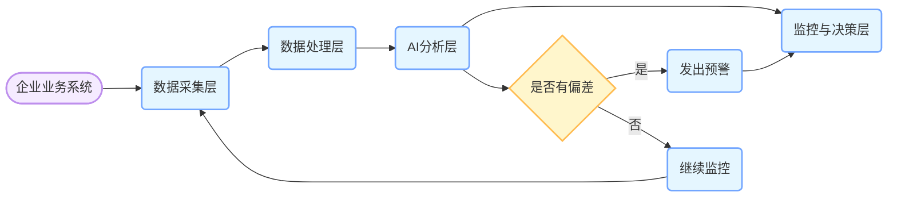

# AI驱动的企业战略执行监控：KPI智能跟踪与偏差分析

> 关键词：AI、企业战略执行监控、KPI智能跟踪、偏差分析、数据分析

> 摘要：本文深入探讨了AI驱动的企业战略执行监控，聚焦于KPI智能跟踪与偏差分析。详细介绍了相关核心概念、算法原理、数学模型，通过实际案例展示了其在企业中的应用。同时，提供了学习资源、开发工具和相关论文的推荐，最后对未来发展趋势与挑战进行了总结，并解答了常见问题。旨在帮助企业更好地利用AI技术提升战略执行监控的效率和精准度。

## 1. 背景介绍 
### 1.1 目的和范围
企业战略执行监控是确保企业目标得以实现的关键环节。传统的监控方式往往依赖人工，效率低下且容易出现误差。随着人工智能技术的发展，利用AI进行KPI智能跟踪与偏差分析成为可能。本文的目的在于深入探讨AI在企业战略执行监控中的应用，详细阐述相关技术原理、操作步骤和实际应用场景，为企业提供全面的技术指导和实践参考。范围涵盖从核心概念的介绍到具体算法的实现，再到实际项目案例的分析，以及对未来发展趋势的展望。

### 1.2 预期读者
本文的预期读者主要包括企业管理人员、战略规划师、数据分析人员、IT技术人员以及对人工智能在企业应用感兴趣的研究者。企业管理人员可以通过本文了解如何利用AI提升战略执行监控的效果；战略规划师可以从中获取关于KPI设置和监控的新思路；数据分析人员和IT技术人员则可以深入学习相关算法和技术实现细节；研究者可以关注该领域的最新发展动态和研究方向。

### 1.3 文档结构概述
本文将按照以下结构进行组织：首先介绍核心概念与联系，明确相关术语和架构；接着阐述核心算法原理和具体操作步骤，并给出Python源代码示例；然后介绍数学模型和公式，通过具体例子进行详细讲解；再通过实际项目案例展示代码的实现和应用；之后分析实际应用场景；推荐相关的学习资源、开发工具和论文著作；最后总结未来发展趋势与挑战，解答常见问题，并提供扩展阅读和参考资料。

### 1.4 术语表
#### 1.4.1 核心术语定义
- **企业战略执行监控**：对企业战略实施过程进行全面、实时的监测和控制，确保企业各项活动与战略目标保持一致。
- **KPI（关键绩效指标）**：用于衡量企业战略目标实现程度的关键指标，是企业战略执行监控的重要依据。
- **AI（人工智能）**：研究、开发用于模拟、延伸和扩展人的智能的理论、方法、技术及应用系统的一门新的技术科学。
- **智能跟踪**：利用AI技术自动、实时地对KPI数据进行收集、分析和监控。
- **偏差分析**：对比实际KPI值与目标KPI值，找出差异并分析原因的过程。

#### 1.4.2 相关概念解释
- **机器学习**：AI的一个重要分支，通过让计算机从数据中学习模式和规律，从而实现预测和决策。在KPI智能跟踪中，机器学习算法可以用于预测KPI的发展趋势。
- **数据挖掘**：从大量数据中发现有价值信息和知识的过程。在企业战略执行监控中，数据挖掘可以帮助发现隐藏在KPI数据中的潜在问题和规律。
- **实时数据分析**：对实时产生的数据进行快速分析和处理，以便及时发现问题并采取措施。在KPI智能跟踪中，实时数据分析可以确保企业及时了解战略执行情况。

#### 1.4.3 缩略词列表
- **AI**：Artificial Intelligence（人工智能）
- **KPI**：Key Performance Indicator（关键绩效指标）
- **ML**：Machine Learning（机器学习）
- **DM**：Data Mining（数据挖掘）

## 2. 核心概念与联系 

### 核心概念原理
企业战略执行监控的核心是通过对KPI的跟踪和分析，确保企业的各项活动与战略目标一致。KPI是企业战略目标的量化体现，它反映了企业在特定领域的绩效表现。AI驱动的KPI智能跟踪与偏差分析利用人工智能技术，自动收集、处理和分析KPI数据，及时发现实际值与目标值之间的偏差，并深入分析偏差产生的原因。

具体来说，AI技术可以通过以下方式实现KPI智能跟踪与偏差分析：
- **数据收集**：利用数据接口和爬虫技术，自动从企业的各个业务系统中收集KPI相关数据。
- **数据预处理**：对收集到的数据进行清洗、转换和归一化处理，以提高数据质量。
- **数据分析**：运用机器学习和深度学习算法，对KPI数据进行分析和预测，找出数据中的模式和规律。
- **偏差检测**：通过对比实际KPI值与目标KPI值，实时检测偏差，并发出预警。
- **原因分析**：利用数据挖掘和自然语言处理技术，深入分析偏差产生的原因，为企业决策提供支持。

### 架构的文本示意图
```plaintext
企业业务系统
    |
    |（数据收集）
    v
数据采集层
    |
    |（数据预处理）
    v
数据处理层
    |
    |（数据分析、偏差检测、原因分析）
    v
AI分析层
    |
    |（结果展示、预警）
    v
监控与决策层
```

### Mermaid流程图


## 3. 核心算法原理 & 具体操作步骤 

### 核心算法原理
在AI驱动的KPI智能跟踪与偏差分析中，常用的算法包括机器学习算法（如线性回归、决策树、神经网络等）和数据挖掘算法（如关联规则挖掘、聚类分析等）。下面以线性回归算法为例，详细介绍其原理和应用。

线性回归是一种用于建立自变量和因变量之间线性关系的统计方法。在KPI智能跟踪中，我们可以将KPI的历史数据作为自变量，未来的KPI值作为因变量，通过线性回归模型预测未来的KPI趋势。

线性回归模型的一般形式为：
$$y = \beta_0 + \beta_1x_1 + \beta_2x_2 + \cdots + \beta_nx_n + \epsilon$$
其中，$y$ 是因变量，$x_1, x_2, \cdots, x_n$ 是自变量，$\beta_0, \beta_1, \cdots, \beta_n$ 是回归系数，$\epsilon$ 是误差项。

### 具体操作步骤
#### 步骤1：数据收集
从企业的业务系统中收集KPI的历史数据，包括时间、KPI值等信息。

#### 步骤2：数据预处理
对收集到的数据进行清洗、转换和归一化处理，以提高数据质量。以下是一个简单的Python代码示例：
```python
import pandas as pd
from sklearn.preprocessing import MinMaxScaler

# 读取数据
data = pd.read_csv('kpi_data.csv')

# 处理缺失值
data = data.dropna()

# 归一化处理
scaler = MinMaxScaler()
data['KPI'] = scaler.fit_transform(data[['KPI']])

# 提取特征和标签
X = data.drop('KPI', axis=1)
y = data['KPI']
```

#### 步骤3：模型训练
使用线性回归模型对数据进行训练。
```python
from sklearn.linear_model import LinearRegression
from sklearn.model_selection import train_test_split

# 划分训练集和测试集
X_train, X_test, y_train, y_test = train_test_split(X, y, test_size=0.2, random_state=42)

# 创建线性回归模型
model = LinearRegression()

# 训练模型
model.fit(X_train, y_train)
```

#### 步骤4：模型评估
使用测试集对训练好的模型进行评估。
```python
from sklearn.metrics import mean_squared_error

# 预测测试集
y_pred = model.predict(X_test)

# 计算均方误差
mse = mean_squared_error(y_test, y_pred)
print(f"均方误差: {mse}")
```

#### 步骤5：偏差检测
对比实际KPI值与预测KPI值，检测偏差。
```python
# 预测所有数据
all_pred = model.predict(X)

# 计算偏差
deviation = data['KPI'] - all_pred

# 设定偏差阈值
threshold = 0.1

# 检测偏差
anomalies = data[abs(deviation) > threshold]
print("偏差数据：")
print(anomalies)
```

## 4. 数学模型和公式 & 详细讲解 & 举例说明 

### 线性回归模型
线性回归模型的目标是找到一组最优的回归系数 $\beta_0, \beta_1, \cdots, \beta_n$，使得预测值与实际值之间的误差最小。通常使用最小二乘法来求解回归系数，即最小化误差平方和：
$$\min_{\beta_0, \beta_1, \cdots, \beta_n} \sum_{i=1}^{m} (y_i - (\beta_0 + \beta_1x_{i1} + \beta_2x_{i2} + \cdots + \beta_nx_{in}))^2$$
其中，$m$ 是样本数量，$y_i$ 是第 $i$ 个样本的实际值，$x_{i1}, x_{i2}, \cdots, x_{in}$ 是第 $i$ 个样本的自变量值。

### 均方误差（MSE）
均方误差是评估回归模型性能的常用指标，它衡量了预测值与实际值之间的平均误差平方。其计算公式为：
$$MSE = \frac{1}{m} \sum_{i=1}^{m} (y_i - \hat{y}_i)^2$$
其中，$y_i$ 是第 $i$ 个样本的实际值，$\hat{y}_i$ 是第 $i$ 个样本的预测值。

### 举例说明
假设我们有一个企业的销售KPI历史数据，包含时间和销售额两个变量。我们希望通过线性回归模型预测未来的销售额。以下是一个简单的示例代码：
```python
import pandas as pd
from sklearn.linear_model import LinearRegression
from sklearn.metrics import mean_squared_error
import numpy as np

# 生成示例数据
data = {
    '时间': [1, 2, 3, 4, 5, 6, 7, 8, 9, 10],
    '销售额': [100, 120, 130, 150, 160, 180, 200, 220, 230, 250]
}
df = pd.DataFrame(data)

# 提取特征和标签
X = df[['时间']]
y = df['销售额']

# 创建线性回归模型
model = LinearRegression()

# 训练模型
model.fit(X, y)

# 预测未来销售额
future_time = np.array([[11], [12]])
future_sales = model.predict(future_time)
print("未来销售额预测：")
print(f"第11个月：{future_sales[0]}")
print(f"第12个月：{future_sales[1]}")

# 计算均方误差
y_pred = model.predict(X)
mse = mean_squared_error(y, y_pred)
print(f"均方误差: {mse}")
```

## 5. 项目实战：代码实际案例和详细解释说明 

### 5.1  开发环境搭建
#### 安装Python
首先，确保你已经安装了Python 3.x版本。可以从Python官方网站（https://www.python.org/downloads/）下载并安装。

#### 安装必要的库
使用以下命令安装必要的Python库：
```bash
pip install pandas numpy scikit-learn matplotlib
```

### 5.2  源代码详细实现和代码解读
以下是一个完整的项目实战代码示例，用于KPI智能跟踪与偏差分析：
```python
import pandas as pd
import numpy as np
from sklearn.linear_model import LinearRegression
from sklearn.model_selection import train_test_split
from sklearn.metrics import mean_squared_error
import matplotlib.pyplot as plt

# 步骤1：数据收集
# 假设我们有一个包含KPI历史数据的CSV文件
data = pd.read_csv('kpi_data.csv')

# 步骤2：数据预处理
# 处理缺失值
data = data.dropna()

# 提取特征和标签
X = data.drop('KPI', axis=1)
y = data['KPI']

# 划分训练集和测试集
X_train, X_test, y_train, y_test = train_test_split(X, y, test_size=0.2, random_state=42)

# 步骤3：模型训练
# 创建线性回归模型
model = LinearRegression()

# 训练模型
model.fit(X_train, y_train)

# 步骤4：模型评估
# 预测测试集
y_pred = model.predict(X_test)

# 计算均方误差
mse = mean_squared_error(y_test, y_pred)
print(f"均方误差: {mse}")

# 步骤5：偏差检测
# 预测所有数据
all_pred = model.predict(X)

# 计算偏差
deviation = y - all_pred

# 设定偏差阈值
threshold = 0.1

# 检测偏差
anomalies = data[abs(deviation) > threshold]
print("偏差数据：")
print(anomalies)

# 步骤6：可视化
plt.figure(figsize=(10, 6))
plt.plot(data.index, y, label='实际KPI值')
plt.plot(data.index, all_pred, label='预测KPI值')
plt.scatter(anomalies.index, anomalies['KPI'], color='red', label='偏差数据')
plt.xlabel('时间')
plt.ylabel('KPI值')
plt.title('KPI智能跟踪与偏差分析')
plt.legend()
plt.show()
```

### 5.3  代码解读与分析
- **数据收集**：从CSV文件中读取KPI历史数据。
- **数据预处理**：处理缺失值，并提取特征和标签。
- **模型训练**：使用线性回归模型对训练集进行训练。
- **模型评估**：使用测试集对模型进行评估，计算均方误差。
- **偏差检测**：预测所有数据，计算偏差，并根据阈值检测偏差数据。
- **可视化**：使用Matplotlib库将实际KPI值、预测KPI值和偏差数据可视化，方便直观地观察KPI的变化趋势和偏差情况。

## 6. 实际应用场景 
### 销售业绩监控
在企业的销售业务中，通过AI驱动的KPI智能跟踪与偏差分析，可以实时监控销售业绩指标，如销售额、销售量、销售增长率等。一旦发现实际业绩与目标业绩之间存在偏差，系统可以及时发出预警，帮助销售团队分析原因，采取相应的措施进行调整。例如，如果某地区的销售额低于预期，可以通过分析该地区的客户数据、市场竞争情况等因素，找出问题所在，并制定针对性的营销策略。

### 生产效率监控
在制造业中，KPI智能跟踪与偏差分析可以用于监控生产效率指标，如生产产量、生产合格率、设备利用率等。通过对生产数据的实时分析，及时发现生产过程中的异常情况，如设备故障、工艺问题等，以便及时采取措施进行修复和优化。例如，如果某条生产线的生产合格率突然下降，可以通过分析相关的生产参数和设备运行数据，找出导致合格率下降的原因，并进行调整。

### 客户满意度监控
企业可以通过收集客户反馈数据，如客户投诉率、客户忠诚度等指标，利用AI技术进行KPI智能跟踪与偏差分析。当客户满意度指标出现偏差时，及时了解客户的需求和意见，采取措施改进产品和服务质量，提高客户满意度。例如，如果某款产品的客户投诉率突然上升，可以通过分析客户投诉内容，找出产品存在的问题，并进行改进。

## 7. 工具和资源推荐
### 7.1 学习资源推荐
#### 7.1.1 书籍推荐
- 《Python机器学习》：全面介绍了Python在机器学习领域的应用，包括各种机器学习算法的原理和实现。
- 《数据挖掘：概念与技术》：详细讲解了数据挖掘的基本概念、算法和应用，是数据挖掘领域的经典教材。
- 《人工智能：一种现代的方法》：系统介绍了人工智能的基本理论、方法和技术，是人工智能领域的权威著作。

#### 7.1.2 在线课程
- Coursera上的“机器学习”课程：由斯坦福大学教授Andrew Ng主讲，是机器学习领域的经典课程。
- edX上的“数据科学微硕士项目”：提供了全面的数据科学知识和技能培训，包括数据分析、机器学习、深度学习等方面。
- 阿里云大学的“人工智能实战教程”：结合实际案例，介绍了人工智能在各个领域的应用和实践。

#### 7.1.3 技术博客和网站
- Medium：有许多关于人工智能、机器学习和数据分析的优质博客文章。
- Kaggle：是一个数据科学竞赛平台，提供了丰富的数据集和代码示例，同时也有许多数据科学专家分享经验和见解。
- 开源中国：国内知名的开源技术社区，有很多关于人工智能和数据分析的技术文章和讨论。

### 7.2 开发工具框架推荐
#### 7.2.1 IDE和编辑器
- PyCharm：是一款专门为Python开发设计的集成开发环境，具有强大的代码编辑、调试和项目管理功能。
- Jupyter Notebook：是一个交互式的开发环境，适合进行数据分析和模型实验。
- Visual Studio Code：是一款轻量级的代码编辑器，支持多种编程语言，有丰富的插件可以扩展功能。

#### 7.2.2 调试和性能分析工具
- PDB：Python自带的调试工具，可以帮助开发者逐行调试代码，找出问题所在。
- cProfile：Python的性能分析工具，可以分析代码的运行时间和内存使用情况，帮助优化代码性能。
- TensorBoard：是TensorFlow的可视化工具，可以用于可视化模型训练过程和结果。

#### 7.2.3 相关框架和库
- Scikit-learn：是一个简单易用的机器学习库，提供了各种机器学习算法的实现，包括分类、回归、聚类等。
- TensorFlow：是一个开源的深度学习框架，广泛应用于图像识别、自然语言处理等领域。
- PyTorch：是另一个流行的深度学习框架，具有动态图的特点，易于使用和调试。

### 7.3 相关论文著作推荐
#### 7.3.1 经典论文
- 《Pattern Recognition and Machine Learning》：由Christopher Bishop撰写，是机器学习领域的经典著作，系统介绍了模式识别和机器学习的基本理论和方法。
- 《Deep Learning》：由Ian Goodfellow、Yoshua Bengio和Aaron Courville撰写，是深度学习领域的权威教材，全面介绍了深度学习的原理、算法和应用。
- 《The Elements of Statistical Learning》：由Trevor Hastie、Robert Tibshirani和Jerome Friedman撰写，是统计学习领域的经典著作，深入讲解了统计学习的理论和方法。

#### 7.3.2 最新研究成果
- 在arXiv.org上可以找到许多关于人工智能、机器学习和数据分析的最新研究论文。
- 国际顶级学术会议如NeurIPS、ICML、CVPR等的会议论文集，收录了该领域的最新研究成果。

#### 7.3.3 应用案例分析
- 《AI in Business: The Ultimate Guide to Artificial Intelligence for Business Leaders》：介绍了人工智能在企业中的应用案例和实践经验，对企业管理人员有很大的参考价值。
- 《Data-Driven Marketing: The 15 Metrics Everyone in Marketing Should Know》：通过实际案例，讲解了如何利用数据分析来驱动市场营销决策。

## 8. 总结：未来发展趋势与挑战
### 未来发展趋势
- **智能化程度不断提高**：随着人工智能技术的不断发展，KPI智能跟踪与偏差分析系统将变得更加智能化。例如，系统可以自动识别不同类型的偏差，并提供相应的解决方案；可以根据企业的历史数据和实时情况，自动调整监控策略和阈值。
- **与其他技术的融合**：AI将与物联网、大数据、区块链等技术深度融合，实现更全面、更实时的企业战略执行监控。例如，通过物联网设备实时收集企业生产、销售等环节的数据，为KPI智能跟踪提供更丰富的数据源；利用区块链技术保证数据的安全性和可信度。
- **行业应用的拓展**：AI驱动的企业战略执行监控将在更多行业得到应用，如医疗、教育、金融等。不同行业的企业可以根据自身的特点和需求，定制适合自己的KPI智能跟踪与偏差分析系统。

### 挑战
- **数据质量问题**：高质量的数据是AI算法有效运行的基础。然而，企业的数据往往存在缺失、错误、不一致等问题，这会影响KPI智能跟踪与偏差分析的准确性和可靠性。因此，如何提高数据质量是一个亟待解决的问题。
- **算法复杂度和可解释性**：一些先进的AI算法，如深度学习算法，虽然在性能上表现出色，但往往具有较高的复杂度，难以解释模型的决策过程。在企业战略执行监控中，决策者需要了解偏差产生的原因和模型的预测依据，因此如何提高算法的可解释性是一个重要挑战。
- **人才短缺**：AI技术的应用需要具备相关专业知识和技能的人才。目前，市场上缺乏既懂人工智能又懂企业管理的复合型人才，这限制了AI在企业战略执行监控中的推广和应用。

## 9. 附录：常见问题与解答
### 问题1：如何选择合适的KPI？
选择合适的KPI需要考虑以下几个方面：
- **与企业战略目标一致**：KPI应该能够反映企业战略目标的实现程度，与企业的长期发展方向保持一致。
- **可衡量性**：KPI应该是可以量化的，以便于进行跟踪和评估。
- **可操作性**：KPI应该是企业能够实际控制和影响的，具有可操作性。
- **相关性**：KPI之间应该具有一定的相关性，能够全面反映企业的运营状况。

### 问题2：如何处理异常数据？
处理异常数据的方法有很多种，常见的方法包括：
- **删除异常数据**：如果异常数据是由于数据录入错误或设备故障等原因导致的，可以直接删除这些数据。
- **修正异常数据**：如果异常数据是由于数据波动或其他原因导致的，可以通过统计方法或业务规则对异常数据进行修正。
- **使用鲁棒性算法**：选择对异常数据不敏感的算法，如鲁棒回归算法，以减少异常数据对模型的影响。

### 问题3：如何评估KPI智能跟踪与偏差分析系统的性能？
可以从以下几个方面评估KPI智能跟踪与偏差分析系统的性能：
- **准确性**：系统能够准确地跟踪KPI数据，并及时发现偏差。
- **及时性**：系统能够在偏差发生后及时发出预警，以便企业及时采取措施。
- **可解释性**：系统能够解释偏差产生的原因和模型的预测依据，方便决策者理解和决策。
- **稳定性**：系统在长时间运行过程中能够保持稳定，不会出现频繁的故障或错误。

## 10. 扩展阅读 & 参考资料
### 扩展阅读
- 《企业战略管理》：深入探讨了企业战略的制定、实施和监控等方面的内容，有助于进一步理解企业战略执行监控的重要性。
- 《数据分析实战》：通过实际案例介绍了数据分析的方法和技巧，对KPI智能跟踪与偏差分析中的数据分析环节有很大的帮助。

### 参考资料
- 各相关技术文档和官方网站，如Python官方文档、Scikit-learn官方文档、TensorFlow官方文档等。
- 企业内部的业务数据和分析报告，这些资料可以为实际项目提供具体的数据支持和业务背景。

作者：AI天才研究院/AI Genius Institute & 禅与计算机程序设计艺术 /Zen And The Art of Computer Programming