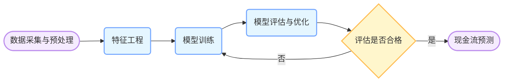

# AI驱动的企业现金流预测

> 关键词：AI、企业现金流预测、机器学习、深度学习、时间序列分析

> 摘要：本文围绕AI驱动的企业现金流预测展开深入探讨。首先介绍了现金流预测在企业管理中的重要性以及引入AI技术的背景和意义。详细阐述了与现金流预测相关的核心概念，包括AI的不同算法类型、现金流预测的原理和架构。通过Python代码详细讲解了核心算法原理和具体操作步骤，同时给出了相应的数学模型和公式并举例说明。在项目实战部分，从开发环境搭建到源代码的详细实现和解读，为读者呈现了完整的实践过程。接着分析了该技术在企业不同场景下的实际应用，推荐了学习资源、开发工具框架以及相关论文著作。最后总结了未来发展趋势与挑战，并对常见问题进行了解答，为企业利用AI进行现金流预测提供了全面的指导。

## 1. 背景介绍 
### 1.1 目的和范围
企业现金流预测是企业财务管理的核心环节之一，准确的现金流预测能够帮助企业合理安排资金，避免资金链断裂风险，优化资源配置，提高企业的运营效率和竞争力。传统的现金流预测方法往往依赖于历史数据的简单统计分析和人工经验判断，难以应对复杂多变的市场环境和企业经营状况。随着人工智能技术的快速发展，其强大的数据处理和分析能力为企业现金流预测提供了新的思路和方法。

本文的目的是深入探讨如何利用AI技术实现企业现金流预测，涵盖了从核心概念到实际应用的各个方面。具体范围包括介绍相关的AI算法和技术，阐述现金流预测的原理和方法，通过实际案例展示如何使用Python实现AI驱动的现金流预测，分析其在不同企业场景下的应用，以及提供学习和开发相关技术的资源和工具推荐。

### 1.2 预期读者
本文预期读者主要包括企业财务管理人员、金融分析师、数据科学家、人工智能开发者以及对企业现金流预测和AI技术应用感兴趣的研究人员。对于财务管理人员和金融分析师，本文可以帮助他们了解如何利用AI技术提升现金流预测的准确性和效率；对于数据科学家和人工智能开发者，本文提供了具体的算法实现和实践案例，可供他们参考和进一步研究；对于其他感兴趣的研究人员，本文可以作为了解该领域的入门资料，为他们的学习和研究提供方向。

### 1.3 文档结构概述
本文将按照以下结构进行组织：
1. **背景介绍**：阐述企业现金流预测的重要性以及引入AI技术的背景和目的，介绍本文的预期读者和文档结构。
2. **核心概念与联系**：详细解释与AI驱动的企业现金流预测相关的核心概念，包括AI算法类型、现金流预测的原理和架构，并通过文本示意图和Mermaid流程图进行直观展示。
3. **核心算法原理 & 具体操作步骤**：使用Python源代码详细讲解用于现金流预测的核心AI算法原理和具体操作步骤。
4. **数学模型和公式 & 详细讲解 & 举例说明**：给出相关的数学模型和公式，并结合具体例子进行详细解释。
5. **项目实战：代码实际案例和详细解释说明**：从开发环境搭建开始，逐步展示如何实现一个完整的AI驱动的企业现金流预测项目，并对源代码进行详细解读和分析。
6. **实际应用场景**：分析AI驱动的企业现金流预测在不同企业场景下的实际应用。
7. **工具和资源推荐**：推荐学习相关技术的资源，包括书籍、在线课程、技术博客和网站，以及开发工具框架和相关论文著作。
8. **总结：未来发展趋势与挑战**：总结AI驱动的企业现金流预测的未来发展趋势，并分析可能面临的挑战。
9. **附录：常见问题与解答**：对读者可能关心的常见问题进行解答。
10. **扩展阅读 & 参考资料**：提供进一步学习和研究的扩展阅读资料和参考书目。

### 1.4 术语表
#### 1.4.1 核心术语定义
- **AI（Artificial Intelligence）**：人工智能，是指让计算机系统模拟人类智能的技术和方法，包括机器学习、深度学习、自然语言处理等多个领域。
- **现金流预测（Cash Flow Forecasting）**：对企业未来一段时间内现金流入和流出情况进行预测的过程，是企业财务管理的重要组成部分。
- **机器学习（Machine Learning）**：AI的一个分支，通过让计算机从数据中学习模式和规律，从而实现对未知数据的预测和决策。
- **深度学习（Deep Learning）**：一种基于人工神经网络的机器学习技术，通过构建多层神经网络来自动学习数据的复杂特征和模式。
- **时间序列分析（Time Series Analysis）**：对按时间顺序排列的数据进行分析和预测的方法，常用于处理具有时间相关性的数据，如企业现金流数据。

#### 1.4.2 相关概念解释
- **特征工程（Feature Engineering）**：在机器学习中，特征工程是指从原始数据中提取和选择有价值的特征，以提高模型的性能和预测准确性。
- **模型评估（Model Evaluation）**：使用一定的指标和方法对训练好的机器学习模型进行评估，以衡量模型的性能和泛化能力。
- **过拟合（Overfitting）**：模型在训练数据上表现良好，但在测试数据或新数据上表现不佳的现象，通常是由于模型过于复杂，学习了训练数据中的噪声和异常值。
- **欠拟合（Underfitting）**：模型在训练数据和测试数据上都表现不佳的现象，通常是由于模型过于简单，无法学习到数据中的复杂模式和规律。

#### 1.4.3 缩略词列表
- **ANN（Artificial Neural Network）**：人工神经网络
- **LSTM（Long Short-Term Memory）**：长短期记忆网络
- **GRU（Gated Recurrent Unit）**：门控循环单元
- **RMSE（Root Mean Squared Error）**：均方根误差
- **MAE（Mean Absolute Error）**：平均绝对误差

## 2. 核心概念与联系 
### 核心概念原理
#### AI算法在现金流预测中的应用
在企业现金流预测中，常用的AI算法包括机器学习算法和深度学习算法。机器学习算法如线性回归、决策树、随机森林等，通过对历史现金流数据和相关特征进行学习，建立预测模型。这些算法的优点是模型解释性强，训练速度快，适用于数据量较小、特征关系相对简单的情况。

深度学习算法如循环神经网络（RNN）及其变体LSTM、GRU等，更适合处理具有时间序列特性的现金流数据。RNN能够捕捉数据中的时间依赖关系，但在处理长序列数据时容易出现梯度消失或梯度爆炸问题。LSTM和GRU通过引入门控机制，有效地解决了这个问题，能够更好地学习和记忆数据的长期依赖信息。

#### 现金流预测的原理
现金流预测的基本原理是基于历史现金流数据和相关影响因素，通过建立数学模型来预测未来的现金流情况。具体来说，需要收集企业的历史现金流数据，包括现金流入和流出的各个项目，如销售收入、采购支出、工资支出等。同时，考虑可能影响现金流的其他因素，如市场需求、宏观经济环境、企业战略决策等。然后，选择合适的AI算法对这些数据进行训练和建模，最终得到能够预测未来现金流的模型。

### 架构示意图
以下是一个AI驱动的企业现金流预测系统的架构示意图：

```plaintext
+---------------------+
| 数据采集与预处理    |
| - 历史现金流数据    |
| - 相关影响因素数据 |
| - 数据清洗、归一化  |
+---------------------+
         |
         v
+---------------------+
| 特征工程            |
| - 特征提取          |
| - 特征选择          |
+---------------------+
         |
         v
+---------------------+
| 模型训练            |
| - 选择AI算法        |
| - 划分训练集和测试集|
| - 模型训练和调优    |
+---------------------+
         |
         v
+---------------------+
| 模型评估与优化      |
| - 评估指标计算      |
| - 模型优化调整      |
+---------------------+
         |
         v
+---------------------+
| 现金流预测          |
| - 输入新数据        |
| - 得到预测结果      |
+---------------------+
```

### Mermaid流程图


这个流程图展示了AI驱动的企业现金流预测的主要流程，从数据采集与预处理开始，经过特征工程、模型训练、模型评估与优化，最终进行现金流预测。如果模型评估不合格，则需要返回模型训练步骤进行调整和优化。

## 3. 核心算法原理 & 具体操作步骤 
### 线性回归算法原理
线性回归是一种简单而常用的机器学习算法，用于建立自变量和因变量之间的线性关系。在企业现金流预测中，假设我们有 $n$ 个特征 $x_1, x_2, \cdots, x_n$，以及对应的现金流值 $y$，线性回归模型可以表示为：

$$y = \theta_0 + \theta_1x_1 + \theta_2x_2 + \cdots + \theta_nx_n + \epsilon$$

其中，$\theta_0, \theta_1, \cdots, \theta_n$ 是模型的参数，$\epsilon$ 是误差项。线性回归的目标是找到一组最优的参数 $\theta$，使得预测值 $\hat{y}$ 与真实值 $y$ 之间的误差最小。通常使用最小二乘法来求解参数 $\theta$，即最小化误差平方和：

$$J(\theta) = \frac{1}{2m}\sum_{i=1}^{m}(y^{(i)} - \hat{y}^{(i)})^2$$

其中，$m$ 是样本数量，$y^{(i)}$ 是第 $i$ 个样本的真实值，$\hat{y}^{(i)}$ 是第 $i$ 个样本的预测值。

### Python代码实现线性回归进行现金流预测
```python
import numpy as np
from sklearn.linear_model import LinearRegression
from sklearn.model_selection import train_test_split
from sklearn.metrics import mean_squared_error

# 生成示例数据
np.random.seed(0)
X = np.random.rand(100, 3)  # 100个样本，3个特征
y = 2 * X[:, 0] + 3 * X[:, 1] - 1 * X[:, 2] + np.random.randn(100) * 0.1  # 真实现金流值

# 划分训练集和测试集
X_train, X_test, y_train, y_test = train_test_split(X, y, test_size=0.2, random_state=42)

# 创建线性回归模型
model = LinearRegression()

# 训练模型
model.fit(X_train, y_train)

# 预测
y_pred = model.predict(X_test)

# 评估模型
mse = mean_squared_error(y_test, y_pred)
rmse = np.sqrt(mse)
print(f"均方根误差 (RMSE): {rmse}")
```

### 代码解释
1. **数据生成**：使用 `np.random.rand` 生成100个样本，每个样本有3个特征。然后根据线性关系生成对应的现金流值 $y$，并添加一些随机噪声。
2. **数据划分**：使用 `train_test_split` 函数将数据划分为训练集和测试集，测试集占比为20%。
3. **模型创建和训练**：创建 `LinearRegression` 模型对象，并使用训练集数据进行训练。
4. **预测和评估**：使用训练好的模型对测试集数据进行预测，并计算预测结果的均方根误差（RMSE）。

### LSTM算法原理
LSTM是一种特殊的循环神经网络，用于处理序列数据。LSTM通过引入门控机制，能够有效地解决传统RNN在处理长序列数据时的梯度消失问题。LSTM单元包含三个门：输入门 $i_t$、遗忘门 $f_t$ 和输出门 $o_t$，以及一个细胞状态 $C_t$。其计算公式如下：

- 遗忘门：
$$f_t = \sigma(W_f[h_{t-1}, x_t] + b_f)$$

- 输入门：
$$i_t = \sigma(W_i[h_{t-1}, x_t] + b_i)$$
$$\tilde{C}_t = \tanh(W_C[h_{t-1}, x_t] + b_C)$$

- 细胞状态更新：
$$C_t = f_t \odot C_{t-1} + i_t \odot \tilde{C}_t$$

- 输出门：
$$o_t = \sigma(W_o[h_{t-1}, x_t] + b_o)$$
$$h_t = o_t \odot \tanh(C_t)$$

其中，$x_t$ 是当前时刻的输入，$h_{t-1}$ 是上一时刻的隐藏状态，$W$ 和 $b$ 是模型的参数，$\sigma$ 是 sigmoid 函数，$\tanh$ 是双曲正切函数，$\odot$ 表示逐元素相乘。

### Python代码实现LSTM进行现金流预测
```python
import numpy as np
import pandas as pd
from sklearn.preprocessing import MinMaxScaler
from tensorflow.keras.models import Sequential
from tensorflow.keras.layers import LSTM, Dense

# 生成示例时间序列数据
data = np.array([i for i in range(100)])
data = data.reshape(-1, 1)

# 数据归一化
scaler = MinMaxScaler(feature_range=(0, 1))
scaled_data = scaler.fit_transform(data)

# 准备训练数据
def create_dataset(dataset, time_step=1):
    X, Y = [], []
    for i in range(len(dataset)-time_step-1):
        a = dataset[i:(i+time_step), 0]
        X.append(a)
        Y.append(dataset[i + time_step, 0])
    return np.array(X), np.array(Y)

time_step = 10
X, y = create_dataset(scaled_data, time_step)
X = X.reshape(X.shape[0], X.shape[1], 1)

# 划分训练集和测试集
train_size = int(len(X) * 0.8)
X_train, X_test = X[:train_size], X[train_size:]
y_train, y_test = y[:train_size], y[train_size:]

# 创建LSTM模型
model = Sequential()
model.add(LSTM(50, return_sequences=True, input_shape=(time_step, 1)))
model.add(LSTM(50, return_sequences=True))
model.add(LSTM(50))
model.add(Dense(1))
model.compile(loss='mean_squared_error', optimizer='adam')

# 训练模型
model.fit(X_train, y_train, epochs=100, batch_size=64, verbose=1)

# 预测
train_predict = model.predict(X_train)
test_predict = model.predict(X_test)

# 反归一化
train_predict = scaler.inverse_transform(train_predict)
test_predict = scaler.inverse_transform(test_predict)
```

### 代码解释
1. **数据生成和归一化**：生成一个简单的时间序列数据，并使用 `MinMaxScaler` 进行归一化处理，将数据缩放到0到1的范围内。
2. **数据准备**：定义 `create_dataset` 函数，将时间序列数据转换为适合LSTM模型输入的格式，即 `[样本数, 时间步长, 特征数]`。
3. **数据划分**：将数据划分为训练集和测试集，训练集占比为80%。
4. **模型创建和编译**：创建一个包含三个LSTM层和一个全连接层的Sequential模型，并使用均方误差作为损失函数，Adam优化器进行模型训练。
5. **模型训练和预测**：使用训练集数据对模型进行训练，并对训练集和测试集数据进行预测。
6. **反归一化**：将预测结果进行反归一化处理，得到真实的现金流预测值。

## 4. 数学模型和公式 & 详细讲解 & 举例说明 
### 线性回归的数学模型和公式
如前面所述，线性回归的数学模型为：

$$y = \theta_0 + \theta_1x_1 + \theta_2x_2 + \cdots + \theta_nx_n + \epsilon$$

其中，$y$ 是因变量（现金流值），$x_1, x_2, \cdots, x_n$ 是自变量（特征），$\theta_0, \theta_1, \cdots, \theta_n$ 是模型的参数，$\epsilon$ 是误差项。

最小二乘法的目标是最小化误差平方和 $J(\theta)$：

$$J(\theta) = \frac{1}{2m}\sum_{i=1}^{m}(y^{(i)} - \hat{y}^{(i)})^2$$

为了求解最优参数 $\theta$，可以对 $J(\theta)$ 求偏导数并令其为0：

$$\frac{\partial J(\theta)}{\partial \theta_j} = \frac{1}{m}\sum_{i=1}^{m}(y^{(i)} - \hat{y}^{(i)})(-x_j^{(i)}) = 0$$

对于简单的一元线性回归（$n = 1$），可以通过以下公式直接求解参数 $\theta_0$ 和 $\theta_1$：

$$\theta_1 = \frac{\sum_{i=1}^{m}(x^{(i)} - \bar{x})(y^{(i)} - \bar{y})}{\sum_{i=1}^{m}(x^{(i)} - \bar{x})^2}$$

$$\theta_0 = \bar{y} - \theta_1\bar{x}$$

其中，$\bar{x}$ 和 $\bar{y}$ 分别是 $x$ 和 $y$ 的均值。

### 举例说明
假设我们有以下数据集：

| $x$ | $y$ |
| --- | --- |
| 1   | 2   |
| 2   | 4   |
| 3   | 6   |
| 4   | 8   |

首先计算均值：

$$\bar{x} = \frac{1 + 2 + 3 + 4}{4} = 2.5$$

$$\bar{y} = \frac{2 + 4 + 6 + 8}{4} = 5$$

然后计算 $\theta_1$：

$$\sum_{i=1}^{4}(x^{(i)} - \bar{x})(y^{(i)} - \bar{y}) = (1 - 2.5)(2 - 5) + (2 - 2.5)(4 - 5) + (3 - 2.5)(6 - 5) + (4 - 2.5)(8 - 5) = 10$$

$$\sum_{i=1}^{4}(x^{(i)} - \bar{x})^2 = (1 - 2.5)^2 + (2 - 2.5)^2 + (3 - 2.5)^2 + (4 - 2.5)^2 = 5$$

$$\theta_1 = \frac{10}{5} = 2$$

最后计算 $\theta_0$：

$$\theta_0 = 5 - 2 \times 2.5 = 0$$

所以，一元线性回归模型为 $y = 2x$。

### LSTM的数学模型和公式
LSTM的数学模型如前面所述，包含遗忘门、输入门、细胞状态更新和输出门四个部分。下面详细解释每个部分的作用：

- **遗忘门**：决定上一时刻的细胞状态 $C_{t-1}$ 中有多少信息需要被遗忘。遗忘门的输出 $f_t$ 是一个取值在0到1之间的向量，0表示完全遗忘，1表示完全保留。

- **输入门**：决定当前输入 $x_t$ 中有多少信息需要被添加到细胞状态中。输入门由两部分组成：$i_t$ 决定哪些信息需要更新，$\tilde{C}_t$ 是候选细胞状态。

- **细胞状态更新**：根据遗忘门和输入门的输出，更新当前时刻的细胞状态 $C_t$。

- **输出门**：决定当前时刻的隐藏状态 $h_t$ 的输出。输出门的输出 $o_t$ 是一个取值在0到1之间的向量，用于控制细胞状态 $C_t$ 中有多少信息需要输出到隐藏状态 $h_t$。

### 举例说明
假设我们有一个简单的LSTM单元，输入 $x_t$ 是一个长度为3的向量，上一时刻的隐藏状态 $h_{t-1}$ 也是一个长度为3的向量。模型的参数 $W_f, W_i, W_C, W_o$ 是 $3 \times 6$ 的矩阵，$b_f, b_i, b_C, b_o$ 是长度为3的向量。

首先计算遗忘门：

$$f_t = \sigma(W_f[h_{t-1}, x_t] + b_f)$$

假设 $W_f$、$b_f$、$h_{t-1}$ 和 $x_t$ 的值如下：

$$W_f = \begin{bmatrix}
0.1 & 0.2 & 0.3 & 0.4 & 0.5 & 0.6 \\
0.2 & 0.3 & 0.4 & 0.5 & 0.6 & 0.7 \\
0.3 & 0.4 & 0.5 & 0.6 & 0.7 & 0.8
\end{bmatrix}$$

$$b_f = \begin{bmatrix}
0.1 \\
0.2 \\
0.3
\end{bmatrix}$$

$$h_{t-1} = \begin{bmatrix}
0.1 \\
0.2 \\
0.3
\end{bmatrix}$$

$$x_t = \begin{bmatrix}
0.4 \\
0.5 \\
0.6
\end{bmatrix}$$

则 $[h_{t-1}, x_t] = \begin{bmatrix}
0.1 \\
0.2 \\
0.3 \\
0.4 \\
0.5 \\
0.6
\end{bmatrix}$

$$W_f[h_{t-1}, x_t] + b_f = \begin{bmatrix}
0.1 \times 0.1 + 0.2 \times 0.2 + 0.3 \times 0.3 + 0.4 \times 0.4 + 0.5 \times 0.5 + 0.6 \times 0.6 + 0.1 \\
0.2 \times 0.1 + 0.3 \times 0.2 + 0.4 \times 0.3 + 0.5 \times 0.4 + 0.6 \times 0.5 + 0.7 \times 0.6 + 0.2 \\
0.3 \times 0.1 + 0.4 \times 0.2 + 0.5 \times 0.3 + 0.6 \times 0.4 + 0.7 \times 0.5 + 0.8 \times 0.6 + 0.3
\end{bmatrix} = \begin{bmatrix}
0.91 \\
1.24 \\
1.59
\end{bmatrix}$$

$$f_t = \sigma(W_f[h_{t-1}, x_t] + b_f) = \begin{bmatrix}
\frac{1}{1 + e^{-0.91}} \\
\frac{1}{1 + e^{-1.24}} \\
\frac{1}{1 + e^{-1.59}}
\end{bmatrix} \approx \begin{bmatrix}
0.71 \\
0.78 \\
0.83
\end{bmatrix}$$

同理，可以计算输入门、细胞状态更新和输出门。

## 5. 项目实战：代码实际案例和详细解释说明 
### 5.1  开发环境搭建
#### 安装Python
首先，需要安装Python环境。可以从Python官方网站（https://www.python.org/downloads/）下载适合自己操作系统的Python版本。建议安装Python 3.7及以上版本。

#### 创建虚拟环境
为了避免不同项目之间的依赖冲突，建议使用虚拟环境。可以使用 `venv` 或 `conda` 来创建虚拟环境。

使用 `venv` 创建虚拟环境的命令如下：

```bash
python -m venv myenv
```

激活虚拟环境：

- 在Windows上：
```bash
myenv\Scripts\activate
```

- 在Linux或Mac上：
```bash
source myenv/bin/activate
```

#### 安装必要的库
在虚拟环境中安装以下必要的库：

```bash
pip install numpy pandas scikit-learn tensorflow matplotlib
```

### 5.2  源代码详细实现和代码解读
#### 数据加载和预处理
```python
import pandas as pd
import numpy as np
from sklearn.preprocessing import MinMaxScaler

# 加载数据
data = pd.read_csv('cash_flow_data.csv')

# 提取现金流列
cash_flow = data['cash_flow'].values.reshape(-1, 1)

# 数据归一化
scaler = MinMaxScaler(feature_range=(0, 1))
scaled_cash_flow = scaler.fit_transform(cash_flow)

# 准备训练数据
def create_dataset(dataset, time_step=1):
    X, Y = [], []
    for i in range(len(dataset)-time_step-1):
        a = dataset[i:(i+time_step), 0]
        X.append(a)
        Y.append(dataset[i + time_step, 0])
    return np.array(X), np.array(Y)

time_step = 10
X, y = create_dataset(scaled_cash_flow, time_step)
X = X.reshape(X.shape[0], X.shape[1], 1)

# 划分训练集和测试集
train_size = int(len(X) * 0.8)
X_train, X_test = X[:train_size], X[train_size:]
y_train, y_test = y[:train_size], y[train_size:]
```

**代码解读**：
1. **数据加载**：使用 `pandas` 库的 `read_csv` 函数加载包含现金流数据的CSV文件。
2. **数据提取和归一化**：提取现金流列，并使用 `MinMaxScaler` 将数据归一化到0到1的范围内。
3. **数据准备**：定义 `create_dataset` 函数，将时间序列数据转换为适合LSTM模型输入的格式。
4. **数据划分**：将数据划分为训练集和测试集，训练集占比为80%。

#### 模型创建和训练
```python
from tensorflow.keras.models import Sequential
from tensorflow.keras.layers import LSTM, Dense

# 创建LSTM模型
model = Sequential()
model.add(LSTM(50, return_sequences=True, input_shape=(time_step, 1)))
model.add(LSTM(50, return_sequences=True))
model.add(LSTM(50))
model.add(Dense(1))
model.compile(loss='mean_squared_error', optimizer='adam')

# 训练模型
model.fit(X_train, y_train, epochs=100, batch_size=64, verbose=1)
```

**代码解读**：
1. **模型创建**：使用 `Sequential` 模型创建一个包含三个LSTM层和一个全连接层的神经网络。
2. **模型编译**：使用均方误差作为损失函数，Adam优化器进行模型训练。
3. **模型训练**：使用训练集数据对模型进行训练，训练100个epoch，每个batch包含64个样本。

#### 模型预测和评估
```python
import matplotlib.pyplot as plt

# 预测
train_predict = model.predict(X_train)
test_predict = model.predict(X_test)

# 反归一化
train_predict = scaler.inverse_transform(train_predict)
test_predict = scaler.inverse_transform(test_predict)

# 计算评估指标
from sklearn.metrics import mean_squared_error, mean_absolute_error

train_rmse = np.sqrt(mean_squared_error(cash_flow[time_step:train_size+time_step], train_predict))
test_rmse = np.sqrt(mean_squared_error(cash_flow[train_size+time_step:], test_predict))
train_mae = mean_absolute_error(cash_flow[time_step:train_size+time_step], train_predict)
test_mae = mean_absolute_error(cash_flow[train_size+time_step:], test_predict)

print(f"训练集RMSE: {train_rmse}")
print(f"测试集RMSE: {test_rmse}")
print(f"训练集MAE: {train_mae}")
print(f"测试集MAE: {test_mae}")

# 绘制预测结果
look_back = time_step
trainPredictPlot = np.empty_like(cash_flow)
trainPredictPlot[:, :] = np.nan
trainPredictPlot[look_back:train_size+look_back, :] = train_predict

testPredictPlot = np.empty_like(cash_flow)
testPredictPlot[:, :] = np.nan
testPredictPlot[train_size+look_back:, :] = test_predict

plt.plot(cash_flow, label='Actual Cash Flow')
plt.plot(trainPredictPlot, label='Train Predict')
plt.plot(testPredictPlot, label='Test Predict')
plt.legend()
plt.show()
```

**代码解读**：
1. **模型预测**：使用训练好的模型对训练集和测试集数据进行预测。
2. **反归一化**：将预测结果进行反归一化处理，得到真实的现金流预测值。
3. **模型评估**：计算训练集和测试集的均方根误差（RMSE）和平均绝对误差（MAE）。
4. **结果可视化**：使用 `matplotlib` 库绘制真实现金流值和预测现金流值的折线图，直观展示预测效果。

### 5.3  代码解读与分析
#### 数据预处理的重要性
数据预处理是机器学习项目中非常重要的一步。在本项目中，我们使用 `MinMaxScaler` 对现金流数据进行归一化处理，将数据缩放到0到1的范围内。这是因为神经网络对输入数据的尺度比较敏感，如果输入数据的尺度差异较大，可能会导致模型训练不稳定或收敛速度变慢。通过归一化处理，可以使不同特征具有相同的尺度，提高模型的训练效果。

#### LSTM模型的选择
LSTM模型适合处理具有时间序列特性的现金流数据，因为它能够捕捉数据中的时间依赖关系。在本项目中，我们使用了三个LSTM层来构建模型，增加模型的复杂度和表达能力。同时，在每个LSTM层中设置 `return_sequences=True`，表示返回每个时间步的隐藏状态，以便下一层LSTM层能够继续处理。

#### 模型评估指标的选择
在本项目中，我们使用均方根误差（RMSE）和平均绝对误差（MAE）作为模型的评估指标。RMSE 衡量了预测值与真实值之间的平均误差，对较大的误差更加敏感；MAE 则衡量了预测值与真实值之间的平均绝对误差，对所有误差同等对待。通过同时使用这两个指标，可以更全面地评估模型的性能。

#### 结果可视化的作用
结果可视化可以直观地展示模型的预测效果，帮助我们更好地理解模型的性能。在本项目中，我们使用 `matplotlib` 库绘制了真实现金流值和预测现金流值的折线图，通过对比可以清晰地看到模型在训练集和测试集上的预测效果。

## 6. 实际应用场景 
### 企业日常运营管理
在企业日常运营中，准确的现金流预测可以帮助企业合理安排资金，确保企业的正常运转。例如，企业可以根据现金流预测结果，提前规划采购计划、安排生产进度、制定销售策略等。如果预测到未来一段时间内现金流紧张，企业可以及时采取措施，如延迟采购、加快收款、申请贷款等，以避免资金链断裂。

### 投资决策
对于投资者来说，企业的现金流状况是评估企业价值和投资风险的重要指标之一。通过AI驱动的现金流预测，投资者可以更准确地预测企业未来的现金流情况，从而做出更明智的投资决策。例如，如果预测到某企业未来现金流增长强劲，投资者可能会增加对该企业的投资；反之，如果预测到现金流恶化，投资者可能会减少或退出投资。

### 融资活动
企业在进行融资活动时，如申请银行贷款、发行债券等，金融机构通常会要求企业提供现金流预测报告，以评估企业的还款能力和信用风险。AI驱动的现金流预测可以提供更准确、更可靠的预测结果，增加企业获得融资的机会，并降低融资成本。

### 战略规划
企业在制定战略规划时，需要考虑未来的资金需求和资金来源。现金流预测可以为企业战略规划提供重要的依据，帮助企业确定合理的发展目标和战略方向。例如，如果预测到未来现金流充足，企业可以考虑扩大生产规模、进行并购重组等战略决策；反之，如果预测到现金流紧张，企业可能需要调整战略，采取保守的发展策略。

## 7. 工具和资源推荐
### 7.1 学习资源推荐
#### 7.1.1 书籍推荐
- 《Python机器学习》（第二版）：本书全面介绍了Python在机器学习中的应用，包括各种机器学习算法的原理和实现，以及数据预处理、模型评估等方面的内容。
- 《深度学习》：由深度学习领域的三位先驱Ian Goodfellow、Yoshua Bengio和Aaron Courville所著，是深度学习领域的经典教材，详细介绍了深度学习的基本原理、算法和应用。
- 《时间序列分析与预测》：本书系统地介绍了时间序列分析的基本理论和方法，包括平稳时间序列分析、非平稳时间序列分析、ARIMA模型、GARCH模型等，以及如何使用Python进行时间序列分析和预测。

#### 7.1.2 在线课程
- Coursera上的“机器学习”课程：由斯坦福大学教授Andrew Ng主讲，是机器学习领域的经典课程，介绍了机器学习的基本概念、算法和应用。
- edX上的“深度学习微硕士项目”：由多个知名高校联合推出，涵盖了深度学习的各个方面，包括神经网络、卷积神经网络、循环神经网络等。
- 阿里云天池平台的“AI实战营”：提供了丰富的AI实战课程和案例，包括企业现金流预测等实际项目，帮助学习者将理论知识应用到实际项目中。

#### 7.1.3 技术博客和网站
- Medium：一个开放的技术博客平台，上面有很多关于AI、机器学习和数据分析的优秀文章和教程。
- Towards Data Science：专注于数据科学和机器学习领域的博客，提供了大量的技术文章、案例分析和实践经验分享。
- Kaggle：一个数据科学竞赛平台，上面有很多关于现金流预测等实际问题的竞赛和解决方案，学习者可以通过参与竞赛来提高自己的实践能力。

### 7.2 开发工具框架推荐
#### 7.2.1 IDE和编辑器
- PyCharm：一款专业的Python集成开发环境，提供了丰富的代码编辑、调试、版本控制等功能，适合开发大型Python项目。
- Jupyter Notebook：一个交互式的笔记本环境，支持Python、R等多种编程语言，适合进行数据分析、模型开发和实验验证。
- Visual Studio Code：一款轻量级的代码编辑器，支持多种编程语言和插件扩展，具有良好的代码编辑和调试功能。

#### 7.2.2 调试和性能分析工具
- TensorBoard：TensorFlow提供的可视化工具，可以帮助开发者可视化模型的训练过程、网络结构、损失函数等信息，方便调试和优化模型。
- PyTorch Profiler：PyTorch提供的性能分析工具，可以帮助开发者分析模型的运行时间、内存使用情况等，找出性能瓶颈并进行优化。
- Scikit-learn的GridSearchCV：用于模型调优的工具，可以通过网格搜索的方式自动寻找最优的模型参数组合。

#### 7.2.3 相关框架和库
- TensorFlow：一个开源的深度学习框架，提供了丰富的深度学习模型和工具，支持分布式训练和部署。
- PyTorch：另一个流行的深度学习框架，具有简洁易用的API和动态图机制，适合快速开发和实验。
- Scikit-learn：一个用于机器学习的Python库，提供了各种机器学习算法和工具，包括数据预处理、模型选择、模型评估等。

### 7.3 相关论文著作推荐
#### 7.3.1 经典论文
- “Long Short-Term Memory”：由Sepp Hochreiter和Jürgen Schmidhuber发表于1997年，首次提出了长短期记忆网络（LSTM）的概念，是深度学习领域的经典论文之一。
- “Gradient-based learning applied to document recognition”：由Yann LeCun等人发表于1998年，介绍了卷积神经网络（CNN）在手写数字识别中的应用，奠定了CNN在计算机视觉领域的基础。
- “A Decision-Theoretic Generalization of On-Line Learning and an Application to Boosting”：由Yoav Freund和Robert E. Schapire发表于1997年，提出了AdaBoost算法，是集成学习领域的经典论文之一。

#### 7.3.2 最新研究成果
- 关注顶级学术会议如NeurIPS、ICML、CVPR等的最新论文，了解AI在企业现金流预测等领域的最新研究进展。
- 查阅相关学术期刊如Journal of Financial Economics、Management Science等，获取关于企业财务管理和现金流预测的最新研究成果。

#### 7.3.3 应用案例分析
- 一些知名企业的年度报告和财务分析报告中可能会包含现金流预测的应用案例，可以从中学习实际企业如何进行现金流预测和管理。
- 咨询公司和研究机构发布的行业研究报告也可能会提供一些关于现金流预测的应用案例和最佳实践。

## 8. 总结：未来发展趋势与挑战
### 未来发展趋势
#### 多模态数据融合
未来的AI驱动的企业现金流预测将不仅仅依赖于传统的财务数据，还会融合更多的多模态数据，如市场数据、社交媒体数据、传感器数据等。通过综合分析这些不同来源的数据，可以更全面地了解企业的运营状况和市场环境，提高现金流预测的准确性。

#### 深度学习模型的改进和创新
随着深度学习技术的不断发展，未来会出现更多改进和创新的深度学习模型，用于企业现金流预测。例如，将注意力机制、生成对抗网络（GAN）等技术引入到现金流预测模型中，提高模型的表达能力和预测性能。

#### 与区块链技术的结合
区块链技术具有去中心化、不可篡改、安全可靠等特点，可以为企业现金流预测提供更可信的数据来源和更高效的交易记录。未来，AI驱动的企业现金流预测可能会与区块链技术相结合，实现数据的共享和验证，提高预测的可信度和透明度。

#### 实时预测和动态调整
在快速变化的市场环境中，企业需要实时了解现金流状况并及时做出决策。未来的现金流预测系统将具备实时预测和动态调整的能力，能够根据最新的数据和市场变化实时更新预测结果，并为企业提供相应的决策建议。

### 挑战
#### 数据质量和隐私问题
AI驱动的企业现金流预测依赖于大量的高质量数据，但实际中数据可能存在缺失、错误、不一致等问题，影响模型的训练和预测效果。此外，企业的财务数据通常涉及商业机密和隐私，如何在保护数据隐私的前提下，有效地利用数据进行预测是一个亟待解决的问题。

#### 模型解释性和可解释性
深度学习模型通常是黑盒模型，难以解释其决策过程和预测结果。在企业现金流预测中，决策者需要了解模型的预测依据和可靠性，以便做出合理的决策。因此，如何提高模型的解释性和可解释性是一个重要的挑战。

#### 模型泛化能力
不同企业的现金流模式和影响因素可能存在很大差异，如何开发具有良好泛化能力的模型，能够适用于不同行业、不同规模的企业，是一个需要解决的问题。此外，市场环境和企业经营状况也在不断变化，模型需要具备适应这种变化的能力，保持预测的准确性。

#### 技术人才短缺
AI驱动的企业现金流预测需要具备机器学习、深度学习、财务管理等多方面知识的技术人才。目前，这类复合型人才相对短缺，限制了该技术的广泛应用和发展。

## 9. 附录：常见问题与解答
### 1. 如何选择合适的AI算法进行企业现金流预测？
选择合适的AI算法需要考虑多个因素，如数据量、数据特征、问题复杂度等。如果数据量较小、特征关系相对简单，可以选择线性回归、决策树等传统机器学习算法；如果数据具有时间序列特性，且需要捕捉长期依赖信息，可以选择LSTM、GRU等深度学习算法。此外，还可以通过实验对比不同算法的性能，选择最优的算法。

### 2. 数据预处理对现金流预测有什么影响？
数据预处理是现金流预测中非常重要的一步。通过数据清洗可以去除数据中的噪声和异常值，提高数据的质量；数据归一化可以使不同特征具有相同的尺度，避免因特征尺度差异导致模型训练不稳定；特征工程可以提取和选择有价值的特征，提高模型的预测准确性。因此，合理的数据预处理可以显著提高现金流预测的效果。

### 3. 如何评估现金流预测模型的性能？
常用的评估指标包括均方根误差（RMSE）、平均绝对误差（MAE）、平均绝对百分比误差（MAPE）等。RMSE衡量了预测值与真实值之间的平均误差，对较大的误差更加敏感；MAE衡量了预测值与真实值之间的平均绝对误差，对所有误差同等对待；MAPE衡量了预测误差的相对大小，更直观地反映了预测的准确性。此外，还可以通过交叉验证、可视化等方法评估模型的性能。

### 4. 如何处理现金流数据中的缺失值？
处理现金流数据中的缺失值可以采用以下方法：
- 删除含有缺失值的样本：如果缺失值较少，可以直接删除含有缺失值的样本。
- 均值/中位数填充：用该特征的均值或中位数填充缺失值。
- 插值法：根据数据的时间序列特性，使用线性插值、多项式插值等方法填充缺失值。
- 模型预测：使用其他特征建立模型，预测缺失值。

### 5. 如何提高现金流预测模型的准确性？
可以从以下几个方面提高现金流预测模型的准确性：
- 收集更多高质量的数据：增加数据量和数据的多样性，提高模型的学习能力。
- 进行合理的数据预处理：包括数据清洗、归一化、特征工程等，提高数据的质量和特征的有效性。
- 选择合适的模型和参数：通过实验对比不同模型和参数组合，选择最优的模型和参数。
- 进行模型融合：将多个不同的模型进行融合，综合利用它们的优势，提高预测的准确性。
- 实时更新模型：随着新数据的不断产生，及时更新模型，使模型能够适应市场环境和企业经营状况的变化。

## 10. 扩展阅读 & 参考资料
### 扩展阅读
- 《人工智能时代的财务管理变革》：探讨了人工智能技术在财务管理领域的应用和变革，包括现金流预测、财务风险评估等方面。
- 《大数据与企业决策》：介绍了大数据技术在企业决策中的应用，以及如何利用大数据进行现金流预测和分析。
- 《金融科技前沿》：关注金融科技领域的最新发展动态，包括AI在金融领域的应用案例和研究成果。

### 参考资料
- 《Python数据分析实战》：提供了丰富的Python数据分析案例和代码实现，可作为学习Python进行现金流预测的参考资料。
- 《机器学习实战》：通过实际案例介绍了机器学习算法的原理和实现，帮助读者更好地理解和应用机器学习技术。
- 相关学术期刊和会议论文：如Journal of Financial Economics、Management Science、NeurIPS、ICML等，可获取关于