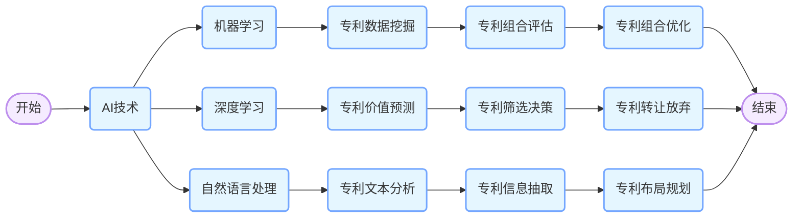

# AI驱动的企业知识产权战略：专利组合优化与布局

> 关键词：AI、企业知识产权战略、专利组合优化、专利布局、技术创新

> 摘要：本文聚焦于AI驱动下的企业知识产权战略，着重探讨专利组合优化与布局。在当今科技飞速发展的时代，AI技术为企业的知识产权管理带来了新的机遇和挑战。文章深入剖析了核心概念，阐述了相关算法原理，给出了数学模型及公式，通过项目实战案例展示具体操作，介绍了实际应用场景，推荐了学习资源、开发工具和相关论文著作，最后总结了未来发展趋势与挑战，并解答常见问题。旨在帮助企业利用AI技术更好地制定和实施知识产权战略，提升专利组合的质量和价值，实现更合理的专利布局。

## 1. 背景介绍 
### 1.1 目的和范围
在全球科技竞争日益激烈的背景下，企业的知识产权战略对于其生存和发展至关重要。专利作为企业知识产权的核心组成部分，其组合的优化和合理布局能够为企业带来巨大的竞争优势。随着人工智能技术的快速发展，AI为企业的专利管理提供了新的手段和方法。本文的目的在于探讨如何利用AI技术驱动企业的知识产权战略，特别是在专利组合优化与布局方面的应用。范围涵盖了从核心概念的阐述、算法原理的分析、数学模型的构建到实际项目案例的展示，以及相关资源的推荐等多个方面。

### 1.2 预期读者
本文的预期读者主要包括企业的知识产权管理人员、技术研发人员、战略规划人员，以及对人工智能和知识产权战略感兴趣的研究人员和学者。对于企业管理人员，本文可以为他们制定和实施有效的知识产权战略提供参考；对于技术研发人员，有助于他们更好地理解如何通过专利保护自己的创新成果；对于研究人员和学者，本文可以作为进一步深入研究的基础。

### 1.3 文档结构概述
本文首先介绍了相关的背景信息，包括目的、预期读者和文档结构。接着阐述了核心概念与联系，包括AI、专利组合优化和布局的原理及架构。然后详细讲解了核心算法原理和具体操作步骤，并给出了相应的Python源代码。之后介绍了数学模型和公式，并通过举例进行说明。再通过项目实战展示代码实际案例和详细解释。随后介绍了实际应用场景，推荐了相关的工具和资源。最后总结了未来发展趋势与挑战，解答了常见问题，并提供了扩展阅读和参考资料。

### 1.4 术语表
#### 1.4.1 核心术语定义
- **AI（Artificial Intelligence）**：人工智能，是指通过计算机技术模拟人类智能的一系列方法和技术，包括机器学习、深度学习、自然语言处理等。
- **专利组合**：企业拥有的一系列专利的集合，这些专利在技术领域、市场应用等方面可能存在一定的关联。
- **专利组合优化**：通过对企业专利组合进行评估、筛选和调整，提高专利组合的整体质量和价值，使其更好地适应企业的战略目标。
- **专利布局**：企业根据自身的技术研发方向、市场竞争态势等因素，有计划地申请和获得专利，以构建一个合理的专利保护体系。

#### 1.4.2 相关概念解释
- **机器学习**：AI的一个重要分支，通过让计算机从数据中学习模式和规律，从而实现对未知数据的预测和决策。
- **深度学习**：一种基于人工神经网络的机器学习方法，具有强大的特征提取和模式识别能力，在图像识别、语音识别等领域取得了显著的成果。
- **自然语言处理**：研究如何让计算机理解和处理人类语言的技术，包括文本分类、情感分析、信息抽取等任务。

#### 1.4.3 缩略词列表
- **ML（Machine Learning）**：机器学习
- **DL（Deep Learning）**：深度学习
- **NLP（Natural Language Processing）**：自然语言处理

## 2. 核心概念与联系 

### 核心概念原理
#### AI在专利管理中的应用原理
AI技术可以通过对大量专利数据的分析和挖掘，发现其中的潜在价值和规律。例如，机器学习算法可以对专利文本进行分类和聚类，帮助企业快速了解不同技术领域的专利分布情况；深度学习模型可以用于预测专利的价值和影响力，为专利组合优化提供决策依据；自然语言处理技术可以实现对专利文本的语义理解和信息抽取，帮助企业更好地掌握专利的核心内容。

#### 专利组合优化原理
专利组合优化的核心是根据企业的战略目标和资源状况，对专利组合进行评估和调整。评估指标可以包括专利的技术价值、市场价值、法律价值等。通过对这些指标的综合评估，企业可以确定哪些专利是核心专利，哪些专利可以进行转让或放弃，从而提高专利组合的整体质量和价值。

#### 专利布局原理
专利布局是企业在技术研发和市场竞争中进行的一种战略性规划。企业需要根据自身的技术优势和市场需求，确定专利布局的方向和重点。例如，企业可以在核心技术领域进行密集的专利布局，形成技术壁垒；也可以在新兴技术领域进行前瞻性的专利布局，为未来的发展奠定基础。

### 架构的文本示意图
```plaintext
              AI技术
            /   |   \
  机器学习  深度学习  自然语言处理
     |         |         |
专利数据挖掘  专利价值预测  专利文本分析
     |         |         |
  专利组合评估  专利筛选决策  专利信息抽取
     |         |         |
  专利组合优化  专利转让放弃  专利布局规划
```

### Mermaid流程图


## 3. 核心算法原理 & 具体操作步骤 

### 核心算法原理
#### 基于机器学习的专利分类算法
我们可以使用支持向量机（SVM）算法对专利进行分类。SVM是一种二分类模型，通过寻找一个最优的超平面将不同类别的样本分开。对于多分类问题，可以采用一对多（One-vs-Rest）或一对一（One-vs-One）的策略。

#### 基于深度学习的专利价值预测算法
可以使用卷积神经网络（CNN）对专利文本进行特征提取和价值预测。CNN通过卷积层、池化层和全连接层的组合，自动学习专利文本中的特征模式，从而预测专利的价值。

### 具体操作步骤及Python源代码

#### 基于机器学习的专利分类步骤及代码
1. **数据准备**：收集专利文本数据，并进行预处理，包括去除停用词、词干提取等。
2. **特征提取**：使用词袋模型（Bag of Words）或TF-IDF（Term Frequency-Inverse Document Frequency）方法将文本转换为向量表示。
3. **模型训练**：使用支持向量机（SVM）算法对数据进行训练。
4. **模型评估**：使用测试数据对训练好的模型进行评估。

```python
import pandas as pd
from sklearn.feature_extraction.text import TfidfVectorizer
from sklearn.svm import SVC
from sklearn.model_selection import train_test_split
from sklearn.metrics import accuracy_score

# 数据准备
data = pd.read_csv('patent_data.csv')
X = data['text']
y = data['category']

# 特征提取
vectorizer = TfidfVectorizer()
X_vectorized = vectorizer.fit_transform(X)

# 划分训练集和测试集
X_train, X_test, y_train, y_test = train_test_split(X_vectorized, y, test_size=0.2, random_state=42)

# 模型训练
model = SVC()
model.fit(X_train, y_train)

# 模型评估
y_pred = model.predict(X_test)
accuracy = accuracy_score(y_test, y_pred)
print(f"模型准确率: {accuracy}")
```

#### 基于深度学习的专利价值预测步骤及代码
1. **数据准备**：收集专利文本数据，并进行预处理，包括分词、构建词汇表等。
2. **特征提取**：使用词嵌入（Word Embedding）方法将文本转换为向量表示。
3. **模型构建**：构建卷积神经网络（CNN）模型。
4. **模型训练**：使用训练数据对模型进行训练。
5. **模型评估**：使用测试数据对训练好的模型进行评估。

```python
import numpy as np
import pandas as pd
from tensorflow.keras.preprocessing.text import Tokenizer
from tensorflow.keras.preprocessing.sequence import pad_sequences
from tensorflow.keras.models import Sequential
from tensorflow.keras.layers import Embedding, Conv1D, GlobalMaxPooling1D, Dense
from sklearn.model_selection import train_test_split

# 数据准备
data = pd.read_csv('patent_value_data.csv')
X = data['text']
y = data['value']

# 分词和构建词汇表
tokenizer = Tokenizer()
tokenizer.fit_on_texts(X)
vocab_size = len(tokenizer.word_index) + 1

# 文本转换为序列
X_sequences = tokenizer.texts_to_sequences(X)

# 填充序列
max_length = 100
X_padded = pad_sequences(X_sequences, maxlen=max_length)

# 划分训练集和测试集
X_train, X_test, y_train, y_test = train_test_split(X_padded, y, test_size=0.2, random_state=42)

# 模型构建
model = Sequential()
model.add(Embedding(vocab_size, 100, input_length=max_length))
model.add(Conv1D(128, 5, activation='relu'))
model.add(GlobalMaxPooling1D())
model.add(Dense(1, activation='sigmoid'))

# 模型编译
model.compile(optimizer='adam', loss='binary_crossentropy', metrics=['accuracy'])

# 模型训练
model.fit(X_train, y_train, epochs=10, batch_size=32, validation_data=(X_test, y_test))

# 模型评估
loss, accuracy = model.evaluate(X_test, y_test)
print(f"模型准确率: {accuracy}")
```

## 4. 数学模型和公式 & 详细讲解 & 举例说明 

### 支持向量机（SVM）数学模型和公式
#### 线性可分情况
对于线性可分的二分类问题，假设有训练数据集 $D = \{(x_1, y_1), (x_2, y_2), \cdots, (x_n, y_n)\}$，其中 $x_i \in \mathbb{R}^d$ 是输入特征向量，$y_i \in \{-1, +1\}$ 是类别标签。支持向量机的目标是找到一个最优的超平面 $w^T x + b = 0$，使得不同类别的样本能够被正确分开，并且间隔最大。

间隔的定义为：
$$\gamma = \frac{2}{\|w\|}$$

支持向量机的优化问题可以表示为：
$$\min_{w, b} \frac{1}{2} \|w\|^2$$
$$\text{s.t. } y_i (w^T x_i + b) \geq 1, i = 1, 2, \cdots, n$$

通过引入拉格朗日乘子 $\alpha_i \geq 0$，可以将上述约束优化问题转化为拉格朗日对偶问题：
$$\max_{\alpha} \sum_{i=1}^{n} \alpha_i - \frac{1}{2} \sum_{i=1}^{n} \sum_{j=1}^{n} \alpha_i \alpha_j y_i y_j x_i^T x_j$$
$$\text{s.t. } \sum_{i=1}^{n} \alpha_i y_i = 0, \alpha_i \geq 0, i = 1, 2, \cdots, n$$

求解上述对偶问题可以得到最优的拉格朗日乘子 $\alpha^*$，进而得到最优的 $w^*$ 和 $b^*$。

#### 线性不可分情况
对于线性不可分的情况，需要引入松弛变量 $\xi_i \geq 0$，允许一些样本点落在间隔带内甚至错误分类。优化问题变为：
$$\min_{w, b, \xi} \frac{1}{2} \|w\|^2 + C \sum_{i=1}^{n} \xi_i$$
$$\text{s.t. } y_i (w^T x_i + b) \geq 1 - \xi_i, \xi_i \geq 0, i = 1, 2, \cdots, n$$

其中 $C > 0$ 是惩罚参数，用于平衡间隔最大化和错误分类的惩罚。同样可以通过引入拉格朗日乘子将其转化为对偶问题进行求解。

### 举例说明
假设有一个二维数据集，包含两个类别的样本点。通过支持向量机算法，我们可以找到一个最优的超平面将这两个类别分开。在Python代码中，使用 `sklearn` 库的 `SVC` 类可以方便地实现支持向量机分类。

```python
import numpy as np
import matplotlib.pyplot as plt
from sklearn.svm import SVC

# 生成数据集
X = np.array([[3, 4], [1, 2], [4, 5], [2, 1]])
y = np.array([1, -1, 1, -1])

# 创建支持向量机模型
model = SVC(kernel='linear')
model.fit(X, y)

# 绘制决策边界
plt.scatter(X[:, 0], X[:, 1], c=y, cmap=plt.cm.Paired)
ax = plt.gca()
xlim = ax.get_xlim()
ylim = ax.get_ylim()

# 创建网格点
xx = np.linspace(xlim[0], xlim[1], 30)
yy = np.linspace(ylim[0], ylim[1], 30)
YY, XX = np.meshgrid(yy, xx)
xy = np.vstack([XX.ravel(), YY.ravel()]).T
Z = model.decision_function(xy).reshape(XX.shape)

# 绘制决策边界和间隔边界
ax.contour(XX, YY, Z, colors='k', levels=[-1, 0, 1], alpha=0.5, linestyles=['--', '-', '--'])
plt.show()
```

### 卷积神经网络（CNN）数学模型和公式
#### 卷积层
卷积层是CNN的核心层，通过卷积操作提取输入数据的特征。对于输入的二维图像 $X \in \mathbb{R}^{H \times W \times C}$（其中 $H$ 是高度，$W$ 是宽度，$C$ 是通道数），卷积核 $K \in \mathbb{R}^{h \times w \times C \times N}$（其中 $h$ 和 $w$ 是卷积核的高度和宽度，$N$ 是卷积核的数量），卷积操作可以表示为：
$$Y_{i, j, k} = \sum_{m=0}^{h-1} \sum_{n=0}^{w-1} \sum_{c=0}^{C-1} X_{i+m, j+n, c} K_{m, n, c, k} + b_k$$

其中 $Y \in \mathbb{R}^{(H - h + 1) \times (W - w + 1) \times N}$ 是卷积层的输出，$b_k$ 是偏置项。

#### 池化层
池化层用于降低特征图的维度，减少计算量。常见的池化操作有最大池化和平均池化。以最大池化为例，对于输入的特征图 $X \in \mathbb{R}^{H \times W \times C}$，池化窗口大小为 $p \times p$，步长为 $s$，最大池化操作可以表示为：
$$Y_{i, j, k} = \max_{m=0}^{p-1} \max_{n=0}^{p-1} X_{i \times s + m, j \times s + n, k}$$

#### 全连接层
全连接层将卷积层和池化层提取的特征进行组合，用于最终的分类或回归任务。对于输入的特征向量 $x \in \mathbb{R}^{d}$，全连接层的输出 $y \in \mathbb{R}^{D}$ 可以表示为：
$$y = Wx + b$$

其中 $W \in \mathbb{R}^{D \times d}$ 是权重矩阵，$b \in \mathbb{R}^{D}$ 是偏置向量。

### 举例说明
在前面的Python代码中，我们构建了一个简单的卷积神经网络用于专利价值预测。通过卷积层提取专利文本的特征，池化层降低特征维度，全连接层进行最终的预测。

## 5. 项目实战：代码实际案例和详细解释说明 

### 5.1  开发环境搭建
#### 安装Python
首先需要安装Python环境，建议使用Python 3.7及以上版本。可以从Python官方网站（https://www.python.org/downloads/）下载安装包进行安装。

#### 安装必要的库
使用 `pip` 命令安装必要的库，包括 `pandas`、`sklearn`、`tensorflow` 等。
```bash
pip install pandas scikit-learn tensorflow
```

### 5.2  源代码详细实现和代码解读
#### 基于机器学习的专利分类代码解读
```python
import pandas as pd
from sklearn.feature_extraction.text import TfidfVectorizer
from sklearn.svm import SVC
from sklearn.model_selection import train_test_split
from sklearn.metrics import accuracy_score

# 数据准备
data = pd.read_csv('patent_data.csv')
X = data['text']
y = data['category']

# 特征提取
vectorizer = TfidfVectorizer()
X_vectorized = vectorizer.fit_transform(X)

# 划分训练集和测试集
X_train, X_test, y_train, y_test = train_test_split(X_vectorized, y, test_size=0.2, random_state=42)

# 模型训练
model = SVC()
model.fit(X_train, y_train)

# 模型评估
y_pred = model.predict(X_test)
accuracy = accuracy_score(y_test, y_pred)
print(f"模型准确率: {accuracy}")
```
- **数据准备**：使用 `pandas` 库读取包含专利文本和类别的CSV文件，并将文本数据和类别标签分别存储在 `X` 和 `y` 中。
- **特征提取**：使用 `TfidfVectorizer` 将文本数据转换为TF-IDF向量表示，以便机器学习模型能够处理。
- **划分训练集和测试集**：使用 `train_test_split` 函数将数据集划分为训练集和测试集，测试集占比为20%。
- **模型训练**：创建一个支持向量机模型 `SVC`，并使用训练集数据进行训练。
- **模型评估**：使用训练好的模型对测试集数据进行预测，并计算预测准确率。

#### 基于深度学习的专利价值预测代码解读
```python
import numpy as np
import pandas as pd
from tensorflow.keras.preprocessing.text import Tokenizer
from tensorflow.keras.preprocessing.sequence import pad_sequences
from tensorflow.keras.models import Sequential
from tensorflow.keras.layers import Embedding, Conv1D, GlobalMaxPooling1D, Dense
from sklearn.model_selection import train_test_split

# 数据准备
data = pd.read_csv('patent_value_data.csv')
X = data['text']
y = data['value']

# 分词和构建词汇表
tokenizer = Tokenizer()
tokenizer.fit_on_texts(X)
vocab_size = len(tokenizer.word_index) + 1

# 文本转换为序列
X_sequences = tokenizer.texts_to_sequences(X)

# 填充序列
max_length = 100
X_padded = pad_sequences(X_sequences, maxlen=max_length)

# 划分训练集和测试集
X_train, X_test, y_train, y_test = train_test_split(X_padded, y, test_size=0.2, random_state=42)

# 模型构建
model = Sequential()
model.add(Embedding(vocab_size, 100, input_length=max_length))
model.add(Conv1D(128, 5, activation='relu'))
model.add(GlobalMaxPooling1D())
model.add(Dense(1, activation='sigmoid'))

# 模型编译
model.compile(optimizer='adam', loss='binary_crossentropy', metrics=['accuracy'])

# 模型训练
model.fit(X_train, y_train, epochs=10, batch_size=32, validation_data=(X_test, y_test))

# 模型评估
loss, accuracy = model.evaluate(X_test, y_test)
print(f"模型准确率: {accuracy}")
```
- **数据准备**：使用 `pandas` 库读取包含专利文本和价值标签的CSV文件，并将文本数据和价值标签分别存储在 `X` 和 `y` 中。
- **分词和构建词汇表**：使用 `Tokenizer` 对文本数据进行分词，并构建词汇表。
- **文本转换为序列**：将文本数据转换为整数序列，每个整数对应词汇表中的一个单词。
- **填充序列**：使用 `pad_sequences` 函数将序列填充到固定长度，以便输入到神经网络中。
- **划分训练集和测试集**：使用 `train_test_split` 函数将数据集划分为训练集和测试集，测试集占比为20%。
- **模型构建**：使用 `Sequential` 模型构建一个卷积神经网络，包括嵌入层、卷积层、池化层和全连接层。
- **模型编译**：使用 `compile` 方法编译模型，指定优化器、损失函数和评估指标。
- **模型训练**：使用 `fit` 方法对模型进行训练，指定训练轮数、批次大小和验证集。
- **模型评估**：使用 `evaluate` 方法对训练好的模型进行评估，计算损失和准确率。

### 5.3  代码解读与分析
#### 基于机器学习的专利分类代码分析
- **优点**：支持向量机算法具有较好的泛化能力，对于小规模数据集和线性可分问题有较好的表现。TF-IDF特征提取方法简单有效，能够反映文本中单词的重要性。
- **缺点**：对于大规模数据集和复杂的非线性问题，支持向量机的训练时间可能较长，且需要进行特征工程和参数调优。

#### 基于深度学习的专利价值预测代码分析
- **优点**：卷积神经网络能够自动学习文本的特征模式，对于复杂的非线性问题有较好的表现。词嵌入层可以将单词表示为低维向量，捕捉单词之间的语义关系。
- **缺点**：深度学习模型需要大量的训练数据和计算资源，训练时间较长，且模型解释性较差。

## 6. 实际应用场景 
### 专利组合评估与优化
企业可以使用AI技术对自身的专利组合进行评估，确定哪些专利具有较高的价值，哪些专利可以进行转让或放弃。例如，通过分析专利的技术领域、引用次数、市场需求等因素，预测专利的未来价值。根据评估结果，企业可以对专利组合进行优化，集中资源保护和发展核心专利。

### 专利布局规划
AI可以帮助企业进行专利布局规划。通过对技术趋势和市场竞争态势的分析，企业可以确定专利布局的方向和重点。例如，在新兴技术领域，企业可以提前进行专利布局，抢占技术制高点；在核心技术领域，企业可以进行密集的专利布局，形成技术壁垒。

### 竞争对手专利分析
企业可以利用AI技术对竞争对手的专利进行分析，了解竞争对手的技术研发方向和专利战略。通过分析竞争对手的专利文本、技术领域、申请时间等信息，企业可以发现潜在的竞争威胁，及时调整自身的知识产权战略。

### 专利侵权预警
AI可以通过对专利文本的相似度分析，实现专利侵权预警。当企业发现有新的专利申请与自身的专利存在较高的相似度时，可以及时采取措施，避免侵权风险。

## 7. 工具和资源推荐
### 7.1 学习资源推荐
#### 7.1.1 书籍推荐
- 《人工智能：一种现代的方法》：这本书是人工智能领域的经典教材，全面介绍了人工智能的各个方面，包括搜索算法、机器学习、自然语言处理等。
- 《Python机器学习》：详细介绍了使用Python进行机器学习的方法和技术，包括数据预处理、模型选择、评估和优化等。
- 《深度学习》：由深度学习领域的三位先驱Ian Goodfellow、Yoshua Bengio和Aaron Courville撰写，是深度学习领域的权威著作。

#### 7.1.2 在线课程
- Coursera上的“机器学习”课程：由斯坦福大学教授Andrew Ng主讲，是机器学习领域的经典课程，涵盖了机器学习的基本概念、算法和应用。
- edX上的“深度学习”课程：由Facebook人工智能研究实验室主任Yoshua Bengio和谷歌大脑团队的Jeff Dean等专家授课，深入介绍了深度学习的原理和应用。
- 中国大学MOOC上的“人工智能基础”课程：由国内多所高校的教授联合授课，适合初学者入门学习人工智能的基本概念和方法。

#### 7.1.3 技术博客和网站
- Medium：上面有很多关于人工智能和机器学习的优秀博客文章，涵盖了最新的研究成果和实践经验。
- Towards Data Science：专注于数据科学和机器学习领域的技术博客，提供了大量的教程和案例分析。
- arXiv：是一个预印本服务器，提供了大量的学术论文，包括人工智能、机器学习等领域的最新研究成果。

### 7.2 开发工具框架推荐
#### 7.2.1 IDE和编辑器
- PyCharm：是一款专门为Python开发设计的集成开发环境，具有代码自动补全、调试、版本控制等功能，适合开发大型Python项目。
- Jupyter Notebook：是一个交互式的开发环境，支持Python、R等多种编程语言，适合进行数据探索、模型训练和可视化等工作。
- Visual Studio Code：是一款轻量级的代码编辑器，支持多种编程语言和插件扩展，具有丰富的功能和良好的用户体验。

#### 7.2.2 调试和性能分析工具
- TensorBoard：是TensorFlow提供的一个可视化工具，可以用于监控模型训练过程、可视化模型结构和分析模型性能。
- Py-Spy：是一个用于Python程序性能分析的工具，可以实时监控Python程序的CPU使用率和函数调用情况。
- cProfile：是Python标准库中的一个性能分析工具，可以用于分析Python程序的性能瓶颈。

#### 7.2.3 相关框架和库
- Scikit-learn：是一个用于机器学习的Python库，提供了丰富的机器学习算法和工具，包括分类、回归、聚类等。
- TensorFlow：是一个开源的深度学习框架，由谷歌开发，支持多种深度学习模型和算法，广泛应用于图像识别、语音识别等领域。
- PyTorch：是一个开源的深度学习框架，由Facebook开发，具有动态图和静态图两种模式，适合进行深度学习研究和开发。

### 7.3 相关论文著作推荐
#### 7.3.1 经典论文
- “Support-Vector Networks”：介绍了支持向量机的基本原理和算法，是支持向量机领域的经典论文。
- “ImageNet Classification with Deep Convolutional Neural Networks”：介绍了AlexNet卷积神经网络，开创了深度学习在图像识别领域的先河。
- “Attention Is All You Need”：提出了Transformer模型，在自然语言处理领域取得了巨大的成功。

#### 7.3.2 最新研究成果
- 可以关注NeurIPS、ICML、CVPR等顶级学术会议上的最新研究成果，了解人工智能和机器学习领域的前沿动态。
- 一些知名的学术期刊，如Journal of Artificial Intelligence Research、Artificial Intelligence等，也会发表人工智能领域的最新研究论文。

#### 7.3.3 应用案例分析
- 可以参考一些企业的专利战略报告和案例分析，了解他们如何利用AI技术进行专利组合优化和布局。
- 一些咨询公司和研究机构也会发布关于知识产权战略和AI应用的研究报告，可以从中获取相关的应用案例和经验。

## 8. 总结：未来发展趋势与挑战
### 未来发展趋势
#### AI技术的不断创新
随着AI技术的不断发展，新的算法和模型将不断涌现，为企业的知识产权战略提供更强大的支持。例如，强化学习、生成对抗网络等技术可能会在专利管理中得到更广泛的应用。

#### 与大数据和云计算的融合
AI技术与大数据和云计算的融合将更加紧密。通过整合海量的专利数据和其他相关数据，利用云计算的强大计算能力，企业可以更高效地进行专利分析和决策。

#### 跨领域应用的拓展
AI在企业知识产权战略中的应用将不仅仅局限于专利管理，还将拓展到商标、版权等其他知识产权领域。同时，AI技术也将与其他领域的技术，如区块链、物联网等进行融合，创造更多的应用场景。

### 挑战
#### 数据质量和隐私问题
AI技术的应用依赖于大量的高质量数据。然而，专利数据的质量可能存在差异，且数据隐私问题也需要得到重视。企业需要解决数据清洗、标注和安全等问题，以确保AI模型的准确性和可靠性。

#### 技术人才短缺
AI技术的应用需要具备专业知识和技能的人才。目前，AI领域的技术人才相对短缺，企业需要加强人才培养和引进，以满足知识产权战略中AI应用的需求。

#### 法律和政策的不确定性
随着AI技术在知识产权领域的应用不断增加，相关的法律和政策也需要不断完善。目前，对于AI生成的知识产权归属、专利审查标准等问题还存在一定的不确定性，企业需要密切关注法律和政策的变化，以应对可能的风险。

## 9. 附录：常见问题与解答
### 问题1：AI技术在专利组合优化和布局中的应用效果如何？
解答：AI技术可以通过对大量专利数据的分析和挖掘，为企业提供更准确的专利评估和决策支持。例如，通过机器学习算法可以预测专利的价值和影响力，帮助企业确定核心专利；通过对技术趋势和市场竞争态势的分析，帮助企业进行合理的专利布局。然而，AI技术的应用效果也受到数据质量、算法选择和模型训练等因素的影响，需要企业进行合理的应用和优化。

### 问题2：企业在应用AI技术进行知识产权战略制定时需要注意哪些问题？
解答：企业在应用AI技术进行知识产权战略制定时，需要注意以下几个问题：
- **数据质量**：确保使用的专利数据准确、完整和一致，避免因数据质量问题影响AI模型的性能。
- **算法选择**：根据具体的应用场景和需求，选择合适的AI算法和模型。例如，对于分类问题可以选择支持向量机、决策树等算法；对于预测问题可以选择神经网络、深度学习等算法。
- **模型评估和优化**：定期对AI模型进行评估和优化，确保模型的准确性和可靠性。可以使用交叉验证、网格搜索等方法进行模型选择和参数调优。
- **法律和政策合规**：遵守相关的法律和政策规定，确保AI技术的应用符合知识产权保护的要求。例如，在使用专利数据时需要获得合法授权，避免侵犯他人的知识产权。

### 问题3：如何衡量AI驱动的专利组合优化和布局的效果？
解答：可以从以下几个方面衡量AI驱动的专利组合优化和布局的效果：
- **专利价值提升**：通过分析专利的技术价值、市场价值和法律价值等指标，评估专利组合的整体价值是否得到提升。
- **市场竞争力增强**：观察企业在市场中的竞争地位是否得到改善，例如市场份额是否增加、产品销售是否增长等。
- **技术创新能力提升**：评估企业的技术创新能力是否得到增强，例如专利申请数量和质量是否提高、研发效率是否提升等。
- **风险降低**：分析企业面临的知识产权风险是否降低，例如专利侵权纠纷是否减少、专利无效宣告请求是否减少等。

## 10. 扩展阅读 & 参考资料
### 扩展阅读
- 《知识产权管理》：介绍了企业知识产权管理的基本理论和方法，包括专利、商标、版权等方面的管理。
- 《AI时代的知识产权战略》：探讨了AI技术对知识产权战略的影响和挑战，以及企业如何应对这些挑战。
- 《专利战略管理》：详细介绍了企业专利战略的制定和实施方法，包括专利布局、专利组合管理、专利运营等方面。

### 参考资料
- 《人工智能基础教程》
- 《机器学习实战》
- 《深度学习实战》
- 各学术期刊和会议上发表的相关研究论文

作者：AI天才研究院/AI Genius Institute & 禅与计算机程序设计艺术 /Zen And The Art of Computer Programming