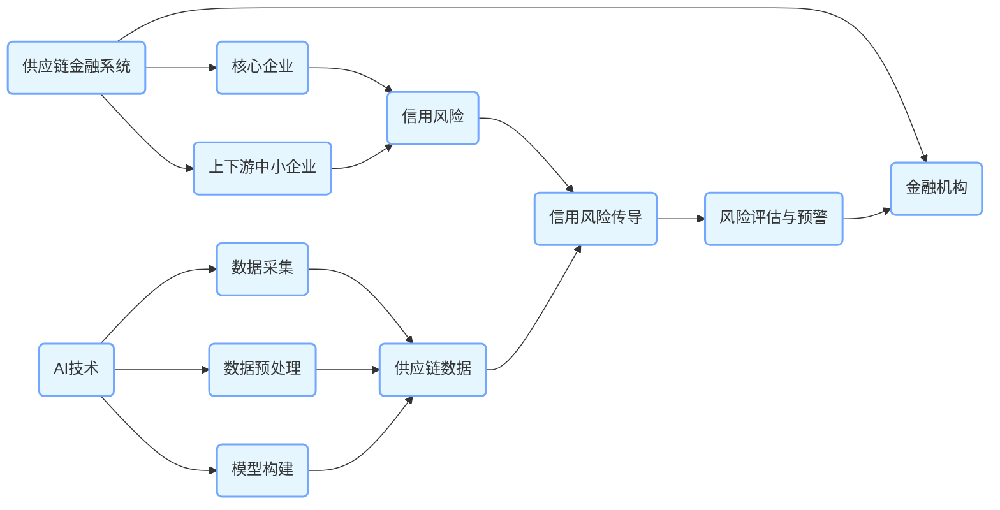

# AI驱动的供应链金融信用风险传导分析

> 关键词：AI、供应链金融、信用风险传导、数据分析、风险评估

> 摘要：本文聚焦于AI驱动下的供应链金融信用风险传导问题。首先介绍了研究的背景、目的、预期读者和文档结构等内容。接着阐述了供应链金融、信用风险传导以及AI相关的核心概念和它们之间的联系，并给出了相应的原理和架构示意图及流程图。详细讲解了用于分析信用风险传导的核心算法原理，用Python代码进行了示例。同时给出了相关的数学模型和公式，并举例说明。通过项目实战，展示了开发环境搭建、源代码实现及代码解读。探讨了该研究在实际中的应用场景，推荐了学习资源、开发工具框架以及相关论文著作。最后总结了未来发展趋势与挑战，并对常见问题进行了解答，提供了扩展阅读和参考资料。

## 1. 背景介绍 
### 1.1 目的和范围
随着供应链金融业务的不断发展，信用风险成为了制约其健康发展的关键因素。信用风险在供应链中并非孤立存在，而是会在各个参与主体之间传导和扩散。本研究的目的在于借助AI技术，深入分析供应链金融信用风险的传导机制，准确识别风险源和风险传导路径，为供应链金融参与者提供有效的风险防控策略。研究范围涵盖了供应链金融中的核心企业、上下游中小企业、金融机构等主要参与主体，以及各类常见的供应链金融业务模式。

### 1.2 预期读者
本文的预期读者包括供应链金融领域的从业者，如银行信贷人员、供应链金融平台运营人员等；金融科技领域的技术开发者，尤其是对AI在金融领域应用感兴趣的人员；以及相关专业的研究人员和学生，希望通过本文了解AI在供应链金融信用风险分析中的应用原理和方法。

### 1.3 文档结构概述
本文首先对相关背景进行介绍，明确研究的目的和范围。接着阐述核心概念及其联系，为后续的分析奠定基础。然后详细讲解核心算法原理和具体操作步骤，并用Python代码进行实现。给出相关的数学模型和公式，并通过具体例子进行说明。通过项目实战展示如何将理论应用到实际中。探讨实际应用场景，为读者提供实际参考。推荐相关的学习资源、开发工具框架和论文著作。最后总结未来发展趋势与挑战，解答常见问题，并提供扩展阅读和参考资料。

### 1.4 术语表
#### 1.4.1 核心术语定义
- **供应链金融**：指金融机构围绕核心企业，管理上下游中小企业的资金流和物流，并把单个企业的不可控风险转变为供应链企业整体的可控风险，通过立体获取各类信息，将风险控制在最低的金融服务。
- **信用风险传导**：指在供应链金融中，某个参与主体的信用风险会通过供应链上的交易关系、资金流动等渠道，传递给其他参与主体，导致风险在供应链中扩散的现象。
- **AI（人工智能）**：是研究、开发用于模拟、延伸和扩展人的智能的理论、方法、技术及应用系统的一门新的技术科学，在本文中主要用于数据分析、模型构建等以辅助信用风险传导分析。

#### 1.4.2 相关概念解释
- **核心企业**：在供应链中具有较强市场竞争力和话语权的企业，通常是供应链的主导者，其信用状况对上下游企业和整个供应链金融体系有着重要影响。
- **上下游中小企业**：围绕核心企业开展业务的中小企业，它们在供应链中处于相对弱势地位，信用风险相对较高，且容易受到核心企业信用风险的影响。
- **金融机构**：为供应链金融业务提供资金支持的机构，如银行等，需要对供应链中的信用风险进行准确评估和管理。

#### 1.4.3 缩略词列表
- **AI**：Artificial Intelligence（人工智能）
- **ML**：Machine Learning（机器学习）
- **DL**：Deep Learning（深度学习）

## 2. 核心概念与联系 
### 核心概念原理
#### 供应链金融原理
供应链金融基于供应链上企业之间的真实交易关系，金融机构通过对供应链上的物流、信息流和资金流进行整合和监控，为供应链中的企业提供融资服务。核心企业凭借其良好的信用和市场地位，能够为上下游中小企业增信，使得金融机构更愿意为中小企业提供贷款。例如，在应收账款融资模式中，中小企业将其对核心企业的应收账款转让给金融机构，金融机构根据应收账款的金额和质量为中小企业提供融资。

#### 信用风险传导原理
信用风险传导主要通过供应链上的交易关系、资金流动和信息传递等渠道进行。当供应链中的某个企业出现信用问题，如违约、破产等，会影响与其有交易往来的上下游企业的资金流和经营状况。例如，核心企业的违约可能导致下游企业无法按时收到货物，从而影响其生产和销售，进而增加下游企业的信用风险；同时，核心企业的信用问题也可能导致金融机构收紧对上下游企业的融资政策，进一步加剧了信用风险的传导。

#### AI原理
AI在供应链金融信用风险传导分析中主要通过机器学习和深度学习算法来实现。机器学习算法可以对大量的供应链金融数据进行挖掘和分析，发现数据中的规律和模式，从而构建信用风险评估模型。深度学习算法则可以处理复杂的非线性数据，如文本、图像等，能够更准确地捕捉信用风险传导的特征和趋势。例如，利用神经网络算法可以对供应链上企业的财务数据、交易数据、市场数据等进行综合分析，预测企业的信用风险。

### 架构示意图


该架构示意图展示了供应链金融系统中各参与主体与信用风险传导的关系，以及AI技术在信用风险传导分析中的应用。AI技术通过数据采集、预处理和模型构建等步骤，对供应链数据进行分析，从而实现对信用风险传导的监测和评估，并将结果反馈给金融机构，为其决策提供支持。

## 3. 核心算法原理 & 具体操作步骤 
### 核心算法原理
在供应链金融信用风险传导分析中，常用的机器学习算法包括逻辑回归、决策树和支持向量机等，深度学习算法包括神经网络等。这里以逻辑回归算法为例进行详细讲解。

逻辑回归是一种用于分类问题的统计模型，它通过对输入特征进行线性组合，然后通过逻辑函数将其转换为概率值。逻辑函数的表达式为：

$$\sigma(z)=\frac{1}{1 + e^{-z}}$$

其中，$z$ 是输入特征的线性组合，即 $z = \theta_0 + \theta_1x_1 + \theta_2x_2 + \cdots + \theta_nx_n$，$\theta$ 是模型的参数，$x$ 是输入特征。

逻辑回归的目标是通过训练数据来估计模型的参数 $\theta$，使得模型能够准确地预测样本的类别。通常使用最大似然估计法来求解参数，即最大化似然函数：

$$L(\theta)=\prod_{i=1}^{m}P(y^{(i)}|x^{(i)};\theta)$$

其中，$m$ 是训练样本的数量，$y^{(i)}$ 是第 $i$ 个样本的真实类别，$x^{(i)}$ 是第 $i$ 个样本的输入特征。

### 具体操作步骤
#### 数据采集
收集供应链金融相关的数据，包括企业的财务数据、交易数据、信用评级数据等。数据来源可以包括企业的财务报表、供应链金融平台的交易记录、第三方信用评级机构的数据等。

#### 数据预处理
对采集到的数据进行清洗、转换和归一化等处理，以提高数据的质量和可用性。具体操作包括处理缺失值、异常值，对分类变量进行编码，对数值变量进行归一化等。

#### 特征选择
从预处理后的数据中选择与信用风险传导相关的特征，以减少模型的复杂度和提高模型的准确性。常用的特征选择方法包括相关性分析、方差分析等。

#### 模型训练
使用训练数据对逻辑回归模型进行训练，估计模型的参数 $\theta$。可以使用梯度下降法等优化算法来求解最大似然估计问题。

#### 模型评估
使用测试数据对训练好的模型进行评估，计算模型的准确率、召回率、F1值等指标，以评估模型的性能。

#### 风险预测与预警
使用训练好的模型对新的样本进行预测，判断其是否存在信用风险，并根据预测结果进行风险预警。

### Python源代码实现
```python
import numpy as np
from sklearn.linear_model import LogisticRegression
from sklearn.model_selection import train_test_split
from sklearn.preprocessing import StandardScaler
from sklearn.metrics import accuracy_score, recall_score, f1_score

# 生成示例数据
np.random.seed(42)
X = np.random.randn(100, 5)  # 100个样本，每个样本有5个特征
y = np.random.randint(0, 2, 100)  # 随机生成0或1的标签

# 数据划分
X_train, X_test, y_train, y_test = train_test_split(X, y, test_size=0.2, random_state=42)

# 数据标准化
scaler = StandardScaler()
X_train = scaler.fit_transform(X_train)
X_test = scaler.transform(X_test)

# 模型训练
model = LogisticRegression()
model.fit(X_train, y_train)

# 模型预测
y_pred = model.predict(X_test)

# 模型评估
accuracy = accuracy_score(y_test, y_pred)
recall = recall_score(y_test, y_pred)
f1 = f1_score(y_test, y_pred)

print(f"Accuracy: {accuracy}")
print(f"Recall: {recall}")
print(f"F1-score: {f1}")
```

## 4. 数学模型和公式 & 详细讲解 & 举例说明 
### 逻辑回归模型
逻辑回归模型的数学表达式为：

$$P(y = 1|x;\theta)=\frac{1}{1 + e^{-(\theta_0 + \theta_1x_1 + \theta_2x_2 + \cdots + \theta_nx_n)}}$$

其中，$P(y = 1|x;\theta)$ 表示在给定输入特征 $x$ 和模型参数 $\theta$ 的情况下，样本属于类别 1 的概率。当 $P(y = 1|x;\theta) > 0.5$ 时，预测样本属于类别 1；当 $P(y = 1|x;\theta) \leq 0.5$ 时，预测样本属于类别 0。

### 最大似然估计
最大似然估计的目标是找到一组参数 $\theta$，使得训练数据的似然函数 $L(\theta)$ 最大。似然函数的对数形式为：

$$\log L(\theta)=\sum_{i=1}^{m}[y^{(i)}\log P(y^{(i)} = 1|x^{(i)};\theta)+(1 - y^{(i)})\log(1 - P(y^{(i)} = 1|x^{(i)};\theta))]$$

通过最大化对数似然函数，可以得到模型的最优参数 $\theta$。通常使用梯度下降法来求解这个优化问题。

### 梯度下降法
梯度下降法是一种迭代优化算法，用于求解函数的最小值。在逻辑回归中，我们需要最大化对数似然函数，因此可以通过最小化负对数似然函数来实现。负对数似然函数的表达式为：

$$J(\theta)=-\frac{1}{m}\log L(\theta)$$

梯度下降法的迭代公式为：

$$\theta_j := \theta_j-\alpha\frac{\partial J(\theta)}{\partial \theta_j}$$

其中，$\alpha$ 是学习率，控制每次迭代的步长。$\frac{\partial J(\theta)}{\partial \theta_j}$ 是负对数似然函数关于参数 $\theta_j$ 的偏导数，其表达式为：

$$\frac{\partial J(\theta)}{\partial \theta_j}=\frac{1}{m}\sum_{i=1}^{m}(P(y^{(i)} = 1|x^{(i)};\theta)-y^{(i)})x_j^{(i)}$$

### 举例说明
假设我们有一个简单的供应链金融信用风险评估问题，我们收集了 10 个企业的财务数据，包括资产负债率、流动比率和利润率，以及它们的信用评级（违约或不违约）。我们将使用逻辑回归模型来预测企业的信用风险。

| 企业编号 | 资产负债率 | 流动比率 | 利润率 | 信用评级（0: 不违约，1: 违约） |
| ---- | ---- | ---- | ---- | ---- |
| 1 | 0.6 | 1.2 | 0.1 | 0 |
| 2 | 0.8 | 0.9 | 0.05 | 1 |
| 3 | 0.4 | 1.5 | 0.15 | 0 |
| 4 | 0.7 | 1.1 | 0.08 | 1 |
| 5 | 0.5 | 1.3 | 0.12 | 0 |
| 6 | 0.9 | 0.8 | 0.03 | 1 |
| 7 | 0.3 | 1.6 | 0.2 | 0 |
| 8 | 0.75 | 1.05 | 0.06 | 1 |
| 9 | 0.45 | 1.4 | 0.13 | 0 |
| 10 | 0.85 | 0.95 | 0.04 | 1 |

我们可以使用 Python 代码来实现逻辑回归模型的训练和预测：

```python
import numpy as np
from sklearn.linear_model import LogisticRegression

# 输入特征
X = np.array([[0.6, 1.2, 0.1],
              [0.8, 0.9, 0.05],
              [0.4, 1.5, 0.15],
              [0.7, 1.1, 0.08],
              [0.5, 1.3, 0.12],
              [0.9, 0.8, 0.03],
              [0.3, 1.6, 0.2],
              [0.75, 1.05, 0.06],
              [0.45, 1.4, 0.13],
              [0.85, 0.95, 0.04]])

# 标签
y = np.array([0, 1, 0, 1, 0, 1, 0, 1, 0, 1])

# 模型训练
model = LogisticRegression()
model.fit(X, y)

# 预测新样本
new_sample = np.array([[0.7, 1.0, 0.07]])
prediction = model.predict(new_sample)
probability = model.predict_proba(new_sample)

print(f"Prediction: {prediction[0]}")
print(f"Probability: {probability[0]}")
```

在这个例子中，我们使用逻辑回归模型对新的企业样本进行了信用风险预测，并得到了预测结果和对应的概率。

## 5. 项目实战：代码实际案例和详细解释说明 
### 5.1  开发环境搭建
#### 操作系统
建议使用 Linux 或 macOS 系统，因为它们对 Python 开发和数据处理有更好的支持。如果使用 Windows 系统，也可以通过安装 Anaconda 来搭建开发环境。

#### Python 环境
安装 Python 3.7 及以上版本。可以通过 Anaconda 来管理 Python 环境，Anaconda 是一个开源的 Python 发行版，包含了许多常用的科学计算和数据分析库。

#### 安装必要的库
在命令行中使用以下命令安装必要的库：
```bash
pip install numpy pandas scikit-learn matplotlib seaborn
```

### 5.2  源代码详细实现和代码解读
```python
import numpy as np
import pandas as pd
from sklearn.model_selection import train_test_split
from sklearn.preprocessing import StandardScaler
from sklearn.linear_model import LogisticRegression
from sklearn.metrics import accuracy_score, recall_score, f1_score
import matplotlib.pyplot as plt
import seaborn as sns

# 数据加载
data = pd.read_csv('supply_chain_finance_data.csv')

# 数据探索
print(data.head())
print(data.info())
print(data.describe())

# 数据可视化
corr_matrix = data.corr()
plt.figure(figsize=(10, 8))
sns.heatmap(corr_matrix, annot=True, cmap='coolwarm')
plt.show()

# 特征选择和数据划分
X = data.drop('credit_rating', axis=1)
y = data['credit_rating']

X_train, X_test, y_train, y_test = train_test_split(X, y, test_size=0.2, random_state=42)

# 数据标准化
scaler = StandardScaler()
X_train = scaler.fit_transform(X_train)
X_test = scaler.transform(X_test)

# 模型训练
model = LogisticRegression()
model.fit(X_train, y_train)

# 模型预测
y_pred = model.predict(X_test)

# 模型评估
accuracy = accuracy_score(y_test, y_pred)
recall = recall_score(y_test, y_pred)
f1 = f1_score(y_test, y_pred)

print(f"Accuracy: {accuracy}")
print(f"Recall: {recall}")
print(f"F1-score: {f1}")

# 特征重要性分析
feature_importance = pd.DataFrame({'feature': X.columns, 'importance': model.coef_[0]})
feature_importance = feature_importance.sort_values(by='importance', ascending=False)

plt.figure(figsize=(10, 6))
sns.barplot(x='importance', y='feature', data=feature_importance)
plt.title('Feature Importance')
plt.show()
```

### 代码解读与分析
#### 数据加载
使用 `pandas` 库的 `read_csv` 函数加载供应链金融数据。

#### 数据探索
使用 `head()`、`info()` 和 `describe()` 方法对数据进行初步探索，了解数据的基本信息和统计特征。

#### 数据可视化
使用 `seaborn` 库的 `heatmap` 函数绘制相关系数矩阵的热力图，直观地展示特征之间的相关性。

#### 特征选择和数据划分
将数据分为特征矩阵 $X$ 和标签向量 $y$，并使用 `train_test_split` 函数将数据划分为训练集和测试集。

#### 数据标准化
使用 `StandardScaler` 对特征矩阵进行标准化处理，使得特征具有相同的尺度，提高模型的训练效果。

#### 模型训练
使用 `LogisticRegression` 模型对训练数据进行训练。

#### 模型预测
使用训练好的模型对测试数据进行预测。

#### 模型评估
使用 `accuracy_score`、`recall_score` 和 `f1_score` 等指标对模型的性能进行评估。

#### 特征重要性分析
通过查看逻辑回归模型的系数，分析各个特征对信用风险预测的重要性，并使用 `seaborn` 库的 `barplot` 函数绘制特征重要性图。

## 6. 实际应用场景 
### 金融机构信贷决策
金融机构在进行供应链金融信贷业务时，可以利用AI驱动的信用风险传导分析模型，对供应链中的企业进行全面的信用评估。通过分析企业之间的信用风险传导关系，金融机构可以更准确地判断企业的实际信用状况，从而决定是否给予贷款以及贷款的额度和利率。例如，当核心企业出现信用风险时，金融机构可以根据风险传导模型预测其对上下游企业的影响，及时调整对上下游企业的信贷政策，降低信贷风险。

### 供应链企业风险管理
供应链中的企业可以利用该分析模型对自身和合作伙伴的信用风险进行监测和管理。企业可以通过实时监控供应链中的信用风险传导情况，及时发现潜在的风险源，并采取相应的措施进行防范和应对。例如，当发现上游供应商的信用风险增加时，企业可以提前寻找替代供应商，或者调整采购计划，以减少对自身生产经营的影响。

### 监管部门风险监管
监管部门可以利用AI技术对供应链金融市场进行全面的风险监管。通过分析供应链金融信用风险传导数据，监管部门可以及时发现市场中的系统性风险和潜在的风险隐患，采取有效的监管措施，维护市场的稳定和健康发展。例如，监管部门可以要求金融机构定期上报供应链金融信用风险传导分析报告，以便及时掌握市场动态。

## 7. 工具和资源推荐
### 7.1 学习资源推荐
#### 7.1.1 书籍推荐
- 《Python 数据分析实战》：本书详细介绍了使用 Python 进行数据分析的方法和技巧，包括数据采集、清洗、分析和可视化等方面，对于学习供应链金融数据分析非常有帮助。
- 《机器学习》（周志华著）：这是一本经典的机器学习教材，全面介绍了机器学习的基本概念、算法和应用，对于理解和应用AI算法进行信用风险分析具有重要的指导意义。
- 《供应链金融：新经济下的金融创新》：本书系统介绍了供应链金融的理论和实践，包括供应链金融的业务模式、风险管理等方面，有助于深入了解供应链金融领域。

#### 7.1.2 在线课程
- Coursera 上的 “机器学习” 课程：由斯坦福大学教授 Andrew Ng 主讲，是一门非常经典的机器学习在线课程，内容涵盖了机器学习的基本概念、算法和应用。
- edX 上的 “Python 数据科学” 课程：该课程介绍了使用 Python 进行数据科学的方法和工具，包括数据处理、数据分析和机器学习等方面。
- 中国大学MOOC上的 “供应链金融” 课程：由国内高校教授主讲，系统介绍了供应链金融的理论和实践，对于了解供应链金融领域具有重要的参考价值。

#### 7.1.3 技术博客和网站
- 机器学习算法与Python实践：该博客分享了大量的机器学习算法和Python实践案例，对于学习和应用AI技术进行信用风险分析非常有帮助。
- 数据派THU：该网站专注于数据分析和数据科学领域，提供了丰富的行业资讯、技术文章和案例分析。
- 供应链金融研究网：该网站专注于供应链金融领域的研究和实践，提供了供应链金融的最新动态、政策法规和案例分析等内容。

### 7.2 开发工具框架推荐
#### 7.2.1 IDE和编辑器
- PyCharm：是一款专门为 Python 开发设计的集成开发环境（IDE），具有代码编辑、调试、版本控制等功能，非常适合Python 数据分析和机器学习开发。
- Jupyter Notebook：是一个基于 Web 的交互式计算环境，支持多种编程语言，特别适合进行数据探索、模型训练和可视化等工作。
- Visual Studio Code：是一款轻量级的代码编辑器，支持多种编程语言和插件扩展，具有强大的代码编辑和调试功能。

#### 7.2.2 调试和性能分析工具
- Py-Spy：是一个用于 Python 代码性能分析的工具，可以实时监测 Python 程序的 CPU 使用率和函数调用情况，帮助开发者找出性能瓶颈。
- cProfile：是 Python 内置的性能分析工具，可以统计 Python 程序中各个函数的调用次数和执行时间，帮助开发者优化代码性能。
- TensorBoard：是 TensorFlow 提供的可视化工具，可以用于可视化神经网络模型的训练过程和性能指标，帮助开发者更好地理解和调试模型。

#### 7.2.3 相关框架和库
- Scikit-learn：是一个常用的机器学习库，提供了丰富的机器学习算法和工具，包括分类、回归、聚类等算法，以及数据预处理、模型评估等功能。
- TensorFlow：是一个开源的深度学习框架，由 Google 开发，广泛应用于图像识别、自然语言处理等领域，也可以用于构建复杂的信用风险分析模型。
- PyTorch：是另一个流行的深度学习框架，由 Facebook 开发，具有动态图的特点，易于使用和调试，适合快速开发和实验。

### 7.3 相关论文著作推荐
#### 7.3.1 经典论文
- “Supply Chain Finance: Some Conceptual Insights”：该论文对供应链金融的概念和理论进行了深入探讨，为供应链金融的研究和实践提供了重要的理论基础。
- “Credit Risk Assessment in Supply Chain Finance: A Machine Learning Approach”：该论文介绍了使用机器学习方法进行供应链金融信用风险评估的方法和实践，对于应用AI技术进行信用风险分析具有重要的参考价值。
- “The Propagation of Credit Risk in Supply Chains”：该论文研究了供应链中信用风险的传导机制和影响因素，为理解供应链金融信用风险传导提供了重要的理论支持。

#### 7.3.2 最新研究成果
- 关注顶级学术期刊如 《Management Science》、《Operations Research》、《Journal of Financial Economics》 等，这些期刊经常发表供应链金融和信用风险分析领域的最新研究成果。
- 参加国际学术会议如 INFORMS Annual Meeting、IEEE International Conference on Big Data 等，这些会议汇聚了全球顶尖的学者和研究人员，能够了解到最新的研究动态和趋势。

#### 7.3.3 应用案例分析
- 关注金融机构和供应链企业的官方网站和报告，了解它们在供应链金融信用风险分析方面的实践经验和应用案例。
- 阅读相关的行业研究报告和案例集，如艾瑞咨询、德勤咨询等机构发布的供应链金融研究报告，从中获取实际应用案例和解决方案。

## 8. 总结：未来发展趋势与挑战
### 未来发展趋势
#### 多技术融合
未来，AI技术将与区块链、物联网等技术深度融合，共同应用于供应链金融信用风险传导分析。区块链技术可以提供不可篡改的交易记录和数据溯源功能，增强供应链金融数据的可信度和安全性；物联网技术可以实时采集供应链中的物流、设备状态等数据，为信用风险分析提供更丰富的信息。

#### 智能化决策
随着AI技术的不断发展，供应链金融信用风险传导分析将实现更加智能化的决策。通过构建更加复杂和精准的模型，系统可以自动分析风险传导路径和影响程度，并提供相应的风险防控建议，帮助金融机构和企业做出更明智的决策。

#### 行业标准化
随着供应链金融市场的不断发展，行业标准化将成为未来的发展趋势。相关部门和行业协会将制定统一的信用风险评估标准和数据规范，促进供应链金融信用风险传导分析的规范化和标准化发展。

### 挑战
#### 数据质量和安全问题
供应链金融数据涉及多个参与主体，数据来源广泛且格式多样，数据质量参差不齐。同时，数据安全也是一个重要问题，如何保护企业的商业机密和个人隐私，防止数据泄露和滥用，是当前面临的挑战之一。

#### 模型可解释性
AI模型，尤其是深度学习模型，通常被视为“黑箱”，其决策过程难以解释。在供应链金融信用风险传导分析中，金融机构和监管部门需要了解模型的决策依据，以便做出合理的决策和监管。因此，提高模型的可解释性是当前需要解决的问题之一。

#### 人才短缺
AI驱动的供应链金融信用风险传导分析需要既懂AI技术又懂供应链金融业务的复合型人才。目前，这类人才相对短缺，制约了该领域的发展。如何培养和吸引更多的复合型人才，是未来需要面对的挑战之一。

## 9. 附录：常见问题与解答
### 1. 为什么要使用AI技术进行供应链金融信用风险传导分析？
传统的信用风险评估方法往往只考虑单个企业的财务状况和信用记录，忽略了供应链中企业之间的相互关系和风险传导效应。AI技术可以对大量的供应链金融数据进行挖掘和分析，发现数据中的潜在规律和模式，从而更准确地识别信用风险传导路径和影响因素，为金融机构和企业提供更有效的风险防控策略。

### 2. 如何保证数据的质量和安全？
为了保证数据的质量，需要对采集到的数据进行清洗、转换和验证等处理，去除缺失值、异常值和重复数据。同时，可以建立数据质量监控机制，定期对数据进行检查和评估。为了保证数据的安全，需要采取加密、访问控制等技术手段，对数据进行保护。同时，要遵守相关的法律法规和行业规范，确保数据的合法使用和存储。

### 3. 如何提高模型的可解释性？
可以采用一些可解释性强的模型，如决策树、逻辑回归等。同时，可以使用特征重要性分析、局部解释等方法，对模型的决策过程进行解释。此外，还可以结合领域知识和专家经验，对模型的结果进行验证和解释。

### 4. 如何培养和吸引复合型人才？
高校和职业院校可以开设相关的专业和课程，培养既懂AI技术又懂供应链金融业务的复合型人才。企业可以提供培训和发展机会，鼓励员工学习和掌握相关知识和技能。同时，政府和行业协会可以出台相关政策，吸引和留住优秀的复合型人才。

## 10. 扩展阅读 & 参考资料
### 扩展阅读
- 《金融科技前沿：技术趋势与监管挑战》
- 《人工智能：现代方法》
- 《区块链：技术驱动金融》

### 参考资料
- 供应链金融相关政策文件和行业报告
- 学术期刊上发表的关于供应链金融信用风险传导分析的研究论文
- 相关的技术文档和开源代码库

作者：AI天才研究院/AI Genius Institute & 禅与计算机程序设计艺术 /Zen And The Art of Computer Programming