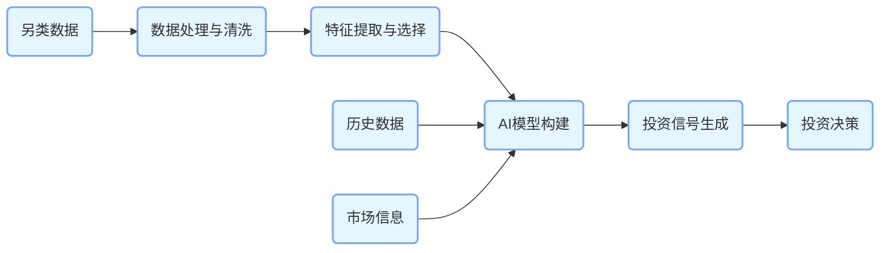

# AI驱动的另类数据投资信号提取

> 关键词：AI、另类数据、投资信号提取、机器学习、金融科技

> 摘要：本文围绕AI驱动的另类数据投资信号提取展开深入探讨。随着金融市场的不断发展，传统数据已难以满足投资决策的需求，另类数据的价值日益凸显。而AI技术为从海量另类数据中提取有价值的投资信号提供了强大的工具和方法。文章将详细介绍相关核心概念、算法原理、数学模型，通过项目实战展示具体操作流程，分析实际应用场景，推荐学习资源、开发工具和相关论文，最后总结未来发展趋势与挑战，解答常见问题并提供参考资料，旨在为投资者和相关从业者提供全面且深入的技术指导。

## 1. 背景介绍 
### 1.1 目的和范围
在当今复杂多变的金融市场中，传统的财务数据和市场数据已经不能完全反映企业的真实价值和市场趋势。另类数据作为一种新兴的数据来源，包含了社交媒体数据、卫星图像、传感器数据等多种形式，为投资者提供了更丰富的信息。本文章的目的是探讨如何利用AI技术从另类数据中提取有效的投资信号，帮助投资者做出更明智的投资决策。范围涵盖了从另类数据的收集、处理，到AI算法的应用，再到投资信号的验证和应用等多个环节。

### 1.2 预期读者
本文预期读者包括金融行业的投资者、基金经理、分析师，以及对金融科技和AI应用感兴趣的技术人员和研究人员。对于金融从业者，文章可以提供新的投资思路和方法；对于技术人员和研究人员，文章可以作为研究AI在金融领域应用的参考资料。

### 1.3 文档结构概述
本文将按照以下结构进行阐述：首先介绍核心概念与联系，包括另类数据和AI的基本概念以及它们之间的关系；接着详细讲解核心算法原理和具体操作步骤，通过Python代码进行示例；然后介绍相关的数学模型和公式，并举例说明；之后通过项目实战展示如何在实际中应用这些技术；分析实际应用场景；推荐学习资源、开发工具和相关论文；最后总结未来发展趋势与挑战，解答常见问题并提供参考资料。

### 1.4 术语表
#### 1.4.1 核心术语定义
- **另类数据**：指除了传统的财务报表、市场交易数据之外的其他数据，如社交媒体数据、卫星图像数据、信用卡交易数据等。
- **投资信号**：能够预示资产价格未来走势或投资机会的信息，可帮助投资者做出买入、卖出或持有等决策。
- **AI（人工智能）**：是一门研究如何使计算机系统能够模拟人类智能的学科，包括机器学习、深度学习等技术。
- **机器学习**：是AI的一个重要分支，通过让计算机从数据中学习模式和规律，从而实现预测和决策等任务。
- **深度学习**：是一种基于人工神经网络的机器学习技术，能够自动从大量数据中提取复杂的特征和模式。

#### 1.4.2 相关概念解释
- **特征工程**：是指从原始数据中提取和选择有意义的特征，以提高机器学习模型的性能。在另类数据投资信号提取中，特征工程非常重要，因为另类数据通常具有高维度、非结构化等特点，需要进行适当的处理和转换。
- **模型评估**：是指使用一定的指标和方法来评估机器学习模型的性能，如准确率、召回率、均方误差等。在投资信号提取中，模型评估的结果可以帮助投资者选择最合适的模型。

#### 1.4.3 缩略词列表
- **AI**：Artificial Intelligence（人工智能）
- **ML**：Machine Learning（机器学习）
- **DL**：Deep Learning（深度学习）
- **LSTM**：Long Short-Term Memory（长短期记忆网络）
- **SVM**：Support Vector Machine（支持向量机）

## 2. 核心概念与联系 
### 2.1 另类数据的类型和特点
另类数据的类型丰富多样，常见的包括以下几种：
- **社交媒体数据**：如Twitter、微博等平台上的用户言论和情绪表达。这些数据反映了公众对企业、产品或市场的看法和态度，具有实时性和海量性的特点。
- **卫星图像数据**：可以提供关于企业的生产设施、物流情况、土地使用等信息。例如，通过分析卫星图像中油库的库存变化，可以预测石油市场的供需情况。卫星图像数据具有客观性和宏观性的特点。
- **传感器数据**：如智能电表、交通传感器等收集的数据。这些数据可以反映企业的运营状况和市场的活动水平，具有高频率和连续性的特点。

### 2.2 AI技术在投资信号提取中的作用
AI技术在投资信号提取中发挥着关键作用，主要体现在以下几个方面：
- **数据处理和清洗**：另类数据通常具有噪声大、格式不统一等问题，AI技术可以通过数据挖掘和预处理算法对数据进行清洗和转换，提高数据的质量。
- **特征提取和选择**：AI算法可以自动从海量的另类数据中提取有价值的特征，并选择最相关的特征用于投资信号的构建。
- **模型构建和预测**：机器学习和深度学习模型可以学习数据中的模式和规律，从而对资产价格的走势进行预测，为投资者提供投资信号。

### 2.3 核心概念的架构关系
下面是核心概念的架构关系示意图：



该流程图展示了从另类数据到投资决策的整个过程。首先，收集到的另类数据需要进行处理和清洗，去除噪声和错误信息。然后，从处理后的数据中提取和选择有价值的特征。接着，利用这些特征构建AI模型。模型根据输入的数据生成投资信号，最后投资者根据投资信号做出投资决策。同时，历史数据和市场信息也会作为输入参与到AI模型的构建中。

## 3. 核心算法原理 & 具体操作步骤 
### 3.1 机器学习算法原理
#### 3.1.1 支持向量机（SVM）
支持向量机是一种常用的监督学习算法，用于分类和回归分析。其基本原理是在特征空间中找到一个最优的超平面，使得不同类别的数据点能够被最大程度地分开。对于线性可分的数据，SVM可以找到一个线性超平面；对于线性不可分的数据，SVM可以通过核函数将数据映射到高维空间，从而找到一个非线性超平面。

以下是使用Python实现SVM进行分类的示例代码：
```python
from sklearn import datasets
from sklearn.model_selection import train_test_split
from sklearn.svm import SVC
from sklearn.metrics import accuracy_score

# 加载数据集
iris = datasets.load_iris()
X = iris.data
y = iris.target

# 划分训练集和测试集
X_train, X_test, y_train, y_test = train_test_split(X, y, test_size=0.3, random_state=42)

# 创建SVM模型
svm_model = SVC(kernel='linear')

# 训练模型
svm_model.fit(X_train, y_train)

# 预测
y_pred = svm_model.predict(X_test)

# 评估模型
accuracy = accuracy_score(y_test, y_pred)
print(f"Accuracy: {accuracy}")
```
#### 3.1.2 随机森林
随机森林是一种集成学习算法，由多个决策树组成。其基本原理是通过对数据集进行有放回的抽样（bootstrap sampling），构建多个决策树，并对这些决策树的结果进行综合。随机森林可以减少过拟合的风险，提高模型的泛化能力。

以下是使用Python实现随机森林进行分类的示例代码：
```python
from sklearn.ensemble import RandomForestClassifier
from sklearn.datasets import make_classification
from sklearn.model_selection import train_test_split
from sklearn.metrics import accuracy_score

# 生成数据集
X, y = make_classification(n_samples=1000, n_features=4,
                           n_informative=2, n_redundant=0,
                           random_state=0, shuffle=False)

# 划分训练集和测试集
X_train, X_test, y_train, y_test = train_test_split(X, y, test_size=0.3, random_state=42)

# 创建随机森林模型
rf_model = RandomForestClassifier(n_estimators=100, random_state=42)

# 训练模型
rf_model.fit(X_train, y_train)

# 预测
y_pred = rf_model.predict(X_test)

# 评估模型
accuracy = accuracy_score(y_test, y_pred)
print(f"Accuracy: {accuracy}")
```

### 3.2 深度学习算法原理
#### 3.2.1 长短期记忆网络（LSTM）
长短期记忆网络是一种特殊的循环神经网络（RNN），能够处理序列数据中的长期依赖关系。其基本原理是通过引入门控机制，控制信息的流入和流出，从而解决传统RNN在处理长序列时的梯度消失问题。

以下是使用Python和Keras实现LSTM进行时间序列预测的示例代码：
```python
import numpy as np
from keras.models import Sequential
from keras.layers import LSTM, Dense

# 生成时间序列数据
data = np.array([i for i in range(100)])
X = []
y = []
for i in range(len(data) - 10):
    X.append(data[i:i+10])
    y.append(data[i+10])
X = np.array(X)
y = np.array(y)

# 调整数据形状以适应LSTM输入
X = np.reshape(X, (X.shape[0], X.shape[1], 1))

# 创建LSTM模型
model = Sequential()
model.add(LSTM(50, activation='relu', input_shape=(10, 1)))
model.add(Dense(1))
model.compile(optimizer='adam', loss='mse')

# 训练模型
model.fit(X, y, epochs=100, verbose=1)

# 预测
test_input = np.array(data[-10:])
test_input = test_input.reshape((1, 10, 1))
prediction = model.predict(test_input)
print(f"Prediction: {prediction[0][0]}")
```

### 3.3 具体操作步骤
#### 3.3.1 数据收集
根据投资目标和研究方向，选择合适的另类数据源进行数据收集。例如，如果要研究零售企业的销售情况，可以收集社交媒体上的消费者评价、信用卡交易数据等。

#### 3.3.2 数据预处理
对收集到的原始数据进行清洗、转换和归一化等操作。去除噪声数据、处理缺失值、将非结构化数据转换为结构化数据，并将数据归一化到相同的尺度上。

#### 3.3.3 特征工程
从预处理后的数据中提取有价值的特征。可以使用统计方法、机器学习算法等进行特征提取和选择。例如，计算数据的均值、标准差、相关性等统计特征，或者使用主成分分析（PCA）等方法进行特征降维。

#### 3.3.4 模型训练
选择合适的AI算法和模型，使用训练数据对模型进行训练。在训练过程中，需要调整模型的参数，以提高模型的性能。可以使用交叉验证等方法来评估模型的泛化能力。

#### 3.3.5 投资信号生成
使用训练好的模型对测试数据进行预测，生成投资信号。根据预测结果，制定相应的投资策略，如买入、卖出或持有等。

#### 3.3.6 模型评估和优化
使用评估指标对模型的性能进行评估，如准确率、召回率、均方误差等。根据评估结果，对模型进行优化，如调整模型参数、更换算法等。

## 4. 数学模型和公式 & 详细讲解 & 举例说明 
### 4.1 支持向量机的数学模型
支持向量机的目标是找到一个超平面 $w^T x + b = 0$，使得不同类别的数据点到该超平面的距离最大。对于线性可分的数据，其优化问题可以表示为：
$$
\begin{aligned}
\min_{w,b} &\quad \frac{1}{2} \| w \|^2 \\
\text{s.t.} &\quad y_i (w^T x_i + b) \geq 1, \quad i = 1, \cdots, n
\end{aligned}
$$
其中，$w$ 是超平面的法向量，$b$ 是偏置项，$x_i$ 是第 $i$ 个数据点，$y_i$ 是第 $i$ 个数据点的标签（$y_i \in \{-1, 1\}$）。

为了解决这个优化问题，可以引入拉格朗日乘子 $\alpha_i \geq 0$，将其转化为拉格朗日对偶问题：
$$
\begin{aligned}
\max_{\alpha} &\quad \sum_{i=1}^{n} \alpha_i - \frac{1}{2} \sum_{i=1}^{n} \sum_{j=1}^{n} \alpha_i \alpha_j y_i y_j x_i^T x_j \\
\text{s.t.} &\quad \sum_{i=1}^{n} \alpha_i y_i = 0, \quad \alpha_i \geq 0, \quad i = 1, \cdots, n
\end{aligned}
$$
求解对偶问题得到最优的拉格朗日乘子 $\alpha^*$，然后可以计算出最优的 $w^*$ 和 $b^*$：
$$
w^* = \sum_{i=1}^{n} \alpha_i^* y_i x_i
$$
$$
b^* = y_j - w^{*T} x_j, \quad \text{for any } j \text{ such that } \alpha_j^* > 0
$$

### 4.2 随机森林的数学模型
随机森林由多个决策树组成，每个决策树的构建过程如下：
- 从原始数据集中进行有放回的抽样，得到一个新的数据集（bootstrap sample）。
- 从所有特征中随机选择一部分特征，用于构建决策树。
- 在每个节点上，选择最优的特征和划分点，使得划分后的子集的纯度最高。常用的纯度指标有基尼不纯度（Gini impurity）和信息增益（Information gain）。

对于分类问题，随机森林的预测结果是所有决策树预测结果的多数投票；对于回归问题，随机森林的预测结果是所有决策树预测结果的平均值。

### 4.3 长短期记忆网络的数学模型
长短期记忆网络的核心是记忆单元，它包含三个门：输入门 $i_t$、遗忘门 $f_t$ 和输出门 $o_t$。其数学模型如下：
$$
\begin{aligned}
f_t &= \sigma(W_f [h_{t-1}, x_t] + b_f) \\
i_t &= \sigma(W_i [h_{t-1}, x_t] + b_i) \\
\tilde{C}_t &= \tanh(W_C [h_{t-1}, x_t] + b_C) \\
C_t &= f_t \odot C_{t-1} + i_t \odot \tilde{C}_t \\
o_t &= \sigma(W_o [h_{t-1}, x_t] + b_o) \\
h_t &= o_t \odot \tanh(C_t)
\end{aligned}
$$
其中，$x_t$ 是当前时刻的输入，$h_{t-1}$ 是上一时刻的隐藏状态，$C_{t-1}$ 是上一时刻的记忆单元状态，$W_f$、$W_i$、$W_C$、$W_o$ 是权重矩阵，$b_f$、$b_i$、$b_C$、$b_o$ 是偏置项，$\sigma$ 是 sigmoid 函数，$\tanh$ 是双曲正切函数，$\odot$ 表示逐元素相乘。

### 4.4 举例说明
假设我们有一个二分类问题，数据集包含两个特征 $x_1$ 和 $x_2$，标签 $y \in \{-1, 1\}$。我们使用支持向量机来解决这个问题。

首先，我们可以将数据集表示为矩阵 $X = [x_1, x_2]$ 和向量 $y$。然后，根据支持向量机的优化问题，我们可以使用拉格朗日对偶方法求解最优的拉格朗日乘子 $\alpha^*$。假设求解得到 $\alpha^* = [\alpha_1^*, \alpha_2^*, \cdots, \alpha_n^*]$，我们可以计算出最优的 $w^*$ 和 $b^*$。

最后，对于一个新的数据点 $x_{new}$，我们可以使用 $w^*$ 和 $b^*$ 来预测其标签：
$$
y_{new} = \text{sign}(w^{*T} x_{new} + b^*)
$$
其中，$\text{sign}$ 是符号函数。

## 5. 项目实战：代码实际案例和详细解释说明 
### 5.1  开发环境搭建
#### 5.1.1 安装Python
首先，需要安装Python环境。可以从Python官方网站（https://www.python.org/downloads/）下载适合自己操作系统的Python版本，并按照安装向导进行安装。

#### 5.1.2 安装必要的库
使用pip命令安装必要的Python库，包括NumPy、Pandas、Scikit-learn、Keras等。以下是安装命令：
```bash
pip install numpy pandas scikit-learn keras
```

### 5.2  源代码详细实现和代码解读
#### 5.2.1 数据加载和预处理
```python
import pandas as pd
from sklearn.preprocessing import MinMaxScaler

# 加载数据
data = pd.read_csv('alternative_data.csv')

# 处理缺失值
data = data.dropna()

# 分离特征和标签
X = data.drop('label', axis=1)
y = data['label']

# 数据归一化
scaler = MinMaxScaler()
X_scaled = scaler.fit_transform(X)
```
代码解读：
- 使用`pandas`库的`read_csv`函数加载CSV格式的另类数据。
- 使用`dropna`方法去除包含缺失值的行。
- 将特征和标签分离，其中`label`列是目标变量。
- 使用`MinMaxScaler`对特征数据进行归一化处理，将数据缩放到[0, 1]区间。

#### 5.2.2 模型训练和评估
```python
from sklearn.model_selection import train_test_split
from sklearn.ensemble import RandomForestClassifier
from sklearn.metrics import accuracy_score

# 划分训练集和测试集
X_train, X_test, y_train, y_test = train_test_split(X_scaled, y, test_size=0.2, random_state=42)

# 创建随机森林模型
rf_model = RandomForestClassifier(n_estimators=100, random_state=42)

# 训练模型
rf_model.fit(X_train, y_train)

# 预测
y_pred = rf_model.predict(X_test)

# 评估模型
accuracy = accuracy_score(y_test, y_pred)
print(f"Accuracy: {accuracy}")
```
代码解读：
- 使用`train_test_split`函数将数据集划分为训练集和测试集，测试集占比为20%。
- 创建一个包含100个决策树的随机森林模型。
- 使用训练集数据对模型进行训练。
- 使用测试集数据进行预测，并计算预测结果的准确率。

### 5.3  代码解读与分析
#### 5.3.1 数据预处理的重要性
数据预处理是数据挖掘和机器学习中非常重要的一步。在本项目中，处理缺失值可以避免模型因缺失数据而产生错误的预测；数据归一化可以使不同特征具有相同的尺度，避免某些特征对模型的影响过大。

#### 5.3.2 模型选择和参数调整
选择合适的模型和调整模型的参数对于提高模型的性能至关重要。在本项目中，选择随机森林模型是因为它具有较好的泛化能力和抗过拟合能力。同时，通过调整`n_estimators`参数（决策树的数量），可以进一步优化模型的性能。

#### 5.3.3 模型评估的意义
模型评估可以帮助我们了解模型的性能和泛化能力。在本项目中，使用准确率作为评估指标，它反映了模型预测正确的样本占总样本的比例。通过评估结果，我们可以判断模型是否满足实际需求，并对模型进行进一步的优化。

## 6. 实际应用场景 
### 6.1 股票投资
在股票投资中，另类数据可以提供关于上市公司的更多信息。例如，通过分析社交媒体数据，可以了解投资者对某只股票的情绪和看法；通过分析卫星图像数据，可以了解上市公司的生产设施和物流情况。利用AI技术从这些另类数据中提取投资信号，可以帮助投资者更好地预测股票价格的走势，做出更明智的投资决策。

### 6.2 债券投资
对于债券投资，另类数据可以提供关于债券发行人的信用状况和经营情况的信息。例如，通过分析企业的供应链数据、信用卡交易数据等，可以评估企业的还款能力和违约风险。利用AI技术从这些另类数据中提取投资信号，可以帮助投资者选择更优质的债券，降低投资风险。

### 6.3 商品投资
在商品投资中，另类数据可以提供关于商品供需情况和市场趋势的信息。例如，通过分析卫星图像数据，可以了解农产品的种植面积和生长情况；通过分析传感器数据，可以了解能源的生产和消费情况。利用AI技术从这些另类数据中提取投资信号，可以帮助投资者预测商品价格的波动，把握投资机会。

## 7. 工具和资源推荐
### 7.1 学习资源推荐
#### 7.1.1 书籍推荐
- 《Python机器学习》（Sebastian Raschka著）：这本书详细介绍了Python在机器学习中的应用，包括各种机器学习算法的原理和实现。
- 《深度学习》（Ian Goodfellow、Yoshua Bengio和Aaron Courville著）：这是深度学习领域的经典教材，全面介绍了深度学习的理论和实践。
- 《金融科技：应用与创新》（黄益平主编）：这本书介绍了金融科技的各个领域，包括AI在金融领域的应用，适合金融从业者和对金融科技感兴趣的读者。

#### 7.1.2 在线课程
- Coursera上的“机器学习”课程（Andrew Ng教授授课）：这是一门非常经典的机器学习课程，涵盖了机器学习的基本概念、算法和应用。
- edX上的“深度学习专项课程”（Andrew Ng教授授课）：该课程深入介绍了深度学习的各个方面，包括神经网络、卷积神经网络、循环神经网络等。
- Udemy上的“Python for Finance: Investment Fundamentals & Data Analytics”课程：该课程结合Python编程和金融投资知识，适合想要学习如何使用Python进行金融数据分析的读者。

#### 7.1.3 技术博客和网站
- Medium：这是一个技术博客平台，上面有很多关于AI、金融科技等领域的优质文章。
- Towards Data Science：这是一个专注于数据科学和机器学习的网站，提供了大量的教程、案例和研究成果。
- arXiv：这是一个预印本数据库，上面有很多关于AI和金融领域的最新研究论文。

### 7.2 开发工具框架推荐
#### 7.2.1 IDE和编辑器
- PyCharm：这是一款专业的Python集成开发环境，提供了丰富的代码编辑、调试和项目管理功能。
- Jupyter Notebook：这是一个交互式的开发环境，适合进行数据探索和模型实验。
- Visual Studio Code：这是一款轻量级的代码编辑器，支持多种编程语言和插件，具有良好的扩展性。

#### 7.2.2 调试和性能分析工具
- Py-Spy：这是一个用于Python代码性能分析的工具，可以帮助开发者找出代码中的性能瓶颈。
- TensorBoard：这是TensorFlow提供的一个可视化工具，用于监控和分析深度学习模型的训练过程。
- Scikit-learn的`GridSearchCV`：这是一个用于模型参数调优的工具，可以通过网格搜索的方式找到最优的模型参数。

#### 7.2.3 相关框架和库
- Scikit-learn：这是一个常用的机器学习库，提供了各种机器学习算法的实现和工具。
- Keras：这是一个高级神经网络库，简单易用，适合快速搭建和训练深度学习模型。
- TensorFlow：这是一个开源的深度学习框架，具有强大的计算能力和灵活性，广泛应用于工业界和学术界。

### 7.3 相关论文著作推荐
#### 7.3.1 经典论文
- “Support-Vector Networks”（Cortes和Vapnik著）：这是支持向量机领域的经典论文，详细介绍了支持向量机的原理和算法。
- “Gradient-Based Learning Applied to Document Recognition”（LeCun等人著）：这篇论文介绍了卷积神经网络在手写字符识别中的应用，是深度学习领域的重要里程碑。
- “Long Short-Term Memory”（Hochreiter和Schmidhuber著）：这篇论文提出了长短期记忆网络（LSTM），解决了传统循环神经网络在处理长序列时的梯度消失问题。

#### 7.3.2 最新研究成果
- “Deep Learning for Asset Pricing”（Gu等人著）：这篇论文探讨了深度学习在资产定价中的应用，提出了一种基于深度学习的资产定价模型。
- “Alternative Data in Asset Management”（Khandani等人著）：这篇论文研究了另类数据在资产管理中的应用，分析了另类数据对投资组合绩效的影响。
- “Machine Learning in Finance: The Case of High-Frequency Trading”（Busseti等人著）：这篇论文介绍了机器学习在高频交易中的应用，提出了一种基于机器学习的高频交易策略。

#### 7.3.3 应用案例分析
- “How Hedge Funds Are Using Alternative Data to Gain an Edge”（Institutional Investor杂志）：这篇文章介绍了一些对冲基金如何使用另类数据来获取投资优势的案例。
- “The Role of Alternative Data in Investment Decision-Making”（Financial Analysts Journal）：这篇文章分析了另类数据在投资决策中的作用，并通过实际案例进行了说明。

## 8. 总结：未来发展趋势与挑战
### 8.1 未来发展趋势
#### 8.1.1 数据来源的多元化
随着技术的不断发展，另类数据的来源将越来越多元化。除了现有的社交媒体数据、卫星图像数据、传感器数据等，还将出现更多类型的另类数据，如物联网数据、区块链数据等。这些新的数据来源将为投资信号提取提供更多的信息和机会。

#### 8.1.2 算法的不断创新
AI算法将不断创新和发展，以更好地处理和分析另类数据。例如，深度学习模型将不断改进，以提高对非结构化数据的处理能力；强化学习算法将更多地应用于投资决策中，以实现自适应的投资策略。

#### 8.1.3 与传统金融数据的融合
另类数据将与传统的金融数据（如财务报表、市场交易数据等）进行更深入的融合。通过综合分析多种数据来源，可以更全面地了解企业的价值和市场趋势，提高投资决策的准确性。

### 8.2 挑战
#### 8.2.1 数据质量和可靠性
另类数据通常具有噪声大、格式不统一、可靠性低等问题。如何提高数据的质量和可靠性，是从另类数据中提取有效投资信号的关键挑战之一。

#### 8.2.2 隐私和安全问题
另类数据中可能包含大量的个人隐私信息和企业敏感信息。如何在保护隐私和安全的前提下，合理使用这些数据，是需要解决的重要问题。

#### 8.2.3 模型的可解释性
深度学习等复杂的AI模型通常具有较高的预测性能，但缺乏可解释性。在投资决策中，投资者需要了解模型的决策依据，以便做出合理的决策。因此，如何提高模型的可解释性，是一个亟待解决的问题。

## 9. 附录：常见问题与解答
### 9.1 什么是另类数据？
另类数据是指除了传统的财务报表、市场交易数据之外的其他数据，如社交媒体数据、卫星图像数据、传感器数据等。这些数据具有实时性、海量性、多样性等特点，可以为投资者提供更丰富的信息。

### 9.2 为什么要使用AI技术提取投资信号？
传统的数据分析方法难以处理海量的另类数据，而AI技术具有强大的数据处理和分析能力，可以自动从海量数据中提取有价值的信息和模式。通过使用AI技术，可以提高投资信号提取的效率和准确性，帮助投资者做出更明智的投资决策。

### 9.3 如何评估投资信号的有效性？
可以使用多种指标来评估投资信号的有效性，如准确率、召回率、夏普比率等。准确率反映了投资信号预测正确的比例；召回率反映了投资信号能够捕捉到的真实投资机会的比例；夏普比率反映了投资信号的风险调整后收益。

### 9.4 如何选择合适的AI算法？
选择合适的AI算法需要考虑多个因素，如数据类型、数据规模、问题类型等。对于结构化数据和小规模数据集，可以选择传统的机器学习算法，如支持向量机、随机森林等；对于非结构化数据和大规模数据集，可以选择深度学习算法，如卷积神经网络、长短期记忆网络等。

## 10. 扩展阅读 & 参考资料
### 10.1 扩展阅读
- 《人工智能时代的金融科技》
- 《数据驱动的投资决策》
- 《量化投资：策略与技术》

### 10.2 参考资料
- 《Python数据科学手册》
- 《机器学习实战》
- 《深度学习实战》

作者：AI天才研究院/AI Genius Institute & 禅与计算机程序设计艺术 /Zen And The Art of Computer Programming