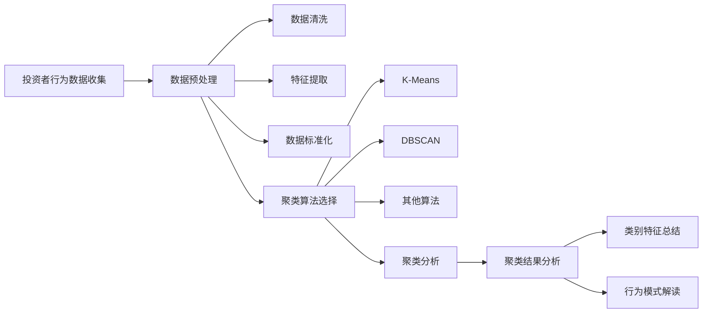

# AI驱动的投资者行为模式聚类分析

> 关键词：AI、投资者行为模式、聚类分析、数据挖掘、金融投资

> 摘要：本文聚焦于AI驱动的投资者行为模式聚类分析。随着金融市场的不断发展，投资者数量和交易数据急剧增加，了解投资者行为模式对于金融机构、监管部门和投资者自身都具有重要意义。文章首先介绍了相关背景，包括目的范围、预期读者等；接着阐述了核心概念及联系，通过文本示意图和Mermaid流程图展示原理架构；详细讲解了核心算法原理及具体操作步骤，并用Python代码进行说明；给出了数学模型和公式并举例；通过项目实战展示代码案例及解读；探讨了实际应用场景；推荐了学习资源、开发工具框架和相关论文著作；最后总结了未来发展趋势与挑战，并提供了常见问题解答和扩展阅读参考资料。

## 1. 背景介绍 
### 1.1 目的和范围
目的：本研究旨在利用AI技术对投资者行为模式进行聚类分析，帮助金融机构更好地了解客户，制定个性化的投资策略和服务方案；为监管部门提供监管依据，防范金融风险；同时也为投资者自身提供自我认知和投资决策的参考。
范围：研究涵盖了各类金融市场的投资者，包括股票市场、债券市场、基金市场等。分析的数据主要来源于投资者的交易记录、持仓信息、风险偏好等。

### 1.2 预期读者
本文预期读者包括金融从业者，如银行理财经理、证券分析师、基金经理等；金融监管部门工作人员；对金融投资和AI技术感兴趣的研究人员和学生；以及有一定投资经验并希望深入了解自身投资行为的投资者。

### 1.3 文档结构概述
本文共分为10个部分。第一部分为背景介绍，阐述研究目的、范围、预期读者和文档结构。第二部分介绍核心概念与联系，通过示意图和流程图展示聚类分析的原理架构。第三部分讲解核心算法原理及具体操作步骤，并用Python代码实现。第四部分给出数学模型和公式，并举例说明。第五部分进行项目实战，包括开发环境搭建、源代码实现和代码解读。第六部分探讨实际应用场景。第七部分推荐学习资源、开发工具框架和相关论文著作。第八部分总结未来发展趋势与挑战。第九部分为附录，解答常见问题。第十部分提供扩展阅读和参考资料。

### 1.4 术语表
#### 1.4.1 核心术语定义
- **投资者行为模式**：指投资者在金融市场中的交易决策、投资偏好、风险承受能力等方面表现出的相对稳定的行为特征。
- **聚类分析**：是一种无监督学习方法，将数据集中相似的数据对象划分到同一类中，不同类之间的数据对象具有较大差异。
- **AI（人工智能）**：指计算机系统能够执行通常需要人类智能才能完成的任务，如学习、推理、感知等。

#### 1.4.2 相关概念解释
- **无监督学习**：与监督学习不同，无监督学习没有事先标记好的目标变量，算法自动从数据中发现模式和结构。
- **数据挖掘**：从大量数据中发现有价值的信息和知识的过程，聚类分析是数据挖掘的重要技术之一。

#### 1.4.3 缩略词列表
- **K-Means**：K均值聚类算法
- **DBSCAN**：基于密度的空间聚类应用算法

## 2. 核心概念与联系 

### 核心概念原理
投资者行为模式聚类分析的核心思想是通过对投资者的各种行为数据进行量化和分析，找出具有相似行为特征的投资者群体。首先，需要收集投资者的交易数据、持仓数据、风险偏好等信息，并对这些数据进行预处理，如数据清洗、特征提取和标准化。然后，选择合适的聚类算法对处理后的数据进行聚类操作，将投资者划分为不同的类别。最后，对每个类别进行特征分析，总结出该类投资者的行为模式特点。

### 架构的文本示意图
```plaintext
投资者行为数据收集
|
|-- 数据预处理
|   |-- 数据清洗
|   |-- 特征提取
|   |-- 数据标准化
|
|-- 聚类算法选择
|   |-- K-Means
|   |-- DBSCAN
|   |-- 其他算法
|
|-- 聚类分析
|
|-- 聚类结果分析
|   |-- 类别特征总结
|   |-- 行为模式解读
```

### Mermaid流程图


## 3. 核心算法原理 & 具体操作步骤 

### K-Means算法原理
K-Means算法是一种常用的聚类算法，其基本思想是通过迭代的方式将数据点划分到K个不同的簇中，使得每个簇内的数据点到该簇中心点的距离之和最小。具体步骤如下：
1. **初始化**：随机选择K个数据点作为初始的簇中心点。
2. **分配数据点**：计算每个数据点到K个簇中心点的距离，将数据点分配到距离最近的簇中。
3. **更新簇中心点**：计算每个簇内所有数据点的均值，将该均值作为新的簇中心点。
4. **重复步骤2和3**：直到簇中心点不再发生变化或达到最大迭代次数。

### Python代码实现
```python
import numpy as np
from sklearn.cluster import KMeans
import matplotlib.pyplot as plt

# 生成示例数据
np.random.seed(0)
X = np.vstack([
    np.random.normal(loc=[0, 0], scale=1, size=(100, 2)),
    np.random.normal(loc=[5, 5], scale=1, size=(100, 2)),
    np.random.normal(loc=[10, 0], scale=1, size=(100, 2))
])

# 初始化K-Means模型
kmeans = KMeans(n_clusters=3, random_state=0)

# 拟合数据
kmeans.fit(X)

# 获取聚类标签
labels = kmeans.labels_

# 获取簇中心点
centroids = kmeans.cluster_centers_

# 可视化结果
plt.scatter(X[:, 0], X[:, 1], c=labels, cmap='viridis')
plt.scatter(centroids[:, 0], centroids[:, 1], marker='X', s=200, c='red')
plt.title('K-Means Clustering')
plt.xlabel('Feature 1')
plt.ylabel('Feature 2')
plt.show()
```

### 代码解释
1. **数据生成**：使用`np.random.normal`函数生成三个不同分布的二维数据点，共300个。
2. **模型初始化**：使用`KMeans`类初始化一个K-Means模型，设置簇的数量为3。
3. **拟合数据**：调用`fit`方法对数据进行拟合。
4. **获取聚类标签和簇中心点**：使用`labels_`属性获取每个数据点的聚类标签，使用`cluster_centers_`属性获取簇中心点的坐标。
5. **可视化结果**：使用`matplotlib`库将数据点和簇中心点可视化。

### DBSCAN算法原理
DBSCAN（基于密度的空间聚类应用算法）是一种基于密度的聚类算法，它将具有足够高密度的数据点划分为一个簇，并将低密度区域的数据点视为噪声点。具体步骤如下：
1. **定义参数**：定义邻域半径`eps`和最小点数`minPts`。
2. **计算每个数据点的邻域**：对于每个数据点，计算其在半径`eps`内的邻域数据点数量。
3. **标记核心点、边界点和噪声点**：如果一个数据点的邻域数据点数量大于等于`minPts`，则该数据点为核心点；如果一个数据点不是核心点，但在某个核心点的邻域内，则该数据点为边界点；否则，该数据点为噪声点。
4. **连接核心点**：将相互邻接的核心点连接成一个簇。
5. **分配边界点**：将边界点分配到与其邻接的核心点所在的簇中。

### Python代码实现
```python
from sklearn.cluster import DBSCAN
from sklearn.datasets import make_moons
import matplotlib.pyplot as plt

# 生成示例数据
X, _ = make_moons(n_samples=200, noise=0.05, random_state=0)

# 初始化DBSCAN模型
dbscan = DBSCAN(eps=0.3, min_samples=5)

# 拟合数据
labels = dbscan.fit_predict(X)

# 可视化结果
plt.scatter(X[:, 0], X[:, 1], c=labels, cmap='viridis')
plt.title('DBSCAN Clustering')
plt.xlabel('Feature 1')
plt.ylabel('Feature 2')
plt.show()
```

### 代码解释
1. **数据生成**：使用`make_moons`函数生成一个月牙形的二维数据集。
2. **模型初始化**：使用`DBSCAN`类初始化一个DBSCAN模型，设置邻域半径`eps`为0.3，最小点数`min_samples`为5。
3. **拟合数据并获取聚类标签**：调用`fit_predict`方法对数据进行拟合，并获取每个数据点的聚类标签。
4. **可视化结果**：使用`matplotlib`库将数据点和聚类结果可视化。

## 4. 数学模型和公式 & 详细讲解 & 举例说明 

### K-Means算法的数学模型和公式
#### 目标函数
K-Means算法的目标是最小化每个数据点到其所属簇中心点的距离之和，即：
$$
J = \sum_{i=1}^{n} \sum_{j=1}^{k} r_{ij} \left \| x_i - \mu_j \right \|^2
$$
其中，$n$ 是数据点的数量，$k$ 是簇的数量，$x_i$ 是第 $i$ 个数据点，$\mu_j$ 是第 $j$ 个簇的中心点，$r_{ij}$ 是一个指示变量，如果数据点 $x_i$ 属于簇 $j$，则 $r_{ij} = 1$，否则 $r_{ij} = 0$。

#### 距离计算
在K-Means算法中，通常使用欧几里得距离来计算数据点之间的距离，公式为：
$$
\left \| x_i - \mu_j \right \| = \sqrt{\sum_{d=1}^{m} (x_{id} - \mu_{jd})^2}
$$
其中，$m$ 是数据点的特征维度，$x_{id}$ 是第 $i$ 个数据点的第 $d$ 个特征值，$\mu_{jd}$ 是第 $j$ 个簇中心点的第 $d$ 个特征值。

#### 举例说明
假设有三个数据点 $x_1 = [1, 2]$，$x_2 = [4, 5]$，$x_3 = [7, 8]$，初始的簇中心点为 $\mu_1 = [2, 3]$，$\mu_2 = [5, 6]$。
1. **计算距离**：
    - 对于 $x_1$：
        - $d(x_1, \mu_1) = \sqrt{(1 - 2)^2 + (2 - 3)^2} = \sqrt{2}$
        - $d(x_1, \mu_2) = \sqrt{(1 - 5)^2 + (2 - 6)^2} = \sqrt{32}$
        因为 $d(x_1, \mu_1) < d(x_1, \mu_2)$，所以 $x_1$ 属于簇 1。
    - 对于 $x_2$：
        - $d(x_2, \mu_1) = \sqrt{(4 - 2)^2 + (5 - 3)^2} = \sqrt{8}$
        - $d(x_2, \mu_2) = \sqrt{(4 - 5)^2 + (5 - 6)^2} = \sqrt{2}$
        因为 $d(x_2, \mu_2) < d(x_2, \mu_1)$，所以 $x_2$ 属于簇 2。
    - 对于 $x_3$：
        - $d(x_3, \mu_1) = \sqrt{(7 - 2)^2 + (8 - 3)^2} = \sqrt{50}$
        - $d(x_3, \mu_2) = \sqrt{(7 - 5)^2 + (8 - 6)^2} = \sqrt{8}$
        因为 $d(x_3, \mu_2) < d(x_3, \mu_1)$，所以 $x_3$ 属于簇 2。
2. **更新簇中心点**：
    - 簇 1 只有一个数据点 $x_1$，所以新的簇中心点 $\mu_1 = [1, 2]$。
    - 簇 2 有两个数据点 $x_2$ 和 $x_3$，新的簇中心点 $\mu_2 = \frac{[4, 5] + [7, 8]}{2} = [5.5, 6.5]$。

### DBSCAN算法的数学模型和公式
#### 邻域定义
对于数据点 $x_i$，其 $\epsilon$-邻域定义为：
$$
N_{\epsilon}(x_i) = \{ x_j \in D : \left \| x_i - x_j \right \| \leq \epsilon \}
$$
其中，$D$ 是数据集，$\epsilon$ 是邻域半径。

#### 核心点、边界点和噪声点的定义
- **核心点**：如果 $\left | N_{\epsilon}(x_i) \right | \geq MinPts$，则 $x_i$ 是核心点，其中 $\left | N_{\epsilon}(x_i) \right |$ 是 $x_i$ 的 $\epsilon$-邻域内数据点的数量，$MinPts$ 是最小点数。
- **边界点**：如果 $\left | N_{\epsilon}(x_i) \right | < MinPts$，且 $x_i$ 至少属于一个核心点的 $\epsilon$-邻域，则 $x_i$ 是边界点。
- **噪声点**：如果 $x_i$ 既不是核心点也不是边界点，则 $x_i$ 是噪声点。

#### 举例说明
假设有一个二维数据集 $D = \{ x_1, x_2, x_3, x_4, x_5 \}$，邻域半径 $\epsilon = 2$，最小点数 $MinPts = 3$。
1. **计算邻域**：
    - 对于 $x_1$，其 $\epsilon$-邻域内有 $x_2$ 和 $x_3$，$\left | N_{\epsilon}(x_1) \right | = 2 < MinPts$，所以 $x_1$ 不是核心点。
    - 对于 $x_2$，其 $\epsilon$-邻域内有 $x_1$，$x_3$ 和 $x_4$，$\left | N_{\epsilon}(x_2) \right | = 3 \geq MinPts$，所以 $x_2$ 是核心点。
    - 对于 $x_3$，其 $\epsilon$-邻域内有 $x_1$，$x_2$ 和 $x_4$，$\left | N_{\epsilon}(x_3) \right | = 3 \geq MinPts$，所以 $x_3$ 是核心点。
    - 对于 $x_4$，其 $\epsilon$-邻域内有 $x_2$ 和 $x_3$，$\left | N_{\epsilon}(x_4) \right | = 2 < MinPts$，所以 $x_4$ 不是核心点。
    - 对于 $x_5$，其 $\epsilon$-邻域内没有其他数据点，$\left | N_{\epsilon}(x_5) \right | = 0 < MinPts$，所以 $x_5$ 是噪声点。
2. **连接核心点和分配边界点**：
    - 因为 $x_2$ 和 $x_3$ 是核心点且相互邻接，所以它们属于同一个簇。
    - $x_1$ 和 $x_4$ 是边界点，分配到 $x_2$ 和 $x_3$ 所在的簇中。

## 5. 项目实战：代码实际案例和详细解释说明 

### 5.1  开发环境搭建
#### 安装Python
首先，确保你已经安装了Python 3.x版本。可以从Python官方网站（https://www.python.org/downloads/）下载并安装适合你操作系统的Python版本。

#### 安装必要的库
使用`pip`命令安装以下必要的库：
```sh
pip install numpy pandas scikit-learn matplotlib
```
- `numpy`：用于数值计算。
- `pandas`：用于数据处理和分析。
- `scikit-learn`：提供了各种机器学习算法和工具。
- `matplotlib`：用于数据可视化。

### 5.2  源代码详细实现和代码解读
#### 数据准备
假设我们有一个包含投资者交易数据的CSV文件`investor_data.csv`，文件包含以下列：`age`（年龄）、`investment_amount`（投资金额）、`risk_preference`（风险偏好）等。

```python
import pandas as pd

# 读取数据
data = pd.read_csv('investor_data.csv')

# 数据预处理
# 去除缺失值
data = data.dropna()

# 选择特征
features = ['age', 'investment_amount', 'risk_preference']
X = data[features]

# 数据标准化
from sklearn.preprocessing import StandardScaler
scaler = StandardScaler()
X_scaled = scaler.fit_transform(X)
```
代码解释：
1. **读取数据**：使用`pandas`的`read_csv`函数读取CSV文件。
2. **数据预处理**：使用`dropna`方法去除包含缺失值的行。
3. **选择特征**：选择需要用于聚类分析的特征。
4. **数据标准化**：使用`StandardScaler`对数据进行标准化处理，使每个特征具有零均值和单位方差。

#### 聚类分析
```python
from sklearn.cluster import KMeans

# 初始化K-Means模型
kmeans = KMeans(n_clusters=3, random_state=0)

# 拟合数据
kmeans.fit(X_scaled)

# 获取聚类标签
labels = kmeans.labels_

# 将聚类标签添加到原始数据中
data['cluster_label'] = labels
```
代码解释：
1. **初始化K-Means模型**：设置簇的数量为3。
2. **拟合数据**：使用标准化后的数据进行拟合。
3. **获取聚类标签**：使用`labels_`属性获取每个投资者的聚类标签。
4. **添加聚类标签到原始数据**：将聚类标签添加到原始数据的新列`cluster_label`中。

#### 聚类结果分析
```python
# 分析每个簇的特征
cluster_analysis = data.groupby('cluster_label').mean()
print(cluster_analysis)

# 可视化结果
import matplotlib.pyplot as plt
plt.scatter(data['age'], data['investment_amount'], c=data['cluster_label'], cmap='viridis')
plt.xlabel('Age')
plt.ylabel('Investment Amount')
plt.title('Investor Clustering Results')
plt.show()
```
代码解释：
1. **分析每个簇的特征**：使用`groupby`方法按聚类标签分组，并计算每个簇的特征均值。
2. **可视化结果**：使用`matplotlib`库将投资者的年龄和投资金额进行可视化，不同颜色表示不同的聚类标签。

### 5.3  代码解读与分析
#### 数据预处理的重要性
数据预处理是聚类分析的关键步骤。去除缺失值可以避免数据不一致的问题，数据标准化可以消除不同特征之间的量纲差异，使聚类算法更加准确。

#### 聚类算法的选择
在本案例中，我们选择了K-Means算法。K-Means算法简单易懂，计算效率高，适用于大规模数据集。但它对初始簇中心点的选择比较敏感，可能会陷入局部最优解。在实际应用中，可以根据数据的特点和需求选择其他聚类算法，如DBSCAN、层次聚类等。

#### 聚类结果的分析
通过分析每个簇的特征均值，我们可以了解不同簇的投资者的行为模式特点。例如，某个簇的投资者年龄较大，投资金额较高，风险偏好较低，说明该簇的投资者可能是保守型投资者。可视化结果可以直观地展示聚类效果，帮助我们发现数据中的模式和规律。

## 6. 实际应用场景 
### 金融机构客户细分
金融机构可以根据投资者的行为模式聚类结果，将客户划分为不同的细分群体，如保守型投资者、激进型投资者、稳健型投资者等。针对不同的细分群体，金融机构可以制定个性化的投资产品和服务方案，提高客户满意度和忠诚度。

### 投资策略制定
投资者可以根据自己所属的聚类类别，参考该类投资者的行为模式和投资策略，制定适合自己的投资计划。例如，保守型投资者可以选择低风险的投资产品，如债券、货币基金等；激进型投资者可以选择高风险高收益的投资产品，如股票、期货等。

### 金融风险监测
监管部门可以通过对投资者行为模式的聚类分析，监测金融市场的风险状况。例如，如果某个聚类群体的投资行为出现异常变化，可能预示着金融市场存在潜在的风险，监管部门可以及时采取措施进行防范和化解。

### 市场营销和客户关系管理
金融机构可以利用聚类结果进行精准营销。针对不同聚类群体的特点，制定不同的营销策略，提高营销效果。同时，通过了解客户的行为模式，金融机构可以更好地管理客户关系，提供更加个性化的服务。

## 7. 工具和资源推荐
### 7.1 学习资源推荐
#### 7.1.1 书籍推荐
- 《Python机器学习》（Sebastian Raschka著）：介绍了Python在机器学习领域的应用，包括聚类分析等算法的实现。
- 《数据挖掘：概念与技术》（Jiawei Han等著）：全面介绍了数据挖掘的基本概念、算法和应用，对聚类分析有深入的讲解。
- 《人工智能：一种现代的方法》（Stuart Russell和Peter Norvig著）：是人工智能领域的经典教材，涵盖了机器学习、聚类分析等多个方面的内容。

#### 7.1.2 在线课程
- Coursera上的“机器学习”课程（Andrew Ng教授）：是一门非常经典的机器学习课程，对聚类分析等算法有详细的讲解和实践。
- edX上的“数据科学基础”课程：介绍了数据科学的基本概念和方法，包括聚类分析等技术。
- 中国大学MOOC上的“Python数据分析与挖掘实战”课程：结合Python语言，介绍了数据分析和挖掘的实际应用，包括聚类分析的案例。

#### 7.1.3 技术博客和网站
- Medium：有很多关于机器学习和数据挖掘的优质博客文章，包括聚类分析的原理、应用和实践经验。
- Kaggle：是一个数据科学竞赛平台，上面有很多关于聚类分析的数据集和优秀的解决方案，可以学习和参考。
- Towards Data Science：专注于数据科学和机器学习领域的知识分享，提供了很多关于聚类分析的教程和案例。

### 7.2 开发工具框架推荐
#### 7.2.1 IDE和编辑器
- PyCharm：是一款专业的Python集成开发环境，提供了丰富的代码编辑、调试和项目管理功能。
- Jupyter Notebook：是一个交互式的编程环境，适合进行数据探索和模型开发，支持Python、R等多种编程语言。
- Visual Studio Code：是一款轻量级的代码编辑器，支持多种编程语言和插件扩展，对Python开发也有很好的支持。

#### 7.2.2 调试和性能分析工具
- PDB：Python自带的调试器，可以帮助我们调试代码，定位问题。
- cProfile：Python的性能分析工具，可以分析代码的运行时间和函数调用情况，帮助我们优化代码性能。
- Scikit-learn的`GridSearchCV`：可以用于模型调优，通过网格搜索的方式寻找最优的模型参数。

#### 7.2.3 相关框架和库
- Scikit-learn：是Python中最常用的机器学习库，提供了各种聚类算法的实现，如K-Means、DBSCAN等。
- TensorFlow：是一个开源的深度学习框架，也可以用于聚类分析等机器学习任务。
- PyTorch：是另一个流行的深度学习框架，具有简洁易用的特点，也可以用于聚类分析。

### 7.3 相关论文著作推荐
#### 7.3.1 经典论文
- “K-Means++: The Advantages of Careful Seeding”：提出了K-Means++算法，改进了K-Means算法初始簇中心点的选择方法，提高了算法的性能。
- “A Density-Based Algorithm for Discovering Clusters in Large Spatial Databases with Noise”：介绍了DBSCAN算法，是基于密度的聚类算法的经典论文。

#### 7.3.2 最新研究成果
- 近年来，随着深度学习的发展，一些基于深度学习的聚类算法也不断涌现，如深度嵌入聚类（DEC）等。可以关注相关的学术会议和期刊，如NeurIPS、ICML等，了解最新的研究成果。

#### 7.3.3 应用案例分析
- 一些金融领域的研究论文会介绍投资者行为模式聚类分析的实际应用案例，可以参考这些论文，学习如何将聚类分析应用到实际问题中。

## 8. 总结：未来发展趋势与挑战
### 未来发展趋势
#### 融合多源数据
未来的投资者行为模式聚类分析将不仅仅依赖于交易数据，还会融合更多的多源数据，如社交媒体数据、新闻资讯数据等。通过综合分析这些数据，可以更全面地了解投资者的行为模式和心理特征。

#### 结合深度学习
深度学习具有强大的特征提取和表示能力，将深度学习与聚类分析相结合，可以提高聚类的准确性和效果。例如，使用自编码器等深度学习模型对投资者数据进行特征提取，然后再进行聚类分析。

#### 实时动态分析
随着金融市场的快速变化，实时动态分析投资者行为模式将变得越来越重要。未来的聚类分析算法需要能够实时处理大量的数据流，及时发现投资者行为的变化趋势。

### 挑战
#### 数据质量和隐私问题
投资者数据通常包含大量的敏感信息，如个人身份信息、财务状况等。在进行聚类分析时，需要确保数据的质量和隐私安全。同时，数据的不完整性、噪声和异常值也会影响聚类分析的结果。

#### 算法复杂度和可扩展性
随着数据量的不断增加，聚类分析算法的复杂度和计算量也会相应增加。如何设计高效的聚类算法，提高算法的可扩展性，是未来面临的一个挑战。

#### 模型解释性
一些复杂的聚类算法，如基于深度学习的聚类算法，往往缺乏良好的解释性。在金融领域，模型的解释性非常重要，因为投资者和监管部门需要了解聚类结果的含义和依据。如何提高聚类模型的解释性，是需要解决的问题之一。

## 9. 附录：常见问题与解答
### 问题1：如何选择合适的聚类算法？
解答：选择合适的聚类算法需要考虑数据的特点、聚类的目的和计算资源等因素。如果数据具有明显的球形分布，K-Means算法是一个不错的选择；如果数据具有不规则的形状，DBSCAN算法可能更合适；如果需要处理大规模数据集，可以考虑使用层次聚类等算法。

### 问题2：如何确定聚类的数量？
解答：确定聚类的数量是一个比较困难的问题。常用的方法有手肘法、轮廓系数法等。手肘法通过绘制不同聚类数量下的目标函数值（如K-Means算法的误差平方和）与聚类数量的关系图，找到曲线的拐点，该拐点对应的聚类数量即为合适的聚类数量。轮廓系数法通过计算每个数据点的轮廓系数，选择轮廓系数最大的聚类数量。

### 问题3：聚类分析的结果是否可靠？
解答：聚类分析的结果可靠性受到数据质量、算法选择和参数设置等多种因素的影响。为了提高结果的可靠性，可以进行多次实验，选择不同的算法和参数进行比较；同时，对聚类结果进行可视化和解释，结合业务知识进行判断。

### 问题4：如何处理数据中的异常值？
解答：处理数据中的异常值可以采用以下方法：删除异常值、将异常值视为噪声点、对异常值进行修正等。具体方法需要根据数据的特点和分析的目的来选择。

## 10. 扩展阅读 & 参考资料
### 扩展阅读
- 《金融科技前沿：技术驱动的金融创新》：介绍了金融科技领域的最新发展和应用，包括投资者行为分析等方面的内容。
- 《智能投资：量化投资与机器学习实战》：结合量化投资和机器学习的方法，介绍了如何应用机器学习技术进行投资决策和风险控制。

### 参考资料
- 相关的学术论文和研究报告，可以通过学术数据库（如IEEE Xplore、ACM Digital Library等）进行搜索和查阅。
- 金融机构的官方网站和研究报告，如银行、证券公司等发布的关于投资者行为分析的报告。

作者：AI天才研究院/AI Genius Institute & 禅与计算机程序设计艺术 /Zen And The Art of Computer Programming