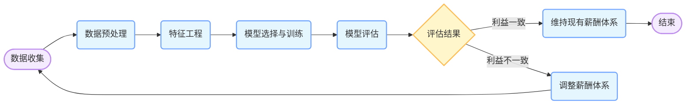

# AI驱动的管理层薪酬分析：评估利益一致性

> 关键词：AI、管理层薪酬分析、利益一致性、数据分析、机器学习

> 摘要：本文聚焦于利用AI技术进行管理层薪酬分析，以评估管理层与股东等利益相关者之间的利益一致性。首先介绍了相关背景知识，包括目的、预期读者等内容。接着阐述了核心概念及联系，详细解释了AI在薪酬分析中的原理和架构。通过Python代码深入讲解了核心算法原理和具体操作步骤，并给出了相应的数学模型和公式。结合项目实战，展示了代码实际案例并进行详细解读。探讨了该技术在实际中的应用场景，推荐了学习、开发所需的工具和资源，最后总结了未来发展趋势与挑战，解答了常见问题并提供了扩展阅读和参考资料，旨在为相关领域的研究者和从业者提供全面且深入的技术指导。

## 1. 背景介绍 
### 1.1 目的和范围
在现代企业治理中，管理层薪酬设计是一个至关重要的问题。合理的薪酬体系能够激励管理层为企业创造更大的价值，实现管理层与股东等利益相关者的利益一致性。然而，传统的薪酬分析方法往往难以全面、准确地评估这种利益一致性。随着人工智能技术的飞速发展，其强大的数据处理和分析能力为管理层薪酬分析提供了新的视角和方法。

本文的目的在于探讨如何利用AI技术进行管理层薪酬分析，以评估利益一致性。具体范围包括介绍AI在薪酬分析中的核心概念、算法原理、数学模型，通过实际案例展示如何运用AI技术进行薪酬分析，并探讨其在实际应用中的场景、面临的挑战和未来发展趋势。

### 1.2 预期读者
本文预期读者包括企业管理层、人力资源专家、财务分析师、投资者、学术研究人员以及对人工智能在企业管理领域应用感兴趣的技术爱好者。对于企业管理层和人力资源专家，本文可以帮助他们设计更合理的管理层薪酬体系；财务分析师和投资者可以借助文中的方法评估企业管理层薪酬的合理性；学术研究人员可以从中获取相关研究思路和方法；技术爱好者则可以了解AI在企业管理中的具体应用场景。

### 1.3 文档结构概述
本文将按照以下结构进行阐述：首先介绍相关背景知识，包括目的、预期读者、文档结构概述和术语表；接着讲解核心概念与联系，通过文本示意图和Mermaid流程图展示AI在薪酬分析中的原理和架构；然后详细介绍核心算法原理和具体操作步骤，并用Python代码进行说明；给出相应的数学模型和公式，并举例说明；通过项目实战展示代码实际案例并进行详细解读；探讨实际应用场景；推荐学习、开发所需的工具和资源；最后总结未来发展趋势与挑战，解答常见问题并提供扩展阅读和参考资料。

### 1.4 术语表
#### 1.4.1 核心术语定义
- **管理层薪酬**：指企业为管理层提供的各种形式的报酬，包括基本工资、奖金、股票期权、福利等。
- **利益一致性**：指管理层的利益与股东、员工、客户等利益相关者的利益在一定程度上保持一致，管理层的决策和行为能够促进各方利益的共同增长。
- **AI（人工智能）**：是一门研究如何使计算机系统能够模拟人类智能的学科，包括机器学习、深度学习、自然语言处理等技术。
- **机器学习**：是AI的一个重要分支，通过让计算机从数据中学习模式和规律，从而实现预测、分类等任务。

#### 1.4.2 相关概念解释
- **数据挖掘**：从大量的数据中发现有用信息和知识的过程，常用于分析管理层薪酬数据中的潜在模式和关系。
- **特征工程**：在机器学习中，将原始数据转换为适合模型输入的特征的过程，对于管理层薪酬分析，需要选择合适的特征来反映管理层的绩效和企业的经营状况。
- **模型评估**：评估机器学习模型性能的过程，常用的指标包括准确率、召回率、均方误差等，用于判断模型在管理层薪酬分析中的有效性。

#### 1.4.3 缩略词列表
- **AI**：Artificial Intelligence（人工智能）
- **ML**：Machine Learning（机器学习）
- **NLP**：Natural Language Processing（自然语言处理）
- **RMSE**：Root Mean Squared Error（均方根误差）

## 2. 核心概念与联系 
### 核心概念原理
AI驱动的管理层薪酬分析的核心原理是利用人工智能技术对管理层薪酬数据和相关企业数据进行分析，以评估管理层薪酬与企业绩效、股东利益等之间的关系，从而判断利益一致性。具体来说，通过收集管理层薪酬数据、企业财务数据、市场数据等多源数据，运用机器学习算法建立薪酬分析模型，挖掘数据中的潜在模式和规律。

例如，我们可以使用回归分析模型来预测管理层薪酬与企业净利润、股价涨幅等指标之间的关系。如果模型显示管理层薪酬与企业绩效指标之间存在较强的正相关关系，那么可以认为在一定程度上实现了利益一致性；反之，如果关系不显著或呈负相关，可能需要重新审视薪酬体系。

### 架构示意图
以下是AI驱动的管理层薪酬分析的架构示意图：



该架构主要包括以下几个步骤：
1. **数据收集**：收集管理层薪酬数据、企业财务数据、市场数据等多源数据。
2. **数据预处理**：对收集到的数据进行清洗、转换、归一化等操作，以提高数据质量。
3. **特征工程**：选择和提取与管理层薪酬分析相关的特征，如企业净利润、股价涨幅、管理层任期等。
4. **模型选择与训练**：根据数据特点和分析目标选择合适的机器学习模型，如线性回归、决策树、神经网络等，并使用训练数据对模型进行训练。
5. **模型评估**：使用测试数据对训练好的模型进行评估，计算模型的性能指标，如均方根误差（RMSE）、决定系数（$R^2$）等。
6. **评估结果判断**：根据模型评估结果判断管理层薪酬与企业绩效、股东利益等之间是否存在利益一致性。
7. **决策与调整**：如果评估结果显示利益一致，则维持现有薪酬体系；如果利益不一致，则调整薪酬体系，并重新进行数据收集和分析。

## 3. 核心算法原理 & 具体操作步骤 
### 核心算法原理 - 线性回归
线性回归是一种常用的机器学习算法，用于建立自变量和因变量之间的线性关系。在管理层薪酬分析中，我们可以使用线性回归模型来预测管理层薪酬与企业绩效指标之间的关系。

线性回归模型的基本形式为：

$$y = \beta_0 + \beta_1x_1 + \beta_2x_2 + \cdots + \beta_nx_n + \epsilon$$

其中，$y$ 是因变量（管理层薪酬），$x_1, x_2, \cdots, x_n$ 是自变量（企业绩效指标，如净利润、股价涨幅等），$\beta_0, \beta_1, \beta_2, \cdots, \beta_n$ 是模型的参数，$\epsilon$ 是误差项。

模型的目标是通过最小化误差项的平方和来估计参数 $\beta_0, \beta_1, \beta_2, \cdots, \beta_n$，即最小化以下损失函数：

$$L(\beta) = \sum_{i=1}^{m}(y_i - \hat{y}_i)^2 = \sum_{i=1}^{m}(y_i - (\beta_0 + \beta_1x_{i1} + \beta_2x_{i2} + \cdots + \beta_nx_{in}))^2$$

其中，$m$ 是样本数量，$y_i$ 是第 $i$ 个样本的实际值，$\hat{y}_i$ 是第 $i$ 个样本的预测值。

### 具体操作步骤
以下是使用Python实现线性回归进行管理层薪酬分析的具体操作步骤：

```python
import numpy as np
import pandas as pd
from sklearn.model_selection import train_test_split
from sklearn.linear_model import LinearRegression
from sklearn.metrics import mean_squared_error

# 步骤1：数据收集与读取
# 假设我们有一个包含管理层薪酬、企业净利润、股价涨幅等数据的CSV文件
data = pd.read_csv('management_compensation_data.csv')

# 步骤2：数据预处理
# 分离自变量和因变量
X = data[['net_profit', 'stock_price_increase']]  # 自变量：企业净利润、股价涨幅
y = data['management_compensation']  # 因变量：管理层薪酬

# 划分训练集和测试集
X_train, X_test, y_train, y_test = train_test_split(X, y, test_size=0.2, random_state=42)

# 步骤3：模型选择与训练
# 创建线性回归模型
model = LinearRegression()

# 训练模型
model.fit(X_train, y_train)

# 步骤4：模型预测
# 使用训练好的模型对测试集进行预测
y_pred = model.predict(X_test)

# 步骤5：模型评估
# 计算均方根误差（RMSE）
rmse = np.sqrt(mean_squared_error(y_test, y_pred))
print(f"均方根误差: {rmse}")

# 输出模型参数
print(f"截距: {model.intercept_}")
print(f"系数: {model.coef_}")
```

### 代码解释
1. **数据收集与读取**：使用 `pandas` 库读取包含管理层薪酬、企业净利润、股价涨幅等数据的CSV文件。
2. **数据预处理**：分离自变量和因变量，并使用 `train_test_split` 函数将数据划分为训练集和测试集，测试集占比为20%。
3. **模型选择与训练**：创建线性回归模型 `LinearRegression`，并使用训练集数据对模型进行训练。
4. **模型预测**：使用训练好的模型对测试集进行预测，得到预测结果 `y_pred`。
5. **模型评估**：计算预测结果与实际值之间的均方根误差（RMSE），并输出模型的截距和系数。

## 4. 数学模型和公式 & 详细讲解 & 举例说明 
### 线性回归模型的数学推导
线性回归模型的目标是最小化损失函数 $L(\beta)$，可以使用最小二乘法来求解模型的参数 $\beta$。

对损失函数 $L(\beta)$ 求关于 $\beta$ 的偏导数，并令其等于0：

$$\frac{\partial L(\beta)}{\partial \beta} = -2\sum_{i=1}^{m}(y_i - (\beta_0 + \beta_1x_{i1} + \beta_2x_{i2} + \cdots + \beta_nx_{in}))\begin{bmatrix}1 \\ x_{i1} \\ x_{i2} \\ \vdots \\ x_{in}\end{bmatrix} = 0$$

整理得到正规方程：

$$(X^TX)\beta = X^Ty$$

其中，$X$ 是自变量矩阵，$y$ 是因变量向量，$\beta$ 是模型参数向量。

求解正规方程可得：

$$\beta = (X^TX)^{-1}X^Ty$$

### 举例说明
假设我们有以下简单的数据集：

| 企业净利润（万元） | 股价涨幅（%） | 管理层薪酬（万元） |
| ----------------- | -------------- | ------------------ |
| 100               | 5              | 50                 |
| 200               | 10             | 80                 |
| 300               | 15             | 110                |
| 400               | 20             | 140                |

我们可以使用线性回归模型来预测管理层薪酬与企业净利润、股价涨幅之间的关系。

```python
import numpy as np

# 自变量矩阵
X = np.array([[1, 100, 5], [1, 200, 10], [1, 300, 15], [1, 400, 20]])

# 因变量向量
y = np.array([50, 80, 110, 140])

# 求解正规方程
beta = np.linalg.inv(X.T.dot(X)).dot(X.T).dot(y)

print(f"模型参数: {beta}")
```

运行上述代码，我们可以得到模型的参数 $\beta$，从而得到线性回归模型的具体表达式。

### 模型评估指标
除了均方根误差（RMSE），常用的线性回归模型评估指标还包括决定系数（$R^2$）：

$$R^2 = 1 - \frac{\sum_{i=1}^{m}(y_i - \hat{y}_i)^2}{\sum_{i=1}^{m}(y_i - \bar{y})^2}$$

其中，$\bar{y}$ 是因变量的平均值。$R^2$ 的取值范围是 $[0, 1]$，越接近1表示模型的拟合效果越好。

```python
from sklearn.metrics import r2_score

# 计算决定系数
r2 = r2_score(y_test, y_pred)
print(f"决定系数: {r2}")
```

## 5. 项目实战：代码实际案例和详细解释说明 
### 5.1  开发环境搭建
为了实现AI驱动的管理层薪酬分析项目，我们需要搭建以下开发环境：

#### 操作系统
推荐使用Windows、Linux或macOS操作系统。

#### Python环境
安装Python 3.7及以上版本，可以从Python官方网站（https://www.python.org/downloads/）下载并安装。

#### 依赖库安装
使用 `pip` 命令安装所需的依赖库：

```sh
pip install pandas numpy scikit-learn matplotlib
```

### 5.2  源代码详细实现和代码解读
以下是一个完整的项目实战代码示例，用于分析管理层薪酬与企业绩效指标之间的关系：

```python
import pandas as pd
import numpy as np
from sklearn.model_selection import train_test_split
from sklearn.linear_model import LinearRegression
from sklearn.metrics import mean_squared_error, r2_score
import matplotlib.pyplot as plt

# 步骤1：数据收集与读取
data = pd.read_csv('management_compensation_data.csv')

# 步骤2：数据预处理
# 分离自变量和因变量
X = data[['net_profit', 'stock_price_increase', 'employee_satisfaction']]  # 自变量：企业净利润、股价涨幅、员工满意度
y = data['management_compensation']  # 因变量：管理层薪酬

# 划分训练集和测试集
X_train, X_test, y_train, y_test = train_test_split(X, y, test_size=0.2, random_state=42)

# 步骤3：模型选择与训练
model = LinearRegression()
model.fit(X_train, y_train)

# 步骤4：模型预测
y_pred = model.predict(X_test)

# 步骤5：模型评估
rmse = np.sqrt(mean_squared_error(y_test, y_pred))
r2 = r2_score(y_test, y_pred)
print(f"均方根误差: {rmse}")
print(f"决定系数: {r2}")

# 步骤6：可视化结果
plt.scatter(y_test, y_pred)
plt.xlabel('实际管理层薪酬')
plt.ylabel('预测管理层薪酬')
plt.title('实际值与预测值对比')
plt.show()

# 步骤7：输出模型参数
print(f"截距: {model.intercept_}")
print(f"系数: {model.coef_}")
```

### 代码解读与分析
1. **数据收集与读取**：使用 `pandas` 库读取包含管理层薪酬、企业净利润、股价涨幅、员工满意度等数据的CSV文件。
2. **数据预处理**：分离自变量和因变量，并将数据划分为训练集和测试集，测试集占比为20%。
3. **模型选择与训练**：选择线性回归模型 `LinearRegression`，并使用训练集数据对模型进行训练。
4. **模型预测**：使用训练好的模型对测试集进行预测，得到预测结果 `y_pred`。
5. **模型评估**：计算预测结果与实际值之间的均方根误差（RMSE）和决定系数（$R^2$），评估模型的性能。
6. **可视化结果**：使用 `matplotlib` 库绘制实际值与预测值的散点图，直观展示模型的预测效果。
7. **输出模型参数**：输出模型的截距和系数，了解自变量对因变量的影响程度。

## 6. 实际应用场景 
### 企业薪酬体系设计
企业在设计管理层薪酬体系时，可以使用AI技术进行薪酬分析，评估不同薪酬方案下管理层与股东等利益相关者的利益一致性。通过分析历史数据和市场数据，建立薪酬预测模型，预测不同绩效指标下管理层的合理薪酬水平，从而设计出更加科学合理的薪酬体系。

### 投资者决策
投资者在评估企业投资价值时，可以关注管理层薪酬与企业绩效之间的关系。如果管理层薪酬与企业绩效高度相关，说明管理层的利益与股东利益一致，企业的治理结构较为合理，投资风险相对较低；反之，如果两者关系不显著或呈负相关，可能需要进一步深入分析企业的治理问题。

### 监管机构监管
监管机构可以利用AI技术对企业管理层薪酬进行监管，评估企业薪酬体系的合理性和合规性。通过分析大量企业的薪酬数据，发现潜在的薪酬不合理现象，及时采取措施进行干预，保护投资者和其他利益相关者的权益。

### 学术研究
学术研究人员可以使用AI技术进行管理层薪酬分析，探索管理层薪酬与企业绩效、公司治理等因素之间的内在关系。通过建立复杂的数学模型和机器学习算法，深入研究薪酬激励机制的有效性，为企业治理理论和实践提供理论支持。

## 7. 工具和资源推荐
### 7.1 学习资源推荐
#### 7.1.1 书籍推荐
- 《Python机器学习》（Sebastian Raschka著）：本书详细介绍了Python在机器学习中的应用，包括线性回归、决策树、神经网络等算法的原理和实现。
- 《深度学习》（Ian Goodfellow、Yoshua Bengio和Aaron Courville著）：深度学习领域的经典著作，全面介绍了深度学习的基本概念、算法和应用。
- 《计量经济学基础》（达摩达尔·N·古扎拉蒂著）：计量经济学领域的权威教材，介绍了线性回归等统计模型的理论和应用，对于理解管理层薪酬分析中的数学模型有很大帮助。

#### 7.1.2 在线课程
- Coursera平台上的“机器学习”课程（Andrew Ng教授主讲）：该课程是机器学习领域的经典入门课程，系统介绍了机器学习的基本概念、算法和应用。
- edX平台上的“深度学习微硕士学位项目”：提供深度学习领域的系统学习，包括卷积神经网络、循环神经网络等高级内容。
- 中国大学MOOC平台上的“计量经济学”课程：由国内知名高校教授授课，详细讲解计量经济学的理论和方法。

#### 7.1.3 技术博客和网站
- Towards Data Science：一个专注于数据科学和机器学习的技术博客平台，上面有很多关于管理层薪酬分析、AI应用等方面的优质文章。
- Kaggle：一个数据科学竞赛平台，上面有很多与企业数据、薪酬分析相关的数据集和开源代码，可以供学习者参考和实践。
- 知乎：一个知识分享平台，上面有很多关于人工智能、企业管理等领域的专业讨论和经验分享。

### 7.2 开发工具框架推荐
#### 7.2.1 IDE和编辑器
- PyCharm：一款专业的Python集成开发环境，提供代码编辑、调试、版本控制等功能，适合Python项目的开发。
- Jupyter Notebook：一个交互式的编程环境，支持Python、R等多种编程语言，适合数据探索、模型开发和可视化。
- Visual Studio Code：一款轻量级的代码编辑器，支持多种编程语言和插件扩展，可用于Python代码的编写和调试。

#### 7.2.2 调试和性能分析工具
- Py-Spy：一个Python性能分析工具，可以实时监测Python程序的CPU使用率、函数调用时间等信息，帮助开发者优化代码性能。
- cProfile：Python内置的性能分析模块，可以分析Python程序中各个函数的执行时间和调用次数，找出性能瓶颈。
- PDB：Python内置的调试器，可以在代码中设置断点，逐步执行代码，查看变量的值和程序的执行流程，方便调试代码。

#### 7.2.3 相关框架和库
- Scikit-learn：一个简单易用的机器学习库，提供了各种机器学习算法的实现，包括线性回归、决策树、支持向量机等，适合初学者快速上手。
- TensorFlow：一个开源的深度学习框架，由Google开发，提供了丰富的深度学习模型和工具，可用于构建复杂的神经网络模型。
- PyTorch：另一个流行的深度学习框架，由Facebook开发，具有动态图和易于使用的特点，广泛应用于学术界和工业界。

### 7.3 相关论文著作推荐
#### 7.3.1 经典论文
- Jensen, M. C., & Meckling, W. H. (1976). Theory of the firm: managerial behavior, agency costs and ownership structure. Journal of Financial Economics, 3(4), 305-360. 该论文提出了代理理论，探讨了管理层与股东之间的利益冲突和代理成本问题，为管理层薪酬研究奠定了理论基础。
- Murphy, K. J. (1999). Executive compensation. In O. Ashenfelter & D. Card (Eds.), Handbook of labor economics (Vol. 3, pp. 2485-2563). Elsevier. 这篇论文对管理层薪酬的理论和实证研究进行了全面综述，分析了管理层薪酬的影响因素和激励机制。

#### 7.3.2 最新研究成果
- Edmans, A., & Gabaix, X. (2020). Executive compensation: a modern primer. Review of Financial Studies, 33(5), 1958-2028. 该论文对近年来管理层薪酬研究的最新进展进行了总结和分析，提出了一些新的理论和实证研究方法。
- Bertrand, M., & Mullainathan, S. (2001). Are CEOs rewarded for luck? The ones without principals are. The Quarterly Journal of Economics, 116(3), 901-932. 这篇论文研究了CEO薪酬与企业运气因素之间的关系，发现CEO薪酬往往受到企业运气因素的影响，而不仅仅取决于其自身的努力和能力。

#### 7.3.3 应用案例分析
- Kaplan, S. N., & Minton, B. A. (2012). How has CEO turnover changed? International Review of Finance, 12(1), 57-87. 该论文通过对美国企业CEO更替情况的分析，探讨了CEO薪酬与企业绩效、公司治理等因素之间的关系，为企业管理层薪酬设计提供了实际案例参考。

## 8. 总结：未来发展趋势与挑战
### 未来发展趋势
- **多源数据融合**：未来的管理层薪酬分析将不仅仅依赖于企业财务数据，还会融合更多的外部数据，如社交媒体数据、行业数据等，以更全面地评估管理层的绩效和企业的经营状况。
- **深度学习应用**：随着深度学习技术的不断发展，其在管理层薪酬分析中的应用将越来越广泛。深度学习模型可以处理更复杂的数据和模式，提高薪酬分析的准确性和预测能力。
- **实时分析与动态调整**：借助实时数据采集和处理技术，企业可以实现对管理层薪酬的实时分析和动态调整。根据企业的实时绩效和市场变化，及时调整管理层薪酬，更好地实现利益一致性。
- **跨学科研究**：管理层薪酬分析将与管理学、经济学、心理学等多个学科进行更深入的交叉融合，综合考虑多种因素对管理层薪酬的影响，提出更加科学合理的薪酬设计方案。

### 挑战
- **数据质量与隐私问题**：多源数据的融合带来了数据质量和隐私保护的挑战。不同来源的数据可能存在格式不一致、数据缺失、错误等问题，需要进行有效的数据清洗和预处理。同时，在数据采集和使用过程中，需要严格遵守相关法律法规，保护数据隐私。
- **模型解释性**：深度学习等复杂模型虽然具有较高的预测能力，但模型的解释性较差。在管理层薪酬分析中，需要向企业管理层、股东等利益相关者解释模型的决策过程和结果，因此提高模型的解释性是一个亟待解决的问题。
- **算法偏见**：机器学习算法可能存在偏见，导致薪酬分析结果的不公平性。例如，如果训练数据存在偏差，模型可能会对某些群体产生歧视性的薪酬建议。需要采取有效的方法来检测和消除算法偏见，确保薪酬分析的公平性。
- **技术人才短缺**：AI驱动的管理层薪酬分析需要具备跨学科知识和技能的技术人才，包括机器学习、统计学、管理学等方面的知识。目前，这类技术人才相对短缺，企业和研究机构需要加强人才培养和引进。

## 9. 附录：常见问题与解答
### 问题1：如何选择合适的机器学习模型进行管理层薪酬分析？
解答：选择合适的机器学习模型需要考虑数据的特点和分析目标。如果数据具有线性关系，可以选择线性回归模型；如果数据存在复杂的非线性关系，可以考虑使用决策树、神经网络等模型。此外，还可以通过交叉验证等方法比较不同模型的性能，选择最优模型。

### 问题2：数据预处理包括哪些步骤？
解答：数据预处理通常包括数据清洗、数据转换、数据归一化等步骤。数据清洗主要是处理缺失值、异常值等问题；数据转换可以将数据转换为适合模型输入的格式，如对分类变量进行编码；数据归一化可以将不同特征的数据缩放到相同的范围，提高模型的训练效果。

### 问题3：如何评估模型的性能？
解答：常用的模型评估指标包括均方根误差（RMSE）、决定系数（$R^2$）、准确率、召回率等。对于回归问题，如管理层薪酬预测，可以使用RMSE和$R^2$来评估模型的性能；对于分类问题，可以使用准确率、召回率等指标。

### 问题4：如何解决模型的过拟合问题？
解答：过拟合是指模型在训练集上表现良好，但在测试集上表现不佳的问题。可以通过以下方法解决过拟合问题：增加训练数据、减少模型复杂度、使用正则化方法（如L1、L2正则化）、进行交叉验证等。

## 10. 扩展阅读 & 参考资料
### 扩展阅读
- 《人工智能时代的企业管理变革》：探讨了人工智能技术在企业管理各个领域的应用和影响，包括薪酬管理、绩效管理等方面。
- 《大数据与企业决策》：介绍了大数据技术在企业决策中的应用，如何利用大数据进行管理层薪酬分析和决策。

### 参考资料
- 《Python数据分析实战》：提供了Python在数据分析中的具体应用案例，包括数据处理、可视化、机器学习等方面的内容。
- 《机器学习实战》：通过实际案例介绍了机器学习算法的原理和实现，适合初学者学习和实践。

作者：AI天才研究院/AI Genius Institute & 禅与计算机程序设计艺术 /Zen And The Art of Computer Programming