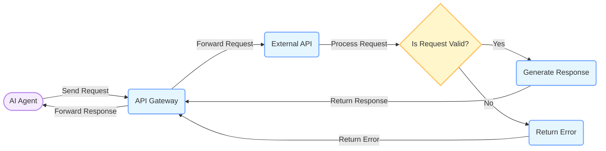

# API集成：扩展AI Agent的功能与数据源

> 关键词：API集成、AI Agent、功能扩展、数据源、数据交互

> 摘要：本文围绕API集成在扩展AI Agent功能与数据源方面展开深入探讨。首先介绍了API集成与AI Agent的相关背景知识，包括目的范围、预期读者等内容。接着阐述了核心概念与联系，通过文本示意图和Mermaid流程图展示其架构原理。详细讲解了核心算法原理和具体操作步骤，运用Python源代码进行说明。同时给出了相关的数学模型和公式，并举例说明。通过项目实战，展示了代码实际案例并进行详细解释。分析了实际应用场景，推荐了相关的工具和资源，最后总结了未来发展趋势与挑战，解答常见问题并提供扩展阅读与参考资料，旨在帮助读者全面了解如何利用API集成来增强AI Agent的能力。

## 1. 背景介绍 
### 1.1 目的和范围
在当今数字化时代，AI Agent已经成为众多领域中不可或缺的工具。然而，单一的AI Agent往往具有一定的局限性，其功能和可获取的数据源有限。API集成的目的就是打破这些限制，通过与外部系统进行数据交互和功能调用，扩展AI Agent的能力。本文章的范围涵盖了API集成的基本概念、核心算法、数学模型，以及如何在实际项目中进行API集成以扩展AI Agent的功能和数据源，同时探讨了相关的应用场景、工具资源等方面。

### 1.2 预期读者
本文预期读者包括AI开发者、软件工程师、数据科学家、技术架构师等对AI Agent和API集成感兴趣的专业人士。对于想要深入了解如何利用API集成来提升AI Agent性能和功能的初学者和有一定经验的开发者都具有参考价值。

### 1.3 文档结构概述
本文首先介绍API集成与AI Agent的背景知识，包括相关术语的定义和解释。然后阐述核心概念与联系，通过文本示意图和流程图展示其架构原理。接着详细讲解核心算法原理和具体操作步骤，结合Python代码进行说明。给出相关的数学模型和公式，并举例说明。通过项目实战展示代码实际案例并进行详细解释。分析实际应用场景，推荐相关的工具和资源。最后总结未来发展趋势与挑战，解答常见问题并提供扩展阅读与参考资料。

### 1.4 术语表
#### 1.4.1 核心术语定义
- **API（Application Programming Interface）**：应用程序编程接口，是一组定义、协议和工具，用于构建软件应用程序之间的交互。通过API，不同的软件系统可以相互通信和共享数据。
- **AI Agent**：人工智能代理，是一种能够感知环境、做出决策并采取行动以实现特定目标的软件实体。它可以是聊天机器人、智能助手等形式。
- **API集成**：将不同的API与AI Agent进行连接和整合，使AI Agent能够调用外部系统的功能和获取外部数据源。

#### 1.4.2 相关概念解释
- **数据交互**：指两个或多个系统之间进行数据的传输和共享。在API集成中，AI Agent通过API与外部系统进行数据交互，获取所需的数据或发送指令。
- **功能调用**：AI Agent通过API调用外部系统提供的功能，例如调用翻译API进行文本翻译，调用图像识别API进行图像分析等。

#### 1.4.3 缩略词列表
- **REST（Representational State Transfer）**：表述性状态转移，是一种软件架构风格，常用于设计网络API。
- **JSON（JavaScript Object Notation）**：一种轻量级的数据交换格式，常用于API数据的传输。

## 2. 核心概念与联系 
### 核心概念原理
API集成扩展AI Agent的功能与数据源的核心原理在于利用API作为桥梁，实现AI Agent与外部系统之间的通信。AI Agent通过发送请求到API接口，外部系统根据请求进行相应的处理，并将结果返回给AI Agent。这样，AI Agent就可以利用外部系统的功能和数据来增强自身的能力。

例如，一个智能客服AI Agent本身可能只具备基本的问答功能，但通过集成天气API，它就可以为用户提供天气信息；集成新闻API，它就可以为用户提供新闻资讯。

### 架构的文本示意图
```plaintext
+----------------+           +----------------+
|    AI Agent    |           |  External APIs |
+----------------+           +----------------+
| - Perception   | <-------> | - API Endpoints|
| - Decision     |           | - Data Sources |
| - Action       |           | - Services     |
+----------------+           +----------------+
```
在这个示意图中，AI Agent通过与外部API进行双向通信，从外部API获取数据和调用服务。AI Agent的感知模块负责发送请求，决策模块根据返回的数据做出决策，行动模块执行相应的操作。

### Mermaid流程图

这个流程图展示了AI Agent与外部API之间的交互过程。AI Agent首先发送请求到API网关，API网关将请求转发到外部API。外部API处理请求并判断其有效性，如果有效则生成响应，否则返回错误信息。最后，API网关将响应或错误信息转发给AI Agent。

## 3. 核心算法原理 & 具体操作步骤 
### 核心算法原理
API集成的核心算法主要涉及请求的生成、发送和响应的解析。以下是一个简单的Python示例，展示了如何使用`requests`库发送HTTP请求并解析响应。

```python
import requests

# 定义API的URL
api_url = "https://api.example.com/data"

# 定义请求头
headers = {
    "Content-Type": "application/json",
    "Authorization": "Bearer your_token"
}

# 定义请求参数
params = {
    "param1": "value1",
    "param2": "value2"
}

# 发送GET请求
response = requests.get(api_url, headers=headers, params=params)

# 检查响应状态码
if response.status_code == 200:
    # 解析响应的JSON数据
    data = response.json()
    print(data)
else:
    print(f"Request failed with status code: {response.status_code}")
```

### 具体操作步骤
1. **选择合适的API**：根据AI Agent的需求，选择合适的外部API。可以通过API市场、开发者文档等渠道查找。
2. **注册和获取API密钥**：大多数API需要注册并获取API密钥，用于身份验证和访问控制。
3. **了解API文档**：仔细阅读API文档，了解API的接口地址、请求方法（GET、POST等）、请求参数、响应格式等信息。
4. **生成请求**：根据API文档的要求，生成请求的URL、请求头和请求参数。
5. **发送请求**：使用合适的库（如`requests`）发送请求到API接口。
6. **处理响应**：根据响应的状态码和内容，进行相应的处理。如果响应状态码为200，表示请求成功，解析响应数据；否则，处理错误信息。

## 4. 数学模型和公式 & 详细讲解 & 举例说明 
### 数学模型
在API集成中，我们可以用一个简单的数学模型来描述AI Agent与外部API之间的交互。设AI Agent为$A$，外部API为$B$，请求为$R$，响应为$S$。

AI Agent向外部API发送请求可以表示为：
$$A \xrightarrow{R} B$$

外部API处理请求并返回响应可以表示为：
$$B \xrightarrow{S} A$$

### 详细讲解
在这个数学模型中，$A$和$B$分别代表AI Agent和外部API这两个实体。请求$R$是AI Agent向外部API发送的信息，它包含了AI Agent的需求，例如获取特定的数据或调用特定的功能。响应$S$是外部API对请求$R$的处理结果，它包含了AI Agent所需的信息或执行操作的反馈。

### 举例说明
假设AI Agent需要获取当前的天气信息，它向天气API发送一个请求$R$，请求中包含了城市名称等参数。天气API接收到请求后，根据请求中的参数查询天气数据，并生成响应$S$，将天气信息返回给AI Agent。

用数学模型表示为：
$$AI Agent \xrightarrow{\text{Request for weather in City X}} Weather API$$
$$Weather API \xrightarrow{\text{Weather information of City X}} AI Agent$$

## 5. 项目实战：代码实际案例和详细解释说明 
### 5.1  开发环境搭建
1. **安装Python**：确保你已经安装了Python 3.x版本。可以从Python官方网站（https://www.python.org/downloads/）下载并安装。
2. **安装`requests`库**：`requests`库是Python中用于发送HTTP请求的常用库。可以使用以下命令进行安装：
```sh
pip install requests
```
3. **获取API密钥**：以集成OpenWeatherMap的天气API为例，你需要在OpenWeatherMap网站（https://openweathermap.org/）注册并获取API密钥。

### 5.2  源代码详细实现和代码解读
```python
import requests

# 定义OpenWeatherMap API的URL
api_url = "https://api.openweathermap.org/data/2.5/weather"

# 定义API密钥
api_key = "your_api_key"

# 定义请求参数
params = {
    "q": "Beijing",  # 城市名称
    "appid": api_key,
    "units": "metric"  # 使用公制单位
}

# 发送GET请求
response = requests.get(api_url, params=params)

# 检查响应状态码
if response.status_code == 200:
    # 解析响应的JSON数据
    data = response.json()
    # 提取天气信息
    weather_description = data["weather"][0]["description"]
    temperature = data["main"]["temp"]
    print(f"The weather in Beijing is {weather_description} with a temperature of {temperature}°C.")
else:
    print(f"Request failed with status code: {response.status_code}")
```

### 代码解读与分析
1. **导入`requests`库**：用于发送HTTP请求。
2. **定义API的URL**：指定要调用的API的接口地址。
3. **定义API密钥**：用于身份验证，确保只有授权用户可以访问API。
4. **定义请求参数**：根据API文档的要求，设置请求的参数，例如城市名称、单位等。
5. **发送GET请求**：使用`requests.get()`方法发送请求，并将响应存储在`response`变量中。
6. **检查响应状态码**：如果状态码为200，表示请求成功；否则，输出错误信息。
7. **解析响应数据**：使用`response.json()`方法将响应的JSON数据解析为Python字典。
8. **提取所需信息**：从解析后的数据中提取所需的天气信息，例如天气描述和温度。

## 6. 实际应用场景 
### 智能客服系统
在智能客服系统中，AI Agent可以通过集成知识库API、常见问题解答API等，获取更丰富的知识和信息，从而更好地回答用户的问题。同时，还可以集成第三方的翻译API，为不同语言的用户提供服务。

### 金融投资领域
AI Agent在金融投资领域可以集成股票行情API、财经新闻API等，实时获取股票价格、市场动态等信息，为投资者提供决策支持。例如，根据股票行情数据进行分析和预测，推荐投资策略。

### 智能家居系统
在智能家居系统中，AI Agent可以集成各种设备的API，如智能灯泡、智能门锁、智能家电等。通过与这些设备的API进行交互，AI Agent可以实现对智能家居设备的远程控制和自动化管理。例如，根据用户的日程安排自动调节室内温度、灯光亮度等。

### 医疗保健领域
AI Agent在医疗保健领域可以集成医疗数据API、医学知识库API等，为医生和患者提供辅助诊断、健康咨询等服务。例如，根据患者的症状和病史，调用医学知识库API进行疾病诊断和治疗建议。

## 7. 工具和资源推荐
### 7.1 学习资源推荐
#### 7.1.1 书籍推荐
- 《Python网络编程实战》：详细介绍了Python中网络编程的基础知识和实践技巧，包括HTTP请求、API调用等内容。
- 《人工智能：现代方法》：经典的人工智能教材，涵盖了AI Agent的基本概念、算法和应用。
- 《RESTful Web Services》：深入讲解了RESTful API的设计原则和实现方法。

#### 7.1.2 在线课程
- Coursera上的“Python for Everybody”：适合初学者学习Python编程，包括HTTP请求和JSON数据处理。
- edX上的“Artificial Intelligence”：系统地介绍了人工智能的基本概念和算法，对理解AI Agent有很大帮助。
- Udemy上的“API Integration Masterclass”：专门讲解API集成的课程，包括如何选择API、如何进行请求和响应处理等内容。

#### 7.1.3 技术博客和网站
- Medium：有很多技术博主分享关于API集成、AI Agent等方面的文章和经验。
- Stack Overflow：一个知名的技术问答社区，可以在上面查找API集成和AI开发中遇到的问题和解决方案。
- API Gateway Blog：提供关于API网关和API集成的最新技术和趋势。

### 7.2 开发工具框架推荐
#### 7.2.1 IDE和编辑器
- PyCharm：一款功能强大的Python集成开发环境，提供代码编辑、调试、版本控制等功能，适合Python开发者进行API集成开发。
- Visual Studio Code：轻量级的代码编辑器，支持多种编程语言和插件扩展，可通过安装Python插件来进行Python开发。

#### 7.2.2 调试和性能分析工具
- Postman：一款流行的API调试工具，可以方便地发送HTTP请求、设置请求参数和请求头，查看响应结果，帮助开发者快速调试API。
- Charles Proxy：用于拦截和分析HTTP/HTTPS请求的工具，可以查看请求和响应的详细信息，帮助开发者进行性能分析和问题排查。

#### 7.2.3 相关框架和库
- Flask：一个轻量级的Python Web框架，可用于开发API服务和集成外部API。
- Django REST framework：基于Django的RESTful API开发框架，提供了丰富的功能和工具，方便开发者快速构建API。
- Swagger UI：一个可视化的API文档工具，可以根据API的定义自动生成交互式的文档，方便开发者查看和测试API。

### 7.3 相关论文著作推荐
#### 7.3.1 经典论文
- “Representational State Transfer (REST)” by Roy Fielding：提出了REST架构风格的经典论文，对理解和设计RESTful API具有重要的指导意义。
- “Artificial Agents: Theory and Practice” by Michael Wooldridge：介绍了AI Agent的理论和实践，对AI Agent的设计和开发有深入的探讨。

#### 7.3.2 最新研究成果
- 关注顶级学术会议如AAAI（Association for the Advancement of Artificial Intelligence）、IJCAI（International Joint Conference on Artificial Intelligence）等，这些会议上会有关于AI Agent和API集成的最新研究成果。
- 相关学术期刊如“Artificial Intelligence”、“Journal of Artificial Intelligence Research”等也会发表该领域的前沿研究论文。

#### 7.3.3 应用案例分析
- 一些知名公司的技术博客会分享他们在API集成和AI Agent应用方面的实践经验和案例分析，例如Google、Microsoft、Amazon等公司的官方博客。

## 8. 总结：未来发展趋势与挑战
### 未来发展趋势
- **更广泛的集成**：随着API市场的不断发展，AI Agent将能够集成更多类型的API，包括新兴技术领域的API，如区块链API、量子计算API等，从而进一步扩展其功能和数据源。
- **智能化的集成**：未来的API集成将更加智能化，AI Agent能够自动发现、评估和选择合适的API，根据不同的场景和需求进行动态集成。
- **跨领域的融合**：API集成将促进AI Agent在不同领域的融合应用，例如将医疗、金融、教育等领域的API进行集成，实现更复杂的业务流程和服务。

### 挑战
- **安全性问题**：API集成涉及到数据的传输和共享，安全问题是一个重要的挑战。需要确保API的身份验证、数据加密等安全机制的有效性，防止数据泄露和恶意攻击。
- **兼容性问题**：不同的API可能具有不同的接口规范、数据格式和协议，如何解决API之间的兼容性问题，实现无缝集成是一个难题。
- **管理和维护问题**：随着API集成的增加，管理和维护API的难度也会相应增加。需要建立有效的API管理平台，对API的使用、监控、更新等进行统一管理。

## 9. 附录：常见问题与解答
### 1. API集成会影响AI Agent的性能吗？
API集成可能会对AI Agent的性能产生一定的影响，主要体现在网络延迟和外部API的响应时间上。为了减少性能影响，可以采取以下措施：选择响应速度快的API、优化请求参数、使用缓存机制等。

### 2. 如何选择合适的API？
选择合适的API需要考虑以下因素：API的功能是否满足需求、API的稳定性和可靠性、API的文档是否完善、API的收费标准等。可以通过API市场、开发者社区等渠道了解不同API的评价和口碑。

### 3. API密钥泄露了怎么办？
如果API密钥泄露，应立即联系API提供商，重置API密钥。同时，检查相关的代码和系统，确保没有其他安全漏洞。为了防止API密钥泄露，应遵循安全的编程实践，如不将API密钥硬编码在代码中，使用环境变量或配置文件来管理API密钥。

### 4. 如何处理API调用失败的情况？
当API调用失败时，可以根据响应的状态码和错误信息进行相应的处理。例如，如果状态码为401，表示身份验证失败，需要检查API密钥是否正确；如果状态码为500，表示服务器内部错误，可以尝试重新调用API或联系API提供商解决问题。还可以设置重试机制，在一定次数内自动重试调用API。

## 10. 扩展阅读 & 参考资料
- 《API Design Best Practices》
- OpenAPI Specification (https://swagger.io/specification/)
- RESTful API Tutorial (https://www.restapitutorial.com/)
- AI Agent Research Papers on arXiv (https://arxiv.org/)

作者：AI天才研究院/AI Genius Institute & 禅与计算机程序设计艺术 /Zen And The Art of Computer Programming