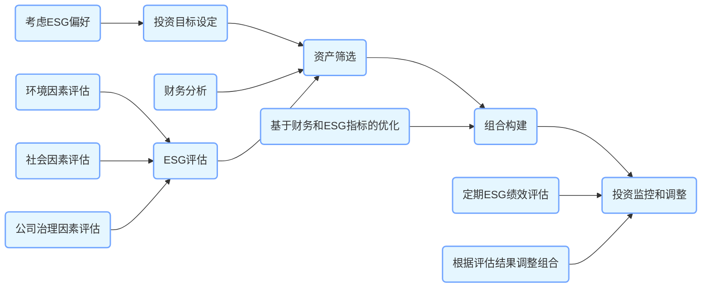

# ESG整合策略：将可持续发展因素纳入投资流程

> 关键词：ESG整合策略、可持续发展、投资流程、环境因素、社会责任、公司治理

> 摘要：本文聚焦于ESG整合策略，旨在深入探讨如何将可持续发展因素有效纳入投资流程。首先介绍了ESG整合策略的背景，包括目的、预期读者、文档结构和相关术语。接着阐述了ESG的核心概念及其联系，分析了核心算法原理与具体操作步骤，并通过数学模型和公式进行详细讲解。然后通过项目实战案例展示了ESG整合策略在实际中的应用，介绍了实际应用场景。还推荐了相关的学习资源、开发工具框架和论文著作。最后总结了ESG整合策略的未来发展趋势与挑战，并对常见问题进行了解答，提供了扩展阅读和参考资料。

## 1. 背景介绍 
### 1.1 目的和范围
随着全球对可持续发展的关注度不断提高，投资者越来越意识到将环境（Environmental）、社会（Social）和公司治理（Governance）因素（即ESG因素）纳入投资决策的重要性。ESG整合策略的目的在于通过系统地考虑这些可持续发展因素，识别投资机会和风险，从而实现长期的、可持续的投资回报。本文的范围涵盖了ESG整合策略的基本概念、核心算法、数学模型、实际应用案例以及相关的工具和资源推荐。

### 1.2 预期读者
本文的预期读者包括投资经理、金融分析师、资产所有者、可持续发展专家以及对ESG投资感兴趣的研究人员和学生。对于希望了解如何将ESG因素融入投资流程的专业人士，本文提供了全面的技术指导和实践案例；对于初学者，本文也提供了基础的概念解释和学习资源。

### 1.3 文档结构概述
本文共分为十个部分。第一部分介绍了ESG整合策略的背景，包括目的、预期读者、文档结构和术语表。第二部分阐述了ESG的核心概念及其联系，并提供了文本示意图和Mermaid流程图。第三部分详细讲解了核心算法原理和具体操作步骤，使用Python源代码进行说明。第四部分介绍了相关的数学模型和公式，并通过举例进行详细讲解。第五部分通过项目实战案例展示了ESG整合策略的实际应用，包括开发环境搭建、源代码实现和代码解读。第六部分介绍了ESG整合策略的实际应用场景。第七部分推荐了相关的学习资源、开发工具框架和论文著作。第八部分总结了ESG整合策略的未来发展趋势与挑战。第九部分解答了常见问题。第十部分提供了扩展阅读和参考资料。

### 1.4 术语表
#### 1.4.1 核心术语定义
- **ESG（Environmental, Social, and Governance）**：环境、社会和公司治理的缩写，是一种评估公司可持续发展表现的框架。
- **ESG整合策略**：将ESG因素系统地纳入投资决策过程的方法。
- **可持续发展**：满足当代人的需求，而不损害后代人满足其自身需求的能力的发展模式。
- **投资流程**：从投资目标设定、资产筛选、组合构建到投资监控和调整的一系列步骤。

#### 1.4.2 相关概念解释
- **环境因素**：包括气候变化、资源利用、污染防治等方面，评估公司在环境保护方面的表现。
- **社会因素**：涉及员工权益、社区关系、供应链管理等，衡量公司对社会的影响。
- **公司治理因素**：关注公司的治理结构、董事会独立性、高管薪酬等，反映公司的管理质量和透明度。

#### 1.4.3 缩略词列表
- **ESG**：Environmental, Social, and Governance
- **ETF**：Exchange-Traded Fund
- **ROI**：Return on Investment

## 2. 核心概念与联系 
ESG整合策略的核心在于将环境、社会和公司治理因素纳入传统的投资分析和决策过程中。传统的投资分析主要关注财务指标，如盈利、现金流和估值等，而ESG整合策略则在此基础上，增加了对公司可持续发展表现的评估。

### 核心概念原理
- **环境因素（E）**：环境因素主要涉及公司对自然环境的影响。例如，一家能源公司的碳排放水平、水资源利用效率以及对可再生能源的投资等，都会影响其环境绩效。高碳排放的公司可能面临政策风险、声誉风险和成本上升的压力，而积极投资可再生能源的公司则可能获得竞争优势。
- **社会因素（S）**：社会因素关注公司与利益相关者的关系，包括员工、客户、社区和供应链伙伴等。良好的员工关系可以提高员工满意度和生产力，增强公司的创新能力；积极的社区参与可以提升公司的声誉和社会认可度；严格的供应链管理可以确保产品质量和合规性。
- **公司治理因素（G）**：公司治理因素是指公司的管理结构和决策过程。有效的公司治理可以确保公司的决策符合股东利益，提高公司的透明度和问责制。例如，独立的董事会、合理的高管薪酬制度和健全的内部控制机制等，都是良好公司治理的体现。

### 架构的文本示意图
```plaintext
投资流程
|
|-- 投资目标设定
|   |-- 考虑ESG偏好
|
|-- 资产筛选
|   |-- 财务分析
|   |-- ESG评估
|       |-- 环境因素评估
|       |-- 社会因素评估
|       |-- 公司治理因素评估
|
|-- 组合构建
|   |-- 基于财务和ESG指标的优化
|
|-- 投资监控和调整
|   |-- 定期ESG绩效评估
|   |-- 根据评估结果调整组合
```

### Mermaid流程图


## 3. 核心算法原理 & 具体操作步骤 
### 核心算法原理
ESG整合策略的核心算法在于如何将ESG数据与财务数据相结合，以评估投资组合的风险和回报。一种常见的方法是使用多因素模型，将ESG因素作为额外的风险因子纳入模型中。

假设我们使用一个简单的线性多因素模型来评估股票的预期回报：

$$R_i = \alpha + \beta_1 F_1 + \beta_2 F_2 + \cdots + \beta_n F_n + \epsilon_i$$

其中，$R_i$ 是股票 $i$ 的预期回报，$\alpha$ 是截距项，$\beta_j$ 是股票 $i$ 对第 $j$ 个风险因子 $F_j$ 的敏感度，$\epsilon_i$ 是误差项。

在ESG整合策略中，我们可以将ESG因素作为额外的风险因子加入模型中。例如，我们可以定义一个环境风险因子 $F_{E}$、一个社会风险因子 $F_{S}$ 和一个公司治理风险因子 $F_{G}$，则模型变为：

$$R_i = \alpha + \beta_1 F_1 + \beta_2 F_2 + \cdots + \beta_n F_n + \beta_{E} F_{E} + \beta_{S} F_{S} + \beta_{G} F_{G} + \epsilon_i$$

### 具体操作步骤
#### 步骤1：数据收集
收集公司的财务数据和ESG数据。财务数据可以从财务报表、数据库等渠道获取，而ESG数据可以从专业的ESG评级机构、公司报告等渠道获取。

#### 步骤2：数据预处理
对收集到的数据进行清洗和标准化处理，以消除数据中的异常值和量纲差异。

#### 步骤3：因子计算
根据收集到的ESG数据，计算环境、社会和公司治理风险因子。例如，可以使用主成分分析（PCA）等方法来提取ESG数据中的主要成分，作为风险因子。

#### 步骤4：模型估计
使用历史数据来估计多因素模型中的参数 $\alpha$、$\beta_j$、$\beta_{E}$、$\beta_{S}$ 和 $\beta_{G}$。可以使用最小二乘法等方法进行估计。

#### 步骤5：投资组合优化
根据估计的模型参数，使用优化算法来构建投资组合，以最大化投资组合的预期回报或最小化投资组合的风险。

### Python源代码实现
```python
import pandas as pd
import numpy as np
from sklearn.linear_model import LinearRegression
from sklearn.preprocessing import StandardScaler
from scipy.optimize import minimize

# 步骤1：数据收集
# 假设我们已经收集到了财务数据和ESG数据，并存储在DataFrame中
financial_data = pd.read_csv('financial_data.csv')
esg_data = pd.read_csv('esg_data.csv')

# 步骤2：数据预处理
# 合并财务数据和ESG数据
data = pd.merge(financial_data, esg_data, on='company_id')

# 提取特征和目标变量
X = data.drop(['return', 'company_id'], axis=1)
y = data['return']

# 标准化数据
scaler = StandardScaler()
X_scaled = scaler.fit_transform(X)

# 步骤3：因子计算
# 假设我们已经计算出了环境、社会和公司治理风险因子
F_E = X_scaled[:, 0]
F_S = X_scaled[:, 1]
F_G = X_scaled[:, 2]

# 步骤4：模型估计
# 构建多因素模型
model = LinearRegression()
model.fit(X_scaled, y)

# 获取模型参数
alpha = model.intercept_
beta = model.coef_

# 步骤5：投资组合优化
# 定义目标函数：最小化投资组合的风险
def portfolio_risk(weights, cov_matrix):
    return np.dot(weights.T, np.dot(cov_matrix, weights))

# 定义约束条件：权重之和为1
def weight_constraint(weights):
    return np.sum(weights) - 1

# 初始化权重
num_assets = len(X.columns)
initial_weights = np.ones(num_assets) / num_assets

# 定义边界条件：权重在0到1之间
bounds = [(0, 1) for _ in range(num_assets)]

# 计算协方差矩阵
cov_matrix = np.cov(X_scaled.T)

# 优化投资组合
constraints = {'type': 'eq', 'fun': weight_constraint}
result = minimize(portfolio_risk, initial_weights, args=(cov_matrix,), bounds=bounds, constraints=constraints)

# 获取最优权重
optimal_weights = result.x

print("最优权重:", optimal_weights)
```

## 4. 数学模型和公式 & 详细讲解 & 举例说明 
### 多因素模型
在前面的章节中，我们介绍了一个简单的线性多因素模型来评估股票的预期回报：

$$R_i = \alpha + \beta_1 F_1 + \beta_2 F_2 + \cdots + \beta_n F_n + \beta_{E} F_{E} + \beta_{S} F_{S} + \beta_{G} F_{G} + \epsilon_i$$

其中，$R_i$ 是股票 $i$ 的预期回报，$\alpha$ 是截距项，$\beta_j$ 是股票 $i$ 对第 $j$ 个风险因子 $F_j$ 的敏感度，$\beta_{E}$、$\beta_{S}$ 和 $\beta_{G}$ 分别是股票 $i$ 对环境、社会和公司治理风险因子的敏感度，$\epsilon_i$ 是误差项。

### 详细讲解
- **截距项 $\alpha$**：表示股票的超额回报，即不依赖于任何风险因子的回报。
- **风险因子敏感度 $\beta_j$**：表示股票的回报对第 $j$ 个风险因子的变化的敏感程度。例如，如果 $\beta_1$ 为正，则表示股票的回报与第 $1$ 个风险因子正相关；如果 $\beta_1$ 为负，则表示股票的回报与第 $1$ 个风险因子负相关。
- **环境、社会和公司治理风险因子敏感度 $\beta_{E}$、$\beta_{S}$ 和 $\beta_{G}$**：分别表示股票的回报对环境、社会和公司治理风险因子的变化的敏感程度。这些敏感度可以帮助投资者评估公司的ESG表现对其回报的影响。
- **误差项 $\epsilon_i$**：表示股票回报中无法由风险因子解释的部分，通常被认为是随机噪声。

### 举例说明
假设我们有三只股票 A、B 和 C，以及三个风险因子：市场风险因子 $F_1$、规模风险因子 $F_2$ 和环境风险因子 $F_{E}$。我们通过历史数据估计得到了以下多因素模型参数：

| 股票 | $\alpha$ | $\beta_1$ | $\beta_2$ | $\beta_{E}$ |
|------|----------|----------|----------|------------|
| A    | 0.02     | 1.2      | 0.8      | 0.5        |
| B    | 0.01     | 0.9      | 1.1      | -0.3       |
| C    | 0.03     | 1.1      | 0.7      | 0.2        |

假设市场风险因子 $F_1$ 的预期值为 0.1，规模风险因子 $F_2$ 的预期值为 0.05，环境风险因子 $F_{E}$ 的预期值为 0.03。则我们可以计算出三只股票的预期回报：

- 股票 A 的预期回报：
$$R_A = 0.02 + 1.2 \times 0.1 + 0.8 \times 0.05 + 0.5 \times 0.03 = 0.185$$

- 股票 B 的预期回报：
$$R_B = 0.01 + 0.9 \times 0.1 + 1.1 \times 0.05 - 0.3 \times 0.03 = 0.146$$

- 股票 C 的预期回报：
$$R_C = 0.03 + 1.1 \times 0.1 + 0.7 \times 0.05 + 0.2 \times 0.03 = 0.171$$

通过比较三只股票的预期回报，投资者可以做出更明智的投资决策。

## 5. 项目实战：代码实际案例和详细解释说明 
### 5.1  开发环境搭建
#### 安装Python
首先，你需要安装Python。可以从Python官方网站（https://www.python.org/downloads/）下载适合你操作系统的Python版本，并按照安装向导进行安装。

#### 安装必要的库
在项目中，我们需要使用一些Python库，如`pandas`、`numpy`、`sklearn`和`scipy`。可以使用以下命令来安装这些库：

```sh
pip install pandas numpy scikit-learn scipy
```

#### 准备数据
假设我们已经收集到了财务数据和ESG数据，并存储在CSV文件中。财务数据文件名为`financial_data.csv`，ESG数据文件名为`esg_data.csv`。

### 5.2  源代码详细实现和代码解读
```python
import pandas as pd
import numpy as np
from sklearn.linear_model import LinearRegression
from sklearn.preprocessing import StandardScaler
from scipy.optimize import minimize

# 步骤1：数据收集
# 假设我们已经收集到了财务数据和ESG数据，并存储在DataFrame中
financial_data = pd.read_csv('financial_data.csv')
esg_data = pd.read_csv('esg_data.csv')

# 代码解读：使用pandas的read_csv函数读取CSV文件，并将数据存储在DataFrame中

# 步骤2：数据预处理
# 合并财务数据和ESG数据
data = pd.merge(financial_data, esg_data, on='company_id')

# 提取特征和目标变量
X = data.drop(['return', 'company_id'], axis=1)
y = data['return']

# 标准化数据
scaler = StandardScaler()
X_scaled = scaler.fit_transform(X)

# 代码解读：使用pandas的merge函数合并财务数据和ESG数据，然后使用drop函数提取特征和目标变量。
# 使用StandardScaler对特征数据进行标准化处理，以消除数据中的量纲差异。

# 步骤3：因子计算
# 假设我们已经计算出了环境、社会和公司治理风险因子
F_E = X_scaled[:, 0]
F_S = X_scaled[:, 1]
F_G = X_scaled[:, 2]

# 代码解读：这里简单假设前三个特征分别是环境、社会和公司治理风险因子。

# 步骤4：模型估计
# 构建多因素模型
model = LinearRegression()
model.fit(X_scaled, y)

# 获取模型参数
alpha = model.intercept_
beta = model.coef_

# 代码解读：使用sklearn的LinearRegression类构建多因素模型，并使用fit方法拟合数据。
# 使用intercept_属性获取截距项，使用coef_属性获取系数。

# 步骤5：投资组合优化
# 定义目标函数：最小化投资组合的风险
def portfolio_risk(weights, cov_matrix):
    return np.dot(weights.T, np.dot(cov_matrix, weights))

# 定义约束条件：权重之和为1
def weight_constraint(weights):
    return np.sum(weights) - 1

# 初始化权重
num_assets = len(X.columns)
initial_weights = np.ones(num_assets) / num_assets

# 定义边界条件：权重在0到1之间
bounds = [(0, 1) for _ in range(num_assets)]

# 计算协方差矩阵
cov_matrix = np.cov(X_scaled.T)

# 优化投资组合
constraints = {'type': 'eq', 'fun': weight_constraint}
result = minimize(portfolio_risk, initial_weights, args=(cov_matrix,), bounds=bounds, constraints=constraints)

# 获取最优权重
optimal_weights = result.x

print("最优权重:", optimal_weights)

# 代码解读：定义目标函数portfolio_risk，用于计算投资组合的风险。
# 定义约束条件weight_constraint，确保权重之和为1。
# 使用numpy的cov函数计算协方差矩阵。
# 使用scipy的minimize函数进行投资组合优化，获取最优权重。
```

### 5.3  代码解读与分析
- **数据处理**：使用`pandas`库进行数据的读取、合并和处理，使用`sklearn`库的`StandardScaler`进行数据标准化。数据处理是模型训练的基础，标准化处理可以提高模型的稳定性和准确性。
- **模型估计**：使用`sklearn`的`LinearRegression`类构建多因素模型，并进行参数估计。线性回归模型是一种简单而有效的模型，可以用于预测股票的预期回报。
- **投资组合优化**：使用`scipy`的`minimize`函数进行投资组合优化，以最小化投资组合的风险。优化过程中需要定义目标函数、约束条件和边界条件。

## 6. 实际应用场景 
### 资产管理公司
资产管理公司可以使用ESG整合策略来构建可持续投资组合。通过将ESG因素纳入投资决策过程，资产管理公司可以筛选出具有良好ESG表现的公司，降低投资组合的风险，同时实现长期的可持续回报。例如，一些资产管理公司会推出ESG主题的基金，吸引关注可持续发展的投资者。

### 养老基金和保险公司
养老基金和保险公司通常具有长期的投资期限，对投资组合的稳定性和可持续性有较高的要求。ESG整合策略可以帮助它们识别和管理与环境、社会和公司治理相关的风险，保障资产的长期增值。例如，养老基金可以通过投资可再生能源项目来降低对化石燃料行业的依赖，减少气候变化带来的风险。

### 企业投资者
企业投资者可以使用ESG整合策略来评估潜在的投资项目和合作伙伴。通过考虑ESG因素，企业投资者可以选择与自身价值观相符的项目和合作伙伴，提高企业的社会形象和声誉。例如，一家科技公司在进行并购时，可以优先考虑具有良好数据隐私保护和员工福利政策的目标公司。

### 政府和监管机构
政府和监管机构可以通过制定相关政策和法规，鼓励和引导投资者采用ESG整合策略。例如，一些国家和地区已经出台了强制性的ESG信息披露要求，促使公司提高ESG透明度。政府还可以通过税收优惠、补贴等政策措施，支持可持续投资的发展。

## 7. 工具和资源推荐
### 7.1 学习资源推荐
#### 7.1.1 书籍推荐
- 《可持续投资：环境、社会和治理（ESG）整合指南》（Sustainable Investing: The Art of Long-Term Performance）：本书全面介绍了ESG投资的概念、方法和实践，适合初学者和专业人士阅读。
- 《ESG投资：从理论到实践》（ESG Investing: From Theory to Practice）：本书结合了理论和实际案例，深入探讨了ESG投资的策略和应用，对投资者和研究人员有很大的参考价值。

#### 7.1.2 在线课程
- Coursera上的“可持续金融与投资”（Sustainable Finance and Investing）课程：该课程由知名大学的教授授课，系统介绍了可持续金融和ESG投资的基本概念、理论和实践。
- edX上的“ESG投资与风险管理”（ESG Investing and Risk Management）课程：该课程聚焦于ESG投资的风险管理，通过案例分析和模拟实践，帮助学员掌握ESG投资的核心技能。

#### 7.1.3 技术博客和网站
- MSCI ESG Research：MSCI是全球知名的指数编制公司和ESG研究机构，其官方网站提供了丰富的ESG研究报告和数据。
- Sustainalytics：Sustainalytics是一家专注于ESG研究和评级的公司，其网站提供了有关ESG投资的最新资讯和分析。

### 7.2 开发工具框架推荐
#### 7.2.1 IDE和编辑器
- PyCharm：PyCharm是一款专业的Python集成开发环境，具有强大的代码编辑、调试和项目管理功能，适合开发ESG投资相关的Python代码。
- Jupyter Notebook：Jupyter Notebook是一种交互式的编程环境，支持多种编程语言，方便进行数据探索、模型开发和结果展示。

#### 7.2.2 调试和性能分析工具
- pdb：pdb是Python的内置调试工具，可以帮助开发者定位和解决代码中的问题。
- cProfile：cProfile是Python的性能分析工具，可以帮助开发者找出代码中的性能瓶颈。

#### 7.2.3 相关框架和库
- pandas：pandas是Python的数据分析库，提供了高效的数据结构和数据处理工具，适合处理ESG数据和财务数据。
- numpy：numpy是Python的数值计算库，提供了高效的数组操作和数学函数，适合进行模型计算和优化。
- scikit-learn：scikit-learn是Python的机器学习库，提供了丰富的机器学习算法和工具，适合进行ESG模型的开发和评估。

### 7.3 相关论文著作推荐
#### 7.3.1 经典论文
- “Corporate Social Responsibility and Financial Performance: Correlation or Misspecification?”（《企业社会责任与财务绩效：相关性还是误设？》）：该论文探讨了企业社会责任与财务绩效之间的关系，对ESG投资的理论基础有重要贡献。
- “The Impact of Corporate Social Responsibility on Firm Value: The Role of Customer Awareness”（《企业社会责任对企业价值的影响：客户认知的作用》）：该论文研究了企业社会责任对企业价值的影响机制，为ESG投资提供了理论支持。

#### 7.3.2 最新研究成果
- 《Journal of Sustainable Finance & Investment》：该期刊专注于可持续金融和投资领域的研究，发表了许多关于ESG投资的最新研究成果。
- 《Review of Finance》：该期刊是金融领域的顶级期刊之一，偶尔也会发表与ESG投资相关的高质量研究论文。

#### 7.3.3 应用案例分析
- 《ESG Investing Case Studies》：该书收集了多个ESG投资的实际案例，分析了不同行业和地区的ESG投资策略和效果，对投资者有很大的借鉴意义。

## 8. 总结：未来发展趋势与挑战
### 未来发展趋势
- **监管加强**：随着全球对可持续发展的关注度不断提高，政府和监管机构将加强对ESG信息披露和投资的监管。未来，可能会出台更多的强制性ESG信息披露要求，以及对ESG投资产品的规范和监管。
- **数据质量提升**：ESG数据的质量和可用性是ESG整合策略实施的关键。未来，随着数据收集和分析技术的不断发展，ESG数据的质量将得到提升，数据的覆盖面和准确性将进一步提高。
- **智能化应用**：人工智能和机器学习技术将在ESG整合策略中得到更广泛的应用。例如，通过自然语言处理技术可以从大量的文本数据中提取ESG信息，通过深度学习模型可以更准确地评估公司的ESG绩效。
- **跨行业融合**：ESG整合策略将不仅仅局限于金融行业，还将与其他行业进行更深入的融合。例如，制造业、能源业等行业将更加注重ESG因素，将可持续发展理念融入到企业的战略和运营中。

### 挑战
- **数据标准不统一**：目前，ESG数据的标准和定义尚未统一，不同的评级机构和数据提供商可能采用不同的方法和指标来评估公司的ESG表现。这给投资者带来了很大的困扰，难以进行有效的比较和分析。
- **ESG绩效评估困难**：ESG因素往往具有复杂性和主观性，难以用单一的指标来准确评估公司的ESG绩效。例如，如何衡量公司的社会责任表现，如何评估公司的环境管理能力等，都是具有挑战性的问题。
- **短期与长期利益平衡**：在投资决策中，投资者往往面临短期利益和长期利益的平衡问题。一些具有良好ESG表现的公司可能在短期内的财务绩效不如传统公司，这可能导致投资者在追求短期回报的压力下，忽视ESG因素。
- **人才短缺**：ESG整合策略需要具备跨学科知识和技能的人才，包括金融、环境科学、社会学等领域的知识。目前，市场上这类人才相对短缺，制约了ESG投资的发展。

## 9. 附录：常见问题与解答
### 问题1：ESG整合策略是否会降低投资回报？
解答：从理论上讲，ESG整合策略并不一定会降低投资回报。相反，通过考虑ESG因素，投资者可以识别和避免一些潜在的风险，同时发现具有长期增长潜力的公司。一些研究表明，具有良好ESG表现的公司在长期内往往具有更好的财务绩效。然而，在短期内，ESG整合策略可能会受到市场波动和投资者情绪的影响，导致投资回报出现波动。

### 问题2：如何获取可靠的ESG数据？
解答：可以从以下几个渠道获取可靠的ESG数据：
- **专业的ESG评级机构**：如MSCI、Sustainalytics等，这些机构提供了全面的ESG评级和数据服务。
- **公司报告**：许多公司会在其年度报告、可持续发展报告中披露ESG相关信息。
- **政府和监管机构**：一些政府和监管机构会要求公司披露ESG信息，这些信息可以从相关的政府网站上获取。

### 问题3：ESG整合策略适用于所有类型的投资者吗？
解答：ESG整合策略适用于大多数类型的投资者，尤其是那些关注长期投资回报和可持续发展的投资者。然而，不同类型的投资者可能对ESG因素的重视程度和应用方式有所不同。例如，养老基金和保险公司可能更注重ESG因素对投资组合风险的影响，而个人投资者可能更关注公司的社会责任表现。

### 问题4：如何衡量ESG整合策略的效果？
解答：可以从以下几个方面衡量ESG整合策略的效果：
- **投资组合的风险和回报**：比较采用ESG整合策略前后投资组合的风险和回报表现。
- **ESG绩效评估**：定期评估投资组合中公司的ESG绩效，观察其变化趋势。
- **社会和环境影响**：评估投资组合对社会和环境的积极影响，如减少碳排放、促进社会公平等。

## 10. 扩展阅读 & 参考资料
### 扩展阅读
- 《绿色金融与可持续发展》：本书介绍了绿色金融的概念、政策和实践，对理解ESG投资的宏观背景有很大帮助。
- 《可持续发展报告指南》：该指南提供了公司编制可持续发展报告的标准和方法，有助于投资者更好地理解公司的ESG信息。

### 参考资料
- MSCI ESG Research. “ESG Investing: A Primer.”
- Sustainalytics. “ESG Risk Ratings Methodology.”
- Global Reporting Initiative (GRI). “GRI Standards.”

作者：AI天才研究院/AI Genius Institute & 禅与计算机程序设计艺术 /Zen And The Art of Computer Programming