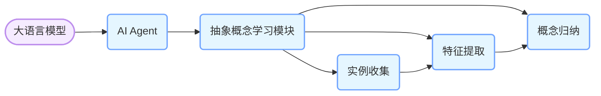

# LLM在AI Agent抽象概念学习中的应用

> 关键词：大语言模型（LLM）、AI Agent、抽象概念学习、自然语言处理、知识表示

> 摘要：本文深入探讨了大语言模型（LLM）在AI Agent抽象概念学习中的应用。首先介绍了相关背景，包括目的、预期读者、文档结构和术语表。接着阐述了核心概念与联系，分析了核心算法原理并给出Python代码示例，同时介绍了相关数学模型和公式。通过项目实战展示了代码的实际应用和详细解释，探讨了实际应用场景。最后推荐了学习资源、开发工具框架和相关论文著作，总结了未来发展趋势与挑战，并给出常见问题解答和扩展阅读参考资料。旨在为读者全面呈现LLM在AI Agent抽象概念学习领域的应用现状和发展前景。

## 1. 背景介绍 
### 1.1 目的和范围
随着人工智能技术的飞速发展，AI Agent需要具备更高级的认知能力，其中抽象概念学习是关键的一环。大语言模型（LLM）以其强大的语言理解和生成能力，为AI Agent的抽象概念学习提供了新的思路和方法。本文的目的在于深入探讨LLM在AI Agent抽象概念学习中的应用，包括核心原理、算法实现、实际案例等方面，为相关研究和开发人员提供全面的技术参考。范围涵盖了LLM和AI Agent的基本概念、抽象概念学习的理论和实践，以及LLM在不同应用场景中的具体应用。

### 1.2 预期读者
本文预期读者包括人工智能领域的研究人员、开发者、学生，以及对AI Agent和大语言模型感兴趣的技术爱好者。对于希望深入了解LLM在AI Agent抽象概念学习中应用的专业人士，本文将提供详细的技术分析和实践指导；对于初学者，也能通过清晰的阐述和丰富的案例，建立起对该领域的基本认识。

### 1.3 文档结构概述
本文将按照以下结构进行组织：首先介绍核心概念与联系，包括LLM、AI Agent和抽象概念学习的定义和相互关系；接着详细讲解核心算法原理和具体操作步骤，并给出Python代码示例；然后介绍相关的数学模型和公式，并通过具体例子进行说明；通过项目实战展示LLM在AI Agent抽象概念学习中的实际应用；探讨实际应用场景；推荐学习资源、开发工具框架和相关论文著作；最后总结未来发展趋势与挑战，给出常见问题解答和扩展阅读参考资料。

### 1.4 术语表
#### 1.4.1 核心术语定义
- **大语言模型（Large Language Model，LLM）**：基于深度学习技术，通过在大规模文本数据上进行训练，学习语言的统计规律和语义信息，能够生成自然流畅的文本的模型。例如GPT-3、ChatGPT等。
- **AI Agent**：能够感知环境、自主决策并执行相应动作的智能实体。它可以是软件程序、机器人等，旨在完成特定的任务。
- **抽象概念学习**：AI Agent从具体的实例中提取出一般性的、高层次的概念和知识的过程。例如，从不同的苹果、香蕉等水果实例中学习到“水果”这一抽象概念。

#### 1.4.2 相关概念解释
- **自然语言处理（Natural Language Processing，NLP）**：是一门研究如何让计算机理解、处理和生成人类语言的学科。LLM是NLP领域的重要成果，通过处理自然语言文本，实现语言理解和生成任务。
- **知识表示**：将知识以计算机能够理解和处理的方式进行表示的方法。在AI Agent抽象概念学习中，知识表示用于存储和管理学习到的抽象概念和相关信息。

#### 1.4.3 缩略词列表
- **LLM**：Large Language Model（大语言模型）
- **AI**：Artificial Intelligence（人工智能）
- **NLP**：Natural Language Processing（自然语言处理）

## 2. 核心概念与联系 
### 核心概念原理
#### 大语言模型（LLM）
大语言模型通常基于Transformer架构，通过在大规模的文本语料上进行无监督学习，学习到语言的模式和语义信息。它的核心是注意力机制，能够捕捉文本中不同位置之间的依赖关系。例如，在处理句子“我喜欢吃苹果”时，模型能够理解“我”和“苹果”之间的动作关系。

#### AI Agent
AI Agent是一个具有自主性和适应性的智能实体。它由感知模块、决策模块和执行模块组成。感知模块负责获取环境信息，决策模块根据感知到的信息和内部的知识进行决策，执行模块执行决策结果。例如，一个智能客服机器人作为AI Agent，通过感知用户的输入信息，根据内部的知识库和算法进行决策，然后输出相应的回复。

#### 抽象概念学习
抽象概念学习是AI Agent从具体的实例中提取出一般性概念的过程。这需要AI Agent具备归纳、推理和泛化的能力。例如，通过观察多个不同颜色、形状的苹果，AI Agent可以学习到“苹果”这一抽象概念，包括其特征和属性。

### 架构的文本示意图
```plaintext
+-------------------+
|      大语言模型      |
| (LLM)             |
+-------------------+
       |
       | 提供语言知识和语义理解能力
       v
+-------------------+
|      AI Agent      |
|                   |
| - 感知模块         |
| - 决策模块         |
| - 执行模块         |
+-------------------+
       |
       | 利用LLM进行抽象概念学习
       v
+-------------------+
| 抽象概念学习模块    |
|                   |
| - 实例收集         |
| - 特征提取         |
| - 概念归纳         |
+-------------------+
```

### Mermaid流程图


## 3. 核心算法原理 & 具体操作步骤 
### 核心算法原理
在AI Agent抽象概念学习中，LLM主要用于提供语言理解和知识推理的能力。具体算法步骤如下：
1. **实例收集**：AI Agent从环境中收集与目标抽象概念相关的具体实例。例如，要学习“动物”的抽象概念，AI Agent可以收集猫、狗、鸟等动物的描述信息。
2. **特征提取**：利用LLM对收集到的实例进行分析，提取出实例的特征和属性。例如，对于猫的描述“猫是一种毛茸茸的动物，会抓老鼠”，LLM可以提取出“毛茸茸”、“会抓老鼠”等特征。
3. **概念归纳**：根据提取的特征，AI Agent通过LLM进行推理和归纳，形成抽象概念。例如，通过对多个动物实例的特征分析，归纳出“动物”的抽象概念，包括具有生命、能够自主运动等特征。

### 具体操作步骤的Python代码示例
```python
import openai

# 设置OpenAI API密钥
openai.api_key = "your_api_key"

# 实例收集
instances = [
    "猫是一种毛茸茸的动物，会抓老鼠",
    "狗是人类的好朋友，会看家护院",
    "鸟有翅膀，会飞"
]

# 特征提取函数
def extract_features(instance):
    prompt = f"提取以下描述中动物的特征：{instance}"
    response = openai.Completion.create(
        engine="text-davinci-003",
        prompt=prompt,
        max_tokens=100
    )
    features = response.choices[0].text.strip()
    return features

# 概念归纳函数
def concept_induction(features_list):
    prompt = f"根据以下动物特征归纳出动物的抽象概念：{', '.join(features_list)}"
    response = openai.Completion.create(
        engine="text-davinci-003",
        prompt=prompt,
        max_tokens=200
    )
    concept = response.choices[0].text.strip()
    return concept

# 提取特征
features_list = []
for instance in instances:
    features = extract_features(instance)
    features_list.append(features)

# 概念归纳
abstract_concept = concept_induction(features_list)

print("提取的特征列表：", features_list)
print("归纳出的抽象概念：", abstract_concept)
```
### 代码解释
1. **实例收集**：定义了一个包含多个动物描述的列表`instances`，作为具体实例。
2. **特征提取函数`extract_features`**：使用OpenAI的API，通过构造一个提示信息，让LLM提取实例中的动物特征。
3. **概念归纳函数`concept_induction`**：将提取的特征列表作为输入，构造提示信息，让LLM根据这些特征归纳出动物的抽象概念。
4. **主程序**：遍历实例列表，提取每个实例的特征，将特征列表传递给概念归纳函数，得到抽象概念并输出。

## 4. 数学模型和公式 & 详细讲解 & 举例说明 
### 数学模型和公式
在LLM的训练和推理过程中，常用的数学模型是基于Transformer架构的神经网络。Transformer的核心是多头注意力机制，其数学公式如下：

#### 多头注意力机制
多头注意力机制可以表示为：
$$
\text{MultiHead}(Q, K, V) = \text{Concat}(\text{head}_1, \cdots, \text{head}_h)W^O
$$
其中，
$$
\text{head}_i = \text{Attention}(QW_i^Q, KW_i^K, VW_i^V)
$$
$$
\text{Attention}(Q, K, V) = \text{softmax}\left(\frac{QK^T}{\sqrt{d_k}}\right)V
$$

- $Q$ 是查询矩阵，$K$ 是键矩阵，$V$ 是值矩阵。
- $W_i^Q$、$W_i^K$、$W_i^V$ 是可学习的投影矩阵，用于将输入映射到不同的子空间。
- $W^O$ 是输出投影矩阵。
- $d_k$ 是键向量的维度。

### 详细讲解
- **查询（Query）、键（Key）和值（Value）**：在多头注意力机制中，输入的序列会被分别投影到查询、键和值三个矩阵中。查询矩阵用于表示当前要关注的位置，键矩阵用于表示可以被关注的位置，值矩阵用于表示被关注位置的信息。
- **注意力分数计算**：通过计算查询矩阵和键矩阵的点积，得到注意力分数。为了防止点积结果过大，会除以 $\sqrt{d_k}$ 进行缩放。然后使用softmax函数将注意力分数转换为概率分布。
- **注意力加权求和**：将注意力分数与值矩阵相乘，得到加权后的信息，再进行求和，得到最终的注意力输出。
- **多头机制**：通过多个不同的投影矩阵，将输入映射到不同的子空间，并行计算多个注意力头，最后将结果拼接起来，增加模型的表达能力。

### 举例说明
假设有一个输入序列 $x = [x_1, x_2, x_3]$，维度为 $d$。首先，将 $x$ 分别投影到查询、键和值矩阵：
$$
Q = xW^Q, \quad K = xW^K, \quad V = xW^V
$$
其中，$W^Q$、$W^K$、$W^V$ 是投影矩阵，维度为 $d \times d_k$。

计算注意力分数：
$$
\text{Scores} = \frac{QK^T}{\sqrt{d_k}}
$$

假设 $d_k = 2$，具体计算过程如下：
$$
Q = \begin{bmatrix}
q_{11} & q_{12} \\
q_{21} & q_{22} \\
q_{31} & q_{32}
\end{bmatrix}, \quad K = \begin{bmatrix}
k_{11} & k_{12} \\
k_{21} & k_{22} \\
k_{31} & k_{32}
\end{bmatrix}
$$
$$
\text{Scores} = \frac{1}{\sqrt{2}}\begin{bmatrix}
q_{11}k_{11} + q_{12}k_{12} & q_{11}k_{21} + q_{12}k_{22} & q_{11}k_{31} + q_{12}k_{32} \\
q_{21}k_{11} + q_{22}k_{12} & q_{21}k_{21} + q_{22}k_{22} & q_{21}k_{31} + q_{22}k_{32} \\
q_{31}k_{11} + q_{32}k_{12} & q_{31}k_{21} + q_{32}k_{22} & q_{31}k_{31} + q_{32}k_{32}
\end{bmatrix}
$$

使用softmax函数得到注意力概率分布：
$$
\text{Attention} = \text{softmax}(\text{Scores})
$$

最后，计算注意力输出：
$$
\text{Output} = \text{Attention}V
$$

通过多头机制，重复上述过程 $h$ 次，将 $h$ 个注意力头的输出拼接起来，再通过输出投影矩阵 $W^O$ 得到最终的多头注意力输出。

## 5. 项目实战：代码实际案例和详细解释说明 
### 5.1  开发环境搭建
#### 安装Python
确保你已经安装了Python 3.7或更高版本。可以从Python官方网站（https://www.python.org/downloads/）下载并安装。

#### 安装必要的库
使用pip安装OpenAI库：
```sh
pip install openai
```

#### 获取OpenAI API密钥
访问OpenAI官方网站（https://platform.openai.com/），注册账号并获取API密钥。将API密钥设置为环境变量或在代码中直接使用。

### 5.2  源代码详细实现和代码解读
```python
import openai

# 设置OpenAI API密钥
openai.api_key = "your_api_key"

# 实例收集
instances = [
    "苹果是一种水果，通常是红色或绿色的，味道甜美",
    "香蕉是一种水果，黄色的，弯弯的，口感软糯",
    "葡萄是一种水果，有紫色、绿色等颜色，成串生长"
]

# 特征提取函数
def extract_features(instance):
    prompt = f"提取以下描述中水果的特征：{instance}"
    response = openai.Completion.create(
        engine="text-davinci-003",
        prompt=prompt,
        max_tokens=100
    )
    features = response.choices[0].text.strip()
    return features

# 概念归纳函数
def concept_induction(features_list):
    prompt = f"根据以下水果特征归纳出水果的抽象概念：{', '.join(features_list)}"
    response = openai.Completion.create(
        engine="text-davinci-003",
        prompt=prompt,
        max_tokens=200
    )
    concept = response.choices[0].text.strip()
    return concept

# 提取特征
features_list = []
for instance in instances:
    features = extract_features(instance)
    features_list.append(features)

# 概念归纳
abstract_concept = concept_induction(features_list)

print("提取的特征列表：", features_list)
print("归纳出的抽象概念：", abstract_concept)
```
### 代码解读与分析
#### 实例收集
定义了一个包含多个水果描述的列表`instances`，这些描述作为具体实例，用于后续的特征提取和概念归纳。

#### 特征提取函数`extract_features`
- 构造一个提示信息，告知LLM要提取描述中水果的特征。
- 使用OpenAI的`Completion.create`方法，调用`text-davinci-003`模型进行推理。
- 设置`max_tokens`参数，限制生成的文本长度。
- 从响应中提取出特征信息并返回。

#### 概念归纳函数`concept_induction`
- 将提取的特征列表拼接成一个字符串，构造提示信息，让LLM根据这些特征归纳出水果的抽象概念。
- 同样使用OpenAI的`Completion.create`方法进行推理，设置`max_tokens`参数。
- 从响应中提取出抽象概念并返回。

#### 主程序
- 遍历实例列表，调用`extract_features`函数提取每个实例的特征，将特征存储在`features_list`中。
- 调用`concept_induction`函数，根据特征列表归纳出水果的抽象概念。
- 输出提取的特征列表和归纳出的抽象概念。

### 注意事项
- 确保你的OpenAI API密钥有效，并且有足够的使用额度。
- 不同的LLM模型可能会有不同的性能和输出结果，可以根据实际需求选择合适的模型。
- 由于LLM的推理是基于概率的，可能会出现输出结果不准确或不稳定的情况，可以通过调整提示信息和参数来优化结果。

## 6. 实际应用场景 
### 智能客服系统
在智能客服系统中，AI Agent可以利用LLM进行抽象概念学习，理解用户问题中的抽象概念。例如，当用户询问“电子产品的保修期是多久”时，AI Agent可以通过LLM学习到“电子产品”这一抽象概念，包括手机、电脑、电视等具体实例，然后根据不同产品的保修政策进行准确回答。

### 智能教育系统
在智能教育系统中，AI Agent可以帮助学生学习抽象的知识概念。例如，在学习数学中的几何图形概念时，AI Agent可以通过展示不同形状的三角形、矩形等实例，利用LLM进行抽象概念学习，然后向学生解释“三角形”、“矩形”等抽象概念的定义和特征。

### 医疗诊断系统
在医疗诊断系统中，AI Agent可以利用LLM学习疾病的抽象概念。通过收集大量的病例信息，提取症状、诊断结果等特征，归纳出不同疾病的抽象概念。当患者描述症状时，AI Agent可以根据学习到的抽象概念进行初步诊断和建议。

### 金融投资系统
在金融投资系统中，AI Agent可以学习金融市场中的抽象概念，如“股票”、“债券”、“基金”等。通过分析市场数据和新闻信息，提取这些金融产品的特征和属性，帮助投资者做出更明智的投资决策。

## 7. 工具和资源推荐
### 7.1 学习资源推荐
#### 7.1.1 书籍推荐
- 《深度学习》（Deep Learning）：由Ian Goodfellow、Yoshua Bengio和Aaron Courville所著，是深度学习领域的经典教材，介绍了神经网络、深度学习模型等基础知识。
- 《自然语言处理入门》：详细介绍了自然语言处理的基本概念、方法和技术，对于理解LLM和NLP相关知识有很大帮助。
- 《人工智能：一种现代的方法》（Artificial Intelligence: A Modern Approach）：全面介绍了人工智能的各个领域，包括搜索算法、知识表示、机器学习等内容。

#### 7.1.2 在线课程
- Coursera上的“深度学习专项课程”（Deep Learning Specialization）：由Andrew Ng教授授课，涵盖了深度学习的各个方面，包括神经网络、卷积神经网络、循环神经网络等。
- edX上的“自然语言处理基础”（Foundations of Natural Language Processing）：介绍了自然语言处理的基本理论和方法，适合初学者学习。
- 哔哩哔哩上有很多关于人工智能和深度学习的教程视频，可以根据自己的需求选择学习。

#### 7.1.3 技术博客和网站
- OpenAI官方博客（https://openai.com/blog/）：发布了关于LLM和人工智能的最新研究成果和应用案例。
- Hugging Face博客（https://huggingface.co/blog）：提供了关于自然语言处理和深度学习的技术文章和教程，还有很多开源模型和工具的介绍。
- Medium上有很多关于人工智能和机器学习的优质文章，可以关注相关的作者和主题。

### 7.2 开发工具框架推荐
#### 7.2.1 IDE和编辑器
- PyCharm：是一款专业的Python集成开发环境，提供了代码编辑、调试、版本控制等功能，适合Python开发。
- Visual Studio Code：是一款轻量级的代码编辑器，支持多种编程语言，有丰富的插件扩展，可以用于开发和调试Python代码。
- Jupyter Notebook：是一个交互式的开发环境，适合进行数据分析、模型训练和实验，支持Python、R等多种编程语言。

#### 7.2.2 调试和性能分析工具
- TensorBoard：是TensorFlow的可视化工具，可以用于监控模型的训练过程、查看模型的结构和性能指标。
- Py-Spy：是一个用于Python代码性能分析的工具，可以帮助开发者找出代码中的性能瓶颈。
- Debugpy：是Python的调试器，支持在VS Code等编辑器中进行调试。

#### 7.2.3 相关框架和库
- OpenAI Python库：用于调用OpenAI的API，实现与LLM的交互。
- Hugging Face Transformers库：提供了大量的预训练语言模型，如GPT、BERT等，方便开发者进行自然语言处理任务的开发。
- TensorFlow和PyTorch：是深度学习领域常用的框架，提供了丰富的神经网络模型和工具，用于模型的训练和部署。

### 7.3 相关论文著作推荐
#### 7.3.1 经典论文
- “Attention Is All You Need”：介绍了Transformer架构，是现代大语言模型的基础。
- “BERT: Pre-training of Deep Bidirectional Transformers for Language Understanding”：提出了BERT模型，在自然语言处理任务中取得了很好的效果。
- “Generative Pretrained Transformer 3 (GPT-3)”：介绍了GPT-3模型的架构和性能，展示了大语言模型在语言生成任务中的强大能力。

#### 7.3.2 最新研究成果
- 关注arXiv（https://arxiv.org/）上关于人工智能和自然语言处理的最新论文，了解该领域的前沿研究动态。
- 参加相关的学术会议，如NeurIPS、ICML、ACL等，获取最新的研究成果和技术报告。

#### 7.3.3 应用案例分析
- 研究一些实际应用案例的论文，如智能客服、智能教育等领域的应用，学习如何将LLM和AI Agent应用到实际场景中。
- 参考一些开源项目的文档和代码，了解它们的实现思路和技术细节。

## 8. 总结：未来发展趋势与挑战
### 未来发展趋势
#### 更强大的LLM模型
随着计算资源的不断增加和算法的不断优化，未来的LLM模型将具有更强大的语言理解和生成能力，能够处理更复杂的抽象概念学习任务。

#### 多模态融合
将LLM与图像、音频等多模态数据相结合，使AI Agent能够从更丰富的信息中学习抽象概念，提高学习的准确性和泛化能力。

#### 自主学习和进化
AI Agent将具备更强的自主学习能力，能够在不断的交互和实践中自动更新和完善抽象概念知识，实现自我进化。

#### 广泛的应用领域
LLM在AI Agent抽象概念学习中的应用将拓展到更多领域，如工业制造、交通运输、农业等，为各行业的智能化发展提供支持。

### 挑战
#### 数据质量和隐私问题
LLM的训练需要大量的数据，数据的质量和隐私保护是一个重要的挑战。如何获取高质量、多样化的数据，同时保护用户的隐私，是需要解决的问题。

#### 模型可解释性
LLM通常是一个黑盒模型，其决策过程和推理逻辑难以解释。在一些对安全性和可靠性要求较高的应用场景中，模型的可解释性是一个关键问题。

#### 计算资源和能耗
训练和运行大型LLM模型需要大量的计算资源和能耗，如何降低计算成本和能耗，提高模型的效率，是未来发展的一个挑战。

#### 伦理和社会问题
LLM的广泛应用可能会带来一些伦理和社会问题，如虚假信息传播、就业结构变化等。如何引导和规范LLM的发展，使其符合人类的价值观和社会利益，是需要关注的问题。

## 9. 附录：常见问题与解答
### 1. LLM在AI Agent抽象概念学习中的优势是什么？
LLM具有强大的语言理解和生成能力，能够处理自然语言文本，为AI Agent提供丰富的语言知识和语义理解能力。通过LLM，AI Agent可以更高效地从文本数据中提取特征和归纳概念，提高抽象概念学习的准确性和效率。

### 2. 如何选择合适的LLM模型？
选择合适的LLM模型需要考虑以下因素：
- **任务需求**：根据具体的任务需求，选择适合的模型。例如，如果是文本生成任务，可以选择GPT系列模型；如果是文本分类任务，可以选择BERT系列模型。
- **模型性能**：考虑模型的准确率、召回率、F1值等性能指标，选择性能较好的模型。
- **计算资源**：不同的LLM模型需要不同的计算资源，根据自己的计算资源情况选择合适的模型。

### 3. 如何提高LLM在AI Agent抽象概念学习中的效果？
可以从以下几个方面提高LLM在AI Agent抽象概念学习中的效果：
- **优化提示信息**：设计合理的提示信息，明确告知LLM要完成的任务和要求，提高模型的输出质量。
- **增加训练数据**：使用更多、更丰富的训练数据，让LLM学习到更全面的知识和模式。
- **模型微调**：在特定的数据集上对LLM进行微调，使其更适应具体的任务和领域。

### 4. LLM在AI Agent抽象概念学习中存在哪些局限性？
- **缺乏真实世界的感知**：LLM主要基于文本数据进行学习，缺乏对真实世界的感知和理解，可能导致学习到的抽象概念与实际情况存在偏差。
- **知识更新不及时**：LLM的知识是基于训练数据的，对于新知识和新信息的更新不够及时，可能无法处理一些最新的抽象概念。
- **容易产生幻觉**：在某些情况下，LLM可能会生成一些与事实不符的信息，产生幻觉现象。

## 10. 扩展阅读 & 参考资料
### 扩展阅读
- 《人工智能哲学》：探讨了人工智能领域的哲学问题，对于理解AI Agent和抽象概念学习的本质有一定的帮助。
- 《智能时代》：介绍了人工智能在各个领域的应用和发展趋势，拓宽了对AI Agent应用场景的认识。
- 《数据驱动的人工智能》：强调了数据在人工智能发展中的重要性，对于理解LLM的训练和应用有一定的启示。

### 参考资料
- OpenAI官方文档（https://platform.openai.com/docs/）：提供了OpenAI API的详细使用说明和示例代码。
- Hugging Face文档（https://huggingface.co/docs/）：介绍了Hugging Face Transformers库的使用方法和相关模型的信息。
- 相关学术会议和期刊的论文，如NeurIPS、ICML、ACL、Journal of Artificial Intelligence Research等。

作者：AI天才研究院/AI Genius Institute & 禅与计算机程序设计艺术 /Zen And The Art of Computer Programming