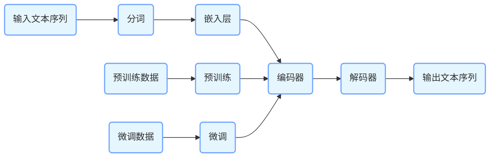

# LLM模型训练实践：从预训练到微调的全流程

> 关键词：LLM模型、预训练、微调、训练流程、自然语言处理

> 摘要：本文详细介绍了大语言模型（LLM）从预训练到微调的全流程实践。首先阐述了背景知识，包括目的、预期读者、文档结构和术语表等。接着深入解析了LLM的核心概念、联系以及核心算法原理，并通过Python代码进行说明。同时，给出了相关的数学模型和公式，并结合实例讲解。在项目实战部分，展示了开发环境搭建、源代码实现与解读。还探讨了LLM的实际应用场景，推荐了学习资源、开发工具框架和相关论文著作。最后总结了未来发展趋势与挑战，并提供常见问题解答和扩展阅读参考资料，旨在帮助读者全面掌握LLM模型训练的全流程。

## 1. 背景介绍 
### 1.1 目的和范围
随着自然语言处理（NLP）技术的飞速发展，大语言模型（LLM）已经成为该领域的核心技术。本文章的目的在于为读者提供一个全面且详细的LLM模型训练实践指南，涵盖从预训练到微调的全流程。范围包括核心概念的解释、算法原理的剖析、数学模型的推导、项目实战的演示以及实际应用场景的探讨等方面。通过阅读本文，读者将能够深入理解LLM模型训练的各个环节，并具备独立进行相关实践的能力。

### 1.2 预期读者
本文预期读者包括对自然语言处理和大语言模型感兴趣的初学者、有一定编程基础的开发者、研究人员以及想要了解LLM技术的相关从业者。无论你是刚刚踏入NLP领域，还是希望进一步提升自己在LLM模型训练方面的技能，本文都将为你提供有价值的信息和指导。

### 1.3 文档结构概述
本文将按照以下结构进行组织：
1. **背景介绍**：介绍文章的目的、预期读者、文档结构和术语表。
2. **核心概念与联系**：解释LLM的核心概念，展示其原理和架构的文本示意图以及Mermaid流程图。
3. **核心算法原理 & 具体操作步骤**：详细讲解LLM训练的核心算法原理，并使用Python源代码进行说明。
4. **数学模型和公式 & 详细讲解 & 举例说明**：推导LLM训练中的数学模型和公式，并结合实例进行讲解。
5. **项目实战：代码实际案例和详细解释说明**：展示一个完整的LLM模型训练项目，包括开发环境搭建、源代码实现和代码解读。
6. **实际应用场景**：探讨LLM在不同领域的实际应用场景。
7. **工具和资源推荐**：推荐学习资源、开发工具框架和相关论文著作。
8. **总结：未来发展趋势与挑战**：总结LLM模型训练的未来发展趋势和面临的挑战。
9. **附录：常见问题与解答**：解答读者在LLM模型训练过程中常见的问题。
10. **扩展阅读 & 参考资料**：提供扩展阅读的建议和参考资料。

### 1.4 术语表
#### 1.4.1 核心术语定义
- **大语言模型（LLM）**：是一种基于深度学习的自然语言处理模型，通常具有数十亿甚至数万亿的参数，能够处理各种自然语言任务。
- **预训练**：在大规模无监督文本数据上对模型进行训练，以学习语言的通用特征和模式。
- **微调**：在预训练模型的基础上，使用特定任务的有监督数据对模型进行进一步训练，以适应具体的任务需求。
- **Transformer**：一种基于注意力机制的深度学习架构，是现代LLM的核心组件。
- **损失函数**：用于衡量模型预测结果与真实标签之间的差异，是模型训练的目标函数。
- **优化器**：用于更新模型参数，以最小化损失函数。

#### 1.4.2 相关概念解释
- **注意力机制**：一种能够自动关注输入序列中不同部分的机制，使得模型能够更好地捕捉序列中的长距离依赖关系。
- **掩码机制**：在训练过程中，用于屏蔽某些输入信息，以模拟实际应用中的未知情况。
- **分词**：将文本序列分割成一个个单词或子词的过程，是文本处理的基础步骤。
- **嵌入层**：将分词后的单词或子词转换为低维向量表示的层，以便模型能够处理文本数据。

#### 1.4.3 缩略词列表
- **NLP**：自然语言处理（Natural Language Processing）
- **LLM**：大语言模型（Large Language Model）
- **BERT**：Bidirectional Encoder Representations from Transformers
- **GPT**：Generative Pretrained Transformer
- **Adam**：Adaptive Moment Estimation

## 2. 核心概念与联系 

### 核心概念原理
LLM的核心是Transformer架构，它由编码器和解码器组成。编码器负责对输入的文本序列进行特征提取，解码器则根据编码器的输出生成目标文本序列。Transformer架构的关键在于注意力机制，它能够让模型在处理每个位置的输入时，动态地关注序列中的其他位置，从而捕捉长距离依赖关系。

预训练是LLM训练的第一步，通常采用无监督学习的方式，在大规模的文本数据上进行训练。常见的预训练任务包括语言建模（如预测下一个单词）和掩码语言模型（如预测被掩码的单词）。通过预训练，模型能够学习到语言的通用特征和模式，为后续的微调打下基础。

微调是在预训练模型的基础上，使用特定任务的有监督数据对模型进行进一步训练。微调的目的是让模型适应具体的任务需求，如文本分类、问答系统等。在微调过程中，通常会保持预训练模型的大部分参数不变，只对少数特定层的参数进行更新。

### 架构的文本示意图
```plaintext
输入文本序列 -> 分词 -> 嵌入层 -> 编码器（Transformer块） -> 解码器（Transformer块） -> 输出文本序列
```
在预训练阶段，模型的目标是最小化语言建模或掩码语言模型的损失函数。在微调阶段，模型的目标是最小化特定任务的损失函数，如交叉熵损失函数。

### Mermaid流程图


## 3. 核心算法原理 & 具体操作步骤 

### 核心算法原理
LLM训练的核心算法基于Transformer架构和反向传播算法。Transformer架构通过多头注意力机制和前馈神经网络来处理输入序列。多头注意力机制允许模型在不同的表示子空间中关注输入序列的不同部分，从而提高模型的表达能力。

前馈神经网络则对每个位置的输入进行非线性变换，以增强模型的学习能力。在训练过程中，模型的目标是最小化损失函数，通常采用交叉熵损失函数来衡量模型预测结果与真实标签之间的差异。

### 具体操作步骤
1. **数据准备**：收集和整理大规模的文本数据，进行分词和预处理。
2. **模型初始化**：初始化Transformer模型的参数。
3. **预训练**：在大规模的文本数据上进行无监督学习，使用语言建模或掩码语言模型作为预训练任务。
4. **微调**：在特定任务的有监督数据上对预训练模型进行微调，使用特定任务的损失函数。
5. **模型评估**：使用评估指标（如准确率、召回率等）对微调后的模型进行评估。
6. **模型部署**：将训练好的模型部署到实际应用中。

### Python源代码示例
```python
import torch
import torch.nn as nn
import torch.optim as optim
from transformers import GPT2LMHeadModel, GPT2Tokenizer

# 数据准备
tokenizer = GPT2Tokenizer.from_pretrained('gpt2')
text = "Hello, how are you?"
input_ids = tokenizer.encode(text, return_tensors='pt')

# 模型初始化
model = GPT2LMHeadModel.from_pretrained('gpt2')

# 定义损失函数和优化器
criterion = nn.CrossEntropyLoss()
optimizer = optim.Adam(model.parameters(), lr=1e-4)

# 预训练（示例，实际需要大规模数据）
for epoch in range(10):
    outputs = model(input_ids, labels=input_ids)
    loss = outputs.loss
    optimizer.zero_grad()
    loss.backward()
    optimizer.step()
    print(f'Epoch {epoch+1}, Loss: {loss.item()}')

# 微调（示例，实际需要特定任务数据）
# 假设我们有一个文本分类任务，这里简单模拟
new_text = "This is a positive sentence."
new_input_ids = tokenizer.encode(new_text, return_tensors='pt')
labels = torch.tensor([1])  # 假设标签为1

for epoch in range(5):
    outputs = model(new_input_ids)
    logits = outputs.logits[:, -1, :]
    loss = criterion(logits, labels)
    optimizer.zero_grad()
    loss.backward()
    optimizer.step()
    print(f'Fine-tuning Epoch {epoch+1}, Loss: {loss.item()}')
```

## 4. 数学模型和公式 & 详细讲解 & 举例说明 

### 注意力机制数学模型
多头注意力机制是Transformer架构的核心组成部分。对于输入序列 $X = [x_1, x_2, \cdots, x_n]$，其中 $x_i \in \mathbb{R}^d$ 是第 $i$ 个位置的输入向量，$d$ 是向量的维度。多头注意力机制的计算过程如下：

#### 单头注意力
首先，计算查询（Query）、键（Key）和值（Value）矩阵：
$$Q = XW^Q, K = XW^K, V = XW^V$$
其中 $W^Q \in \mathbb{R}^{d \times d_k}$，$W^K \in \mathbb{R}^{d \times d_k}$，$W^V \in \mathbb{R}^{d \times d_v}$ 是可学习的参数矩阵，$d_k$ 和 $d_v$ 分别是查询、键和值的维度。

然后，计算注意力分数：
$$\text{Attention}(Q, K, V) = \text{softmax}\left(\frac{QK^T}{\sqrt{d_k}}\right)V$$
其中 $\text{softmax}$ 是归一化函数，用于将注意力分数转换为概率分布。

#### 多头注意力
多头注意力机制将单头注意力重复多次，并将结果拼接起来：
$$\text{MultiHead}(Q, K, V) = \text{Concat}(\text{head}_1, \cdots, \text{head}_h)W^O$$
其中 $\text{head}_i = \text{Attention}(QW_i^Q, KW_i^K, VW_i^V)$，$h$ 是头的数量，$W^O \in \mathbb{R}^{hd_v \times d}$ 是可学习的参数矩阵。

### 损失函数
在预训练阶段，通常使用语言建模损失函数，如交叉熵损失函数：
$$L = -\frac{1}{N}\sum_{i=1}^{N}\sum_{j=1}^{V}y_{ij}\log(p_{ij})$$
其中 $N$ 是样本数量，$V$ 是词汇表大小，$y_{ij}$ 是第 $i$ 个样本的第 $j$ 个词的真实标签，$p_{ij}$ 是模型预测的第 $i$ 个样本的第 $j$ 个词的概率。

在微调阶段，根据具体任务的不同，使用不同的损失函数。例如，在文本分类任务中，通常使用交叉熵损失函数；在问答系统中，通常使用均方误差损失函数。

### 举例说明
假设我们有一个输入序列 $X = [x_1, x_2, x_3]$，其中 $x_i \in \mathbb{R}^4$。我们设置 $d_k = d_v = 2$，$h = 2$。

首先，计算查询、键和值矩阵：
$$W^Q = \begin{bmatrix}
0.1 & 0.2 \\
0.3 & 0.4 \\
0.5 & 0.6 \\
0.7 & 0.8
\end{bmatrix}, W^K = \begin{bmatrix}
0.9 & 1.0 \\
1.1 & 1.2 \\
1.3 & 1.4 \\
1.5 & 1.6
\end{bmatrix}, W^V = \begin{bmatrix}
1.7 & 1.8 \\
1.9 & 2.0 \\
2.1 & 2.2 \\
2.3 & 2.4
\end{bmatrix}$$
$$Q = XW^Q, K = XW^K, V = XW^V$$

然后，计算注意力分数：
$$\text{Attention}(Q, K, V) = \text{softmax}\left(\frac{QK^T}{\sqrt{2}}\right)V$$

最后，计算多头注意力：
$$\text{MultiHead}(Q, K, V) = \text{Concat}(\text{head}_1, \text{head}_2)W^O$$

## 5. 项目实战：代码实际案例和详细解释说明 

### 5.1  开发环境搭建
#### 操作系统
建议使用Linux系统，如Ubuntu 18.04或更高版本。

#### 编程语言和库
- **Python**：建议使用Python 3.7或更高版本。
- **PyTorch**：深度学习框架，用于模型的训练和推理。
- **Transformers**：Hugging Face提供的自然语言处理库，包含了各种预训练模型和工具。

#### 安装步骤
```bash
# 创建虚拟环境
python -m venv llm_env
source llm_env/bin/activate

# 安装PyTorch
pip install torch torchvision torchaudio

# 安装Transformers
pip install transformers
```

### 5.2  源代码详细实现和代码解读
```python
import torch
import torch.nn as nn
import torch.optim as optim
from transformers import GPT2LMHeadModel, GPT2Tokenizer, TextDataset, DataCollatorForLanguageModeling
from transformers import Trainer, TrainingArguments

# 数据准备
tokenizer = GPT2Tokenizer.from_pretrained('gpt2')
train_dataset = TextDataset(
    tokenizer=tokenizer,
    file_path='train.txt',
    block_size=128
)
data_collator = DataCollatorForLanguageModeling(
    tokenizer=tokenizer, mlm=False
)

# 模型初始化
model = GPT2LMHeadModel.from_pretrained('gpt2')

# 训练参数设置
training_args = TrainingArguments(
    output_dir='./results',          # 输出目录
    overwrite_output_dir=True,      # 是否覆盖输出目录
    num_train_epochs=3,              # 训练轮数
    per_device_train_batch_size=4,   # 每个设备的训练批次大小
    save_steps=10_000,               # 每多少步保存一次模型
    save_total_limit=2,              # 最多保存的模型数量
    prediction_loss_only=True,
)

# 训练器
trainer = Trainer(
    model=model,
    args=training_args,
    data_collator=data_collator,
    train_dataset=train_dataset,
)

# 开始训练
trainer.train()

# 保存模型
trainer.save_model()
```

### 代码解读与分析
1. **数据准备**：使用 `TextDataset` 类将文本数据转换为适合模型训练的格式，`DataCollatorForLanguageModeling` 类用于将数据整理成批量输入。
2. **模型初始化**：使用 `GPT2LMHeadModel.from_pretrained('gpt2')` 加载预训练的GPT-2模型。
3. **训练参数设置**：使用 `TrainingArguments` 类设置训练的各种参数，如输出目录、训练轮数、批次大小等。
4. **训练器**：使用 `Trainer` 类来管理训练过程，它封装了模型的训练、评估和保存等操作。
5. **开始训练**：调用 `trainer.train()` 方法开始训练模型。
6. **保存模型**：调用 `trainer.save_model()` 方法保存训练好的模型。

## 6. 实际应用场景 
### 文本生成
LLM可以用于生成各种类型的文本，如故事、诗歌、新闻报道等。通过微调模型，可以使其生成的文本更符合特定的风格和主题。

### 问答系统
LLM可以作为问答系统的核心组件，根据用户的问题生成相应的答案。通过在大规模的问答数据集上进行微调，可以提高模型的问答性能。

### 文本分类
LLM可以用于文本分类任务，如情感分析、新闻分类等。通过在特定的文本分类数据集上进行微调，可以使模型准确地分类不同类型的文本。

### 机器翻译
LLM可以用于机器翻译任务，通过在大规模的平行语料库上进行训练和微调，可以提高模型的翻译质量。

## 7. 工具和资源推荐
### 7.1 学习资源推荐
#### 7.1.1 书籍推荐
- 《深度学习》（Deep Learning）：由Ian Goodfellow、Yoshua Bengio和Aaron Courville所著，是深度学习领域的经典教材。
- 《自然语言处理入门》（Natural Language Processing with Python）：由Steven Bird、Ewan Klein和Edward Loper所著，介绍了使用Python进行自然语言处理的基础知识和方法。
- 《Transformer神经网络实战》（Transformers for Natural Language Processing）：由Denis Rothman所著，深入介绍了Transformer架构和相关技术。

#### 7.1.2 在线课程
- Coursera上的“Natural Language Processing Specialization”：由DeepLearning.AI提供，涵盖了自然语言处理的各个方面。
- edX上的“Introduction to Artificial Intelligence”：由MIT提供，介绍了人工智能的基本概念和方法，包括自然语言处理。
- Hugging Face的“Transformers Course”：免费的在线课程，详细介绍了Transformers库的使用和应用。

#### 7.1.3 技术博客和网站
- Hugging Face博客：提供了关于自然语言处理和大语言模型的最新研究成果和技术文章。
- OpenAI博客：发布了关于GPT系列模型的研究和应用进展。
- Towards Data Science：一个数据科学和机器学习的社区，有很多关于自然语言处理的优质文章。

### 7.2 开发工具框架推荐
#### 7.2.1 IDE和编辑器
- PyCharm：一款专业的Python集成开发环境，提供了丰富的代码编辑、调试和版本控制功能。
- Jupyter Notebook：一个交互式的开发环境，适合进行数据探索和模型实验。
- Visual Studio Code：一款轻量级的代码编辑器，支持多种编程语言和插件扩展。

#### 7.2.2 调试和性能分析工具
- PyTorch Profiler：PyTorch提供的性能分析工具，用于分析模型的训练和推理时间。
- TensorBoard：一个可视化工具，用于监控模型的训练过程和性能指标。
- cProfile：Python标准库中的性能分析工具，用于分析Python代码的运行时间。

#### 7.2.3 相关框架和库
- PyTorch：一个开源的深度学习框架，提供了丰富的神经网络模块和优化算法。
- Transformers：Hugging Face提供的自然语言处理库，包含了各种预训练模型和工具。
- NLTK：一个流行的自然语言处理库，提供了各种文本处理工具和数据集。

### 7.3 相关论文著作推荐
#### 7.3.1 经典论文
- “Attention Is All You Need”：介绍了Transformer架构，是现代LLM的基础。
- “BERT: Pre-training of Deep Bidirectional Transformers for Language Understanding”：提出了BERT模型，开创了预训练-微调的训练范式。
- “GPT: Generative Pretrained Transformer”：介绍了GPT系列模型，展示了生成式预训练模型的强大能力。

#### 7.3.2 最新研究成果
- 关注顶级学术会议（如ACL、EMNLP、NeurIPS等）上的最新论文，了解LLM领域的最新研究进展。
- 关注知名研究机构（如OpenAI、Google、Microsoft等）的研究报告和技术博客。

#### 7.3.3 应用案例分析
- 阅读相关的技术博客和文章，了解LLM在不同领域的实际应用案例和经验分享。
- 参考开源项目和代码库，学习他人在实际项目中使用LLM的方法和技巧。

## 8. 总结：未来发展趋势与挑战
### 未来发展趋势
- **模型规模继续增大**：随着计算资源的不断提升，LLM的模型规模将继续增大，以获得更好的性能和语言理解能力。
- **多模态融合**：将语言与图像、音频等其他模态的信息进行融合，以实现更复杂的任务，如视觉问答、视频描述等。
- **个性化和定制化**：根据用户的需求和偏好，为用户提供个性化的语言服务，如个性化文本生成、个性化推荐等。
- **高效训练和推理**：研究更高效的训练算法和推理方法，以降低训练成本和提高推理速度。

### 挑战
- **计算资源需求**：大规模的LLM训练需要大量的计算资源和能源消耗，这对计算硬件和能源供应提出了挑战。
- **数据隐私和安全**：LLM训练需要大量的文本数据，其中可能包含用户的隐私信息，如何保护数据隐私和安全是一个重要的问题。
- **模型可解释性**：LLM通常是一个黑盒模型，其决策过程难以解释，如何提高模型的可解释性是一个亟待解决的问题。
- **伦理和社会影响**：LLM的广泛应用可能会带来一些伦理和社会问题，如虚假信息传播、偏见和歧视等，需要加强监管和引导。

## 9. 附录：常见问题与解答
### 问题1：预训练和微调有什么区别？
预训练是在大规模的无监督文本数据上对模型进行训练，以学习语言的通用特征和模式。微调是在预训练模型的基础上，使用特定任务的有监督数据对模型进行进一步训练，以适应具体的任务需求。

### 问题2：如何选择合适的预训练模型？
选择合适的预训练模型需要考虑以下因素：
- **任务类型**：不同的预训练模型适用于不同的任务，如GPT系列模型适用于生成式任务，BERT系列模型适用于理解式任务。
- **模型规模**：模型规模越大，通常性能越好，但计算资源需求也越高。需要根据自己的计算资源和任务需求选择合适的模型规模。
- **数据领域**：如果有特定领域的数据，可以选择在该领域上预训练的模型，以获得更好的性能。

### 问题3：如何处理训练过程中的过拟合问题？
可以采取以下措施来处理训练过程中的过拟合问题：
- **增加数据量**：使用更多的训练数据可以减少模型对训练数据的过拟合。
- **正则化**：使用L1或L2正则化方法，对模型的参数进行约束，以减少模型的复杂度。
- **早停策略**：在训练过程中，监控模型在验证集上的性能，当验证集上的性能不再提升时，停止训练。
- **数据增强**：对训练数据进行数据增强，如随机替换、插入、删除等操作，以增加数据的多样性。

### 问题4：如何评估LLM的性能？
可以使用以下指标来评估LLM的性能：
- **准确率**：在分类任务中，准确率是指模型预测正确的样本数占总样本数的比例。
- **召回率**：在分类任务中，召回率是指模型预测正确的正样本数占实际正样本数的比例。
- **F1值**：F1值是准确率和召回率的调和平均数，用于综合评估模型的性能。
- **困惑度**：在语言建模任务中，困惑度是指模型对测试数据的预测难度，困惑度越低，模型的性能越好。

## 10. 扩展阅读 & 参考资料
### 扩展阅读
- 《深度学习进阶：自然语言处理》：深入介绍了自然语言处理的各种技术和方法，包括神经网络、循环神经网络、Transformer等。
- 《人工智能：现代方法》：一本全面介绍人工智能的经典教材，涵盖了自然语言处理、机器学习、计算机视觉等多个领域。
- 《数据密集型应用系统设计》：介绍了数据密集型应用系统的设计原则和方法，对于理解LLM的训练和应用有很大的帮助。

### 参考资料
- Hugging Face官方文档：https://huggingface.co/docs
- PyTorch官方文档：https://pytorch.org/docs/stable/index.html
- 《Attention Is All You Need》论文：https://arxiv.org/abs/1706.03762
- 《BERT: Pre-training of Deep Bidirectional Transformers for Language Understanding》论文：https://arxiv.org/abs/1810.04805

作者：AI天才研究院/AI Genius Institute & 禅与计算机程序设计艺术 /Zen And The Art of Computer Programming