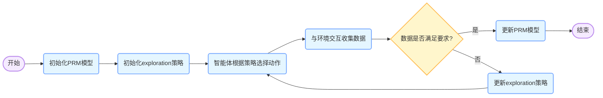

# PRM训练数据收集中的exploration策略

> 关键词：PRM（偏好调节模型）、训练数据收集、exploration策略、强化学习、数据多样性

> 摘要：本文聚焦于PRM训练数据收集中的exploration策略。首先介绍了PRM的背景以及数据收集的重要性，接着阐述了exploration策略的核心概念与相关联系，详细讲解了核心算法原理并给出Python代码示例，通过数学模型和公式深入剖析其原理。随后进行项目实战，展示代码实际案例并加以详细解释。还探讨了实际应用场景，推荐了相关的工具和资源。最后总结了未来发展趋势与挑战，解答常见问题并提供扩展阅读与参考资料，旨在帮助读者全面理解和掌握PRM训练数据收集中的exploration策略。

## 1. 背景介绍 
### 1.1 目的和范围
PRM（偏好调节模型）在自然语言处理、推荐系统等多个领域有着广泛的应用。其训练的效果在很大程度上依赖于高质量的训练数据。而在数据收集过程中，exploration策略起着关键作用。本文的目的是深入探讨PRM训练数据收集中的exploration策略，包括其原理、算法、实际应用等方面。范围涵盖了从基础概念的介绍到实际项目的实现，以及相关工具和资源的推荐。

### 1.2 预期读者
本文预期读者包括对机器学习、自然语言处理、推荐系统等领域感兴趣的研究人员、工程师和学生。对于已经有一定机器学习基础，想要深入了解PRM训练数据收集和exploration策略的读者尤为适用。

### 1.3 文档结构概述
本文首先介绍背景知识，包括目的、预期读者和文档结构。接着阐述核心概念与联系，给出相关的原理和架构示意图。然后详细讲解核心算法原理和具体操作步骤，并结合Python代码进行说明。之后介绍数学模型和公式，并举例说明。通过项目实战展示代码实际案例并进行详细解释。再探讨实际应用场景，推荐相关的工具和资源。最后总结未来发展趋势与挑战，解答常见问题并提供扩展阅读与参考资料。

### 1.4 术语表
#### 1.4.1 核心术语定义
- **PRM（偏好调节模型）**：一种用于根据用户偏好对模型进行调节的机器学习模型，旨在提高模型输出与用户期望的匹配度。
- **exploration策略**：在数据收集过程中，为了发现更多可能的样本和模式，主动尝试不同的行为或选择的策略。
- **训练数据收集**：为了训练模型而收集相关数据的过程，数据的质量和多样性对模型性能有重要影响。

#### 1.4.2 相关概念解释
- **强化学习**：一种机器学习范式，智能体通过与环境进行交互，根据环境反馈的奖励信号来学习最优行为策略。在PRM训练数据收集中，强化学习的思想常被用于设计exploration策略。
- **数据多样性**：指收集的数据包含多种不同的特征、模式和情况，丰富的数据多样性有助于提高模型的泛化能力。

#### 1.4.3 缩略词列表
- **PRM**：偏好调节模型（Preference Regulated Model）
- **RL**：强化学习（Reinforcement Learning）

## 2. 核心概念与联系 

### 核心概念原理
在PRM训练数据收集中，exploration策略的核心目标是在数据收集过程中平衡对已知数据的利用和对未知数据的探索。如果只注重利用已知数据，可能会导致模型陷入局部最优，无法发现更优的解决方案；而过度探索未知数据则可能会浪费大量的资源，并且收集到的很多数据可能对模型训练没有实际帮助。

一种常见的思路是结合强化学习的思想，将数据收集过程看作一个智能体与环境交互的过程。智能体根据当前的状态选择不同的动作（即不同的数据收集方式），环境会根据智能体的动作给予相应的奖励。通过不断地交互和学习，智能体可以逐渐找到最优的数据收集策略。

### 架构示意图


### 联系说明
在这个架构中，PRM模型、exploration策略和数据收集过程相互关联。exploration策略指导智能体选择不同的动作来收集数据，收集到的数据用于更新PRM模型。而PRM模型的更新又会影响exploration策略的调整，形成一个闭环的反馈系统。

## 3. 核心算法原理 & 具体操作步骤 

### 核心算法原理
一种常见的exploration策略是ε - greedy策略。该策略在数据收集过程中，以ε的概率随机选择一个动作进行探索，以1 - ε的概率选择当前已知的最优动作进行利用。随着数据收集的进行，ε的值可以逐渐减小，使得模型在前期更多地进行探索，后期更多地进行利用。

### Python代码实现
```python
import numpy as np

class EpsilonGreedyExploration:
    def __init__(self, epsilon, decay_rate, min_epsilon):
        self.epsilon = epsilon
        self.decay_rate = decay_rate
        self.min_epsilon = min_epsilon

    def choose_action(self, q_values):
        if np.random.uniform(0, 1) < self.epsilon:
            # 探索：随机选择一个动作
            action = np.random.randint(0, len(q_values))
        else:
            # 利用：选择Q值最大的动作
            action = np.argmax(q_values)
        # 衰减epsilon
        self.epsilon = max(self.epsilon * self.decay_rate, self.min_epsilon)
        return action


# 示例使用
epsilon = 0.9
decay_rate = 0.99
min_epsilon = 0.01
exploration = EpsilonGreedyExploration(epsilon, decay_rate, min_epsilon)

# 假设Q值
q_values = [0.1, 0.3, 0.2, 0.4]
action = exploration.choose_action(q_values)
print(f"选择的动作是: {action}")
```

### 具体操作步骤
1. **初始化参数**：设置初始的ε值、衰减率和最小ε值。
2. **选择动作**：在每次数据收集时，根据当前的ε值决定是进行探索还是利用。
3. **衰减ε值**：每次选择动作后，根据衰减率更新ε值，但要确保ε值不小于最小ε值。
4. **重复步骤2和3**：直到数据收集结束。

## 4. 数学模型和公式 & 详细讲解 & 举例说明 

### 数学模型和公式
在ε - greedy策略中，设当前状态下的动作集合为 $A$，每个动作 $a \in A$ 对应的Q值为 $Q(s, a)$，其中 $s$ 表示当前状态。选择动作 $a$ 的概率 $P(a)$ 可以表示为：

$$
P(a) = 
\begin{cases}
\epsilon / |A|, & \text{如果进行探索} \\
1 - \epsilon + \epsilon / |A|, & \text{如果 } a = \arg\max_{a' \in A} Q(s, a') \\
\epsilon / |A|, & \text{如果 } a \neq \arg\max_{a' \in A} Q(s, a') \text{ 且进行利用}
\end{cases}
$$

其中 $|A|$ 表示动作集合 $A$ 的大小。

### 详细讲解
- 当进行探索时，每个动作被选中的概率是相等的，都为 $\epsilon / |A|$。
- 当进行利用时，Q值最大的动作被选中的概率为 $1 - \epsilon + \epsilon / |A|$，其他动作被选中的概率为 $\epsilon / |A|$。

### 举例说明
假设动作集合 $A = \{a_1, a_2, a_3\}$，$|A| = 3$，$\epsilon = 0.1$。当前状态下的Q值分别为 $Q(s, a_1) = 0.1$，$Q(s, a_2) = 0.3$，$Q(s, a_3) = 0.2$。则 $\arg\max_{a' \in A} Q(s, a') = a_2$。

- 进行探索时，$P(a_1) = P(a_2) = P(a_3) = 0.1 / 3 \approx 0.033$。
- 进行利用时，$P(a_2) = 1 - 0.1 + 0.1 / 3 \approx 0.933$，$P(a_1) = P(a_3) = 0.1 / 3 \approx 0.033$。

## 5. 项目实战：代码实际案例和详细解释说明 

### 5.1  开发环境搭建
- **Python环境**：建议使用Python 3.7及以上版本。可以通过Anaconda或Python官方网站下载安装。
- **相关库**：需要安装`numpy`库，用于数值计算。可以使用以下命令进行安装：
```sh
pip install numpy
```

### 5.2  源代码详细实现和代码解读
```python
import numpy as np

# 定义EpsilonGreedyExploration类
class EpsilonGreedyExploration:
    def __init__(self, epsilon, decay_rate, min_epsilon):
        # 初始化epsilon、衰减率和最小epsilon
        self.epsilon = epsilon
        self.decay_rate = decay_rate
        self.min_epsilon = min_epsilon

    def choose_action(self, q_values):
        # 根据epsilon值决定是探索还是利用
        if np.random.uniform(0, 1) < self.epsilon:
            # 探索：随机选择一个动作
            action = np.random.randint(0, len(q_values))
        else:
            # 利用：选择Q值最大的动作
            action = np.argmax(q_values)
        # 衰减epsilon
        self.epsilon = max(self.epsilon * self.decay_rate, self.min_epsilon)
        return action


# 模拟PRM训练数据收集过程
def prm_data_collection():
    # 初始化epsilon、衰减率和最小epsilon
    epsilon = 0.9
    decay_rate = 0.99
    min_epsilon = 0.01
    exploration = EpsilonGreedyExploration(epsilon, decay_rate, min_epsilon)

    # 模拟10次数据收集
    for i in range(10):
        # 假设每次有4个动作，随机生成Q值
        q_values = np.random.rand(4)
        action = exploration.choose_action(q_values)
        print(f"第 {i+1} 次数据收集，选择的动作是: {action}，当前epsilon值: {exploration.epsilon}")


if __name__ == "__main__":
    prm_data_collection()
```

### 代码解读与分析
- **EpsilonGreedyExploration类**：该类实现了ε - greedy策略。`__init__`方法用于初始化参数，`choose_action`方法根据当前的ε值选择动作，并更新ε值。
- **prm_data_collection函数**：模拟了PRM训练数据收集过程。在每次数据收集中，随机生成Q值，调用`choose_action`方法选择动作，并打印选择的动作和当前的ε值。

通过运行这个代码，我们可以观察到随着数据收集的进行，ε值逐渐减小，模型从更多地进行探索逐渐转变为更多地进行利用。

## 6. 实际应用场景 
### 推荐系统
在推荐系统中，PRM可以根据用户的偏好对推荐结果进行调节。在收集训练数据时，使用exploration策略可以发现用户潜在的兴趣点。例如，在电商推荐中，除了推荐用户经常浏览的商品类型，还可以以一定的概率推荐一些用户可能感兴趣但尚未关注过的商品，从而扩大用户的选择范围，提高推荐的多样性和准确性。

### 自然语言处理
在自然语言处理任务中，如文本生成、问答系统等，PRM可以根据用户的反馈对生成的文本进行优化。通过exploration策略收集不同类型的训练数据，可以提高模型对各种语言表达和问题的处理能力。例如，在问答系统中，可以主动尝试提出一些不同类型的问题，以收集更多样化的回答数据，从而提升系统的泛化能力。

### 游戏开发
在游戏开发中，PRM可以用于调整游戏难度、AI对手的行为等。通过exploration策略收集不同玩家的游戏数据，可以更好地了解玩家的游戏习惯和偏好，从而提供更个性化的游戏体验。例如，在策略游戏中，可以尝试不同的AI策略来收集玩家的应对数据，以便优化AI的行为。

## 7. 工具和资源推荐
### 7.1 学习资源推荐
#### 7.1.1 书籍推荐
- 《强化学习：原理与Python实现》：全面介绍了强化学习的基本原理和算法，并提供了Python代码示例，有助于深入理解exploration策略的相关知识。
- 《机器学习》（周志华）：经典的机器学习教材，涵盖了机器学习的各个方面，包括数据收集和模型训练的相关内容。

#### 7.1.2 在线课程
- Coursera上的“强化学习专项课程”：由知名教授授课，系统地讲解了强化学习的理论和实践，对理解exploration策略有很大帮助。
- edX上的“人工智能基础”：该课程介绍了人工智能的基本概念和方法，其中包括数据收集和模型训练的相关内容。

#### 7.1.3 技术博客和网站
- Medium：上面有很多关于机器学习和强化学习的技术博客，经常会分享一些最新的研究成果和实践经验。
- arXiv：一个预印本平台，提供了大量的学术论文，包括关于PRM和exploration策略的最新研究。

### 7.2 开发工具框架推荐
#### 7.2.1 IDE和编辑器
- PyCharm：功能强大的Python集成开发环境，提供了代码编辑、调试、版本控制等多种功能，适合Python项目的开发。
- Jupyter Notebook：交互式的开发环境，非常适合进行数据探索和模型实验，可以实时查看代码的运行结果。

#### 7.2.2 调试和性能分析工具
- PDB：Python自带的调试工具，可以帮助开发者定位代码中的问题。
- cProfile：Python的性能分析工具，可以分析代码的运行时间和资源消耗情况，帮助优化代码性能。

#### 7.2.3 相关框架和库
- OpenAI Gym：一个用于开发和比较强化学习算法的工具包，提供了各种环境和基准测试，方便进行exploration策略的实验。
- Stable Baselines3：基于PyTorch的强化学习库，提供了多种预训练的强化学习算法和工具，可用于快速实现和测试exploration策略。

### 7.3 相关论文著作推荐
#### 7.3.1 经典论文
- “Reinforcement Learning: An Introduction”（Richard S. Sutton和Andrew G. Barto）：强化学习领域的经典著作，系统地介绍了强化学习的基本理论和算法，对exploration策略有深入的讨论。
- “Bandit Algorithms”（Tor Lattimore和Csaba Szepesvári）：详细介绍了多臂老虎机问题和相关的探索算法，为理解exploration策略提供了理论基础。

#### 7.3.2 最新研究成果
- 定期关注NeurIPS、ICML、ACL等顶级学术会议的论文，这些会议上会发表关于PRM和exploration策略的最新研究成果。
- 关注知名学术期刊，如Journal of Artificial Intelligence Research（JAIR）、Artificial Intelligence等，这些期刊会刊登高质量的学术论文。

#### 7.3.3 应用案例分析
- 一些科技公司的技术博客会分享他们在实际项目中应用PRM和exploration策略的案例，如Google、Facebook等公司的博客，可以从中学习到实际应用中的经验和技巧。

## 8. 总结：未来发展趋势与挑战
### 未来发展趋势
- **多模态数据收集**：随着技术的发展，未来PRM训练数据收集将不仅仅局限于文本、图像等单一模态的数据，而是会涉及到多模态数据的收集。例如，结合语音、视频等多种信息，以提供更全面的用户偏好信息。exploration策略也需要相应地进行调整，以适应多模态数据的特点。
- **自适应探索**：传统的exploration策略通常是基于固定的参数（如ε - greedy策略中的ε值）进行探索和利用的平衡。未来的研究可能会朝着自适应探索的方向发展，即根据环境的变化和模型的学习情况动态地调整探索策略，以提高数据收集的效率和质量。
- **与其他技术的融合**：PRM训练数据收集中的exploration策略可能会与其他技术，如迁移学习、元学习等进行融合。通过迁移学习可以利用已有的数据和知识来加速新领域的数据收集，而元学习可以学习如何更好地进行探索和利用，提高模型的学习能力。

### 挑战
- **数据隐私和安全**：在收集训练数据时，需要处理大量的用户数据，这涉及到数据隐私和安全的问题。如何在保证数据隐私和安全的前提下，有效地进行数据收集和探索是一个重要的挑战。
- **计算资源消耗**：一些复杂的exploration策略可能需要大量的计算资源来实现，尤其是在处理大规模数据和复杂环境时。如何优化算法和模型，降低计算资源的消耗是一个亟待解决的问题。
- **探索与利用的平衡**：在实际应用中，找到探索和利用的最佳平衡点是非常困难的。如果探索过度，会导致收集到大量无用的数据；如果利用过度，模型可能会陷入局部最优。如何根据不同的应用场景和任务需求，动态地调整探索和利用的比例是一个具有挑战性的问题。

## 9. 附录：常见问题与解答
### 问题1：为什么在PRM训练数据收集中需要exploration策略？
答：在PRM训练数据收集中，只利用已知的数据可能会导致模型陷入局部最优，无法发现更优的解决方案。exploration策略可以帮助我们在数据收集过程中主动尝试不同的行为或选择，发现更多可能的样本和模式，提高数据的多样性，从而提升模型的泛化能力。

### 问题2：ε - greedy策略中的ε值应该如何设置？
答：ε值的设置需要根据具体的应用场景和任务需求来确定。一般来说，在训练初期，可以将ε值设置得较大，以便更多地进行探索；随着训练的进行，逐渐减小ε值，使得模型更多地进行利用。例如，可以将初始ε值设置为0.9，衰减率设置为0.99，最小ε值设置为0.01。

### 问题3：除了ε - greedy策略，还有哪些常见的exploration策略？
答：除了ε - greedy策略，常见的exploration策略还包括：
- **UCB（Upper Confidence Bound）策略**：通过计算每个动作的上置信界来选择动作，鼓励对不确定性较大的动作进行探索。
- **Thompson Sampling策略**：基于贝叶斯思想，通过对每个动作的奖励分布进行采样来选择动作。

### 问题4：如何评估exploration策略的效果？
答：可以从以下几个方面评估exploration策略的效果：
- **数据多样性**：收集到的数据是否包含多种不同的特征、模式和情况。
- **模型性能**：使用收集到的数据训练的模型在测试集上的性能是否有所提升。
- **探索效率**：在相同的时间和资源限制下，是否能够发现更多有价值的数据。

## 10. 扩展阅读 & 参考资料
- [Richard S. Sutton, Andrew G. Barto. Reinforcement Learning: An Introduction. MIT Press, 2018.](https://mitpress.mit.edu/books/reinforcement-learning-second-edition)
- [Tor Lattimore, Csaba Szepesvári. Bandit Algorithms. Cambridge University Press, 2020.](https://tor-lattimore.com/downloads/book/book.pdf)
- [OpenAI Gym官方文档](https://gym.openai.com/docs/)
- [Stable Baselines3官方文档](https://stable-baselines3.readthedocs.io/en/master/)

作者：AI天才研究院/AI Genius Institute & 禅与计算机程序设计艺术 /Zen And The Art of Computer Programming