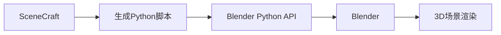

# SceneCraft:生成Blender可执行Python脚本渲染3D场景

> 关键词：SceneCraft、Blender、Python脚本、3D场景渲染、自动化建模

> 摘要：本文围绕SceneCraft展开，旨在探讨如何生成可在Blender中执行的Python脚本来渲染3D场景。首先介绍了相关背景知识，包括目的范围、预期读者等。接着详细阐述了核心概念与联系，分析了核心算法原理并给出Python代码示例。通过数学模型和公式进一步解释其原理，同时结合项目实战展示代码实现与解读。探讨了实际应用场景，推荐了学习资源、开发工具框架以及相关论文著作。最后总结未来发展趋势与挑战，提供常见问题解答和扩展阅读参考资料，帮助读者全面掌握利用SceneCraft生成Blender Python脚本渲染3D场景的技术。

## 1. 背景介绍 
### 1.1 目的和范围
在当今的3D建模与渲染领域，Blender作为一款强大且开源的软件，被广泛应用于动画制作、游戏开发、影视特效等多个行业。然而，手动在Blender中创建和调整复杂的3D场景往往效率低下，并且容易出错。SceneCraft的出现旨在解决这一问题，通过生成可执行的Python脚本来自动化创建和渲染3D场景。本文的目的是深入介绍SceneCraft的原理、实现方法以及应用场景，帮助读者掌握如何利用Python脚本在Blender中高效地创建和渲染各种3D场景。

本文的范围涵盖了从SceneCraft的核心概念、算法原理到实际项目应用的各个方面。我们将详细讲解如何使用Python编写脚本与Blender进行交互，包括创建基本几何体、设置材质、添加光照和相机等操作。同时，还会探讨如何利用数学模型和公式来精确控制场景的布局和渲染效果。

### 1.2 预期读者
本文主要面向以下几类读者：
- **3D建模和渲染爱好者**：希望通过自动化脚本提高工作效率，学习如何利用Python在Blender中创建更加复杂和多样化的3D场景。
- **Python程序员**：对3D图形编程感兴趣，想了解如何将Python应用于3D建模和渲染领域，掌握Blender Python API的使用方法。
- **游戏开发者和影视特效师**：寻求更高效的方式来创建和渲染游戏场景、影视特效，通过SceneCraft实现自动化建模和渲染流程。

### 1.3 文档结构概述
本文将按照以下结构进行组织：
1. **背景介绍**：阐述本文的目的和范围，明确预期读者，并对文档结构进行概述。
2. **核心概念与联系**：介绍SceneCraft、Blender和Python脚本的核心概念，以及它们之间的联系，同时给出原理和架构的文本示意图和Mermaid流程图。
3. **核心算法原理 & 具体操作步骤**：详细讲解核心算法原理，并使用Python源代码阐述具体操作步骤。
4. **数学模型和公式 & 详细讲解 & 举例说明**：介绍相关的数学模型和公式，并通过具体例子进行说明。
5. **项目实战：代码实际案例和详细解释说明**：通过实际项目案例，展示如何搭建开发环境、实现源代码并进行代码解读。
6. **实际应用场景**：探讨SceneCraft在不同领域的实际应用场景。
7. **工具和资源推荐**：推荐学习资源、开发工具框架以及相关论文著作。
8. **总结：未来发展趋势与挑战**：总结SceneCraft的发展趋势和面临的挑战。
9. **附录：常见问题与解答**：解答读者在学习和使用过程中可能遇到的常见问题。
10. **扩展阅读 & 参考资料**：提供相关的扩展阅读资料和参考书目。

### 1.4 术语表
#### 1.4.1 核心术语定义
- **SceneCraft**：一种用于生成Blender可执行Python脚本的技术或工具，旨在自动化创建和渲染3D场景。
- **Blender**：一款开源的3D建模、动画、渲染软件，支持Python脚本编程，可用于创建各种复杂的3D场景。
- **Python脚本**：使用Python语言编写的程序代码，可在Blender中执行，用于自动化操作和控制3D场景的创建和渲染过程。
- **3D场景渲染**：将3D模型、材质、光照等元素组合在一起，通过计算机算法生成最终的2D图像或动画的过程。

#### 1.4.2 相关概念解释
- **几何体**：在3D建模中，几何体是指具有特定形状和属性的基本物体，如立方体、球体、圆柱体等。
- **材质**：用于定义物体表面的外观和特性，包括颜色、光泽度、反射率等。
- **光照**：模拟现实世界中的光线效果，用于照亮场景，增强场景的真实感。
- **相机**：决定了观察者在3D场景中的视角和位置，用于捕捉和渲染场景。

#### 1.4.3 缩略词列表
- **API**：Application Programming Interface，应用程序编程接口，是一组用于不同软件之间进行交互的函数和协议。

## 2. 核心概念与联系 

### 核心概念原理
SceneCraft的核心原理是利用Python脚本与Blender的API进行交互，通过编写代码来自动化创建和修改3D场景。Blender提供了丰富的Python API，允许开发者通过脚本控制几乎所有的Blender功能，包括创建几何体、设置材质、添加光照和相机等。SceneCraft通过生成符合Blender API规范的Python脚本，实现了3D场景的自动化创建和渲染。

### 架构的文本示意图
```plaintext
+---------------------+
|    SceneCraft       |
| （生成Python脚本） |
+---------------------+
         |
         v
+---------------------+
|   Blender Python API |
| （与Blender交互）    |
+---------------------+
         |
         v
+---------------------+
|       Blender       |
| （3D建模与渲染）    |
+---------------------+
```

### Mermaid流程图


在这个流程中，SceneCraft负责生成Python脚本，这些脚本通过Blender Python API与Blender进行交互，最终在Blender中完成3D场景的创建和渲染。

## 3. 核心算法原理 & 具体操作步骤 

### 核心算法原理
SceneCraft的核心算法主要涉及到以下几个方面：
1. **场景元素的创建**：通过Blender Python API创建各种几何体，如立方体、球体、圆柱体等。
2. **材质和纹理的设置**：为创建的几何体设置材质和纹理，以改变其外观。
3. **光照和相机的配置**：添加光照和相机到场景中，并设置它们的属性，如位置、角度、强度等。
4. **渲染设置**：设置渲染参数，如分辨率、渲染引擎等，然后执行渲染操作。

### 具体操作步骤及Python源代码

#### 1. 导入Blender Python模块
```python
import bpy
```

#### 2. 创建基本几何体（以立方体为例）
```python
# 删除默认的立方体
bpy.ops.object.select_all(action='DESELECT')
bpy.data.objects['Cube'].select_set(True)
bpy.ops.object.delete()

# 创建一个新的立方体
bpy.ops.mesh.primitive_cube_add(size=2, location=(0, 0, 0))
```

#### 3. 设置材质
```python
# 创建一个新的材质
material = bpy.data.materials.new(name="CubeMaterial")
material.use_nodes = True
nodes = material.node_tree.nodes
links = material.node_tree.links

# 清除默认节点
for node in nodes:
    if node.name!= "Material Output":
        nodes.remove(node)

# 添加漫反射节点
diffuse_node = nodes.new(type='ShaderNodeBsdfDiffuse')
diffuse_node.inputs['Color'].default_value = (1, 0, 0, 1)  # 设置颜色为红色

# 连接节点
links.new(diffuse_node.outputs['BSDF'], nodes.get("Material Output").inputs['Surface'])

# 将材质应用到立方体上
obj = bpy.context.active_object
if len(obj.data.materials) == 0:
    obj.data.materials.append(material)
else:
    obj.data.materials[0] = material
```

#### 4. 添加光照
```python
# 创建一个点光源
light_data = bpy.data.lights.new(name="PointLight", type='POINT')
light_object = bpy.data.objects.new(name="PointLight", object_data=light_data)
bpy.context.collection.objects.link(light_object)

# 设置光照位置和强度
light_object.location = (3, 3, 3)
light_data.energy = 1000
```

#### 5. 设置相机
```python
# 创建一个相机
camera_data = bpy.data.cameras.new(name="Camera")
camera_object = bpy.data.objects.new(name="Camera", object_data=camera_data)
bpy.context.collection.objects.link(camera_object)

# 设置相机位置和角度
camera_object.location = (5, 5, 5)
camera_object.rotation_euler = (0.785398, 0, 0.785398)

# 将相机设置为活动相机
bpy.context.scene.camera = camera_object
```

#### 6. 设置渲染参数并渲染
```python
# 设置渲染分辨率
bpy.context.scene.render.resolution_x = 800
bpy.context.scene.render.resolution_y = 600

# 设置渲染引擎为Cycles
bpy.context.scene.render.engine = 'CYCLES'

# 执行渲染
bpy.ops.render.render(write_still=True)
```

以上代码实现了一个简单的3D场景的创建和渲染过程，包括创建立方体、设置材质、添加光照和相机，最后进行渲染。

## 4. 数学模型和公式 & 详细讲解 & 举例说明 

### 坐标系统
在Blender中，使用的是右手坐标系。在这个坐标系中，$x$ 轴表示左右方向，$y$ 轴表示前后方向，$z$ 轴表示上下方向。物体的位置可以用一个三维向量 $(x, y, z)$ 来表示。

例如，在上面的代码中，我们创建的立方体的位置设置为 $(0, 0, 0)$，表示它位于坐标系的原点。相机的位置设置为 $(5, 5, 5)$，表示相机在 $x$、$y$、$z$ 轴上的坐标分别为 5。

### 旋转表示
在3D空间中，物体的旋转可以用欧拉角 $(α, β, γ)$ 来表示，其中 $α$ 表示绕 $x$ 轴的旋转角度，$β$ 表示绕 $y$ 轴的旋转角度，$γ$ 表示绕 $z$ 轴的旋转角度。

例如，在设置相机的旋转角度时，我们使用了 `camera_object.rotation_euler = (0.785398, 0, 0.785398)`，这里的 0.785398 弧度约为 45 度，表示相机绕 $x$ 轴和 $z$ 轴分别旋转了 45 度。

### 光照强度和衰减
光照强度通常用能量值来表示，在Blender中，点光源的能量值可以通过 `light_data.energy` 来设置。光照的衰减可以用以下公式来表示：

$$I = \frac{I_0}{d^2}$$

其中 $I$ 是距离光源 $d$ 处的光照强度，$I_0$ 是光源的初始强度。

例如，在上面的代码中，我们将点光源的能量值设置为 1000，这意味着在距离光源较近的地方，物体将受到较强的光照，而随着距离的增加，光照强度将逐渐减弱。

## 5. 项目实战：代码实际案例和详细解释说明 

### 5.1  开发环境搭建
#### 1. 安装Blender
首先，你需要从Blender官方网站（https://www.blender.org/download/） 下载并安装适合你操作系统的Blender版本。

#### 2. 配置Python环境
Blender自带了Python解释器，因此你不需要额外安装Python。但是，为了方便开发，你可以使用一些Python开发工具，如Visual Studio Code或PyCharm。

#### 3. 安装Blender插件（可选）
如果你需要使用一些额外的功能，可以安装一些Blender插件。在Blender中，你可以通过“编辑” -> “偏好设置” -> “插件”来安装和管理插件。

### 5.2  源代码详细实现和代码解读
以下是一个更复杂的项目实战案例，创建一个包含多个几何体和材质的3D场景：

```python
import bpy

# 清除默认场景
bpy.ops.object.select_all(action='SELECT')
bpy.ops.object.delete()

# 创建一个平面作为地面
bpy.ops.mesh.primitive_plane_add(size=10, location=(0, 0, 0))
ground = bpy.context.active_object

# 创建地面材质
ground_material = bpy.data.materials.new(name="GroundMaterial")
ground_material.use_nodes = True
nodes = ground_material.node_tree.nodes
links = ground_material.node_tree.links

# 清除默认节点
for node in nodes:
    if node.name!= "Material Output":
        nodes.remove(node)

# 添加漫反射节点
diffuse_node = nodes.new(type='ShaderNodeBsdfDiffuse')
diffuse_node.inputs['Color'].default_value = (0.2, 0.8, 0.2, 1)  # 设置颜色为绿色

# 连接节点
links.new(diffuse_node.outputs['BSDF'], nodes.get("Material Output").inputs['Surface'])

# 将材质应用到地面上
if len(ground.data.materials) == 0:
    ground.data.materials.append(ground_material)
else:
    ground.data.materials[0] = ground_material

# 创建一个球体
bpy.ops.mesh.primitive_sphere_add(radius=1, location=(2, 2, 1))
sphere = bpy.context.active_object

# 创建球体材质
sphere_material = bpy.data.materials.new(name="SphereMaterial")
sphere_material.use_nodes = True
nodes = sphere_material.node_tree.nodes
links = sphere_material.node_tree.links

# 清除默认节点
for node in nodes:
    if node.name!= "Material Output":
        nodes.remove(node)

# 添加光泽度节点
glossy_node = nodes.new(type='ShaderNodeBsdfGlossy')
glossy_node.inputs['Color'].default_value = (0.8, 0.2, 0.2, 1)  # 设置颜色为红色
glossy_node.inputs['Roughness'].default_value = 0.1  # 设置粗糙度

# 连接节点
links.new(glossy_node.outputs['BSDF'], nodes.get("Material Output").inputs['Surface'])

# 将材质应用到球体上
if len(sphere.data.materials) == 0:
    sphere.data.materials.append(sphere_material)
else:
    sphere.data.materials[0] = sphere_material

# 添加光照
light_data = bpy.data.lights.new(name="PointLight", type='POINT')
light_object = bpy.data.objects.new(name="PointLight", object_data=light_data)
bpy.context.collection.objects.link(light_object)
light_object.location = (5, 5, 5)
light_data.energy = 2000

# 设置相机
camera_data = bpy.data.cameras.new(name="Camera")
camera_object = bpy.data.objects.new(name="Camera", object_data=camera_data)
bpy.context.collection.objects.link(camera_object)
camera_object.location = (10, 10, 10)
camera_object.rotation_euler = (0.3, 0, 0.785398)
bpy.context.scene.camera = camera_object

# 设置渲染参数
bpy.context.scene.render.resolution_x = 1920
bpy.context.scene.render.resolution_y = 1080
bpy.context.scene.render.engine = 'CYCLES'

# 执行渲染
bpy.ops.render.render(write_still=True)
```

### 5.3  代码解读与分析
1. **清除默认场景**：通过 `bpy.ops.object.select_all(action='SELECT')` 和 `bpy.ops.object.delete()` 清除默认的立方体和相机。
2. **创建地面**：使用 `bpy.ops.mesh.primitive_plane_add` 创建一个平面作为地面，并设置其大小和位置。
3. **设置地面材质**：创建一个新的材质，添加漫反射节点，并将其颜色设置为绿色，然后将材质应用到地面上。
4. **创建球体**：使用 `bpy.ops.mesh.primitive_sphere_add` 创建一个球体，并设置其半径和位置。
5. **设置球体材质**：创建一个新的材质，添加光泽度节点，并将其颜色设置为红色，粗糙度设置为 0.1，然后将材质应用到球体上。
6. **添加光照**：创建一个点光源，并设置其位置和能量值。
7. **设置相机**：创建一个相机，并设置其位置和旋转角度，然后将其设置为活动相机。
8. **设置渲染参数**：设置渲染分辨率和渲染引擎为Cycles。
9. **执行渲染**：使用 `bpy.ops.render.render(write_still=True)` 执行渲染操作，并将结果保存为图像。

## 6. 实际应用场景 
### 游戏开发
在游戏开发中，SceneCraft可以用于快速创建和修改游戏场景。开发者可以通过编写Python脚本自动化生成地形、建筑物、道具等场景元素，提高开发效率。同时，还可以通过脚本动态调整场景的光照和材质，实现不同的游戏效果。

### 影视特效制作
在影视特效制作中，SceneCraft可以帮助特效师快速搭建复杂的场景。例如，在制作科幻电影时，可以通过脚本生成星际飞船、外星生物等特效模型，并设置合适的光照和材质，增强场景的真实感。

### 产品设计和展示
在产品设计和展示领域，SceneCraft可以用于创建产品的3D模型和场景。设计师可以通过脚本调整产品的外观和布局，展示不同的设计方案。同时，还可以通过渲染高质量的图像或动画，用于产品宣传和推广。

### 教育和培训
在教育和培训方面，SceneCraft可以作为一种教学工具，帮助学生学习3D建模和渲染的基础知识。学生可以通过编写Python脚本，深入了解3D场景的创建和渲染过程，提高自己的编程和设计能力。

## 7. 工具和资源推荐
### 7.1 学习资源推荐
#### 7.1.1 书籍推荐
- 《Blender 3D: Noob to Pro》：这本书适合初学者，详细介绍了Blender的基本操作和功能，包括3D建模、动画制作、渲染等方面的知识。
- 《Python for Blender》：专门介绍了如何使用Python脚本在Blender中进行自动化操作，对于掌握SceneCraft非常有帮助。

#### 7.1.2 在线课程
- Coursera上的“Blender 3D Modeling and Animation”课程：由专业的讲师授课，涵盖了Blender的各个方面，包括建模、动画、渲染等。
- Udemy上的“Python Scripting for Blender”课程：深入讲解了如何使用Python脚本与Blender进行交互，通过实际案例帮助学生掌握相关技能。

#### 7.1.3 技术博客和网站
- Blender官方文档（https://docs.blender.org/manual/en/latest/）：提供了Blender的详细文档和教程，是学习Blender的重要资源。
- Blender Artists（https://blenderartists.org/）：一个活跃的Blender社区，用户可以在这里分享经验、交流技术、获取灵感。

### 7.2 开发工具框架推荐
#### 7.2.1 IDE和编辑器
- Visual Studio Code：一款轻量级的代码编辑器，支持Python语言和Blender插件，具有丰富的扩展功能，方便开发和调试Python脚本。
- PyCharm：专业的Python集成开发环境，提供了强大的代码编辑、调试和分析功能，适合开发复杂的Python项目。

#### 7.2.2 调试和性能分析工具
- Blender自带的Python控制台：可以在Blender中直接运行Python脚本，并查看输出结果，方便调试和测试。
- Python的`pdb`模块：一个内置的调试器，可以帮助开发者定位和解决代码中的问题。

#### 7.2.3 相关框架和库
- Blender Python API：Blender提供的官方Python API，是与Blender进行交互的核心工具。
- NumPy：一个用于科学计算的Python库，可以帮助处理和分析3D场景中的数值数据。

### 7.3 相关论文著作推荐
#### 7.3.1 经典论文
- 《A Survey of 3D Modeling Techniques》：对3D建模技术进行了全面的综述，包括传统的手工建模和自动化建模方法。
- 《Real-Time Rendering》：介绍了实时渲染的基本原理和算法，对于理解3D场景渲染过程非常有帮助。

#### 7.3.2 最新研究成果
- 关注ACM SIGGRAPH等顶级图形学会议的论文，了解3D建模和渲染领域的最新研究动态。
- 查阅知名学术期刊，如《Computer Graphics Forum》、《ACM Transactions on Graphics》等，获取最新的研究成果。

#### 7.3.3 应用案例分析
- 《3D Modeling and Animation in the Film Industry》：分析了3D建模和动画在电影行业的应用案例，包括特效制作、角色动画等方面。
- 《Game Development with 3D Graphics》：介绍了3D图形在游戏开发中的应用，包括场景设计、角色建模、渲染等方面的案例。

## 8. 总结：未来发展趋势与挑战
### 未来发展趋势
- **自动化程度提高**：随着人工智能和机器学习技术的发展，SceneCraft将实现更高程度的自动化。例如，通过机器学习算法自动生成3D场景的布局和材质，进一步提高工作效率。
- **跨平台和多软件集成**：未来的SceneCraft将支持更多的3D建模和渲染软件，实现跨平台和多软件之间的集成。开发者可以在不同的软件之间自由切换和协同工作。
- **实时渲染和交互性增强**：实时渲染技术的不断进步将使SceneCraft能够实现更加流畅和逼真的实时渲染效果。同时，增强场景的交互性，用户可以在场景中进行实时操作和调整。

### 挑战
- **技术复杂性**：随着3D场景的复杂度不断增加，SceneCraft需要处理更加复杂的数学模型和算法。开发者需要具备深厚的数学和计算机科学知识，才能应对这些挑战。
- **性能优化**：在处理大规模3D场景时，性能优化是一个关键问题。如何提高脚本的执行效率和渲染速度，减少内存占用，是未来需要解决的重要问题。
- **数据安全和版权问题**：在自动化创建和渲染3D场景的过程中，涉及到大量的数据和模型。如何保障数据的安全和版权，防止数据泄露和侵权行为，是一个需要重视的问题。

## 9. 附录：常见问题与解答
### 问题1：如何在Blender中运行Python脚本？
解答：在Blender中，你可以通过“脚本编辑器”来运行Python脚本。打开Blender，切换到“脚本编辑器”窗口，将编写好的Python脚本复制到编辑器中，然后点击“运行脚本”按钮即可执行。

### 问题2：为什么我的脚本在运行时出错？
解答：脚本出错可能有多种原因，常见的原因包括语法错误、API调用错误、对象不存在等。你可以查看Blender的Python控制台输出，获取详细的错误信息，帮助你定位和解决问题。

### 问题3：如何调整渲染质量？
解答：你可以通过设置渲染参数来调整渲染质量，如分辨率、采样率、抗锯齿等。在Blender中，这些参数可以在“渲染属性”面板中进行设置。

### 问题4：能否在脚本中使用外部库？
解答：Blender自带的Python环境支持部分标准库和第三方库。如果需要使用外部库，你可以将库文件复制到Blender的Python环境中，或者使用虚拟环境来管理库的依赖。

## 10. 扩展阅读 & 参考资料
### 扩展阅读
- 《Blender 3D: The Official Guide》
- 《Python Programming for 3D Graphics》
- 《3D Game Engine Design: A Practical Approach》

### 参考资料
- Blender官方网站：https://www.blender.org/
- Python官方文档：https://docs.python.org/3/
- ACM SIGGRAPH会议论文集：https://dl.acm.org/conference/siggraph

作者：AI天才研究院/AI Genius Institute & 禅与计算机程序设计艺术 /Zen And The Art of Computer Programming