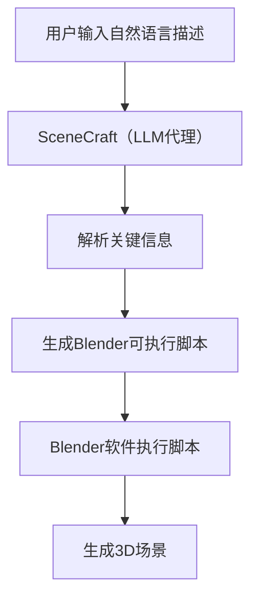

# SceneCraft:生成Blender可执行脚本的LLM代理

> 关键词：SceneCraft、LLM代理、Blender可执行脚本、生成式AI、3D建模

> 摘要：本文围绕SceneCraft这一能够生成Blender可执行脚本的LLM代理展开深入探讨。首先介绍了相关背景知识，包括目的范围、预期读者等内容。接着详细阐述了核心概念与联系，通过文本示意图和Mermaid流程图进行清晰展示。核心算法原理部分结合Python源代码进行详细说明，同时给出数学模型和公式并举例。在项目实战中，从开发环境搭建到源代码详细实现及解读都有细致讲解。此外，还介绍了实际应用场景、推荐了相关工具和资源，最后对未来发展趋势与挑战进行总结，并提供常见问题解答和扩展阅读参考资料，旨在为读者全面呈现SceneCraft的技术全貌和应用前景。

## 1. 背景介绍 
### 1.1 目的和范围
在3D建模领域，Blender是一款功能强大且广泛使用的开源软件。然而，手动编写Blender脚本进行复杂场景的创建和修改是一项具有挑战性的任务，需要开发者具备深厚的编程和Blender API知识。SceneCraft的出现旨在利用大语言模型（LLM）的能力，为用户提供一种更加便捷、高效的方式来生成Blender可执行脚本。

本文章的范围主要涵盖SceneCraft的核心概念、算法原理、数学模型、项目实战、实际应用场景以及相关工具和资源推荐等方面，帮助读者全面了解SceneCraft并能够将其应用到实际的3D建模工作中。

### 1.2 预期读者
本文预期读者包括3D建模爱好者、Blender开发者、人工智能研究者以及对生成式AI在3D领域应用感兴趣的技术人员。无论是初学者想要快速入门Blender脚本编写，还是有经验的开发者希望借助LLM提高脚本生成效率，都能从本文中获得有价值的信息。

### 1.3 文档结构概述
本文将按照以下结构进行组织：首先介绍核心概念与联系，让读者对SceneCraft有一个初步的认识；接着详细讲解核心算法原理和具体操作步骤，结合Python代码进行说明；然后给出数学模型和公式，并通过举例进行详细讲解；在项目实战部分，从开发环境搭建到代码实现和解读进行全面介绍；之后介绍SceneCraft的实际应用场景；再推荐相关的工具和资源；最后对未来发展趋势与挑战进行总结，并提供常见问题解答和扩展阅读参考资料。

### 1.4 术语表
#### 1.4.1 核心术语定义
- **SceneCraft**：一种利用大语言模型生成Blender可执行脚本的代理工具。
- **LLM（Large Language Model）**：大语言模型，具有强大的自然语言处理能力，能够理解和生成人类语言。
- **Blender**：一款开源的3D建模、动画、渲染软件，支持Python脚本编程。
- **Blender可执行脚本**：使用Python编写的、能够在Blender软件中运行的脚本，用于实现各种3D建模和动画操作。

#### 1.4.2 相关概念解释
- **生成式AI**：一种人工智能技术，能够根据输入的信息生成新的内容，如文本、图像、音频等。SceneCraft利用生成式AI的原理，根据用户的描述生成Blender可执行脚本。
- **代理（Agent）**：在人工智能领域，代理是一种能够感知环境、做出决策并采取行动的实体。SceneCraft作为LLM代理，能够根据用户的需求生成相应的Blender脚本。

#### 1.4.3 缩略词列表
- **LLM**：Large Language Model
- **API**：Application Programming Interface

## 2. 核心概念与联系 

### 核心概念原理
SceneCraft的核心原理是利用大语言模型的自然语言理解和生成能力，将用户的自然语言描述转化为Blender可执行的Python脚本。具体来说，用户向SceneCraft输入对3D场景的描述，如“创建一个红色的立方体，并将其放置在坐标(0, 0, 0)处”，SceneCraft通过LLM对该描述进行解析，提取关键信息，然后根据Blender API生成相应的Python脚本。

### 架构的文本示意图
```plaintext
用户输入（自然语言描述） -> SceneCraft（LLM代理） -> 解析关键信息 -> 生成Blender可执行脚本 -> Blender软件执行脚本 -> 生成3D场景
```

### Mermaid流程图


## 3. 核心算法原理 & 具体操作步骤 

### 核心算法原理
SceneCraft的核心算法主要包括以下几个步骤：
1. **自然语言理解**：使用LLM对用户输入的自然语言描述进行理解，提取关键信息，如物体类型、颜色、位置等。
2. **信息映射**：将提取的关键信息映射到Blender API中的相应函数和参数。
3. **脚本生成**：根据映射结果，生成符合Blender语法的Python脚本。

### 具体操作步骤
以下是使用Python代码实现SceneCraft核心算法的详细步骤：

```python
import openai  # 假设使用OpenAI的LLM

# 设置OpenAI API密钥
openai.api_key = "your_api_key"

def generate_blender_script(user_input):
    # 步骤1: 自然语言理解
    prompt = f"将以下描述转换为Blender可执行的Python脚本: {user_input}"
    response = openai.Completion.create(
        engine="text-davinci-003",
        prompt=prompt,
        max_tokens=200
    )
    script_text = response.choices[0].text.strip()

    # 步骤2: 信息映射和步骤3: 脚本生成已经由LLM完成

    return script_text

# 示例用户输入
user_input = "创建一个红色的立方体，并将其放置在坐标(0, 0, 0)处"
blender_script = generate_blender_script(user_input)
print(blender_script)
```

### 代码解释
1. **导入必要的库**：导入`openai`库，用于调用OpenAI的LLM。
2. **设置API密钥**：将`your_api_key`替换为你自己的OpenAI API密钥。
3. **定义`generate_blender_script`函数**：该函数接受用户输入的自然语言描述作为参数，通过调用OpenAI的LLM生成Blender可执行脚本。
4. **自然语言理解**：构建一个提示信息，将用户输入的描述转换为Blender可执行的Python脚本。
5. **调用LLM**：使用`openai.Completion.create`方法调用LLM，获取生成的脚本文本。
6. **返回脚本**：返回生成的Blender可执行脚本。

## 4. 数学模型和公式 & 详细讲解 & 举例说明 

### 数学模型和公式
SceneCraft的数学模型主要基于自然语言处理中的概率模型，如语言模型的概率分布。假设用户输入的自然语言描述为 $x$，生成的Blender可执行脚本为 $y$，则生成脚本的概率可以表示为 $P(y|x)$。

根据贝叶斯定理，有：

$$P(y|x)=\frac{P(x|y)P(y)}{P(x)}$$

其中，$P(x|y)$ 表示在给定脚本 $y$ 的情况下，生成描述 $x$ 的概率；$P(y)$ 表示脚本 $y$ 的先验概率；$P(x)$ 表示描述 $x$ 的先验概率。

### 详细讲解
在实际应用中，由于 $P(x)$ 对于所有可能的脚本 $y$ 都是相同的，因此可以忽略分母，只考虑分子 $P(x|y)P(y)$。

- **$P(x|y)$**：可以通过训练数据学习得到，例如使用大量的Blender脚本和对应的自然语言描述进行训练，计算在给定脚本的情况下生成描述的概率。
- **$P(y)$**：可以根据脚本的复杂度、出现频率等因素进行估计。

### 举例说明
假设用户输入的描述为“创建一个球体”，可能的脚本有以下两种：

- $y_1$：`bpy.ops.mesh.primitive_uv_sphere_add()`
- $y_2$：`bpy.ops.mesh.primitive_cube_add()`

根据训练数据和先验知识，我们可以估计 $P(x|y_1)$ 和 $P(x|y_2)$ 的值。显然，$P(x|y_1)$ 应该比 $P(x|y_2)$ 大，因为 $y_1$ 是创建球体的脚本，而 $y_2$ 是创建立方体的脚本。

同时，我们也可以估计 $P(y_1)$ 和 $P(y_2)$ 的值。如果创建球体的脚本在训练数据中出现的频率比创建立方体的脚本高，那么 $P(y_1)$ 可能会比 $P(y_2)$ 大。

综合考虑 $P(x|y_1)P(y_1)$ 和 $P(x|y_2)P(y_2)$ 的值，我们可以选择概率最大的脚本作为生成结果。

## 5. 项目实战：代码实际案例和详细解释说明 

### 5.1  开发环境搭建
#### 安装Blender
首先，从Blender官方网站（https://www.blender.org/download/）下载并安装适合你操作系统的Blender版本。

#### 安装Python环境
SceneCraft使用Python进行开发，因此需要安装Python环境。建议使用Python 3.7或更高版本。可以从Python官方网站（https://www.python.org/downloads/）下载并安装。

#### 安装必要的Python库
在命令行中使用以下命令安装必要的Python库：

```sh
pip install openai
```

### 5.2  源代码详细实现和代码解读
以下是一个完整的SceneCraft项目示例，包括用户输入、脚本生成和在Blender中执行脚本的代码：

```python
import openai
import bpy  # Blender Python API

# 设置OpenAI API密钥
openai.api_key = "your_api_key"

def generate_blender_script(user_input):
    prompt = f"将以下描述转换为Blender可执行的Python脚本: {user_input}"
    response = openai.Completion.create(
        engine="text-davinci-003",
        prompt=prompt,
        max_tokens=200
    )
    script_text = response.choices[0].text.strip()
    return script_text

def execute_blender_script(script_text):
    try:
        exec(script_text)
        print("脚本执行成功！")
    except Exception as e:
        print(f"脚本执行失败: {e}")

# 示例用户输入
user_input = "创建一个蓝色的圆柱体，并将其放置在坐标(1, 1, 1)处"
blender_script = generate_blender_script(user_input)
print("生成的Blender脚本:")
print(blender_script)

# 在Blender中执行脚本
execute_blender_script(blender_script)
```

### 代码解读
1. **导入必要的库**：导入`openai`库用于调用LLM，导入`bpy`库用于在Blender中执行脚本。
2. **设置API密钥**：将`your_api_key`替换为你自己的OpenAI API密钥。
3. **定义`generate_blender_script`函数**：该函数接受用户输入的自然语言描述，通过调用LLM生成Blender可执行脚本。
4. **定义`execute_blender_script`函数**：该函数接受生成的脚本文本，使用`exec`函数在Blender中执行脚本。如果执行过程中出现异常，捕获并打印错误信息。
5. **示例用户输入**：定义一个示例用户输入，调用`generate_blender_script`函数生成脚本，并打印生成的脚本。
6. **执行脚本**：调用`execute_blender_script`函数在Blender中执行生成的脚本。

### 5.3  代码解读与分析
#### 优点
- **简单易用**：通过自然语言描述即可生成Blender可执行脚本，降低了Blender脚本编写的门槛。
- **灵活性高**：可以根据不同的用户输入生成不同的脚本，适用于各种3D建模需求。

#### 缺点
- **依赖LLM**：生成的脚本质量依赖于LLM的性能和训练数据，如果LLM对Blender API的理解不够准确，可能会生成错误的脚本。
- **安全性问题**：使用`exec`函数执行脚本存在一定的安全风险，因为脚本可能包含恶意代码。在实际应用中，需要对生成的脚本进行严格的安全检查。

## 6. 实际应用场景 
### 快速原型设计
在3D建模项目的早期阶段，设计师可以使用SceneCraft快速生成简单的3D场景原型，无需手动编写复杂的Blender脚本。例如，设计师可以输入“创建一个室内场景，包含一张桌子、一把椅子和一盏灯”，SceneCraft可以快速生成相应的Blender脚本，帮助设计师快速验证设计思路。

### 自动化建模
对于一些重复性的3D建模任务，如批量创建相同类型的物体、对物体进行统一的变换等，可以使用SceneCraft生成自动化脚本。例如，设计师需要创建100个不同颜色的球体，可以输入“创建100个球体，每个球体的颜色随机”，SceneCraft可以生成相应的脚本，实现自动化建模。

### 教育和培训
在Blender的教育和培训中，SceneCraft可以作为一种辅助工具，帮助学生快速理解Blender API的使用方法。学生可以通过输入自然语言描述，观察生成的脚本，学习如何使用Blender API进行3D建模。

## 7. 工具和资源推荐
### 7.1 学习资源推荐
#### 7.1.1 书籍推荐
- 《Blender Python API: 3D Modeling and Add-on Development》：这本书详细介绍了Blender Python API的使用方法，包括如何创建3D模型、进行动画制作和开发Blender插件等内容。
- 《Python for Data Science Handbook》：虽然这本书主要介绍Python在数据科学领域的应用，但其中的Python基础知识和编程技巧对于学习SceneCraft和Blender脚本编写也非常有帮助。

#### 7.1.2 在线课程
- Coursera上的“Blender 3D: From Beginner to Pro”：这门课程从Blender的基础知识开始，逐步引导学生学习3D建模、动画制作和渲染等技能。
- Udemy上的“Python Programming for Beginners”：适合初学者学习Python编程，为学习SceneCraft和Blender脚本编写打下基础。

#### 7.1.3 技术博客和网站
- Blender官方文档（https://docs.blender.org/api/current/）：提供了Blender Python API的详细文档和示例代码。
- OpenAI官方博客（https://openai.com/blog/）：可以了解到最新的大语言模型技术和应用案例。

### 7.2 开发工具框架推荐
#### 7.2.1 IDE和编辑器
- Visual Studio Code：一款功能强大的开源代码编辑器，支持Python语法高亮、代码调试等功能，还可以安装Blender插件，方便在Blender中调试脚本。
- PyCharm：专业的Python集成开发环境，提供了丰富的代码分析和调试工具，适合开发复杂的Python项目。

#### 7.2.2 调试和性能分析工具
- Blender自带的Python控制台：可以在Blender中直接运行Python脚本，并查看脚本的输出和错误信息，方便调试脚本。
- cProfile：Python标准库中的性能分析工具，可以帮助分析脚本的性能瓶颈，优化脚本的执行效率。

#### 7.2.3 相关框架和库
- OpenAI Python SDK：用于调用OpenAI的大语言模型，实现自然语言处理和脚本生成功能。
- NumPy和Pandas：用于处理和分析数据，在一些需要进行数值计算和数据处理的3D建模任务中非常有用。

### 7.3 相关论文著作推荐
#### 7.3.1 经典论文
- 《Attention Is All You Need》：介绍了Transformer架构，是现代大语言模型的基础。
- 《Generative Adversarial Networks》：提出了生成对抗网络（GAN）的概念，在生成式AI领域具有重要的影响力。

#### 7.3.2 最新研究成果
- 《Scaling Laws for Neural Language Models》：研究了大语言模型的规模和性能之间的关系，为大语言模型的发展提供了理论指导。
- 《DALL-E 2: Creating Images from Text》：介绍了OpenAI的图像生成模型DALL-E 2，展示了生成式AI在图像领域的强大能力。

#### 7.3.3 应用案例分析
- 《Using AI to Automate 3D Modeling Workflows》：分析了如何使用人工智能技术自动化3D建模工作流程，为SceneCraft的应用提供了参考。

## 8. 总结：未来发展趋势与挑战
### 未来发展趋势
- **更强大的LLM支持**：随着大语言模型技术的不断发展，SceneCraft将能够利用更强大的LLM，生成更加复杂和准确的Blender脚本。
- **多模态交互**：未来的SceneCraft可能支持多模态交互，用户不仅可以通过自然语言描述，还可以通过图像、语音等方式输入需求，进一步提高交互的便捷性。
- **与其他3D软件集成**：除了Blender，SceneCraft可能会与其他3D软件进行集成，如Maya、3ds Max等，扩大其应用范围。

### 挑战
- **脚本质量和安全性**：如何保证生成的脚本质量和安全性是一个重要的挑战。需要开发更加智能的脚本验证和修复机制，避免生成错误或恶意的脚本。
- **语义理解的准确性**：大语言模型在语义理解方面仍然存在一定的局限性，如何提高SceneCraft对用户输入的语义理解准确性，是需要解决的问题之一。
- **计算资源需求**：使用大语言模型生成脚本需要大量的计算资源，如何降低计算成本，提高系统的效率，也是未来需要面对的挑战。

## 9. 附录：常见问题与解答
### 问题1：生成的脚本在Blender中执行失败怎么办？
解答：首先检查生成的脚本是否存在语法错误，可以在Blender的Python控制台中逐行执行脚本，查看具体的错误信息。如果是因为LLM生成的脚本不准确，可以尝试修改用户输入的描述，或者调整LLM的参数。

### 问题2：如何保证生成的脚本的安全性？
解答：在执行生成的脚本之前，需要对脚本进行严格的安全检查。可以使用静态代码分析工具检查脚本中是否包含恶意代码，避免执行不安全的脚本。

### 问题3：SceneCraft是否支持中文输入？
解答：如果使用的LLM支持中文输入，那么SceneCraft可以支持中文描述。在实际使用中，可以直接输入中文描述进行脚本生成。

## 10. 扩展阅读 & 参考资料
- 《Blender 3D: Noob to Pro》
- 《Python Crash Course》
- OpenAI官方文档（https://platform.openai.com/docs/）
- Blender社区论坛（https://blenderartists.org/）

作者：AI天才研究院/AI Genius Institute & 禅与计算机程序设计艺术 /Zen And The Art of Computer Programming