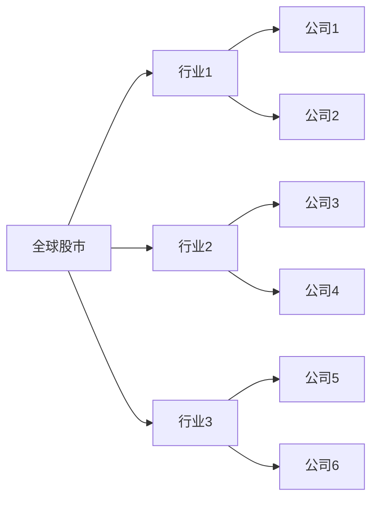

# 不同行业在全球股市估值中的权重分析

> 关键词：全球股市估值、行业权重、估值方法、经济周期、行业分析

> 摘要：本文旨在深入分析不同行业在全球股市估值中的权重情况。通过对相关核心概念的阐述，介绍了行业权重在股市估值中的重要性及相关联系。详细讲解了核心算法原理与具体操作步骤，并结合数学模型和公式进行深入剖析。同时，给出项目实战案例，包括开发环境搭建、源代码实现与解读。还探讨了不同行业权重在实际应用场景中的体现，推荐了相关的学习资源、开发工具框架和论文著作。最后总结了未来发展趋势与挑战，并对常见问题进行了解答。通过全面的分析，帮助投资者更好地理解不同行业在全球股市估值中的作用，为投资决策提供参考。

## 1. 背景介绍 
### 1.1 目的和范围
本研究的目的是全面、系统地分析不同行业在全球股市估值中的权重。随着全球经济的快速发展和金融市场的日益复杂，不同行业的表现和发展前景存在显著差异，这些差异会直接影响到其在股市估值中的权重。通过对行业权重的分析，可以帮助投资者更准确地把握市场动态，合理配置资产，降低投资风险。

研究范围涵盖全球主要股票市场，包括美国的纽约证券交易所、纳斯达克证券交易所，欧洲的伦敦证券交易所、法兰克福证券交易所，亚洲的东京证券交易所、香港证券交易所等。同时，对各个市场中的主要行业，如金融、科技、消费、能源、工业等进行深入研究。

### 1.2 预期读者
本文的预期读者主要包括专业投资者、金融分析师、投资顾问、基金经理等金融领域从业者，以及对全球股市投资感兴趣的个人投资者。这些读者希望通过了解不同行业在全球股市估值中的权重情况，为投资决策提供依据，提高投资收益。

### 1.3 文档结构概述
本文将按照以下结构进行阐述：首先介绍相关核心概念与联系，明确行业权重在股市估值中的地位和作用；接着讲解核心算法原理和具体操作步骤，给出实现行业权重分析的技术方法；然后通过数学模型和公式对行业权重进行量化分析，并举例说明；之后进行项目实战，展示如何运用所学知识进行实际的行业权重分析；再探讨不同行业权重在实际应用场景中的体现；推荐相关的学习资源、开发工具框架和论文著作；最后总结未来发展趋势与挑战，解答常见问题，并提供扩展阅读和参考资料。

### 1.4 术语表
#### 1.4.1 核心术语定义
- **股市估值**：是指对股票市场中上市公司的价值进行评估的过程。通常使用市盈率（P/E）、市净率（P/B）、市销率（P/S）等指标来衡量。
- **行业权重**：是指某一行业的市值在整个股票市场总市值中所占的比例。行业权重反映了该行业在股市中的重要程度和影响力。
- **市值**：是指上市公司的股票总价值，等于公司的总股本乘以每股股价。

#### 1.4.2 相关概念解释
- **行业分类**：为了便于对不同行业进行分析和比较，通常会对上市公司进行行业分类。常见的行业分类标准有全球行业分类标准（GICS）、行业分类基准（ICB）等。
- **宏观经济因素**：是指影响整个经济运行的因素，如国内生产总值（GDP）增长率、通货膨胀率、利率、汇率等。宏观经济因素会对不同行业的发展产生不同程度的影响，从而影响其在股市估值中的权重。

#### 1.4.3 缩略词列表
- **P/E**：市盈率（Price-to-Earnings Ratio）
- **P/B**：市净率（Price-to-Book Ratio）
- **P/S**：市销率（Price-to-Sales Ratio）
- **GDP**：国内生产总值（Gross Domestic Product）
- **GICS**：全球行业分类标准（Global Industry Classification Standard）
- **ICB**：行业分类基准（Industry Classification Benchmark）

## 2. 核心概念与联系 

### 核心概念原理
股市估值是投资者评估股票投资价值的重要依据。不同行业的公司由于其业务模式、盈利能力、发展前景等因素的不同，其估值水平也会存在差异。行业权重则反映了各个行业在整个股票市场中的相对重要性。

从原理上讲，行业权重的大小取决于该行业内上市公司的市值总和。市值越大的行业，其在股市估值中的权重就越高。例如，科技行业近年来发展迅速，一些科技巨头公司的市值不断攀升，使得科技行业在全球股市估值中的权重逐渐增加。

### 架构的文本示意图
```plaintext
全球股市估值
|
|--行业1（权重：X1）
|   |--公司1
|   |--公司2
|   |--...
|
|--行业2（权重：X2）
|   |--公司3
|   |--公司4
|   |--...
|
|--...
```

### Mermaid 流程图


## 3. 核心算法原理 & 具体操作步骤 

### 核心算法原理
计算行业权重的核心算法是通过计算某一行业的总市值与全球股市总市值的比值。具体公式为：

行业权重 = 某行业总市值 / 全球股市总市值

其中，某行业总市值等于该行业内所有上市公司的市值之和，全球股市总市值等于所有上市公司的市值之和。

### 具体操作步骤

#### 步骤 1：数据收集
收集全球主要股票市场中所有上市公司的基本信息，包括公司名称、所属行业、总股本、每股股价等。可以通过金融数据提供商，如彭博社、路透社、万得资讯等获取这些数据。

#### 步骤 2：计算公司市值
根据收集到的总股本和每股股价数据，计算每个上市公司的市值。计算公式为：

公司市值 = 总股本 × 每股股价

以下是使用 Python 实现计算公司市值的代码示例：
```python
# 假设我们有一个包含公司信息的列表，每个元素是一个字典，包含 'total_shares' 和 'stock_price' 两个键
companies = [
    {'total_shares': 1000000, 'stock_price': 20},
    {'total_shares': 2000000, 'stock_price': 30},
    {'total_shares': 1500000, 'stock_price': 25}
]

for company in companies:
    company['market_value'] = company['total_shares'] * company['stock_price']
    print(f"公司市值: {company['market_value']}")
```

#### 步骤 3：计算行业总市值
根据行业分类标准，将所有上市公司划分到不同的行业中，并计算每个行业的总市值。可以使用 Python 的字典来实现行业总市值的计算，代码示例如下：
```python
# 假设我们有一个包含公司信息的列表，每个元素是一个字典，包含 'industry' 和 'market_value' 两个键
companies = [
    {'industry': '科技', 'market_value': 20000000},
    {'industry': '金融', 'market_value': 30000000},
    {'industry': '科技', 'market_value': 15000000}
]

industry_market_values = {}
for company in companies:
    industry = company['industry']
    if industry not in industry_market_values:
        industry_market_values[industry] = 0
    industry_market_values[industry] += company['market_value']

for industry, market_value in industry_market_values.items():
    print(f"{industry} 行业总市值: {market_value}")
```

#### 步骤 4：计算行业权重
根据行业总市值和全球股市总市值，计算每个行业的权重。代码示例如下：
```python
# 假设我们已经计算出了每个行业的总市值，存储在 industry_market_values 字典中
# 同时，我们也计算出了全球股市总市值 global_market_value
industry_market_values = {
    '科技': 35000000,
    '金融': 30000000
}
global_market_value = 65000000

industry_weights = {}
for industry, market_value in industry_market_values.items():
    industry_weights[industry] = market_value / global_market_value
    print(f"{industry} 行业权重: {industry_weights[industry]}")
```

## 4. 数学模型和公式 & 详细讲解 & 举例说明 

### 数学模型和公式
在计算行业权重时，主要使用以下公式：

#### 公司市值计算公式
$MV = TS \times SP$

其中，$MV$ 表示公司市值，$TS$ 表示公司总股本，$SP$ 表示公司每股股价。

#### 行业总市值计算公式
$IMV = \sum_{i=1}^{n} MV_i$

其中，$IMV$ 表示某行业总市值，$MV_i$ 表示该行业内第 $i$ 家公司的市值，$n$ 表示该行业内公司的数量。

#### 行业权重计算公式
$IW = \frac{IMV}{GMV}$

其中，$IW$ 表示某行业权重，$IMV$ 表示该行业总市值，$GMV$ 表示全球股市总市值。

### 详细讲解
- **公司市值计算公式**：该公式通过将公司的总股本与每股股价相乘，得到公司的总价值。总股本反映了公司发行的股票数量，每股股价则反映了市场对公司每股股票的估值。两者相乘得到的公司市值是衡量公司规模和市场价值的重要指标。
- **行业总市值计算公式**：该公式通过对某行业内所有公司的市值进行求和，得到该行业的总市值。这反映了该行业在股票市场中的整体规模和价值。
- **行业权重计算公式**：该公式通过将某行业总市值除以全球股市总市值，得到该行业在全球股市估值中的权重。权重越高，说明该行业在股市中的重要性和影响力越大。

### 举例说明
假设全球股市中有三个行业：科技、金融和消费。每个行业内的公司信息如下：

| 行业 | 公司名称 | 总股本（万股） | 每股股价（元） |
| ---- | ---- | ---- | ---- |
| 科技 | 公司 A | 1000 | 20 |
| 科技 | 公司 B | 1500 | 25 |
| 金融 | 公司 C | 2000 | 30 |
| 金融 | 公司 D | 1800 | 28 |
| 消费 | 公司 E | 1200 | 15 |
| 消费 | 公司 F | 1600 | 18 |

首先，计算每个公司的市值：

- 公司 A 市值：$MV_A = 1000 \times 20 = 20000$（万元）
- 公司 B 市值：$MV_B = 1500 \times 25 = 37500$（万元）
- 公司 C 市值：$MV_C = 2000 \times 30 = 60000$（万元）
- 公司 D 市值：$MV_D = 1800 \times 28 = 50400$（万元）
- 公司 E 市值：$MV_E = 1200 \times 15 = 18000$（万元）
- 公司 F 市值：$MV_F = 1600 \times 18 = 28800$（万元）

然后，计算每个行业的总市值：

- 科技行业总市值：$IMV_{科技} = MV_A + MV_B = 20000 + 37500 = 57500$（万元）
- 金融行业总市值：$IMV_{金融} = MV_C + MV_D = 60000 + 50400 = 110400$（万元）
- 消费行业总市值：$IMV_{消费} = MV_E + MV_F = 18000 + 28800 = 46800$（万元）

最后，计算全球股市总市值和每个行业的权重：

全球股市总市值：$GMV = IMV_{科技} + IMV_{金融} + IMV_{消费} = 57500 + 110400 + 46800 = 214700$（万元）

- 科技行业权重：$IW_{科技} = \frac{IMV_{科技}}{GMV} = \frac{57500}{214700} \approx 0.268$
- 金融行业权重：$IW_{金融} = \frac{IMV_{金融}}{GMV} = \frac{110400}{214700} \approx 0.514$
- 消费行业权重：$IW_{消费} = \frac{IMV_{消费}}{GMV} = \frac{46800}{214700} \approx 0.218$

通过以上计算，我们可以看出金融行业在全球股市估值中的权重最高，科技行业次之，消费行业最低。

## 5. 项目实战：代码实际案例和详细解释说明 

### 5.1  开发环境搭建
为了实现不同行业在全球股市估值中的权重分析，我们可以使用 Python 语言进行开发。以下是开发环境的搭建步骤：

#### 步骤 1：安装 Python
首先，需要从 Python 官方网站（https://www.python.org/downloads/）下载并安装 Python 3.x 版本。安装过程中，建议勾选“Add Python to PATH”选项，以便在命令行中可以直接使用 Python 命令。

#### 步骤 2：安装必要的库
我们需要安装一些 Python 库来辅助我们进行数据处理和分析，如 Pandas、Numpy 等。可以使用以下命令进行安装：
```sh
pip install pandas numpy
```

### 5.2  源代码详细实现和代码解读

```python
import pandas as pd

# 模拟全球股市数据，包含公司名称、所属行业、总股本和每股股价
data = {
    'company_name': ['Company A', 'Company B', 'Company C', 'Company D', 'Company E', 'Company F'],
    'industry': ['Technology', 'Technology', 'Finance', 'Finance', 'Consumer', 'Consumer'],
    'total_shares': [1000, 1500, 2000, 1800, 1200, 1600],
    'stock_price': [20, 25, 30, 28, 15, 18]
}

# 创建 DataFrame
df = pd.DataFrame(data)

# 计算公司市值
df['market_value'] = df['total_shares'] * df['stock_price']

# 计算行业总市值
industry_market_values = df.groupby('industry')['market_value'].sum()

# 计算全球股市总市值
global_market_value = industry_market_values.sum()

# 计算行业权重
industry_weights = industry_market_values / global_market_value

# 输出结果
print("行业总市值:")
print(industry_market_values)
print("\n全球股市总市值:")
print(global_market_value)
print("\n行业权重:")
print(industry_weights)
```

### 代码解读与分析
- **数据模拟**：使用字典 `data` 模拟全球股市数据，包含公司名称、所属行业、总股本和每股股价。
- **创建 DataFrame**：使用 Pandas 的 `DataFrame` 函数将字典数据转换为数据框，方便进行数据处理和分析。
- **计算公司市值**：通过将 `total_shares` 列和 `stock_price` 列相乘，得到 `market_value` 列，即公司市值。
- **计算行业总市值**：使用 `groupby` 方法按行业对数据进行分组，并对每组的 `market_value` 列求和，得到每个行业的总市值。
- **计算全球股市总市值**：对行业总市值进行求和，得到全球股市总市值。
- **计算行业权重**：将每个行业的总市值除以全球股市总市值，得到每个行业的权重。
- **输出结果**：打印行业总市值、全球股市总市值和行业权重。

## 6. 实际应用场景 
### 资产配置
投资者可以根据不同行业在全球股市估值中的权重情况，合理配置资产。例如，如果科技行业在股市估值中的权重较高，且该行业具有较好的发展前景，投资者可以适当增加对科技行业股票的投资比例。反之，如果某个行业的权重下降，且行业发展面临困境，投资者可以减少对该行业股票的投资。

### 市场趋势分析
通过分析不同行业权重的变化趋势，可以了解市场的热点和发展方向。例如，如果某个新兴行业的权重逐渐增加，说明市场对该行业的关注度和认可度在提高，可能预示着该行业将迎来快速发展。相反，如果某个传统行业的权重持续下降，可能意味着该行业面临着竞争压力和转型升级的挑战。

### 风险管理
了解不同行业在股市估值中的权重情况，有助于投资者进行风险管理。当某个行业的权重过高时，投资者需要警惕该行业可能存在的系统性风险。例如，在 2008 年金融危机期间，金融行业在全球股市估值中的权重较高，危机爆发后，金融行业遭受重创，导致全球股市大幅下跌。因此，投资者可以通过分散投资不同行业的股票，降低单一行业风险对投资组合的影响。

## 7. 工具和资源推荐
### 7.1 学习资源推荐
#### 7.1.1 书籍推荐
- 《聪明的投资者》（The Intelligent Investor）：作者是本杰明·格雷厄姆（Benjamin Graham），这本书被誉为投资界的圣经，介绍了价值投资的基本理念和方法，对理解股市估值和投资决策有很大帮助。
- 《金融市场与金融机构》（Financial Markets and Institutions）：作者是弗雷德里克·S·米什金（Frederic S. Mishkin），该书系统地介绍了金融市场和金融机构的基本知识，包括股票市场、债券市场、银行等，有助于读者全面了解金融市场的运行机制。
- 《投资中最简单的事》：作者是邱国鹭，这本书结合了作者多年的投资经验，深入浅出地讲解了投资的基本原则和方法，对投资者有很好的指导作用。

#### 7.1.2 在线课程
- Coursera 上的“投资学原理”（Principles of Investing）：该课程由宾夕法尼亚大学的教授授课，介绍了投资的基本概念、资产定价模型、投资组合理论等内容，适合初学者学习。
- edX 上的“金融市场”（Financial Markets）：由耶鲁大学的教授授课，课程内容涵盖了金融市场的各个方面，包括股票市场、债券市场、衍生品市场等，对深入理解金融市场有很大帮助。

#### 7.1.3 技术博客和网站
- 雪球（https://xueqiu.com/）：是一个专注于投资交流和分享的社区，汇聚了众多投资者和金融专家，用户可以在上面获取最新的股市信息、分析报告和投资建议。
- 东方财富网（https://www.eastmoney.com/）：是国内知名的金融信息网站，提供丰富的股市行情、财经新闻、研究报告等内容，对投资者了解市场动态有很大帮助。

### 7.2 开发工具框架推荐
#### 7.2.1 IDE和编辑器
- PyCharm：是一款专门为 Python 开发设计的集成开发环境（IDE），具有强大的代码编辑、调试、自动补全、代码分析等功能，适合专业的 Python 开发者使用。
- Jupyter Notebook：是一个基于网页的交互式开发环境，支持多种编程语言，特别是 Python。它可以将代码、文本、图表等内容整合在一起，方便进行数据探索和分析。

#### 7.2.2 调试和性能分析工具
- PDB：是 Python 自带的调试器，可以帮助开发者在代码运行过程中进行调试，查看变量的值、执行流程等。
- cProfile：是 Python 标准库中的性能分析工具，可以帮助开发者分析代码的性能瓶颈，找出执行时间较长的函数和代码段。

#### 7.2.3 相关框架和库
- Pandas：是一个强大的数据处理和分析库，提供了丰富的数据结构和函数，方便进行数据清洗、转换、统计分析等操作。
- Numpy：是 Python 中用于科学计算的基础库，提供了高效的多维数组对象和各种数学函数，广泛应用于数据分析、机器学习等领域。

### 7.3 相关论文著作推荐
#### 7.3.1 经典论文
- Fama, E. F., & French, K. R. (1992). The cross-section of expected stock returns. Journal of Finance, 47(2), 427-465. 这篇论文提出了著名的 Fama-French 三因子模型，对股票收益的横截面进行了深入研究，为资产定价理论的发展做出了重要贡献。
- Sharpe, W. F. (1964). Capital asset prices: A theory of market equilibrium under conditions of risk. Journal of Finance, 19(3), 425-442. 该论文提出了资本资产定价模型（CAPM），为现代金融理论的发展奠定了基础。

#### 7.3.2 最新研究成果
- Ang, A., & Liu, J. (2020). Factor investing. Annual Review of Financial Economics, 12, 231-255. 这篇论文对因子投资进行了全面的综述，介绍了因子投资的基本概念、方法和应用，反映了该领域的最新研究成果。
- Harvey, C. R., Liu, Y., & Zhu, H. (2016). …and the cross-section of expected returns. Review of Financial Studies, 29(1), 5-68. 该论文对股票收益的横截面进行了深入研究，提出了一些新的因子和模型，为资产定价理论的发展提供了新的思路。

#### 7.3.3 应用案例分析
- Campbell, J. Y., & Vuolteenaho, T. (2004). Bad beta, good beta. American Economic Review, 94(5), 1249-1275. 这篇论文通过对美国股市的实证研究，分析了不同行业的风险特征和收益表现，为投资者进行行业配置提供了参考。
- Asness, C. S., Frazzini, A., & Pedersen, L. H. (2019). Quality minus junk. Review of Accounting Studies, 24(3), 919-971. 该论文提出了“质量减垃圾”（Quality minus Junk）的投资策略，并通过实证研究验证了该策略的有效性，为投资者提供了一种新的投资思路。

## 8. 总结：未来发展趋势与挑战
### 未来发展趋势
- **行业结构变化**：随着科技的不断进步和经济的发展，全球股市的行业结构将继续发生变化。新兴行业，如人工智能、大数据、新能源等，将在股市估值中的权重逐渐增加，而传统行业，如钢铁、煤炭等，权重可能会逐渐下降。
- **国际化程度提高**：全球金融市场的一体化程度将不断提高，不同国家和地区的股市联系将更加紧密。投资者将更加关注全球范围内的行业发展和估值情况，进行跨国界的资产配置。
- **量化投资发展**：量化投资将在股市投资中发挥越来越重要的作用。通过运用大数据、人工智能等技术，投资者可以更准确地分析不同行业的估值情况和市场趋势，制定更加科学的投资策略。

### 挑战
- **数据质量和可靠性**：准确计算不同行业在全球股市估值中的权重需要大量的高质量数据。然而，数据的获取和处理过程中可能存在误差和偏差，影响分析结果的准确性。
- **宏观经济不确定性**：宏观经济因素，如经济增长、通货膨胀、利率等，会对不同行业的发展和估值产生影响。宏观经济的不确定性增加了行业权重分析的难度，投资者需要更加关注宏观经济动态，及时调整投资策略。
- **市场情绪和波动**：股票市场的情绪和波动会对行业权重产生影响。在市场恐慌或乐观情绪的影响下，投资者的行为可能会偏离理性，导致行业权重出现异常波动。

## 9. 附录：常见问题与解答
### 问题 1：行业权重的计算频率是怎样的？
行业权重的计算频率可以根据需要进行选择。一般来说，可以按日、周、月或季度进行计算。对于短期投资者来说，可能更关注每日或每周的行业权重变化；而对于长期投资者来说，每月或季度的计算结果可能更有参考价值。

### 问题 2：行业分类标准对行业权重计算有什么影响？
不同的行业分类标准会导致不同的行业划分结果，从而影响行业权重的计算。例如，全球行业分类标准（GICS）和行业分类基准（ICB）对行业的划分方式有所不同，使用不同的分类标准计算得到的行业权重可能会存在差异。因此，在进行行业权重分析时，需要明确使用的行业分类标准，并保持一致性。

### 问题 3：行业权重与行业表现之间有什么关系？
行业权重反映了某一行业在股市估值中的重要程度，而行业表现则反映了该行业内上市公司的经营业绩和市场表现。一般来说，行业权重较高的行业，其市场影响力较大，但并不意味着该行业的表现一定优于其他行业。行业表现受到多种因素的影响，如行业竞争格局、宏观经济环境、技术创新等。

## 10. 扩展阅读 & 参考资料
### 扩展阅读
- 《金融炼金术》（The Alchemy of Finance）：作者是乔治·索罗斯（George Soros），这本书介绍了索罗斯的投资哲学和操作方法，对理解金融市场的运行机制和投资决策有很大启发。
- 《非理性繁荣》（Irrational Exuberance）：作者是罗伯特·席勒（Robert J. Shiller），该书分析了股票市场、房地产市场等金融市场中的非理性行为和泡沫现象，对投资者防范市场风险有重要意义。

### 参考资料
- 彭博社（https://www.bloomberg.com/）：提供全球金融市场的实时行情、新闻资讯、数据分析等服务。
- 路透社（https://www.reuters.com/）：是一家国际知名的新闻通讯社，提供全球财经新闻和市场分析。
- 万得资讯（https://www.wind.com.cn/）：是国内领先的金融数据服务商，提供丰富的金融数据和分析工具。

作者：AI天才研究院/AI Genius Institute & 禅与计算机程序设计艺术 /Zen And The Art of Computer Programming