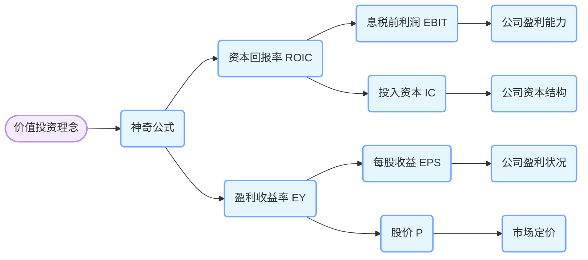

# 乔尔格林布拉特的价值投资教育

> 关键词：乔尔格林布拉特、价值投资、投资教育、神奇公式、股票估值

> 摘要：本文深入探讨了乔尔·格林布拉特的价值投资教育理念与方法。乔尔·格林布拉特是价值投资领域的知名人物，他提出的“神奇公式”等投资策略在市场上具有广泛影响。文章将介绍其价值投资教育的背景，详细阐述核心概念如神奇公式的原理与架构，通过数学模型和公式解释其内在逻辑，结合Python代码给出核心算法原理及操作步骤，提供项目实战案例以助理解，分析实际应用场景，推荐相关学习工具和资源，最后总结未来发展趋势与挑战，并解答常见问题。通过全面剖析乔尔·格林布拉特的价值投资教育，为投资者提供有价值的参考。

## 1. 背景介绍 
### 1.1 目的和范围
本文的目的是系统地介绍乔尔·格林布拉特的价值投资教育内容。旨在帮助投资者深入理解格林布拉特所倡导的价值投资理念、方法和策略，使读者能够运用这些知识进行更加理性和有效的投资决策。范围涵盖格林布拉特价值投资理论的核心概念、算法原理、数学模型、实际应用案例等多个方面，还会对相关的学习资源和工具进行推荐，以助力读者全面掌握价值投资的精髓。

### 1.2 预期读者
本文预期读者包括对价值投资感兴趣的初学者，希望通过学习格林布拉特的方法开启投资之旅；也适合有一定投资经验但希望进一步优化投资策略的投资者，他们可以从格林布拉特独特的视角和方法中获取新的思路；同时，金融专业的学生和研究人员也能从本文中获得理论和实践相结合的研究素材。

### 1.3 文档结构概述
本文将按照以下结构展开：首先介绍核心概念与联系，清晰阐述格林布拉特价值投资的关键概念及其相互关系；接着讲解核心算法原理和具体操作步骤，结合Python代码进行详细说明；然后给出数学模型和公式，并通过举例进行深入讲解；再通过项目实战，展示代码的实际应用和详细解释；之后分析实际应用场景，说明这些投资方法在不同市场环境下的适用性；推荐相关的工具和资源，方便读者进一步学习和实践；最后总结未来发展趋势与挑战，解答常见问题，并提供扩展阅读和参考资料。

### 1.4 术语表
#### 1.4.1 核心术语定义
- **价值投资**：一种投资策略，强调通过分析公司的内在价值，以低于其内在价值的价格购买股票，从而获得长期的投资回报。
- **神奇公式**：乔尔·格林布拉特提出的一种股票筛选方法，通过综合考虑公司的资本回报率和股票的盈利收益率来选择具有投资价值的股票。
- **资本回报率（ROIC）**：衡量公司运用资本获取收益能力的指标，计算公式为息税前利润（EBIT）除以投入资本（IC）。
- **盈利收益率（EY）**：股票的盈利与股价的比率，计算公式为每股收益（EPS）除以股价（P）。

#### 1.4.2 相关概念解释
- **内在价值**：公司的真实价值，通常通过对公司的财务状况、行业前景、竞争优势等多方面因素进行分析和评估得出。内在价值是价值投资的核心概念，投资者认为股票价格会围绕其内在价值波动，当股票价格低于内在价值时，就存在投资机会。
- **安全边际**：指股票价格低于其内在价值的幅度。安全边际为投资者提供了一定的缓冲，降低了投资风险。即使公司的实际表现略低于预期，由于存在安全边际，投资者仍有可能获得较好的回报。

#### 1.4.3 缩略词列表
- **ROIC**：Return on Invested Capital（资本回报率）
- **EBIT**：Earnings Before Interest and Taxes（息税前利润）
- **IC**：Invested Capital（投入资本）
- **EY**：Earnings Yield（盈利收益率）
- **EPS**：Earnings Per Share（每股收益）
- **P**：Price（股价）

## 2. 核心概念与联系 

### 2.1 价值投资理念
乔尔·格林布拉特的价值投资理念基于本杰明·格雷厄姆和沃伦·巴菲特等价值投资大师的思想。价值投资的核心观点是，市场并非总是有效的，股票价格可能会偏离其内在价值。投资者的任务就是通过深入研究和分析，找出那些被市场低估的股票，以合理的价格买入，并长期持有，等待市场发现其真实价值，从而实现投资回报。

### 2.2 神奇公式原理
神奇公式是格林布拉特价值投资方法的核心。该公式的基本原理是通过筛选出具有较高资本回报率和较高盈利收益率的股票。资本回报率反映了公司运用资本创造利润的能力，资本回报率高的公司通常具有较强的竞争力和盈利能力。盈利收益率则反映了股票的性价比，盈利收益率高意味着投资者可以以较低的价格获得较高的盈利。

### 2.3 核心概念架构示意图


从这个架构图可以看出，价值投资理念是基础，神奇公式是实现价值投资的具体方法。神奇公式依赖于资本回报率和盈利收益率这两个关键指标，而这两个指标又分别与公司的财务数据和市场定价相关。通过综合考虑这些因素，投资者可以筛选出具有投资价值的股票。

## 3. 核心算法原理 & 具体操作步骤 

### 3.1 神奇公式算法原理
神奇公式的核心算法是对股票进行排序，首先计算每只股票的资本回报率（ROIC）和盈利收益率（EY），然后分别对这两个指标进行排名，最后将两个排名相加，得到综合排名。排名靠前的股票即为神奇公式筛选出的具有投资价值的股票。

### 3.2 Python 代码实现

```python
import pandas as pd

# 假设我们有一个包含股票数据的 DataFrame，列名为 'EBIT', 'IC', 'EPS', 'P'
# 示例数据
data = {
    'Stock': ['A', 'B', 'C', 'D'],
    'EBIT': [100, 200, 150, 300],
    'IC': [500, 800, 600, 1000],
    'EPS': [5, 8, 6, 10],
    'P': [50, 80, 60, 100]
}
df = pd.DataFrame(data)

# 计算资本回报率 ROIC
df['ROIC'] = df['EBIT'] / df['IC']

# 计算盈利收益率 EY
df['EY'] = df['EPS'] / df['P']

# 对 ROIC 进行排名
df['ROIC_Rank'] = df['ROIC'].rank(ascending=False)

# 对 EY 进行排名
df['EY_Rank'] = df['EY'].rank(ascending=False)

# 计算综合排名
df['Total_Rank'] = df['ROIC_Rank'] + df['EY_Rank']

# 按综合排名排序
df = df.sort_values(by='Total_Rank')

print(df)
```

### 3.3 具体操作步骤
1. **数据收集**：收集股票的相关财务数据，包括息税前利润（EBIT）、投入资本（IC）、每股收益（EPS）和股价（P）。这些数据可以从金融数据提供商、公司财务报表等渠道获取。
2. **指标计算**：根据收集到的数据，计算每只股票的资本回报率（ROIC）和盈利收益率（EY）。
3. **排名计算**：分别对资本回报率和盈利收益率进行排名，排名越高表示该指标表现越好。
4. **综合排名**：将资本回报率排名和盈利收益率排名相加，得到综合排名。
5. **股票筛选**：选择综合排名靠前的股票作为投资标的。

## 4. 数学模型和公式 & 详细讲解 & 举例说明 

### 4.1 资本回报率（ROIC）公式
资本回报率（ROIC）的计算公式为：
$$ROIC = \frac{EBIT}{IC}$$
其中，$EBIT$ 表示息税前利润，$IC$ 表示投入资本。

详细讲解：息税前利润是公司在扣除利息和所得税之前的利润，它反映了公司核心业务的盈利能力。投入资本是公司用于运营的所有资本，包括股权资本和债务资本。资本回报率衡量了公司运用每单位投入资本所创造的利润，资本回报率越高，说明公司的资本使用效率越高，盈利能力越强。

举例说明：假设公司 A 的息税前利润为 100 万元，投入资本为 500 万元，则该公司的资本回报率为：
$$ROIC_A = \frac{100}{500} = 0.2 = 20\%$$

### 4.2 盈利收益率（EY）公式
盈利收益率（EY）的计算公式为：
$$EY = \frac{EPS}{P}$$
其中，$EPS$ 表示每股收益，$P$ 表示股价。

详细讲解：每股收益是公司净利润除以总股本得到的每股盈利，它反映了公司每股股票的盈利能力。股价是市场对该股票的定价。盈利收益率表示投资者每投入一元钱购买该股票所能获得的盈利，盈利收益率越高，说明该股票的性价比越高。

举例说明：假设股票 B 的每股收益为 5 元，股价为 50 元，则该股票的盈利收益率为：
$$EY_B = \frac{5}{50} = 0.1 = 10\%$$

### 4.3 神奇公式综合排名原理
神奇公式通过对资本回报率和盈利收益率分别排名，然后将两个排名相加得到综合排名。假设股票 C 的资本回报率排名为 3，盈利收益率排名为 2，则该股票的综合排名为：
$$Total\_Rank_C = 3 + 2 = 5$$

通过综合排名，投资者可以筛选出在资本回报率和盈利收益率两个方面都表现较好的股票，从而提高投资成功的概率。

## 5. 项目实战：代码实际案例和详细解释说明 

### 5.1 开发环境搭建
1. **安装 Python**：可以从 Python 官方网站（https://www.python.org/downloads/）下载并安装适合你操作系统的 Python 版本。建议安装 Python 3.x 版本。
2. **安装必要的库**：在本项目中，我们使用了 `pandas` 库进行数据处理和分析。可以使用以下命令安装 `pandas` 库：
```sh
pip install pandas
```

### 5.2 源代码详细实现和代码解读
```python
import pandas as pd

# 假设我们从 CSV 文件中读取股票数据
# 数据文件包含列 'Stock', 'EBIT', 'IC', 'EPS', 'P'
file_path = 'stock_data.csv'
df = pd.read_csv(file_path)

# 计算资本回报率 ROIC
df['ROIC'] = df['EBIT'] / df['IC']

# 计算盈利收益率 EY
df['EY'] = df['EPS'] / df['P']

# 对 ROIC 进行排名
df['ROIC_Rank'] = df['ROIC'].rank(ascending=False)

# 对 EY 进行排名
df['EY_Rank'] = df['EY'].rank(ascending=False)

# 计算综合排名
df['Total_Rank'] = df['ROIC_Rank'] + df['EY_Rank']

# 按综合排名排序
df = df.sort_values(by='Total_Rank')

# 选择排名前 10 的股票
top_10_stocks = df.head(10)

# 保存结果到新的 CSV 文件
top_10_stocks.to_csv('top_10_stocks.csv', index=False)

print(top_10_stocks)
```

代码解读：
1. **数据读取**：使用 `pandas` 的 `read_csv` 函数从 CSV 文件中读取股票数据。
2. **指标计算**：计算每只股票的资本回报率（ROIC）和盈利收益率（EY）。
3. **排名计算**：分别对资本回报率和盈利收益率进行排名。
4. **综合排名**：将两个排名相加得到综合排名。
5. **股票筛选**：选择综合排名前 10 的股票。
6. **结果保存**：将筛选出的前 10 只股票保存到新的 CSV 文件中。

### 5.3 代码解读与分析
通过上述代码，我们实现了神奇公式的股票筛选过程。代码的核心在于利用 `pandas` 库进行数据处理和分析，通过简单的数学计算和排名操作，筛选出具有投资价值的股票。这种方法的优点是简单易懂、易于实现，能够快速筛选出符合神奇公式标准的股票。然而，需要注意的是，神奇公式并不是万能的，它只是一种筛选股票的方法，不能保证所选股票一定能获得高回报。在实际应用中，还需要结合其他因素进行综合分析，如公司的行业前景、竞争优势、管理团队等。

## 6. 实际应用场景 
### 6.1 个人投资者
对于个人投资者来说，乔尔·格林布拉特的价值投资方法提供了一种简单有效的投资策略。个人投资者可以使用神奇公式筛选出具有投资价值的股票，构建自己的投资组合。通过长期持有这些股票，有望获得较为稳定的投资回报。同时，价值投资的理念也有助于个人投资者培养理性的投资心态，避免盲目跟风和投机行为。

### 6.2 机构投资者
机构投资者可以将神奇公式作为一种辅助工具，用于股票筛选和投资组合的构建。机构投资者通常拥有更丰富的资源和更专业的研究团队，他们可以在神奇公式筛选的基础上，进一步深入研究公司的基本面和行业前景，以提高投资决策的准确性和有效性。此外，机构投资者还可以将神奇公式与其他投资策略相结合，构建多元化的投资组合，降低投资风险。

### 6.3 投资教育领域
乔尔·格林布拉特的价值投资教育内容在投资教育领域具有重要的应用价值。它可以作为投资课程的教材，帮助学生和投资者了解价值投资的基本理念、方法和策略。通过实际案例和代码演示，学生和投资者可以更好地理解和掌握这些知识，并将其应用到实际投资中。同时，价值投资教育也有助于培养投资者的独立思考能力和风险意识，提高投资者的整体素质。

## 7. 工具和资源推荐
### 7.1 学习资源推荐
#### 7.1.1 书籍推荐
- 《股市稳赚》（《The Little Book That Beats the Market》）：乔尔·格林布拉特的代表作，详细介绍了神奇公式的原理和应用方法。
- 《聪明的投资者》（《The Intelligent Investor》）：本杰明·格雷厄姆的经典著作，价值投资领域的圣经，对价值投资的理念和方法进行了深入阐述。
- 《巴菲特致股东的信》（《Letters to Shareholders of Berkshire Hathaway》）：沃伦·巴菲特每年写给股东的信，包含了巴菲特的投资思想和经验，是学习价值投资的宝贵资料。

#### 7.1.2 在线课程
- Coursera 上的“投资学原理”课程：系统介绍了投资学的基本原理和方法，包括价值投资、资产定价等内容。
- Udemy 上的“价值投资实战课程”：通过实际案例和操作演示，帮助学员掌握价值投资的技巧和方法。

#### 7.1.3 技术博客和网站
- 雪球网：国内知名的投资社区，提供丰富的股票分析和投资策略分享。
- Seeking Alpha：国外的投资研究网站，有大量的专业投资者和分析师发布的投资研究报告和观点。

### 7.2 开发工具框架推荐
#### 7.2.1 IDE和编辑器
- PyCharm：专业的 Python 集成开发环境，具有强大的代码编辑、调试和分析功能。
- Jupyter Notebook：交互式的编程环境，适合进行数据分析和代码演示，方便与他人分享代码和结果。

#### 7.2.2 调试和性能分析工具
- `pdb`：Python 内置的调试工具，可以帮助开发者定位和解决代码中的问题。
- `cProfile`：Python 标准库中的性能分析工具，可以分析代码的运行时间和性能瓶颈。

#### 7.2.3 相关框架和库
- `pandas`：强大的数据处理和分析库，在金融数据分析中广泛应用。
- `numpy`：用于科学计算的基础库，提供了高效的数组操作和数学函数。

### 7.3 相关论文著作推荐
#### 7.3.1 经典论文
- Fama, Eugene F., and Kenneth R. French. "The Cross-Section of Expected Stock Returns." The Journal of Finance 47, no. 2 (1992): 427-465. 该论文提出了著名的 Fama-French 三因子模型，对股票收益率的影响因素进行了深入研究。
- Graham, Benjamin, and David Dodd. "Security Analysis." McGraw-Hill, 1934. 本杰明·格雷厄姆和大卫·多德的经典著作，奠定了价值投资的理论基础。

#### 7.3.2 最新研究成果
- Asness, Clifford S., Andrea Frazzini, and Lasse H. Pedersen. "Quality Minus Junk." The Journal of Financial Economics 123, no. 1 (2017): 1-27. 该论文研究了质量因子在投资中的应用，为价值投资提供了新的视角。

#### 7.3.3 应用案例分析
- Greenblatt, Joel. "The Little Book That Still Beats the Market." Wiley, 2010. 乔尔·格林布拉特在书中提供了神奇公式的实际应用案例和实证研究结果，对投资者具有重要的参考价值。

## 8. 总结：未来发展趋势与挑战
### 8.1 未来发展趋势
- **数字化和智能化**：随着科技的不断发展，价值投资也将越来越多地借助数字化和智能化工具。例如，利用大数据分析和人工智能算法，可以更高效地筛选股票、分析公司基本面和预测市场趋势。
- **多元化投资策略**：投资者将不再局限于传统的价值投资方法，而是会将价值投资与成长投资、量化投资等其他策略相结合，构建多元化的投资组合，以降低风险和提高回报。
- **全球市场拓展**：随着全球经济一体化的加速，投资者将更加关注全球市场的投资机会。价值投资理念将在全球范围内得到更广泛的应用，投资者可以通过投资不同国家和地区的股票，实现资产的全球化配置。

### 8.2 挑战
- **市场有效性提高**：随着市场参与者的不断增加和信息传播的日益迅速，市场的有效性可能会逐渐提高。这意味着股票价格更难偏离其内在价值，价值投资策略的有效性可能会受到一定影响。
- **宏观经济不确定性**：宏观经济环境的不确定性，如经济衰退、通货膨胀、利率波动等，会对公司的盈利和股票价格产生重大影响。价值投资者需要更加关注宏观经济因素的变化，及时调整投资策略。
- **数据质量和隐私问题**：在数字化和智能化投资过程中，数据的质量和隐私问题至关重要。不准确或不完整的数据可能会导致投资决策失误，而数据隐私泄露则可能会给投资者带来不必要的风险。

## 9. 附录：常见问题与解答
### 9.1 神奇公式是否适用于所有市场？
神奇公式并不是适用于所有市场。它在一些成熟的股票市场，如美国股市，已经被证明具有一定的有效性。然而，在不同的市场环境中，公司的财务数据和市场定价机制可能会有所不同，因此神奇公式的表现也可能会有所差异。在应用神奇公式时，投资者需要结合当地市场的特点进行适当的调整和优化。

### 9.2 神奇公式筛选出的股票是否一定能获得高回报？
神奇公式筛选出的股票并不一定能获得高回报。神奇公式只是一种筛选股票的方法，它基于历史数据和财务指标进行分析，但未来市场是不确定的，公司的业绩也可能会受到各种因素的影响而发生变化。因此，投资者在使用神奇公式筛选股票时，还需要结合其他因素进行综合分析，如公司的行业前景、竞争优势、管理团队等，以降低投资风险。

### 9.3 如何获取准确的股票财务数据？
投资者可以通过以下途径获取准确的股票财务数据：
- **金融数据提供商**：如 Bloomberg、Wind、东方财富等，这些数据提供商提供了丰富的金融数据和分析工具。
- **公司官方网站**：公司会定期发布财务报表和公告，投资者可以从公司官方网站上获取最新的财务数据。
- **证券交易所网站**：证券交易所会对上市公司的信息披露进行监管，投资者可以从证券交易所网站上查询公司的财务报告和相关公告。

## 10. 扩展阅读 & 参考资料
- 格林布拉特, 乔尔. 《股市稳赚》. 中信出版社, 2008.
- 格雷厄姆, 本杰明. 《聪明的投资者》. 人民邮电出版社, 2011.
- 巴菲特, 沃伦. 《巴菲特致股东的信》. 机械工业出版社, 2014.
- Fama, Eugene F., and Kenneth R. French. "The Cross-Section of Expected Stock Returns." The Journal of Finance 47, no. 2 (1992): 427-465.
- Asness, Clifford S., Andrea Frazzini, and Lasse H. Pedersen. "Quality Minus Junk." The Journal of Financial Economics 123, no. 1 (2017): 1-27.

作者：AI天才研究院/AI Genius Institute & 禅与计算机程序设计艺术 /Zen And The Art of Computer Programming