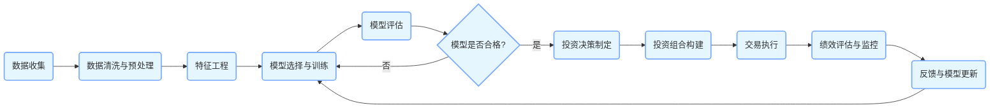

# 人工智能在量化投资中的应用与挑战

> 关键词：人工智能、量化投资、机器学习、深度学习、应用场景、挑战

> 摘要：本文深入探讨了人工智能在量化投资领域的应用与挑战。首先介绍了量化投资和人工智能的背景知识，包括目的、范围、预期读者等。接着阐述了人工智能和量化投资的核心概念及联系，详细讲解了相关核心算法原理和具体操作步骤，并给出了数学模型和公式。通过项目实战展示了人工智能在量化投资中的代码实现和解读。分析了人工智能在量化投资中的实际应用场景，推荐了学习资源、开发工具框架以及相关论文著作。最后总结了未来发展趋势与挑战，并提供了常见问题解答和扩展阅读参考资料，旨在为相关从业者和研究者提供全面深入的技术参考。

## 1. 背景介绍 
### 1.1 目的和范围
量化投资作为一种基于数学模型和计算机算法的投资方法，近年来得到了广泛的关注和应用。而人工智能技术的快速发展，为量化投资带来了新的机遇和挑战。本文的目的在于深入探讨人工智能在量化投资中的具体应用，分析其带来的优势以及面临的挑战。范围涵盖了人工智能的主要技术，如机器学习、深度学习等在量化投资各个环节的应用，包括数据处理、模型构建、投资决策等。

### 1.2 预期读者
本文预期读者包括量化投资领域的从业者，如基金经理、投资分析师等，他们希望通过了解人工智能技术来优化投资策略和提高投资绩效；人工智能领域的研究者和开发者，他们对量化投资这一应用场景感兴趣，希望探索新的研究方向和应用案例；以及金融科技领域的学生和爱好者，他们希望系统地学习人工智能在量化投资中的知识和技术。

### 1.3 文档结构概述
本文将按照以下结构展开：首先介绍量化投资和人工智能的核心概念以及它们之间的联系；接着详细阐述人工智能在量化投资中应用的核心算法原理和具体操作步骤，并给出相应的数学模型和公式；通过项目实战展示人工智能在量化投资中的代码实现和详细解读；分析人工智能在量化投资中的实际应用场景；推荐相关的学习资源、开发工具框架和论文著作；最后总结未来发展趋势与挑战，提供常见问题解答和扩展阅读参考资料。

### 1.4 术语表
#### 1.4.1 核心术语定义
- **量化投资**：指通过数量化方式及计算机程序化发出买卖指令，以获取稳定收益为目的的交易方式。它运用数学、统计学、信息技术的方法，从海量历史数据中寻找能够带来超额收益的多种“大概率”策略，并严格按照这些策略所构建的数量化模型来指导投资，力求取得稳定的、可持续的、高于平均的超额回报。
- **人工智能**：是一门研究如何使计算机能够模拟人类智能的学科和技术领域。它包括机器学习、深度学习、自然语言处理、计算机视觉等多个子领域，旨在让计算机能够感知环境、学习知识、做出决策和解决问题。
- **机器学习**：是人工智能的一个重要分支，它研究计算机如何通过数据和经验来自动改进其性能。机器学习算法可以分为监督学习、无监督学习、半监督学习和强化学习等类型。
- **深度学习**：是机器学习的一个子领域，它基于人工神经网络，特别是深度神经网络，如卷积神经网络（CNN）、循环神经网络（RNN）及其变体（如LSTM、GRU）等。深度学习通过多层神经网络自动学习数据的特征表示，在图像识别、语音识别、自然语言处理等领域取得了显著的成果。

#### 1.4.2 相关概念解释
- **因子模型**：在量化投资中，因子模型是一种常用的风险和收益分析工具。它认为资产的收益率可以由多个因子来解释，这些因子可以是宏观经济变量、行业特征、公司财务指标等。通过对因子的分析和建模，可以预测资产的收益率和风险。
- **策略回测**：是量化投资中评估投资策略有效性的重要方法。它通过历史数据模拟投资策略的执行过程，计算策略在过去一段时间内的收益率、风险指标等，以评估策略的性能和稳定性。
- **高频交易**：是指利用计算机算法和高速网络，在极短的时间内进行大量交易的投资策略。高频交易通常依赖于快速的市场数据处理和交易执行能力，以捕捉微小的价格波动并获取利润。

#### 1.4.3 缩略词列表
- **AI**：Artificial Intelligence，人工智能
- **ML**：Machine Learning，机器学习
- **DL**：Deep Learning，深度学习
- **CNN**：Convolutional Neural Network，卷积神经网络
- **RNN**：Recurrent Neural Network，循环神经网络
- **LSTM**：Long Short-Term Memory，长短期记忆网络
- **GRU**：Gated Recurrent Unit，门控循环单元

## 2. 核心概念与联系 

### 核心概念原理
#### 量化投资原理
量化投资的核心原理是基于数据和模型进行投资决策。它通过收集和整理大量的市场数据、公司财务数据、宏观经济数据等，运用统计学和数学方法构建投资模型。这些模型可以用于预测资产的收益率、风险评估、投资组合优化等。例如，多因子模型通过分析多个因子与资产收益率之间的关系，选择具有显著影响的因子来构建投资组合，以实现风险分散和收益最大化。

#### 人工智能原理
人工智能的核心是让计算机能够模拟人类的智能行为。机器学习是实现人工智能的重要手段，它通过让计算机从数据中学习模式和规律，从而实现预测和决策。深度学习则是机器学习的一种特殊形式，它通过构建多层神经网络，自动学习数据的深层次特征表示。例如，在图像识别中，深度学习模型可以自动学习图像的特征，从而准确地识别图像中的物体。

### 架构的文本示意图
量化投资与人工智能的结合架构可以描述如下：

数据层：收集各种市场数据、公司财务数据、宏观经济数据等，这些数据可以来自于金融数据库、新闻媒体、社交媒体等多个渠道。

特征工程层：对收集到的数据进行清洗、预处理和特征提取，将原始数据转化为适合机器学习模型输入的特征。例如，计算技术指标、构建因子等。

模型层：运用机器学习和深度学习算法构建投资模型，如线性回归模型、决策树模型、神经网络模型等。这些模型可以用于预测资产的收益率、风险评估、投资组合优化等。

决策层：根据模型的输出结果，制定投资策略和决策，如买入、卖出、持有等操作。

监控与反馈层：对投资策略的执行情况进行实时监控，根据市场变化和模型的表现及时调整投资策略。同时，将实际投资结果反馈给模型，用于模型的更新和优化。

### Mermaid 流程图


该流程图展示了人工智能在量化投资中的应用流程，从数据收集开始，经过数据处理、模型构建、评估和决策，到投资组合构建和交易执行，最后进行绩效评估和反馈，形成一个闭环的投资系统。

## 3. 核心算法原理 & 具体操作步骤 

### 线性回归模型
#### 算法原理
线性回归是一种基本的机器学习算法，用于建立自变量和因变量之间的线性关系。在量化投资中，线性回归可以用于预测资产的收益率。假设我们有 $n$ 个样本，每个样本有 $p$ 个特征 $x_{i1}, x_{i2}, \cdots, x_{ip}$ 和一个目标值 $y_i$，线性回归模型可以表示为：

$$y_i = \beta_0 + \beta_1 x_{i1} + \beta_2 x_{i2} + \cdots + \beta_p x_{ip} + \epsilon_i$$

其中，$\beta_0, \beta_1, \cdots, \beta_p$ 是模型的参数，$\epsilon_i$ 是误差项。我们的目标是找到一组最优的参数 $\beta$，使得预测值 $\hat{y}_i$ 与真实值 $y_i$ 之间的误差最小。通常使用最小二乘法来求解参数 $\beta$，即最小化误差平方和：

$$\min_{\beta} \sum_{i=1}^{n} (y_i - \hat{y}_i)^2 = \min_{\beta} \sum_{i=1}^{n} (y_i - (\beta_0 + \beta_1 x_{i1} + \beta_2 x_{i2} + \cdots + \beta_p x_{ip}))^2$$

#### Python 代码实现
```python
import numpy as np
from sklearn.linear_model import LinearRegression

# 生成示例数据
X = np.array([[1], [2], [3], [4], [5]])
y = np.array([2, 4, 6, 8, 10])

# 创建线性回归模型
model = LinearRegression()

# 训练模型
model.fit(X, y)

# 预测
new_X = np.array([[6]])
prediction = model.predict(new_X)
print("预测值:", prediction)
```
#### 具体操作步骤
1. 数据准备：收集和整理自变量和因变量的数据，将其转换为适合模型输入的格式。
2. 模型创建：使用 `sklearn` 库中的 `LinearRegression` 类创建线性回归模型。
3. 模型训练：调用模型的 `fit` 方法，将自变量和因变量的数据作为输入，训练模型。
4. 模型预测：使用训练好的模型对新的数据进行预测，调用模型的 `predict` 方法。

### 决策树模型
#### 算法原理
决策树是一种基于树结构进行决策的机器学习算法。它通过对数据的特征进行划分，构建一棵决策树，每个内部节点表示一个特征上的测试，每个分支表示测试输出，每个叶节点表示一个类别或值。在量化投资中，决策树可以用于分类和回归问题，如预测股票的涨跌、评估投资风险等。决策树的构建过程通常采用贪心算法，即每次选择最优的特征进行划分，使得划分后的子集具有最大的纯度。

#### Python 代码实现
```python
from sklearn.datasets import load_iris
from sklearn.tree import DecisionTreeClassifier
from sklearn.model_selection import train_test_split
from sklearn.metrics import accuracy_score

# 加载鸢尾花数据集
iris = load_iris()
X = iris.data
y = iris.target

# 划分训练集和测试集
X_train, X_test, y_train, y_test = train_test_split(X, y, test_size=0.2, random_state=42)

# 创建决策树模型
model = DecisionTreeClassifier()

# 训练模型
model.fit(X_train, y_train)

# 预测
y_pred = model.predict(X_test)

# 评估模型
accuracy = accuracy_score(y_test, y_pred)
print("准确率:", accuracy)
```
#### 具体操作步骤
1. 数据准备：收集和整理数据，将其划分为训练集和测试集。
2. 模型创建：使用 `sklearn` 库中的 `DecisionTreeClassifier` 类创建决策树分类模型（如果是回归问题，则使用 `DecisionTreeRegressor` 类）。
3. 模型训练：调用模型的 `fit` 方法，将训练集的数据作为输入，训练模型。
4. 模型预测：使用训练好的模型对测试集的数据进行预测，调用模型的 `predict` 方法。
5. 模型评估：使用评估指标（如准确率、均方误差等）评估模型的性能。

### 神经网络模型（以简单的全连接神经网络为例）
#### 算法原理
神经网络是一种模仿人类神经系统的机器学习模型，由多个神经元组成。全连接神经网络是最简单的神经网络结构，每个神经元与前一层的所有神经元相连。在量化投资中，神经网络可以用于处理复杂的非线性关系，如预测股票价格的走势。神经网络的训练过程通常采用反向传播算法，通过不断调整神经元之间的连接权重，使得模型的输出与真实值之间的误差最小。

#### Python 代码实现
```python
import tensorflow as tf
from tensorflow.keras.models import Sequential
from tensorflow.keras.layers import Dense
import numpy as np

# 生成示例数据
X = np.array([[0, 0], [0, 1], [1, 0], [1, 1]])
y = np.array([[0], [1], [1], [0]])

# 创建神经网络模型
model = Sequential([
    Dense(4, activation='relu', input_shape=(2,)),
    Dense(1, activation='sigmoid')
])

# 编译模型
model.compile(optimizer='adam', loss='binary_crossentropy', metrics=['accuracy'])

# 训练模型
model.fit(X, y, epochs=1000, verbose=0)

# 预测
predictions = model.predict(X)
print("预测结果:", predictions)
```
#### 具体操作步骤
1. 数据准备：收集和整理数据，将其转换为适合神经网络输入的格式。
2. 模型创建：使用 `tensorflow.keras` 库创建神经网络模型，定义模型的层数、神经元数量和激活函数等。
3. 模型编译：指定模型的优化器、损失函数和评估指标。
4. 模型训练：调用模型的 `fit` 方法，将数据和训练参数作为输入，训练模型。
5. 模型预测：使用训练好的模型对新的数据进行预测，调用模型的 `predict` 方法。

## 4. 数学模型和公式 & 详细讲解 & 举例说明 

### 线性回归模型
#### 数学模型和公式
线性回归模型的数学表达式为：

$$y = \beta_0 + \beta_1 x_1 + \beta_2 x_2 + \cdots + \beta_p x_p + \epsilon$$

其中，$y$ 是因变量，$x_1, x_2, \cdots, x_p$ 是自变量，$\beta_0, \beta_1, \cdots, \beta_p$ 是模型的参数，$\epsilon$ 是误差项。误差项 $\epsilon$ 通常假设为服从均值为 0、方差为 $\sigma^2$ 的正态分布，即 $\epsilon \sim N(0, \sigma^2)$。

最小二乘法的目标是最小化误差平方和：

$$S(\beta) = \sum_{i=1}^{n} (y_i - (\beta_0 + \beta_1 x_{i1} + \beta_2 x_{i2} + \cdots + \beta_p x_{ip}))^2$$

对 $S(\beta)$ 求偏导数并令其等于 0，可以得到参数 $\beta$ 的估计值。在矩阵形式下，线性回归模型可以表示为：

$$Y = X\beta + \epsilon$$

其中，$Y$ 是 $n$ 维的因变量向量，$X$ 是 $n \times (p + 1)$ 的自变量矩阵（第一列全为 1，对应截距项 $\beta_0$），$\beta$ 是 $(p + 1)$ 维的参数向量，$\epsilon$ 是 $n$ 维的误差向量。参数 $\beta$ 的最小二乘估计值为：

$$\hat{\beta} = (X^T X)^{-1} X^T Y$$

#### 详细讲解
线性回归模型的核心思想是通过找到一组最优的参数 $\beta$，使得模型的预测值与真实值之间的误差最小。最小二乘法是一种常用的求解参数的方法，它通过最小化误差平方和来得到参数的估计值。在实际应用中，我们需要注意数据的质量和特征的选择，避免出现过拟合和欠拟合的问题。

#### 举例说明
假设我们要预测某只股票的收益率 $y$，使用两个自变量：市场收益率 $x_1$ 和公司的市盈率 $x_2$。我们收集了 $n = 100$ 个样本数据，构建线性回归模型：

$$y = \beta_0 + \beta_1 x_1 + \beta_2 x_2 + \epsilon$$

通过最小二乘法求解参数 $\beta_0, \beta_1, \beta_2$ 的估计值，得到模型的具体表达式。然后，我们可以使用这个模型对新的市场收益率和市盈率数据进行预测，得到股票的预期收益率。

### 决策树模型
#### 数学模型和公式
决策树的构建过程通常基于信息论中的熵和信息增益的概念。熵是用来衡量数据的不确定性的指标，对于一个分类问题，假设数据集 $D$ 中包含 $k$ 个类别，每个类别的样本数为 $n_1, n_2, \cdots, n_k$，则数据集 $D$ 的熵为：

$$H(D) = -\sum_{i=1}^{k} \frac{n_i}{n} \log_2 \frac{n_i}{n}$$

其中，$n = \sum_{i=1}^{k} n_i$ 是数据集 $D$ 的总样本数。

信息增益是指在使用某个特征进行划分后，数据集的不确定性减少的程度。假设使用特征 $A$ 对数据集 $D$ 进行划分，划分后的子集为 $D_1, D_2, \cdots, D_v$，则特征 $A$ 的信息增益为：

$$Gain(D, A) = H(D) - \sum_{i=1}^{v} \frac{|D_i|}{|D|} H(D_i)$$

其中，$|D|$ 和 $|D_i|$ 分别表示数据集 $D$ 和子集 $D_i$ 的样本数。

决策树的构建过程就是不断选择信息增益最大的特征进行划分，直到满足停止条件（如子集的样本数小于某个阈值、信息增益小于某个阈值等）。

#### 详细讲解
决策树的核心思想是通过对数据的特征进行划分，构建一棵决策树，使得每个叶节点的数据具有较高的纯度。信息增益是衡量特征划分效果的重要指标，它反映了使用某个特征进行划分后，数据集的不确定性减少的程度。在实际应用中，我们需要注意决策树的过拟合问题，可以通过剪枝等方法来解决。

#### 举例说明
假设我们有一个数据集，包含 100 个样本，每个样本有 3 个特征：年龄、性别和收入，目标是预测客户是否会购买某种产品（是或否）。我们可以使用决策树模型来构建预测模型。首先，计算每个特征的信息增益，选择信息增益最大的特征进行划分。假设年龄的信息增益最大，我们可以根据年龄将数据集划分为不同的子集，然后对每个子集继续进行划分，直到满足停止条件。最终得到一棵决策树，根据客户的年龄、性别和收入信息，我们可以通过决策树来预测客户是否会购买产品。

### 神经网络模型
#### 数学模型和公式
神经网络由多个神经元组成，每个神经元接收输入信号，经过加权求和和激活函数处理后，输出一个信号。假设一个神经元有 $n$ 个输入 $x_1, x_2, \cdots, x_n$，对应的权重为 $w_1, w_2, \cdots, w_n$，偏置为 $b$，则神经元的输出 $y$ 可以表示为：

$$y = f(\sum_{i=1}^{n} w_i x_i + b)$$

其中，$f$ 是激活函数，常用的激活函数有 sigmoid 函数、ReLU 函数等。

sigmoid 函数的表达式为：

$$\sigma(x) = \frac{1}{1 + e^{-x}}$$

ReLU 函数的表达式为：

$$ReLU(x) = \max(0, x)$$

神经网络的训练过程通常采用反向传播算法，通过计算损失函数对权重和偏置的梯度，然后使用梯度下降法更新权重和偏置。假设损失函数为 $L$，权重和偏置的更新公式为：

$$w_{ij}^{(l)} = w_{ij}^{(l)} - \alpha \frac{\partial L}{\partial w_{ij}^{(l)}}$$

$$b_{i}^{(l)} = b_{i}^{(l)} - \alpha \frac{\partial L}{\partial b_{i}^{(l)}}$$

其中，$w_{ij}^{(l)}$ 表示第 $l$ 层第 $i$ 个神经元与第 $l - 1$ 层第 $j$ 个神经元之间的权重，$b_{i}^{(l)}$ 表示第 $l$ 层第 $i$ 个神经元的偏置，$\alpha$ 是学习率。

#### 详细讲解
神经网络的核心思想是通过多层神经元的组合，自动学习数据的特征表示。激活函数的作用是引入非线性因素，使得神经网络能够处理复杂的非线性关系。反向传播算法是一种高效的训练算法，它通过计算损失函数对权重和偏置的梯度，然后使用梯度下降法更新权重和偏置，使得模型的输出与真实值之间的误差最小。在实际应用中，我们需要注意神经网络的过拟合问题，可以通过正则化、早停等方法来解决。

#### 举例说明
假设我们要构建一个简单的全连接神经网络来预测手写数字。输入层有 784 个神经元（对应 28x28 像素的手写数字图像），隐藏层有 128 个神经元，输出层有 10 个神经元（对应 0 - 9 十个数字）。每个神经元的输出通过 sigmoid 激活函数处理。我们使用交叉熵损失函数来衡量模型的输出与真实标签之间的误差，使用随机梯度下降法来更新权重和偏置。通过不断训练，神经网络可以学习到手写数字的特征表示，从而实现准确的预测。

## 5. 项目实战：代码实际案例和详细解释说明 

### 5.1  开发环境搭建
#### 安装 Python
首先，确保你已经安装了 Python 环境。建议使用 Python 3.6 及以上版本。你可以从 Python 官方网站（https://www.python.org/downloads/）下载并安装 Python。

#### 安装必要的库
在量化投资中，我们通常需要使用一些常用的 Python 库，如 `pandas`、`numpy`、`scikit-learn`、`tensorflow` 等。可以使用以下命令来安装这些库：
```bash
pip install pandas numpy scikit-learn tensorflow
```

#### 数据获取
可以使用一些金融数据接口来获取市场数据，如 `pandas-datareader` 库可以从雅虎财经等数据源获取股票数据。安装命令如下：
```bash
pip install pandas-datareader
```

### 5.2  源代码详细实现和代码解读
#### 数据获取和预处理
```python
import pandas as pd
import pandas_datareader.data as web
import numpy as np
from sklearn.preprocessing import StandardScaler

# 获取股票数据
start_date = '2020-01-01'
end_date = '2023-01-01'
stock_symbol = 'AAPL'
data = web.DataReader(stock_symbol, 'yahoo', start_date, end_date)

# 计算收益率
data['Return'] = data['Close'].pct_change()
data = data.dropna()

# 选择特征和目标变量
features = ['Open', 'High', 'Low', 'Close', 'Volume']
X = data[features].values
y = data['Return'].values

# 数据标准化
scaler = StandardScaler()
X = scaler.fit_transform(X)
```
**代码解读**：
- 首先，使用 `pandas-datareader` 库从雅虎财经获取苹果公司（股票代码：AAPL）从 2020 年 1 月 1 日到 2023 年 1 月 1 日的股票数据。
- 然后，计算股票的每日收益率，并去除缺失值。
- 接着，选择开盘价、最高价、最低价、收盘价和成交量作为特征，收益率作为目标变量。
- 最后，使用 `StandardScaler` 对特征数据进行标准化处理，使得数据具有零均值和单位方差。

#### 模型训练和预测
```python
from sklearn.model_selection import train_test_split
from sklearn.linear_model import LinearRegression
from sklearn.metrics import mean_squared_error

# 划分训练集和测试集
X_train, X_test, y_train, y_test = train_test_split(X, y, test_size=0.2, random_state=42)

# 创建线性回归模型
model = LinearRegression()

# 训练模型
model.fit(X_train, y_train)

# 预测
y_pred = model.predict(X_test)

# 评估模型
mse = mean_squared_error(y_test, y_pred)
print("均方误差:", mse)
```
**代码解读**：
- 使用 `train_test_split` 函数将数据集划分为训练集和测试集，测试集占比为 20%。
- 创建线性回归模型，并使用训练集数据进行训练。
- 使用训练好的模型对测试集数据进行预测。
- 使用均方误差（MSE）评估模型的性能，均方误差越小，说明模型的预测效果越好。

### 5.3  代码解读与分析
#### 数据预处理的重要性
数据预处理是量化投资中非常重要的一步。在上述代码中，我们对数据进行了缺失值处理和标准化处理。缺失值处理可以避免模型在训练过程中出现错误，标准化处理可以使得不同特征具有相同的尺度，有助于模型的收敛和提高模型的性能。

#### 模型选择和评估
在本案例中，我们选择了线性回归模型进行收益率预测。线性回归是一种简单而有效的模型，适用于处理线性关系。在实际应用中，我们可以根据数据的特点和问题的复杂度选择不同的模型，如决策树模型、神经网络模型等。同时，我们使用均方误差作为评估指标来评估模型的性能。在实际应用中，还可以使用其他评估指标，如平均绝对误差（MAE）、决定系数（$R^2$）等。

#### 模型的局限性
线性回归模型假设自变量和因变量之间存在线性关系，在实际金融市场中，这种假设可能不成立。因此，线性回归模型可能无法捕捉到数据中的复杂非线性关系。在实际应用中，我们可以尝试使用更复杂的模型，如神经网络模型，来提高模型的预测能力。

## 6. 实际应用场景 
### 股票价格预测
人工智能可以通过分析历史股票价格数据、公司财务数据、宏观经济数据等，构建预测模型来预测股票价格的走势。例如，使用深度学习模型（如 LSTM 网络）可以处理时间序列数据，捕捉股票价格的长期依赖关系，从而提高预测的准确性。投资者可以根据预测结果制定投资策略，如买入、卖出或持有股票。

### 风险评估
量化投资中，风险评估是非常重要的一环。人工智能可以通过分析市场数据和投资组合的特征，评估投资组合的风险水平。例如，使用机器学习模型可以对投资组合的风险因素进行建模，计算风险指标（如方差、标准差、VaR 等），帮助投资者更好地管理风险。同时，人工智能还可以通过实时监测市场变化，及时调整投资组合的风险暴露。

### 投资组合优化
人工智能可以帮助投资者优化投资组合，实现风险和收益的平衡。通过分析不同资产之间的相关性和预期收益率，使用优化算法（如马科维茨均值 - 方差模型的改进版本）可以确定最优的投资组合权重。例如，使用深度学习模型可以自动学习资产之间的复杂关系，从而得到更合理的投资组合配置方案。投资者可以根据优化结果调整投资组合，提高投资绩效。

### 高频交易
高频交易是指在极短的时间内进行大量交易的投资策略。人工智能可以在高频交易中发挥重要作用，通过实时分析市场数据，快速做出交易决策。例如，使用机器学习模型可以对市场行情进行实时监测和预测，当出现有利的交易机会时，自动执行交易指令。高频交易需要具备快速的数据处理能力和低延迟的交易执行系统，人工智能技术可以提高交易的效率和准确性。

### 智能投顾
智能投顾是一种基于人工智能技术的投资顾问服务，它可以根据投资者的风险偏好、投资目标和财务状况，为投资者提供个性化的投资建议和投资组合方案。人工智能可以通过分析大量的历史数据和市场信息，学习投资者的行为模式和偏好，从而提供更加精准的投资建议。智能投顾可以降低投资顾问的成本，提高投资服务的效率和质量，为广大投资者提供更加便捷的投资服务。

## 7. 工具和资源推荐
### 7.1 学习资源推荐
#### 7.1.1 书籍推荐
- 《机器学习》（周志华）：这本书是机器学习领域的经典教材，系统地介绍了机器学习的基本概念、算法和应用。它涵盖了监督学习、无监督学习、半监督学习和强化学习等多个方面，适合初学者和有一定基础的读者阅读。
- 《深度学习》（Ian Goodfellow、Yoshua Bengio 和 Aaron Courville）：这本书是深度学习领域的权威著作，由深度学习领域的三位顶尖学者共同撰写。它详细介绍了深度学习的基本原理、模型架构和训练方法，是深度学习研究者和开发者的必备书籍。
- 《量化投资：策略与技术》（丁鹏）：这本书系统地介绍了量化投资的基本概念、策略和技术。它涵盖了量化投资的各个方面，包括数据处理、模型构建、策略回测和实盘交易等，适合量化投资领域的从业者和爱好者阅读。

#### 7.1.2 在线课程
- Coursera 上的“机器学习”课程（Andrew Ng 教授）：这是一门非常经典的机器学习在线课程，由斯坦福大学的 Andrew Ng 教授授课。课程内容涵盖了机器学习的基本概念、算法和应用，通过大量的案例和实践项目帮助学生掌握机器学习的知识和技能。
- edX 上的“深度学习专业化课程”（由 Andrew Ng 教授等多位专家授课）：这是一套深度学习的专业化课程，包括深度学习基础、卷积神经网络、循环神经网络等多个方面。课程内容丰富，实践性强，适合深度学习领域的初学者和进阶者学习。
- 中国大学 MOOC 上的“量化投资与金融科技”课程：这门课程由国内知名高校的教授授课，系统地介绍了量化投资和金融科技的基本概念、技术和应用。课程内容结合了实际案例，适合量化投资和金融科技领域的学生和从业者学习。

#### 7.1.3 技术博客和网站
- Medium：这是一个知名的技术博客平台，上面有很多关于人工智能、量化投资等领域的优质文章。你可以关注一些知名的作者和专栏，获取最新的技术动态和研究成果。
- Towards Data Science：这是一个专注于数据科学和人工智能领域的技术博客，上面有很多关于机器学习、深度学习、量化投资等方面的文章。文章质量较高，适合技术爱好者和从业者阅读。
- 量化投资学院：这是一个专注于量化投资领域的网站，提供了量化投资的基础知识、策略分享、案例分析等内容。网站还设有论坛，方便量化投资领域的从业者和爱好者交流和学习。

### 7.2 开发工具框架推荐
#### 7.2.1 IDE和编辑器
- PyCharm：这是一款专业的 Python 集成开发环境（IDE），具有代码编辑、调试、版本控制等功能。它支持多种 Python 库和框架，提供了丰富的插件和扩展，适合 Python 开发者使用。
- Jupyter Notebook：这是一个交互式的编程环境，支持多种编程语言（如 Python、R 等）。它可以将代码、文本、图表等内容集成在一个文档中，方便进行数据探索、模型开发和结果展示。Jupyter Notebook 广泛应用于数据科学和机器学习领域。
- Visual Studio Code：这是一款轻量级的代码编辑器，支持多种编程语言和插件。它具有丰富的代码编辑功能和调试功能，适合快速开发和调试代码。Visual Studio Code 还支持与 Git 等版本控制系统集成，方便团队协作开发。

#### 7.2.2 调试和性能分析工具
- Py-Spy：这是一个用于 Python 程序性能分析的工具，它可以实时监控 Python 程序的 CPU 使用率、函数调用时间等信息，帮助开发者找出程序中的性能瓶颈。
- TensorBoard：这是 TensorFlow 提供的一个可视化工具，它可以用于可视化神经网络的训练过程、模型结构、损失函数变化等信息。通过 TensorBoard，开发者可以更好地理解和调试神经网络模型。
- PDB：这是 Python 自带的调试工具，它可以在代码中设置断点，单步执行代码，查看变量的值等。PDB 适合初学者和小型项目的调试。

#### 7.2.3 相关框架和库
- TensorFlow：这是一个开源的机器学习框架，由 Google 开发和维护。它支持多种深度学习模型，如卷积神经网络、循环神经网络等，提供了丰富的工具和接口，方便开发者进行模型开发和训练。
- PyTorch：这是一个开源的深度学习框架，由 Facebook 开发和维护。它具有动态图机制，代码简洁易懂，适合快速原型开发和研究。PyTorch 在学术界和工业界都有广泛的应用。
- Scikit-learn：这是一个开源的机器学习库，提供了丰富的机器学习算法和工具，如分类、回归、聚类、降维等。Scikit-learn 具有简单易用的接口，适合初学者和快速开发。

### 7.3 相关论文著作推荐
#### 7.3.1 经典论文
- “A Machine Learning Approach to Tactical Asset Allocation”（由 Robert Novy-Marx 和 Mihail Velikov 撰写）：这篇论文提出了一种基于机器学习的战术资产配置方法，通过分析历史市场数据和宏观经济数据，构建投资组合模型，实现资产的优化配置。
- “Deep Learning for Asset Pricing”（由 Bryan Kelly、Sebastian Nagel 和 Dacheng Xiu 撰写）：这篇论文探讨了深度学习在资产定价中的应用，通过构建深度学习模型来预测资产的收益率，发现深度学习模型可以捕捉到传统模型无法捕捉到的非线性关系。
- “Machine Learning for Factor Investing”（由 Stefan Zohren、Julianne T. Kennedy、Bryan Kelly 等撰写）：这篇论文研究了机器学习在因子投资中的应用，通过使用机器学习算法来筛选和优化因子，提高因子投资的绩效。

#### 7.3.2 最新研究成果
- 在顶级学术期刊（如 Journal of Finance、Review of Financial Studies 等）上搜索关于人工智能和量化投资的最新研究论文，可以了解到该领域的最新研究动态和前沿技术。
- 参加国际学术会议（如 NeurIPS、ICML 等），可以接触到人工智能和量化投资领域的最新研究成果和学术交流。

#### 7.3.3 应用案例分析
- 一些金融机构和量化投资公司会发布他们在量化投资中应用人工智能技术的案例分析报告，这些报告可以帮助我们了解人工智能在实际应用中的效果和挑战。
- 可以关注一些量化投资领域的博客和论坛，上面会有一些从业者分享他们的实际应用案例和经验。

## 8. 总结：未来发展趋势与挑战
### 未来发展趋势
#### 多模态数据融合
未来，人工智能在量化投资中将越来越多地融合多模态数据，如文本数据（新闻、研报等）、图像数据（公司财报图表等）、音频数据（会议录音等）。通过融合不同类型的数据，可以获取更全面的市场信息，提高投资决策的准确性。

#### 强化学习的广泛应用
强化学习在量化投资中的应用前景广阔。强化学习可以通过与市场环境进行交互，不断学习和优化投资策略，以实现长期的收益最大化。未来，强化学习有望在高频交易、投资组合优化等领域得到更广泛的应用。

#### 人工智能与区块链技术的结合
区块链技术具有去中心化、不可篡改、安全可靠等特点，与人工智能结合可以为量化投资带来新的机遇。例如，区块链可以提供可信的数据源，保证数据的真实性和完整性；人工智能可以对区块链上的数据进行分析和挖掘，发现投资机会。

#### 智能投顾的个性化和专业化
智能投顾将向个性化和专业化方向发展。未来的智能投顾将不仅考虑投资者的风险偏好和投资目标，还将结合投资者的财务状况、职业背景、家庭情况等因素，为投资者提供更加个性化的投资建议。同时，智能投顾将在特定领域（如行业投资、主题投资等）提供更加专业化的服务。

### 挑战
#### 数据质量和隐私问题
人工智能在量化投资中依赖大量的数据，数据的质量直接影响模型的性能。然而，金融数据往往存在噪声、缺失值、异常值等问题，需要进行复杂的数据预处理。此外，数据隐私问题也是一个重要的挑战，金融数据涉及到投资者的敏感信息，如何在保护数据隐私的前提下进行数据分析和模型训练是一个亟待解决的问题。

#### 模型解释性和可解释人工智能
深度学习等复杂模型在量化投资中取得了很好的效果，但这些模型往往是黑箱模型，难以解释其决策过程和结果。在金融领域，模型的解释性非常重要，投资者需要了解模型是如何做出决策的，以便评估风险和做出合理的投资决策。因此，发展可解释人工智能技术是量化投资领域的一个重要挑战。

#### 市场不确定性和模型适应性
金融市场具有高度的不确定性和复杂性，市场情况随时可能发生变化。人工智能模型在训练时是基于历史数据，当市场环境发生变化时，模型的性能可能会下降。因此，如何提高模型的适应性，使其能够在不同的市场环境下保持良好的性能是一个挑战。

#### 监管和合规问题
随着人工智能在量化投资中的广泛应用，监管和合规问题也日益凸显。监管机构需要制定相应的政策和法规，确保人工智能在量化投资中的应用符合法律法规和道德规范。同时，金融机构需要遵守相关的监管要求，确保投资决策的透明度和公正性。

## 9. 附录：常见问题与解答
### 问题 1：人工智能在量化投资中的应用是否会完全取代人类投资经理？
答：虽然人工智能在量化投资中具有很多优势，如高效的数据处理能力、快速的决策能力等，但它不会完全取代人类投资经理。人类投资经理具有丰富的经验、判断力和洞察力，能够考虑到一些无法用数据和模型表达的因素，如市场情绪、政策变化等。人工智能可以作为人类投资经理的辅助工具，帮助他们更好地进行投资决策。

### 问题 2：如何选择适合量化投资的人工智能模型？
答：选择适合量化投资的人工智能模型需要考虑多个因素，如数据的特点、问题的复杂度、模型的可解释性等。如果数据具有线性关系，且问题相对简单，可以选择线性回归模型等简单模型；如果数据具有复杂的非线性关系，可以选择神经网络模型等复杂模型。同时，还需要考虑模型的可解释性，特别是在金融领域，投资者需要了解模型的决策过程和结果。

### 问题 3：人工智能在量化投资中面临的最大挑战是什么？
答：人工智能在量化投资中面临的最大挑战之一是数据质量和隐私问题。金融数据往往存在噪声、缺失值、异常值等问题，需要进行复杂的数据预处理。此外，数据隐私问题也是一个重要的挑战，金融数据涉及到投资者的敏感信息，如何在保护数据隐私的前提下进行数据分析和模型训练是一个亟待解决的问题。另外，模型的解释性和市场的不确定性也是重要的挑战。

### 问题 4：如何评估人工智能在量化投资中的性能？
答：评估人工智能在量化投资中的性能可以使用多种指标，如收益率、风险指标（如方差、标准差、VaR 等）、夏普比率、信息比率等。收益率反映了投资的回报情况，风险指标反映了投资的风险水平，夏普比率和信息比率综合考虑了收益和风险。同时，还可以进行策略回测，通过历史数据模拟投资策略的执行过程，评估策略的性能和稳定性。

## 10. 扩展阅读 & 参考资料
### 扩展阅读
- 《人工智能时代的金融科技》：这本书介绍了人工智能在金融领域的广泛应用，包括量化投资、风险管理、智能投顾等方面。它探讨了人工智能技术对金融行业的影响和挑战，以及未来的发展趋势。
- 《数据驱动的金融：人工智能时代的金融风险管理》：这本书深入探讨了数据驱动的金融风险管理方法，介绍了人工智能技术在金融风险管理中的应用。它结合了实际案例，详细讲解了如何使用人工智能模型进行风险评估和预测。
- 《金融科技前沿：人工智能与区块链》：这本书介绍了人工智能和区块链技术在金融领域的前沿应用，包括量化投资、支付结算、证券交易等方面。它分析了人工智能和区块链技术对金融行业的变革和创新，为读者提供了一个全面的金融科技视角。

### 参考资料
- 相关学术期刊：Journal of Finance、Review of Financial Studies、Journal of Financial Economics 等。
- 金融数据提供商：Bloomberg、Wind、Yahoo Finance 等。
- 人工智能和机器学习开源库和框架的官方文档：TensorFlow、PyTorch、Scikit-learn 等。

作者：AI天才研究院/AI Genius Institute & 禅与计算机程序设计艺术 /Zen And The Art of Computer Programming