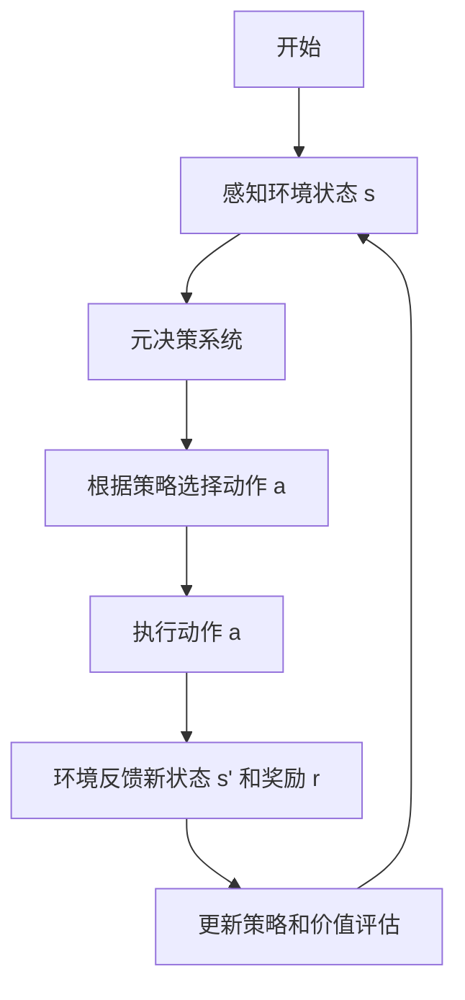

# 从零开始：AI Agent的元决策系统

> 关键词：AI Agent、元决策系统、决策原理、算法实现、实际应用

> 摘要：本文旨在全面深入地探讨AI Agent的元决策系统。从基础的背景知识入手，介绍了相关概念、目的和预期读者等内容。详细阐述了核心概念、算法原理、数学模型，并且结合Python代码进行了具体操作步骤的讲解。通过项目实战案例，展示了元决策系统在实际开发中的实现过程和代码解读。同时分析了其实际应用场景，推荐了相关的学习资源、开发工具和论文著作。最后总结了元决策系统的未来发展趋势与挑战，并提供了常见问题解答和扩展阅读参考资料，帮助读者从零开始建立对AI Agent元决策系统的完整认知。

## 1. 背景介绍 
### 1.1 目的和范围
在当今人工智能快速发展的时代，AI Agent被广泛应用于各种领域，如游戏、自动化控制、智能客服等。而元决策系统作为AI Agent的核心组成部分，负责指导Agent在复杂环境中做出最优决策。本文的目的是详细介绍AI Agent元决策系统的基本原理、算法实现和实际应用，帮助读者深入理解并掌握这一关键技术。范围涵盖了从基础概念的解释到具体代码的实现，以及实际场景中的应用案例分析。

### 1.2 预期读者
本文预期读者包括对人工智能、机器学习有一定了解的程序员、数据科学家、研究人员以及对AI Agent技术感兴趣的爱好者。具备一定的Python编程基础和数学知识（如概率论、线性代数）将有助于更好地理解本文内容。

### 1.3 文档结构概述
本文将按照以下结构进行组织：首先介绍相关背景知识，包括目的、预期读者和文档结构；接着阐述核心概念与联系，通过文本示意图和Mermaid流程图进行直观展示；然后详细讲解核心算法原理和具体操作步骤，并结合Python代码进行说明；之后介绍数学模型和公式，并举例说明；再通过项目实战展示代码的实际案例和详细解释；分析实际应用场景；推荐相关的工具和资源；总结未来发展趋势与挑战；提供常见问题解答和扩展阅读参考资料。

### 1.4 术语表
#### 1.4.1 核心术语定义
- **AI Agent**：能够感知环境、做出决策并采取行动的人工智能实体。
- **元决策系统**：负责为AI Agent提供决策策略和指导，以在不同环境中实现最优决策的系统。
- **状态空间**：AI Agent所处环境的所有可能状态的集合。
- **动作空间**：AI Agent可以采取的所有可能动作的集合。
- **奖励函数**：用于评估AI Agent采取某个动作后所获得的奖励，引导Agent朝着目标前进。

#### 1.4.2 相关概念解释
- **决策过程**：AI Agent根据当前状态，在动作空间中选择一个动作，执行该动作后环境会发生变化，Agent进入新的状态，并获得相应的奖励。
- **策略**：决定AI Agent在不同状态下选择何种动作的规则。
- **探索与利用**：在决策过程中，Agent需要在探索新的动作以发现更好的策略和利用已有的经验之间进行平衡。

#### 1.4.3 缩略词列表
- **RL**：Reinforcement Learning，强化学习
- **MDP**：Markov Decision Process，马尔可夫决策过程

## 2. 核心概念与联系 
### 核心概念原理
AI Agent的元决策系统基于强化学习的思想，将决策过程建模为马尔可夫决策过程（MDP）。MDP由一个四元组 $(S, A, P, R)$ 定义，其中：
- $S$ 是状态空间，表示Agent可能处于的所有状态。
- $A$ 是动作空间，表示Agent可以采取的所有动作。
- $P$ 是状态转移概率函数，$P(s'|s, a)$ 表示在状态 $s$ 下采取动作 $a$ 后转移到状态 $s'$ 的概率。
- $R$ 是奖励函数，$R(s, a, s')$ 表示在状态 $s$ 下采取动作 $a$ 转移到状态 $s'$ 时获得的奖励。

AI Agent的目标是找到一个最优策略 $\pi^*$，使得在每个状态 $s$ 下选择的动作 $a$ 能够最大化长期累积奖励。策略 $\pi$ 是一个从状态到动作的映射，即 $\pi(s) = a$。

### 架构的文本示意图
```plaintext
+-------------------+
|  环境 (Environment) |
+-------------------+
         |
         v
+-------------------+
|  AI Agent         |
| +---------------+ |
| |  元决策系统   | |
| | +-----------+ | |
| | | 策略生成  | | |
| | +-----------+ | |
| | +-----------+ | |
| | | 价值评估  | | |
| | +-----------+ | |
| +---------------+ |
+-------------------+
```
在这个架构中，环境与AI Agent进行交互。AI Agent通过元决策系统进行决策，元决策系统包含策略生成和价值评估两个核心模块。策略生成模块根据当前状态生成动作，价值评估模块评估每个动作的价值，以指导策略生成。

### Mermaid流程图

该流程图展示了AI Agent与环境的交互过程。Agent首先感知环境状态，然后通过元决策系统选择动作并执行，环境反馈新状态和奖励，Agent根据反馈更新策略和价值评估，如此循环。

## 3. 核心算法原理 & 具体操作步骤 
### 算法原理
我们将使用Q-learning算法来实现AI Agent的元决策系统。Q-learning是一种无模型的强化学习算法，通过学习一个Q值函数 $Q(s, a)$ 来找到最优策略。$Q(s, a)$ 表示在状态 $s$ 下采取动作 $a$ 的期望累积奖励。

Q-learning的更新规则如下：
$$Q(s, a) \leftarrow Q(s, a) + \alpha [r + \gamma \max_{a'} Q(s', a') - Q(s, a)]$$
其中：
- $\alpha$ 是学习率，控制每次更新的步长。
- $\gamma$ 是折扣因子，用于权衡即时奖励和未来奖励。
- $r$ 是执行动作 $a$ 后获得的即时奖励。
- $s'$ 是执行动作 $a$ 后转移到的新状态。

### 具体操作步骤
1. 初始化Q值表 $Q(s, a)$ 为全零。
2. 循环执行以下步骤直到满足终止条件：
    - 感知当前环境状态 $s$。
    - 根据 $\epsilon$-贪心策略选择动作 $a$：
        - 以概率 $\epsilon$ 随机选择一个动作。
        - 以概率 $1 - \epsilon$ 选择 $Q(s, a)$ 值最大的动作。
    - 执行动作 $a$，环境反馈新状态 $s'$ 和奖励 $r$。
    - 根据Q-learning更新规则更新 $Q(s, a)$。
    - 将状态 $s$ 更新为 $s'$。

### Python源代码实现
```python
import numpy as np

class QLearningAgent:
    def __init__(self, state_space_size, action_space_size, learning_rate=0.1, discount_factor=0.9, epsilon=0.1):
        self.state_space_size = state_space_size
        self.action_space_size = action_space_size
        self.learning_rate = learning_rate
        self.discount_factor = discount_factor
        self.epsilon = epsilon
        # 初始化Q值表
        self.q_table = np.zeros((state_space_size, action_space_size))

    def choose_action(self, state):
        if np.random.uniform(0, 1) < self.epsilon:
            # 随机选择动作
            action = np.random.choice(self.action_space_size)
        else:
            # 选择Q值最大的动作
            action = np.argmax(self.q_table[state, :])
        return action

    def update_q_table(self, state, action, reward, next_state):
        # Q-learning更新规则
        max_q_next = np.max(self.q_table[next_state, :])
        self.q_table[state, action] += self.learning_rate * (reward + self.discount_factor * max_q_next - self.q_table[state, action])
```
### 代码解释
- `__init__` 方法：初始化Q值表和相关参数，包括学习率、折扣因子和探索率。
- `choose_action` 方法：根据 $\epsilon$-贪心策略选择动作。
- `update_q_table` 方法：根据Q-learning更新规则更新Q值表。

## 4. 数学模型和公式 & 详细讲解 & 举例说明 
### 数学模型
AI Agent的元决策系统基于马尔可夫决策过程（MDP）和Q-learning算法。MDP的数学模型由状态空间 $S$、动作空间 $A$、状态转移概率函数 $P$ 和奖励函数 $R$ 组成。Q-learning算法通过学习Q值函数 $Q(s, a)$ 来找到最优策略。

### 公式讲解
- **Q-learning更新公式**：
$$Q(s, a) \leftarrow Q(s, a) + \alpha [r + \gamma \max_{a'} Q(s', a') - Q(s, a)]$$
    - $Q(s, a)$ 是当前状态 $s$ 下采取动作 $a$ 的Q值。
    - $\alpha$ 是学习率，控制每次更新的步长。较大的学习率会使Agent更快地更新Q值，但可能导致不稳定；较小的学习率会使学习过程更稳定，但收敛速度较慢。
    - $r$ 是执行动作 $a$ 后获得的即时奖励。
    - $\gamma$ 是折扣因子，用于权衡即时奖励和未来奖励。$\gamma$ 越接近1，Agent越注重未来奖励；$\gamma$ 越接近0，Agent越注重即时奖励。
    - $\max_{a'} Q(s', a')$ 是下一个状态 $s'$ 下所有动作的最大Q值。

### 举例说明
假设一个简单的网格世界环境，Agent在一个 $3 \times 3$ 的网格中移动，目标是到达右上角的网格。状态空间 $S$ 包含9个状态（每个网格对应一个状态），动作空间 $A$ 包含4个动作（上、下、左、右）。

初始时，Q值表 $Q(s, a)$ 全为零。假设Agent当前处于状态 $s = 0$（左上角网格），选择动作 $a = 1$（向下移动），执行动作后转移到状态 $s' = 3$，并获得奖励 $r = -1$。

假设学习率 $\alpha = 0.1$，折扣因子 $\gamma = 0.9$。当前 $Q(0, 1) = 0$，$\max_{a'} Q(3, a') = 0$（因为初始时Q值表全为零）。

根据Q-learning更新公式：
$$Q(0, 1) \leftarrow 0 + 0.1 [-1 + 0.9 \times 0 - 0] = -0.1$$

经过多次迭代，Q值表会逐渐收敛到最优值，Agent也会学习到最优策略。

## 5. 项目实战：代码实际案例和详细解释说明 
### 5.1  开发环境搭建
- **Python版本**：建议使用Python 3.7及以上版本。
- **依赖库**：
    - `numpy`：用于数值计算。
    - `matplotlib`：用于可视化结果。

可以使用以下命令安装依赖库：
```sh
pip install numpy matplotlib
```

### 5.2  源代码详细实现和代码解读
```python
import numpy as np
import matplotlib.pyplot as plt

# 定义环境
class GridWorld:
    def __init__(self):
        self.grid_size = 3
        self.state_space_size = self.grid_size * self.grid_size
        self.action_space_size = 4  # 上、下、左、右
        self.goal_state = 2  # 右上角网格
        self.current_state = 0  # 初始状态

    def reset(self):
        self.current_state = 0
        return self.current_state

    def step(self, action):
        x, y = self.current_state % self.grid_size, self.current_state // self.grid_size

        if action == 0:  # 上
            y = max(y - 1, 0)
        elif action == 1:  # 下
            y = min(y + 1, self.grid_size - 1)
        elif action == 2:  # 左
            x = max(x - 1, 0)
        elif action == 3:  # 右
            x = min(x + 1, self.grid_size - 1)

        next_state = y * self.grid_size + x
        reward = 1 if next_state == self.goal_state else -1
        done = next_state == self.goal_state

        self.current_state = next_state
        return next_state, reward, done

# 定义Q-learning代理
class QLearningAgent:
    def __init__(self, state_space_size, action_space_size, learning_rate=0.1, discount_factor=0.9, epsilon=0.1):
        self.state_space_size = state_space_size
        self.action_space_size = action_space_size
        self.learning_rate = learning_rate
        self.discount_factor = discount_factor
        self.epsilon = epsilon
        self.q_table = np.zeros((state_space_size, action_space_size))

    def choose_action(self, state):
        if np.random.uniform(0, 1) < self.epsilon:
            action = np.random.choice(self.action_space_size)
        else:
            action = np.argmax(self.q_table[state, :])
        return action

    def update_q_table(self, state, action, reward, next_state):
        max_q_next = np.max(self.q_table[next_state, :])
        self.q_table[state, action] += self.learning_rate * (reward + self.discount_factor * max_q_next - self.q_table[state, action])

# 训练代理
def train_agent(agent, env, num_episodes=100):
    total_rewards = []
    for episode in range(num_episodes):
        state = env.reset()
        episode_reward = 0
        done = False
        while not done:
            action = agent.choose_action(state)
            next_state, reward, done = env.step(action)
            agent.update_q_table(state, action, reward, next_state)
            state = next_state
            episode_reward += reward
        total_rewards.append(episode_reward)
        if episode % 10 == 0:
            print(f"Episode {episode}: Total Reward = {episode_reward}")
    return total_rewards

# 主函数
if __name__ == "__main__":
    env = GridWorld()
    agent = QLearningAgent(env.state_space_size, env.action_space_size)
    total_rewards = train_agent(agent, env)

    # 可视化训练结果
    plt.plot(total_rewards)
    plt.xlabel('Episode')
    plt.ylabel('Total Reward')
    plt.title('Training Progress')
    plt.show()
```
### 代码解读
1. **GridWorld类**：定义了网格世界环境，包括状态空间、动作空间、目标状态和初始状态。`reset` 方法用于重置环境，`step` 方法用于执行动作并返回下一个状态、奖励和是否结束的标志。
2. **QLearningAgent类**：实现了Q-learning算法，包括选择动作和更新Q值表的方法。
3. **train_agent函数**：训练代理，通过多次迭代让代理与环境交互，更新Q值表并记录每一轮的总奖励。
4. **主函数**：创建环境和代理，调用 `train_agent` 函数进行训练，并使用 `matplotlib` 可视化训练结果。

### 5.3  代码解读与分析
- **环境交互**：代理通过 `choose_action` 方法选择动作，环境通过 `step` 方法返回下一个状态和奖励，代理根据奖励更新Q值表。
- **训练过程**：通过多次迭代，代理逐渐学习到最优策略，总奖励逐渐增加。
- **可视化结果**：通过绘制总奖励随轮数的变化曲线，可以直观地观察代理的训练进度。

## 6. 实际应用场景 
### 游戏领域
在游戏中，AI Agent可以作为游戏角色的决策系统。例如，在策略游戏中，Agent可以根据当前游戏状态（如资源数量、兵力分布等）做出决策，如建造建筑、训练部队、发起攻击等。在角色扮演游戏中，Agent可以控制角色的行动，如探索地图、完成任务、与其他角色交互等。

### 自动化控制领域
在自动化控制中，AI Agent可以用于机器人的决策。例如，在工业生产中，机器人需要根据生产线上的物品状态和任务要求，选择合适的操作，如抓取、搬运、组装等。在智能家居中，智能设备可以根据环境状态（如温度、湿度、光照等）和用户需求，自动调节设备的运行状态，如开关电器、调节温度等。

### 智能客服领域
在智能客服中，AI Agent可以根据用户的问题和历史对话记录，选择合适的回答策略。例如，当用户提出问题时，Agent可以通过分析问题的语义和上下文，从知识库中选择最合适的答案进行回复，或者引导用户进行进一步的操作。

## 7. 工具和资源推荐
### 7.1 学习资源推荐
#### 7.1.1 书籍推荐
- 《Reinforcement Learning: An Introduction》：由Richard S. Sutton和Andrew G. Barto所著，是强化学习领域的经典教材，详细介绍了强化学习的基本概念、算法和应用。
- 《Artificial Intelligence: A Modern Approach》：由Stuart Russell和Peter Norvig所著，是人工智能领域的权威教材，涵盖了AI的各个方面，包括机器学习、自然语言处理、计算机视觉等。

#### 7.1.2 在线课程
- Coursera上的《Reinforcement Learning Specialization》：由University of Alberta提供，包括四门课程，从基础的强化学习概念到高级的算法和应用，适合初学者和有一定基础的学习者。
- edX上的《Artificial Intelligence》：由UC Berkeley提供，全面介绍了人工智能的各个领域，包括搜索算法、知识表示、机器学习等。

#### 7.1.3 技术博客和网站
- OpenAI Blog：OpenAI官方博客，提供了关于人工智能最新研究成果和应用案例的介绍。
- Towards Data Science：一个专注于数据科学和机器学习的博客平台，有很多关于强化学习和AI Agent的优秀文章。

### 7.2 开发工具框架推荐
#### 7.2.1 IDE和编辑器
- PyCharm：一款专业的Python集成开发环境，提供了丰富的代码编辑、调试和分析功能，适合开发Python项目。
- Jupyter Notebook：一个交互式的开发环境，支持Python、R等多种编程语言，方便进行数据探索、模型训练和可视化。

#### 7.2.2 调试和性能分析工具
- TensorBoard：TensorFlow的可视化工具，可以用于可视化训练过程中的损失函数、准确率等指标，帮助调试和优化模型。
- cProfile：Python内置的性能分析工具，可以用于分析代码的运行时间和函数调用次数，找出性能瓶颈。

#### 7.2.3 相关框架和库
- OpenAI Gym：一个用于开发和比较强化学习算法的工具包，提供了多种环境供Agent进行训练和测试。
- Stable Baselines3：一个基于PyTorch的强化学习库，提供了多种预训练的强化学习算法，方便快速开发和实验。

### 7.3 相关论文著作推荐
#### 7.3.1 经典论文
- "Q-learning" by Christopher J. C. H. Watkins and Peter Dayan：首次提出了Q-learning算法，是强化学习领域的经典论文。
- "Policy Gradient Methods for Reinforcement Learning with Function Approximation" by Richard S. Sutton, David A. McAllester, Satinder P. Singh, and Yishay Mansour：介绍了策略梯度方法，为强化学习中的策略优化提供了重要的理论基础。

#### 7.3.2 最新研究成果
- "Proximal Policy Optimization Algorithms" by John Schulman, Filip Wolski, Prafulla Dhariwal, Alec Radford, and Oleg Klimov：提出了近端策略优化算法（PPO），是当前强化学习领域中最流行的算法之一。
- "Mastering the Game of Go without Human Knowledge" by David Silver et al.：介绍了AlphaGo Zero，一种通过自我对弈学习掌握围棋的人工智能系统，展示了强化学习在复杂游戏中的强大能力。

#### 7.3.3 应用案例分析
- "Deep Reinforcement Learning for Autonomous Driving" by Max L. Pflueger, Philipp Beckerle, and Andreas Zell：介绍了深度强化学习在自动驾驶中的应用，包括车辆控制、路径规划等方面。
- "Reinforcement Learning in Healthcare: A Survey" by Shalabh Bhatnagar, Doina Precup, and Martha White：对强化学习在医疗保健领域的应用进行了综述，包括疾病诊断、治疗方案选择等方面。

## 8. 总结：未来发展趋势与挑战
### 未来发展趋势
- **多智能体系统**：未来的AI Agent元决策系统将更加注重多智能体之间的协作和竞争。多个Agent可以在同一个环境中相互交互，共同完成复杂的任务，如团队合作游戏、分布式控制系统等。
- **结合深度学习**：将深度学习与强化学习相结合，可以处理更加复杂的环境和任务。例如，使用深度神经网络来表示Q值函数或策略网络，提高Agent的学习能力和决策能力。
- **应用于更多领域**：随着技术的不断发展，AI Agent元决策系统将应用于更多领域，如金融、医疗、交通等。在金融领域，Agent可以用于投资决策和风险管理；在医疗领域，Agent可以用于疾病诊断和治疗方案推荐；在交通领域，Agent可以用于交通流量控制和自动驾驶。

### 挑战
- **计算资源需求**：深度强化学习算法通常需要大量的计算资源来进行训练，特别是在处理复杂环境和大规模数据集时。如何提高算法的计算效率，降低计算资源需求，是一个亟待解决的问题。
- **可解释性**：强化学习算法通常是黑盒模型，难以解释其决策过程和依据。在一些关键领域，如医疗和金融，可解释性是非常重要的。如何提高AI Agent元决策系统的可解释性，是当前研究的热点之一。
- **环境建模和泛化能力**：在实际应用中，环境往往是复杂多变的。如何准确地建模环境，以及提高Agent在不同环境下的泛化能力，是一个挑战。

## 9. 附录：常见问题与解答
### Q1：什么是强化学习？
强化学习是一种机器学习方法，Agent通过与环境进行交互，根据环境反馈的奖励来学习最优策略。在强化学习中，Agent的目标是最大化长期累积奖励。

### Q2：Q-learning和其他强化学习算法有什么区别？
Q-learning是一种无模型的强化学习算法，不需要对环境的状态转移概率和奖励函数进行建模。它通过学习Q值函数来找到最优策略。与其他算法相比，Q-learning具有简单易实现、收敛速度快等优点，但在处理复杂环境时可能会遇到困难。

### Q3：如何选择合适的学习率和折扣因子？
学习率和折扣因子是强化学习中的重要参数，需要根据具体问题进行调整。一般来说，学习率应该适中，过大可能导致算法不稳定，过小可能导致收敛速度慢。折扣因子应该根据任务的特点来选择，如果任务更注重即时奖励，可以选择较小的折扣因子；如果任务更注重未来奖励，可以选择较大的折扣因子。

### Q4：如何评估AI Agent的性能？
可以使用多种指标来评估AI Agent的性能，如平均累积奖励、成功率、收敛速度等。平均累积奖励反映了Agent在多个回合中的平均表现；成功率表示Agent在完成任务时的成功比例；收敛速度表示Agent学习到最优策略的速度。

## 10. 扩展阅读 & 参考资料
- Sutton, Richard S., and Andrew G. Barto. Reinforcement Learning: An Introduction. MIT press, 2018.
- Russell, Stuart J., and Peter Norvig. Artificial Intelligence: A Modern Approach. Pearson, 2020.
- OpenAI Gym官方文档：https://gym.openai.com/
- Stable Baselines3官方文档：https://stable-baselines3.readthedocs.io/

作者：AI天才研究院/AI Genius Institute & 禅与计算机程序设计艺术 /Zen And The Art of Computer Programming