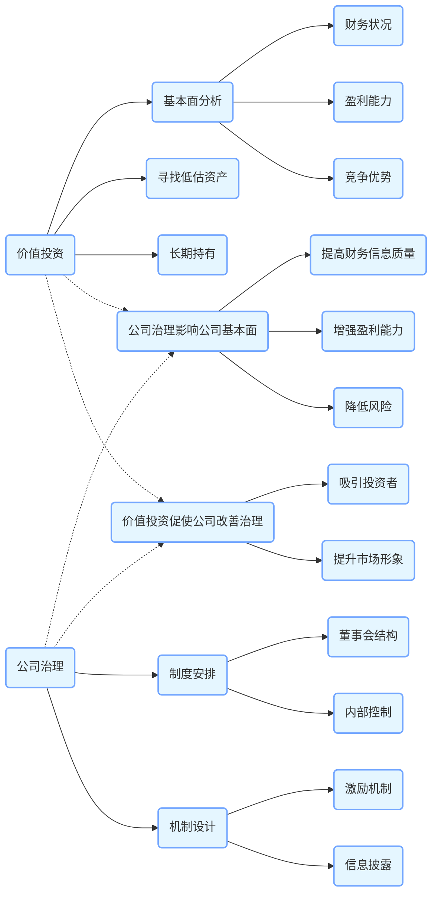

# 价值投资与公司治理的关系

> 关键词：价值投资、公司治理、财务指标、股东权益、市场效率

> 摘要：本文深入探讨了价值投资与公司治理之间的紧密关系。首先介绍了价值投资和公司治理的背景知识，包括目的、预期读者等。接着阐述了两者的核心概念及联系，通过详细的文本示意图和 Mermaid 流程图展示其架构。深入分析了相关核心算法原理，并用 Python 代码进行说明，同时给出了数学模型和公式。通过项目实战案例，具体展示了如何在实际中运用相关理论和方法。探讨了价值投资与公司治理在不同场景下的实际应用，推荐了学习资源、开发工具框架以及相关论文著作。最后总结了未来发展趋势与挑战，并对常见问题进行了解答，为投资者和企业管理者提供了全面且深入的参考。

## 1. 背景介绍 
### 1.1 目的和范围
本文章的主要目的是深入剖析价值投资与公司治理之间的内在联系，揭示公司治理质量对价值投资决策的影响，以及价值投资理念如何推动公司改善治理结构。范围涵盖了价值投资和公司治理的基本概念、核心理论、分析方法、实际应用案例等方面，旨在为投资者、企业管理者和相关研究人员提供全面而深入的理解。

### 1.2 预期读者
预期读者包括专业投资者、金融分析师、企业管理人员、学术研究人员以及对价值投资和公司治理感兴趣的普通读者。专业投资者可以从中获取更深入的投资分析视角和决策依据；企业管理人员可以了解如何通过优化公司治理来提升企业价值和吸引投资者；学术研究人员可以获得相关领域的研究思路和理论支持；普通读者则可以借此初步了解价值投资和公司治理的基本概念和重要性。

### 1.3 文档结构概述
本文将按照以下结构展开：首先介绍价值投资和公司治理的核心概念及其相互联系，通过文本示意图和 Mermaid 流程图进行清晰展示；接着阐述核心算法原理，用 Python 代码详细说明分析过程；给出相关的数学模型和公式，并结合具体例子进行讲解；通过项目实战案例，详细介绍开发环境搭建、源代码实现和代码解读；探讨价值投资与公司治理在不同实际场景中的应用；推荐学习资源、开发工具框架和相关论文著作；最后总结未来发展趋势与挑战，解答常见问题，并提供扩展阅读和参考资料。

### 1.4 术语表
#### 1.4.1 核心术语定义
- **价值投资**：一种投资策略，投资者通过分析公司的基本面，如财务状况、盈利能力、竞争优势等，寻找被市场低估的股票，并长期持有，以获得超过市场平均水平的回报。
- **公司治理**：一套用于管理和控制公司的制度、机制和流程，旨在确保公司的决策符合股东和其他利益相关者的利益，提高公司的运营效率和透明度。
- **股东权益**：公司股东对公司资产和利润的所有权，包括股本、资本公积、盈余公积和未分配利润等。
- **财务指标**：用于衡量公司财务状况和经营绩效的一系列数据，如净利润、净资产收益率、资产负债率等。

#### 1.4.2 相关概念解释
- **信息不对称**：在市场交易中，买卖双方对交易信息的掌握程度不同，导致一方在交易中处于优势地位，另一方处于劣势地位。在价值投资和公司治理中，信息不对称可能导致投资者难以准确评估公司的真实价值，影响投资决策。
- **委托 - 代理问题**：公司所有者（股东）委托管理层经营公司，但管理层可能为了自身利益而牺牲股东利益，从而产生委托 - 代理问题。有效的公司治理可以通过建立监督和激励机制来缓解这一问题。

#### 1.4.3 缩略词列表
- **ROE**：净资产收益率（Return on Equity），衡量公司盈利能力的重要指标，计算公式为净利润与净资产的比率。
- **PE**：市盈率（Price - Earnings Ratio），股票价格与每股收益的比率，反映了市场对公司未来盈利的预期。
- **PB**：市净率（Price - to - Book Ratio），股票价格与每股净资产的比率，用于评估公司的估值水平。

## 2. 核心概念与联系 

### 价值投资的核心概念
价值投资的核心在于寻找被市场低估的资产。投资者通过对公司的财务报表、行业前景、竞争优势等进行深入分析，评估公司的内在价值。当股票价格低于其内在价值时，投资者认为该股票具有投资价值，从而买入并长期持有，等待市场发现其真实价值，实现资产的增值。

### 公司治理的核心概念
公司治理是指通过一系列的制度安排和机制设计，确保公司的决策和运营符合股东和其他利益相关者的利益。良好的公司治理包括健全的董事会结构、有效的内部控制、合理的激励机制、透明的信息披露等方面。它能够提高公司的运营效率，降低代理成本，增强投资者的信心。

### 价值投资与公司治理的联系
价值投资依赖于准确的公司基本面分析，而公司治理的质量直接影响着公司的基本面。良好的公司治理能够保证公司财务信息的真实性和可靠性，提高公司的盈利能力和抗风险能力，从而提升公司的内在价值。对于价值投资者来说，公司治理是评估公司投资价值的重要因素之一。反之，价值投资理念的传播和实践也会促使公司重视自身的治理结构，通过改善治理来吸引更多的投资者，提升公司的市场形象和价值。

### 文本示意图
```plaintext
价值投资
|--基本面分析
|   |--财务状况
|   |--盈利能力
|   |--竞争优势
|--寻找低估资产
|--长期持有

公司治理
|--制度安排
|   |--董事会结构
|   |--内部控制
|--机制设计
|   |--激励机制
|   |--信息披露

价值投资与公司治理的联系
|--公司治理影响公司基本面
|   |--提高财务信息质量
|   |--增强盈利能力
|   |--降低风险
|--价值投资促使公司改善治理
|   |--吸引投资者
|   |--提升市场形象
```

### Mermaid 流程图


## 3. 核心算法原理 & 具体操作步骤 

### 价值投资中的财务指标分析算法
在价值投资中，常用的财务指标分析算法可以帮助投资者评估公司的价值。以下是一些核心指标的计算方法和 Python 代码实现。

#### 净资产收益率（ROE）
ROE 是衡量公司盈利能力的重要指标，计算公式为：
$$ROE = \frac{净利润}{净资产} \times 100\%$$

Python 代码实现：
```python
def calculate_roe(net_income, net_assets):
    """
    计算净资产收益率
    :param net_income: 净利润
    :param net_assets: 净资产
    :return: 净资产收益率
    """
    if net_assets == 0:
        return 0
    return (net_income / net_assets) * 100

# 示例数据
net_income = 1000000
net_assets = 5000000
roe = calculate_roe(net_income, net_assets)
print(f"净资产收益率: {roe:.2f}%")
```

#### 市盈率（PE）
PE 反映了市场对公司未来盈利的预期，计算公式为：
$$PE = \frac{股票价格}{每股收益}$$

Python 代码实现：
```python
def calculate_pe(stock_price, earnings_per_share):
    """
    计算市盈率
    :param stock_price: 股票价格
    :param earnings_per_share: 每股收益
    :return: 市盈率
    """
    if earnings_per_share == 0:
        return 0
    return stock_price / earnings_per_share

# 示例数据
stock_price = 50
earnings_per_share = 2
pe = calculate_pe(stock_price, earnings_per_share)
print(f"市盈率: {pe:.2f}")
```

#### 市净率（PB）
PB 用于评估公司的估值水平，计算公式为：
$$PB = \frac{股票价格}{每股净资产}$$

Python 代码实现：
```python
def calculate_pb(stock_price, book_value_per_share):
    """
    计算市净率
    :param stock_price: 股票价格
    :param book_value_per_share: 每股净资产
    :return: 市净率
    """
    if book_value_per_share == 0:
        return 0
    return stock_price / book_value_per_share

# 示例数据
stock_price = 50
book_value_per_share = 10
pb = calculate_pb(stock_price, book_value_per_share)
print(f"市净率: {pb:.2f}")
```

### 具体操作步骤
1. **数据收集**：收集公司的财务报表数据，包括净利润、净资产、每股收益、每股净资产等，以及股票价格数据。
2. **指标计算**：使用上述算法计算 ROE、PE、PB 等财务指标。
3. **指标分析**：将计算得到的指标与同行业其他公司进行比较，评估公司的盈利能力、估值水平等。如果 ROE 较高，说明公司盈利能力较强；如果 PE 和 PB 较低，说明公司可能被市场低估。
4. **综合评估**：结合公司的行业前景、竞争优势、公司治理等因素，对公司的投资价值进行综合评估，做出投资决策。

## 4. 数学模型和公式 & 详细讲解 & 举例说明 

### 自由现金流折现模型（DCF）
自由现金流折现模型是价值投资中常用的一种估值模型，它通过预测公司未来的自由现金流，并将其折现到当前时刻，来计算公司的内在价值。

#### 数学公式
$$V = \sum_{t=1}^{n} \frac{FCF_t}{(1 + r)^t} + \frac{TV}{(1 + r)^n}$$
其中：
- $V$ 表示公司的内在价值
- $FCF_t$ 表示第 $t$ 年的自由现金流
- $r$ 表示折现率
- $n$ 表示预测期数
- $TV$ 表示终值

#### 详细讲解
- **自由现金流（FCF）**：是指公司在满足了所有运营和投资需求后剩余的现金流量，它反映了公司实际可用于分配给股东或进行再投资的现金数量。
- **折现率（r）**：反映了投资者对投资回报的要求，通常可以使用资本资产定价模型（CAPM）来计算。
- **终值（TV）**：是指预测期结束后公司的价值，通常可以使用永续增长模型来计算：
$$TV = \frac{FCF_{n+1}}{r - g}$$
其中 $FCF_{n+1}$ 是预测期结束后下一年的自由现金流，$g$ 是永续增长率。

#### 举例说明
假设一家公司未来 5 年的自由现金流分别为 100 万元、120 万元、140 万元、160 万元、180 万元，折现率为 10%，预测期结束后自由现金流的永续增长率为 3%。

首先计算终值：
$FCF_{6} = 180 \times (1 + 3\%) = 185.4$（万元）
$TV = \frac{185.4}{10\% - 3\%} \approx 2648.57$（万元）

然后计算公司的内在价值：
$$V = \frac{100}{(1 + 10\%)^1} + \frac{120}{(1 + 10\%)^2} + \frac{140}{(1 + 10\%)^3} + \frac{160}{(1 + 10\%)^4} + \frac{180}{(1 + 10\%)^5} + \frac{2648.57}{(1 + 10\%)^5}$$
```python
import math

# 自由现金流
fcf = [100, 120, 140, 160, 180]
# 折现率
r = 0.1
# 永续增长率
g = 0.03
# 预测期数
n = 5

# 计算终值
fcf_6 = fcf[-1] * (1 + g)
tv = fcf_6 / (r - g)

# 计算内在价值
v = 0
for i in range(n):
    v += fcf[i] / math.pow(1 + r, i + 1)
v += tv / math.pow(1 + r, n)

print(f"公司的内在价值: {v:.2f} 万元")
```
通过上述计算，我们可以得到该公司的内在价值，将其与当前的市场价格进行比较，如果内在价值高于市场价格，则说明该公司可能被低估，具有投资价值。

## 5. 项目实战：代码实际案例和详细解释说明 

### 5.1  开发环境搭建
#### 操作系统
可以选择 Windows、Linux 或 macOS 操作系统，本项目推荐使用 Python 进行开发，因此需要确保操作系统上已经安装了 Python 环境，建议使用 Python 3.7 及以上版本。

#### 安装 Python
可以从 Python 官方网站（https://www.python.org/downloads/） 下载适合自己操作系统的 Python 安装包，按照安装向导进行安装。安装完成后，可以在命令行中输入 `python --version` 来验证 Python 是否安装成功。

#### 安装必要的库
本项目需要使用一些 Python 库来进行数据处理和分析，如 `pandas`、`numpy` 等。可以使用 `pip` 命令来安装这些库：
```sh
pip install pandas numpy
```

### 5.2  源代码详细实现和代码解读
以下是一个简单的项目实战案例，通过分析公司的财务数据，计算 ROE、PE、PB 等指标，并根据这些指标筛选出具有投资价值的公司。

```python
import pandas as pd

# 假设我们有一个包含公司财务数据的 CSV 文件
# 文件包含列：'公司名称', '净利润', '净资产', '每股收益', '每股净资产', '股票价格'
file_path = 'company_financial_data.csv'
df = pd.read_csv(file_path)

# 计算 ROE
df['ROE'] = (df['净利润'] / df['净资产']) * 100

# 计算 PE
df['PE'] = df['股票价格'] / df['每股收益']

# 计算 PB
df['PB'] = df['股票价格'] / df['每股净资产']

# 筛选出 ROE 大于 15%，PE 小于 20，PB 小于 2 的公司
selected_companies = df[(df['ROE'] > 15) & (df['PE'] < 20) & (df['PB'] < 2)]

# 输出筛选结果
print(selected_companies[['公司名称', 'ROE', 'PE', 'PB']])
```

### 5.3  代码解读与分析
1. **数据读取**：使用 `pandas` 库的 `read_csv` 函数读取包含公司财务数据的 CSV 文件，并将其存储在 `DataFrame` 对象 `df` 中。
2. **指标计算**：使用 `DataFrame` 的列操作，分别计算 ROE、PE、PB 等指标，并将结果添加到 `df` 中。
3. **筛选条件**：使用布尔索引筛选出 ROE 大于 15%，PE 小于 20，PB 小于 2 的公司，将筛选结果存储在 `selected_companies` 中。
4. **结果输出**：打印筛选出的公司的名称、ROE、PE、PB 等信息。

通过这个案例，我们可以看到如何使用 Python 和 `pandas` 库对公司的财务数据进行分析和筛选，为价值投资决策提供参考。

## 6. 实际应用场景 
### 投资者决策
对于投资者来说，价值投资与公司治理的关系至关重要。在进行投资决策时，投资者可以通过分析公司的治理结构，评估公司的决策机制是否科学合理、管理层是否诚信尽责、信息披露是否透明等。良好的公司治理能够保证公司的财务信息真实可靠，降低投资风险。同时，结合价值投资的方法，通过分析公司的财务指标和内在价值，寻找被市场低估的优质公司进行投资。例如，巴菲特等价值投资大师在选择投资标的时，非常注重公司的治理质量和内在价值。

### 企业战略规划
对于企业来说，良好的公司治理能够提升企业的市场形象和竞争力，吸引更多的投资者。企业可以通过完善公司治理结构，建立健全的内部控制制度，加强信息披露，提高企业的透明度和公信力。同时，企业也可以借鉴价值投资的理念，关注自身的长期发展和内在价值的提升，制定合理的战略规划，优化资源配置，提高盈利能力。例如，一些企业通过引入战略投资者、实施股权激励等方式，改善公司治理结构，促进企业的发展。

### 监管机构监管
监管机构可以通过制定和完善相关法律法规，加强对公司治理的监管，规范企业的行为。同时，监管机构也可以引导投资者树立正确的投资理念，推广价值投资方法，提高市场的有效性和稳定性。例如，证券监管机构可以加强对上市公司信息披露的监管，要求上市公司及时、准确、完整地披露财务信息和重大事项，保护投资者的合法权益。

### 学术研究
在学术研究领域，价值投资与公司治理的关系是一个重要的研究课题。学者们可以通过实证研究和理论分析，深入探讨公司治理对企业价值的影响机制，以及价值投资策略的有效性。这些研究成果可以为投资者、企业管理者和监管机构提供理论支持和决策参考。

## 7. 工具和资源推荐
### 7.1 学习资源推荐
#### 7.1.1 书籍推荐
- 《聪明的投资者》（The Intelligent Investor）：本杰明·格雷厄姆（Benjamin Graham）著，被誉为价值投资的圣经，详细介绍了价值投资的理念和方法。
- 《巴菲特致股东的信：投资者和公司高管教程》（Letters to Shareholders of Berkshire Hathaway）：沃伦·巴菲特（Warren Buffett）著，通过巴菲特写给股东的信，展示了他的投资哲学和公司治理理念。
- 《公司治理》（Corporate Governance）：罗伯特·蒙克斯（Robert A. G. Monks）和内尔·米诺（Nell Minow）著，全面介绍了公司治理的理论和实践。

#### 7.1.2 在线课程
- Coursera 上的 “投资学原理”（Principles of Investing）课程，由知名教授授课，系统介绍了投资学的基本原理和方法，包括价值投资。
- edX 上的 “公司治理与社会责任”（Corporate Governance and Social Responsibility）课程，深入探讨了公司治理的相关问题和实践案例。

#### 7.1.3 技术博客和网站
- 雪球网（https://xueqiu.com/）：国内知名的投资社区，提供丰富的股票分析、投资策略和公司研究报告，投资者可以在这里交流和分享投资经验。
- Seeking Alpha（https://seekingalpha.com/）：国外知名的投资研究网站，提供专业的股票分析和投资建议，同时也有很多关于公司治理的研究文章。

### 7.2 开发工具框架推荐
#### 7.2.1 IDE和编辑器
- PyCharm：一款专业的 Python 集成开发环境，提供丰富的代码编辑、调试和分析功能，适合进行数据处理和分析项目的开发。
- Jupyter Notebook：一种交互式的开发环境，支持 Python 代码的编写、运行和可视化展示，非常适合进行数据分析和模型验证。

#### 7.2.2 调试和性能分析工具
- pdb：Python 自带的调试工具，可以帮助开发者在代码中设置断点，逐步执行代码，查找和解决问题。
- cProfile：Python 的性能分析工具，可以统计代码的运行时间和函数调用次数，帮助开发者优化代码性能。

#### 7.2.3 相关框架和库
- pandas：一个强大的数据处理和分析库，提供了丰富的数据结构和函数，方便进行数据清洗、转换和分析。
- numpy：用于科学计算的基础库，提供了高效的多维数组对象和数学函数，支持大规模数据的处理和计算。

### 7.3 相关论文著作推荐
#### 7.3.1 经典论文
- Jensen, M. C., & Meckling, W. H. (1976). Theory of the firm: Managerial behavior, agency costs and ownership structure. Journal of Financial Economics, 3(4), 305 - 360. 该论文提出了委托 - 代理理论，对公司治理领域产生了深远影响。
- Fama, E. F., & French, K. R. (1992). The cross - section of expected stock returns. Journal of Finance, 47(2), 427 - 465. 这篇论文提出了著名的 Fama - French 三因子模型，为价值投资提供了理论支持。

#### 7.3.2 最新研究成果
可以通过学术数据库如 IEEE Xplore、ACM Digital Library、SSRN 等查找关于价值投资和公司治理的最新研究论文，了解该领域的前沿动态和研究趋势。

#### 7.3.3 应用案例分析
- 哈佛商业评论（Harvard Business Review）上经常发表一些关于公司治理和价值投资的实际案例分析文章，通过这些案例可以学习到不同企业在实践中的经验和教训。

## 8. 总结：未来发展趋势与挑战
### 未来发展趋势
- **数字化转型**：随着信息技术的快速发展，公司治理和价值投资将越来越多地借助数字化手段。例如，利用大数据和人工智能技术进行财务数据分析和风险评估，提高投资决策的准确性和效率。
- **可持续投资**：投资者越来越关注企业的社会责任和可持续发展能力，未来价值投资将更加注重企业的环境、社会和治理（ESG）因素。良好的 ESG 表现不仅可以提升企业的社会形象，还可以降低企业的长期风险，为投资者带来更好的回报。
- **全球一体化**：随着全球经济的一体化，投资者的投资范围将更加广泛，价值投资和公司治理的理念也将在全球范围内得到更广泛的传播和应用。不同国家和地区的企业将面临更加激烈的竞争，需要不断优化公司治理结构，提升企业的竞争力。

### 挑战
- **信息过载**：在数字化时代，投资者面临着海量的信息，如何从这些信息中筛选出有价值的信息，进行准确的分析和判断，是一个巨大的挑战。
- **市场不确定性**：全球经济和政治环境的不确定性增加，市场波动加剧，这给价值投资带来了更大的风险。投资者需要更加谨慎地评估市场风险，制定合理的投资策略。
- **公司治理的复杂性**：随着企业规模的扩大和业务的多元化，公司治理的结构和机制变得越来越复杂。如何建立有效的公司治理体系，确保公司的决策符合股东和其他利益相关者的利益，是企业面临的一个重要挑战。

## 9. 附录：常见问题与解答
### 价值投资一定能获得高回报吗？
价值投资并不保证一定能获得高回报。价值投资是一种基于基本面分析的投资策略，通过寻找被市场低估的股票来获取长期收益。但是，市场是复杂多变的，股票价格受到多种因素的影响，包括宏观经济环境、行业竞争、公司自身经营状况等。即使一家公司具有良好的基本面和内在价值，其股票价格也可能在短期内不涨反跌。因此，价值投资需要投资者具备耐心和长期投资的理念。

### 如何评估公司治理的质量？
可以从以下几个方面评估公司治理的质量：
- **董事会结构**：董事会的独立性、专业性和多元化程度是评估董事会结构的重要指标。独立的董事会能够更好地监督管理层的行为，保护股东的利益。
- **内部控制**：健全的内部控制制度可以确保公司的财务信息真实可靠，防范内部舞弊和风险。可以通过审计报告、内部控制评价报告等了解公司的内部控制情况。
- **信息披露**：透明的信息披露是公司治理的重要组成部分。公司应该及时、准确、完整地披露财务信息和重大事项，让投资者能够充分了解公司的经营状况和发展前景。
- **激励机制**：合理的激励机制可以促使管理层和员工为实现公司的目标而努力工作。可以关注公司的薪酬政策、股权激励计划等。

### 公司治理对企业的短期业绩有影响吗？
公司治理对企业的短期业绩可能会有一定的影响。良好的公司治理可以提高公司的决策效率和运营管理水平，减少内部矛盾和冲突，从而对企业的短期业绩产生积极影响。例如，健全的内部控制制度可以降低企业的运营风险，提高资金使用效率；合理的激励机制可以激发员工的工作积极性，提高工作效率。但是，公司治理对企业业绩的影响是一个长期的过程，不能仅仅从短期业绩来评估公司治理的效果。

## 10. 扩展阅读 & 参考资料
### 扩展阅读
- 《证券分析》（Security Analysis）：本杰明·格雷厄姆和戴维·多德（David Dodd）著，是价值投资领域的经典著作，深入介绍了证券分析的方法和技巧。
- 《从优秀到卓越》（Good to Great）：吉姆·柯林斯（Jim Collins）著，研究了一些从优秀企业成长为卓越企业的案例，探讨了企业实现卓越的关键因素，包括公司治理和战略规划等方面。

### 参考资料
- 中国证券监督管理委员会官方网站（https://www.csrc.gov.cn/）：提供了大量关于证券市场监管、上市公司信息披露等方面的政策法规和数据资料。
- 上海证券交易所和深圳证券交易所官方网站：提供了上市公司的财务报告、公告等信息，是投资者进行基本面分析的重要数据来源。

作者：AI天才研究院/AI Genius Institute & 禅与计算机程序设计艺术 /Zen And The Art of Computer Programming