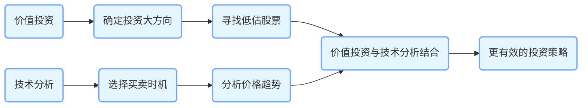

# 价值投资与技术分析的结合

> 关键词：价值投资、技术分析、投资策略、市场分析、投资决策

> 摘要：本文旨在探讨价值投资与技术分析相结合的投资方法。首先介绍了价值投资和技术分析的背景知识，包括其目的、适用读者和文档结构。详细阐述了价值投资和技术分析的核心概念及二者之间的联系，并通过文本示意图和 Mermaid 流程图进行展示。接着讲解了相关的核心算法原理，用 Python 代码进行详细说明，同时给出了数学模型和公式并举例分析。通过项目实战，展示了如何在实际中结合价值投资与技术分析进行投资决策，包括开发环境搭建、源代码实现及解读。还介绍了这种结合方法在实际中的应用场景，推荐了学习资源、开发工具框架以及相关论文著作。最后总结了未来发展趋势与挑战，并对常见问题进行解答，提供了扩展阅读和参考资料。

## 1. 背景介绍 
### 1.1 目的和范围
价值投资和技术分析是金融投资领域中两种重要的投资方法。价值投资侧重于对公司基本面的分析，寻找被低估的股票并长期持有；技术分析则主要通过研究股票价格和交易量的历史数据，预测股票未来的价格走势。本文章的目的是探讨如何将这两种方法结合起来，形成一种更为有效的投资策略。范围涵盖了价值投资和技术分析的基本概念、原理、算法，以及如何在实际投资项目中应用这种结合策略。

### 1.2 预期读者
本文预期读者包括对金融投资有兴趣的初学者、有一定投资经验但希望优化投资策略的投资者、金融专业的学生以及从事金融研究和投资咨询的专业人士。

### 1.3 文档结构概述
本文首先介绍价值投资和技术分析的核心概念以及它们之间的联系，通过示意图和流程图进行直观展示。接着讲解核心算法原理，用 Python 代码详细说明操作步骤。给出相关的数学模型和公式，并举例分析。通过项目实战展示如何在实际中应用这种结合策略，包括开发环境搭建、源代码实现和解读。介绍这种结合方法在实际中的应用场景，推荐学习资源、开发工具框架和相关论文著作。最后总结未来发展趋势与挑战，解答常见问题，并提供扩展阅读和参考资料。

### 1.4 术语表
#### 1.4.1 核心术语定义
- **价值投资**：一种投资策略，基于对公司内在价值的评估，寻找市场价格低于其内在价值的股票进行投资，通常着眼于长期投资。
- **技术分析**：通过研究市场交易数据，如价格和交易量，来预测未来价格走势的分析方法。
- **内在价值**：公司在其生命周期内所产生的现金流的现值，是价值投资中评估股票是否被低估的重要指标。
- **移动平均线**：一种技术分析工具，用于平滑价格数据，显示价格的长期趋势。

#### 1.4.2 相关概念解释
- **基本面分析**：价值投资的主要分析方法，通过研究公司的财务报表、行业前景、管理团队等因素，评估公司的内在价值。
- **图表形态**：技术分析中通过观察价格图表上的特定形态，如头肩顶、双底等，来预测价格走势。
- **相对强弱指数（RSI）**：一种技术指标，用于衡量股票价格变动的速度和幅度，判断股票是否处于超买或超卖状态。

#### 1.4.3 缩略词列表
- **PE**：市盈率（Price-to-Earnings Ratio），衡量股票价格相对公司盈利的指标。
- **PB**：市净率（Price-to-Book Ratio），衡量股票价格相对公司净资产的指标。
- **MACD**：指数平滑异同移动平均线（Moving Average Convergence Divergence），一种常用的技术分析指标。

## 2. 核心概念与联系 
### 价值投资核心概念
价值投资的核心是寻找被市场低估的股票。其理论基础是股票价格会围绕其内在价值波动，当股票价格低于内在价值时，就存在投资机会。价值投资者通过对公司的财务报表进行分析，评估公司的盈利能力、资产质量、现金流状况等因素，来确定公司的内在价值。例如，通过计算市盈率（PE）、市净率（PB）等指标，与同行业其他公司进行比较，判断股票是否被低估。

### 技术分析核心概念
技术分析主要基于市场行为涵盖一切信息、价格沿趋势移动、历史会重演这三大假设。技术分析师通过研究股票价格和交易量的历史数据，绘制各种图表，如 K 线图、折线图等，寻找价格走势的规律和趋势。常用的技术分析工具包括移动平均线、相对强弱指数（RSI）、指数平滑异同移动平均线（MACD）等。例如，当短期移动平均线向上穿过长期移动平均线时，被视为买入信号；当 RSI 指标超过 70 时，表明股票处于超买状态，可能会出现回调。

### 价值投资与技术分析的联系
价值投资和技术分析并不是相互排斥的，而是可以相互补充的。价值投资可以帮助投资者确定投资的大方向，找到具有投资价值的股票；技术分析则可以帮助投资者选择合适的买入和卖出时机。例如，价值投资者通过基本面分析确定了某只股票具有投资价值，但不知道何时买入，这时可以借助技术分析的方法，寻找合适的买入信号。同样，技术分析可以发现股票价格的短期波动趋势，但无法判断股票的长期投资价值，这时可以结合价值投资的方法，评估股票的内在价值，避免陷入短期的价格波动陷阱。

### 文本示意图
```plaintext
价值投资 <-- 确定投资大方向，寻找低估股票 --> 基本面分析
技术分析 <-- 选择买卖时机，分析价格趋势 --> 价格和交易量分析
价值投资与技术分析结合 <-- 优势互补 --> 更有效的投资策略
```

### Mermaid 流程图


## 3. 核心算法原理 & 具体操作步骤 
### 移动平均线算法原理
移动平均线（MA）是一种常用的技术分析工具，它通过计算一定时期内股票价格的平均值，来平滑价格数据，显示价格的长期趋势。常见的移动平均线有简单移动平均线（SMA）和指数移动平均线（EMA）。

#### 简单移动平均线（SMA）
简单移动平均线的计算公式为：
$$SMA_n = \frac{\sum_{i=0}^{n-1} P_{t-i}}{n}$$
其中，$SMA_n$ 表示 $n$ 期的简单移动平均线，$P_{t-i}$ 表示第 $t-i$ 期的股票价格，$n$ 表示计算移动平均线的期数。

#### 指数移动平均线（EMA）
指数移动平均线的计算公式为：
$$EMA_t = \alpha \times P_t + (1 - \alpha) \times EMA_{t-1}$$
其中，$EMA_t$ 表示第 $t$ 期的指数移动平均线，$P_t$ 表示第 $t$ 期的股票价格，$\alpha$ 是平滑系数，通常取值为 $\frac{2}{n + 1}$，$n$ 表示计算移动平均线的期数。

### Python 代码实现
```python
import pandas as pd

def simple_moving_average(prices, n):
    """
    计算简单移动平均线
    :param prices: 股票价格序列
    :param n: 计算移动平均线的期数
    :return: 简单移动平均线序列
    """
    return prices.rolling(window=n).mean()

def exponential_moving_average(prices, n):
    """
    计算指数移动平均线
    :param prices: 股票价格序列
    :param n: 计算移动平均线的期数
    :return: 指数移动平均线序列
    """
    return prices.ewm(span=n, adjust=False).mean()

# 示例数据
data = {
    'date': pd.date_range(start='2023-01-01', periods=10),
    'price': [100, 102, 105, 103, 106, 108, 110, 109, 112, 115]
}
df = pd.DataFrame(data)

# 计算 5 期简单移动平均线和指数移动平均线
df['SMA_5'] = simple_moving_average(df['price'], 5)
df['EMA_5'] = exponential_moving_average(df['price'], 5)

print(df)
```
### 具体操作步骤
1. 收集股票价格数据，可以从金融数据提供商获取。
2. 将股票价格数据存储在 Pandas 的 DataFrame 中。
3. 调用 `simple_moving_average` 函数和 `exponential_moving_average` 函数，计算不同期数的简单移动平均线和指数移动平均线。
4. 分析移动平均线的走势，当短期移动平均线向上穿过长期移动平均线时，发出买入信号；当短期移动平均线向下穿过长期移动平均线时，发出卖出信号。

## 4. 数学模型和公式 & 详细讲解 & 举例说明 
### 市盈率（PE）模型
市盈率（PE）是价值投资中常用的指标之一，它反映了市场对公司盈利的预期。市盈率的计算公式为：
$$PE = \frac{P}{E}$$
其中，$P$ 表示股票的市场价格，$E$ 表示公司的每股收益（EPS）。

#### 详细讲解
市盈率越高，说明市场对公司的未来盈利预期越高，但也可能意味着股票被高估；市盈率越低，说明市场对公司的未来盈利预期较低，但也可能意味着股票被低估。不同行业的市盈率水平可能会有所不同，因此在使用市盈率进行分析时，需要与同行业的其他公司进行比较。

#### 举例说明
假设某公司的股票价格为 $50$ 元，每股收益为 $5$ 元，则该公司的市盈率为：
$$PE = \frac{50}{5} = 10$$
如果同行业其他公司的平均市盈率为 $15$，则该公司的股票可能被低估，具有一定的投资价值。

### 相对强弱指数（RSI）模型
相对强弱指数（RSI）是一种技术分析指标，用于衡量股票价格变动的速度和幅度，判断股票是否处于超买或超卖状态。RSI 的计算公式为：
$$RSI = 100 - \frac{100}{1 + RS}$$
其中，$RS$ 表示相对强度，计算公式为：
$$RS = \frac{\text{平均上涨幅度}}{\text{平均下跌幅度}}$$

#### 详细讲解
RSI 的取值范围在 $0$ 到 $100$ 之间。当 RSI 超过 $70$ 时，表明股票处于超买状态，可能会出现回调；当 RSI 低于 $30$ 时，表明股票处于超卖状态，可能会出现反弹。

#### 举例说明
假设某股票在过去 $14$ 个交易日中，平均上涨幅度为 $2$ 元，平均下跌幅度为 $1$ 元，则相对强度为：
$$RS = \frac{2}{1} = 2$$
相对强弱指数为：
$$RSI = 100 - \frac{100}{1 + 2} \approx 66.67$$
由于 $RSI$ 接近 $70$，说明该股票处于超买状态，投资者需要谨慎操作。

## 5. 项目实战：代码实际案例和详细解释说明 
### 5.1  开发环境搭建
#### 安装 Python
首先需要安装 Python 环境，建议使用 Python 3.7 及以上版本。可以从 Python 官方网站（https://www.python.org/downloads/）下载安装包，按照安装向导进行安装。

#### 安装必要的库
在项目中需要使用到一些 Python 库，如 Pandas、Numpy、Matplotlib 等。可以使用 pip 命令进行安装：
```sh
pip install pandas numpy matplotlib yfinance
```
其中，`yfinance` 库用于获取股票价格数据。

### 5.2  源代码详细实现和代码解读
```python
import yfinance as yf
import pandas as pd
import matplotlib.pyplot as plt

# 下载股票数据
ticker = 'AAPL'  # 苹果公司股票代码
start_date = '2023-01-01'
end_date = '2023-12-31'
data = yf.download(ticker, start=start_date, end=end_date)

# 计算 5 期和 20 期简单移动平均线
data['SMA_5'] = data['Close'].rolling(window=5).mean()
data['SMA_20'] = data['Close'].rolling(window=20).mean()

# 生成买卖信号
data['signal'] = 0
data.loc[data['SMA_5'] > data['SMA_20'], 'signal'] = 1  # 买入信号
data.loc[data['SMA_5'] < data['SMA_20'], 'signal'] = -1  # 卖出信号

# 计算持仓状态
data['position'] = data['signal'].diff()

# 绘制股票价格和移动平均线图表
plt.figure(figsize=(12, 6))
plt.plot(data['Close'], label='Close Price')
plt.plot(data['SMA_5'], label='SMA 5')
plt.plot(data['SMA_20'], label='SMA 20')

# 绘制买入和卖出信号
plt.plot(data[data['position'] == 1].index, data['SMA_5'][data['position'] == 1], '^', markersize=10, color='g', label='Buy Signal')
plt.plot(data[data['position'] == -1].index, data['SMA_5'][data['position'] == -1], 'v', markersize=10, color='r', label='Sell Signal')

plt.title('AAPL Stock Price with SMA Signals')
plt.xlabel('Date')
plt.ylabel('Price')
plt.legend()
plt.show()
```
### 代码解读与分析
1. **下载股票数据**：使用 `yfinance` 库下载苹果公司（股票代码：AAPL）在 2023 年 1 月 1 日至 2023 年 12 月 31 日期间的股票价格数据。
2. **计算移动平均线**：使用 Pandas 的 `rolling` 方法计算 5 期和 20 期的简单移动平均线。
3. **生成买卖信号**：当 5 期移动平均线大于 20 期移动平均线时，生成买入信号（信号值为 1）；当 5 期移动平均线小于 20 期移动平均线时，生成卖出信号（信号值为 -1）。
4. **计算持仓状态**：通过计算信号值的差值，得到持仓状态的变化。当持仓状态从 0 变为 1 时，表示买入；当持仓状态从 1 变为 0 时，表示卖出。
5. **绘制图表**：使用 Matplotlib 库绘制股票价格、移动平均线以及买入和卖出信号的图表，直观展示投资策略的执行情况。

## 6. 实际应用场景 
### 个人投资者
对于个人投资者来说，将价值投资与技术分析相结合可以帮助他们做出更明智的投资决策。个人投资者可以先通过价值投资的方法，筛选出具有投资价值的股票，然后使用技术分析的方法，选择合适的买入和卖出时机。例如，个人投资者可以关注一些基本面良好、市盈率较低的股票，然后等待这些股票出现技术分析中的买入信号时再进行买入操作。

### 机构投资者
机构投资者通常管理着大量的资金，需要更加谨慎地进行投资决策。价值投资与技术分析的结合可以帮助机构投资者更好地控制风险，提高投资收益。机构投资者可以通过深入的基本面分析，构建投资组合，然后使用技术分析的方法，对投资组合进行动态调整。例如，机构投资者可以根据市场行情的变化，及时调整投资组合中不同股票的权重，以实现资产的优化配置。

### 量化投资
在量化投资领域，价值投资与技术分析的结合可以通过编写算法来实现自动化交易。量化投资者可以将价值投资和技术分析的指标和策略转化为代码，利用计算机程序自动进行股票的筛选、买入和卖出操作。例如，量化投资者可以编写一个算法，根据市盈率、市净率等价值投资指标筛选出一批股票，然后根据移动平均线、相对强弱指数等技术分析指标，生成买卖信号，实现自动化交易。

## 7. 工具和资源推荐
### 7.1 学习资源推荐
#### 7.1.1 书籍推荐
- 《聪明的投资者》（The Intelligent Investor）：作者本杰明·格雷厄姆（Benjamin Graham），被誉为价值投资的圣经，介绍了价值投资的基本理念和方法。
- 《金融炼金术》（The Alchemy of Finance）：作者乔治·索罗斯（George Soros），书中阐述了索罗斯的投资哲学和操作方法，包括对市场趋势的分析和判断。
- 《期货市场技术分析》（Technical Analysis of the Financial Markets）：作者约翰·墨菲（John J. Murphy），是技术分析领域的经典著作，详细介绍了各种技术分析工具和方法。

#### 7.1.2 在线课程
- Coursera 上的 “投资学原理”（Principles of Investing）课程：由知名高校教授授课，介绍了投资的基本概念、理论和方法，包括价值投资和技术分析。
- Udemy 上的 “股票技术分析实战课程”：通过实际案例讲解股票技术分析的方法和技巧，帮助学员掌握技术分析的实际应用。

#### 7.1.3 技术博客和网站
- 雪球（https://xueqiu.com/）：国内知名的投资社区，提供股票、基金等金融产品的行情数据、分析报告和投资者交流平台。
- 东方财富网（https://www.eastmoney.com/）：提供全面的金融信息和数据服务，包括股票行情、财经新闻、研究报告等。
- Investopedia（https://www.investopedia.com/）：全球知名的金融教育网站，提供丰富的金融知识和投资教程，包括价值投资和技术分析的相关内容。

### 7.2 开发工具框架推荐
#### 7.2.1 IDE和编辑器
- PyCharm：一款专业的 Python 集成开发环境，提供代码编辑、调试、版本控制等功能，适合开发复杂的 Python 程序。
- Jupyter Notebook：一种交互式的开发环境，支持 Python、R 等多种编程语言，适合进行数据分析和可视化。

#### 7.2.2 调试和性能分析工具
- pdb：Python 自带的调试工具，可以帮助开发者定位和解决代码中的问题。
- cProfile：Python 自带的性能分析工具，可以分析代码的运行时间和资源消耗情况，帮助开发者优化代码性能。

#### 7.2.3 相关框架和库
- Pandas：用于数据处理和分析的 Python 库，提供了高效的数据结构和数据操作方法，适合处理金融数据。
- Numpy：用于科学计算的 Python 库，提供了高效的数组操作和数学函数，是许多数据分析和机器学习库的基础。
- Matplotlib：用于数据可视化的 Python 库，可以绘制各种类型的图表，如折线图、柱状图、散点图等，帮助开发者直观展示数据。

### 7.3 相关论文著作推荐
#### 7.3.1 经典论文
- “The Capital Asset Pricing Model: Theory and Evidence”（资本资产定价模型：理论与证据）：由威廉·夏普（William Sharpe）等人撰写，介绍了资本资产定价模型（CAPM）的理论和实证研究。
- “Efficient Capital Markets: A Review of Theory and Empirical Work”（有效资本市场：理论与实证研究综述）：由尤金·法玛（Eugene F. Fama）撰写，对有效市场假说进行了系统的阐述和实证检验。

#### 7.3.2 最新研究成果
- 可以关注《Journal of Finance》（金融杂志）、《Review of Financial Studies》（金融研究评论）等国际知名金融学术期刊，获取价值投资和技术分析领域的最新研究成果。

#### 7.3.3 应用案例分析
- 《金融投资分析与决策案例》：书中包含了大量的金融投资案例，包括价值投资和技术分析的应用案例，通过实际案例分析，帮助读者更好地理解和应用投资方法。

## 8. 总结：未来发展趋势与挑战
### 未来发展趋势
- **智能化和自动化**：随着人工智能和机器学习技术的不断发展，价值投资与技术分析的结合将更加智能化和自动化。量化投资策略将更加复杂和精细，能够更好地适应市场的变化。
- **多维度数据融合**：除了传统的财务数据和交易数据，未来的投资分析将更多地融合社交媒体数据、宏观经济数据、行业数据等多维度数据，以更全面地评估股票的投资价值。
- **跨市场和跨资产投资**：投资者将更加注重跨市场和跨资产的投资组合管理，价值投资与技术分析的结合将在全球范围内得到更广泛的应用，以实现资产的多元化配置和风险分散。

### 挑战
- **数据质量和可靠性**：多维度数据的融合带来了数据量的大幅增加，但同时也面临数据质量和可靠性的挑战。不准确或不完整的数据可能会导致投资决策的失误。
- **市场不确定性**：金融市场具有高度的不确定性，价值投资和技术分析的方法并不能完全准确地预测市场走势。投资者需要不断调整投资策略，以适应市场的变化。
- **技术更新换代快**：人工智能和机器学习技术发展迅速，投资者需要不断学习和掌握新的技术和方法，以保持投资策略的有效性。

## 9. 附录：常见问题与解答
### 价值投资和技术分析哪个更重要？
价值投资和技术分析都有其重要性，不能简单地说哪个更重要。价值投资可以帮助投资者确定投资的大方向，找到具有投资价值的股票；技术分析则可以帮助投资者选择合适的买入和卖出时机。在实际投资中，将两者结合起来使用，可以发挥各自的优势，提高投资收益。

### 如何判断股票是否被低估？
可以通过计算市盈率（PE）、市净率（PB）等指标，与同行业其他公司进行比较，判断股票是否被低估。同时，还可以分析公司的财务报表、行业前景、管理团队等因素，综合评估公司的内在价值。

### 技术分析的指标很多，应该如何选择？
不同的技术分析指标适用于不同的市场情况和投资策略。投资者可以根据自己的投资目标和风险偏好，选择适合自己的技术分析指标。例如，短期投资者可以关注相对强弱指数（RSI）、随机指标（KDJ）等短期指标；长期投资者可以关注移动平均线、趋势线等长期指标。

### 价值投资和技术分析结合的策略一定能盈利吗？
价值投资和技术分析结合的策略并不能保证一定能盈利。金融市场具有高度的不确定性，投资决策受到多种因素的影响，包括宏观经济环境、政策变化、公司基本面变化等。投资者需要不断学习和实践，积累经验，根据市场情况及时调整投资策略。

## 10. 扩展阅读 & 参考资料
### 扩展阅读
- 《证券分析》（Security Analysis）：作者本杰明·格雷厄姆（Benjamin Graham）和大卫·多德（David Dodd），是价值投资领域的经典著作，深入阐述了价值投资的理论和方法。
- 《日本蜡烛图技术》（Japanese Candlestick Charting Techniques）：作者史蒂夫·尼森（Steve Nison），介绍了日本蜡烛图的基本原理和应用方法，是技术分析领域的重要著作。

### 参考资料
- 金融数据提供商：雅虎财经（https://finance.yahoo.com/）、东方财富网（https://www.eastmoney.com/）等，提供股票价格、财务报表等金融数据。
- 学术数据库：Web of Science、EBSCOhost 等，提供金融学术论文和研究报告。

作者：AI天才研究院/AI Genius Institute & 禅与计算机程序设计艺术 /Zen And The Art of Computer Programming