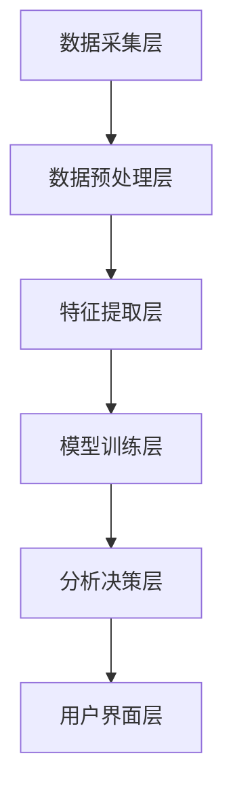

# 价值投资中的AI智能体品牌权益分析系统

> 关键词：价值投资、AI智能体、品牌权益分析、系统架构、算法原理

> 摘要：本文深入探讨了价值投资领域中AI智能体品牌权益分析系统的相关内容。首先介绍了该系统开发的背景，包括目的、预期读者等信息。接着详细阐述了核心概念、算法原理、数学模型，通过Python代码进行了原理说明。给出了项目实战案例，涵盖开发环境搭建、源代码实现与解读。分析了该系统的实际应用场景，并推荐了学习资源、开发工具以及相关论文著作。最后对系统未来发展趋势与挑战进行了总结，同时解答了常见问题并提供了扩展阅读与参考资料，旨在为价值投资中品牌权益分析提供全面的技术指导和理论支持。

## 1. 背景介绍 
### 1.1 目的和范围
在价值投资领域，品牌权益是一个至关重要的因素。品牌权益反映了品牌在市场中的影响力、声誉和消费者忠诚度等多方面的价值。传统的品牌权益分析方法往往依赖于人工调研和经验判断，存在效率低、主观性强等问题。本系统的目的是开发一个基于AI智能体的品牌权益分析系统，利用先进的人工智能技术，对品牌的多维度数据进行深入挖掘和分析，为价值投资者提供客观、准确、高效的品牌权益评估结果，辅助其做出更明智的投资决策。

本系统的范围涵盖了品牌相关数据的收集、预处理、特征提取、模型训练与评估以及最终的品牌权益分析报告生成等环节。系统将整合多种数据源，包括社交媒体数据、市场销售数据、消费者评价数据等，综合分析品牌在不同方面的表现。

### 1.2 预期读者
本系统的预期读者主要包括价值投资者、金融分析师、市场营销人员以及对人工智能在金融领域应用感兴趣的技术人员。价值投资者可以利用本系统的分析结果，筛选出具有高品牌权益的投资标的；金融分析师可以借助系统的功能，深入研究品牌对企业价值的影响；市场营销人员可以通过系统了解品牌在市场中的表现，制定更有效的品牌推广策略；技术人员则可以借鉴系统的架构和算法，开展相关的研究和开发工作。

### 1.3 文档结构概述
本文将按照以下结构进行组织：
1. 背景介绍：阐述系统开发的目的、范围、预期读者以及文档结构概述。
2. 核心概念与联系：介绍价值投资、AI智能体、品牌权益分析等核心概念，并说明它们之间的联系，同时给出系统架构的文本示意图和Mermaid流程图。
3. 核心算法原理 & 具体操作步骤：详细讲解系统中使用的核心算法原理，并用Python源代码进行阐述，同时给出具体的操作步骤。
4. 数学模型和公式 & 详细讲解 & 举例说明：介绍系统中涉及的数学模型和公式，并进行详细讲解，通过具体例子说明其应用。
5. 项目实战：代码实际案例和详细解释说明：给出系统开发的实际案例，包括开发环境搭建、源代码详细实现和代码解读。
6. 实际应用场景：分析系统在价值投资、品牌管理等方面的实际应用场景。
7. 工具和资源推荐：推荐学习资源、开发工具框架以及相关论文著作。
8. 总结：未来发展趋势与挑战：总结系统的发展现状，分析未来的发展趋势和面临的挑战。
9. 附录：常见问题与解答：解答读者在使用系统过程中可能遇到的常见问题。
10. 扩展阅读 & 参考资料：提供相关的扩展阅读材料和参考资料。

### 1.4 术语表
#### 1.4.1 核心术语定义
- **价值投资**：一种投资策略，强调通过对企业基本面的分析，寻找被低估的股票进行投资，以获取长期的投资回报。
- **AI智能体**：具有自主学习、推理和决策能力的人工智能程序，能够根据环境信息自主调整行为。
- **品牌权益**：品牌所拥有的能够为企业带来额外收益的资产，包括品牌知名度、品牌忠诚度、品牌形象等方面。
- **数据预处理**：对原始数据进行清洗、转换、归一化等操作，以提高数据质量，便于后续的分析和处理。
- **特征提取**：从原始数据中提取出能够反映品牌特征的关键信息，用于模型训练和分析。

#### 1.4.2 相关概念解释
- **机器学习**：人工智能的一个分支，通过让计算机从数据中学习模式和规律，从而实现预测和决策等任务。
- **深度学习**：一种基于人工神经网络的机器学习方法，能够自动从大量数据中学习复杂的特征和模式。
- **自然语言处理**：研究如何让计算机理解和处理人类语言的技术，在品牌权益分析中可用于处理社交媒体数据和消费者评价数据等。

#### 1.4.3 缩略词列表
- **AI**：Artificial Intelligence，人工智能
- **ML**：Machine Learning，机器学习
- **DL**：Deep Learning，深度学习
- **NLP**：Natural Language Processing，自然语言处理

## 2. 核心概念与联系 

### 核心概念原理
#### 价值投资
价值投资的核心原理是寻找被市场低估的资产，通过长期持有来获得资产价值回归所带来的收益。在品牌投资中，品牌权益是企业价值的重要组成部分。一个具有高品牌权益的企业往往具有更强的市场竞争力和盈利能力，其股票价格也更有可能在未来上涨。

#### AI智能体
AI智能体是一种能够感知环境、自主学习和决策的智能程序。在品牌权益分析系统中，AI智能体可以通过收集和分析大量的品牌相关数据，学习品牌权益的影响因素和变化规律，从而为投资者提供准确的品牌权益评估和投资建议。

#### 品牌权益分析
品牌权益分析是对品牌在市场中的价值进行评估的过程。它涉及到多个方面的因素，如品牌知名度、品牌忠诚度、品牌形象等。通过对这些因素的综合分析，可以全面了解品牌的市场地位和发展潜力。

### 架构的文本示意图
本系统的架构主要包括数据采集层、数据预处理层、特征提取层、模型训练层、分析决策层和用户界面层。
- 数据采集层：负责从各种数据源收集品牌相关的数据，如社交媒体平台、市场调研机构、企业财务报表等。
- 数据预处理层：对采集到的原始数据进行清洗、转换和归一化等操作，以提高数据质量。
- 特征提取层：从预处理后的数据中提取出能够反映品牌特征的关键信息，如品牌关键词频率、消费者情感倾向等。
- 模型训练层：使用机器学习和深度学习算法对提取的特征进行训练，建立品牌权益评估模型。
- 分析决策层：根据训练好的模型对品牌权益进行评估，并为投资者提供投资建议。
- 用户界面层：为用户提供友好的交互界面，方便用户查询和使用系统的分析结果。

### Mermaid流程图


## 3. 核心算法原理 & 具体操作步骤 

### 核心算法原理
本系统主要使用了以下几种核心算法：
#### 文本分类算法
在处理社交媒体数据和消费者评价数据时，需要对文本进行分类，如将评论分为正面、负面和中性三类。常用的文本分类算法有朴素贝叶斯算法、支持向量机算法和深度学习中的卷积神经网络（CNN）算法等。

以下是使用Python实现朴素贝叶斯算法进行文本分类的示例代码：
```python
from sklearn.feature_extraction.text import CountVectorizer
from sklearn.naive_bayes import MultinomialNB
from sklearn.model_selection import train_test_split
from sklearn.metrics import accuracy_score

# 示例数据
documents = ["This is a great product", "I don't like this service", "The quality is amazing"]
labels = ["positive", "negative", "positive"]

# 数据预处理
vectorizer = CountVectorizer()
X = vectorizer.fit_transform(documents)

# 划分训练集和测试集
X_train, X_test, y_train, y_test = train_test_split(X, labels, test_size=0.2, random_state=42)

# 训练模型
clf = MultinomialNB()
clf.fit(X_train, y_train)

# 预测
y_pred = clf.predict(X_test)

# 评估模型
accuracy = accuracy_score(y_test, y_pred)
print("Accuracy:", accuracy)
```

#### 聚类算法
聚类算法可以将相似的品牌或数据点归为一类，有助于发现品牌之间的潜在关系和市场细分。常用的聚类算法有K-Means算法、DBSCAN算法等。

以下是使用Python实现K-Means算法进行聚类的示例代码：
```python
from sklearn.cluster import KMeans
import numpy as np

# 示例数据
X = np.array([[1, 2], [1, 4], [1, 0], [4, 2], [4, 4], [4, 0]])

# 训练模型
kmeans = KMeans(n_clusters=2, random_state=0).fit(X)

# 获取聚类标签
labels = kmeans.labels_
print("Cluster labels:", labels)
```

#### 回归算法
回归算法可以用于预测品牌权益的数值，如品牌价值、市场份额等。常用的回归算法有线性回归、岭回归和支持向量回归等。

以下是使用Python实现线性回归算法进行预测的示例代码：
```python
from sklearn.linear_model import LinearRegression
import numpy as np

# 示例数据
X = np.array([[1], [2], [3], [4], [5]])
y = np.array([2, 4, 6, 8, 10])

# 训练模型
reg = LinearRegression().fit(X, y)

# 预测
new_X = np.array([[6]])
prediction = reg.predict(new_X)
print("Prediction:", prediction)
```

### 具体操作步骤
1. **数据采集**：使用网络爬虫工具从社交媒体平台、市场调研机构网站等数据源收集品牌相关的数据。
2. **数据预处理**：对采集到的原始数据进行清洗，去除噪声和缺失值；进行数据转换，如将文本数据转换为数值特征；对数据进行归一化处理，确保数据在同一尺度上。
3. **特征提取**：使用文本挖掘、统计分析等方法从预处理后的数据中提取出能够反映品牌特征的关键信息。
4. **模型训练**：选择合适的机器学习或深度学习算法，使用提取的特征对模型进行训练。
5. **模型评估**：使用测试集对训练好的模型进行评估，计算模型的准确率、召回率、F1值等指标，评估模型的性能。
6. **品牌权益分析**：使用训练好的模型对品牌权益进行评估，生成品牌权益分析报告。
7. **投资决策**：根据品牌权益分析报告，为投资者提供投资建议。

## 4. 数学模型和公式 & 详细讲解 & 举例说明 

### 文本分类中的贝叶斯公式
在文本分类中，朴素贝叶斯算法基于贝叶斯公式进行计算。贝叶斯公式如下：
$$P(c|x)=\frac{P(x|c)P(c)}{P(x)}$$
其中，$P(c|x)$ 表示在给定文本特征 $x$ 的情况下，文本属于类别 $c$ 的概率；$P(x|c)$ 表示在类别 $c$ 下，文本特征 $x$ 出现的概率；$P(c)$ 表示类别 $c$ 出现的先验概率；$P(x)$ 表示文本特征 $x$ 出现的概率。

在朴素贝叶斯算法中，假设文本特征之间相互独立，即：
$$P(x|c)=\prod_{i=1}^{n}P(x_i|c)$$
其中，$x_i$ 表示文本的第 $i$ 个特征。

举例说明：假设有一个文本分类任务，要判断一条评论是正面还是负面。已知正面评论中“great”这个词出现的概率为 $P(“great”|positive)=0.8$，负面评论中“great”这个词出现的概率为 $P(“great”|negative)=0.2$，正面评论的先验概率为 $P(positive)=0.6$，负面评论的先验概率为 $P(negative)=0.4$。现在有一条评论包含“great”这个词，我们可以使用贝叶斯公式计算这条评论是正面的概率：
$$P(positive|“great”)=\frac{P(“great”|positive)P(positive)}{P(“great”|positive)P(positive)+P(“great”|negative)P(negative)}$$
$$=\frac{0.8\times0.6}{0.8\times0.6 + 0.2\times0.4}=0.857$$
同理，可以计算这条评论是负面的概率为 $P(negative|“great”)=0.143$。由于 $P(positive|“great”) > P(negative|“great”)$，所以我们可以判断这条评论是正面的。

### 聚类中的距离公式
在K-Means聚类算法中，使用欧几里得距离公式来计算数据点之间的距离。欧几里得距离公式如下：
$$d(x,y)=\sqrt{\sum_{i=1}^{n}(x_i - y_i)^2}$$
其中，$x=(x_1,x_2,\cdots,x_n)$ 和 $y=(y_1,y_2,\cdots,y_n)$ 是两个数据点，$n$ 是数据点的维度。

举例说明：假设有两个二维数据点 $x=(1,2)$ 和 $y=(4,6)$，我们可以使用欧几里得距离公式计算它们之间的距离：
$$d(x,y)=\sqrt{(1 - 4)^2 + (2 - 6)^2}=\sqrt{9 + 16}=\sqrt{25}=5$$

### 回归中的线性回归公式
线性回归模型的公式如下：
$$y=\beta_0+\beta_1x_1+\beta_2x_2+\cdots+\beta_nx_n+\epsilon$$
其中，$y$ 是因变量，$x_1,x_2,\cdots,x_n$ 是自变量，$\beta_0,\beta_1,\beta_2,\cdots,\beta_n$ 是回归系数，$\epsilon$ 是误差项。

在简单线性回归中，只有一个自变量，公式可以简化为：
$$y=\beta_0+\beta_1x+\epsilon$$

通过最小二乘法可以估计回归系数 $\beta_0$ 和 $\beta_1$，使得误差项的平方和最小。最小二乘法的公式如下：
$$\hat{\beta}_1=\frac{\sum_{i=1}^{n}(x_i-\bar{x})(y_i-\bar{y})}{\sum_{i=1}^{n}(x_i-\bar{x})^2}$$
$$\hat{\beta}_0=\bar{y}-\hat{\beta}_1\bar{x}$$
其中，$\hat{\beta}_0$ 和 $\hat{\beta}_1$ 是回归系数的估计值，$\bar{x}$ 和 $\bar{y}$ 分别是自变量和因变量的均值。

举例说明：假设有一组数据 $(x_1,y_1)=(1,2),(x_2,y_2)=(2,4),(x_3,y_3)=(3,6)$，我们可以使用最小二乘法估计回归系数：
首先计算均值：$\bar{x}=\frac{1 + 2 + 3}{3}=2$，$\bar{y}=\frac{2 + 4 + 6}{3}=4$
然后计算分子和分母：
分子：$\sum_{i=1}^{3}(x_i-\bar{x})(y_i-\bar{y})=(1 - 2)(2 - 4)+(2 - 2)(4 - 4)+(3 - 2)(6 - 4)=4$
分母：$\sum_{i=1}^{3}(x_i-\bar{x})^2=(1 - 2)^2+(2 - 2)^2+(3 - 2)^2=2$
则 $\hat{\beta}_1=\frac{4}{2}=2$，$\hat{\beta}_0=4 - 2\times2=0$
所以线性回归方程为 $y = 2x$。

## 5. 项目实战：代码实际案例和详细解释说明 

### 5.1  开发环境搭建
#### 操作系统
建议使用Linux或macOS系统，因为它们对Python开发环境的支持较好。如果使用Windows系统，也可以安装Anaconda来管理Python环境。

#### Python版本
建议使用Python 3.7及以上版本。

#### 安装必要的库
使用pip命令安装以下必要的库：
```bash
pip install numpy pandas scikit-learn tensorflow keras requests beautifulsoup4
```
- `numpy`：用于数值计算。
- `pandas`：用于数据处理和分析。
- `scikit-learn`：提供了丰富的机器学习算法和工具。
- `tensorflow` 和 `keras`：用于深度学习模型的开发。
- `requests` 和 `beautifulsoup4`：用于网络爬虫和数据采集。

### 5.2  源代码详细实现和代码解读
#### 数据采集模块
```python
import requests
from bs4 import BeautifulSoup

def get_brand_reviews(url):
    try:
        response = requests.get(url)
        soup = BeautifulSoup(response.text, 'html.parser')
        reviews = []
        # 假设评论信息在<div class="review">标签中
        review_tags = soup.find_all('div', class_='review')
        for tag in review_tags:
            review = tag.text.strip()
            reviews.append(review)
        return reviews
    except Exception as e:
        print(f"Error: {e}")
        return []

# 示例使用
url = "https://example.com/brand-reviews"
reviews = get_brand_reviews(url)
print(reviews)
```
代码解读：该函数 `get_brand_reviews` 用于从指定的URL获取品牌评论信息。首先使用 `requests` 库发送HTTP请求，获取网页内容。然后使用 `BeautifulSoup` 库解析HTML内容，找到所有包含评论信息的标签，并提取评论内容。最后返回评论列表。

#### 数据预处理模块
```python
import pandas as pd
import re
from sklearn.feature_extraction.text import CountVectorizer
from sklearn.preprocessing import LabelEncoder

def preprocess_reviews(reviews):
    # 去除特殊字符和标点符号
    processed_reviews = []
    for review in reviews:
        review = re.sub(r'[^\w\s]', '', review)
        review = review.lower()
        processed_reviews.append(review)
    
    # 文本向量化
    vectorizer = CountVectorizer()
    X = vectorizer.fit_transform(processed_reviews)
    
    return X

# 示例使用
processed_X = preprocess_reviews(reviews)
print(processed_X.toarray())
```
代码解读：该函数 `preprocess_reviews` 用于对评论数据进行预处理。首先使用正则表达式去除评论中的特殊字符和标点符号，并将评论转换为小写。然后使用 `CountVectorizer` 对文本进行向量化，将文本转换为数值特征矩阵。

#### 模型训练模块
```python
from sklearn.naive_bayes import MultinomialNB
from sklearn.model_selection import train_test_split
from sklearn.metrics import accuracy_score

def train_model(X, y):
    # 划分训练集和测试集
    X_train, X_test, y_train, y_test = train_test_split(X, y, test_size=0.2, random_state=42)
    
    # 训练模型
    clf = MultinomialNB()
    clf.fit(X_train, y_train)
    
    # 评估模型
    y_pred = clf.predict(X_test)
    accuracy = accuracy_score(y_test, y_pred)
    print(f"Accuracy: {accuracy}")
    
    return clf

# 示例使用，假设y是评论的标签
y = [1, 0, 1, 0, 1]  # 示例标签
model = train_model(processed_X, y)
```
代码解读：该函数 `train_model` 用于训练文本分类模型。首先使用 `train_test_split` 函数将数据集划分为训练集和测试集。然后使用 `MultinomialNB` 算法训练模型。最后使用测试集评估模型的准确率，并返回训练好的模型。

### 5.3  代码解读与分析
#### 数据采集模块
- 该模块使用了 `requests` 和 `BeautifulSoup` 库，这两个库是Python中常用的网络爬虫工具。`requests` 用于发送HTTP请求，获取网页内容；`BeautifulSoup` 用于解析HTML内容，提取所需信息。
- 在实际应用中，需要根据不同的网站结构调整解析代码，以确保能够准确提取评论信息。

#### 数据预处理模块
- 去除特殊字符和标点符号可以减少噪声对模型的影响，将文本转换为小写可以统一文本的大小写格式。
- 文本向量化是将文本数据转换为数值特征的重要步骤，`CountVectorizer` 可以统计每个单词在文本中出现的次数，将文本转换为词频矩阵。

#### 模型训练模块
- `MultinomialNB` 是一种基于贝叶斯定理的分类算法，适用于文本分类任务。
- 使用 `train_test_split` 函数划分训练集和测试集可以评估模型的泛化能力，避免过拟合。

## 6. 实际应用场景 
### 价值投资决策
价值投资者可以使用本系统对不同品牌的权益进行评估，筛选出具有高品牌权益的企业进行投资。通过分析品牌的知名度、忠诚度、形象等方面的指标，投资者可以更准确地判断企业的价值和发展潜力，从而做出更明智的投资决策。

### 品牌管理
品牌管理者可以利用系统的分析结果，了解品牌在市场中的表现和消费者的反馈。通过对品牌权益的动态监测，管理者可以及时发现品牌存在的问题，制定相应的品牌推广和营销策略，提升品牌的市场竞争力。

### 市场调研
市场调研机构可以使用本系统对市场上的品牌进行全面的分析和评估。通过收集和分析大量的品牌相关数据，调研机构可以为企业提供专业的市场调研报告，帮助企业了解市场趋势和竞争对手的情况。

### 金融分析
金融分析师可以借助系统的功能，深入研究品牌对企业财务状况和股票价格的影响。通过建立品牌权益与企业价值之间的量化关系，分析师可以为投资者提供更准确的投资建议和风险评估。

## 7. 工具和资源推荐
### 7.1 学习资源推荐
#### 7.1.1 书籍推荐
- 《Python数据分析实战》：介绍了Python在数据分析领域的应用，包括数据采集、处理、分析和可视化等方面的内容。
- 《机器学习实战》：通过实际案例详细介绍了机器学习算法的原理和应用，适合初学者入门。
- 《深度学习》：由深度学习领域的三位先驱者编写，系统地介绍了深度学习的理论和实践。

#### 7.1.2 在线课程
- Coursera上的“机器学习”课程：由斯坦福大学教授Andrew Ng主讲，是机器学习领域的经典课程。
- edX上的“深度学习”课程：提供了深度学习的基础理论和实践操作的教学内容。
- 阿里云天池的“人工智能实战营”：结合实际案例，介绍了人工智能在不同领域的应用。

#### 7.1.3 技术博客和网站
- 博客园：提供了大量的技术文章和经验分享，涵盖了Python、机器学习、深度学习等多个领域。
- 开源中国：关注开源技术的发展，提供了丰富的开源项目和技术文章。
- Kaggle：是一个数据科学竞赛平台，上面有很多优秀的数据科学项目和解决方案，可以学习到最新的技术和方法。

### 7.2 开发工具框架推荐
#### 7.2.1 IDE和编辑器
- PyCharm：是一款专业的Python集成开发环境，提供了代码编辑、调试、版本控制等功能。
- Jupyter Notebook：是一个交互式的编程环境，适合进行数据分析和模型开发，支持多种编程语言。
- Visual Studio Code：是一款轻量级的代码编辑器，支持多种编程语言和插件扩展。

#### 7.2.2 调试和性能分析工具
- pdb：Python自带的调试工具，可以在代码中设置断点，逐行调试代码。
- cProfile：Python的性能分析工具，可以分析代码的运行时间和函数调用情况。
- TensorBoard：是TensorFlow提供的可视化工具，可以用于可视化模型的训练过程和性能指标。

#### 7.2.3 相关框架和库
- scikit-learn：提供了丰富的机器学习算法和工具，包括分类、回归、聚类等算法。
- TensorFlow：是一个开源的深度学习框架，支持多种深度学习模型的开发和训练。
- PyTorch：是另一个流行的深度学习框架，具有动态图和易于使用的特点。

### 7.3 相关论文著作推荐
#### 7.3.1 经典论文
- "A Mathematical Theory of Communication" by Claude E. Shannon：信息论的经典论文，为机器学习和数据处理提供了理论基础。
- "Neural Networks and Deep Learning" by Michael Nielsen：系统地介绍了神经网络和深度学习的基本原理和方法。
- "Support-Vector Networks" by Corinna Cortes and Vladimir Vapnik：支持向量机的经典论文，提出了一种有效的分类和回归算法。

#### 7.3.2 最新研究成果
- 在arXiv.org上可以找到关于人工智能、机器学习和品牌权益分析等领域的最新研究论文。
- 顶级学术会议如NeurIPS、ICML、KDD等的会议论文集也包含了很多前沿的研究成果。

#### 7.3.3 应用案例分析
- 《价值投资实战手册》：结合实际案例，介绍了价值投资的策略和方法。
- 《品牌资产管理》：通过多个品牌案例，分析了品牌权益管理的重要性和实践方法。

## 8. 总结：未来发展趋势与挑战
### 未来发展趋势
#### 多模态数据融合
未来的品牌权益分析系统将不仅仅依赖于文本数据，还会融合图像、音频、视频等多模态数据，以更全面地了解品牌在市场中的表现和消费者的反馈。

#### 深度学习技术的应用
深度学习技术在图像识别、自然语言处理等领域取得了巨大的成功，未来将在品牌权益分析系统中得到更广泛的应用。例如，使用卷积神经网络对品牌的视觉形象进行分析，使用循环神经网络对消费者的情感倾向进行预测。

#### 个性化分析和推荐
随着人工智能技术的发展，系统将能够根据投资者的个性化需求和偏好，提供定制化的品牌权益分析报告和投资建议。

#### 与区块链技术的结合
区块链技术具有去中心化、不可篡改等特点，可以用于保证品牌数据的真实性和可靠性。未来的品牌权益分析系统可能会与区块链技术结合，构建更加可信的品牌数据生态系统。

### 面临的挑战
#### 数据质量和安全性
品牌相关数据的质量和安全性是系统面临的重要挑战。数据中可能存在噪声、缺失值和错误信息，需要进行有效的数据预处理和清洗。同时，保护数据的隐私和安全也是至关重要的，需要采取有效的数据加密和访问控制措施。

#### 模型的可解释性
深度学习模型通常是黑盒模型，其决策过程难以解释。在品牌权益分析中，投资者和管理者需要了解模型的决策依据，以便做出合理的决策。因此，提高模型的可解释性是未来需要解决的一个重要问题。

#### 技术更新换代快
人工智能技术发展迅速，新的算法和模型不断涌现。系统需要不断更新和升级，以跟上技术的发展步伐，保证系统的性能和竞争力。

#### 跨学科知识融合
品牌权益分析涉及到金融学、市场营销学、计算机科学等多个学科的知识。开发和使用系统需要具备跨学科的知识和技能，这对从业人员的综合素质提出了更高的要求。

## 9. 附录：常见问题与解答
### 问题1：系统的数据采集模块可以采集哪些类型的数据？
答：系统的数据采集模块可以采集多种类型的数据，包括社交媒体数据（如微博、微信、抖音等平台上的品牌相关评论和讨论）、市场销售数据（如企业的财务报表、销售记录等）、消费者评价数据（如电商平台上的用户评价）等。

### 问题2：如何选择合适的机器学习算法进行品牌权益分析？
答：选择合适的机器学习算法需要考虑多个因素，如数据类型、数据规模、问题类型等。如果是文本分类问题，可以选择朴素贝叶斯算法、支持向量机算法或深度学习中的卷积神经网络算法；如果是聚类问题，可以选择K-Means算法、DBSCAN算法等；如果是回归问题，可以选择线性回归、岭回归或支持向量回归等。同时，可以通过交叉验证等方法对不同算法进行评估和比较，选择性能最优的算法。

### 问题3：系统的模型训练需要多长时间？
答：系统的模型训练时间取决于多个因素，如数据规模、算法复杂度、硬件性能等。对于小规模数据集和简单算法，训练时间可能较短，只需要几分钟或几小时；对于大规模数据集和复杂算法，训练时间可能较长，需要几天甚至几周。可以通过优化算法、使用分布式计算等方法来缩短训练时间。

### 问题4：如何评估系统的性能？
答：可以使用多种指标来评估系统的性能，如准确率、召回率、F1值、均方误差等。对于分类问题，准确率是最常用的评估指标，表示分类正确的样本数占总样本数的比例；对于回归问题，均方误差是常用的评估指标，表示预测值与真实值之间的平均误差。同时，可以使用交叉验证等方法来评估模型的泛化能力，避免过拟合。

### 问题5：系统可以应用于哪些行业的品牌权益分析？
答：系统可以应用于多个行业的品牌权益分析，如消费品行业、金融行业、科技行业、医疗行业等。不同行业的品牌权益影响因素可能不同，需要根据具体行业的特点进行数据采集和分析。

## 10. 扩展阅读 & 参考资料
### 扩展阅读
- 《人工智能简史》：介绍了人工智能的发展历程和重要里程碑，有助于了解人工智能技术的背景和发展趋势。
- 《数据挖掘：概念与技术》：详细介绍了数据挖掘的基本概念、算法和应用，为品牌权益分析中的数据处理和挖掘提供了理论支持。
- 《市场营销管理》：从市场营销的角度介绍了品牌管理的理论和方法，与本系统的品牌权益分析密切相关。

### 参考资料
- Python官方文档：https://docs.python.org/
- scikit-learn官方文档：https://scikit-learn.org/
- TensorFlow官方文档：https://www.tensorflow.org/
- PyTorch官方文档：https://pytorch.org/

作者：AI天才研究院/AI Genius Institute & 禅与计算机程序设计艺术 /Zen And The Art of Computer Programming