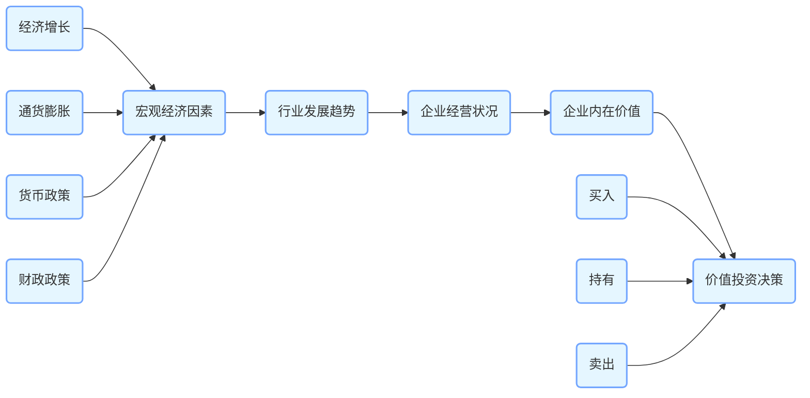

# 价值投资中的宏观经济因素考量

> 关键词：价值投资、宏观经济因素、经济周期、货币政策、财政政策、行业分析、企业估值

> 摘要：本文旨在深入探讨价值投资过程中宏观经济因素的重要性及其具体考量方法。通过分析宏观经济因素与价值投资之间的内在联系，阐述核心算法原理、数学模型，并结合实际案例进行详细说明。同时，介绍了相关的工具和资源，最后对价值投资中宏观经济因素考量的未来发展趋势与挑战进行总结，为投资者在价值投资决策中提供全面且深入的指导。

## 1. 背景介绍 
### 1.1 目的和范围
价值投资作为一种重要的投资策略，强调通过分析企业的内在价值来选择投资标的。然而，企业的经营状况和价值往往受到宏观经济环境的深刻影响。本文章的目的在于系统地研究宏观经济因素在价值投资中的作用，帮助投资者更好地理解和运用宏观经济信息进行投资决策。文章的范围涵盖了主要的宏观经济因素，如经济增长、通货膨胀、货币政策、财政政策等，以及它们对不同行业和企业的影响。

### 1.2 预期读者
本文预期读者包括专业的投资者、投资顾问、金融分析师以及对价值投资和宏观经济感兴趣的个人。无论是初涉投资领域的新手，还是具有一定经验的专业人士，都能从本文中获取有价值的信息和见解，提升自己在价值投资中的决策能力。

### 1.3 文档结构概述
本文将按照以下结构展开：首先介绍核心概念与联系，阐述宏观经济因素与价值投资的基本原理和相互关系；接着详细讲解核心算法原理和具体操作步骤，通过 Python 代码示例展示如何分析宏观经济数据；然后介绍相关的数学模型和公式，并结合实际例子进行说明；之后通过项目实战，给出代码实际案例和详细解释；再探讨宏观经济因素在实际投资场景中的应用；推荐相关的学习工具和资源；最后总结未来发展趋势与挑战，解答常见问题，并提供扩展阅读和参考资料。

### 1.4 术语表
#### 1.4.1 核心术语定义
- **价值投资**：一种投资策略，通过对企业的基本面进行分析，评估其内在价值，并在价格低于内在价值时买入，等待价格回归价值以获取收益。
- **宏观经济因素**：指影响整个经济体系运行的各种因素，如国内生产总值（GDP）增长率、通货膨胀率、利率、汇率等。
- **经济周期**：经济活动沿着经济发展的总体趋势所经历的有规律的扩张和收缩过程，通常包括繁荣、衰退、萧条和复苏四个阶段。
- **货币政策**：中央银行通过调节货币供应量和利率等手段，来影响经济活动和物价水平的政策。
- **财政政策**：政府通过调整税收和支出等手段，来影响经济增长、就业和物价水平的政策。

#### 1.4.2 相关概念解释
- **企业内在价值**：企业未来预期现金流的现值，是价值投资的核心评估对象。它受到企业的盈利能力、资产质量、行业竞争力等多种因素的影响。
- **通货膨胀**：一般物价水平在一定时期内持续、普遍的上涨现象。通货膨胀会影响企业的成本和收入，进而影响其盈利能力和内在价值。
- **利率**：资金的使用成本，利率的变化会影响企业的融资成本和投资者的资金成本，从而对投资决策产生重要影响。

#### 1.4.3 缩略词列表
- **GDP**：国内生产总值（Gross Domestic Product）
- **CPI**：消费者物价指数（Consumer Price Index）
- **PPI**：生产者物价指数（Producer Price Index）
- **M2**：广义货币供应量（Broad Money Supply）

## 2. 核心概念与联系 

### 核心概念原理
价值投资的核心是寻找被低估的企业，通过长期持有来获得价值回归的收益。而宏观经济因素则是影响企业经营环境和内在价值的重要外部因素。宏观经济的运行状况决定了市场的整体需求和供给，进而影响企业的销售收入和成本。例如，在经济繁荣时期，消费者的购买力增强，企业的销售额往往会增加；而在经济衰退时期，需求下降，企业的经营压力增大。

货币政策和财政政策也是重要的宏观经济因素。货币政策通过调节货币供应量和利率，影响企业的融资成本和投资回报率。例如，降低利率可以降低企业的融资成本，刺激企业增加投资和扩大生产；而提高利率则会增加企业的融资成本，抑制投资和消费。财政政策通过政府的税收和支出政策，直接或间接地影响企业的经营状况。例如，政府增加基础设施建设支出，可以带动相关行业的发展；而减税政策可以减轻企业的负担，提高企业的盈利能力。

### 架构的文本示意图
宏观经济因素与价值投资之间的关系可以用以下文本示意图表示：

宏观经济因素（经济增长、通货膨胀、货币政策、财政政策等） -> 影响行业发展趋势（不同行业对宏观经济因素的敏感度不同） -> 影响企业经营状况（销售收入、成本、利润等） -> 影响企业内在价值 -> 影响价值投资决策（买入、持有、卖出）

### Mermaid 流程图


## 3. 核心算法原理 & 具体操作步骤 

### 核心算法原理
在价值投资中，分析宏观经济因素对企业内在价值的影响可以采用多因素回归分析的方法。多因素回归分析是一种统计方法，用于研究多个自变量（宏观经济因素）与因变量（企业内在价值）之间的关系。通过建立回归模型，可以量化宏观经济因素对企业内在价值的影响程度，从而为投资决策提供依据。

### 具体操作步骤
1. **数据收集**：收集宏观经济数据和企业财务数据。宏观经济数据包括 GDP 增长率、通货膨胀率、利率等；企业财务数据包括销售收入、净利润、资产负债率等。
2. **数据预处理**：对收集到的数据进行清洗、整理和标准化处理，以消除数据中的噪声和异常值。
3. **变量选择**：选择与企业内在价值相关的宏观经济因素作为自变量，选择合适的企业财务指标作为因变量。
4. **模型建立**：使用多因素回归分析方法建立回归模型，确定自变量和因变量之间的关系。
5. **模型评估**：对建立的回归模型进行评估，检查模型的拟合优度、显著性等指标，以确保模型的有效性。
6. **预测和决策**：使用建立的回归模型对企业的内在价值进行预测，并根据预测结果进行投资决策。

### Python 代码示例
```python
import pandas as pd
import numpy as np
from sklearn.linear_model import LinearRegression
from sklearn.model_selection import train_test_split
from sklearn.metrics import mean_squared_error

# 数据收集和预处理
# 假设我们已经收集到了宏观经济数据和企业财务数据，并保存为 CSV 文件
macro_data = pd.read_csv('macro_data.csv')
company_data = pd.read_csv('company_data.csv')

# 合并数据
merged_data = pd.merge(macro_data, company_data, on='date')

# 选择自变量和因变量
X = merged_data[['gdp_growth', 'inflation_rate', 'interest_rate']]
y = merged_data['intrinsic_value']

# 数据划分
X_train, X_test, y_train, y_test = train_test_split(X, y, test_size=0.2, random_state=42)

# 模型建立
model = LinearRegression()
model.fit(X_train, y_train)

# 模型评估
y_pred = model.predict(X_test)
mse = mean_squared_error(y_test, y_pred)
rmse = np.sqrt(mse)
print(f"均方误差 (MSE): {mse}")
print(f"均方根误差 (RMSE): {rmse}")

# 预测和决策
new_data = pd.DataFrame({'gdp_growth': [0.03], 'inflation_rate': [0.02], 'interest_rate': [0.05]})
predicted_value = model.predict(new_data)
print(f"预测的企业内在价值: {predicted_value[0]}")
```

## 4. 数学模型和公式 & 详细讲解 & 举例说明 

### 多因素回归模型公式
多因素回归模型的一般形式为：

$$
y = \beta_0 + \beta_1x_1 + \beta_2x_2 + \cdots + \beta_nx_n + \epsilon
$$

其中，$y$ 是因变量（企业内在价值），$x_1, x_2, \cdots, x_n$ 是自变量（宏观经济因素），$\beta_0$ 是截距项，$\beta_1, \beta_2, \cdots, \beta_n$ 是回归系数，$\epsilon$ 是误差项。

### 详细讲解
回归系数 $\beta_i$ 表示在其他自变量不变的情况下，自变量 $x_i$ 每变化一个单位，因变量 $y$ 的平均变化量。通过求解回归系数，可以得到宏观经济因素对企业内在价值的影响程度。误差项 $\epsilon$ 表示模型无法解释的随机误差，通常假设其服从均值为 0、方差为 $\sigma^2$ 的正态分布。

### 举例说明
假设我们建立了一个简单的多因素回归模型，用于分析 GDP 增长率、通货膨胀率和利率对企业内在价值的影响。模型如下：

$$
\text{intrinsic_value} = \beta_0 + \beta_1\text{gdp_growth} + \beta_2\text{inflation_rate} + \beta_3\text{interest_rate} + \epsilon
$$

通过对历史数据进行回归分析，得到回归系数 $\beta_0 = 100$，$\beta_1 = 20$，$\beta_2 = -10$，$\beta_3 = -15$。这意味着在其他因素不变的情况下，GDP 增长率每增加 1%，企业内在价值平均增加 20 个单位；通货膨胀率每增加 1%，企业内在价值平均减少 10 个单位；利率每增加 1%，企业内在价值平均减少 15 个单位。

假设当前的 GDP 增长率为 3%，通货膨胀率为 2%，利率为 5%，则预测的企业内在价值为：

$$
\begin{align*}
\text{intrinsic_value} &= 100 + 20\times0.03 - 10\times0.02 - 15\times0.05\\
&= 100 + 0.6 - 0.2 - 0.75\\
&= 99.65
\end{align*}
$$

## 5. 项目实战：代码实际案例和详细解释说明 

### 5.1  开发环境搭建
为了实现上述的多因素回归分析，我们需要搭建以下开发环境：
- **Python**：建议使用 Python 3.7 及以上版本。
- **Anaconda**：一个集成了 Python 和各种科学计算库的发行版，方便安装和管理 Python 环境和库。
- **IDE**：可以选择 PyCharm、Jupyter Notebook 等集成开发环境。

安装所需的 Python 库：
```bash
pip install pandas numpy scikit-learn
```

### 5.2  源代码详细实现和代码解读
以下是一个完整的 Python 代码示例，用于实现多因素回归分析：

```python
import pandas as pd
import numpy as np
from sklearn.linear_model import LinearRegression
from sklearn.model_selection import train_test_split
from sklearn.metrics import mean_squared_error

# 数据收集和预处理
# 假设我们已经收集到了宏观经济数据和企业财务数据，并保存为 CSV 文件
macro_data = pd.read_csv('macro_data.csv')
company_data = pd.read_csv('company_data.csv')

# 合并数据
merged_data = pd.merge(macro_data, company_data, on='date')

# 选择自变量和因变量
X = merged_data[['gdp_growth', 'inflation_rate', 'interest_rate']]
y = merged_data['intrinsic_value']

# 数据划分
X_train, X_test, y_train, y_test = train_test_split(X, y, test_size=0.2, random_state=42)

# 模型建立
model = LinearRegression()
model.fit(X_train, y_train)

# 模型评估
y_pred = model.predict(X_test)
mse = mean_squared_error(y_test, y_pred)
rmse = np.sqrt(mse)
print(f"均方误差 (MSE): {mse}")
print(f"均方根误差 (RMSE): {rmse}")

# 预测和决策
new_data = pd.DataFrame({'gdp_growth': [0.03], 'inflation_rate': [0.02], 'interest_rate': [0.05]})
predicted_value = model.predict(new_data)
print(f"预测的企业内在价值: {predicted_value[0]}")
```

### 代码解读与分析
1. **数据收集和预处理**：使用 `pandas` 库读取宏观经济数据和企业财务数据，并将它们合并为一个数据集。
2. **变量选择**：选择 GDP 增长率、通货膨胀率和利率作为自变量，企业内在价值作为因变量。
3. **数据划分**：使用 `train_test_split` 函数将数据集划分为训练集和测试集，测试集占总数据集的 20%。
4. **模型建立**：使用 `LinearRegression` 类建立线性回归模型，并使用训练集数据进行拟合。
5. **模型评估**：使用测试集数据进行预测，并计算均方误差（MSE）和均方根误差（RMSE），评估模型的预测性能。
6. **预测和决策**：使用建立的模型对新的宏观经济数据进行预测，得到预测的企业内在价值。

## 6. 实际应用场景 
### 行业分析
不同行业对宏观经济因素的敏感度不同。例如，周期性行业（如钢铁、汽车、房地产等）对经济周期的变化非常敏感，在经济繁荣时期，这些行业的需求旺盛，企业的盈利能力增强；而在经济衰退时期，需求下降，企业的经营压力增大。相反，非周期性行业（如食品、医药、公用事业等）对经济周期的变化相对不敏感，其需求相对稳定，受宏观经济环境的影响较小。因此，在价值投资中，投资者可以根据宏观经济形势选择不同的行业进行投资。

### 企业估值调整
宏观经济因素会影响企业的未来现金流和折现率，从而影响企业的内在价值。例如，在通货膨胀较高的时期，企业的成本会上升，销售收入可能无法同步增长，导致企业的净利润下降。同时，通货膨胀也会导致折现率上升，进一步降低企业的内在价值。因此，投资者在进行企业估值时，需要考虑宏观经济因素的影响，对企业的估值进行调整。

### 投资组合配置
宏观经济因素的变化会导致不同资产的表现出现差异。例如，在经济衰退时期，债券通常表现较好，而股票表现较差；在经济繁荣时期，股票通常表现较好，而债券表现较差。因此，投资者可以根据宏观经济形势调整投资组合的配置，降低投资风险，提高投资收益。

## 7. 工具和资源推荐
### 7.1 学习资源推荐
#### 7.1.1 书籍推荐
- 《聪明的投资者》（The Intelligent Investor）：本杰明·格雷厄姆（Benjamin Graham）的经典著作，被誉为价值投资的圣经，详细介绍了价值投资的理论和方法。
- 《宏观经济学》（Macroeconomics）：保罗·萨缪尔森（Paul A. Samuelson）和威廉·诺德豪斯（William D. Nordhaus）的经典教材，系统介绍了宏观经济学的基本理论和方法。
- 《投资中最简单的事》：邱国鹭的著作，结合中国市场的实际情况，介绍了价值投资的实践经验和方法。

#### 7.1.2 在线课程
- Coursera 上的“宏观经济学原理”（Principles of Macroeconomics）课程：由宾夕法尼亚大学的教授授课，系统介绍了宏观经济学的基本原理和方法。
- edX 上的“价值投资基础”（Foundations of Value Investing）课程：由哥伦比亚大学的教授授课，详细介绍了价值投资的理论和实践。

#### 7.1.3 技术博客和网站
- 雪球网（xueqiu.com）：一个专注于投资交流和分享的社区，提供了丰富的宏观经济分析和价值投资案例。
- 华尔街见闻（wallstreetcn.com）：提供全球金融市场的实时资讯和宏观经济分析，帮助投资者及时了解宏观经济形势。

### 7.2 开发工具框架推荐
#### 7.2.1 IDE和编辑器
- PyCharm：一款专业的 Python 集成开发环境，提供了丰富的代码编辑、调试和分析功能。
- Jupyter Notebook：一个交互式的开发环境，适合进行数据探索和模型开发。

#### 7.2.2 调试和性能分析工具
- `pdb`：Python 自带的调试工具，用于调试 Python 代码。
- `cProfile`：Python 自带的性能分析工具，用于分析 Python 代码的性能瓶颈。

#### 7.2.3 相关框架和库
- `pandas`：一个强大的数据处理和分析库，用于处理和分析宏观经济数据和企业财务数据。
- `numpy`：一个用于科学计算的库，提供了高效的数组操作和数学函数。
- `scikit-learn`：一个用于机器学习的库，提供了丰富的机器学习算法和工具，用于建立回归模型和进行模型评估。

### 7.3 相关论文著作推荐
#### 7.3.1 经典论文
- Fama, E. F., & French, K. R. (1992). The cross-section of expected stock returns. The Journal of Finance, 47(2), 427-465. 该论文提出了著名的 Fama-French 三因子模型，用于解释股票收益率的横截面差异。
- Campbell, J. Y., & Shiller, R. J. (1988). The dividend-price ratio and expectations of future dividends and discount factors. The Review of Financial Studies, 1(3), 195-228. 该论文研究了股息-价格比率与未来股息和折现因子预期之间的关系。

#### 7.3.2 最新研究成果
- Ang, A., & Bekaert, G. (2007). Stock return predictability: Is it there? Review of Financial Studies, 20(3), 651-707. 该论文对股票收益率的可预测性进行了深入研究。
- Cochrane, J. H. (2011). Presidential address: Discount rates. The Journal of Finance, 66(4), 1047-1108. 该论文探讨了折现率在资产定价中的重要作用。

#### 7.3.3 应用案例分析
- Damodaran, A. (2012). Investment valuation: Tools and techniques for determining the value of any asset. John Wiley & Sons. 该书提供了大量的资产估值案例，包括如何考虑宏观经济因素对企业价值的影响。

## 8. 总结：未来发展趋势与挑战
### 未来发展趋势
- **数据驱动的投资决策**：随着大数据和人工智能技术的发展，投资者将越来越依赖于数据驱动的投资决策。通过收集和分析大量的宏观经济数据和企业财务数据，投资者可以更准确地评估企业的内在价值和投资风险。
- **宏观经济预测模型的改进**：未来，宏观经济预测模型将不断改进和完善，提高预测的准确性和可靠性。例如，结合机器学习和深度学习技术，开发更加复杂和精准的宏观经济预测模型。
- **全球宏观经济因素的影响**：随着全球经济一体化的深入发展，全球宏观经济因素对价值投资的影响将越来越大。投资者需要更加关注全球宏观经济形势的变化，以及不同国家和地区之间的经济联系和互动。

### 挑战
- **宏观经济数据的不确定性**：宏观经济数据的收集和发布存在一定的滞后性和误差，这给投资者的决策带来了一定的困难。此外，宏观经济数据的质量和可靠性也会影响投资者对宏观经济形势的判断。
- **宏观经济因素的复杂性**：宏观经济因素之间相互影响、相互作用，形成了一个复杂的系统。投资者很难准确地把握宏观经济因素的变化趋势和影响程度，需要具备较高的专业知识和分析能力。
- **政策变化的不确定性**：货币政策和财政政策的变化对宏观经济和价值投资有着重要的影响。然而，政策的制定和实施往往受到政治、经济和社会等多种因素的影响，具有一定的不确定性。投资者需要密切关注政策变化的动态，及时调整投资策略。

## 9. 附录：常见问题与解答
### 问题 1：如何选择合适的宏观经济因素进行分析？
解答：选择合适的宏观经济因素需要考虑多个方面。首先，要选择与企业经营和价值密切相关的因素，如 GDP 增长率、通货膨胀率、利率等。其次，要考虑因素的可获取性和可靠性，确保能够获得准确和及时的数据。最后，要根据投资的行业和企业特点，选择具有针对性的宏观经济因素。

### 问题 2：多因素回归模型的结果是否可靠？
解答：多因素回归模型的结果可靠性取决于多个因素，如数据的质量、模型的设定、样本的大小等。在建立模型时，需要对数据进行充分的预处理和分析，选择合适的自变量和因变量，确保模型的合理性。同时，需要对模型进行评估和验证，检查模型的拟合优度、显著性等指标，以确保模型的可靠性。

### 问题 3：宏观经济因素对不同行业的影响程度如何衡量？
解答：可以通过分析历史数据，计算不同行业的业绩指标（如销售收入、净利润等）与宏观经济因素之间的相关性，来衡量宏观经济因素对不同行业的影响程度。相关性越高，说明该行业对宏观经济因素的敏感度越高。此外，还可以通过行业分析和专家意见，了解不同行业的特点和发展趋势，进一步评估宏观经济因素对不同行业的影响。

## 10. 扩展阅读 & 参考资料
- 格雷厄姆, B., & 多德, D. (2009). 证券分析. 海南出版社.
- 西格尔, J. J. (2010). 股市长线法宝. 机械工业出版社.
- 希勒, R. J. (2015). 非理性繁荣. 中国人民大学出版社.
- Bloomberg Terminal: 提供全球金融市场的实时数据和分析工具。
- Federal Reserve Economic Data (FRED): 提供美国和全球的宏观经济数据。

作者：AI天才研究院/AI Genius Institute & 禅与计算机程序设计艺术 /Zen And The Art of Computer Programming