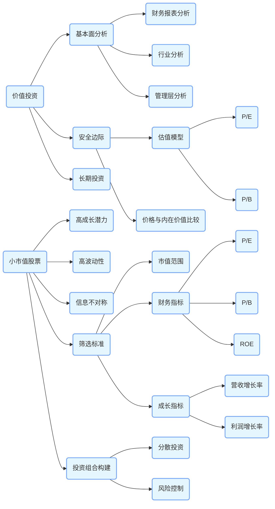

# 价值投资中的小市值股票策略

> 关键词：价值投资、小市值股票、投资策略、风险控制、财务分析

> 摘要：本文围绕价值投资中的小市值股票策略展开深入探讨。首先介绍了该策略的背景信息，包括目的、预期读者等。接着阐述了小市值股票的核心概念及其与价值投资的联系，详细讲解了相关的核心算法原理和具体操作步骤，并运用数学模型和公式进行分析。通过项目实战展示了策略的代码实现和解读，探讨了其实际应用场景。同时推荐了学习该策略所需的工具和资源，最后总结了小市值股票策略的未来发展趋势与挑战，并给出常见问题解答和扩展阅读参考资料，旨在为投资者提供全面且深入的小市值股票投资策略指导。

## 1. 背景介绍 
### 1.1 目的和范围
价值投资是一种长期投资策略，旨在寻找被市场低估的股票，通过分析公司的基本面和内在价值来获取投资回报。小市值股票通常是指市值相对较小的上市公司股票，这类股票往往具有较高的成长潜力，但也伴随着较高的风险。本文章的目的是深入探讨在价值投资框架下的小市值股票策略，分析其原理、操作步骤、风险和收益特点，并通过实际案例和代码演示来展示该策略的应用。范围涵盖了小市值股票的定义、筛选方法、估值模型、投资组合构建以及风险控制等方面。

### 1.2 预期读者
本文预期读者主要包括对价值投资感兴趣的个人投资者、金融专业学生、投资顾问以及从事量化投资研究的专业人士。对于希望了解如何在价值投资中运用小市值股票策略来优化投资组合、提高投资收益的读者，本文将提供有价值的理论和实践指导。

### 1.3 文档结构概述
本文将按照以下结构展开：首先介绍小市值股票和价值投资的核心概念及其联系，包括相关的原理和架构示意图；接着详细讲解核心算法原理和具体操作步骤，通过Python代码进行阐述；然后运用数学模型和公式对策略进行分析，并举例说明；通过项目实战展示代码的实际应用和详细解读；探讨小市值股票策略的实际应用场景；推荐学习该策略所需的工具和资源；最后总结未来发展趋势与挑战，给出常见问题解答和扩展阅读参考资料。

### 1.4 术语表
#### 1.4.1 核心术语定义
- **价值投资**：一种投资策略，通过分析公司的基本面，如财务报表、行业地位、管理层能力等，寻找被市场低估的股票，以低于其内在价值的价格买入，并长期持有，等待市场对其价值的重新认可。
- **小市值股票**：通常指市值相对较小的上市公司股票。市值是指公司的股票总价值，计算公式为每股股价乘以发行在外的股份总数。一般来说，小市值股票的市值规模处于市场较低水平，但具体的划分标准可能因市场和行业而异。
- **市盈率（P/E）**：衡量股票估值的常用指标，计算公式为每股股价除以每股收益。市盈率反映了投资者为获取公司每一元盈利所愿意支付的价格。
- **市净率（P/B）**：另一个重要的估值指标，计算公式为每股股价除以每股净资产。市净率反映了公司的市场价值与账面价值之间的关系。
- **投资组合**：由多种不同的投资资产组成的集合，旨在通过分散投资降低风险。在小市值股票策略中，投资组合可以包含多只小市值股票，也可以结合其他类型的资产。

#### 1.4.2 相关概念解释
- **基本面分析**：通过研究公司的财务状况、经营业绩、行业前景等基本面因素来评估公司的内在价值。基本面分析是价值投资的核心方法之一，对于小市值股票的筛选和评估尤为重要。
- **成长潜力**：指公司未来在业务规模、盈利能力等方面的增长可能性。小市值股票通常具有较高的成长潜力，因为它们可能处于发展初期，有更大的发展空间。
- **风险溢价**：投资者为承担额外风险而要求获得的额外回报。小市值股票由于其较高的风险，通常需要提供比大市值股票更高的风险溢价。

#### 1.4.3 缩略词列表
- **P/E**：市盈率（Price-to-Earnings Ratio）
- **P/B**：市净率（Price-to-Book Ratio）
- **ROE**：净资产收益率（Return on Equity）

## 2. 核心概念与联系 

### 2.1 小市值股票的定义和特点
小市值股票是指市值相对较小的上市公司股票。市值是衡量公司规模的一个重要指标，它反映了市场对公司的整体估值。一般来说，小市值股票具有以下特点：
- **高成长潜力**：小市值公司通常处于发展初期，具有较大的成长空间。它们可能在技术创新、市场拓展等方面具有独特的优势，一旦取得成功，其业绩和股价可能会实现大幅增长。
- **高波动性**：由于小市值股票的流动性相对较差，市场参与者较少，因此其股价更容易受到市场情绪和个别事件的影响，波动性较大。
- **信息不对称**：与大市值公司相比，小市值公司的信息披露可能不够充分，投资者获取信息的难度较大，这增加了投资决策的风险。

### 2.2 价值投资的核心原则
价值投资的核心原则是寻找被市场低估的股票，以低于其内在价值的价格买入，并长期持有。价值投资者通常会关注以下几个方面：
- **基本面分析**：通过研究公司的财务报表、行业地位、管理层能力等基本面因素，评估公司的内在价值。
- **安全边际**：在买入股票时，要求股票价格具有一定的安全边际，即股票价格低于其内在价值的幅度。安全边际可以降低投资风险，提高投资回报。
- **长期投资**：价值投资是一种长期投资策略，投资者相信市场最终会对公司的价值做出正确的评估，因此会长期持有被低估的股票，等待价值回归。

### 2.3 小市值股票与价值投资的联系
小市值股票与价值投资之间存在着密切的联系。一方面，小市值股票由于其高成长潜力和相对较低的市场关注度，更容易被市场低估，为价值投资者提供了寻找低估股票的机会。另一方面，价值投资的基本面分析方法和安全边际原则可以帮助投资者筛选出具有投资价值的小市值股票，降低投资风险。

### 2.4 核心概念原理和架构的文本示意图
```plaintext
价值投资
|
|--基本面分析
|   |--财务报表分析（收入、利润、资产等）
|   |--行业分析（市场规模、竞争格局等）
|   |--管理层分析（能力、诚信等）
|
|--安全边际
|   |--估值模型（P/E、P/B等）
|   |--价格与内在价值比较
|
|--长期投资
|
小市值股票
|
|--高成长潜力
|--高波动性
|--信息不对称
|
|--筛选标准
|   |--市值范围
|   |--财务指标（P/E、P/B、ROE等）
|   |--成长指标（营收增长率、利润增长率等）
|
|--投资组合构建
|   |--分散投资
|   |--风险控制
```

### 2.5 Mermaid 流程图


## 3. 核心算法原理 & 具体操作步骤 

### 3.1 核心算法原理
小市值股票策略的核心算法原理是通过筛选具有投资价值的小市值股票，构建投资组合，并进行长期投资。具体来说，该策略包括以下几个步骤：
1. **数据获取**：收集股票的基本信息，如市值、市盈率、市净率、营收增长率、利润增长率等。
2. **筛选条件设定**：根据价值投资的原则，设定筛选条件，如市值范围、市盈率阈值、市净率阈值等，筛选出符合条件的小市值股票。
3. **排序和选择**：对筛选出的股票按照一定的指标进行排序，如市盈率、市净率等，选择排名靠前的股票构建投资组合。
4. **投资组合调整**：定期对投资组合进行调整，卖出不符合条件的股票，买入新的符合条件的股票，以保持投资组合的有效性。

### 3.2 具体操作步骤
以下是使用Python实现小市值股票策略的具体操作步骤：

#### 3.2.1 数据获取
我们可以使用`pandas-datareader`库从雅虎财经获取股票数据。以下是一个简单的示例代码：
```python
import pandas as pd
import pandas_datareader.data as web
import datetime

# 定义数据获取的时间范围
start = datetime.datetime(2020, 1, 1)
end = datetime.datetime(2023, 12, 31)

# 获取股票数据
tickers = ['AAPL', 'MSFT', 'GOOG', 'TSLA', 'AMZN']  # 示例股票代码
stock_data = {}
for ticker in tickers:
    try:
        data = web.DataReader(ticker, 'yahoo', start, end)
        stock_data[ticker] = data
    except Exception as e:
        print(f"Error getting data for {ticker}: {e}")

# 将数据转换为DataFrame
df = pd.concat(stock_data, axis=1)
df.columns = ['_'.join(col) for col in df.columns.values]
print(df.head())
```

#### 3.2.2 筛选条件设定
假设我们要筛选市值小于100亿美元、市盈率小于20、市净率小于2的小市值股票。以下是实现代码：
```python
# 假设我们已经有了包含市值、市盈率、市净率的DataFrame
# 这里简单模拟数据
data = {
    'ticker': ['AAPL', 'MSFT', 'GOOG', 'TSLA', 'AMZN'],
    'market_cap': [2000, 1500, 80, 120, 300],  # 单位：亿美元
    'pe_ratio': [30, 25, 15, 18, 22],
    'pb_ratio': [5, 4, 1.5, 1.8, 3]
}
df = pd.DataFrame(data)

# 筛选条件
market_cap_threshold = 100
pe_threshold = 20
pb_threshold = 2

# 筛选符合条件的股票
filtered_df = df[(df['market_cap'] < market_cap_threshold) & (df['pe_ratio'] < pe_threshold) & (df['pb_ratio'] < pb_threshold)]
print(filtered_df)
```

#### 3.2.3 排序和选择
对筛选出的股票按照市盈率进行排序，选择排名靠前的前3只股票构建投资组合。以下是实现代码：
```python
# 按市盈率排序
sorted_df = filtered_df.sort_values(by='pe_ratio')

# 选择前3只股票
selected_stocks = sorted_df.head(3)['ticker'].tolist()
print(selected_stocks)
```

#### 3.2.4 投资组合调整
定期对投资组合进行调整，例如每月检查一次股票是否仍然符合筛选条件，如果不符合则卖出，同时买入新的符合条件的股票。以下是一个简单的模拟代码：
```python
import random

# 模拟每月调整投资组合
for month in range(1, 13):
    print(f"Month {month}:")
    # 检查现有股票是否仍然符合条件
    for stock in selected_stocks:
        index = df[df['ticker'] == stock].index[0]
        if df.loc[index, 'market_cap'] >= market_cap_threshold or df.loc[index, 'pe_ratio'] >= pe_threshold or df.loc[index, 'pb_ratio'] >= pb_threshold:
            print(f"Selling {stock}")
            selected_stocks.remove(stock)
    
    # 寻找新的符合条件的股票
    remaining_stocks = df[~df['ticker'].isin(selected_stocks)]
    new_filtered_stocks = remaining_stocks[(remaining_stocks['market_cap'] < market_cap_threshold) & (remaining_stocks['pe_ratio'] < pe_threshold) & (remaining_stocks['pb_ratio'] < pb_threshold)]
    if not new_filtered_stocks.empty:
        new_stock = random.choice(new_filtered_stocks['ticker'].tolist())
        print(f"Buying {new_stock}")
        selected_stocks.append(new_stock)
    
    print(f"Current portfolio: {selected_stocks}")
```

## 4. 数学模型和公式 & 详细讲解 & 举例说明 

### 4.1 市盈率（P/E）模型
市盈率（P/E）是衡量股票估值的常用指标，计算公式为：
$$P/E = \frac{Price}{Earnings\ per\ Share}$$
其中，$Price$ 是股票的当前价格，$Earnings\ per\ Share$ 是每股收益。

市盈率反映了投资者为获取公司每一元盈利所愿意支付的价格。一般来说，市盈率越低，股票越被低估，投资价值越高。例如，某股票的当前价格为50元，每股收益为5元，则该股票的市盈率为：
$$P/E = \frac{50}{5} = 10$$
这意味着投资者为获取该公司每一元盈利愿意支付10元。

### 4.2 市净率（P/B）模型
市净率（P/B）是另一个重要的估值指标，计算公式为：
$$P/B = \frac{Price}{Book\ Value\ per\ Share}$$
其中，$Price$ 是股票的当前价格，$Book\ Value\ per\ Share$ 是每股净资产。

市净率反映了公司的市场价值与账面价值之间的关系。一般来说，市净率越低，股票越被低估，投资价值越高。例如，某股票的当前价格为30元，每股净资产为15元，则该股票的市净率为：
$$P/B = \frac{30}{15} = 2$$
这意味着该股票的市场价值是其账面价值的2倍。

### 4.3 净资产收益率（ROE）模型
净资产收益率（ROE）是衡量公司盈利能力的重要指标，计算公式为：
$$ROE = \frac{Net\ Income}{Shareholders'\ Equity}$$
其中，$Net\ Income$ 是公司的净利润，$Shareholders'\ Equity$ 是股东权益。

ROE反映了公司运用自有资本的效率，ROE越高，说明公司的盈利能力越强。例如，某公司的净利润为1000万元，股东权益为5000万元，则该公司的ROE为：
$$ROE = \frac{1000}{5000} = 0.2 = 20\%$$
这意味着该公司每投入1元自有资本可以获得0.2元的净利润。

### 4.4 投资组合的预期收益和风险计算
投资组合的预期收益可以通过加权平均的方法计算，公式为：
$$E(R_p) = \sum_{i=1}^{n} w_i E(R_i)$$
其中，$E(R_p)$ 是投资组合的预期收益，$w_i$ 是第 $i$ 只股票在投资组合中的权重，$E(R_i)$ 是第 $i$ 只股票的预期收益。

投资组合的风险可以用方差或标准差来衡量，公式为：
$$\sigma_p^2 = \sum_{i=1}^{n} \sum_{j=1}^{n} w_i w_j \sigma_{ij}$$
其中，$\sigma_p^2$ 是投资组合的方差，$\sigma_{ij}$ 是第 $i$ 只股票和第 $j$ 只股票的协方差。

例如，假设投资组合包含3只股票，它们的预期收益分别为10%、15%、20%，权重分别为0.3、0.4、0.3，则投资组合的预期收益为：
$$E(R_p) = 0.3 \times 0.1 + 0.4 \times 0.15 + 0.3 \times 0.2 = 0.15 = 15\%$$

## 5. 项目实战：代码实际案例和详细解释说明 

### 5.1  开发环境搭建
#### 5.1.1 安装Python
首先，需要安装Python环境。可以从Python官方网站（https://www.python.org/downloads/）下载适合自己操作系统的Python安装包，并按照安装向导进行安装。建议安装Python 3.7及以上版本。

#### 5.1.2 安装必要的库
在安装好Python后，需要安装一些必要的库，如`pandas`、`pandas-datareader`、`numpy`等。可以使用`pip`命令进行安装：
```sh
pip install pandas pandas-datareader numpy
```

### 5.2  源代码详细实现和代码解读
以下是一个完整的小市值股票策略的Python代码示例：
```python
import pandas as pd
import pandas_datareader.data as web
import datetime

# 定义数据获取的时间范围
start = datetime.datetime(2020, 1, 1)
end = datetime.datetime(2023, 12, 31)

# 获取股票数据
tickers = ['AAPL', 'MSFT', 'GOOG', 'TSLA', 'AMZN']  # 示例股票代码
stock_data = {}
for ticker in tickers:
    try:
        data = web.DataReader(ticker, 'yahoo', start, end)
        stock_data[ticker] = data
    except Exception as e:
        print(f"Error getting data for {ticker}: {e}")

# 将数据转换为DataFrame
df = pd.concat(stock_data, axis=1)
df.columns = ['_'.join(col) for col in df.columns.values]

# 假设我们已经有了包含市值、市盈率、市净率的DataFrame
# 这里简单模拟数据
data = {
    'ticker': ['AAPL', 'MSFT', 'GOOG', 'TSLA', 'AMZN'],
    'market_cap': [2000, 1500, 80, 120, 300],  # 单位：亿美元
    'pe_ratio': [30, 25, 15, 18, 22],
    'pb_ratio': [5, 4, 1.5, 1.8, 3]
}
df = pd.DataFrame(data)

# 筛选条件
market_cap_threshold = 100
pe_threshold = 20
pb_threshold = 2

# 筛选符合条件的股票
filtered_df = df[(df['market_cap'] < market_cap_threshold) & (df['pe_ratio'] < pe_threshold) & (df['pb_ratio'] < pb_threshold)]

# 按市盈率排序
sorted_df = filtered_df.sort_values(by='pe_ratio')

# 选择前3只股票
selected_stocks = sorted_df.head(3)['ticker'].tolist()

# 模拟每月调整投资组合
for month in range(1, 13):
    print(f"Month {month}:")
    # 检查现有股票是否仍然符合条件
    for stock in selected_stocks:
        index = df[df['ticker'] == stock].index[0]
        if df.loc[index, 'market_cap'] >= market_cap_threshold or df.loc[index, 'pe_ratio'] >= pe_threshold or df.loc[index, 'pb_ratio'] >= pb_threshold:
            print(f"Selling {stock}")
            selected_stocks.remove(stock)
    
    # 寻找新的符合条件的股票
    remaining_stocks = df[~df['ticker'].isin(selected_stocks)]
    new_filtered_stocks = remaining_stocks[(remaining_stocks['market_cap'] < market_cap_threshold) & (remaining_stocks['pe_ratio'] < pe_threshold) & (remaining_stocks['pb_ratio'] < pb_threshold)]
    if not new_filtered_stocks.empty:
        new_stock = random.choice(new_filtered_stocks['ticker'].tolist())
        print(f"Buying {new_stock}")
        selected_stocks.append(new_stock)
    
    print(f"Current portfolio: {selected_stocks}")
```

### 5.3  代码解读与分析
#### 5.3.1 数据获取部分
```python
start = datetime.datetime(2020, 1, 1)
end = datetime.datetime(2023, 12, 31)

tickers = ['AAPL', 'MSFT', 'GOOG', 'TSLA', 'AMZN']
stock_data = {}
for ticker in tickers:
    try:
        data = web.DataReader(ticker, 'yahoo', start, end)
        stock_data[ticker] = data
    except Exception as e:
        print(f"Error getting data for {ticker}: {e}")

df = pd.concat(stock_data, axis=1)
df.columns = ['_'.join(col) for col in df.columns.values]
```
这部分代码使用`pandas-datareader`库从雅虎财经获取指定股票在指定时间范围内的数据，并将数据存储在`stock_data`字典中。最后，将字典中的数据合并为一个DataFrame。

#### 5.3.2 筛选条件设定和筛选部分
```python
market_cap_threshold = 100
pe_threshold = 20
pb_threshold = 2

filtered_df = df[(df['market_cap'] < market_cap_threshold) & (df['pe_ratio'] < pe_threshold) & (df['pb_ratio'] < pb_threshold)]
```
这部分代码设定了筛选条件，即市值小于100亿美元、市盈率小于20、市净率小于2，并使用布尔索引筛选出符合条件的股票。

#### 5.3.3 排序和选择部分
```python
sorted_df = filtered_df.sort_values(by='pe_ratio')
selected_stocks = sorted_df.head(3)['ticker'].tolist()
```
这部分代码对筛选出的股票按照市盈率进行排序，并选择排名靠前的前3只股票构建投资组合。

#### 5.3.4 投资组合调整部分
```python
for month in range(1, 13):
    print(f"Month {month}:")
    for stock in selected_stocks:
        index = df[df['ticker'] == stock].index[0]
        if df.loc[index, 'market_cap'] >= market_cap_threshold or df.loc[index, 'pe_ratio'] >= pe_threshold or df.loc[index, 'pb_ratio'] >= pb_threshold:
            print(f"Selling {stock}")
            selected_stocks.remove(stock)
    
    remaining_stocks = df[~df['ticker'].isin(selected_stocks)]
    new_filtered_stocks = remaining_stocks[(remaining_stocks['market_cap'] < market_cap_threshold) & (remaining_stocks['pe_ratio'] < pe_threshold) & (remaining_stocks['pb_ratio'] < pb_threshold)]
    if not new_filtered_stocks.empty:
        new_stock = random.choice(new_filtered_stocks['ticker'].tolist())
        print(f"Buying {new_stock}")
        selected_stocks.append(new_stock)
    
    print(f"Current portfolio: {selected_stocks}")
```
这部分代码模拟每月对投资组合进行调整，检查现有股票是否仍然符合筛选条件，如果不符合则卖出，同时买入新的符合条件的股票。

## 6. 实际应用场景 
### 6.1 个人投资者
对于个人投资者来说，小市值股票策略可以作为一种补充投资策略，与其他投资策略相结合，以实现投资组合的多元化。个人投资者可以通过筛选具有投资价值的小市值股票，构建自己的投资组合，并长期持有，以获取较高的投资回报。同时，由于小市值股票的高波动性，个人投资者需要具备一定的风险承受能力。

### 6.2 基金管理公司
基金管理公司可以运用小市值股票策略来管理专门的小市值股票基金。通过专业的研究和分析，筛选出具有潜力的小市值股票，构建投资组合，并进行动态调整。小市值股票基金可以为投资者提供一种投资小市值股票的渠道，同时也可以为基金管理公司带来一定的管理费用收入。

### 6.3 量化投资机构
量化投资机构可以利用小市值股票策略进行量化交易。通过建立量化模型，对小市值股票进行筛选和排序，实现自动化的交易决策。量化投资机构可以利用计算机算法和大数据分析技术，快速处理大量的股票数据，提高交易效率和决策的准确性。

## 7. 工具和资源推荐
### 7.1 学习资源推荐
#### 7.1.1 书籍推荐
- 《聪明的投资者》（The Intelligent Investor）：作者是本杰明·格雷厄姆（Benjamin Graham），这本书是价值投资的经典之作，详细介绍了价值投资的原理和方法，对小市值股票策略也有一定的涉及。
- 《怎样选择成长股》（Common Stocks and Uncommon Profits）：作者是菲利普·费雪（Philip Fisher），这本书强调了寻找具有成长潜力的股票的重要性，对于理解小市值股票的成长潜力有很大的帮助。
- 《小市值股票投资策略》（Small-Cap Stock Investing Strategies）：这本书专门探讨了小市值股票的投资策略，包括筛选方法、估值模型、投资组合构建等方面的内容。

#### 7.1.2 在线课程
- Coursera上的“投资学原理”（Principles of Investing）课程：该课程由知名大学的教授授课，涵盖了投资学的基本原理和方法，包括价值投资和小市值股票投资等内容。
- edX上的“量化投资基础”（Foundations of Quantitative Investing）课程：该课程介绍了量化投资的基本概念和方法，对于理解如何运用量化模型进行小市值股票投资有很大的帮助。

#### 7.1.3 技术博客和网站
- Seeking Alpha（https://seekingalpha.com/）：这是一个知名的金融投资博客网站，提供了大量的股票分析和投资策略文章，包括小市值股票的分析和推荐。
- Motley Fool（https://www.fool.com/）：该网站提供了丰富的投资教育资源和股票分析文章，对于初学者和有一定经验的投资者都有很大的帮助。

### 7.2 开发工具框架推荐
#### 7.2.1 IDE和编辑器
- PyCharm：这是一款专业的Python集成开发环境，提供了丰富的代码编辑、调试和版本控制功能，适合开发小市值股票策略的Python代码。
- Jupyter Notebook：这是一个交互式的开发环境，适合进行数据探索和分析，以及编写和运行Python代码。

#### 7.2.2 调试和性能分析工具
- Py-Spy：这是一个轻量级的Python性能分析工具，可以帮助开发者找出代码中的性能瓶颈。
- PDB：这是Python自带的调试器，可以帮助开发者调试Python代码。

#### 7.2.3 相关框架和库
- Pandas：这是一个强大的数据分析库，提供了丰富的数据结构和数据处理方法，适合处理股票数据。
- Numpy：这是一个用于科学计算的Python库，提供了高效的数组操作和数学函数，适合进行量化计算。
- Scikit-learn：这是一个机器学习库，提供了丰富的机器学习算法和工具，适合用于构建量化模型。

### 7.3 相关论文著作推荐
#### 7.3.1 经典论文
- Banz, R. W. (1981). The relationship between return and market value of common stocks. Journal of Financial Economics, 9(1), 3-18. 这篇论文首次提出了小市值股票效应，即小市值股票的平均收益率高于大市值股票。
- Fama, E. F., & French, K. R. (1993). Common risk factors in the returns on stocks and bonds. Journal of Financial Economics, 33(1), 3-56. 这篇论文提出了著名的Fama-French三因子模型，其中包括了市值因子，进一步解释了小市值股票的超额收益。

#### 7.3.2 最新研究成果
- Hou, K., Xue, C., & Zhang, L. (2015). Digesting anomalies: An investment approach. Review of Financial Studies, 28(3), 650-705. 这篇论文提出了一种基于投资的方法来解释股票市场的异常现象，包括小市值股票效应。
- Asness, C. S., Frazzini, A., & Pedersen, L. H. (2019). Quality minus junk. Review of Accounting Studies, 24(3), 912-954. 这篇论文提出了质量因子，并探讨了质量因子与小市值股票策略的关系。

#### 7.3.3 应用案例分析
- Chan, L. K. C., & Lakonishok, J. (1993). Are financial ratios useful in predicting future stock returns?. Financial Analysts Journal, 49(1), 26-31. 这篇论文通过实证研究分析了财务比率在预测股票未来回报中的作用，对于小市值股票的筛选和估值有一定的参考价值。

## 8. 总结：未来发展趋势与挑战
### 8.1 未来发展趋势
- **量化投资的应用将更加广泛**：随着计算机技术和大数据分析技术的不断发展，量化投资在小市值股票策略中的应用将更加广泛。量化模型可以帮助投资者更快速、准确地筛选和分析小市值股票，提高投资决策的效率和准确性。
- **多因子模型的发展**：未来，小市值股票策略可能会结合更多的因子，如质量因子、动量因子等，构建多因子模型。多因子模型可以更全面地考虑股票的各种特征，提高投资组合的收益和风险控制能力。
- **国际化投资**：随着全球金融市场的一体化，投资者将有更多的机会投资于不同国家和地区的小市值股票。国际化投资可以进一步分散投资风险，提高投资组合的多元化程度。

### 8.2 挑战
- **信息不对称问题**：小市值股票的信息披露可能不够充分，投资者获取信息的难度较大，这增加了投资决策的风险。未来需要加强对小市值公司的信息监管，提高信息披露的透明度。
- **市场有效性的提高**：随着市场的发展和投资者的成熟，市场的有效性可能会逐渐提高，小市值股票的超额收益可能会逐渐减少。投资者需要不断创新和改进投资策略，以适应市场的变化。
- **风险管理难度大**：小市值股票的高波动性和不确定性增加了风险管理的难度。投资者需要建立有效的风险管理体系，合理控制投资组合的风险。

## 9. 附录：常见问题与解答
### 9.1 小市值股票的定义标准是什么？
小市值股票的定义标准并没有一个统一的规定，不同的市场和机构可能有不同的划分方法。一般来说，小市值股票是指市值相对较小的上市公司股票。在国内A股市场，通常将市值低于50亿元的股票视为小市值股票；在国外市场，小市值股票的定义标准可能会有所不同。

### 9.2 小市值股票策略的风险有哪些？
小市值股票策略的风险主要包括以下几个方面：
- **高波动性**：小市值股票的股价更容易受到市场情绪和个别事件的影响，波动性较大，可能会导致投资组合的价值大幅波动。
- **信息不对称**：小市值公司的信息披露可能不够充分，投资者获取信息的难度较大，这增加了投资决策的风险。
- **流动性风险**：小市值股票的流动性相对较差，买卖可能不够活跃，可能会导致投资者在买卖股票时遇到困难。
- **公司经营风险**：小市值公司通常处于发展初期，经营稳定性较差，可能会面临更多的经营风险，如市场竞争、技术创新等。

### 9.3 如何评估小市值股票的投资价值？
评估小市值股票的投资价值可以从以下几个方面入手：
- **基本面分析**：研究公司的财务报表、行业地位、管理层能力等基本面因素，评估公司的内在价值。
- **估值指标**：使用市盈率、市净率等估值指标，判断股票是否被低估。
- **成长潜力**：关注公司的业务发展前景、市场份额增长、技术创新等方面，评估公司的成长潜力。
- **风险评估**：考虑公司的经营风险、市场风险等因素，评估投资的风险水平。

## 10. 扩展阅读 & 参考资料
- Graham, B., & Dodd, D. L. (1934). Security Analysis. McGraw-Hill.
- Fisher, P. A. (1958). Common Stocks and Uncommon Profits. Harper & Brothers.
- Damodaran, A. (2012). The Little Book of Valuation: How to Value a Company, Pick a Stock and Profit. Wiley.
- Yahoo Finance (https://finance.yahoo.com/)
- Google Finance (https://www.google.com/finance)

作者：AI天才研究院/AI Genius Institute & 禅与计算机程序设计艺术 /Zen And The Art of Computer Programming