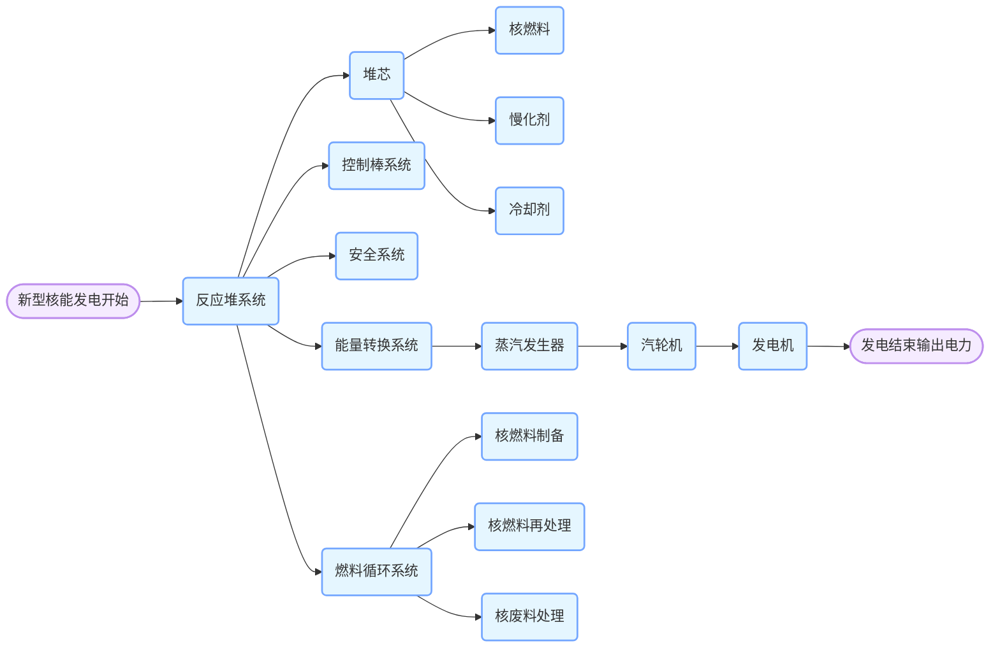

# 价值投资中的新型核能技术分析

> 关键词：价值投资、新型核能技术、技术原理、市场应用、发展趋势

> 摘要：本文聚焦于价值投资领域中新型核能技术的分析。首先介绍了价值投资与新型核能技术结合的背景，阐述相关核心概念及其联系。深入剖析新型核能技术的核心算法原理、数学模型，并给出Python代码示例。通过项目实战展示新型核能技术在实际中的应用及代码解读。探讨了新型核能技术的实际应用场景，推荐了学习该技术所需的工具和资源，最后总结了新型核能技术在价值投资中的未来发展趋势与挑战，解答常见问题并提供扩展阅读与参考资料，旨在为价值投资者提供全面的新型核能技术分析视角。

## 1. 背景介绍 
### 1.1 目的和范围
随着全球能源需求的不断增长以及对清洁能源的迫切追求，核能作为一种高效、稳定的能源形式受到了广泛关注。传统核能技术存在一定的安全隐患和核废料处理难题，而新型核能技术在安全性、经济性和可持续性方面具有显著优势。本文旨在从价值投资的角度，对新型核能技术进行全面深入的分析，评估其投资价值和发展潜力。研究范围涵盖新型核能技术的原理、应用、市场前景以及相关的政策环境等方面。

### 1.2 预期读者
本文预期读者主要包括价值投资者、能源行业分析师、核能技术研究人员以及对清洁能源和投资领域感兴趣的专业人士。对于投资者而言，希望通过本文了解新型核能技术的投资机会和风险；对于行业分析师，提供技术和市场的综合分析；对于研究人员，可作为技术发展和应用的参考；对于普通感兴趣者，能获得对新型核能技术较为系统的认识。

### 1.3 文档结构概述
本文首先介绍背景信息，包括目的、读者群体和文档结构。接着阐述新型核能技术的核心概念及其联系，通过文本示意图和Mermaid流程图展示其原理和架构。然后详细讲解核心算法原理和具体操作步骤，结合Python代码进行说明。分析数学模型和公式，并举例说明。通过项目实战展示代码实现和解读。探讨新型核能技术的实际应用场景。推荐学习该技术所需的工具和资源。最后总结未来发展趋势与挑战，解答常见问题并提供扩展阅读与参考资料。

### 1.4 术语表
#### 1.4.1 核心术语定义
- **价值投资**：一种基于对资产内在价值评估的投资策略，投资者通过分析公司的基本面、财务状况和行业前景等因素，寻找被低估的资产进行投资，以期获得长期稳定的回报。
- **新型核能技术**：相对于传统压水堆核能技术而言，采用新的反应堆设计、燃料循环方式和安全系统等，具有更高的安全性、经济性和可持续性的核能技术，如高温气冷堆、熔盐堆等。
- **核裂变**：重原子核（如铀 - 235、钚 - 239 等）吸收一个中子后分裂成两个或多个较轻原子核，并释放出大量能量和中子的过程。
- **核燃料循环**：核燃料从开采、加工、使用到后处理的整个过程，包括前端的铀矿开采、浓缩，反应堆中的燃料使用，以及后端的核废料处理和再利用等环节。

#### 1.4.2 相关概念解释
- **固有安全性**：新型核能技术的一个重要特性，指反应堆在设计上具有内在的安全机制，即使在发生事故时，也能依靠物理原理自动停堆，避免堆芯熔毁和大量放射性物质释放，无需外部干预或依赖复杂的安全系统。
- **钍基核能系统**：以钍 - 232 作为核燃料的核能系统，钍资源丰富，且在核反应过程中产生的长寿命放射性废物较少，具有较好的可持续性。
- **第四代核能系统**：国际上定义的新一代核能系统，具有更高的安全性、经济性、防核扩散能力和可持续性，包括六种反应堆概念，如超高温气冷堆、钠冷快堆、铅冷快堆等。

#### 1.4.3 缩略词列表
- **HTGR**：High - Temperature Gas - Cooled Reactor，高温气冷堆
- **MSR**：Molten Salt Reactor，熔盐堆
- **SFR**：Sodium - Cooled Fast Reactor，钠冷快堆
- **LFR**：Lead - Cooled Fast Reactor，铅冷快堆

## 2. 核心概念与联系 

### 核心概念原理
新型核能技术的核心在于利用核裂变反应释放能量。以高温气冷堆为例，其原理是采用氦气作为冷却剂，石墨作为慢化剂，将核燃料制成直径约为 6 厘米的球形燃料元件。在反应堆中，氦气吸收核裂变产生的热量，将其带出堆芯，通过蒸汽发生器将热量传递给二回路的水，产生蒸汽驱动汽轮机发电。

高温气冷堆具有固有安全性，因为其燃料元件的耐高温性能好，在正常运行和事故工况下，燃料元件都能保持结构完整性，不会发生堆芯熔毁。同时，氦气冷却剂化学性质稳定，不与核燃料和结构材料发生化学反应，且具有良好的传热性能。

熔盐堆则是使用熔盐作为核燃料和冷却剂。熔盐具有良好的流动性和传热性能，能够在较低的压力下运行。在熔盐堆中，核燃料溶解在熔盐中，随着熔盐的流动在反应堆内循环，发生核裂变反应释放能量。熔盐堆的优点包括可以在线添加和卸载核燃料，便于进行核燃料的循环利用，以及具有较高的热效率。

### 架构的文本示意图
```plaintext
新型核能技术架构
|-- 反应堆系统
|   |-- 堆芯
|   |   |-- 核燃料（如球形燃料元件、熔盐燃料）
|   |   |-- 慢化剂（如石墨）
|   |   |-- 冷却剂（如氦气、熔盐）
|   |-- 控制棒系统
|   |-- 安全系统
|-- 能量转换系统
|   |-- 蒸汽发生器
|   |-- 汽轮机
|   |-- 发电机
|-- 燃料循环系统
|   |-- 核燃料制备
|   |-- 核燃料再处理
|   |-- 核废料处理
```

### Mermaid 流程图


## 3. 核心算法原理 & 具体操作步骤 

### 核反应堆功率控制算法原理
核反应堆的功率控制是保证反应堆安全稳定运行的关键。一种常见的功率控制算法是基于比例 - 积分 - 微分（PID）控制原理。PID 控制器根据反应堆实际功率与设定功率的偏差，计算出控制信号，调节控制棒的位置，从而改变反应堆的反应性，实现功率的控制。

以下是一个简化的 Python 代码示例，模拟核反应堆功率的 PID 控制过程：

```python
class PIDController:
    def __init__(self, kp, ki, kd):
        self.kp = kp  # 比例系数
        self.ki = ki  # 积分系数
        self.kd = kd  # 微分系数
        self.prev_error = 0
        self.integral = 0

    def update(self, setpoint, current_value):
        error = setpoint - current_value
        self.integral += error
        derivative = error - self.prev_error
        output = self.kp * error + self.ki * self.integral + self.kd * derivative
        self.prev_error = error
        return output

# 模拟核反应堆功率控制
if __name__ == "__main__":
    # 设定 PID 控制器参数
    kp = 0.5
    ki = 0.1
    kd = 0.2
    pid = PIDController(kp, ki, kd)

    # 设定目标功率和初始功率
    setpoint_power = 1000  # MW
    current_power = 200  # MW

    # 模拟控制过程
    for i in range(20):
        control_signal = pid.update(setpoint_power, current_power)
        # 简单模拟控制信号对功率的影响
        current_power += control_signal * 0.1
        print(f"Step {i + 1}: Control Signal = {control_signal:.2f}, Current Power = {current_power:.2f} MW")
```

### 具体操作步骤
1. **初始化 PID 控制器**：根据反应堆的特性和控制要求，确定比例系数 $K_p$、积分系数 $K_i$ 和微分系数 $K_d$。
2. **设定目标功率**：根据电网的需求和反应堆的设计能力，设定反应堆的目标功率 $P_{setpoint}$。
3. **获取当前功率**：通过功率测量装置获取反应堆的当前功率 $P_{current}$。
4. **计算误差**：计算目标功率与当前功率的偏差 $e = P_{setpoint}-P_{current}$。
5. **计算控制信号**：根据 PID 算法计算控制信号 $u = K_p e+K_i\sum_{i = 0}^{n}e_i+K_d\frac{de}{dt}$，其中 $\sum_{i = 0}^{n}e_i$ 是误差的积分，$\frac{de}{dt}$ 是误差的微分。
6. **调节控制棒位置**：将控制信号转换为控制棒的移动量，调节控制棒的位置，改变反应堆的反应性，从而调整反应堆的功率。
7. **重复步骤 3 - 6**：不断循环上述步骤，直到反应堆的功率达到并稳定在目标功率附近。

## 4. 数学模型和公式 & 详细讲解 & 举例说明 

### 核反应堆点堆动力学方程
核反应堆的动力学行为可以用点堆动力学方程来描述。点堆动力学方程是一组常微分方程，用于描述反应堆内中子密度随时间的变化。

点堆动力学方程的基本形式为：

$$\frac{dN(t)}{dt}=\frac{\rho(t)-\beta}{\Lambda}N(t)+\sum_{i = 1}^{6}\lambda_iC_i(t)$$

$$\frac{dC_i(t)}{dt}=\frac{\beta_i}{\Lambda}N(t)-\lambda_iC_i(t),\quad i = 1,2,\cdots,6$$

其中：
- $N(t)$ 是中子密度，单位为 $cm^{-3}$；
- $\rho(t)$ 是反应性，无量纲；
- $\beta$ 是缓发中子份额，无量纲；
- $\Lambda$ 是中子代时间，单位为 $s$；
- $C_i(t)$ 是第 $i$ 组缓发中子先驱核浓度，单位为 $cm^{-3}$；
- $\lambda_i$ 是第 $i$ 组缓发中子先驱核的衰变常数，单位为 $s^{-1}$；
- $\beta_i$ 是第 $i$ 组缓发中子份额，无量纲。

### 详细讲解
- **中子密度变化方程**：$\frac{dN(t)}{dt}=\frac{\rho(t)-\beta}{\Lambda}N(t)+\sum_{i = 1}^{6}\lambda_iC_i(t)$ 描述了中子密度随时间的变化率。等式右边第一项 $\frac{\rho(t)-\beta}{\Lambda}N(t)$ 表示瞬发中子对中子密度变化的贡献，当反应性 $\rho(t)$ 大于缓发中子份额 $\beta$ 时，瞬发中子会使中子密度迅速增加；第二项 $\sum_{i = 1}^{6}\lambda_iC_i(t)$ 表示缓发中子对中子密度变化的贡献，缓发中子的产生相对较慢，但对反应堆的控制和稳定性起着重要作用。
- **缓发中子先驱核浓度变化方程**：$\frac{dC_i(t)}{dt}=\frac{\beta_i}{\Lambda}N(t)-\lambda_iC_i(t)$ 描述了第 $i$ 组缓发中子先驱核浓度随时间的变化率。等式右边第一项 $\frac{\beta_i}{\Lambda}N(t)$ 表示先驱核的产生率，与中子密度成正比；第二项 $-\lambda_iC_i(t)$ 表示先驱核的衰变率，与先驱核浓度成正比。

### 举例说明
假设一个简单的反应堆，其参数如下：
- $\beta = 0.0065$
- $\Lambda = 10^{-4}s$
- $\beta_1 = 0.00021$，$\lambda_1 = 0.0124s^{-1}$
- $\beta_2 = 0.00142$，$\lambda_2 = 0.0305s^{-1}$
- $\cdots$
- $\beta_6 = 0.00008$，$\lambda_6 = 0.113s^{-1}$

初始时刻，中子密度 $N(0)=10^8cm^{-3}$，缓发中子先驱核浓度 $C_i(0)=0$，反应性 $\rho(t)=0.001$。

我们可以使用 Python 来求解点堆动力学方程：

```python
import numpy as np
from scipy.integrate import odeint
import matplotlib.pyplot as plt

# 反应堆参数
beta = 0.0065
Lambda = 1e-4
beta_i = np.array([0.00021, 0.00142, 0.00127, 0.00257, 0.00075, 0.00008])
lambda_i = np.array([0.0124, 0.0305, 0.111, 0.301, 1.14, 3.01])

# 点堆动力学方程
def point_reactor_kinetics(y, t, rho):
    N = y[0]
    C = y[1:]
    dNdt = ((rho - beta) / Lambda) * N + np.sum(lambda_i * C)
    dCdt = (beta_i / Lambda) * N - lambda_i * C
    return np.concatenate(([dNdt], dCdt))

# 初始条件
N0 = 1e8
C0 = np.zeros(6)
y0 = np.concatenate(([N0], C0))

# 反应性
rho = 0.001

# 时间范围
t = np.linspace(0, 10, 1000)

# 求解方程
solution = odeint(point_reactor_kinetics, y0, t, args=(rho,))

# 提取中子密度
N = solution[:, 0]

# 绘制中子密度随时间的变化曲线
plt.plot(t, N)
plt.xlabel('Time (s)')
plt.ylabel('Neutron Density ($cm^{-3}$)')
plt.title('Neutron Density vs Time')
plt.grid(True)
plt.show()
```

通过上述代码，我们可以得到中子密度随时间的变化曲线，直观地观察反应堆的动力学行为。

## 5. 项目实战：代码实际案例和详细解释说明 

### 5.1  开发环境搭建
为了进行新型核能技术相关的代码开发，我们可以使用 Python 作为开发语言。以下是搭建开发环境的具体步骤：

#### 安装 Python
可以从 Python 官方网站（https://www.python.org/downloads/）下载适合你操作系统的 Python 安装包，按照安装向导进行安装。建议安装 Python 3.7 及以上版本。

#### 安装必要的库
在安装好 Python 后，需要安装一些必要的库，如 `numpy`、`scipy` 和 `matplotlib`。可以使用 `pip` 命令进行安装：
```sh
pip install numpy scipy matplotlib
```

### 5.2  源代码详细实现和代码解读
以下是一个综合的代码示例，结合前面介绍的 PID 控制器和点堆动力学方程，模拟核反应堆功率的控制过程：

```python
import numpy as np
from scipy.integrate import odeint
import matplotlib.pyplot as plt

# 反应堆参数
beta = 0.0065
Lambda = 1e-4
beta_i = np.array([0.00021, 0.00142, 0.00127, 0.00257, 0.00075, 0.00008])
lambda_i = np.array([0.0124, 0.0305, 0.111, 0.301, 1.14, 3.01])

# 点堆动力学方程
def point_reactor_kinetics(y, t, rho):
    N = y[0]
    C = y[1:]
    dNdt = ((rho - beta) / Lambda) * N + np.sum(lambda_i * C)
    dCdt = (beta_i / Lambda) * N - lambda_i * C
    return np.concatenate(([dNdt], dCdt))

class PIDController:
    def __init__(self, kp, ki, kd):
        self.kp = kp
        self.ki = ki
        self.kd = kd
        self.prev_error = 0
        self.integral = 0

    def update(self, setpoint, current_value):
        error = setpoint - current_value
        self.integral += error
        derivative = error - self.prev_error
        output = self.kp * error + self.ki * self.integral + self.kd * derivative
        self.prev_error = error
        return output

# 初始条件
N0 = 1e8
C0 = np.zeros(6)
y0 = np.concatenate(([N0], C0))

# 设定 PID 控制器参数
kp = 0.5
ki = 0.1
kd = 0.2
pid = PIDController(kp, ki, kd)

# 设定目标功率和初始功率
setpoint_power = 1000  # MW
current_power = 200  # MW

# 时间范围
t = np.linspace(0, 60, 600)
power_history = []
rho_history = []

for i in range(len(t) - 1):
    # 计算控制信号
    control_signal = pid.update(setpoint_power, current_power)
    # 简单模拟控制信号与反应性的关系
    rho = control_signal * 0.0001
    rho_history.append(rho)

    # 求解点堆动力学方程
    solution = odeint(point_reactor_kinetics, y0, [t[i], t[i + 1]], args=(rho,))
    y0 = solution[-1]
    N = y0[0]
    # 简单模拟功率与中子密度的关系
    current_power = N / 1e6
    power_history.append(current_power)

# 绘制功率随时间的变化曲线
plt.figure(figsize=(12, 6))
plt.subplot(2, 1, 1)
plt.plot(t[:-1], power_history)
plt.axhline(y=setpoint_power, color='r', linestyle='--', label='Setpoint Power')
plt.xlabel('Time (s)')
plt.ylabel('Power (MW)')
plt.title('Reactor Power Control')
plt.legend()

# 绘制反应性随时间的变化曲线
plt.subplot(2, 1, 2)
plt.plot(t[:-1], rho_history)
plt.xlabel('Time (s)')
plt.ylabel('Reactivity')
plt.title('Reactivity vs Time')
plt.tight_layout()
plt.show()
```

### 5.3  代码解读与分析
1. **参数定义**：定义了反应堆的参数，如 $\beta$、$\Lambda$、$\beta_i$ 和 $\lambda_i$，这些参数是点堆动力学方程的重要输入。
2. **点堆动力学方程**：`point_reactor_kinetics` 函数实现了点堆动力学方程的求解，根据当前的反应性 $\rho$ 计算中子密度和缓发中子先驱核浓度的变化率。
3. **PID 控制器**：`PIDController` 类实现了 PID 控制算法，根据目标功率和当前功率的偏差计算控制信号。
4. **模拟控制过程**：在主循环中，不断调用 PID 控制器计算控制信号，将控制信号转换为反应性 $\rho$，然后使用 `odeint` 函数求解点堆动力学方程，更新中子密度和功率。
5. **结果可视化**：使用 `matplotlib` 库绘制功率随时间的变化曲线和反应性随时间的变化曲线，直观地展示反应堆功率的控制过程。

通过这个代码示例，我们可以看到如何将 PID 控制算法和点堆动力学方程结合起来，模拟核反应堆功率的控制过程，为实际的反应堆控制提供理论和代码支持。

## 6. 实际应用场景 
### 发电领域
新型核能技术在发电领域具有广阔的应用前景。高温气冷堆具有固有安全性和较高的热效率，适合建设大型核电站，为电网提供稳定可靠的电力。例如，山东石岛湾高温气冷堆核电站示范工程是全球首座具有第四代核能系统特征的球床模块式高温气冷堆核电站，该项目的成功建设和运行，为高温气冷堆技术的商业化推广奠定了基础。

熔盐堆则可以采用不同的燃料循环方式，如钍基熔盐堆，能够充分利用钍资源，减少对铀资源的依赖，同时产生的长寿命放射性废物较少。钍基熔盐堆在一些小型分布式电源和海岛供电等场景中具有潜在的应用价值。

### 工业供热
新型核能技术还可以用于工业供热。一些高温气冷堆能够产生高温蒸汽，可直接为化工、冶金等工业领域提供热源，替代传统的化石能源供热方式，降低工业生产的碳排放。例如，在一些大型化工园区，可以建设高温气冷堆供热站，为园区内的企业提供稳定的高温蒸汽，提高能源利用效率和企业的经济效益。

### 海水淡化
在一些水资源短缺的沿海地区，新型核能技术可以与海水淡化技术相结合。核反应堆产生的热量可以用于驱动海水淡化装置，如多级闪蒸、反渗透等海水淡化工艺。这种方式不仅可以解决当地的淡水供应问题，还可以充分利用核能的能量，提高能源的综合利用效率。例如，在中东地区，一些国家已经开始研究和规划利用核能进行海水淡化的项目。

### 空间能源
在航天领域，新型核能技术也具有重要的应用潜力。小型核反应堆可以作为航天器的电源，为深空探测任务提供持续稳定的能源供应。与传统的太阳能电池相比，核电源不受光照条件的限制，能够在远离太阳的深空环境中正常工作。例如，美国的“好奇号”火星探测器就使用了放射性同位素热电发生器（RTG）作为电源，而未来的深空探测任务可能会采用更先进的小型核反应堆作为能源。

## 7. 工具和资源推荐
### 7.1 学习资源推荐
#### 7.1.1 书籍推荐
- 《核反应堆物理分析》：本书系统地介绍了核反应堆物理的基本概念、理论和方法，包括中子扩散理论、反应性控制、堆芯物理设计等内容，是学习核反应堆物理的经典教材。
- 《核能技术概论》：全面介绍了核能技术的发展历程、原理、应用和安全等方面的知识，适合对核能技术感兴趣的初学者阅读。
- 《第四代核能系统》：详细介绍了第四代核能系统的六种反应堆概念，包括其技术特点、发展现状和前景等，对于深入了解新型核能技术具有重要的参考价值。

#### 7.1.2 在线课程
- Coursera 平台上的“Nuclear Energy: Science, Technology, and Society”课程：由美国宾夕法尼亚州立大学的教授授课，介绍了核能的科学原理、技术应用以及社会影响等方面的知识。
- edX 平台上的“Introduction to Nuclear Engineering”课程：提供了核工程的基础知识，包括核反应堆、核燃料循环、辐射防护等内容。

#### 7.1.3 技术博客和网站
- 国际原子能机构（IAEA）官网（https://www.iaea.org/）：提供了全球核能领域的最新动态、技术报告和政策法规等信息。
- 中国核能行业协会官网（https://www.cnnea.org.cn/）：发布了中国核能行业的发展情况、政策解读和技术成果等内容。
- 美国能源部核能办公室官网（https://www.energy.gov/ne/nuclear-energy）：提供了美国核能研究和发展的相关信息，包括新型核能技术的研究进展和项目动态。

### 7.2 开发工具框架推荐
#### 7.2.1 IDE和编辑器
- PyCharm：一款功能强大的 Python 集成开发环境，提供了代码编辑、调试、版本控制等功能，适合进行 Python 代码的开发。
- Jupyter Notebook：一种交互式的开发环境，支持代码、文本、图像等多种格式的展示，方便进行数据分析和可视化，对于学习和研究新型核能技术的代码实现非常有用。

#### 7.2.2 调试和性能分析工具
- `pdb`：Python 内置的调试工具，可以在代码中设置断点，逐步执行代码，查看变量的值，帮助调试代码中的错误。
- `cProfile`：Python 的性能分析工具，可以分析代码的运行时间和函数调用次数，找出代码中的性能瓶颈。

#### 7.2.3 相关框架和库
- `numpy`：Python 的数值计算库，提供了高效的数组操作和数学函数，在处理核反应堆动力学方程的数值求解时非常有用。
- `scipy`：基于 `numpy` 的科学计算库，提供了优化、积分、插值等多种科学计算功能，可用于求解复杂的数学模型。
- `matplotlib`：Python 的绘图库，可用于绘制各种类型的图表，如中子密度随时间的变化曲线、反应堆功率控制曲线等，直观地展示计算结果。

### 7.3 相关论文著作推荐
#### 7.3.1 经典论文
- “The Physics of Nuclear Kinetics”：该论文系统地阐述了核反应堆动力学的基本理论和方法，是核反应堆动力学领域的经典文献。
- “High - Temperature Gas - Cooled Reactors: A Technology Overview”：介绍了高温气冷堆的技术特点、设计原理和应用前景，对于了解高温气冷堆技术具有重要的参考价值。

#### 7.3.2 最新研究成果
- 可以通过国际知名学术数据库，如 IEEE Xplore、ScienceDirect 等，搜索关于新型核能技术的最新研究论文。例如，关于熔盐堆的材料腐蚀、钍基核能系统的燃料循环等方面的研究成果。
- 关注国际核能领域的学术会议，如国际核工程大会（ICONE）、全球核能合作伙伴论坛（GNEP）等，这些会议上会发布许多新型核能技术的最新研究进展。

#### 7.3.3 应用案例分析
- 一些能源研究机构和咨询公司会发布关于新型核能技术应用案例的研究报告，如美国能源信息署（EIA）、国际能源署（IEA）等。这些报告可以帮助我们了解新型核能技术在实际项目中的应用情况、经济效益和环境影响等方面的信息。

## 8. 总结：未来发展趋势与挑战
### 未来发展趋势
#### 技术创新持续推进
新型核能技术将不断进行技术创新，提高反应堆的安全性、经济性和可持续性。例如，研发更先进的燃料循环技术，实现核燃料的高效利用和核废料的最小化；开发新型的反应堆材料，提高反应堆的耐高温、耐腐蚀性能；探索新的反应堆概念，如核聚变技术的商业化应用等。

#### 与其他能源系统融合发展
新型核能技术将与可再生能源、储能技术等其他能源系统进行融合发展。在智能电网的框架下，核能可以作为稳定的基荷电源，与可再生能源的间歇性发电进行互补，提高能源系统的稳定性和可靠性。同时，核能还可以为储能技术提供能量输入，如通过电解水制氢等方式，实现能源的储存和转化。

#### 国际合作加强
由于新型核能技术的研发和应用涉及到大量的资金、技术和人才，国际合作将成为未来发展的重要趋势。各国将在技术研发、项目建设、人才培养等方面加强合作，共同推动新型核能技术的发展和应用。例如，国际热核聚变实验堆（ITER）项目就是一个国际合作的典范，由多个国家共同参与，致力于实现核聚变能源的商业化应用。

### 挑战
#### 安全问题
尽管新型核能技术在安全性方面有了很大的提升，但核安全仍然是公众关注的焦点。核反应堆的运行过程中存在一定的风险，如核事故的发生可能会对环境和人类健康造成严重的影响。因此，需要进一步加强核安全技术的研发和监管，提高反应堆的本质安全性，确保核能的安全利用。

#### 核废料处理
核废料的处理和处置是核能发展面临的一个难题。核废料具有放射性和长寿命的特点，需要妥善处理以避免对环境造成污染。目前，虽然已经有一些核废料处理技术，如地质处置、核燃料再处理等，但这些技术还存在一定的局限性，需要进一步研究和改进。

#### 公众接受度
公众对核能的接受度是影响新型核能技术发展的重要因素。由于历史上发生过一些核事故，如切尔诺贝利核事故、福岛核事故等，公众对核能存在一定的恐惧和担忧。因此，需要加强核能知识的普及和宣传，提高公众对核能的认识和理解，增强公众对核能的信任。

#### 经济竞争力
新型核能技术的研发和建设成本较高，与传统能源和可再生能源相比，在经济竞争力方面存在一定的挑战。需要通过技术创新、规模化发展和优化项目管理等方式，降低新型核能技术的成本，提高其经济竞争力。

## 9. 附录：常见问题与解答
### 问题 1：新型核能技术的安全性如何保证？
解答：新型核能技术在设计上采用了多种安全措施来保证其安全性。例如，高温气冷堆具有固有安全性，其燃料元件的耐高温性能好，在事故工况下能保持结构完整性，不会发生堆芯熔毁；熔盐堆可以依靠物理原理自动停堆，避免事故的扩大。此外，新型核能技术还配备了先进的安全系统，如多重冗余的冷却系统、事故应急处理系统等，以确保反应堆在各种情况下都能安全运行。

### 问题 2：新型核能技术的核废料问题如何解决？
解答：目前解决新型核能技术核废料问题的方法主要有两种。一种是核燃料再处理技术，通过化学方法将核废料中的可裂变材料提取出来，进行再利用，减少核废料的产生量。另一种是地质处置技术，将核废料深埋在地下稳定的地质层中，使其与人类环境隔离。同时，新型核能技术如钍基核能系统在核反应过程中产生的长寿命放射性废物较少，也有助于缓解核废料处理的压力。

### 问题 3：新型核能技术的投资风险有哪些？
解答：新型核能技术的投资风险主要包括技术风险、政策风险、市场风险和安全风险等。技术风险方面，新型核能技术仍处于研发和示范阶段，可能存在技术难题无法攻克的情况。政策风险方面，政府的核能政策可能会发生变化，影响项目的推进和投资回报。市场风险方面，新型核能技术的成本较高，与其他能源形式相比，在市场竞争中可能处于劣势。安全风险方面，核事故的发生可能会导致巨大的经济损失和社会影响。

### 问题 4：新型核能技术与传统核能技术有哪些区别？
解答：新型核能技术与传统核能技术相比，主要有以下区别。在安全性方面，新型核能技术具有更高的固有安全性，能更好地应对事故情况。在燃料循环方面，新型核能技术可以采用更高效的燃料循环方式，提高核燃料的利用率，减少核废料的产生。在经济性方面，新型核能技术通过优化设计和采用新技术，有望降低建设和运行成本。在可持续性方面，新型核能技术如钍基核能系统可以利用更丰富的钍资源，减少对铀资源的依赖。

## 10. 扩展阅读 & 参考资料
### 扩展阅读
- 《核能与可持续发展》：探讨了核能在可持续发展中的作用和地位，分析了核能与环境、经济和社会发展的关系。
- 《未来能源之路》：介绍了包括新型核能技术在内的各种未来能源技术的发展趋势和前景，为读者提供了一个全面的能源视角。

### 参考资料
- 国际原子能机构（IAEA）发布的相关报告和技术文件，如《Nuclear Energy for Sustainable Development》《Safety Standards for Nuclear Power Plants》等。
- 各国政府和能源部门发布的核能发展规划和政策文件，如中国国家能源局发布的《能源发展“十四五”规划》、美国能源部发布的《Nuclear Energy Strategy》等。
- 学术期刊上发表的关于新型核能技术的研究论文，如《Nuclear Science and Engineering》《Annals of Nuclear Energy》等。

作者：AI天才研究院/AI Genius Institute & 禅与计算机程序设计艺术 /Zen And The Art of Computer Programming