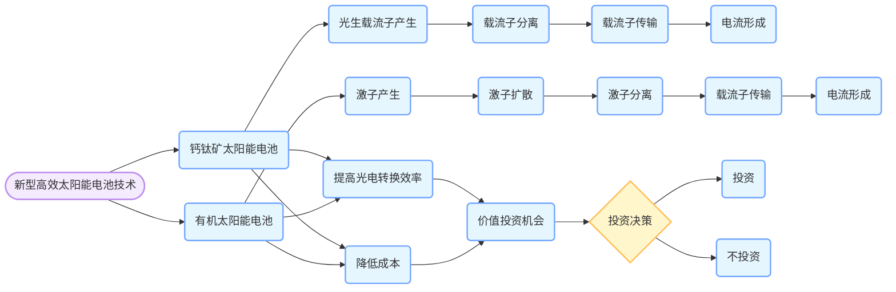

# 价值投资中的新型高效太阳能电池技术

> 关键词：价值投资、新型高效太阳能电池技术、光伏产业、能源转型、电池效率、成本效益、市场前景

> 摘要：本文围绕价值投资中的新型高效太阳能电池技术展开深入探讨。在全球能源转型的大背景下，太阳能作为可再生能源的重要组成部分，新型高效太阳能电池技术的发展具有重要意义。文章详细介绍了相关核心概念，阐述了核心算法原理及操作步骤，通过数学模型和公式进行分析，结合项目实战案例进行代码实现与解读，探讨了实际应用场景，推荐了学习资源、开发工具和相关论文著作，最后总结了未来发展趋势与挑战，并对常见问题进行解答。旨在为投资者和相关技术人员提供全面、深入的参考，帮助他们更好地理解和把握新型高效太阳能电池技术在价值投资领域的机遇与挑战。

## 1. 背景介绍 
### 1.1 目的和范围
随着全球对清洁能源需求的不断增长，太阳能作为一种丰富、可持续的能源来源，受到了广泛关注。新型高效太阳能电池技术的研发和应用，对于提高太阳能发电效率、降低成本、推动能源转型具有关键作用。本文的目的在于深入探讨新型高效太阳能电池技术在价值投资中的相关问题，包括技术原理、市场前景、投资策略等。范围涵盖了多种新型太阳能电池技术，如钙钛矿太阳能电池、有机太阳能电池等，以及它们在不同应用场景下的投资价值分析。

### 1.2 预期读者
本文预期读者包括对价值投资感兴趣的投资者，希望了解新型高效太阳能电池技术发展趋势和投资机会；光伏产业的技术人员和研究人员，可从中获取最新的技术信息和研究成果；相关领域的学者和学生，作为学术研究和学习的参考资料；政策制定者和行业监管人员，有助于制定合理的产业政策和监管措施。

### 1.3 文档结构概述
本文共分为十个部分。第一部分背景介绍，阐述了文章的目的、预期读者和文档结构概述，并给出术语表。第二部分介绍核心概念与联系，包括新型高效太阳能电池技术的基本原理和架构。第三部分讲解核心算法原理及具体操作步骤，结合 Python 源代码进行详细阐述。第四部分通过数学模型和公式对相关技术进行分析，并举例说明。第五部分是项目实战，包括开发环境搭建、源代码实现和代码解读。第六部分探讨实际应用场景。第七部分推荐工具和资源，包括学习资源、开发工具框架和相关论文著作。第八部分总结未来发展趋势与挑战。第九部分是附录，解答常见问题。第十部分提供扩展阅读和参考资料。

### 1.4 术语表
#### 1.4.1 核心术语定义
- **价值投资**：一种投资策略，强调通过对资产内在价值的评估，寻找被低估的投资机会，以实现长期的资本增值。
- **新型高效太阳能电池技术**：区别于传统硅基太阳能电池技术，具有更高的光电转换效率、更低的成本或其他优势的太阳能电池技术，如钙钛矿太阳能电池、有机太阳能电池等。
- **光电转换效率**：太阳能电池将光能转换为电能的效率，是衡量太阳能电池性能的重要指标。
- **光伏产业**：利用太阳能发电的产业，包括太阳能电池的研发、生产、应用等环节。

#### 1.4.2 相关概念解释
- **能源转型**：指从传统的化石能源向可再生能源的转变过程，旨在减少对环境的影响，实现可持续发展。
- **太阳能资源**：太阳辐射所蕴含的能量，是一种丰富、可再生的能源来源。
- **电池成本**：包括原材料成本、制造成本、设备成本等，是影响太阳能电池市场竞争力的重要因素。

#### 1.4.3 缩略词列表
- **PV**：Photovoltaic，光伏
- **PSC**：Perovskite Solar Cell，钙钛矿太阳能电池
- **OSC**：Organic Solar Cell，有机太阳能电池

## 2. 核心概念与联系 
### 新型高效太阳能电池技术的基本原理
新型高效太阳能电池技术的核心在于提高太阳能电池的光电转换效率和降低成本。不同类型的新型太阳能电池技术具有不同的工作原理。

#### 钙钛矿太阳能电池
钙钛矿太阳能电池的基本结构由电子传输层、钙钛矿光吸收层、空穴传输层和电极组成。其工作原理基于光生载流子的产生、分离和传输。当太阳光照射到钙钛矿光吸收层时，光子被吸收，产生电子 - 空穴对。电子通过电子传输层传输到负极，空穴通过空穴传输层传输到正极，从而形成电流。

#### 有机太阳能电池
有机太阳能电池主要由给体材料和受体材料组成的活性层、电极等部分构成。其工作原理是当太阳光照射到活性层时，给体材料吸收光子产生激子，激子扩散到给体 - 受体界面后分离成自由电子和空穴，电子和空穴分别向受体和给体材料中传输，最终被电极收集形成电流。

### 核心概念架构的文本示意图
新型高效太阳能电池技术的核心概念架构可以用以下文本描述：

新型高效太阳能电池技术以提高光电转换效率和降低成本为目标，涵盖多种电池类型，如钙钛矿太阳能电池和有机太阳能电池。这些电池技术涉及材料科学、物理、化学等多个学科领域，通过优化材料性能、电池结构和制备工艺来实现性能提升。在价值投资领域，新型高效太阳能电池技术的发展前景、市场需求、成本效益等因素影响着投资决策。同时，政策支持、技术创新等外部因素也对其发展和投资价值产生重要影响。

### Mermaid 流程图


## 3. 核心算法原理 & 具体操作步骤 
### 钙钛矿太阳能电池性能优化算法原理
钙钛矿太阳能电池的性能优化主要涉及材料性能优化和电池结构设计。以下是一个简化的性能优化算法原理，通过 Python 代码实现：

```python
import numpy as np

# 定义钙钛矿太阳能电池的初始参数
initial_bandgap = 1.5  # 初始带隙能量（eV）
initial_electron_mobility = 100  # 初始电子迁移率（cm^2/Vs）
initial_hole_mobility = 50  # 初始空穴迁移率（cm^2/Vs）

# 定义优化目标函数，这里假设目标是最大化光电转换效率
def objective_function(bandgap, electron_mobility, hole_mobility):
    # 简单的效率计算公式，实际情况会更复杂
    efficiency = 0.5 * (electron_mobility + hole_mobility) / bandgap
    return efficiency

# 定义优化步骤
def optimization_step(current_bandgap, current_electron_mobility, current_hole_mobility, step_size):
    # 随机扰动参数
    new_bandgap = current_bandgap + np.random.uniform(-step_size, step_size)
    new_electron_mobility = current_electron_mobility + np.random.uniform(-step_size, step_size)
    new_hole_mobility = current_hole_mobility + np.random.uniform(-step_size, step_size)

    # 计算当前和新的目标函数值
    current_efficiency = objective_function(current_bandgap, current_electron_mobility, current_hole_mobility)
    new_efficiency = objective_function(new_bandgap, new_electron_mobility, new_hole_mobility)

    # 如果新的效率更高，则更新参数
    if new_efficiency > current_efficiency:
        return new_bandgap, new_electron_mobility, new_hole_mobility
    else:
        return current_bandgap, current_electron_mobility, current_hole_mobility

# 进行优化迭代
num_iterations = 100
step_size = 0.1

for i in range(num_iterations):
    initial_bandgap, initial_electron_mobility, initial_hole_mobility = optimization_step(initial_bandgap, initial_electron_mobility, initial_hole_mobility, step_size)

# 输出优化后的参数和效率
final_efficiency = objective_function(initial_bandgap, initial_electron_mobility, initial_hole_mobility)
print(f"优化后的带隙能量: {initial_bandgap} eV")
print(f"优化后的电子迁移率: {initial_electron_mobility} cm^2/Vs")
print(f"优化后的空穴迁移率: {initial_hole_mobility} cm^2/Vs")
print(f"优化后的光电转换效率: {final_efficiency}")
```

### 具体操作步骤
1. **数据准备**：收集钙钛矿太阳能电池的相关参数，如带隙能量、电子迁移率、空穴迁移率等。
2. **定义目标函数**：根据实际需求，定义一个目标函数来衡量电池性能，如光电转换效率。
3. **选择优化算法**：根据问题的特点，选择合适的优化算法，如随机搜索、遗传算法等。
4. **进行优化迭代**：在每次迭代中，对参数进行扰动，计算新的目标函数值，并根据目标函数值的变化更新参数。
5. **输出结果**：迭代结束后，输出优化后的参数和目标函数值。

## 4. 数学模型和公式 & 详细讲解 & 举例说明 
### 光电转换效率的数学模型
光电转换效率 $\eta$ 是衡量太阳能电池性能的重要指标，其计算公式为：

$$\eta = \frac{P_{out}}{P_{in}} \times 100\%$$

其中，$P_{out}$ 是太阳能电池的输出功率，$P_{in}$ 是入射光的功率。

### 详细讲解
输出功率 $P_{out}$ 可以通过电流 $I$ 和电压 $V$ 的乘积来计算，即 $P_{out} = I \times V$。入射光的功率 $P_{in}$ 可以通过光照强度 $E$ 和电池面积 $A$ 的乘积来计算，即 $P_{in} = E \times A$。

### 举例说明
假设一个太阳能电池的光照强度 $E = 1000 W/m^2$，电池面积 $A = 0.01 m^2$，输出电流 $I = 0.5 A$，输出电压 $V = 2 V$。则入射光的功率为：

$$P_{in} = E \times A = 1000 W/m^2 \times 0.01 m^2 = 10 W$$

输出功率为：

$$P_{out} = I \times V = 0.5 A \times 2 V = 1 W$$

光电转换效率为：

$$\eta = \frac{P_{out}}{P_{in}} \times 100\% = \frac{1 W}{10 W} \times 100\% = 10\%$$

## 5. 项目实战：代码实际案例和详细解释说明 
### 5.1  开发环境搭建
#### 硬件环境
- 计算机：具备足够的计算资源，如多核 CPU、较大的内存和硬盘空间。
- 实验设备：如太阳能模拟器、万用表、示波器等，用于测试太阳能电池的性能。

#### 软件环境
- 操作系统：Windows、Linux 或 macOS。
- 编程语言：Python，建议使用 Anaconda 集成环境。
- 开发工具：PyCharm、Jupyter Notebook 等。

### 5.2  源代码详细实现和代码解读
以下是一个简单的 Python 代码示例，用于模拟钙钛矿太阳能电池的电流 - 电压特性：

```python
import numpy as np
import matplotlib.pyplot as plt

# 定义钙钛矿太阳能电池的参数
Voc = 1.2  # 开路电压（V）
Isc = 2.0  # 短路电流（A）
FF = 0.7  # 填充因子

# 定义电压范围
V = np.linspace(0, Voc, 100)

# 计算电流 - 电压特性曲线
I = Isc * (1 - (np.exp(V / (0.026 * FF)) - 1) / (np.exp(Voc / (0.026 * FF)) - 1))

# 绘制电流 - 电压特性曲线
plt.plot(V, I)
plt.xlabel('电压 (V)')
plt.ylabel('电流 (A)')
plt.title('钙钛矿太阳能电池电流 - 电压特性曲线')
plt.grid(True)
plt.show()
```

### 代码解读与分析
1. **参数定义**：定义了钙钛矿太阳能电池的开路电压 $Voc$、短路电流 $Isc$ 和填充因子 $FF$。
2. **电压范围定义**：使用 `np.linspace` 函数定义了电压范围。
3. **电流 - 电压特性曲线计算**：根据简化的数学模型计算电流 - 电压特性曲线。
4. **绘图**：使用 `matplotlib` 库绘制电流 - 电压特性曲线。

通过分析电流 - 电压特性曲线，可以了解太阳能电池的性能，如开路电压、短路电流、填充因子等。这些参数对于评估太阳能电池的光电转换效率和投资价值具有重要意义。

## 6. 实际应用场景 
### 分布式光伏发电
新型高效太阳能电池技术在分布式光伏发电领域具有广阔的应用前景。分布式光伏发电系统通常安装在建筑物屋顶、工业园区等场所，具有就近发电、就近消纳的特点。新型高效太阳能电池技术可以提高光伏发电系统的效率和发电量，降低成本，从而提高分布式光伏发电的经济性和竞争力。

### 太阳能汽车
太阳能汽车是一种利用太阳能作为动力源的汽车。新型高效太阳能电池技术可以提高太阳能汽车的太阳能转换效率，增加汽车的续航里程。同时，新型太阳能电池的轻薄、柔性等特点也使得其更容易集成到汽车的车身结构中，提高汽车的美观性和实用性。

### 空间应用
在空间应用领域，太阳能是主要的能源来源。新型高效太阳能电池技术可以提高卫星、空间站等航天器的能源供应效率，延长其使用寿命。同时，新型太阳能电池的高比功率、抗辐射等特性也使其更适合在空间环境中使用。

## 7. 工具和资源推荐
### 7.1 学习资源推荐
#### 7.1.1 书籍推荐
- 《太阳能光伏发电技术》：全面介绍了太阳能光伏发电的基本原理、技术和应用。
- 《新型太阳能电池材料与器件》：详细阐述了新型太阳能电池的材料、制备工艺和性能。
- 《价值投资：从格雷厄姆到巴菲特》：深入讲解了价值投资的理论和方法。

#### 7.1.2 在线课程
- Coursera 上的“太阳能光伏发电技术”课程：由知名高校的教授授课，内容丰富，讲解详细。
- edX 上的“新型能源材料与器件”课程：介绍了新型能源材料的研究进展和应用前景。
- 中国大学 MOOC 上的“价值投资分析”课程：帮助学习者掌握价值投资的分析方法和技巧。

#### 7.1.3 技术博客和网站
- 太阳能光伏网：提供太阳能光伏行业的最新资讯、技术动态和市场分析。
- 新材料在线：专注于新材料领域的技术创新和应用推广，包含大量新型太阳能电池技术的相关内容。
- Seeking Alpha：提供价值投资领域的研究报告、分析文章和投资建议。

### 7.2 开发工具框架推荐
#### 7.2.1 IDE和编辑器
- PyCharm：功能强大的 Python 集成开发环境，适合开发和调试与新型高效太阳能电池技术相关的 Python 代码。
- Jupyter Notebook：交互式的编程环境，方便进行数据分析、可视化和模型验证。
- Visual Studio Code：轻量级的代码编辑器，支持多种编程语言和插件扩展。

#### 7.2.2 调试和性能分析工具
- PDB：Python 内置的调试器，可用于调试 Python 代码。
- Numba：用于加速 Python 代码的编译器，可提高计算性能。
- Profiler：Python 内置的性能分析工具，可帮助分析代码的性能瓶颈。

#### 7.2.3 相关框架和库
- NumPy：用于科学计算的 Python 库，提供了高效的数组操作和数学函数。
- Pandas：用于数据处理和分析的 Python 库，可方便地处理和分析太阳能电池的实验数据。
- Matplotlib：用于数据可视化的 Python 库，可绘制各种类型的图表和图形。

### 7.3 相关论文著作推荐
#### 7.3.1 经典论文
- “Efficient Hybrid Solar Cells Based on Meso - Superstructured Organometal Halide Perovskites”：该论文首次报道了高效的钙钛矿太阳能电池，为钙钛矿太阳能电池的研究奠定了基础。
- “Bulk Heterojunction Solar Cells with Internal Quantum Efficiency Approaching 100%”：介绍了有机太阳能电池的研究进展，提出了提高有机太阳能电池效率的方法。

#### 7.3.2 最新研究成果
- 关注《Nature》、《Science》、《Advanced Materials》等顶级学术期刊，获取新型高效太阳能电池技术的最新研究成果。
- 参加国际太阳能光伏会议和学术研讨会，了解行业最新动态和前沿技术。

#### 7.3.3 应用案例分析
- 分析国内外知名企业的太阳能光伏发电项目案例，了解新型高效太阳能电池技术在实际应用中的效果和经验。
- 研究太阳能汽车、空间应用等领域的成功案例，探索新型高效太阳能电池技术的应用前景和发展趋势。

## 8. 总结：未来发展趋势与挑战
### 未来发展趋势
- **效率提升**：新型高效太阳能电池技术将不断提高光电转换效率，接近甚至突破理论极限。
- **成本降低**：随着技术的进步和规模化生产，太阳能电池的成本将进一步降低，提高其市场竞争力。
- **多元化应用**：新型高效太阳能电池技术将在更多领域得到应用，如可穿戴设备、智能家居等。
- **与其他技术融合**：与储能技术、智能电网技术等融合，实现太阳能的高效利用和稳定供应。

### 挑战
- **稳定性问题**：部分新型太阳能电池技术存在稳定性差的问题，需要进一步提高其使用寿命和可靠性。
- **环境适应性**：太阳能电池在不同环境条件下的性能表现差异较大，需要提高其环境适应性。
- **市场竞争**：随着新型高效太阳能电池技术的发展，市场竞争将日益激烈，企业需要不断创新和提高产品质量。
- **政策不确定性**：政策的变化可能会对太阳能产业的发展产生影响，需要关注政策动态，及时调整发展策略。

## 9. 附录：常见问题与解答
### 新型高效太阳能电池技术的投资风险有哪些？
新型高效太阳能电池技术的投资风险包括技术风险、市场风险、政策风险等。技术风险主要指技术研发失败或技术更新换代快，导致投资项目无法达到预期目标。市场风险包括市场需求不足、市场竞争激烈等。政策风险指政策的变化可能会对太阳能产业的发展产生不利影响。

### 如何评估新型高效太阳能电池技术的投资价值？
评估新型高效太阳能电池技术的投资价值需要综合考虑多个因素，如技术成熟度、市场前景、成本效益、政策支持等。可以通过分析技术指标、市场数据、财务报表等方式进行评估。同时，还需要关注行业发展趋势和竞争对手的情况。

### 新型高效太阳能电池技术的发展对传统太阳能电池产业有何影响？
新型高效太阳能电池技术的发展可能会对传统太阳能电池产业产生一定的冲击。一方面，新型太阳能电池技术的出现可能会抢占传统太阳能电池的市场份额；另一方面，也会促使传统太阳能电池产业进行技术升级和创新，提高产品性能和竞争力。

## 10. 扩展阅读 & 参考资料
- 《太阳能光伏发电产业发展报告》
- 《新型能源材料研究进展》
- 《价值投资理论与实践》
- 相关学术期刊和会议论文
- 行业研究报告和市场分析报告

作者：AI天才研究院/AI Genius Institute & 禅与计算机程序设计艺术 /Zen And The Art of Computer Programming