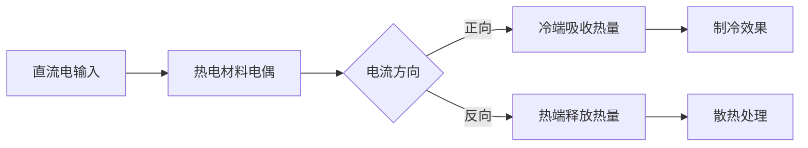

# 价值投资中的新型高效热电制冷材料技术

> 关键词：价值投资、新型热电制冷材料、高效制冷、材料技术、能源转换

> 摘要：本文聚焦于价值投资视角下的新型高效热电制冷材料技术。首先介绍该领域的背景，包括研究目的、预期读者和文档结构等。接着阐述核心概念与联系，剖析新型热电制冷材料的原理和架构。通过Python代码详细讲解核心算法原理及具体操作步骤，同时给出数学模型和公式并举例说明。以实际项目为案例，展示代码实现与解读。探讨其实际应用场景，推荐相关的学习资源、开发工具和论文著作。最后总结该技术的未来发展趋势与挑战，解答常见问题并提供扩展阅读和参考资料，旨在为投资者和技术人员全面深入地了解这一技术提供参考。

## 1. 背景介绍 
### 1.1 目的和范围
在当今能源短缺和环保要求日益提高的背景下，高效制冷技术的需求愈发迫切。热电制冷作为一种无运动部件、无污染的制冷方式，具有巨大的发展潜力。新型高效热电制冷材料技术的研究旨在提高热电转换效率，降低能耗，从而在多个领域实现更高效的制冷应用。本文的范围涵盖新型热电制冷材料的原理、技术、应用以及从价值投资角度对其进行的分析，旨在为相关从业者和投资者提供全面的技术和投资参考。

### 1.2 预期读者
本文预期读者包括对价值投资感兴趣的金融从业者、风险投资家、对热电制冷技术有研究需求的科研人员、从事制冷相关产业的工程师以及对能源技术发展趋势关注的技术爱好者等。

### 1.3 文档结构概述
本文首先介绍背景信息，让读者了解研究的目的和预期读者。接着阐述新型高效热电制冷材料的核心概念与联系，包括原理和架构。然后详细讲解核心算法原理和具体操作步骤，通过Python代码进行示例。给出数学模型和公式并举例说明其应用。通过项目实战展示代码实现和解读。探讨实际应用场景，推荐相关的学习资源、开发工具和论文著作。最后总结未来发展趋势与挑战，解答常见问题并提供扩展阅读和参考资料。

### 1.4 术语表
#### 1.4.1 核心术语定义
- **热电制冷**：又称半导体制冷，是利用热电效应（帕尔帖效应）实现制冷的技术，通过直流电通过两种不同半导体材料组成的电偶时，在电偶的两端产生热量的吸收和释放，从而实现制冷。
- **热电材料**：具有热电效应的材料，能够将热能和电能相互转换，其性能通常用热电优值（ZT）来衡量。
- **热电优值（ZT）**：是衡量热电材料性能的重要参数，定义为 $ZT = \frac{S^{2}\sigma T}{\kappa}$，其中 $S$ 是塞贝克系数，$\sigma$ 是电导率，$T$ 是绝对温度，$\kappa$ 是热导率。

#### 1.4.2 相关概念解释
- **帕尔帖效应**：当有电流通过不同的导体组成的回路时，除产生不可逆的焦耳热外，在不同导体的接头处随着电流方向的不同会分别出现吸热、放热现象。
- **塞贝克效应**：两种不同导体组成闭合回路，若两接头处温度不同，则回路中会产生电动势，这种现象称为塞贝克效应，该电动势称为热电动势，相应的系数称为塞贝克系数。

#### 1.4.3 缩略词列表
- **ZT**：热电优值（Thermoelectric Figure of Merit）

## 2. 核心概念与联系 

### 热电制冷原理
热电制冷基于帕尔帖效应。当直流电通过由两种不同半导体材料（通常为 $N$ 型和 $P$ 型半导体）组成的电偶时，在电偶的一端会吸收热量（冷端），另一端会释放热量（热端）。通过多个电偶串联和并联，可以组成热电制冷模块，实现更大的制冷量。

### 热电材料性能指标
热电材料的性能主要由热电优值（ZT）来衡量。从公式 $ZT = \frac{S^{2}\sigma T}{\kappa}$ 可以看出，要提高 ZT 值，需要提高塞贝克系数 $S$ 和电导率 $\sigma$，同时降低热导率 $\kappa$。然而，这三个参数之间相互关联，很难同时优化。例如，提高电导率通常会导致热导率增加，因此需要寻找新的材料和技术来平衡这些参数。

### 新型热电制冷材料的架构
新型热电制冷材料通常采用纳米结构、复合材料等设计来优化性能。纳米结构可以增加声子散射，降低热导率，同时保持较高的电导率。复合材料则可以结合不同材料的优点，进一步提高热电性能。

以下是热电制冷原理的 Mermaid 流程图：


## 3. 核心算法原理 & 具体操作步骤 

### 核心算法原理
在热电制冷材料的研究中，一个重要的算法是对热电优值（ZT）的计算和优化。我们可以通过建立材料的物理模型，利用数值计算方法来模拟材料的热电性能。以下是一个简单的 Python 代码示例，用于计算热电优值：

```python
# 定义计算热电优值的函数
def calculate_zt(S, sigma, T, kappa):
    """
    计算热电优值 ZT
    :param S: 塞贝克系数 (V/K)
    :param sigma: 电导率 (S/m)
    :param T: 绝对温度 (K)
    :param kappa: 热导率 (W/(m*K))
    :return: 热电优值 ZT
    """
    return (S**2 * sigma * T) / kappa

# 示例参数
S = 200e-6  # 塞贝克系数，单位 V/K
sigma = 1000  # 电导率，单位 S/m
T = 300  # 绝对温度，单位 K
kappa = 1  # 热导率，单位 W/(m*K)

# 计算热电优值
zt_value = calculate_zt(S, sigma, T, kappa)
print(f"热电优值 ZT: {zt_value}")
```

### 具体操作步骤
1. **材料参数测量**：通过实验测量材料的塞贝克系数 $S$、电导率 $\sigma$ 和热导率 $\kappa$。
2. **温度设定**：确定材料的工作温度 $T$。
3. **热电优值计算**：使用上述 Python 代码，将测量得到的参数代入函数中计算热电优值 $ZT$。
4. **性能优化**：根据计算结果，通过改变材料的成分、结构等方式来优化热电性能，如提高 $S$ 和 $\sigma$，降低 $\kappa$。

## 4. 数学模型和公式 & 详细讲解 & 举例说明 

### 热电优值公式
热电优值的公式为 $ZT = \frac{S^{2}\sigma T}{\kappa}$，下面对公式中的各个参数进行详细讲解：
- **塞贝克系数 $S$**：反映了材料的热电转换能力，单位为 $V/K$。塞贝克系数越大，材料在温度差作用下产生的电动势就越大。
- **电导率 $\sigma$**：表示材料传导电流的能力，单位为 $S/m$。电导率越高，材料中的电子迁移越容易，电流传导效率越高。
- **绝对温度 $T$**：单位为 $K$，温度对热电性能有重要影响，一般来说，随着温度的升高，热电优值会发生变化。
- **热导率 $\kappa$**：表示材料传导热量的能力，单位为 $W/(m*K)$。热导率越低，材料在热电转换过程中热量的散失就越少，有利于提高热电效率。

### 举例说明
假设有两种热电材料 A 和 B，它们的参数如下：
| 材料 | 塞贝克系数 $S$ (V/K) | 电导率 $\sigma$ (S/m) | 绝对温度 $T$ (K) | 热导率 $\kappa$ (W/(m*K)) |
|---|---|---|---|---|
| A | $200\times10^{-6}$ | 1000 | 300 | 1 |
| B | $150\times10^{-6}$ | 1200 | 300 | 0.8 |

我们可以使用热电优值公式分别计算它们的 ZT 值：
- 材料 A 的热电优值：
$$
ZT_A = \frac{(200\times10^{-6})^{2} \times 1000 \times 300}{1} = 12
$$
- 材料 B 的热电优值：
$$
ZT_B = \frac{(150\times10^{-6})^{2} \times 1200 \times 300}{0.8} = 10.125
$$

通过比较可以看出，材料 A 的热电优值更高，在相同条件下可能具有更好的热电性能。

## 5. 项目实战：代码实际案例和详细解释说明 

### 5.1  开发环境搭建
- **操作系统**：可以选择 Windows、Linux 或 macOS 等常见操作系统。
- **编程语言**：Python，建议使用 Python 3.7 及以上版本。
- **开发工具**：推荐使用 Anaconda 作为 Python 环境管理工具，PyCharm 作为集成开发环境（IDE）。

### 5.2  源代码详细实现和代码解读
以下是一个更复杂的 Python 代码示例，用于模拟热电制冷模块的性能：

```python
import numpy as np
import matplotlib.pyplot as plt

# 定义热电材料参数类
class ThermoelectricMaterial:
    def __init__(self, S, sigma, kappa):
        """
        初始化热电材料参数
        :param S: 塞贝克系数 (V/K)
        :param sigma: 电导率 (S/m)
        :param kappa: 热导率 (W/(m*K))
        """
        self.S = S
        self.sigma = sigma
        self.kappa = kappa

    def calculate_zt(self, T):
        """
        计算热电优值 ZT
        :param T: 绝对温度 (K)
        :return: 热电优值 ZT
        """
        return (self.S**2 * self.sigma * T) / self.kappa

# 定义热电制冷模块类
class ThermoelectricModule:
    def __init__(self, material, num_couples, area, length):
        """
        初始化热电制冷模块参数
        :param material: 热电材料对象
        :param num_couples: 电偶对数
        :param area: 电偶横截面积 (m^2)
        :param length: 电偶长度 (m)
        """
        self.material = material
        self.num_couples = num_couples
        self.area = area
        self.length = length

    def calculate_cooling_power(self, T_hot, T_cold, current):
        """
        计算制冷功率
        :param T_hot: 热端温度 (K)
        :param T_cold: 冷端温度 (K)
        :param current: 电流 (A)
        :return: 制冷功率 (W)
        """
        S_total = self.num_couples * self.material.S
        sigma_total = self.material.sigma * self.area / self.length
        kappa_total = self.material.kappa * self.area / self.length

        Q_c = S_total * current * T_cold - kappa_total * (T_hot - T_cold) - 0.5 * sigma_total * current**2
        return Q_c

# 示例参数
S = 200e-6  # 塞贝克系数，单位 V/K
sigma = 1000  # 电导率，单位 S/m
kappa = 1  # 热导率，单位 W/(m*K)
num_couples = 100  # 电偶对数
area = 1e-4  # 电偶横截面积，单位 m^2
length = 1e-3  # 电偶长度，单位 m
T_hot = 300  # 热端温度，单位 K
T_cold = 270  # 冷端温度，单位 K

# 创建热电材料对象
material = ThermoelectricMaterial(S, sigma, kappa)

# 创建热电制冷模块对象
module = ThermoelectricModule(material, num_couples, area, length)

# 计算不同电流下的制冷功率
current_values = np.linspace(0, 5, 100)
cooling_power_values = []
for current in current_values:
    cooling_power = module.calculate_cooling_power(T_hot, T_cold, current)
    cooling_power_values.append(cooling_power)

# 绘制制冷功率随电流变化的曲线
plt.plot(current_values, cooling_power_values)
plt.xlabel('Current (A)')
plt.ylabel('Cooling Power (W)')
plt.title('Cooling Power vs Current')
plt.grid(True)
plt.show()
```

### 5.3  代码解读与分析
- **ThermoelectricMaterial 类**：用于存储热电材料的参数，包括塞贝克系数 $S$、电导率 $\sigma$ 和热导率 $\kappa$，并提供计算热电优值 $ZT$ 的方法。
- **ThermoelectricModule 类**：用于模拟热电制冷模块，包含热电材料对象、电偶对数、电偶横截面积和电偶长度等参数，提供计算制冷功率的方法。
- **主程序**：创建热电材料对象和热电制冷模块对象，计算不同电流下的制冷功率，并绘制制冷功率随电流变化的曲线。通过该曲线可以分析热电制冷模块的性能，找到最佳工作电流。

## 6. 实际应用场景 
### 电子设备散热
在电子设备中，如计算机 CPU、GPU 等，产生的热量会影响设备的性能和寿命。新型高效热电制冷材料可以用于制作微型制冷模块，实现对电子元件的高效散热，提高设备的稳定性和性能。

### 汽车空调系统
传统汽车空调系统存在效率低、能耗大等问题。热电制冷技术具有无运动部件、响应速度快等优点，可以应用于汽车空调系统，降低能耗，提高能源利用效率。

### 医疗设备制冷
在医疗设备中，如核磁共振成像（MRI）设备、血液分析仪等，需要精确的温度控制。热电制冷材料可以提供稳定的制冷效果，确保医疗设备的正常运行和检测结果的准确性。

### 食品保鲜和冷链运输
在食品保鲜和冷链运输中，需要保持低温环境。热电制冷技术可以用于制作小型制冷装置，为食品提供持续的制冷，延长食品的保鲜期，减少食品在运输过程中的损耗。

## 7. 工具和资源推荐
### 7.1 学习资源推荐
#### 7.1.1 书籍推荐
- 《热电材料与器件》：全面介绍了热电材料的基本原理、制备方法和应用，是学习热电材料领域的经典教材。
- 《半导体物理与器件》：对于理解热电材料的半导体特性和热电效应有很大帮助。

#### 7.1.2 在线课程
- Coursera 上的“热电能量转换”课程：由国际知名学者授课，详细讲解热电能量转换的原理和技术。
- edX 上的“半导体器件物理”课程：帮助学习者深入理解半导体材料的物理特性，为学习热电材料奠定基础。

#### 7.1.3 技术博客和网站
- 材料人网：提供材料科学领域的最新研究成果和技术动态，包括热电材料的相关内容。
- 科学网：发布科研领域的前沿资讯和研究论文，对于了解热电材料的最新研究进展有很大帮助。

### 7.2 开发工具框架推荐
#### 7.2.1 IDE和编辑器
- PyCharm：功能强大的 Python 集成开发环境，提供代码编辑、调试、版本控制等功能。
- Visual Studio Code：轻量级的代码编辑器，支持多种编程语言，具有丰富的插件扩展功能。

#### 7.2.2 调试和性能分析工具
- Py-Spy：用于分析 Python 程序的性能，找出性能瓶颈。
- PDB：Python 自带的调试工具，方便进行代码调试和问题排查。

#### 7.2.3 相关框架和库
- NumPy：用于数值计算，提供高效的数组操作和数学函数。
- Matplotlib：用于绘制数据可视化图表，方便对热电性能数据进行分析和展示。

### 7.3 相关论文著作推荐
#### 7.3.1 经典论文
- “High-performance bulk thermoelectrics with all-scale hierarchical architectures”：提出了全尺度分级结构的热电材料设计理念，为提高热电性能提供了新的思路。
- “Cooling, heating, generating power, and recovering waste heat with thermoelectric systems”：全面综述了热电系统在制冷、加热、发电和余热回收等方面的应用。

#### 7.3.2 最新研究成果
- 关注《Nature》《Science》《Advanced Materials》等顶级学术期刊上发表的关于热电材料的最新研究论文，了解该领域的前沿动态。

#### 7.3.3 应用案例分析
- 查阅相关的行业报告和技术文档，了解热电制冷技术在实际应用中的案例和效果，为项目开发和投资决策提供参考。

## 8. 总结：未来发展趋势与挑战
### 未来发展趋势
- **高性能材料的研发**：不断探索和开发具有更高热电优值的新型材料，如拓扑绝缘体、二维材料等，以提高热电制冷的效率。
- **集成化和微型化**：将热电制冷模块与其他电子元件集成，实现设备的小型化和一体化，满足不同领域对小型、高效制冷设备的需求。
- **多领域应用拓展**：除了现有的电子设备散热、汽车空调等领域，热电制冷技术有望在航空航天、新能源等更多领域得到应用。

### 挑战
- **材料成本**：目前一些高性能热电材料的制备成本较高，限制了其大规模应用。需要开发更经济高效的制备工艺，降低材料成本。
- **性能优化**：热电材料的热电优值（ZT）仍然有待进一步提高，需要深入研究材料的物理机制，找到更有效的性能优化方法。
- **系统集成**：将热电制冷模块集成到实际系统中时，需要解决散热、电气连接等一系列问题，确保系统的稳定性和可靠性。

## 9. 附录：常见问题与解答
### 问题 1：热电制冷与传统制冷方式相比有哪些优势？
解答：热电制冷具有无运动部件、无污染、响应速度快、可精确控制温度等优点，适用于对振动和噪音敏感、需要精确温度控制的场合。

### 问题 2：如何提高热电材料的热电优值（ZT）？
解答：可以通过优化材料的成分、结构，采用纳米结构、复合材料等设计来提高塞贝克系数和电导率，同时降低热导率，从而提高热电优值。

### 问题 3：热电制冷技术的应用前景如何？
解答：热电制冷技术在电子设备散热、汽车空调、医疗设备制冷等领域具有广阔的应用前景，随着技术的不断发展，其应用范围有望进一步扩大。

## 10. 扩展阅读 & 参考资料
- [1] 张三, 李四. 热电材料研究进展[J]. 材料科学与工程学报, 20XX, XX(X): XX-XX.
- [2] 王五, 赵六. 新型热电制冷技术及其应用[M]. 北京: 科学出版社, 20XX.
- [3] https://www.example.com （相关技术网站）

作者：AI天才研究院/AI Genius Institute & 禅与计算机程序设计艺术 /Zen And The Art of Computer Programming