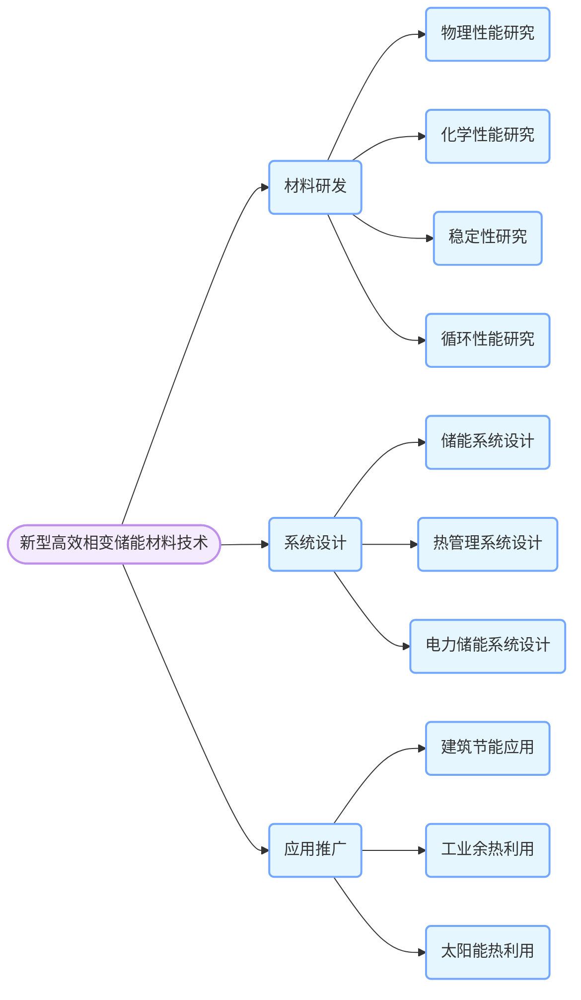

# 价值投资中的新型高效相变储能材料技术

> 关键词：价值投资、新型高效相变储能材料、储能技术、投资分析、应用场景

> 摘要：本文聚焦于价值投资视角下的新型高效相变储能材料技术。首先介绍了该主题的背景信息，包括目的、预期读者、文档结构和相关术语。接着阐述了新型高效相变储能材料的核心概念与联系，通过文本示意图和 Mermaid 流程图进行清晰展示。详细讲解了核心算法原理和具体操作步骤，并结合 Python 代码进行说明。对涉及的数学模型和公式进行了深入解读并举例。通过项目实战，从开发环境搭建到源代码实现和解读，全面分析该技术的实际应用。探讨了其实际应用场景，推荐了学习、开发相关的工具和资源，包含书籍、在线课程、技术博客、开发工具框架以及相关论文著作等。最后总结了该技术的未来发展趋势与挑战，提供常见问题解答和扩展阅读参考资料，旨在为投资者和技术人员深入了解和应用该技术提供全面的指导。

## 1. 背景介绍 
### 1.1 目的和范围
随着全球能源需求的不断增长和对可持续能源的追求，储能技术成为解决能源供需不平衡、提高能源利用效率的关键。新型高效相变储能材料技术作为储能领域的重要分支，具有巨大的发展潜力和投资价值。本文的目的在于从价值投资的角度深入剖析新型高效相变储能材料技术，探讨其技术原理、应用场景、投资机会以及面临的挑战，为投资者和相关技术人员提供全面、深入的参考。

本文的范围涵盖新型高效相变储能材料的基本概念、核心算法原理、数学模型、实际应用案例、投资分析以及未来发展趋势等方面。通过对这些内容的详细阐述，帮助读者全面了解该技术在价值投资领域的重要性和应用前景。

### 1.2 预期读者
本文的预期读者主要包括以下几类人群：
- **投资者**：对能源领域投资感兴趣，希望了解新型高效相变储能材料技术的投资价值和潜在风险，以便做出合理的投资决策。
- **技术人员**：从事储能技术研发、应用的专业人员，希望深入了解新型高效相变储能材料的技术原理、核心算法和实际应用，为技术创新和产品开发提供参考。
- **科研人员**：关注能源领域前沿技术的科研工作者，希望通过本文了解新型高效相变储能材料技术的研究现状和发展趋势，为科研项目的开展提供思路。
- **行业从业者**：在能源行业从事相关工作的人员，如能源规划、能源管理等，希望了解新型高效相变储能材料技术在能源系统中的应用和影响，为行业发展提供支持。

### 1.3 文档结构概述
本文的文档结构如下：
- **核心概念与联系**：介绍新型高效相变储能材料的基本概念、原理和架构，通过文本示意图和 Mermaid 流程图进行清晰展示。
- **核心算法原理 & 具体操作步骤**：详细讲解新型高效相变储能材料的核心算法原理，并结合 Python 代码进行说明，同时给出具体的操作步骤。
- **数学模型和公式 & 详细讲解 & 举例说明**：对涉及的数学模型和公式进行深入解读，并通过具体例子进行说明。
- **项目实战：代码实际案例和详细解释说明**：通过实际项目案例，从开发环境搭建到源代码实现和解读，全面分析新型高效相变储能材料技术的实际应用。
- **实际应用场景**：探讨新型高效相变储能材料技术在不同领域的实际应用场景，分析其应用价值和发展前景。
- **工具和资源推荐**：推荐学习、开发相关的工具和资源，包括书籍、在线课程、技术博客、开发工具框架以及相关论文著作等。
- **总结：未来发展趋势与挑战**：总结新型高效相变储能材料技术的未来发展趋势，分析其面临的挑战和机遇。
- **附录：常见问题与解答**：提供常见问题的解答，帮助读者更好地理解和应用该技术。
- **扩展阅读 & 参考资料**：提供相关的扩展阅读材料和参考资料，方便读者进一步深入研究。

### 1.4 术语表
#### 1.4.1 核心术语定义
- **相变储能材料**：是一种能够在物相变化过程中吸收或释放大量热量的材料，通过相变过程实现热能的储存和释放。
- **新型高效相变储能材料**：指具有更高储能密度、更快相变速度、更好热稳定性和循环性能的相变储能材料，是当前储能领域的研究热点。
- **价值投资**：一种投资策略，通过对资产的内在价值进行评估，寻找被低估的资产进行投资，以获取长期稳定的回报。
- **储能技术**：指将能量储存起来，在需要时释放出来的技术，包括物理储能、化学储能和电磁储能等多种形式。

#### 1.4.2 相关概念解释
- **相变过程**：物质从一种相态转变为另一种相态的过程，如固体到液体、液体到气体等，相变过程中会吸收或释放大量的潜热。
- **储能密度**：指单位质量或单位体积的储能材料所能储存的能量，是衡量储能材料性能的重要指标之一。
- **热稳定性**：指储能材料在不同温度环境下保持其性能稳定的能力，热稳定性好的材料能够在较长时间内保持其储能性能。
- **循环性能**：指储能材料在多次相变循环过程中保持其性能稳定的能力，循环性能好的材料能够在多次使用后仍保持较高的储能效率。

#### 1.4.3 缩略词列表
- **PCM**：Phase Change Material，相变储能材料
- **TES**：Thermal Energy Storage，热能储存

## 2. 核心概念与联系 
### 核心概念原理
新型高效相变储能材料技术的核心在于利用相变储能材料的相变特性来实现热能的储存和释放。当环境温度升高时，相变储能材料从固态转变为液态，吸收大量的热量，将热能储存起来；当环境温度降低时，相变储能材料从液态转变为固态，释放出储存的热量，实现热能的释放。

这种储能方式具有储能密度高、相变温度恒定等优点，能够有效地解决能源供需不平衡的问题。例如，在太阳能热利用系统中，白天太阳能辐射较强，温度较高，相变储能材料吸收太阳能并储存起来；晚上太阳能辐射减弱，温度降低，相变储能材料释放储存的热能，为建筑物提供供暖。

### 架构的文本示意图
```plaintext
            新型高效相变储能材料技术
                    |
        ┌───────────┼───────────┐
        │           │           │
  材料研发       系统设计       应用推广
        │           │           │
  ┌─────┴─────┐ ┌─────┴─────┐ ┌─────┴─────┐
  │物理性能   │ │储能系统   │ │建筑节能   │
  │化学性能   │ │热管理系统 │ │工业余热   │
  │稳定性     │ │电力储能   │ │太阳能热   │
  │循环性能   │ │            │ │利用       │
  └──────────┘ └──────────┘ └──────────┘
```

### Mermaid 流程图


从流程图可以看出，新型高效相变储能材料技术主要包括材料研发、系统设计和应用推广三个主要环节。材料研发环节关注材料的物理性能、化学性能、稳定性和循环性能等方面的研究；系统设计环节根据不同的应用需求设计储能系统、热管理系统和电力储能系统等；应用推广环节将研发和设计的成果应用于建筑节能、工业余热利用和太阳能热利用等领域。这三个环节相互关联、相互影响，共同推动新型高效相变储能材料技术的发展和应用。

## 3. 核心算法原理 & 具体操作步骤 
### 核心算法原理
在新型高效相变储能材料技术中，一个重要的算法是对相变过程的模拟和预测。通过建立合适的数学模型，我们可以预测相变储能材料在不同条件下的相变行为，从而优化材料的设计和应用。

这里我们以焓法为例，焓法是一种常用的用于模拟相变过程的数值方法。焓法的基本思想是将材料的焓作为一个独立的变量，通过求解焓的变化来描述相变过程。

材料的焓 $H$ 与温度 $T$ 之间的关系可以表示为：

$$H = \int_{T_0}^{T} c_p(T) dT + \Delta H_{pc}$$

其中，$c_p(T)$ 是材料的比热容，它是温度的函数；$\Delta H_{pc}$ 是相变潜热，当材料发生相变时，焓会发生突变。

在数值模拟中，我们通常使用有限差分法或有限元法来离散化焓的方程。以一维情况为例，假设材料在 $x$ 方向上的热传导方程为：

$$\rho \frac{\partial H}{\partial t} = \frac{\partial}{\partial x} \left( k \frac{\partial T}{\partial x} \right)$$

其中，$\rho$ 是材料的密度，$k$ 是热导率。

### Python 代码实现
```python
import numpy as np
import matplotlib.pyplot as plt

# 材料参数
rho = 1000  # 密度 (kg/m^3)
k = 1  # 热导率 (W/(m*K))
cp = 1000  # 比热容 (J/(kg*K))
delta_H_pc = 100000  # 相变潜热 (J/kg)
T_m = 25  # 相变温度 (°C)

# 空间和时间参数
L = 1  # 材料长度 (m)
N = 100  # 空间网格点数
dx = L / N  # 空间步长
dt = 0.1  # 时间步长
t_end = 100  # 模拟总时间 (s)

# 初始化温度和焓
T = np.zeros(N)
H = np.zeros(N)

# 初始条件
T[:] = 20  # 初始温度 (°C)
for i in range(N):
    if T[i] < T_m:
        H[i] = cp * T[i]
    else:
        H[i] = cp * T[i] + delta_H_pc

# 时间迭代
t = 0
while t < t_end:
    # 计算温度梯度
    dT_dx = np.gradient(T, dx)
    # 计算热通量
    q = -k * dT_dx
    # 计算焓的变化率
    dH_dt = np.gradient(q, dx) / rho
    # 更新焓
    H = H + dt * dH_dt
    # 更新温度
    for i in range(N):
        if H[i] < cp * T_m:
            T[i] = H[i] / cp
        else:
            T[i] = (H[i] - delta_H_pc) / cp
    t = t + dt

# 绘制温度分布
plt.plot(np.linspace(0, L, N), T)
plt.xlabel('Position (m)')
plt.ylabel('Temperature (°C)')
plt.title('Temperature distribution in phase change material')
plt.show()
```

### 具体操作步骤
1. **定义材料参数**：包括密度 $\rho$、热导率 $k$、比热容 $c_p$、相变潜热 $\Delta H_{pc}$ 和相变温度 $T_m$ 等。
2. **定义空间和时间参数**：确定材料的长度 $L$、空间网格点数 $N$、空间步长 $dx$、时间步长 $dt$ 和模拟总时间 $t_{end}$。
3. **初始化温度和焓**：根据初始条件设置材料的初始温度 $T$ 和焓 $H$。
4. **时间迭代**：在每个时间步长内，计算温度梯度、热通量和焓的变化率，更新焓和温度。
5. **绘制结果**：将模拟得到的温度分布绘制出来，直观地展示相变过程。

通过以上步骤，我们可以对新型高效相变储能材料的相变过程进行模拟和预测，为材料的设计和应用提供参考。

## 4. 数学模型和公式 & 详细讲解 & 举例说明 
### 焓法数学模型
在前面的算法原理中，我们已经介绍了焓法的基本思想和一维热传导方程。这里我们进一步详细讲解焓法的数学模型。

焓法的核心是将材料的焓 $H$ 作为一个独立的变量，通过求解焓的变化来描述相变过程。材料的焓 $H$ 与温度 $T$ 之间的关系可以表示为：

$$H = \int_{T_0}^{T} c_p(T) dT + \Delta H_{pc}$$

其中，$c_p(T)$ 是材料的比热容，它是温度的函数；$\Delta H_{pc}$ 是相变潜热，当材料发生相变时，焓会发生突变。

在实际应用中，为了简化计算，我们通常将比热容 $c_p(T)$ 视为常数。此时，焓与温度的关系可以简化为：

$$H = c_p (T - T_0) + \Delta H_{pc}$$

其中，$T_0$ 是参考温度。

### 一维热传导方程
一维情况下，材料的热传导方程可以表示为：

$$\rho \frac{\partial H}{\partial t} = \frac{\partial}{\partial x} \left( k \frac{\partial T}{\partial x} \right)$$

其中，$\rho$ 是材料的密度，$k$ 是热导率。

这个方程描述了材料内部热量的传递过程，左边表示焓随时间的变化率，右边表示热通量的空间变化率。

### 详细讲解
焓法的优点在于它能够自然地处理相变过程中的潜热释放和吸收问题。在相变过程中，材料的温度保持不变，但焓会发生突变。通过将焓作为独立变量，我们可以避免直接处理温度的不连续性，从而简化计算。

在数值模拟中，我们通常使用有限差分法或有限元法来离散化热传导方程。以有限差分法为例，我们可以将热传导方程离散化为：

$$\rho \frac{H_{i}^{n+1} - H_{i}^{n}}{\Delta t} = \frac{k}{\Delta x^2} \left( T_{i+1}^{n} - 2T_{i}^{n} + T_{i-1}^{n} \right)$$

其中，$H_{i}^{n}$ 表示第 $i$ 个网格点在第 $n$ 个时间步的焓，$T_{i}^{n}$ 表示第 $i$ 个网格点在第 $n$ 个时间步的温度，$\Delta t$ 是时间步长，$\Delta x$ 是空间步长。

### 举例说明
假设我们有一个厚度为 $L = 1$ m 的相变储能材料板，初始温度为 $T_0 = 20$ °C，相变温度为 $T_m = 25$ °C，相变潜热为 $\Delta H_{pc} = 100000$ J/kg，密度为 $\rho = 1000$ kg/m^3，热导率为 $k = 1$ W/(m*K)，比热容为 $c_p = 1000$ J/(kg*K)。

我们使用前面介绍的 Python 代码进行模拟，得到材料内部的温度分布随时间的变化。通过模拟结果，我们可以观察到在相变过程中，材料的温度在相变温度附近保持不变，直到相变完成后温度才继续上升。

这个例子展示了焓法在模拟相变过程中的有效性，通过建立合适的数学模型和数值方法，我们可以准确地预测相变储能材料的性能。

## 5. 项目实战：代码实际案例和详细解释说明 
### 5.1  开发环境搭建
为了实现新型高效相变储能材料技术的项目实战，我们需要搭建相应的开发环境。以下是具体的步骤：

#### 安装 Python
Python 是一种广泛使用的编程语言，具有丰富的科学计算库。我们可以从 Python 官方网站（https://www.python.org/downloads/）下载并安装 Python。建议安装 Python 3.7 及以上版本。

#### 安装科学计算库
在 Python 中，我们需要使用一些科学计算库来进行数值模拟和数据处理。常用的库包括 NumPy、Matplotlib 和 SciPy。可以使用以下命令来安装这些库：
```sh
pip install numpy matplotlib scipy
```

#### 选择集成开发环境（IDE）
为了方便代码的编写和调试，我们可以选择一个合适的 IDE。推荐使用 PyCharm 或 Jupyter Notebook。PyCharm 是一个功能强大的 Python IDE，提供了代码编辑、调试、版本控制等功能；Jupyter Notebook 是一个交互式的开发环境，适合进行数据探索和可视化。

### 5.2  源代码详细实现和代码解读
以下是一个完整的 Python 代码示例，用于模拟新型高效相变储能材料的一维热传导过程：

```python
import numpy as np
import matplotlib.pyplot as plt

# 材料参数
rho = 1000  # 密度 (kg/m^3)
k = 1  # 热导率 (W/(m*K))
cp = 1000  # 比热容 (J/(kg*K))
delta_H_pc = 100000  # 相变潜热 (J/kg)
T_m = 25  # 相变温度 (°C)

# 空间和时间参数
L = 1  # 材料长度 (m)
N = 100  # 空间网格点数
dx = L / N  # 空间步长
dt = 0.1  # 时间步长
t_end = 100  # 模拟总时间 (s)

# 初始化温度和焓
T = np.zeros(N)
H = np.zeros(N)

# 初始条件
T[:] = 20  # 初始温度 (°C)
for i in range(N):
    if T[i] < T_m:
        H[i] = cp * T[i]
    else:
        H[i] = cp * T[i] + delta_H_pc

# 时间迭代
t = 0
while t < t_end:
    # 计算温度梯度
    dT_dx = np.gradient(T, dx)
    # 计算热通量
    q = -k * dT_dx
    # 计算焓的变化率
    dH_dt = np.gradient(q, dx) / rho
    # 更新焓
    H = H + dt * dH_dt
    # 更新温度
    for i in range(N):
        if H[i] < cp * T_m:
            T[i] = H[i] / cp
        else:
            T[i] = (H[i] - delta_H_pc) / cp
    t = t + dt

# 绘制温度分布
plt.plot(np.linspace(0, L, N), T)
plt.xlabel('Position (m)')
plt.ylabel('Temperature (°C)')
plt.title('Temperature distribution in phase change material')
plt.show()
```

### 代码解读
1. **导入库**：使用 `import` 语句导入 `numpy` 和 `matplotlib.pyplot` 库，分别用于数值计算和绘图。
2. **定义材料参数**：定义材料的密度 $\rho$、热导率 $k$、比热容 $c_p$、相变潜热 $\Delta H_{pc}$ 和相变温度 $T_m$。
3. **定义空间和时间参数**：定义材料的长度 $L$、空间网格点数 $N$、空间步长 $dx$、时间步长 $dt$ 和模拟总时间 $t_{end}$。
4. **初始化温度和焓**：使用 `np.zeros` 函数初始化温度和焓数组，并根据初始条件设置初始温度和焓。
5. **时间迭代**：在 `while` 循环中，进行时间迭代。在每个时间步长内，计算温度梯度、热通量和焓的变化率，更新焓和温度。
6. **绘制结果**：使用 `plt.plot` 函数绘制材料内部的温度分布，并使用 `plt.xlabel`、`plt.ylabel` 和 `plt.title` 函数设置坐标轴标签和标题。最后使用 `plt.show` 函数显示图形。

### 5.3  代码解读与分析
通过上述代码，我们可以模拟新型高效相变储能材料的一维热传导过程。代码的核心是时间迭代部分，通过不断更新焓和温度，模拟材料内部的热量传递过程。

在模拟过程中，我们可以观察到相变过程的特点。当材料的温度接近相变温度时，由于相变潜热的存在，材料的温度会在相变温度附近保持不变，直到相变完成后温度才继续上升。

通过调整材料参数和空间、时间参数，我们可以研究不同条件下相变储能材料的性能。例如，增加相变潜热可以提高材料的储能能力，减小空间步长可以提高模拟的精度。

## 6. 实际应用场景 
新型高效相变储能材料技术具有广泛的实际应用场景，以下是一些主要的应用领域：

### 建筑节能
在建筑领域，相变储能材料可以用于建筑围护结构，如墙体、屋顶和地板等。当室内温度升高时，相变储能材料吸收热量，降低室内温度；当室内温度降低时，相变储能材料释放热量，提高室内温度。通过这种方式，可以减少空调和供暖设备的使用，降低建筑能耗。

例如，将相变储能材料掺入建筑石膏板中，可以制作出具有储能功能的石膏板。这种石膏板可以在白天吸收太阳能热量，晚上释放热量，调节室内温度，提高居住舒适度。

### 工业余热利用
在工业生产过程中，会产生大量的余热。如果这些余热得不到有效利用，不仅会造成能源浪费，还会对环境造成污染。新型高效相变储能材料可以用于工业余热的储存和回收利用。

例如，在钢铁厂、水泥厂等高温工业中，相变储能材料可以吸收高温废气中的热量，并将其储存起来。在需要时，释放储存的热量，用于预热空气、加热水等，提高能源利用效率。

### 太阳能热利用
太阳能是一种可再生能源，但太阳能的供应具有间歇性和不稳定性。相变储能材料可以用于太阳能热利用系统，解决太阳能供应与需求不匹配的问题。

例如，在太阳能热水器中，将相变储能材料与水箱相结合。白天太阳能辐射较强时，相变储能材料吸收太阳能热量并储存起来；晚上太阳能辐射减弱时，相变储能材料释放储存的热量，保证热水的供应。

### 电子设备热管理
随着电子设备的性能不断提高，其散热问题也越来越突出。新型高效相变储能材料可以用于电子设备的热管理，提高电子设备的可靠性和稳定性。

例如，在电脑 CPU 散热器中，将相变储能材料涂覆在散热片表面。当 CPU 工作时产生大量热量，相变储能材料吸收热量并发生相变，将热量储存起来；当 CPU 停止工作或负载降低时，相变储能材料释放储存的热量，降低 CPU 温度。

### 冷链物流
在冷链物流中，需要保持货物在一定的温度范围内。相变储能材料可以用于冷链运输设备，如冷藏车、冷藏集装箱等，提供稳定的冷源。

例如，将相变储能材料制成储能板，放置在冷藏车的车厢内。在制冷设备工作时，相变储能材料吸收冷量并储存起来；在制冷设备停止工作或出现故障时，相变储能材料释放储存的冷量，保持车厢内的温度稳定。

## 7. 工具和资源推荐
### 7.1 学习资源推荐
#### 7.1.1 书籍推荐
- 《储能材料与技术》：本书全面介绍了各种储能材料的原理、性能和应用，包括相变储能材料、电池储能材料等，是一本系统学习储能材料的优秀教材。
- 《热质传递原理与应用》：热质传递是相变储能材料技术的基础，本书详细讲解了热质传递的基本原理和应用，对于理解相变过程和储能系统的设计具有重要的指导意义。
- 《材料科学基础》：材料科学是研究材料的成分、结构、性能和加工工艺之间关系的学科，本书介绍了材料科学的基本概念和理论，有助于深入了解新型高效相变储能材料的性能和特点。

#### 7.1.2 在线课程
- Coursera 上的 “Energy Storage Systems”：该课程由知名高校的教授授课，介绍了储能系统的基本原理、技术和应用，包括相变储能技术。
- edX 上的 “Materials Science: An Introduction”：这门课程涵盖了材料科学的基础知识，对于理解相变储能材料的结构和性能有很大帮助。
- 中国大学 MOOC 上的 “热质交换原理与设备”：课程详细讲解了热质交换的原理和设备设计，与相变储能材料技术密切相关。

#### 7.1.3 技术博客和网站
- Energy Storage News：这是一个专注于储能领域的新闻网站，提供最新的储能技术动态、市场趋势和研究成果，对于了解新型高效相变储能材料技术的发展前沿有很大帮助。
- Materials Today：该网站涵盖了材料科学领域的最新研究成果和技术进展，包括相变储能材料的研究动态。
- 中国储能网：提供国内储能行业的政策法规、市场动态、技术应用等方面的信息，是了解国内相变储能材料技术应用情况的重要平台。

### 7.2 开发工具框架推荐
#### 7.2.1 IDE和编辑器
- PyCharm：是一款功能强大的 Python IDE，提供了代码编辑、调试、版本控制等功能，适合开发基于 Python 的相变储能材料模拟程序。
- Jupyter Notebook：是一个交互式的开发环境，支持 Python、R 等多种编程语言，适合进行数据探索、模型验证和可视化。
- Visual Studio Code：是一款轻量级的代码编辑器，支持多种编程语言和插件扩展，具有良好的用户体验和开发效率。

#### 7.2.2 调试和性能分析工具
- PDB：Python 自带的调试工具，可以帮助开发者定位代码中的错误和问题。
- cProfile：Python 标准库中的性能分析工具，可以分析代码的运行时间和函数调用情况，帮助优化代码性能。
- Py-Spy：是一个用于分析 Python 程序性能的工具，可以实时监控程序的 CPU 使用率和函数调用情况。

#### 7.2.3 相关框架和库
- NumPy：是 Python 中用于科学计算的基础库，提供了高效的数组操作和数学函数，是进行相变储能材料数值模拟的重要工具。
- Matplotlib：是 Python 中用于数据可视化的库，可以绘制各种类型的图形和图表，方便展示模拟结果。
- SciPy：是一个基于 NumPy 的科学计算库，提供了丰富的数值算法和工具，如积分、优化、插值等，可用于解决相变储能材料模拟中的复杂问题。

### 7.3 相关论文著作推荐
#### 7.3.1 经典论文
- “A review on phase change energy storage: materials and applications”：该论文全面综述了相变储能材料的研究现状和应用前景，是相变储能领域的经典文献。
- “Numerical simulation of phase change materials for thermal energy storage”：介绍了相变储能材料数值模拟的方法和技术，对于理解和实现相变储能材料的模拟具有重要的参考价值。
- “Thermal performance of building envelopes integrated with phase change materials: A review”：综述了将相变储能材料应用于建筑围护结构的研究进展和热性能评估方法。

#### 7.3.2 最新研究成果
- 在《Journal of Energy Storage》、《Energy》等国际知名期刊上发表的关于新型高效相变储能材料的研究论文，这些论文反映了该领域的最新研究动态和技术创新。
- 参加国际储能会议和学术研讨会，获取最新的研究成果和技术报告。

#### 7.3.3 应用案例分析
- 《Energy Storage in Buildings》：本书介绍了相变储能材料在建筑领域的应用案例和实践经验，对于将相变储能技术应用于建筑节能具有重要的指导意义。
- 《Industrial Waste Heat Recovery and Utilization》：书中包含了工业余热利用中相变储能材料的应用案例和技术方案，可供工业领域的工程师和技术人员参考。

## 8. 总结：未来发展趋势与挑战
### 未来发展趋势
#### 高性能材料研发
未来，新型高效相变储能材料的研发将朝着高性能方向发展。研究人员将致力于提高材料的储能密度、相变速度、热稳定性和循环性能，开发出具有更高性能的相变储能材料。例如，探索新型的相变材料体系，如有机-无机复合相变材料、纳米相变材料等。

#### 多功能一体化
将相变储能材料与其他功能材料相结合，实现多功能一体化是未来的发展趋势之一。例如，将相变储能材料与太阳能光伏材料相结合，开发出具有储能和发电功能的一体化材料；将相变储能材料与智能材料相结合，实现对储能过程的智能控制。

#### 大规模应用推广
随着技术的不断进步和成本的降低，新型高效相变储能材料技术将在更多领域得到大规模应用推广。特别是在建筑节能、工业余热利用、太阳能热利用等领域，相变储能材料将发挥重要作用，为实现能源的高效利用和可持续发展做出贡献。

#### 与其他储能技术的融合
相变储能技术将与其他储能技术，如电池储能、超级电容储能等进行融合，形成综合储能系统。不同储能技术具有不同的特点和优势，通过融合可以充分发挥各自的优势，提高储能系统的性能和可靠性。

### 面临的挑战
#### 材料成本较高
目前，新型高效相变储能材料的制备成本较高，限制了其大规模应用。未来需要通过改进制备工艺、优化材料配方等方式降低材料成本，提高其市场竞争力。

#### 性能稳定性问题
在实际应用中，相变储能材料需要经历多次相变循环，其性能稳定性是一个关键问题。一些材料在多次相变循环后会出现性能衰减、泄漏等问题，需要进一步研究解决。

#### 系统设计和集成难度大
将相变储能材料应用于实际系统中，需要进行合理的系统设计和集成。这涉及到热传递、流体力学、控制工程等多个学科领域的知识，对系统设计和集成的要求较高。

#### 标准和规范不完善
目前，相变储能材料技术的标准和规范还不完善，缺乏统一的测试方法和评价指标。这给材料的研发、生产和应用带来了一定的困难，需要加快标准和规范的制定。

## 9. 附录：常见问题与解答
### 问题 1：新型高效相变储能材料与传统储能材料相比有哪些优势？
答：新型高效相变储能材料具有更高的储能密度、更快的相变速度、更好的热稳定性和循环性能。与传统储能材料相比，它能够在更小的体积内储存更多的能量，更快速地实现热能的储存和释放，并且在多次使用后仍能保持较好的性能。

### 问题 2：相变储能材料的相变温度可以调节吗？
答：可以。通过选择不同的相变材料或对相变材料进行改性，可以调节其相变温度。例如，通过混合不同的有机相变材料或添加无机添加剂，可以改变材料的相变温度范围，以满足不同的应用需求。

### 问题 3：新型高效相变储能材料在实际应用中会存在安全问题吗？
答：一般情况下，新型高效相变储能材料在正常使用条件下是安全的。但在一些极端情况下，如高温、高压、火灾等，可能会存在一定的安全风险。因此，在实际应用中需要采取相应的安全措施，如合理设计储能系统、选择合适的封装材料等，以确保材料的安全使用。

### 问题 4：如何评估新型高效相变储能材料的性能？
答：评估新型高效相变储能材料的性能通常需要考虑多个指标，如储能密度、相变温度、相变潜热、热导率、热稳定性、循环性能等。可以通过实验测试和数值模拟等方法对这些指标进行测量和分析，以全面评估材料的性能。

### 问题 5：新型高效相变储能材料技术的投资前景如何？
答：随着全球能源需求的不断增长和对可持续能源的追求，新型高效相变储能材料技术具有广阔的投资前景。该技术在建筑节能、工业余热利用、太阳能热利用等领域具有巨大的应用潜力，能够为投资者带来可观的回报。但同时也需要注意投资风险，如技术研发风险、市场竞争风险等。

## 10. 扩展阅读 & 参考资料
### 扩展阅读
- 《Advanced Energy Materials》：该期刊发表了大量关于新型能源材料的研究论文，包括相变储能材料的最新研究成果。
- 《Journal of Thermal Analysis and Calorimetry》：专注于热分析和量热学领域的研究，对于了解相变储能材料的热性能和相变过程有很大帮助。
- 《储能产业研究白皮书》：每年发布的储能产业研究白皮书，提供了储能行业的市场动态、技术发展趋势和政策法规等方面的信息。

### 参考资料
- 相关的学术论文、研究报告和专利文献，这些资料可以从学术数据库（如 IEEE Xplore、ScienceDirect 等）和专利数据库（如中国专利局网站、美国专利商标局网站等）中获取。
- 行业标准和规范，如《储能用相变材料通用技术要求》等，这些标准和规范可以从相关的标准化组织网站上下载。

作者：AI天才研究院/AI Genius Institute & 禅与计算机程序设计艺术 /Zen And The Art of Computer Programming