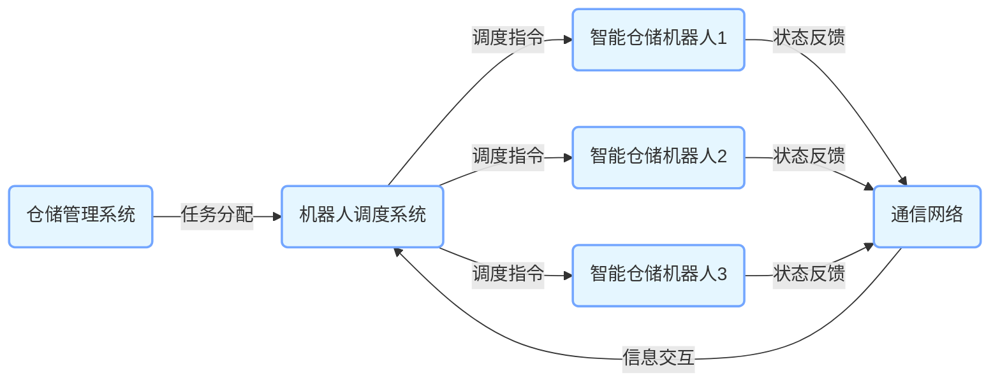

# 价值投资中的智能仓储机器人协作系统分析

> 关键词：价值投资、智能仓储机器人、协作系统、物流效率、成本控制

> 摘要：本文围绕价值投资视角下的智能仓储机器人协作系统展开深入分析。首先介绍了研究该系统的背景，包括目的、预期读者、文档结构和相关术语。接着阐述了智能仓储机器人协作系统的核心概念、联系以及架构，通过文本示意图和 Mermaid 流程图进行直观展示。详细讲解了核心算法原理，并给出 Python 源代码示例。对系统涉及的数学模型和公式进行了推导和举例说明。通过项目实战，展示了开发环境搭建、源代码实现及解读。分析了系统的实际应用场景，推荐了相关的学习资源、开发工具框架和论文著作。最后总结了系统的未来发展趋势与挑战，并对常见问题进行了解答，为价值投资者和相关从业者提供了全面的参考。

## 1. 背景介绍 
### 1.1 目的和范围
在当今快速发展的物流和电商行业中，仓储管理的效率和成本控制对于企业的竞争力至关重要。智能仓储机器人协作系统作为一种新兴的技术解决方案，能够显著提高仓储作业的自动化水平和效率。本文章的目的在于从价值投资的角度，深入分析智能仓储机器人协作系统的技术原理、应用场景、投资价值等方面，为投资者和相关从业者提供全面的参考。文章的范围涵盖了该系统的核心概念、算法原理、数学模型、项目实战以及实际应用等多个领域。

### 1.2 预期读者
本文预期读者包括对价值投资感兴趣的投资者、物流和电商行业的从业者、智能仓储技术的研发人员以及相关领域的学者和研究人员。通过阅读本文，读者可以了解智能仓储机器人协作系统的技术细节和商业价值，为投资决策、技术研发和行业发展提供参考。

### 1.3 文档结构概述
本文将按照以下结构进行组织：首先介绍智能仓储机器人协作系统的背景信息，包括目的、预期读者和文档结构；接着阐述系统的核心概念和联系，通过文本示意图和 Mermaid 流程图进行展示；然后详细讲解核心算法原理，并给出 Python 源代码示例；对系统涉及的数学模型和公式进行推导和举例说明；通过项目实战，展示开发环境搭建、源代码实现及解读；分析系统的实际应用场景；推荐相关的学习资源、开发工具框架和论文著作；最后总结系统的未来发展趋势与挑战，并对常见问题进行解答。

### 1.4 术语表
#### 1.4.1 核心术语定义
- **智能仓储机器人**：是一种具备自主导航、货物搬运和操作能力的机器人设备，能够在仓储环境中自动执行任务。
- **协作系统**：指多个智能仓储机器人之间通过通信和协调机制，共同完成仓储作业任务的系统。
- **价值投资**：是一种投资策略，通过对资产的内在价值进行评估，寻找被低估的投资机会。
- **物流效率**：指物流系统在单位时间内完成的货物运输和处理量。
- **成本控制**：指企业通过各种手段降低运营成本，提高经济效益。

#### 1.4.2 相关概念解释
- **自动化仓储**：是指利用自动化设备和信息技术，实现仓储作业的自动化和智能化管理。
- **机器人调度**：是指根据仓储作业任务和机器人状态，合理安排机器人的工作顺序和路径，以提高作业效率。
- **路径规划**：是指为机器人规划从起始点到目标点的最优路径，避免碰撞和障碍物。

#### 1.4.3 缩略词列表
- **AGV**：Automated Guided Vehicle，自动导引车
- **WMS**：Warehouse Management System，仓储管理系统
- **ROS**：Robot Operating System，机器人操作系统

## 2. 核心概念与联系 

### 核心概念原理
智能仓储机器人协作系统的核心目标是通过多个机器人的协作，实现仓储作业的高效、准确和自动化。该系统主要由智能仓储机器人、机器人调度系统、仓储管理系统和通信网络等部分组成。

智能仓储机器人是系统的执行单元，具备自主导航、货物搬运和操作能力。机器人调度系统负责根据仓储作业任务和机器人状态，合理安排机器人的工作顺序和路径，以提高作业效率。仓储管理系统是整个仓储系统的核心，负责管理货物的入库、出库、存储和盘点等业务流程。通信网络则用于实现机器人之间、机器人与调度系统以及调度系统与仓储管理系统之间的信息交互。

### 架构的文本示意图
```plaintext
智能仓储机器人协作系统架构

                    +-----------------+
                    |  仓储管理系统   |
                    +-----------------+
                           |
                           |  任务分配
                           v
                    +-----------------+
                    |  机器人调度系统 |
                    +-----------------+
                           |
                           |  调度指令
                           v
        +------------------+------------------+
        |                  |                  |
+-----------------+  +-----------------+  +-----------------+
|  智能仓储机器人  |  |  智能仓储机器人  |  |  智能仓储机器人  |
+-----------------+  +-----------------+  +-----------------+
        |                  |                  |
        |  状态反馈        |  状态反馈        |  状态反馈
        v                  v                  v
                    +-----------------+
                    |  通信网络        |
                    +-----------------+
```

### Mermaid 流程图


## 3. 核心算法原理 & 具体操作步骤 

### 核心算法原理
智能仓储机器人协作系统的核心算法主要包括机器人调度算法和路径规划算法。

#### 机器人调度算法
机器人调度算法的目标是根据仓储作业任务和机器人状态，合理安排机器人的工作顺序和路径，以提高作业效率。常见的机器人调度算法有基于规则的调度算法、基于优化模型的调度算法和基于人工智能的调度算法。

基于规则的调度算法是根据预先设定的规则来安排机器人的工作顺序和路径，例如先到先服务（FCFS）、最短作业优先（SJF）等。这种算法简单易实现，但缺乏灵活性，不能适应复杂的仓储环境。

基于优化模型的调度算法是将机器人调度问题转化为一个优化问题，通过求解优化模型来得到最优的调度方案。常见的优化模型有整数规划模型、动态规划模型等。这种算法能够得到最优的调度方案，但计算复杂度较高，对于大规模的仓储系统可能不适用。

基于人工智能的调度算法是利用人工智能技术，如遗传算法、蚁群算法、神经网络等，来解决机器人调度问题。这种算法具有较强的适应性和灵活性，能够在复杂的仓储环境中得到较好的调度效果。

#### 路径规划算法
路径规划算法的目标是为机器人规划从起始点到目标点的最优路径，避免碰撞和障碍物。常见的路径规划算法有 Dijkstra 算法、A* 算法、人工势场法等。

Dijkstra 算法是一种经典的最短路径算法，通过不断扩展节点来寻找最短路径。该算法的时间复杂度为 $O(V^2)$，其中 $V$ 是节点的数量。

A* 算法是一种启发式搜索算法，通过引入启发函数来加速搜索过程。该算法的时间复杂度取决于启发函数的选择，通常比 Dijkstra 算法更快。

人工势场法是一种基于物理模型的路径规划算法，通过模拟物体在势场中的运动来规划路径。该算法的优点是计算简单、实时性好，但容易陷入局部最优解。

### 具体操作步骤
#### 机器人调度算法的具体操作步骤
1. **任务接收**：机器人调度系统从仓储管理系统接收作业任务。
2. **机器人状态获取**：获取所有机器人的当前状态，包括位置、电量、任务执行情况等。
3. **任务分配**：根据任务类型和机器人状态，使用调度算法为每个任务分配合适的机器人。
4. **路径规划**：为分配到任务的机器人规划从当前位置到目标位置的路径。
5. **指令发送**：将调度指令和路径信息发送给相应的机器人。
6. **状态监控**：实时监控机器人的状态，根据机器人的反馈信息调整调度方案。

#### 路径规划算法的具体操作步骤
1. **地图构建**：构建仓储环境的地图，包括障碍物信息和可行区域。
2. **起点和终点确定**：确定机器人的起始点和目标点。
3. **路径搜索**：使用路径规划算法在地图上搜索从起始点到目标点的路径。
4. **路径优化**：对搜索到的路径进行优化，例如去除冗余路径、平滑路径等。
5. **路径输出**：将优化后的路径信息发送给机器人。

### Python 源代码示例
以下是一个简单的基于规则的机器人调度算法和 A* 路径规划算法的 Python 实现示例。

```python
import heapq

# 机器人类
class Robot:
    def __init__(self, id, position):
        self.id = id
        self.position = position
        self.task = None

    def assign_task(self, task):
        self.task = task

    def complete_task(self):
        self.task = None

# 任务类
class Task:
    def __init__(self, id, start, end):
        self.id = id
        self.start = start
        self.end = end

# 基于规则的调度算法（先到先服务）
def fcfs_scheduling(robots, tasks):
    for task in tasks:
        for robot in robots:
            if robot.task is None:
                robot.assign_task(task)
                break

# A* 路径规划算法
def heuristic(a, b):
    return abs(a[0] - b[0]) + abs(a[1] - b[1])

def a_star(graph, start, goal):
    open_list = []
    heapq.heappush(open_list, (0, start))
    came_from = {}
    g_score = {node: float('inf') for node in graph}
    g_score[start] = 0
    f_score = {node: float('inf') for node in graph}
    f_score[start] = heuristic(start, goal)

    while open_list:
        _, current = heapq.heappop(open_list)
        if current == goal:
            path = []
            while current in came_from:
                path.append(current)
                current = came_from[current]
            path.append(start)
            path.reverse()
            return path

        for neighbor in graph[current]:
            tentative_g_score = g_score[current] + 1
            if tentative_g_score < g_score[neighbor]:
                came_from[neighbor] = current
                g_score[neighbor] = tentative_g_score
                f_score[neighbor] = tentative_g_score + heuristic(neighbor, goal)
                heapq.heappush(open_list, (f_score[neighbor], neighbor))

    return None

# 示例代码
if __name__ == "__main__":
    # 创建机器人和任务
    robots = [Robot(1, (0, 0)), Robot(2, (0, 1))]
    tasks = [Task(1, (0, 0), (2, 2)), Task(2, (0, 1), (3, 3))]

    # 调度任务
    fcfs_scheduling(robots, tasks)

    # 构建地图
    graph = {
        (0, 0): [(0, 1), (1, 0)],
        (0, 1): [(0, 0), (0, 2), (1, 1)],
        (0, 2): [(0, 1), (1, 2)],
        (1, 0): [(0, 0), (1, 1)],
        (1, 1): [(0, 1), (1, 0), (1, 2), (2, 1)],
        (1, 2): [(0, 2), (1, 1), (2, 2)],
        (2, 1): [(1, 1), (2, 2)],
        (2, 2): [(1, 2), (2, 1), (3, 2)],
        (3, 2): [(2, 2), (3, 3)],
        (3, 3): [(3, 2)]
    }

    # 为每个机器人规划路径
    for robot in robots:
        if robot.task is not None:
            path = a_star(graph, robot.position, robot.task.end)
            print(f"Robot {robot.id} path: {path}")
```

## 4. 数学模型和公式 & 详细讲解 & 举例说明 

### 机器人调度问题的数学模型
机器人调度问题可以抽象为一个优化问题，目标是最小化完成所有任务的总时间或总成本。以下是一个简单的机器人调度问题的数学模型：

#### 符号定义
- $N$：任务集合，$N = \{1, 2, \cdots, n\}$
- $M$：机器人集合，$M = \{1, 2, \cdots, m\}$
- $T_{ij}$：机器人 $j$ 完成任务 $i$ 的时间
- $x_{ij}$：决策变量，若机器人 $j$ 被分配到任务 $i$，则 $x_{ij} = 1$，否则 $x_{ij} = 0$

#### 目标函数
$$
\min \sum_{i \in N} \sum_{j \in M} T_{ij} x_{ij}
$$

#### 约束条件
1. **每个任务只能由一个机器人完成**
$$
\sum_{j \in M} x_{ij} = 1, \forall i \in N
$$
2. **每个机器人最多只能分配一个任务**
$$
\sum_{i \in N} x_{ij} \leq 1, \forall j \in M
$$
3. **决策变量的取值范围**
$$
x_{ij} \in \{0, 1\}, \forall i \in N, \forall j \in M
$$

### 路径规划问题的数学模型
路径规划问题可以抽象为一个图搜索问题，目标是在图中找到从起始点到目标点的最短路径。以下是一个简单的路径规划问题的数学模型：

#### 符号定义
- $G = (V, E)$：图，其中 $V$ 是节点集合，$E$ 是边集合
- $s$：起始点
- $t$：目标点
- $d_{ij}$：节点 $i$ 到节点 $j$ 的距离
- $x_{ij}$：决策变量，若边 $(i, j)$ 在最短路径上，则 $x_{ij} = 1$，否则 $x_{ij} = 0$

#### 目标函数
$$
\min \sum_{(i, j) \in E} d_{ij} x_{ij}
$$

#### 约束条件
1. **流量守恒约束**
$$
\sum_{j:(i,j) \in E} x_{ij} - \sum_{j:(j,i) \in E} x_{ji} = 
\begin{cases}
1, & i = s \\
-1, & i = t \\
0, & i \neq s, i \neq t
\end{cases}
$$
2. **决策变量的取值范围**
$$
x_{ij} \in \{0, 1\}, \forall (i, j) \in E
$$

### 举例说明
#### 机器人调度问题举例
假设有 3 个任务 $N = \{1, 2, 3\}$ 和 2 个机器人 $M = \{1, 2\}$，机器人完成任务的时间如下表所示：

| 任务 | 机器人 1 | 机器人 2 |
| ---- | ---- | ---- |
| 1 | 5 | 3 |
| 2 | 4 | 6 |
| 3 | 7 | 2 |

根据上述数学模型，我们可以列出目标函数和约束条件：

目标函数：
$$
\min 5x_{11} + 3x_{12} + 4x_{21} + 6x_{22} + 7x_{31} + 2x_{32}
$$

约束条件：
$$
\begin{cases}
x_{11} + x_{12} = 1 \\
x_{21} + x_{22} = 1 \\
x_{31} + x_{32} = 1 \\
x_{11} + x_{21} + x_{31} \leq 1 \\
x_{12} + x_{22} + x_{32} \leq 1 \\
x_{ij} \in \{0, 1\}, \forall i \in N, \forall j \in M
\end{cases}
$$

通过求解上述优化问题，我们可以得到最优的调度方案。

#### 路径规划问题举例
假设有一个图 $G = (V, E)$，其中 $V = \{1, 2, 3, 4\}$，$E = \{(1, 2), (1, 3), (2, 3), (2, 4), (3, 4)\}$，边的距离如下表所示：

| 边 | 距离 |
| ---- | ---- |
| (1, 2) | 2 |
| (1, 3) | 4 |
| (2, 3) | 1 |
| (2, 4) | 3 |
| (3, 4) | 2 |

假设起始点 $s = 1$，目标点 $t = 4$，根据上述数学模型，我们可以列出目标函数和约束条件：

目标函数：
$$
\min 2x_{12} + 4x_{13} + x_{23} + 3x_{24} + 2x_{34}
$$

约束条件：
$$
\begin{cases}
x_{12} + x_{13} = 1 \\
x_{23} + x_{24} - x_{12} = 0 \\
x_{34} - x_{13} - x_{23} = 0 \\
-x_{24} - x_{34} = -1 \\
x_{ij} \in \{0, 1\}, \forall (i, j) \in E
\end{cases}
$$

通过求解上述优化问题，我们可以得到从起始点到目标点的最短路径。

## 5. 项目实战：代码实际案例和详细解释说明 

### 5.1  开发环境搭建
#### 硬件环境
- **机器人平台**：选择合适的智能仓储机器人平台，如 AGV 小车。确保机器人具备自主导航、货物搬运和操作能力。
- **服务器**：用于运行机器人调度系统和仓储管理系统。可以选择高性能的服务器，如戴尔 PowerEdge 系列。
- **传感器和通信设备**：安装必要的传感器，如激光雷达、摄像头等，用于机器人的定位和环境感知。同时，搭建稳定的通信网络，如 Wi-Fi 或 ZigBee 网络，用于机器人之间和机器人与服务器之间的通信。

#### 软件环境
- **操作系统**：选择适合机器人开发的操作系统，如 Ubuntu Linux。
- **编程语言**：选择 Python 作为主要的编程语言，因为 Python 具有丰富的库和工具，适合机器人开发和算法实现。
- **开发框架**：使用 ROS（Robot Operating System）作为机器人开发框架，ROS 提供了丰富的机器人功能包和工具，能够大大提高开发效率。
- **数据库**：选择 MySQL 或 PostgreSQL 作为数据库，用于存储仓储管理系统的数据。

### 5.2  源代码详细实现和代码解读
以下是一个基于 ROS 和 Python 的智能仓储机器人协作系统的源代码示例：

```python
import rospy
from geometry_msgs.msg import PoseStamped
from nav_msgs.msg import Path
from std_msgs.msg import String

# 机器人类
class Robot:
    def __init__(self, robot_id):
        self.id = robot_id
        self.current_pose = None
        self.task = None
        self.path_sub = rospy.Subscriber(f"/robot{self.id}/path", Path, self.path_callback)
        self.pose_sub = rospy.Subscriber(f"/robot{self.id}/pose", PoseStamped, self.pose_callback)
        self.task_pub = rospy.Publisher(f"/robot{self.id}/task", String, queue_size=10)

    def path_callback(self, msg):
        # 处理接收到的路径信息
        print(f"Robot {self.id} received path: {msg}")

    def pose_callback(self, msg):
        # 处理接收到的当前位置信息
        self.current_pose = msg.pose

    def assign_task(self, task):
        self.task = task
        self.task_pub.publish(task)

# 机器人调度系统类
class RobotScheduler:
    def __init__(self):
        self.robots = []
        self.tasks = []
        self.task_sub = rospy.Subscriber("/tasks", String, self.task_callback)
        for i in range(3):
            robot = Robot(i + 1)
            self.robots.append(robot)

    def task_callback(self, msg):
        # 处理接收到的任务信息
        task = msg.data
        self.tasks.append(task)
        self.schedule_tasks()

    def schedule_tasks(self):
        # 简单的任务调度算法（先到先服务）
        for task in self.tasks:
            for robot in self.robots:
                if robot.task is None:
                    robot.assign_task(task)
                    self.tasks.remove(task)
                    break

if __name__ == "__main__":
    rospy.init_node('robot_scheduler', anonymous=True)
    scheduler = RobotScheduler()
    rospy.spin()
```

### 代码解读与分析
#### 机器人类（Robot）
- `__init__` 方法：初始化机器人的 ID、当前位置、任务信息，同时订阅路径和位置信息的话题，并发布任务信息的话题。
- `path_callback` 方法：处理接收到的路径信息，打印路径信息。
- `pose_callback` 方法：处理接收到的当前位置信息，更新机器人的当前位置。
- `assign_task` 方法：为机器人分配任务，并发布任务信息。

#### 机器人调度系统类（RobotScheduler）
- `__init__` 方法：初始化机器人列表、任务列表，订阅任务信息的话题，并创建 3 个机器人实例。
- `task_callback` 方法：处理接收到的任务信息，将任务添加到任务列表中，并调用 `schedule_tasks` 方法进行任务调度。
- `schedule_tasks` 方法：简单的任务调度算法（先到先服务），遍历任务列表，为空闲的机器人分配任务。

#### 主程序
- 初始化 ROS 节点，创建机器人调度系统实例，并进入 ROS 循环。

## 6. 实际应用场景 
### 电商仓储
在电商仓储中，智能仓储机器人协作系统可以实现货物的快速入库、出库和存储。机器人可以根据订单信息自动搬运货物，提高仓储作业的效率和准确性。同时，系统可以实时监控库存信息，实现库存的动态管理。

### 物流配送中心
在物流配送中心，智能仓储机器人协作系统可以实现货物的分拣和包装。机器人可以根据订单信息自动将货物分拣到相应的包裹中，提高分拣效率和准确性。同时，系统可以优化配送路线，提高物流配送的效率。

### 制造业仓库
在制造业仓库中，智能仓储机器人协作系统可以实现原材料和成品的存储和搬运。机器人可以根据生产计划自动搬运原材料到生产线，同时将成品搬运到仓库存储。系统可以实时监控原材料和成品的库存信息，实现生产过程的高效管理。

## 7. 工具和资源推荐
### 7.1 学习资源推荐
#### 7.1.1 书籍推荐
- 《机器人学导论》：介绍了机器人的基本概念、运动学、动力学等知识，是机器人领域的经典教材。
- 《人工智能：一种现代的方法》：全面介绍了人工智能的各个领域，包括机器学习、自然语言处理、计算机视觉等，是人工智能领域的权威著作。
- 《Python 机器人编程实战》：通过实际案例介绍了如何使用 Python 和 ROS 进行机器人开发，适合初学者学习。

#### 7.1.2 在线课程
- Coursera 上的“机器人学基础”课程：由宾夕法尼亚大学的教授授课，介绍了机器人的基本概念、运动学、动力学等知识。
- edX 上的“人工智能导论”课程：由麻省理工学院的教授授课，全面介绍了人工智能的各个领域。
- Udemy 上的“Python 机器人编程从入门到精通”课程：通过实际案例介绍了如何使用 Python 和 ROS 进行机器人开发。

#### 7.1.3 技术博客和网站
- ROS 官方网站：提供了 ROS 的详细文档和教程，是学习 ROS 的重要资源。
- GitHub：是全球最大的开源代码托管平台，上面有很多优秀的机器人项目和代码，可以学习和参考。
- 机器之心：专注于人工智能和机器人领域的技术博客，提供了最新的技术资讯和研究成果。

### 7.2 开发工具框架推荐
#### 7.2.1 IDE和编辑器
- PyCharm：是一款专门为 Python 开发设计的集成开发环境，具有代码编辑、调试、自动补全、代码分析等功能。
- Visual Studio Code：是一款轻量级的代码编辑器，支持多种编程语言，具有丰富的插件和扩展功能。
- Sublime Text：是一款简洁高效的代码编辑器，具有快速打开文件、代码高亮、代码折叠等功能。

#### 7.2.2 调试和性能分析工具
- GDB：是一款强大的调试工具，支持多种编程语言，可以用于调试机器人程序。
- Valgrind：是一款内存调试和性能分析工具，可以检测程序中的内存泄漏和性能瓶颈。
- ROS 调试工具：ROS 提供了一系列的调试工具，如 rqt_graph、rqt_plot 等，可以用于调试和分析 ROS 节点和话题。

#### 7.2.3 相关框架和库
- ROS（Robot Operating System）：是一个开源的机器人开发框架，提供了丰富的机器人功能包和工具，能够大大提高开发效率。
- OpenCV：是一个开源的计算机视觉库，提供了各种图像处理和计算机视觉算法，可用于机器人的视觉感知。
- NumPy 和 SciPy：是 Python 中用于科学计算的库，提供了各种数值计算和优化算法，可用于机器人的运动规划和控制。

### 7.3 相关论文著作推荐
#### 7.3.1 经典论文
- “A Formal Basis for the Heuristic Determination of Minimum Cost Paths”：介绍了 A* 算法的基本原理和实现方法，是路径规划领域的经典论文。
- “Ant System: Optimization by a Colony of Cooperating Agents”：介绍了蚁群算法的基本原理和应用，是人工智能领域的经典论文。
- “Genetic Algorithms in Search, Optimization, and Machine Learning”：介绍了遗传算法的基本原理和应用，是人工智能领域的经典著作。

#### 7.3.2 最新研究成果
- 每年的 IEEE International Conference on Robotics and Automation (ICRA) 和 International Symposium on Robotics Research (ISRR) 都会发表大量关于机器人技术的最新研究成果，可以关注这些会议的论文。
- 顶级学术期刊如 IEEE Transactions on Robotics、The International Journal of Robotics Research 等也会发表机器人领域的最新研究成果。

#### 7.3.3 应用案例分析
- 一些知名企业如亚马逊、京东等的官方博客和技术分享会介绍他们在智能仓储机器人协作系统方面的应用案例和实践经验，可以学习和参考。

## 8. 总结：未来发展趋势与挑战
### 未来发展趋势
- **智能化程度不断提高**：随着人工智能技术的不断发展，智能仓储机器人协作系统的智能化程度将不断提高。机器人将具备更强的自主决策能力和学习能力，能够更好地适应复杂的仓储环境。
- **多机器人协作更加高效**：未来的智能仓储机器人协作系统将更加注重多机器人之间的协作效率。通过优化调度算法和通信机制，机器人之间的协作将更加紧密，能够实现更高效的仓储作业。
- **与其他技术融合发展**：智能仓储机器人协作系统将与物联网、大数据、云计算等技术融合发展。通过物联网技术，实现机器人与仓储设备的互联互通；通过大数据和云计算技术，实现仓储数据的分析和挖掘，为仓储管理提供决策支持。

### 挑战
- **技术瓶颈**：目前，智能仓储机器人协作系统还存在一些技术瓶颈，如机器人的定位精度、路径规划的实时性、多机器人之间的避碰等问题。需要进一步研究和开发新的技术来解决这些问题。
- **成本较高**：智能仓储机器人协作系统的建设和维护成本较高，包括机器人设备的采购、安装和调试，以及服务器、传感器等设备的投入。对于一些中小企业来说，成本是一个较大的挑战。
- **安全问题**：智能仓储机器人在运行过程中可能会对人员和设备造成安全威胁。需要采取有效的安全措施，如安装安全传感器、设置安全区域等，确保机器人的运行安全。

## 9. 附录：常见问题与解答
### 问题 1：智能仓储机器人协作系统的投资回报率如何？
解答：智能仓储机器人协作系统的投资回报率受到多种因素的影响，如仓储规模、作业效率、成本节约等。一般来说，通过提高仓储作业效率、降低人工成本和库存成本等方式，智能仓储机器人协作系统可以在一定时间内收回投资成本，并实现盈利。具体的投资回报率需要根据实际情况进行评估。

### 问题 2：智能仓储机器人协作系统的可靠性如何？
解答：智能仓储机器人协作系统的可靠性取决于多个方面，如机器人的质量、调度算法的合理性、通信网络的稳定性等。在选择机器人设备和开发调度算法时，需要充分考虑可靠性因素，并进行严格的测试和验证。同时，建立完善的故障诊断和处理机制，及时发现和解决系统中的故障，确保系统的可靠运行。

### 问题 3：智能仓储机器人协作系统是否可以与现有的仓储管理系统集成？
解答：智能仓储机器人协作系统可以与现有的仓储管理系统集成。通过接口开发和数据交互，实现智能仓储机器人协作系统与仓储管理系统之间的信息共享和协同工作。这样可以充分利用现有的仓储管理系统的功能，提高仓储管理的效率和水平。

## 10. 扩展阅读 & 参考资料
- [ROS官方文档](https://www.ros.org/documentation/)
- [OpenCV官方文档](https://docs.opencv.org/)
- [NumPy官方文档](https://numpy.org/doc/)
- [SciPy官方文档](https://docs.scipy.org/doc/scipy/)
- 《机器人学导论》，John J. Craig 著
- 《人工智能：一种现代的方法》，Stuart Russell, Peter Norvig 著
- 《Python 机器人编程实战》，A. A. Shah 著

作者：AI天才研究院/AI Genius Institute & 禅与计算机程序设计艺术 /Zen And The Art of Computer Programming