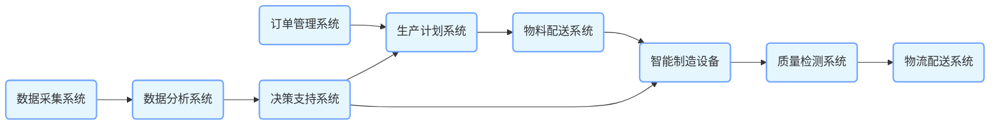

# 价值投资中的智能制造柔性生产线分析

> 关键词：价值投资、智能制造、柔性生产线、投资分析、工业4.0

> 摘要：本文围绕价值投资中的智能制造柔性生产线展开深入分析。首先介绍了智能制造柔性生产线的背景知识，包括其目的、适用读者等。接着阐述了核心概念与联系，详细讲解了相关算法原理及操作步骤，并通过数学模型和公式进行理论支撑。在项目实战部分，给出实际代码案例及详细解读。然后探讨了智能制造柔性生产线的实际应用场景，推荐了相关的学习工具和资源。最后总结了其未来发展趋势与挑战，还提供了常见问题解答及参考资料。旨在为价值投资者全面了解智能制造柔性生产线，做出合理投资决策提供参考。

## 1. 背景介绍 
### 1.1 目的和范围
在当今全球制造业竞争日益激烈的背景下，智能制造柔性生产线成为了制造业转型升级的关键方向。价值投资者关注智能制造柔性生产线，旨在寻找具有长期增长潜力和稳定回报的投资机会。本文的目的在于全面分析智能制造柔性生产线在价值投资中的相关要素，包括其技术原理、市场前景、投资风险等。范围涵盖了智能制造柔性生产线的基本概念、核心算法、数学模型、实际应用案例以及投资相关的各个方面。

### 1.2 预期读者
本文预期读者主要包括价值投资者，他们希望通过对智能制造柔性生产线的深入了解，挖掘潜在的投资价值；制造业从业者，旨在学习和掌握智能制造柔性生产线的技术和管理经验，推动企业的智能化转型；以及对智能制造领域感兴趣的研究人员和学生，帮助他们建立对该领域的全面认识。

### 1.3 文档结构概述
本文共分为十个部分。第一部分为背景介绍，阐述了文章的目的、预期读者和文档结构。第二部分介绍核心概念与联系，包括智能制造柔性生产线的原理和架构。第三部分讲解核心算法原理及具体操作步骤，通过Python代码进行详细说明。第四部分给出数学模型和公式，并进行详细讲解和举例。第五部分为项目实战，包括开发环境搭建、源代码实现和代码解读。第六部分探讨实际应用场景。第七部分推荐相关的工具和资源。第八部分总结未来发展趋势与挑战。第九部分为附录，提供常见问题与解答。第十部分为扩展阅读和参考资料。

### 1.4 术语表
#### 1.4.1 核心术语定义
- **价值投资**：一种基于对资产内在价值的评估，寻找被低估的投资标的，以获取长期稳定回报的投资策略。
- **智能制造**：将先进的信息技术与制造技术深度融合，实现生产过程的自动化、智能化和柔性化的制造模式。
- **柔性生产线**：一种能够根据市场需求和生产任务的变化，快速调整生产流程和产品类型的生产线。

#### 1.4.2 相关概念解释
- **工业4.0**：以智能制造为主导的第四次工业革命，强调通过物联网、大数据、云计算等技术实现生产的智能化和网络化。
- **数字化双胞胎**：对物理实体在虚拟空间中的数字化映射，用于模拟、分析和优化生产过程。

#### 1.4.3 缩略词列表
- **PLC**：可编程逻辑控制器（Programmable Logic Controller）
- **MES**：制造执行系统（Manufacturing Execution System）
- **ERP**：企业资源计划（Enterprise Resource Planning）

## 2. 核心概念与联系 
### 2.1 智能制造柔性生产线原理
智能制造柔性生产线是一种高度自动化和智能化的生产系统，它结合了先进的传感器、机器人、自动化设备和信息技术，能够根据不同的生产任务和产品需求，自动调整生产流程和参数。其核心原理在于实现生产过程的数字化、网络化和智能化，通过实时数据采集、分析和决策，优化生产效率、质量和成本。

### 2.2 架构示意图
下面是智能制造柔性生产线的架构示意图：



### 2.3 各部分联系
- **订单管理系统**：接收客户订单，将订单信息传递给生产计划系统。
- **生产计划系统**：根据订单信息和生产资源状况，制定生产计划，并将计划下达给物料配送系统和智能制造设备。
- **物料配送系统**：根据生产计划，将所需的原材料和零部件配送到相应的生产工位。
- **智能制造设备**：按照生产计划和工艺要求，进行产品的加工和装配。
- **质量检测系统**：对生产过程中的产品进行质量检测，将检测结果反馈给决策支持系统。
- **物流配送系统**：将合格的产品配送到客户手中。
- **数据采集系统**：实时采集生产过程中的各种数据，包括设备状态、生产进度、质量数据等。
- **数据分析系统**：对采集到的数据进行分析和处理，挖掘数据中的潜在价值。
- **决策支持系统**：根据数据分析结果，为生产计划系统和智能制造设备提供决策支持，优化生产过程。

## 3. 核心算法原理 & 具体操作步骤 
### 3.1 生产调度算法原理
生产调度是智能制造柔性生产线中的关键环节，其目的是合理安排生产任务和资源，提高生产效率和质量。常见的生产调度算法包括遗传算法、模拟退火算法和蚁群算法等。下面以遗传算法为例，介绍生产调度算法的原理。

遗传算法是一种基于生物进化原理的优化算法，它通过模拟自然选择和遗传机制，在解空间中搜索最优解。在生产调度问题中，遗传算法的基本步骤如下：
1. **编码**：将生产任务和资源的分配方案编码为染色体。
2. **初始化种群**：随机生成一组染色体作为初始种群。
3. **适应度评估**：计算每个染色体的适应度值，适应度值越高表示该染色体对应的生产调度方案越优。
4. **选择操作**：根据适应度值，选择一部分染色体作为父代。
5. **交叉操作**：对父代染色体进行交叉操作，生成子代染色体。
6. **变异操作**：对子代染色体进行变异操作，引入新的基因。
7. **更新种群**：用子代染色体替换部分父代染色体，更新种群。
8. **终止条件判断**：判断是否满足终止条件，如达到最大迭代次数或适应度值达到预设阈值。如果满足终止条件，则输出最优解；否则，返回步骤3。

### 3.2 Python代码实现
```python
import random

# 定义问题参数
num_jobs = 5  # 任务数量
num_machines = 3  # 机器数量
max_iterations = 100  # 最大迭代次数
population_size = 50  # 种群大小
mutation_rate = 0.1  # 变异率

# 生成初始种群
def generate_initial_population():
    population = []
    for _ in range(population_size):
        chromosome = [random.randint(0, num_machines - 1) for _ in range(num_jobs)]
        population.append(chromosome)
    return population

# 计算适应度值
def calculate_fitness(chromosome):
    # 简单示例：计算任务在机器上的总加工时间
    machine_times = [0] * num_machines
    for job, machine in enumerate(chromosome):
        # 假设每个任务的加工时间为1
        machine_times[machine] += 1
    return max(machine_times)

# 选择操作
def selection(population):
    fitness_values = [calculate_fitness(chromosome) for chromosome in population]
    total_fitness = sum(fitness_values)
    probabilities = [fitness / total_fitness for fitness in fitness_values]
    selected_indices = random.choices(range(population_size), weights=probabilities, k=2)
    return [population[i] for i in selected_indices]

# 交叉操作
def crossover(parent1, parent2):
    crossover_point = random.randint(1, num_jobs - 1)
    child1 = parent1[:crossover_point] + parent2[crossover_point:]
    child2 = parent2[:crossover_point] + parent1[crossover_point:]
    return child1, child2

# 变异操作
def mutation(chromosome):
    for i in range(num_jobs):
        if random.random() < mutation_rate:
            chromosome[i] = random.randint(0, num_machines - 1)
    return chromosome

# 遗传算法主函数
def genetic_algorithm():
    population = generate_initial_population()
    for _ in range(max_iterations):
        new_population = []
        for _ in range(population_size // 2):
            parents = selection(population)
            child1, child2 = crossover(parents[0], parents[1])
            child1 = mutation(child1)
            child2 = mutation(child2)
            new_population.extend([child1, child2])
        population = new_population
    best_chromosome = min(population, key=calculate_fitness)
    return best_chromosome

# 运行遗传算法
best_schedule = genetic_algorithm()
print("最优生产调度方案:", best_schedule)
print("最小总加工时间:", calculate_fitness(best_schedule))
```

### 3.3 具体操作步骤
1. **数据准备**：确定生产任务和资源的相关信息，如任务数量、机器数量、任务加工时间等。
2. **参数设置**：设置遗传算法的参数，如种群大小、最大迭代次数、变异率等。
3. **初始化种群**：调用 `generate_initial_population` 函数生成初始种群。
4. **迭代优化**：在每次迭代中，进行选择、交叉、变异操作，更新种群。
5. **输出结果**：迭代结束后，选择适应度值最小的染色体作为最优解。

## 4. 数学模型和公式 & 详细讲解 & 举例说明 
### 4.1 生产调度数学模型
生产调度问题可以用以下数学模型来描述：

设 $J = \{1, 2, \cdots, n\}$ 表示任务集合，$M = \{1, 2, \cdots, m\}$ 表示机器集合，$p_{ij}$ 表示任务 $i$ 在机器 $j$ 上的加工时间，$x_{ij}$ 表示任务 $i$ 是否分配给机器 $j$（$x_{ij} = 1$ 表示分配，$x_{ij} = 0$ 表示不分配）。

目标函数是最小化所有机器的最大加工时间，即：

$$\min \max_{j \in M} \sum_{i \in J} p_{ij} x_{ij}$$

约束条件包括：
1. 每个任务只能分配给一台机器：

$$\sum_{j \in M} x_{ij} = 1, \forall i \in J$$

2. $x_{ij}$ 为二进制变量：

$$x_{ij} \in \{0, 1\}, \forall i \in J, j \in M$$

### 4.2 详细讲解
目标函数的含义是找到一种任务分配方案，使得所有机器中加工时间最长的机器的加工时间最小。约束条件1保证每个任务只能分配给一台机器，约束条件2保证 $x_{ij}$ 是二进制变量。

### 4.3 举例说明
假设有3个任务 $J = \{1, 2, 3\}$ 和2台机器 $M = \{1, 2\}$，任务在机器上的加工时间矩阵为：

$$P = \begin{bmatrix}
2 & 3 \\
4 & 1 \\
3 & 2
\end{bmatrix}$$

设任务分配方案为 $x = \begin{bmatrix}
1 & 0 \\
0 & 1 \\
1 & 0
\end{bmatrix}$，则机器1的加工时间为 $2 + 3 = 5$，机器2的加工时间为 $1$，最大加工时间为 $5$。

## 5. 项目实战：代码实际案例和详细解释说明 
### 5.1  开发环境搭建
#### 5.1.1 安装Python
首先需要安装Python环境，建议使用Python 3.7及以上版本。可以从Python官方网站（https://www.python.org/downloads/） 下载并安装。

#### 5.1.2 安装必要的库
在命令行中使用以下命令安装必要的库：
```sh
pip install numpy matplotlib
```

### 5.2  源代码详细实现和代码解读
```python
import numpy as np
import matplotlib.pyplot as plt

# 定义任务和机器数量
num_jobs = 5
num_machines = 3

# 生成随机加工时间矩阵
processing_times = np.random.randint(1, 10, size=(num_jobs, num_machines))

# 生成初始调度方案
initial_schedule = np.random.randint(0, num_machines, size=num_jobs)

# 计算调度方案的总加工时间
def calculate_total_time(schedule):
    machine_times = np.zeros(num_machines)
    for job, machine in enumerate(schedule):
        machine_times[machine] += processing_times[job, machine]
    return max(machine_times)

# 模拟退火算法
def simulated_annealing(initial_schedule, initial_temperature=100, cooling_rate=0.95, max_iterations=1000):
    current_schedule = initial_schedule.copy()
    current_time = calculate_total_time(current_schedule)
    best_schedule = current_schedule.copy()
    best_time = current_time
    temperature = initial_temperature

    times = []
    for _ in range(max_iterations):
        new_schedule = current_schedule.copy()
        # 随机交换两个任务的机器分配
        index1, index2 = np.random.choice(num_jobs, 2, replace=False)
        new_schedule[index1], new_schedule[index2] = new_schedule[index2], new_schedule[index1]
        new_time = calculate_total_time(new_schedule)

        if new_time < current_time or np.random.rand() < np.exp((current_time - new_time) / temperature):
            current_schedule = new_schedule
            current_time = new_time

        if current_time < best_time:
            best_schedule = current_schedule.copy()
            best_time = current_time

        temperature *= cooling_rate
        times.append(best_time)

    # 绘制总加工时间随迭代次数的变化曲线
    plt.plot(times)
    plt.xlabel('Iterations')
    plt.ylabel('Total Processing Time')
    plt.title('Simulated Annealing for Job Scheduling')
    plt.show()

    return best_schedule, best_time

# 运行模拟退火算法
best_schedule, best_time = simulated_annealing(initial_schedule)
print("最优调度方案:", best_schedule)
print("最小总加工时间:", best_time)
```

### 5.3  代码解读与分析
- **数据生成**：使用 `np.random.randint` 函数生成随机的加工时间矩阵和初始调度方案。
- **计算总加工时间**：`calculate_total_time` 函数根据调度方案计算所有机器的最大加工时间。
- **模拟退火算法**：`simulated_annealing` 函数实现了模拟退火算法，通过不断尝试新的调度方案，并根据一定的概率接受更差的方案，以避免陷入局部最优解。
- **可视化**：使用 `matplotlib` 库绘制总加工时间随迭代次数的变化曲线，直观展示算法的优化过程。

## 6. 实际应用场景 
### 6.1 汽车制造
在汽车制造领域，智能制造柔性生产线可以根据不同车型的需求，快速调整生产流程和工艺参数。例如，在生产不同配置的汽车时，可以通过调整机器人的动作和程序，实现不同零部件的装配。同时，利用传感器和数据分析技术，可以实时监测生产过程中的质量和效率，及时发现和解决问题。

### 6.2 电子制造
电子制造行业的产品更新换代速度快，智能制造柔性生产线可以满足小批量、多品种的生产需求。例如，在生产智能手机时，可以根据不同的订单需求，快速调整生产线的布局和设备参数，实现不同型号手机的生产。此外，通过数字化双胞胎技术，可以对生产过程进行虚拟仿真和优化，提高生产效率和质量。

### 6.3 食品加工
在食品加工行业，智能制造柔性生产线可以实现对不同种类和规格的食品的生产。例如，在生产饼干时，可以根据不同的配方和工艺要求，调整生产线的温度、压力和速度等参数，生产出不同口味和形状的饼干。同时，利用自动化设备和机器人，可以实现食品的包装和分拣，提高生产效率和卫生水平。

## 7. 工具和资源推荐
### 7.1 学习资源推荐
#### 7.1.1 书籍推荐
- 《智能制造：走向创新与应用实践》：全面介绍了智能制造的概念、技术和应用案例。
- 《工业4.0：即将来袭的第四次工业革命》：深入探讨了工业4.0的发展趋势和影响。
- 《Python数据分析实战》：适合学习Python数据分析和处理的入门书籍。

#### 7.1.2 在线课程
- Coursera上的“智能制造与工业4.0”课程：由知名高校教授授课，讲解智能制造的前沿知识和技术。
- edX上的“Python for Data Science”课程：系统学习Python在数据分析中的应用。

#### 7.1.3 技术博客和网站
- 中国智能制造网（https://www.imchina.com.cn/）：提供智能制造领域的最新资讯和技术文章。
- 开源中国（https://www.oschina.net/）：有很多关于智能制造和编程的技术分享。

### 7.2 开发工具框架推荐
#### 7.2.1 IDE和编辑器
- PyCharm：一款专业的Python集成开发环境，提供丰富的代码编辑、调试和分析功能。
- Visual Studio Code：一款轻量级的代码编辑器，支持多种编程语言和插件扩展。

#### 7.2.2 调试和性能分析工具
- PDB：Python自带的调试工具，用于调试Python代码。
- cProfile：Python的性能分析工具，用于分析代码的性能瓶颈。

#### 7.2.3 相关框架和库
- TensorFlow：一个开源的机器学习框架，可用于实现智能制造中的数据分析和预测模型。
- Pandas：一个强大的数据分析库，提供高效的数据处理和分析功能。

### 7.3 相关论文著作推荐
#### 7.3.1 经典论文
- “The Future of Manufacturing: A Vision for 2020 and Beyond”：探讨了制造业的未来发展趋势和挑战。
- “Flexible Manufacturing Systems: A Review”：对柔性制造系统的相关理论和技术进行了综述。

#### 7.3.2 最新研究成果
- 关注IEEE Transactions on Automation Science and Engineering、Journal of Manufacturing Systems等学术期刊，获取智能制造领域的最新研究成果。

#### 7.3.3 应用案例分析
- 参考《哈佛商业评论》等商业杂志上的智能制造应用案例，了解实际企业的成功经验。

## 8. 总结：未来发展趋势与挑战
### 8.1 未来发展趋势
- **智能化程度不断提高**：随着人工智能、大数据、物联网等技术的不断发展，智能制造柔性生产线的智能化程度将不断提高，实现更加自主的决策和优化。
- **个性化定制生产**：消费者对产品的个性化需求不断增加，智能制造柔性生产线将能够更好地满足个性化定制生产的需求，实现大规模定制化生产。
- **绿色制造**：环保意识的增强将促使智能制造柔性生产线更加注重节能减排和资源循环利用，实现绿色制造。
- **全球协同制造**：互联网和信息技术的发展将使得全球范围内的制造资源能够更加高效地协同利用，实现全球协同制造。

### 8.2 挑战
- **技术难题**：智能制造柔性生产线涉及到多种先进技术的融合，如人工智能、机器人技术、传感器技术等，技术研发和应用的难度较大。
- **数据安全**：大量的生产数据和企业信息在智能制造柔性生产线中流动，数据安全和隐私保护面临着严峻的挑战。
- **人才短缺**：智能制造柔性生产线的发展需要大量既懂制造技术又懂信息技术的复合型人才，目前这类人才短缺的问题较为突出。
- **成本压力**：建设和运营智能制造柔性生产线需要大量的资金投入，对于一些中小企业来说，成本压力较大。

## 9. 附录：常见问题与解答
### 9.1 什么是智能制造柔性生产线？
智能制造柔性生产线是一种高度自动化和智能化的生产系统，它能够根据市场需求和生产任务的变化，快速调整生产流程和产品类型。

### 9.2 智能制造柔性生产线有哪些优势？
智能制造柔性生产线的优势包括提高生产效率、降低生产成本、提高产品质量、满足个性化定制需求等。

### 9.3 如何实现智能制造柔性生产线的智能化？
实现智能制造柔性生产线的智能化需要结合先进的信息技术，如人工智能、大数据、物联网等，实现生产过程的数字化、网络化和智能化。

### 9.4 智能制造柔性生产线的投资回报如何？
智能制造柔性生产线的投资回报取决于多种因素，如生产线的规模、生产效率的提高、产品质量的提升等。一般来说，长期来看，智能制造柔性生产线能够带来显著的经济效益。

## 10. 扩展阅读 & 参考资料
- 《智能制造发展规划（2016 - 2020年）》
- 《中国制造业数字化转型白皮书》
- 相关学术期刊和会议论文

作者：AI天才研究院/AI Genius Institute & 禅与计算机程序设计艺术 /Zen And The Art of Computer Programming