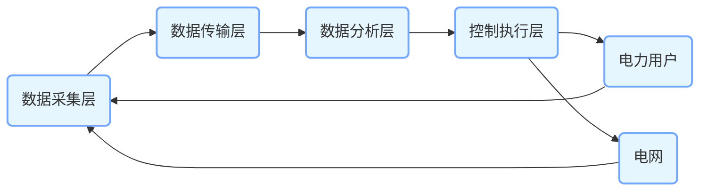

# 价值投资中的智能电网需求响应系统分析

> 关键词：价值投资、智能电网、需求响应系统、电力市场、能源管理

> 摘要：本文围绕价值投资视角下的智能电网需求响应系统展开深入分析。首先介绍了研究的背景、目的、预期读者等内容。接着阐述了智能电网需求响应系统的核心概念、架构及原理，通过Python代码详细讲解了核心算法。同时给出了相关数学模型和公式，并举例说明。在项目实战部分，介绍了开发环境搭建、源代码实现与解读。分析了系统的实际应用场景，推荐了学习资源、开发工具框架和相关论文著作。最后总结了系统的未来发展趋势与挑战，提供了常见问题解答及扩展阅读参考资料，旨在为价值投资者和相关技术人员全面了解智能电网需求响应系统提供有价值的参考。

## 1. 背景介绍 
### 1.1 目的和范围
随着全球能源需求的不断增长和能源结构的调整，智能电网作为未来电力系统的发展方向，受到了广泛关注。需求响应系统作为智能电网的重要组成部分，能够通过激励用户调整用电行为，实现电力资源的优化配置，提高电网的运行效率和可靠性。本研究的目的是从价值投资的角度，深入分析智能电网需求响应系统的技术原理、应用场景和投资价值，为投资者提供决策依据。研究范围涵盖了智能电网需求响应系统的各个方面，包括系统架构、核心算法、数学模型、实际应用等。

### 1.2 预期读者
本文的预期读者主要包括价值投资者、电力行业从业者、能源管理专家、科研人员以及对智能电网和需求响应系统感兴趣的技术爱好者。对于投资者来说，本文可以帮助他们了解智能电网需求响应系统的投资价值和潜在风险；对于电力行业从业者和能源管理专家，本文可以提供系统的技术原理和应用案例，为实际工作提供参考；对于科研人员，本文可以激发他们的研究灵感，推动相关领域的技术创新；对于技术爱好者，本文可以作为入门读物，帮助他们了解智能电网需求响应系统的基本概念和工作原理。

### 1.3 文档结构概述
本文共分为十个部分。第一部分为背景介绍，阐述了研究的目的、范围、预期读者和文档结构概述。第二部分介绍了智能电网需求响应系统的核心概念与联系，包括系统架构和工作原理，并通过Mermaid流程图进行展示。第三部分详细讲解了核心算法原理和具体操作步骤，使用Python源代码进行说明。第四部分给出了相关的数学模型和公式，并进行详细讲解和举例说明。第五部分是项目实战，介绍了开发环境搭建、源代码详细实现和代码解读。第六部分分析了智能电网需求响应系统的实际应用场景。第七部分推荐了学习资源、开发工具框架和相关论文著作。第八部分总结了系统的未来发展趋势与挑战。第九部分是附录，提供了常见问题与解答。第十部分列出了扩展阅读和参考资料。

### 1.4 术语表
#### 1.4.1 核心术语定义
- **智能电网（Smart Grid）**：将先进的传感测量技术、通信技术、信息技术、计算机技术和控制技术与物理电网高度集成而形成的新型电网，具有智能化、自动化、互动化等特点。
- **需求响应（Demand Response，DR）**：电力用户根据电力价格信号或激励机制，改变其固有的用电模式，减少或增加用电负荷，以响应电力供应的变化。
- **需求响应系统（Demand Response System，DRS）**：实现需求响应功能的软硬件系统，包括数据采集、分析、决策和控制等模块，用于协调电力用户和电网之间的互动。
- **价值投资（Value Investing）**：一种投资策略，投资者通过分析公司的基本面，寻找被低估的股票或资产，以获得长期的投资回报。

#### 1.4.2 相关概念解释
- **负荷管理（Load Management）**：通过各种手段对电力负荷进行调节和控制，以达到优化电力资源配置、降低电网峰谷差、提高电网运行效率的目的。需求响应是负荷管理的一种重要方式。
- **电力市场（Electricity Market）**：电力生产、传输、销售和消费的市场体系，包括发电市场、输电市场、配电市场和零售市场等。需求响应系统可以在电力市场中发挥重要作用，促进电力资源的有效配置。
- **分布式能源资源（Distributed Energy Resources，DERs）**：分布在用户侧的小型发电装置和储能装置，如太阳能光伏、风力发电、电池储能等。需求响应系统可以与分布式能源资源相结合，实现电力的就地生产和消费，提高能源利用效率。

#### 1.4.3 缩略词列表
- **DR**：Demand Response，需求响应
- **DRS**：Demand Response System，需求响应系统
- **DERs**：Distributed Energy Resources，分布式能源资源
- **AMI**：Advanced Metering Infrastructure，高级量测体系
- **EMS**：Energy Management System，能源管理系统

## 2. 核心概念与联系 
### 2.1 智能电网需求响应系统的基本概念
智能电网需求响应系统是智能电网的重要组成部分，它通过实时监测电力系统的运行状态和用户的用电行为，利用价格信号或激励机制，引导用户调整用电负荷，以实现电力资源的优化配置和电网的稳定运行。需求响应系统可以分为基于价格的需求响应和基于激励的需求响应两种类型。

基于价格的需求响应是指电力公司根据电力市场的供求关系和成本变化，制定不同时段的电价，用户根据电价信号自主调整用电行为。例如，在用电高峰期，电价较高，用户可以减少高耗能设备的使用；在用电低谷期，电价较低，用户可以增加用电负荷。

基于激励的需求响应是指电力公司通过向用户提供经济激励，如补贴、奖励等，鼓励用户在特定时段减少或增加用电负荷。例如，电力公司可以在电网出现紧急情况时，向用户发送需求响应请求，用户响应请求并减少用电负荷后，电力公司给予相应的经济补偿。

### 2.2 系统架构和工作原理
智能电网需求响应系统主要由数据采集层、数据传输层、数据分析层和控制执行层四个部分组成。其系统架构如图1所示：



#### 2.2.1 数据采集层
数据采集层主要负责收集电力系统的运行数据和用户的用电数据。这些数据包括电网的电压、电流、功率等参数，以及用户的用电量、用电时间、用电设备类型等信息。数据采集设备可以是智能电表、传感器、数据采集器等。

#### 2.2.2 数据传输层
数据传输层主要负责将数据采集层收集到的数据传输到数据分析层。数据传输方式可以是有线通信（如以太网、光纤等）或无线通信（如GPRS、ZigBee等）。为了保证数据传输的可靠性和实时性，通常采用多种通信方式相结合的方法。

#### 2.2.3 数据分析层
数据分析层主要负责对数据传输层传输过来的数据进行分析和处理，以实现需求响应的决策和优化。数据分析方法可以包括数据挖掘、机器学习、优化算法等。通过对数据的分析，可以预测电力负荷的变化趋势，评估用户的响应能力，制定合理的需求响应策略。

#### 2.2.4 控制执行层
控制执行层主要负责根据数据分析层制定的需求响应策略，对电力用户的用电设备进行控制和调节。控制方式可以是远程控制、自动控制或手动控制。通过控制执行层的操作，可以实现用户用电负荷的调整，达到需求响应的目的。

### 2.3 核心概念之间的联系
智能电网需求响应系统中的各个核心概念之间存在着密切的联系。智能电网为需求响应系统提供了技术支持和通信平台，使得系统能够实时监测电力系统的运行状态和用户的用电行为。需求响应系统通过引导用户调整用电行为，实现电力资源的优化配置，提高电网的运行效率和可靠性，从而促进智能电网的发展。

价值投资与智能电网需求响应系统也存在着紧密的联系。从价值投资的角度来看，智能电网需求响应系统具有巨大的投资价值。随着能源需求的不断增长和能源结构的调整，智能电网需求响应系统的市场需求将不断扩大。同时，需求响应系统的应用可以降低电网的建设成本和运行成本，提高电力企业的经济效益。因此，投资智能电网需求响应系统可以获得长期的投资回报。

## 3. 核心算法原理 & 具体操作步骤 
### 3.1 需求响应优化算法原理
需求响应优化算法的目标是在满足用户用电需求和电网安全运行的前提下，最大化需求响应的效益。常见的需求响应优化算法包括线性规划、整数规划、动态规划等。下面以线性规划为例，介绍需求响应优化算法的原理。

假设电力系统中有 $n$ 个用户，每个用户在 $T$ 个时段内的用电负荷为 $P_{i,t}$，其中 $i = 1,2,\cdots,n$，$t = 1,2,\cdots,T$。电力公司在每个时段的电价为 $\lambda_t$，用户的需求响应成本为 $C_{i,t}(P_{i,t})$。需求响应优化问题可以表述为以下线性规划模型：

$$
\begin{aligned}
\max_{P_{i,t}} &\sum_{t = 1}^{T}\sum_{i = 1}^{n}(\lambda_tP_{i,t}-C_{i,t}(P_{i,t}))\\
\text{s.t.} &\sum_{i = 1}^{n}P_{i,t}\leq P_{max,t},\quad t = 1,2,\cdots,T\\
&P_{i,t}^{min}\leq P_{i,t}\leq P_{i,t}^{max},\quad i = 1,2,\cdots,n,\quad t = 1,2,\cdots,T
\end{aligned}
$$

其中，$P_{max,t}$ 是第 $t$ 个时段电网的最大供电能力，$P_{i,t}^{min}$ 和 $P_{i,t}^{max}$ 分别是第 $i$ 个用户在第 $t$ 个时段的最小和最大用电负荷。

### 3.2 Python代码实现
以下是使用Python的`pulp`库实现上述线性规划模型的代码示例：

```python
from pulp import LpMaximize, LpProblem, LpVariable

# 定义参数
n = 3  # 用户数量
T = 24  # 时段数量
lambda_t = [10] * T  # 每个时段的电价
P_max_t = [100] * T  # 每个时段电网的最大供电能力
P_i_min = [[10] * T for _ in range(n)]  # 每个用户在每个时段的最小用电负荷
P_i_max = [[50] * T for _ in range(n)]  # 每个用户在每个时段的最大用电负荷

# 创建线性规划问题
prob = LpProblem("Demand_Response_Optimization", LpMaximize)

# 定义决策变量
P = [[LpVariable(f"P_{i}_{t}", lowBound=P_i_min[i][t], upBound=P_i_max[i][t]) for t in range(T)] for i in range(n)]

# 定义目标函数
objective = sum(lambda_t[t] * P[i][t] for t in range(T) for i in range(n))
prob += objective

# 定义约束条件
for t in range(T):
    prob += sum(P[i][t] for i in range(n)) <= P_max_t[t]

# 求解线性规划问题
prob.solve()

# 输出结果
print("Status:", prob.status)
for i in range(n):
    for t in range(T):
        print(f"用户 {i + 1} 在时段 {t + 1} 的用电负荷: {P[i][t].value()}")
```

### 3.3 具体操作步骤
#### 3.3.1 数据准备
在使用上述代码之前，需要准备好相关的数据，包括用户数量、时段数量、每个时段的电价、每个时段电网的最大供电能力、每个用户在每个时段的最小和最大用电负荷等。

#### 3.3.2 模型构建
使用`pulp`库创建线性规划问题，并定义决策变量、目标函数和约束条件。

#### 3.3.3 模型求解
调用`prob.solve()`方法求解线性规划问题。

#### 3.3.4 结果分析
根据求解结果，分析每个用户在每个时段的用电负荷，评估需求响应的效益。

## 4. 数学模型和公式 & 详细讲解 & 举例说明 
### 4.1 需求响应效益评估模型
需求响应效益评估模型用于评估需求响应系统的经济效益和社会效益。常见的需求响应效益评估指标包括成本节约、峰谷差减小、可再生能源消纳等。下面以成本节约为例，介绍需求响应效益评估模型。

假设在没有需求响应的情况下，电力系统的总用电成本为 $C_0$，在实施需求响应后，电力系统的总用电成本为 $C_1$。则需求响应的成本节约 $S$ 可以表示为：

$$
S = C_0 - C_1
$$

其中，$C_0$ 和 $C_1$ 可以通过以下公式计算：

$$
C_0=\sum_{t = 1}^{T}\lambda_t\sum_{i = 1}^{n}P_{i,t}^0
$$

$$
C_1=\sum_{t = 1}^{T}\lambda_t\sum_{i = 1}^{n}P_{i,t}^1
$$

其中，$P_{i,t}^0$ 和 $P_{i,t}^1$ 分别是第 $i$ 个用户在第 $t$ 个时段在没有需求响应和实施需求响应后的用电负荷。

### 4.2 峰谷差减小模型
峰谷差是指电力系统在一天内的最大用电负荷和最小用电负荷之差。需求响应系统可以通过引导用户调整用电行为，减小峰谷差，提高电网的运行效率。峰谷差减小模型可以表示为：

$$
\Delta P = P_{max}^0 - P_{max}^1
$$

其中，$P_{max}^0$ 和 $P_{max}^1$ 分别是在没有需求响应和实施需求响应后电力系统的最大用电负荷。

### 4.3 举例说明
假设电力系统中有 2 个用户，每个用户在 24 个时段内的用电负荷如下表所示：

| 时段 | 用户 1 用电负荷（kW） | 用户 2 用电负荷（kW） |
|------|----------------------|----------------------|
| 1    | 10                   | 20                   |
| 2    | 15                   | 25                   |
| $\cdots$ | $\cdots$             | $\cdots$             |
| 24   | 12                   | 18                   |

每个时段的电价为 10 元/kWh。在没有需求响应的情况下，电力系统的总用电成本为：

$$
C_0 = 10\times\sum_{t = 1}^{24}(P_{1,t}^0 + P_{2,t}^0)
$$

假设实施需求响应后，用户 1 和用户 2 的用电负荷调整如下表所示：

| 时段 | 用户 1 用电负荷（kW） | 用户 2 用电负荷（kW） |
|------|----------------------|----------------------|
| 1    | 8                    | 15                   |
| 2    | 12                   | 20                   |
| $\cdots$ | $\cdots$             | $\cdots$             |
| 24   | 10                   | 15                   |

则实施需求响应后，电力系统的总用电成本为：

$$
C_1 = 10\times\sum_{t = 1}^{24}(P_{1,t}^1 + P_{2,t}^1)
$$

需求响应的成本节约为：

$$
S = C_0 - C_1
$$

通过计算可以得到需求响应的成本节约，评估需求响应系统的经济效益。

## 5. 项目实战：代码实际案例和详细解释说明 
### 5.1  开发环境搭建
#### 5.1.1 操作系统
本项目可以在Windows、Linux或macOS等操作系统上进行开发。建议使用Ubuntu 20.04 LTS或更高版本的Linux系统，因为Linux系统在开发和部署方面具有更好的稳定性和兼容性。

#### 5.1.2 Python环境
本项目使用Python进行开发，建议使用Python 3.8或更高版本。可以通过以下命令安装Python：

```bash
sudo apt update
sudo apt install python3 python3-pip
```

#### 5.1.3 依赖库安装
本项目需要使用`pulp`、`numpy`、`pandas`等Python库。可以通过以下命令安装这些库：

```bash
pip3 install pulp numpy pandas
```

### 5.2  源代码详细实现和代码解读
以下是一个完整的智能电网需求响应系统的Python代码示例：

```python
import numpy as np
import pandas as pd
from pulp import LpMaximize, LpProblem, LpVariable

# 数据准备
n = 3  # 用户数量
T = 24  # 时段数量
lambda_t = np.random.randint(5, 15, T)  # 每个时段的电价
P_max_t = np.random.randint(80, 120, T)  # 每个时段电网的最大供电能力
P_i_min = np.random.randint(10, 20, (n, T))  # 每个用户在每个时段的最小用电负荷
P_i_max = np.random.randint(30, 50, (n, T))  # 每个用户在每个时段的最大用电负荷

# 创建线性规划问题
prob = LpProblem("Demand_Response_Optimization", LpMaximize)

# 定义决策变量
P = [[LpVariable(f"P_{i}_{t}", lowBound=P_i_min[i][t], upBound=P_i_max[i][t]) for t in range(T)] for i in range(n)]

# 定义目标函数
objective = sum(lambda_t[t] * P[i][t] for t in range(T) for i in range(n))
prob += objective

# 定义约束条件
for t in range(T):
    prob += sum(P[i][t] for i in range(n)) <= P_max_t[t]

# 求解线性规划问题
prob.solve()

# 输出结果
print("Status:", prob.status)
result = []
for i in range(n):
    user_result = []
    for t in range(T):
        user_result.append(P[i][t].value())
    result.append(user_result)

df = pd.DataFrame(result, columns=[f"时段 {t + 1}" for t in range(T)], index=[f"用户 {i + 1}" for i in range(n)])
print(df)
```

### 5.3  代码解读与分析
#### 5.3.1 数据准备
代码首先定义了用户数量、时段数量、每个时段的电价、每个时段电网的最大供电能力、每个用户在每个时段的最小和最大用电负荷等参数。这些参数可以根据实际情况进行修改。

#### 5.3.2 线性规划问题创建
使用`pulp`库创建线性规划问题，并指定问题的类型为最大化问题。

#### 5.3.3 决策变量定义
定义决策变量 $P_{i,t}$，表示第 $i$ 个用户在第 $t$ 个时段的用电负荷，并设置其取值范围。

#### 5.3.4 目标函数定义
定义目标函数为最大化电力公司的收益，即每个时段的电价乘以用户的用电负荷之和。

#### 5.3.5 约束条件定义
定义约束条件为每个时段的总用电负荷不超过电网的最大供电能力。

#### 5.3.6 问题求解
调用`prob.solve()`方法求解线性规划问题。

#### 5.3.7 结果输出
将求解结果存储在`pandas`的`DataFrame`中，并输出每个用户在每个时段的用电负荷。

## 6. 实际应用场景 
### 6.1 电力市场辅助服务
在电力市场中，需求响应系统可以作为一种辅助服务，为电网提供调峰、调频、备用等服务。当电网出现高峰负荷或频率波动时，电力公司可以通过需求响应系统向用户发送需求响应请求，用户响应请求并减少用电负荷，从而帮助电网维持稳定运行。电力公司可以根据用户的响应程度给予相应的经济补偿，实现电力资源的优化配置。

### 6.2 分布式能源资源集成
随着分布式能源资源（如太阳能光伏、风力发电等）的大规模接入，电网的运行管理面临着新的挑战。需求响应系统可以与分布式能源资源相结合，实现电力的就地生产和消费，提高能源利用效率。例如，当分布式能源资源发电过剩时，需求响应系统可以引导用户增加用电负荷，消纳多余的电力；当分布式能源资源发电不足时，需求响应系统可以引导用户减少用电负荷，保障电网的供电可靠性。

### 6.3 工业企业能源管理
工业企业是电力消耗的大户，其用电负荷具有较大的波动性和可调节性。需求响应系统可以帮助工业企业实现能源管理，降低用电成本。通过实时监测企业的用电设备运行状态和生产计划，需求响应系统可以制定合理的需求响应策略，引导企业在用电高峰期减少非关键设备的使用，在用电低谷期增加用电负荷。同时，企业还可以通过参与电力市场的需求响应项目，获得额外的经济收益。

### 6.4 居民用户节能
需求响应系统可以通过价格信号或激励机制，引导居民用户调整用电行为，实现节能降耗。例如，电力公司可以在用电高峰期提高电价，鼓励居民用户减少空调、电热水器等高耗能设备的使用；在用电低谷期降低电价，鼓励居民用户使用洗衣机、洗碗机等设备。此外，电力公司还可以通过开展节能宣传活动、提供节能设备补贴等方式，提高居民用户的节能意识和积极性。

## 7. 工具和资源推荐
### 7.1 学习资源推荐
#### 7.1.1 书籍推荐
- 《智能电网技术》：本书系统介绍了智能电网的基本概念、关键技术、体系架构和应用前景，是学习智能电网的经典教材。
- 《需求响应原理与应用》：本书详细阐述了需求响应的基本原理、技术方法和实际应用案例，对深入理解需求响应系统具有重要的参考价值。
- 《电力市场运营与管理》：本书介绍了电力市场的基本理论、运营机制和市场规则，对于了解需求响应系统在电力市场中的应用具有重要意义。

#### 7.1.2 在线课程
- Coursera上的“Smart Grid Technologies”课程：该课程由美国知名大学的教授授课，内容涵盖了智能电网的各个方面，包括需求响应系统。
- edX上的“Demand Response in Electricity Markets”课程：该课程详细讲解了需求响应在电力市场中的应用原理和技术方法。
- 中国大学MOOC上的“智能电网概论”课程：该课程由国内高校的专家授课，介绍了智能电网的基本概念、关键技术和发展趋势。

#### 7.1.3 技术博客和网站
- IEEE Smart Grid Newsletter：该网站提供了智能电网领域的最新技术动态、研究成果和应用案例。
- Utility Dive：该网站专注于电力行业的新闻和分析，包括需求响应系统的相关报道。
- 中国智能电网产业技术创新战略联盟官网：该网站发布了国内智能电网领域的政策法规、技术标准和行业动态。

### 7.2 开发工具框架推荐
#### 7.2.1 IDE和编辑器
- PyCharm：一款专业的Python集成开发环境，具有代码编辑、调试、版本控制等功能，适合开发智能电网需求响应系统的Python代码。
- Visual Studio Code：一款轻量级的代码编辑器，支持多种编程语言，具有丰富的插件扩展功能，可以用于开发和调试需求响应系统的代码。

#### 7.2.2 调试和性能分析工具
- PDB：Python自带的调试工具，可以帮助开发者定位代码中的错误和问题。
- cProfile：Python的性能分析工具，可以分析代码的运行时间和资源消耗情况，帮助开发者优化代码性能。

#### 7.2.3 相关框架和库
- pulp：一个用于线性规划、整数规划等优化问题求解的Python库，适用于需求响应优化算法的实现。
- numpy：一个用于科学计算的Python库，提供了高效的数组操作和数学函数，可用于处理需求响应系统中的数据。
- pandas：一个用于数据处理和分析的Python库，提供了数据结构和数据操作方法，方便对需求响应系统中的数据进行管理和分析。

### 7.3 相关论文著作推荐
#### 7.3.1 经典论文
- “Demand Response in Electricity Markets: An Overview”：该论文全面介绍了需求响应在电力市场中的概念、分类、技术方法和应用案例，是需求响应领域的经典文献。
- “Smart Grid: The New and Improved Power Grid”：该论文阐述了智能电网的基本概念、关键技术和发展趋势，对理解智能电网需求响应系统具有重要的指导意义。

#### 7.3.2 最新研究成果
- 在IEEE Transactions on Smart Grid、Applied Energy等期刊上发表的关于智能电网需求响应系统的最新研究论文，涵盖了需求响应优化算法、分布式能源资源集成、电力市场机制设计等方面的研究成果。

#### 7.3.3 应用案例分析
- 国际能源署（IEA）发布的《Demand Response in Electricity Markets》报告，介绍了全球范围内需求响应系统的应用案例和实践经验。
- 中国国家电网公司发布的智能电网需求响应项目案例集，展示了国内需求响应系统在电力市场辅助服务、分布式能源资源集成等方面的应用成果。

## 8. 总结：未来发展趋势与挑战
### 8.1 未来发展趋势
#### 8.1.1 与分布式能源资源深度融合
随着分布式能源资源的大规模接入，智能电网需求响应系统将与分布式能源资源实现更深度的融合。需求响应系统可以根据分布式能源资源的发电情况，实时调整用户的用电负荷，实现电力的就地平衡和优化配置。同时，分布式能源资源也可以作为需求响应的资源，参与电力市场的调节，提高能源利用效率。

#### 8.1.2 智能化和自动化水平不断提高
随着人工智能、大数据、物联网等技术的不断发展，智能电网需求响应系统的智能化和自动化水平将不断提高。系统可以通过实时监测和分析电力系统的运行数据和用户的用电行为，自动制定最优的需求响应策略，并实现对用户用电设备的远程控制和自动化调节。

#### 8.1.3 参与电力市场的程度不断加深
需求响应系统将在电力市场中发挥越来越重要的作用，参与电力市场的程度将不断加深。除了提供调峰、调频、备用等辅助服务外，需求响应系统还可以参与电力现货市场、容量市场等交易，为电力企业和用户带来更多的经济效益。

#### 8.1.4 跨区域和跨行业协同发展
智能电网需求响应系统将实现跨区域和跨行业的协同发展。不同地区的电网可以通过互联互通，实现需求响应资源的共享和优化配置。同时，需求响应系统还可以与交通、建筑、工业等行业的能源管理系统进行集成，实现全社会的能源优化管理。

### 8.2 挑战
#### 8.2.1 技术挑战
智能电网需求响应系统涉及到多个领域的技术，如通信技术、数据分析技术、控制技术等。如何实现这些技术的有效集成和协同工作，是需求响应系统面临的技术挑战之一。此外，随着电力系统的复杂性不断增加，需求响应优化算法的求解难度也越来越大，需要进一步研究和开发高效的优化算法。

#### 8.2.2 市场机制挑战
需求响应系统的发展需要完善的市场机制作为支撑。目前，我国电力市场还处于发展阶段，需求响应市场机制还不够健全，存在市场规则不完善、价格信号不清晰、激励机制不健全等问题。如何建立健全需求响应市场机制，提高需求响应的参与度和效益，是需求响应系统面临的市场机制挑战之一。

#### 8.2.3 用户参与度挑战
需求响应系统的实施需要用户的积极参与。然而，目前用户对需求响应的认知度和参与度还比较低，主要原因包括用户对需求响应的了解不足、参与需求响应的成本较高、激励机制不够吸引人等。如何提高用户的认知度和参与度，是需求响应系统面临的用户参与度挑战之一。

#### 8.2.4 数据安全和隐私保护挑战
智能电网需求响应系统需要收集和处理大量的用户用电数据，这些数据涉及到用户的隐私和安全。如何保障数据的安全和隐私，防止数据泄露和滥用，是需求响应系统面临的数据安全和隐私保护挑战之一。

## 9. 附录：常见问题与解答
### 9.1 什么是智能电网需求响应系统？
智能电网需求响应系统是智能电网的重要组成部分，它通过实时监测电力系统的运行状态和用户的用电行为，利用价格信号或激励机制，引导用户调整用电负荷，以实现电力资源的优化配置和电网的稳定运行。

### 9.2 需求响应系统有哪些类型？
需求响应系统可以分为基于价格的需求响应和基于激励的需求响应两种类型。基于价格的需求响应是指电力公司根据电力市场的供求关系和成本变化，制定不同时段的电价，用户根据电价信号自主调整用电行为。基于激励的需求响应是指电力公司通过向用户提供经济激励，如补贴、奖励等，鼓励用户在特定时段减少或增加用电负荷。

### 9.3 需求响应系统有什么作用？
需求响应系统的作用主要包括以下几个方面：
- 优化电力资源配置，提高电网的运行效率和可靠性。
- 降低电网的建设成本和运行成本，提高电力企业的经济效益。
- 促进可再生能源的消纳，减少对传统化石能源的依赖。
- 引导用户调整用电行为，实现节能降耗。

### 9.4 如何参与需求响应项目？
用户可以通过以下方式参与需求响应项目：
- 关注电力公司发布的需求响应信息，了解需求响应的时间、方式和激励政策。
- 安装智能电表和相关的通信设备，以便实时接收需求响应信号和反馈用电信息。
- 根据需求响应信号，调整自己的用电行为，如减少高耗能设备的使用、调整用电时间等。
- 按照电力公司的要求，及时反馈需求响应的执行情况，以便获得相应的经济补偿。

### 9.5 需求响应系统的发展前景如何？
随着全球能源需求的不断增长和能源结构的调整，智能电网需求响应系统具有广阔的发展前景。需求响应系统可以提高电力资源的利用效率，降低电网的运行成本，促进可再生能源的消纳，符合未来能源发展的趋势。同时，随着技术的不断进步和市场机制的不断完善，需求响应系统的应用范围和参与度将不断扩大，为电力企业和用户带来更多的经济效益和社会效益。

## 10. 扩展阅读 & 参考资料
### 10.1 扩展阅读
- 《能源互联网：从基础原理到工程实践》：本书介绍了能源互联网的基本概念、关键技术和应用案例，对理解智能电网需求响应系统在能源互联网中的地位和作用具有重要的参考价值。
- 《电力系统自动化》：该期刊发表了大量关于电力系统自动化、智能电网、需求响应等方面的研究论文，是了解相关领域最新研究动态的重要渠道。

### 10.2 参考资料
- IEEE Standards Association. IEEE Standards for Smart Grid.
- International Energy Agency. Demand Response in Electricity Markets.
- 国家电网公司. 智能电网发展报告.

作者：AI天才研究院/AI Genius Institute & 禅与计算机程序设计艺术 /Zen And The Art of Computer Programming